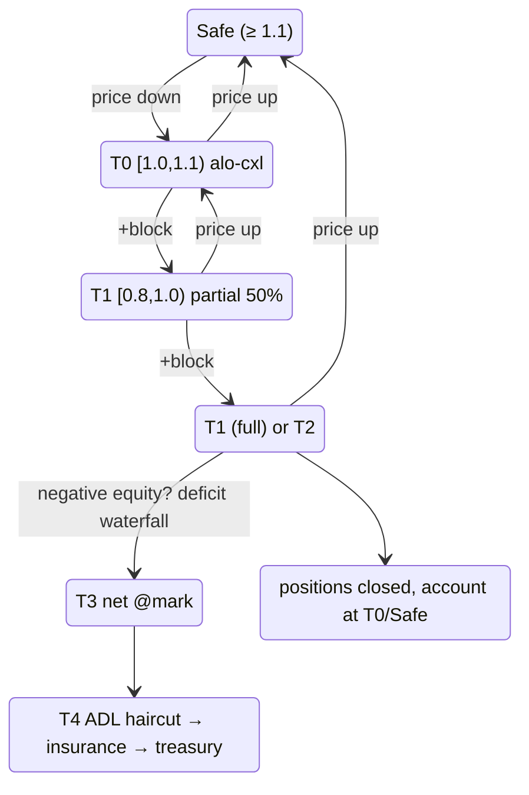

# Tiered liquidation

:::tip
**Stable.**
:::

## TL;DR {#tldr}

A 5-tier ladder driven by `health = account_value / cross_maintenance_margin_used`. Each tier defines what the protocol does as health drops. The [yellow card](#why-a-yellow-card) (T0) is MetaFlux's hysteresis grace period — one block of warning before any position is sold. T4 [ADL](./adl.md) is the last-resort loss mutualisation.

| Tier | Health band | Action | Position touched? |
|------|-------------|--------|---|
| (safe) | `health ≥ 1.1` | Idle | — |
| **T0** | `1.0 ≤ health < 1.1` | **Yellow card**: ALO orders force-cancelled, wallet notified | No |
| **T1** | `0.8 ≤ health < 1.0` | Partial [floored-limit close](#how-a-forced-close-executes-the-price-floor) (50%) — full close if T1 fired within `cooldown_ms` | Yes (50%) or Yes (100%) |
| **T2** | `0.667 ≤ health < 0.8` | Full [floored-limit close](#how-a-forced-close-executes-the-price-floor) | Yes (100%) |
| **T3** | `health < 0.667` | [Metaliquidity vault first](#mlp-first-bite) on a core market, then [netting at mark](#t3-backstop--netting-at-mark) against profitable counter-parties (un-fillable T1/T2 remainders escalate here too) | Yes — taken over or netted, both at mark |
| **T4** | negative equity after T3 | [Deficit waterfall](#t4--the-deficit-waterfall): Metaliquidity vault → ADL haircut → insurance fund → treasury queue | Winners' realized gains haircut |

`account_value` includes unrealised PnL. `cross_maintenance_margin_used` is per-asset baseline (classical) or SPAN-derived (PM-enrolled), and covers the CROSS bucket only — an isolated leg runs its own per-position ladder.

**A [deployed market](../mip/mip-3.md#liquidation) can move these edges.** Its backstop settings
raise the escalation level above the global one, and a market set to `Disabled` never escalates to
T3 at all — it closes on the book and its deficit goes straight to the T4 waterfall. The table above
is the default that every core market uses.

## How tiers are computed {#how-tiers-are-computed}

The bands below are the **literal code constants**, not approximations.

The tier decision takes the account, its account value, its maintenance margin and the block timestamp. It is a **pure decision** — it reads cooldown state but never changes it — and it returns exactly one outcome:

```
if maintenance_margin == 0            → Idle
if account_value < 0                  → Backstop { deficit = maintenance_margin + |account_value| }

health = account_value / maintenance_margin            # Decimal division

if health ≥ 1.1   (yellow_card_threshold)              → Idle            (Safe)
if health ≥ 1.0                                        → YellowCard      (T0)
if health < 0.667 (full_market_floor)                 → Backstop { deficit = maintenance_margin − account_value }   (T3)
if health < 0.8   (partial_threshold)                 → FullMarket { size_to_close = maintenance_margin }           (T2)
# else 0.8 ≤ health < 1.0  (T1):
if partial_cooldown_active(account)                   → FullMarket { size_to_close = maintenance_margin }
else                                                  → PartialMarket50 { size_to_close = maintenance_margin / 2 }
```

| Constant | Value | Symbol |
|----------|-------|--------|
| Yellow-card threshold (T0 top) | `1.1` | `default_yellow_card_threshold` |
| Partial threshold (T1 top) | `0.8` | `default_partial_threshold` |
| Full-market floor (T3 entry) | `0.667` (≈ 2/3) | `full_market_floor` |
| Partial→full cooldown | `30_000 ms` | `DEFAULT_PARTIAL_COOLDOWN_MS` |

- All comparisons are exact fixed-point — no floating point. At account values too large to compare directly, both operands scale down by the same factor first. That leaves the health ratio unchanged, so the chosen tier is the same.
- **Only `PartialMarket50` arms the cooldown** (`record_attempt`); a `FullMarket` or `Backstop` does not block subsequent partials. So the T1 partial→full escalation only fires when a *prior partial* is still inside its 30 s window.
- `size_to_close` for a partial is `maintenance_margin / 2` (integer-truncated). The `deficit` for backstop is `maintenance_margin − account_value` when `account_value ≥ 0`, else `maintenance_margin + |account_value|`.
- The driver evaluates an **incremental dirty set** each block (event-dirtied accounts + a rolling self-heal slice), not a full scan — proven equivalent to a from-scratch scan by fuzz test. T0 accounts get their resting ALO liquidity force-cancelled after classification.

## Liquidation price {#liquidation-price}

Every open leg carries a `liq` price: the mark at which that leg's own health
crosses `1.0` and the tier ladder above puts the account into T0. Read it on
[`account_state`](../api/rest/info.md#account_state), on the position row
(`clearinghouse_state["<dex>"].positions[*].liq`).

The formula differs by margin mode, because each mode measures maintenance
against a different equity pool. Both formulas solve the same question: at
what mark does THIS leg's health reach the tier-ladder boundary, holding
every other reported input at its current value?

### Cross {#liquidation-price-cross}

A cross leg draws on the whole cross bucket, so its liquidation price also
moves with every other cross position's PnL.

```
base_equity = account_value − upnl
liq = entry_px + (cross_maintenance_margin_used − base_equity) / size
```

`upnl` is this leg's own unrealized PnL — subtracting it isolates the part of
`account_value` that does not move with this leg's mark.

| Term | Unit / plane | Where to read it |
|---|---|---|
| `account_value` | whole-USDC, signed | [`account_state`](../api/rest/info.md#account_state) |
| `upnl` | whole-USDC, signed | Same read, this leg's `upnl` |
| `cross_maintenance_margin_used` | whole-USDC | `account_state` with `detail: "margin"` |
| `entry_px` | whole-USDC per whole unit | This leg's `entry` |
| `size` | base units, signed | This leg's `size` — positive long, negative short |

**Single-leg approximation.** The formula holds every OTHER cross leg's PnL
fixed and solves only for where THIS leg's own mark crosses the line. An
account with several cross positions can still be pushed into liquidation by
a move on a different market — one leg's `liq` is not a promise about the
whole account.

Worked example — a leg of size 10, entry notional 1,000 (so `entry_px` =
1,000 / 10 = 100), whose own unrealized PnL (200) is already inside the
account's `account_value` of 1,200, against a `cross_maintenance_margin_used`
of 30:

```
base_equity = 1200 - 200 = 1000
liq = 100 + (30 - 1000) / 10 = 100 - 97 = 3
```

At mark 3, this leg's own move has taken the cross bucket down to exactly its
maintenance requirement.

### Isolated {#liquidation-price-isolated}

An isolated leg is backed only by its own posted bucket, so its liquidation
price never depends on any other position:

```
leg_maint = |entry_notional| × maint_margin_ratio
shift     = leg_maint − isolated_margin        (long)
          = isolated_margin − leg_maint        (short)
liq       = entry_px + shift / |size|
```

`entry_notional` is fixed at the size the leg was opened or last resized —
it is not recomputed from the current mark. A caller does not read
`entry_notional` directly; `entry × |size|` reproduces it to display
rounding only, since the served `entry` price is itself rounded from the
stored notional. `maint_margin_ratio` is the tier-ladder ratio for this
leg's own notional — see [the ladder](#margin-tier-ladder) below.

Worked example — long leg, size 1, entry notional 100 (so `entry_px` = 100),
isolated margin 50, maintenance ratio 3% (the protocol baseline; no ladder
set on this market):

```
leg_maint = 100 × 0.03 = 3
shift     = 3 - 50 = -47
liq       = 100 + (-47) / 1 = 53
```

The same leg, short instead of long, isolated margin still 50:

```
shift = 50 - 3 = 47
liq   = 100 + 47 / 1 = 147
```

A short's liquidation price sits ABOVE entry; a long's sits below it — the
mark has to move against the position either way.

### Zero size, and "no price liquidates this" {#liquidation-price-edge-cases}

- **Flat leg.** A leg with no size carries no position row at all. It is not
  reported with a `null` `liq` — it is absent from `positions[]`.
- **The solve goes negative.** An isolated leg posted more margin than any
  reachable loss can consume (isolated margin 200 against the long leg
  above, for example) solves to a negative price. No non-negative mark
  reaches maintenance, so `liq` reads `null` — never `"0"`. A `"0"` would
  claim the leg liquidates right now; `null` says price alone cannot reach
  it.
- **Rounding.** The division keeps full precision, then the served value is
  truncated toward zero. No half-up rounding anywhere in this calculation.

## The margin-tier ladder {#margin-tier-ladder}

`maint_margin_ratio` is not always one fixed number per market. A market can
carry a **notional-banded ladder**: as a position's own entry notional grows,
its maintenance ratio steps UP (and its allowed leverage steps DOWN). This is
what `maint_margin_ratio` resolves to in the isolated formula above. The cross
formula does not name the ratio: it reads `cross_maintenance_margin_used`, which
a classical account builds by applying each cross leg's own banded ratio to that
leg's `|entry_notional|` and summing. A PM-enrolled account uses its SPAN figure
instead.

**The ladder is governance-set, per market.** Read it from
[`markets_meta`](../api/rest/info/perpetuals.md#markets_meta) (also carried
on `markets`), field `margin_tiers`: an ascending array of
`{max_open_interest, max_leverage, maint_margin_ratio}`. `max_open_interest`
is each tier's upper notional bound; the top tier's is `null` (unbounded).
`maint_margin_ratio` is a basis-points string.

```json
"margin_tiers": [
  { "max_open_interest": "100000",  "max_leverage": 50, "maint_margin_ratio": "100" },
  { "max_open_interest": "500000",  "max_leverage": 20, "maint_margin_ratio": "250" },
  { "max_open_interest": null,      "max_leverage": 5,  "maint_margin_ratio": "1000" }
]
```

**Selection rule: the highest tier whose lower bound does not exceed the
position's own entry notional.** A market with no ladder set still answers
with one tier, built from its flat maintenance ratio and max leverage — every
market always has a ladder to read, even a one-tier one.

**The notional that selects the tier is the leg's own `|entry_notional|`** —
the same fixed figure the liquidation-price formulas above use, not the
position's live mark-to-market notional. A position does not jump to a
harsher tier purely because the mark moved; it moves tiers only when it is
opened or resized at a new notional.

Governance can move these bands at any time. Treat today's numbers as a
snapshot: read `margin_tiers` fresh rather than caching it across a session.

## How a forced close executes (the price floor) {#how-a-forced-close-executes-the-price-floor}

A T1/T2 forced close is **never a market sweep**. It executes as an IOC LIMIT
order bounded off the committed mark:

```
sell (long leg):      limit = mark × (1 − liq_floor)
buy-back (short leg): limit = mark × (1 + liq_floor)
```

- `liq_floor` is a per-market risk parameter; **by default it is half the
  market's maintenance ratio** (a 5% maintenance market floors execution 2.5%
  off mark). The maintenance ratio is calibrated to cover liquidation slippage
  plus fees, so the floor guarantees a forced close can never realize more
  slippage than the buffer was sized for.
- The slice fills only at prices at-or-inside the floor. **Whatever cannot
  fill above the floor is NOT sold into a thin book** — it escalates to the
  T3 backstop queue immediately. This is the anti-cascade bound: a forced
  close cannot depress the mark beyond the floor, so it cannot sweep other
  accounts into liquidation.
- Fills settle through the **same settlement path as a normal fill**: realized
  PnL hits the account, open interest moves, the counterparty's maker side
  settles normally.
- A **liquidation fee** (default 50 bps of the closed notional, per-market
  configurable) is charged from the account's remaining positive equity — it
  never creates a deficit — and is credited to the insurance fund, which is
  exactly the pool that absorbs backstop shortfalls.
- The account's **own resting orders on the opposite side are cancelled, not
  self-filled** (a self-fill would re-open what the close just closed).

Partial (T1) sizing is 50% of the targeted leg on core markets;
builder-deployed markets can configure a health-decayed ramp (close a small
slice just under the maintenance line, larger slices only as health sinks,
capped per market) plus the 30 s cooldown between slices.

## The full state machine {#the-full-state-machine}


```mermaid
stateDiagram-v2
    Safe : Safe (≥ 1.1)
    T0 : T0 [1.0,1.1) alo-cxl
    T1 : T1 [0.8,1.0) partial 50%
    T1full : T1 (full) or T2
    T3 : T3 net @mark
    T4 : T4 ADL haircut → insurance → treasury
    closed : positions closed, account at T0/Safe

    T0 --> Safe : price up
    T1 --> T0 : price up
    T1full --> Safe : price up

    Safe --> T0 : price down
    T0 --> T1 : +block
    T1 --> T1full : +block

    T1full --> closed
    T1full --> T3 : negative equity? deficit waterfall
    T3 --> T4
```

`cooldown_ms` defaults to `30 s`. Within a cooldown window, a re-entry to T1 escalates to full close.

## Why a yellow card {#why-a-yellow-card}

Most public derivatives chains transition straight from "healthy" to "partial close". A volatility spike that knocks health from 1.5 to 0.95 in one tick triggers a forced sale, which depresses the mark, which sweeps more accounts into the same tier. The cascade is the dominant source of liquidation pain in observed events.

T0 is a **one-block hysteresis layer**. You enter the band; the chain freezes your resting open orders (ALO only — see below) and notifies your client, but nothing of yours is sold. You have until the next consensus block to:

- top up margin via `Deposit` (or `UpdateIsolatedMargin` to add to a bucket),
- close part of the position manually,
- or do nothing — in which case T1 fires on the next eval.

The grace window is exactly **one committed block** — short but deterministic, and large enough for an automated risk process to react. Block cadence is a governed, per-deployment target, not a fixed duration; measure your own deployment's committed-round rate if your risk process needs a wall-clock reaction budget.

### Why only ALO orders get cancelled {#why-only-alo-orders-get-cancelled}

| Order TIF | Cancelled at T0? | Reason |
|-----------|:----------------:|-------|
| `Alo` | yes | Pure-rest, no fee earned; capital better deployed defending position |
| `Gtc` (active limit) | no | May be your active price discovery; killing it could trade you down further |
| `Ioc` (in-flight) | n/a | Resolves at admit; never rests |
| Trigger (StopLoss / TakeProfit) | no | Often exactly the defense you want firing |

The intent: free locked capital from passive rest, preserve your active risk decisions.

## T1 partial / full transition {#t1-partial--full-transition}

T1 starts as a 50% partial close. Cooldown logic:

- **First T1 fire**: 50% close. `cooldown_armed_at = now`.
- **If health back in T0/Safe** before `cooldown_armed_at + cooldown_ms`: cooldown disarms naturally as soon as we leave T1.
- **If health stays in T1** for `cooldown_ms`: next T1 eval escalates to **full** close instead of another partial.
- Cooldown does NOT re-arm on T2 or T3.

```
T = 0       T1 fire #1, 50% close, cooldown armed
T = 5s      mark slips further, still in T1
T = 20s     mark recovers slightly; in T0
T = 31s     cooldown elapsed (would have escalated, but we're not in T1)
            account considered T0/Safe; cooldown reset
```

Versus:

```
T = 0       T1 fire #1, 50% close
T = 5s      still T1
T = 30s     STILL T1 (cooldown elapses while in T1)
T = 30s+    T1 fire #2 → full close
```

The cooldown is *not* a no-op zone — T1 keeps firing partials. Cooldown only governs the partial → full upgrade.

### Worked example {#worked-example}

Account: one CROSS leg, long 1 BTC at entry 100, against 20 USDC of settled
cross equity, on a market whose maintenance ratio is 5%.

The ladder below is the CROSS rule. An isolated leg does NOT walk these
tiers: it has one threshold, and the whole leg closes when its own bucket
reaches maintenance. No yellow card, no 50% partial, no cooldown.

**`maint` does not move as the mark moves.** It is `entry_notional x
maint_margin_ratio`, and `entry_notional` is the cost basis of the open lots —
fixed when you opened. Only `account_value` falls. This is the single most
common mistake when a caller reproduces the ladder: computing `maint` from the
CURRENT mark understates it on a losing position, so it predicts liquidation
LATER than the chain does.

Here `entry_notional` is 100, so `maint = 100 x 0.05 = 5` on every line until
the position size changes.

```
mark = 100   account_value = 20 + 0 = 20    maint = 5   health = 4.0  → Safe
mark = 90    account_value = 20 - 10 = 10   maint = 5   health = 2.0  → Safe
mark = 85.5  account_value = 20 - 14.5 = 5.5 maint = 5  health = 1.1  → Safe (the T0 edge)
mark = 85    account_value = 20 - 15 = 5    maint = 5   health = 1.0  → T0 (alo cancel)
mark = 84.5  account_value = 20 - 15.5 = 4.5 maint = 5  health = 0.9  → T1
mark = 84    account_value = 20 - 16 = 4    maint = 5   health = 0.8  → T1
                  T1 fire: close 0.5 BTC at mark 84
                  realised PnL: -8 (closed 0.5 BTC, entry 100, exit 84)
                  bucket: 20 - 8 = 12
                  remaining position: 0.5 BTC long entry 100, mark 84
                  entry_notional falls with the size: 100 x 0.5 = 50
                  maint = 50 x 0.05 = 2.5
                  account_value = 12 - 8 = 4 (unrealised -8 on 0.5 BTC)
                  health = 4 / 2.5 = 1.6 → back to Safe
```

A 50% partial restored health from 0.8 (T1) to 1.6 (Safe). The intent of a
partial close is to right-size the position so the remaining bucket can carry
the smaller exposure. A close reduces `entry_notional` in proportion to the
size it removes, so `maint` falls with it.

If the 50% close doesn't restore health (deeper rout), a second T1 fire within cooldown would escalate:

```
mark = 84    T1 fire partial: 0.5 BTC closed, health → 1.6
mark = 80    health = 2 / 2.5 = 0.8 again (still in T1, cooldown active)
              T1 escalates to full close: remaining 0.5 BTC closed at 80
              realised PnL: -10
              bucket: 12 - 10 = 2
              position: 0
              account closed cleanly with 2 USDC remaining; insurance untouched
```

## T3 backstop — netting at mark {#t3-backstop--netting-at-mark}

Below `health = 0.667` (≈2/3 of maintenance) the chain stops trying the book.
The position — and any forced-close lots the book could not absorb inside the
[price floor](#how-a-forced-close-executes-the-price-floor) — is **netted at
the committed MARK** against the most-profitable opposite-side positions on
the same instrument (highest unrealized PnL first, deterministic tiebreak):

```
when account enters T3 (or parked un-fillable lots exist):
   match its position lots against profitable opposite-side holders
   close BOTH sides at MARK              # no book interaction, no price impact
   both sides realise PnL at that mark   # value-neutral: equity unchanged
                                         # by the netting itself
   lots with no profitable counterparty stay parked for the next block
```

Counterparties drafted into the netting keep **every cent of PnL** (realized
at mark) — they only lose the open position. No fee is charged on either side.
A netting without a usable mark price, or without any profitable opposite
side, simply waits — the chain never force-sells into an empty book.

### The Metaliquidity vault takes the first bite {#mlp-first-bite}

**Live on the core markets since 2026-08-18.** Before the netting runs, the
protocol's [Metaliquidity vault](./vaults.md#metaliquidity-vault) takes over as
much of the dying position as its bounded capacity allows. The takeover strikes
at the **same committed mark** the netting uses, so the dying account realizes at
that mark either way. Only what the vault declines reaches the netting.

Two bounds cap what the vault takes. Governance sets both and can move either, so
treat the values below as today's, not as constants. Neither is served on a public
read:

| Bound | Value today | What it limits |
|-------|-------------|----------------|
| Equity fraction | **40%** of the vault's live NAV | ONE takeover. Inventory the vault already holds is subtracted, so the ceiling shrinks as it absorbs — but a deficit it merely covers records nothing, so a sequence of those is NOT bounded by this row |
| Per-block cap | **100,000 USDC** | Everything the vault absorbs in ONE block, across every failing account. It bounds a correlated cascade; it does not bound a drain spread over many blocks |

**Read the two rows together.** Each bounds an episode, not a lifetime. Neither is
served on a public read, so treat both as governance values that can move.

**Core markets only.** A [builder-deployed market](../mip/mip-3.md#liquidation)
is refused at both entry points, whether or not it prices from its own deployer
oracle. Its bad debt can never reach vault depositors; it is handled by that
market's own backstop settings and then by the waterfall.

What this changes for you:

- **A profitable counter-party** is drafted into the netting less often, because
  the vault absorbs first and there is less left to net.
- **A [Metaliquidity](./vaults.md#metaliquidity-vault) depositor** is now the
  first-loss taker on the core markets. The vault is paid for it: by default it
  keeps **70%** of the liquidation fee on the notional it takes, and the
  insurance fund keeps the rest.
- **Nothing changes for a trader on a deployed market.** The vault is not in
  that path at all.

## T4 — the deficit waterfall {#t4--the-deficit-waterfall}

If the account is flat everywhere and its equity is **negative**, that bad
debt is socialized in a fixed order (ADL **before** the insurance fund — the
deleveraged winners' realized gains absorb first, which keeps the fund for
genuine tail events):

1. **Metaliquidity vault** — on a **core** market only, the vault pays the
   deficit first, inside the same bounds as [the first
   bite](#mlp-first-bite). Live since 2026-08-18. A
   [builder-deployed market](../mip/mip-3.md#liquidation) skips this step.
2. **ADL haircut** — an adaptive severity controller claws back up to the
   gains the netting counterparties **just realized** (never more than they
   received, and never unrealized paper PnL).
3. **Insurance fund** — auto-absorbs the remainder (this is the pool the
   [liquidation fee](#how-a-forced-close-executes-the-price-floor) feeds).
4. **Treasury reserve** — whatever is left queues for a multisig-authorized
   treasury draw (human-in-the-loop, last resort).

The account's negative balance is then zeroed — the debt lives in the
waterfall. See [ADL](./adl.md) for the controller math.

## Two-point margin check {#two-point-margin-check}

Liquidation eligibility is checked at **two points** during each block:

1. **Begin-block**, after mark prices update — catches accounts that just slid into a lower tier from a price move alone.
2. **Post-action**, after each `Order` / `Cancel` / `Withdraw` from this account — catches accounts that walked themselves into a lower tier (e.g. withdrawing too much collateral).

This prevents "free" intra-block manipulation where a user adds risk between begin-block and the rest of the block.

## Recovery patterns {#recovery-patterns}

| Scenario | Strategy |
|----------|----------|
| Headed for T0 | Top up via `UpdateIsolatedMargin` (Isolated) or `Deposit` (Cross). Pre-position trigger orders before stress. |
| Already at T0 | Same. ALO orders are already cancelled; place fresh limits at protective levels. |
| Bouncing in/out of T0 | Tighten your internal ratio alert toward `1.2` (the derived ratio from `account_value` / `cross_maintenance_margin_used` — see [two meanings of health](#two-meanings-of-health), not the wire `health` field). Look at what's driving it — funding payment? mark band edge? oracle outage? |
| T1 partial just fired | Re-eval. Position is 50% smaller; consider closing the remainder voluntarily before cooldown's full-close escalation. |
| Repeated T1 cooldown traps | The position size is wrong for the bucket. Don't refill the bucket without also resizing. |

## Two meanings of "health" {#two-meanings-of-health}

The word **health** names two different quantities, and mixing them up
produces alerts that never fire.

1. **The tier-decision ratio.** The engine above computes
   `health = account_value / maintenance_margin` and compares that RATIO
   against the yellow-card / partial / full-market thresholds. This ratio
   decides your tier. No read returns it as its own field — derive it
   yourself from `account_value` and `cross_maintenance_margin_used`. Both are
   on [`account_state` with `detail: "margin"`](../api/rest/info.md#account_state);
   the full `account_state` carries `account_value` but NOT the maintenance
   figure, so the ratio needs the margin depth.
2. **The wire `health` field.** The `health` field that `account_state` and
   `account_state` actually returns is a signed DOLLAR DIFFERENCE —
   `account_value − cross_maintenance_margin_used` — not a ratio. A healthy account can show a
   large positive dollar figure; it does not sit near `1.0`.

**Never compare the wire `health` field against a ratio-scale threshold**
such as `1.1` or `1.2` — it is dollars, so the comparison is meaningless. To
track the tier decision instead:

- read the `tier` field directly (`Safe` / `T0` / `T1` / `T2` / `T3`, on
  `account_state` and every
  [`notifications`](../api/ws/subscriptions.md#notifications) record), or
- compute the ratio yourself from `account_value` / `cross_maintenance_margin_used`.

The yellow-card / partial / full-market thresholds are governance-tunable
per-market parameters, not fixed forever. The `tier` field always reflects
whichever thresholds are currently live, so prefer reading it over
hardcoding a ratio boundary in your own alerting.

## How to stay clear {#how-to-stay-clear}

- Watch `account_value` and `cross_maintenance_margin_used` via [`account_state` with `detail: "margin"`](../api/rest/info.md#account_state) queries and derive your own ratio from them — see [two meanings of health](#two-meanings-of-health) above; the wire `health` field is a dollar figure, not this ratio.
- Set an internal alert when your derived ratio drops under `1.2` — comfortably above the yellow-card entry.
- For automated strategies, register a [risk-watcher bot](../integration/risk-watcher.md) to deposit when your `tier` crosses a threshold.
- Watch [`notifications`](../api/ws/subscriptions.md#notifications) on the WS feed for immediate tier transitions (`yellow_card` / `forced_close_tier` / `tier_cleared` / `forced_close`), and [`account_state`](../api/ws/subscriptions.md#account_state) for the continuous margin values.

## Edge cases {#edge-cases}

<details>
<summary>Show edge cases</summary>

- **Mark price band engaged.** During mark-band activation, liquidation evals still fire — but against the banded mark. The book might be at a worse price than mark allows the protocol to recognise. Practically: an adversarial spike that the band clamps does NOT instantly liquidate you; your health is computed against the clamped mark.
- **Funding payment crosses tier boundary.** A funding payment shrinks `account_value`. If you're at `health = 1.05` and a 0.1% funding charge knocks you to 0.99, T1 fires on the same block. Watch funding cadence relative to your buffer.
- **Two concurrent T1 fires across assets (Cross).** Both partials happen in the same block. Order: alphabetical by asset name (deterministic across validators). Insurance and ADL eligibility apply per asset.
- **T0 enter then exit before next block.** Possible if your client tops up margin in the same block (begin-block T0 → user-action `Deposit` → post-action check passes T0). ALO orders that were cancelled at begin-block stay cancelled; nothing automatically re-creates them.

</details>

## See also {#see-also}

- [Portfolio margin](./portfolio-margin.md) — opt-in cross-asset margin reduces baseline maintenance
- [ADL allocation algorithm](./adl.md) — math behind T4
- [Margin modes](./margin-modes.md) — Cross / Isolated / Strict-Iso scopes the ladder
- [Mark prices](./mark-prices.md) — what drives health
- [`notifications` WS channel](../api/ws/subscriptions.md#notifications) — tier transitions ride this channel
- [Risk-watcher pattern](../integration/risk-watcher.md) — automated margin top-up

## FAQ {#faq}

<details>
<summary>Show FAQ</summary>

**Q: Can I manually trigger T1 on someone else?**
A: No. Liquidation is consensus-derived against committed mark + account state. There's no "liquidate" action a user can submit; the protocol fires from its own logic at begin-block / post-action checkpoints.

**Q: What's the lowest health I can ride into a yellow card and come out clean?**
A: T0 fires at `1.0 ≤ health < 1.1`. If you re-enter Safe (`health ≥ 1.1`) before the next eval, ALO orders are NOT re-created (you need to resubmit them) but no further T0 action fires.

**Q: Is there a way to opt out of T1 (force it to skip partial → full)?**
A: No. T1 always tries partial first. Submit a manual close at T0 if you want full unwind on your own terms.

**Q: How is the closing price determined at T1/T2?**
A: An IOC **limit** at the prevailing book, floored at `mark × (1 ∓ liq_floor)` — see [the price floor](#how-a-forced-close-executes-the-price-floor). Realized slippage is bounded by the floor (default: half the maintenance ratio); anything the book cannot absorb inside the floor escalates to the backstop instead of sweeping deeper levels.

</details>
