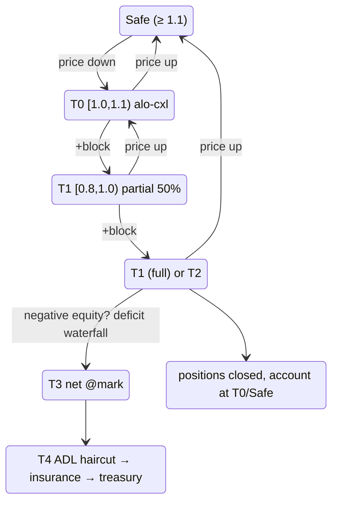

# Tiered liquidation

This page describes the five-tier ladder that the chain uses to liquidate an account as its health
falls.

:::tip
**Stable.**
:::

## Overview {#tldr}

The liquidation ladder has five tiers. `health = account_value / cross_maintenance_margin_used`
drives it. Each tier defines what the protocol does as health falls. The
[yellow card](#why-a-yellow-card) (T0) is a hysteresis grace period: the account gets one block
of warning before the chain sells any position. T4 [ADL](./adl.md) is the last-resort loss
mutualization.

| Tier | Health band | Action | Position touched? |
|------|-------------|--------|---|
| (safe) | `health ≥ 1.1` | Idle | — |
| **T0** | `1.0 ≤ health < 1.1` | Yellow card: the chain cancels ALO orders and notifies the wallet | No |
| **T1** | `0.8 ≤ health < 1.0` | Partial [floored-limit close](#how-a-forced-close-executes-the-price-floor) (50%). Full close if T1 fired within `cooldown_ms` | Yes (50%) or Yes (100%) |
| **T2** | `0.667 ≤ health < 0.8` | Full [floored-limit close](#how-a-forced-close-executes-the-price-floor) | Yes (100%) |
| **T3** | `health < 0.667` | [Metaliquidity vault first](#mlp-first-bite) on a core market, then [netting at mark](#t3-backstop--netting-at-mark) against profitable counterparties. T1 and T2 remainders that cannot fill also escalate here | Yes. Taken over or netted, both at mark |
| **T4** | negative equity after T3 | [Deficit waterfall](#t4--the-deficit-waterfall): Metaliquidity vault, then ADL haircut, then insurance fund, then treasury queue | Winners' realized gains haircut |

`account_value` includes unrealized PnL. `cross_maintenance_margin_used` is the per-asset
baseline (classical) or SPAN-derived (PM-enrolled). It covers the cross bucket only. An isolated
leg runs its own ladder for each position.

A [deployed market](../mip/mip-3.md#liquidation) can move these edges. Its backstop settings
raise the escalation level above the global level. A market set to `Disabled` never escalates to
T3. It closes on the book, and its deficit goes straight to the T4 waterfall. The table above is
the default that every core market uses.

## Tier computation {#how-tiers-are-computed}

The bands below are the exact constants in the code. They are not approximations.

The tier decision takes the account, its account value, its maintenance margin and the block
timestamp. It is a pure decision: it reads cooldown state but never changes it. It returns
exactly one outcome:

```
if maintenance_margin == 0            → Idle
if account_value < 0                  → Backstop { deficit = maintenance_margin + |account_value| }

health = account_value / maintenance_margin            # Decimal division

if health ≥ 1.1   (yellow_card_threshold)              → Idle            (Safe)
if health ≥ 1.0                                        → YellowCard      (T0)
if health < 0.667 (full_market_floor)                 → Backstop { deficit = maintenance_margin − account_value }   (T3)
if health < 0.8   (partial_threshold)                 → FullMarket { size_to_close = maintenance_margin }           (T2)
# else 0.8 ≤ health < 1.0  (T1):
if partial_cooldown_active(account)                   → FullMarket { size_to_close = maintenance_margin }
else                                                  → PartialMarket50 { size_to_close = maintenance_margin / 2 }
```

| Constant | Value | Symbol |
|----------|-------|--------|
| Yellow-card threshold (T0 top) | `1.1` | `default_yellow_card_threshold` |
| Partial threshold (T1 top) | `0.8` | `default_partial_threshold` |
| Full-market floor (T3 entry) | `0.667` (≈ 2/3) | `full_market_floor` |
| Partial-to-full cooldown | `30_000 ms` | `DEFAULT_PARTIAL_COOLDOWN_MS` |

- All comparisons use exact fixed-point math, with no floating point. When account values are too
  large to compare directly, both operands first scale down by the same factor. The health ratio
  does not change, so the chosen tier is the same.
- Only `PartialMarket50` arms the cooldown (`record_attempt`). A `FullMarket` or `Backstop` does
  not block later partials. So the T1 escalation from partial to full fires only when a *prior
  partial* is still inside its 30 s window.
- `size_to_close` for a partial is `maintenance_margin / 2`, truncated to an integer. The
  `deficit` for a backstop is `maintenance_margin − account_value` when `account_value ≥ 0`, else
  `maintenance_margin + |account_value|`.
- Each block, the driver evaluates an incremental dirty set: the accounts that events marked
  dirty, plus a rolling self-heal slice. It does not scan every account. A fuzz test proves that
  this is equal to a scan from scratch. After classification, the chain cancels the resting ALO
  liquidity of T0 accounts.

## Liquidation price {#liquidation-price}

Every open leg carries a `liq` price. It is the mark at which that leg's own health crosses `1.0`
and the tier ladder above puts the account into T0. Read it on
[`clearinghouse_state`](../api/rest/info/account.md#clearinghouse_state), on the position row
(`clearinghouse_state["<dex>"].positions[*].liq`).

The formula differs by margin mode, because each mode measures maintenance against a different
equity pool. Both formulas find the mark at which this leg's health reaches the tier-ladder
boundary, with every other reported input held at its current value.

### Cross {#liquidation-price-cross}

A cross leg draws on the whole cross bucket. So its liquidation price also moves with the PnL of
every other cross position.

```
base_equity = account_value − upnl
liq = entry_px + (cross_maintenance_margin_used − base_equity) / size
```

`upnl` is this leg's own unrealized PnL. Subtracting it isolates the part of `account_value` that
does not move with this leg's mark.

| Term | Unit / plane | Where to read it |
|---|---|---|
| `account_value` | whole-USDC, signed | [`account_state`](../api/rest/info/account.md#account_state) |
| `upnl` | whole-USDC, signed | Same read, this leg's `upnl` |
| `cross_maintenance_margin_used` | whole-USDC | `account_state` with `detail: "margin"` |
| `entry_px` | whole-USDC per whole unit | This leg's `entry` |
| `size` | base units, signed | This leg's `size`. Positive for long, negative for short |

**Single-leg approximation.** The formula holds the PnL of every other cross leg fixed. It solves
only for the mark at which this leg crosses the line. An account with several cross positions can
still go into liquidation from a move on a different market. One leg's `liq` is not a promise
about the whole account.

Worked example: a leg of size 10 with entry notional 1,000, so `entry_px` = 1,000 / 10 = 100. Its
own unrealized PnL (200) is already inside the account's `account_value` of 1,200. The
`cross_maintenance_margin_used` is 30:

```
base_equity = 1200 - 200 = 1000
liq = 100 + (30 - 1000) / 10 = 100 - 97 = 3
```

At mark 3, this leg's own move has taken the cross bucket down to exactly its maintenance
requirement.

### Isolated {#liquidation-price-isolated}

An isolated leg is backed only by its own posted bucket. So its liquidation price never depends
on any other position:

```
leg_maint = |entry_notional| × maint_margin_ratio
shift     = leg_maint − isolated_margin        (long)
          = isolated_margin − leg_maint        (short)
liq       = entry_px + shift / |size|
```

`entry_notional` is fixed at the size when the leg was opened or last resized. The chain does not
recompute it from the current mark. A caller cannot read `entry_notional` directly.
`entry × |size|` reproduces it only to display rounding, because the served `entry` price is
itself rounded from the stored notional. `maint_margin_ratio` is the tier-ladder ratio for this
leg's own notional. See [the ladder](#margin-tier-ladder) below.

Worked example: a long leg of size 1 and entry notional 100, so `entry_px` = 100. The isolated
margin is 50. The maintenance ratio is 3%, the protocol baseline, because this market has no
ladder set:

```
leg_maint = 100 × 0.03 = 3
shift     = 3 - 50 = -47
liq       = 100 + (-47) / 1 = 53
```

The same leg as a short, with isolated margin still 50:

```
shift = 50 - 3 = 47
liq   = 100 + 47 / 1 = 147
```

A short's liquidation price is above entry. A long's is below entry. Either way, the mark must
move against the position.

### Edge cases of the liquidation price {#liquidation-price-edge-cases}

- **Flat leg.** A leg with no size has no position row. It is not reported with a `null` `liq`.
  It is absent from `positions[]`.
- **Negative solve.** An isolated leg can post more margin than any reachable loss can use. For
  example, isolated margin 200 on the long leg above solves to a negative price. No non-negative
  mark reaches maintenance, so `liq` reads `null`, never `"0"`. A `"0"` would claim that the leg
  liquidates now. `null` says that price alone cannot reach it.
- **Rounding.** The division keeps full precision. The chain then truncates the served value
  toward zero. No step in this calculation rounds half-up.

## Margin-tier ladder {#margin-tier-ladder}

`maint_margin_ratio` is not always one fixed number per market. A market can carry a
*notional-banded ladder*. As a position's own entry notional grows, its maintenance ratio steps up
and its allowed leverage steps down. This is the value of `maint_margin_ratio` in the isolated
formula above.

The cross formula does not name the ratio. It reads `cross_maintenance_margin_used`. A classical
account builds that value from each cross leg: it applies the leg's own banded ratio to the leg's
`|entry_notional|`, and sums the results. A PM-enrolled account uses its SPAN figure instead.

Governance sets the ladder per market. Read it from
[`markets_meta`](../api/rest/info/perpetuals.md#markets_meta) (also carried on `markets`), field
`margin_tiers`. It is an ascending array of `{max_open_interest, max_leverage, maint_margin_ratio}`.
`max_open_interest` is the upper notional bound of each tier. The top tier's bound is `null`
(unbounded). `maint_margin_ratio` is a basis-points string.

```json
"margin_tiers": [
  { "max_open_interest": "100000",  "max_leverage": 50, "maint_margin_ratio": "100" },
  { "max_open_interest": "500000",  "max_leverage": 20, "maint_margin_ratio": "250" },
  { "max_open_interest": null,      "max_leverage": 5,  "maint_margin_ratio": "1000" }
]
```

The chain selects the highest tier whose lower bound does not exceed the position's own entry
notional. A market with no ladder still answers with one tier, built from its flat maintenance
ratio and max leverage. So every market always has a ladder to read, even if it has one tier.

The notional that selects the tier is the leg's own `|entry_notional|`. It is the same fixed
figure that the liquidation-price formulas above use. It is not the position's current
mark-to-market notional. A position does not move to a harsher tier only because the mark moved.
It moves tiers only when it is opened or resized at a new notional.

Governance can move these bands at any time. Treat today's numbers as a snapshot. Read
`margin_tiers` fresh, and do not cache it across a session.

## Forced close and the price floor {#how-a-forced-close-executes-the-price-floor}

A T1 or T2 forced close is never a market sweep. It executes as an IOC limit order, bounded from
the committed mark:

```
sell (long leg):      limit = mark × (1 − liq_floor)
buy-back (short leg): limit = mark × (1 + liq_floor)
```

- `liq_floor` is a per-market risk parameter. By default it is half the market's maintenance
  ratio, so a market with 5% maintenance floors execution 2.5% from the mark. The maintenance
  ratio is calibrated to cover liquidation slippage plus fees. So the floor guarantees that a
  forced close can never realize more slippage than the buffer was sized for.
- The slice fills only at prices at or inside the floor. The chain does not sell what cannot fill
  above the floor into a thin book. That part escalates to the T3 backstop queue at once. This is
  the anti-cascade bound: a forced close cannot push the mark past the floor, so it cannot sweep
  other accounts into liquidation.
- Fills settle through the same settlement path as a normal fill. Realized PnL goes to the
  account, open interest moves, and the maker side of the counterparty settles as normal.
- A **liquidation fee** (default 50 bps of the closed notional, configurable per market) is
  charged from the account's remaining positive equity. It never creates a deficit. The chain
  credits it to the insurance fund, which is the pool that absorbs backstop shortfalls.
- The chain cancels the account's own resting orders on the opposite side. It does not fill them
  against the close, because a self-fill would reopen what the close just closed.

T1 partial sizing is 50% of the targeted leg on core markets. Builder-deployed markets can
configure a ramp that decays with health. The ramp closes a small slice just under the
maintenance line, and larger slices only as health falls, capped per market. These markets also
keep the 30 s cooldown between slices.

## State machine {#the-full-state-machine}


```mermaid
stateDiagram-v2
    Safe : Safe (≥ 1.1)
    T0 : T0 [1.0,1.1) alo-cxl
    T1 : T1 [0.8,1.0) partial 50%
    T1full : T1 (full) or T2
    T3 : T3 net @mark
    T4 : T4 ADL haircut → insurance → treasury
    closed : positions closed, account at T0/Safe

    T0 --> Safe : price up
    T1 --> T0 : price up
    T1full --> Safe : price up

    Safe --> T0 : price down
    T0 --> T1 : +block
    T1 --> T1full : +block

    T1full --> closed
    T1full --> T3 : negative equity? deficit waterfall
    T3 --> T4
```

`cooldown_ms` defaults to `30 s`. Within a cooldown window, a new entry to T1 escalates to a full
close.

## Yellow card {#why-a-yellow-card}

Most public derivatives chains go straight from "healthy" to "partial close". A volatility spike
can move health from 1.5 to 0.95 in one tick. That triggers a forced sale, which pushes the mark
down, which sweeps more accounts into the same tier. In observed events, this cascade is the main
source of liquidation losses.

T0 is a one-block hysteresis layer. When you enter the band, the chain freezes your resting open
orders (ALO only, see below) and notifies your client. It sells nothing of yours. Until the next
consensus block, you can:

- add margin with `Deposit`, or with `UpdateIsolatedMargin` to add to a bucket
- close part of the position yourself
- do nothing, and T1 fires on the next evaluation

The grace window is exactly one committed block. It is short but deterministic, and long enough
for an automated risk process to react. Block cadence is a governed target for each deployment,
not a fixed duration. If your risk process needs a reaction budget in wall-clock time, measure the
committed-round rate of your own deployment.

### ALO cancels at T0 {#why-only-alo-orders-get-cancelled}

| Order TIF | Cancelled at T0? | Reason |
|-----------|:----------------:|-------|
| `Alo` | yes | Rests only and earns no fee. The capital is better used to defend the position |
| `Gtc` (active limit) | no | Can be your active price discovery. Cancelling it could trade you down further |
| `Ioc` (in-flight) | n/a | Resolves at admission. Never rests |
| Trigger (StopLoss / TakeProfit) | no | Often the exact defense you want to fire |

The intent is to free capital locked in passive orders and to keep your active risk decisions.

## T1 partial and full close {#t1-partial--full-transition}

T1 starts as a 50% partial close. The cooldown works like this:

- **First T1 fire.** The chain closes 50%. `cooldown_armed_at = now`.
- **Health back in T0 or Safe before `cooldown_armed_at + cooldown_ms`.** The cooldown disarms as
  soon as the account leaves T1.
- **Health stays in T1 for `cooldown_ms`.** The next T1 evaluation escalates to a full close
  instead of another partial.
- **T2 or T3.** The cooldown does not re-arm.

```
T = 0       T1 fire #1, 50% close, cooldown armed
T = 5s      mark slips further, still in T1
T = 20s     mark recovers slightly; in T0
T = 31s     cooldown elapsed (would have escalated, but we're not in T1)
            account considered T0/Safe; cooldown reset
```

Compare:

```
T = 0       T1 fire #1, 50% close
T = 5s      still T1
T = 30s     STILL T1 (cooldown elapses while in T1)
T = 30s+    T1 fire #2 → full close
```

The cooldown is not a zone where nothing happens. T1 keeps firing partials. The cooldown governs
only the upgrade from partial to full.

### Worked example {#worked-example}

The account has one cross leg: long 1 BTC at entry 100, against 20 USDC of settled cross equity.
The market's maintenance ratio is 5%.

The ladder below is the cross rule. An isolated leg does not walk these tiers. It has one
threshold, and the whole leg closes when its own bucket reaches maintenance. It has no yellow
card, no 50% partial and no cooldown.

`maint` does not move as the mark moves. It is `entry_notional x maint_margin_ratio`, and
`entry_notional` is the cost basis of the open lots, fixed when you opened them. Only
`account_value` falls. When callers reproduce the ladder, the most common mistake is to compute
`maint` from the current mark. On a losing position that understates `maint`, so it predicts
liquidation later than the chain does.

Here `entry_notional` is 100, so `maint = 100 x 0.05 = 5` on every line until the position size
changes.

```
mark = 100   account_value = 20 + 0 = 20    maint = 5   health = 4.0  → Safe
mark = 90    account_value = 20 - 10 = 10   maint = 5   health = 2.0  → Safe
mark = 85.5  account_value = 20 - 14.5 = 5.5 maint = 5  health = 1.1  → Safe (the T0 edge)
mark = 85    account_value = 20 - 15 = 5    maint = 5   health = 1.0  → T0 (alo cancel)
mark = 84.5  account_value = 20 - 15.5 = 4.5 maint = 5  health = 0.9  → T1
mark = 84    account_value = 20 - 16 = 4    maint = 5   health = 0.8  → T1
                  T1 fire: close 0.5 BTC at mark 84
                  realised PnL: -8 (closed 0.5 BTC, entry 100, exit 84)
                  bucket: 20 - 8 = 12
                  remaining position: 0.5 BTC long entry 100, mark 84
                  entry_notional falls with the size: 100 x 0.5 = 50
                  maint = 50 x 0.05 = 2.5
                  account_value = 12 - 8 = 4 (unrealised -8 on 0.5 BTC)
                  health = 4 / 2.5 = 1.6 → back to Safe
```

A 50% partial took health from 0.8 (T1) back to 1.6 (Safe). A partial close sets the position to
a size that the remaining bucket can carry. A close reduces `entry_notional` in proportion to the
size it removes, so `maint` falls with it.

If the 50% close does not restore health, as in a deeper fall, a second T1 fire within the
cooldown escalates:

```
mark = 84    T1 fire partial: 0.5 BTC closed, health → 1.6
mark = 80    health = 2 / 2.5 = 0.8 again (still in T1, cooldown active)
              T1 escalates to full close: remaining 0.5 BTC closed at 80
              realised PnL: -10
              bucket: 12 - 10 = 2
              position: 0
              account closed cleanly with 2 USDC remaining; insurance untouched
```

## T3 backstop netting at mark {#t3-backstop--netting-at-mark}

Below `health = 0.667` (≈2/3 of maintenance), the chain stops using the book. It nets the
position at the committed mark against the most profitable opposite-side positions on the same
instrument. This also applies to any forced-close lots that the book could not absorb inside the
[price floor](#how-a-forced-close-executes-the-price-floor). The order is highest unrealized PnL
first, with a deterministic tiebreak:

```
when account enters T3 (or parked un-fillable lots exist):
   match its position lots against profitable opposite-side holders
   close BOTH sides at MARK              # no book interaction, no price impact
   both sides realise PnL at that mark   # value-neutral: equity unchanged
                                         # by the netting itself
   lots with no profitable counterparty stay parked for the next block
```

Counterparties drawn into the netting keep all their PnL, realized at mark. They lose only the
open position. Neither side pays a fee. A netting with no usable mark price, or with no profitable
opposite side, waits. The chain never force-sells into an empty book.

### Metaliquidity vault takeover {#mlp-first-bite}

Active on the core markets since 2026-08-18. Before the netting runs, the protocol's
[Metaliquidity vault](./vaults.md#metaliquidity-vault) takes over as much of the failing position
as its bounded capacity allows. The takeover strikes at the same committed mark that the netting
uses, so the failing account realizes at that mark either way. Only what the vault declines
reaches the netting.

Two bounds cap what the vault takes. Governance sets both and can change either, so treat the
values below as today's values, not as constants. No public read serves them:

| Bound | Value today | What it limits |
|-------|-------------|----------------|
| Equity fraction | 40% of the vault's current NAV | One takeover. The chain subtracts the inventory that the vault already holds, so the ceiling shrinks as the vault absorbs. A deficit that the vault only covers records nothing, so this row does not bound a sequence of those |
| Per-block cap | 100,000 USDC | Everything the vault absorbs in one block, across every failing account. It bounds a correlated cascade. It does not bound a drain spread over many blocks |

Read the two rows together. Each one bounds an episode, not a lifetime. No public read serves
either value, so treat both as governance values that can change.

The takeover applies to core markets only. The chain refuses a
[builder-deployed market](../mip/mip-3.md#liquidation) at both entry points, whether or not it
prices from its own deployer oracle. Its bad debt can never reach vault depositors. That market's
own backstop settings handle it, and then the waterfall. The vault also never opens or extends a
position on such a market, so its depositors carry no trading risk there either. See
[Metaliquidity scope](../mip/mip-2.md#scope).

The effect on you:

- **A profitable counterparty** is drawn into the netting less often. The vault absorbs first, so
  less is left to net.
- **A [Metaliquidity](./vaults.md#metaliquidity-vault) depositor** is now the first-loss taker on
  the core markets. The vault is paid for this. By default it keeps 70% of the liquidation fee on
  the notional it takes, and the insurance fund keeps the rest.
- **A trader on a deployed market** sees no change. The vault is not in that path.

## T4 deficit waterfall {#t4--the-deficit-waterfall}

If the account is flat on every market and its equity is negative, the chain socializes that bad
debt in a fixed order. ADL comes before the insurance fund. The realized gains of the deleveraged
winners absorb first, which keeps the fund for real tail events.

1. **Metaliquidity vault.** On a core market only, the vault pays the deficit first, inside the
   same bounds as [the first bite](#mlp-first-bite). In effect since 2026-08-18. A
   [builder-deployed market](../mip/mip-3.md#liquidation) skips this step.
2. **ADL haircut.** An adaptive severity controller claws back realized gains. It never takes more
   than a winner received, and it never takes unrealized paper PnL.

   The haircut reaches every gain realized on that market inside the episode. The episode is the
   current 60-second window and the one before it, so a gain stays in reach for 60 to 120
   seconds. Any fill counts, taker or maker, forced closes included. Netting at mark and a
   delisting settlement count too. Three limits apply:

   - The haircut takes only cash that is still in your cross balance. A gain that you moved out
     (a transfer, a spot trade, a withdrawal) gives only what remains.
   - The haircut never takes your account below its maintenance margin, so it cannot start a new
     liquidation.
   - The total never exceeds the deficit, and a gain that paid once does not pay again.

   Before this change, only the gains of the netting counterparties were in reach. A trader who
   held both sides could sell the winning side to a third account on the book before the pass.
   The gain was then out of reach, and the insurance fund and the treasury reserve paid the whole
   deficit.
3. **Insurance fund.** The fund absorbs the remainder automatically. The
   [liquidation fee](#how-a-forced-close-executes-the-price-floor) feeds this pool.
4. **Treasury reserve.** Anything left queues for a treasury draw that a multisig must authorize.
   This is the last resort, with a human in the loop.

The chain then sets the account's negative balance to zero. The debt now lives in the waterfall.
See [ADL](./adl.md) for the controller math.

### Deficit split across markets {#which-market-pays}

Each of the four stages keys on one market. A cross account can hold positions on several
markets, so the chain first splits the deficit across markets:

- The deficit goes to the markets where the account realized a loss in the liquidation run, in
  proportion to that loss.
- A market where the account lost nothing pays nothing.
- Each market's share runs the four stages on that market alone.
- The liquidation run is the set of forced closes, backstop netting and delisting settlement that
  ends with the account flat. A loss that a partial close realized in an earlier block counts
  while the account stays in the run.
- The run also ends when the account is safe again, or at the [yellow card](#why-a-yellow-card)
  with a cross balance of zero or more. A loss from an earlier run does not count.
- A [builder-deployed market](../mip/mip-3.md#liquidation) in the liquidation run takes the whole
  deficit. This rule does not change.
- If the account realized no loss on any market, the whole deficit goes to the highest asset id
  among the markets that the liquidation touched.

This matters because the open-interest cap on a native market is sized from the insurance fund of
that market. See [the capacity cap](../api/rest/info/perpetuals.md#oi-cap-capacity).

## Two-point margin check {#two-point-margin-check}

The chain checks liquidation eligibility at two points in each block:

1. **Begin-block**, after mark prices update. This catches accounts that a price move alone
   pushed into a lower tier.
2. **Post-action**, after each `Order` / `Cancel` / `Withdraw` from the account. This catches
   accounts that moved themselves into a lower tier, for example by withdrawing too much
   collateral.

This prevents intra-block manipulation, where a user adds risk between begin-block and the rest
of the block.

## Recovery patterns {#recovery-patterns}

| Scenario | Strategy |
|----------|----------|
| Headed for T0 | Add margin with `UpdateIsolatedMargin` (Isolated) or `Deposit` (Cross). Place trigger orders before stress. |
| Already at T0 | The same. ALO orders are already cancelled. Place new limit orders at protective levels. |
| Moving in and out of T0 | Raise your internal ratio alert toward `1.2`. Use the ratio derived from `account_value` / `cross_maintenance_margin_used`, not the wire `health` field (see [two meanings of health](#two-meanings-of-health)). Find the cause: a funding payment, a mark band edge or an oracle outage. |
| T1 partial just fired | Evaluate again. The position is 50% smaller. Think about closing the rest yourself before the cooldown escalates to a full close. |
| Repeated T1 cooldown traps | The position size is wrong for the bucket. Do not refill the bucket without also resizing the position. |

## Two meanings of "health" {#two-meanings-of-health}

The word *health* names two different quantities. If you mix them up, your alerts never fire.

1. **The tier-decision ratio.** The engine above computes
   `health = account_value / maintenance_margin` and compares that ratio against the yellow-card,
   partial and full-market thresholds. This ratio decides your tier. No read returns it as a
   field. Derive it yourself from `account_value` and `cross_maintenance_margin_used`. Both are on
   [`account_state` with `detail: "margin"`](../api/rest/info/account.md#account_state). The full
   `account_state` carries `account_value` but not the maintenance figure, so the ratio needs the
   margin depth.
2. **The wire `health` field.** The `health` field that `account_state` returns is a signed
   dollar difference, `account_value − cross_maintenance_margin_used`. It is not a ratio. A
   healthy account can show a large positive dollar figure. It does not sit near `1.0`.

Never compare the wire `health` field against a ratio threshold such as `1.1` or `1.2`. The field
is in dollars, so the comparison means nothing. To track the tier decision:

- read the `tier` field directly (`Safe` / `T0` / `T1` / `T2` / `T3`, on `account_state` and on
  every [`notifications`](../api/ws/subscriptions.md#notifications) record), or
- compute the ratio yourself from `account_value` / `cross_maintenance_margin_used`.

The yellow-card, partial and full-market thresholds are per-market parameters that governance can
change. The `tier` field always reflects the thresholds in force. So read the field, and do not
hardcode a ratio boundary in your own alerts.

## Avoiding liquidation {#how-to-stay-clear}

- Watch `account_value` and `cross_maintenance_margin_used` with
  [`account_state` with `detail: "margin"`](../api/rest/info/account.md#account_state) queries,
  and derive your own ratio from them. See [two meanings of health](#two-meanings-of-health)
  above. The wire `health` field is a dollar figure, not this ratio.
- Set an internal alert when your derived ratio falls below `1.2`. That is well above the
  yellow-card entry.
- For automated strategies, register a [risk-watcher bot](../integration/risk-watcher.md) to
  deposit when your `tier` crosses a threshold.
- Watch [`notifications`](../api/ws/subscriptions.md#notifications) on the WS feed for tier
  transitions as they happen (`yellow_card` / `forced_close_tier` / `tier_cleared` /
  `forced_close`). Watch [`account_state`](../api/ws/subscriptions.md#account_state) for the
  continuous margin values.

## Edge cases {#edge-cases}

<details>
<summary>Show edge cases</summary>

- **Mark price band engaged.** While the mark band is active, liquidation evaluations still run,
  against the banded mark. The book can be at a worse price than the mark that the protocol
  recognizes. So a hostile spike that the band clamps does not liquidate you at once. The chain
  computes your health against the clamped mark.
- **Funding payment crosses a tier boundary.** A funding payment reduces `account_value`. If you
  are at `health = 1.05` and a 0.1% funding charge takes you to 0.99, T1 fires in the same block.
  Watch the funding cadence against your buffer.
- **Two T1 fires at once across assets (Cross).** Both partials happen in the same block. The
  order is alphabetical by asset name, which is deterministic across validators. Insurance and
  ADL eligibility apply per asset.
- **T0 entry and exit before the next block.** This can happen if your client adds margin in the
  same block: begin-block T0, then a user-action `Deposit`, then the post-action check passes T0.
  ALO orders cancelled at begin-block stay cancelled. Nothing re-creates them automatically.

</details>

## See also {#see-also}

- [Portfolio margin](./portfolio-margin.md): opt-in cross-asset margin that reduces baseline
  maintenance
- [ADL allocation algorithm](./adl.md): the math behind T4
- [Margin modes](./margin-modes.md): Cross / Isolated / Strict-Iso set the scope of the ladder
- [Mark prices](./mark-prices.md): what drives health
- [`notifications` WS channel](../api/ws/subscriptions.md#notifications): carries tier
  transitions
- [Risk-watcher pattern](../integration/risk-watcher.md): automated margin deposits

## FAQ {#faq}

<details>
<summary>Show FAQ</summary>

**Q: Can I trigger T1 on another account?**
A: No. Liquidation is derived by consensus from the committed mark and the account state. A user
cannot submit a "liquidate" action. The protocol fires from its own logic at the begin-block and
post-action checkpoints.

**Q: What is the lowest health at which I can enter a yellow card and leave it clean?**
A: T0 fires at `1.0 ≤ health < 1.1`. If you return to Safe (`health ≥ 1.1`) before the next
evaluation, no further T0 action fires. The chain does not re-create your ALO orders, so you must
submit them again.

**Q: Can I opt out of the T1 partial and go straight to a full close?**
A: No. T1 always tries a partial first. To unwind fully on your own terms, submit a manual close
at T0.

**Q: How does the chain set the closing price at T1 and T2?**
A: It sends an IOC limit order at the current book, floored at `mark × (1 ∓ liq_floor)`. See
[the price floor](#how-a-forced-close-executes-the-price-floor). The floor bounds realized
slippage (default: half the maintenance ratio). Anything that the book cannot absorb inside the
floor escalates to the backstop. It does not sweep deeper levels.

</details>
