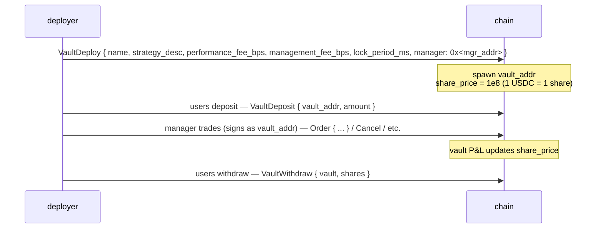
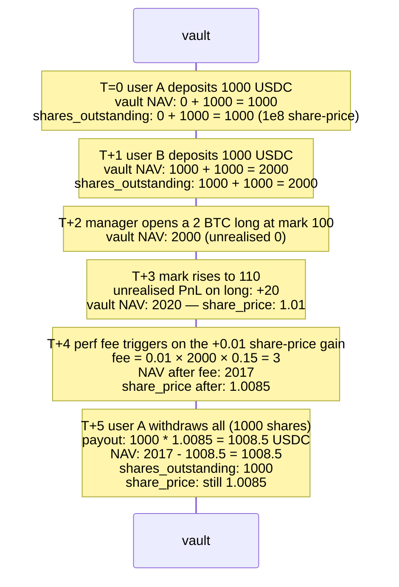

# Vaults

:::info
**Live on devnet.** The full vault lifecycle — creation, deposit, withdraw,
transfer, distribute, modify — is implemented and exercised on devnet.
End-to-end consensus tests are still being added.
:::

## TL;DR

Two vault families: the protocol-operated **MFlux Vault** (the insurance/backstop pool), and **user vaults** (community-deployed strategies you can deposit into). Both share the same share-pricing primitive: deposits mint shares at the current `share_price`; withdrawals burn shares at the current `share_price`.

## MFlux Vault

The protocol's own pool. It plays three roles:

1. **Backstop counter-party**: when a T3 liquidation hands the position to the protocol, MFlux Vault absorbs the position and any residual loss.
2. **Market making (planned)**: idle MFlux capital can be deployed into market-making strategies on selected markets.
3. **Insurance**: holds reserves to socialise small losses without firing T4 ADL.

### Depositing into MFlux Vault

```json
{
  "type": "VaultDeposit",
  "params": {
    "vault":       "<mflux_vault_addr>",
    "amount":   "1000000000"
  }
}
```

Mints `amount / share_price × 10^8` shares to the depositor at the next block.

### Withdrawing

```json
{
  "type": "VaultWithdraw",
  "params": {
    "vault":       "<mflux_vault_addr>",
    "shares":   "100000000000"
  }
}
```

Burns `shares` shares; pays out `shares × share_price / 10^8` USDC at the next block.

### Lock-up

MFlux Vault has a default lock-up of `24 h` from deposit to first eligible withdrawal. Per-share lock; withdrawals against shares older than 24 h are unrestricted.

This prevents capital from depositing right before a known T3 event and withdrawing immediately after the loss is socialised (the "free-rider" problem).

### Performance & fees

MFlux Vault charges:
- **Management fee**: 0 bps (no manager — protocol-operated).
- **Performance fee**: 0 bps.
- **Withdrawal fee**: 0 bps.

Returns net of T3 backstop losses + T1/T2 maker profits. Historical share-price chart is in the live `vault_state` query (see [`/info`](../api/rest/info.md#vault_state)).

## User vaults

Anyone can deploy a vault that pools USDC and runs strategies under a designated manager's signing authority.

### Lifecycle



The vault address is a first-class account in the state machine — it has its own positions, balance, and orders. The manager signs trades **on behalf of the vault** (the vault address is the `sender`, the manager's key signs; admission goes through the same agent-approval mechanism as regular agent wallets).

### Deploy

```json
{
  "type": "VaultDeploy",
  "params": {
    "name":                 "Yield Arb Strategy",
    "description":          "Funding-rate arbitrage",
    "manager":              "0x<mgr>",
    "performance_fee_bps":  1500,
    "management_fee_bps":   100,
    "lock_period_ms":       86400000,
    "high_water_mark":      true
  }
}
```

| Field | Range | Notes |
|-------|-------|-------|
| `performance_fee_bps` | `[0, 3000]` | Fee on positive returns above prior high-water mark |
| `management_fee_bps` | `[0, 500]` annualised | Charged regardless of returns |
| `lock_period_ms` | `[0, 30 days]` | Per-deposit lock |
| `high_water_mark` | bool | If true, performance fee only on new highs |

### Pricing

```
share_price(t) = vault_account_value(t) / total_shares(t) × 10^8
```

`vault_account_value` includes unrealised PnL on open positions.

Pricing updates every commit. Deposits mint at the **post-commit** share price (you don't get the prior block's price); withdrawals burn at the post-commit share price.

### Fees mechanic

Performance fee accrues on the manager-designated address at each share-price tick above the prior high-water mark:

```
on every commit:
    if share_price > high_water_mark:
        gain     = (share_price - high_water_mark) * shares_outstanding
        perf_fee = gain * performance_fee_bps / 1e4
        accrue perf_fee to manager (paid as vault → manager USDC)
        high_water_mark = share_price
```

Management fee is paid per-block linearly:

```
mgmt_per_block = management_fee_bps / 1e4 / (blocks_per_year)
```

Both fees come out of vault NAV before share-price calculation — share price already reflects fee paid.

### Risk

User vaults can lose money. If a vault's NAV ≥ liabilities + 1 base unit, withdrawals are honored at the prevailing share price. Below that, the vault is **paused** and withdrawals queue until NAV recovers (potentially by manager unwinding losing positions).

A vault that goes T3 (its own liquidation tier) follows the [tiered liquidation](./tiered-liquidation.md) ladder. T4 ADL on a vault claws back from depositors via share-price markdown.

The vault address is on-chain forever; even an empty vault sticks around (gas-paid storage isn't reclaimable in V1).

### Querying

```bash
curl -X POST https://devnet-gateway.mtf.exchange/info \
  -d '{"type":"vault_state","vault":"0x<vault>"}'
```

```json
{
  "type": "vault_state",
  "data": {
    "vault":              "0x<addr>",
    "name":               "Yield Arb Strategy",
    "manager":            "0x<mgr>",
    "tvl":             "10000000000",
    "share_price":     "11500000",
    "depositor_count":    142,
    "high_water_mark": "11500000",
    "performance_fee_bps":1500,
    "management_fee_bps": 100,
    "lock_period_ms":     86400000,
    "your_shares":     "5000000000",
    "your_position_value": "575000",
    "your_withdrawable_at_ts": 1735690000000
  }
}
```

## Insurance pool

A subset of MFlux Vault is the **insurance pool** — a designated reserve that draws down during T3 backstop events. See [tiered liquidation](./tiered-liquidation.md#t3-backstop--netting-at-mark).

When the insurance pool runs low, MFlux Vault auto-replenishes it from the broader pool (governance-set ratio, default 10% of MFlux NAV reserved as insurance).

## Edge cases

<details>
<summary>Show edge cases</summary>

- **Manager rotation.** A vault's manager can be replaced by the deployer (or by a multi-sig if the vault was deployed as a multi-sig deploy). The new manager inherits all signing authority.
- **Manager goes silent.** Existing positions sit; no auto-trade. Depositors can still withdraw against share price (which reflects MTM of those positions). If positions get liquidated due to mark moves, that hits NAV.
- **Deposit during liquidation.** A vault in T0/T1 still accepts deposits (good — new capital may rescue), unless `accept_deposits` is set to `false` by the manager.
- **Lock-up math.** A 24 h lock is per-deposit. Two deposits 6 h apart unlock at different times; track per-deposit if you're managing inflows.
- **High-water mark and withdrawals.** Withdrawing some shares doesn't reset the HWM; the manager still earns performance fee on the next gain above HWM, on the **remaining** shares.

</details>

## Sequence — deposit, manager trades, withdraw



## See also

- [Tiered liquidation](./tiered-liquidation.md) — T3 backstop, insurance pool
- [`POST /info vault_state`](../api/rest/info.md#vault_state)
- [`vaultDetails` HL-compat](../api/rest/hl-compat.md#vaultdetails)
- [`userEvents` WS](../api/ws/subscriptions.md#userevents) — vault deposit / withdraw / fee events ride this channel
- [Staking](./staking.md) — separate from vaults

## FAQ

<details>
<summary>Show FAQ</summary>

**Q: Are MFlux Vault deposits insured?**
A: No. They earn from T1/T2 backstop activity and absorb T3 losses. Net returns are positive in normal conditions, can be negative during severe stress.

**Q: Can a vault hold non-USDC assets?**
A: V1 user vaults are USDC-denominated only. Spot-asset vaults are V2.

**Q: Are vault shares transferable?**
A: No — V1 shares are non-transferable. A depositor must withdraw and the receiver must deposit. V2 may add transferable share tokens.

**Q: Can the manager withdraw vault capital to their own address?**
A: No. The manager has only **trading** authority, not withdrawal authority. Withdrawal to non-depositors requires explicit vault-level governance (not in V1).

</details>
