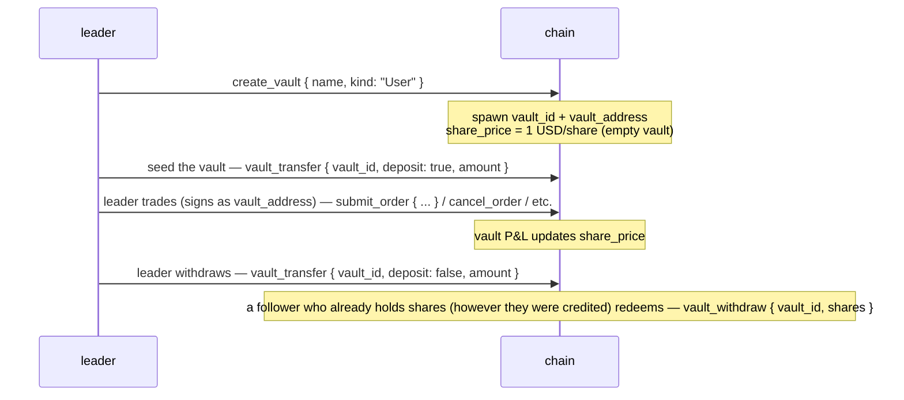
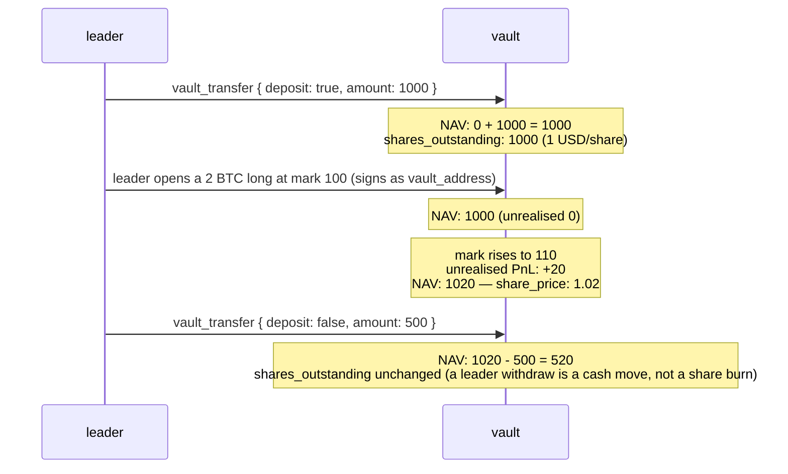

# Vaults

:::info
**Live on devnet.** Vault creation, the leader's own seed transfer, config
update, follower share redemption, and a third party's own self-service
deposit are all implemented and exercised on devnet — see
[Depositing into a vault](#depositing).
:::

## TL;DR {#tldr}

Two vault kinds share one action set: the protocol-operated **Metaliquidity vault** (the MLP insurance/backstop pool) and **user vaults** (leader-run strategies). Both share the same share-pricing primitive: a deposit mints shares at the current `share_price`; a withdrawal burns shares at the current `share_price`.

## Metaliquidity vault {#metaliquidity-vault}

A vault created with `kind: "Metaliquidity"` (gated to an MLP-whitelisted leader). It plays three roles:

1. **Backstop counter-party**: the vault takes over a failing position, and any residual loss, before the rest of the ladder runs. **This is live on the core markets since 2026-08-18.** Each absorption is bounded — 40% of live NAV per takeover and 100,000 USDC per block today, both governance-set — but those bound an EPISODE, not the vault's lifetime exposure. It is refused on a [builder-deployed market](../mip/mip-3.md#liquidation). Read [T3 backstop](./tiered-liquidation.md#mlp-first-bite) for what a depositor now carries.
2. **Market making (planned)**: idle capital can be deployed into market-making strategies on selected markets.
3. **Insurance**: holds reserves to socialise small losses without firing T4 ADL.

## Depositing into a vault {#depositing}

There are two distinct ways cash moves into a vault, and they are **not**
interchangeable:

- **[`vault_transfer`](../api/rest/exchange.md#vault_transfer)** — the
  vault's own **leader** moves cash between their main account and the
  vault, either direction, via a `deposit: true`/`false` flag. This is
  **leader-only**: the handler rejects any other sender with `401`.
- **`vault_distribute`** — a follower depositing USD on their own account
  and receiving shares at the current NAV. This is **sender-authorized**
  (the depositing follower signs it; there is no `owner` field) and is live
  on `/exchange` today.

```json
{ "type": "vault_distribute", "params": { "vault_id": 4, "pnl": "250" } }
```

`vault_id` is the numeric id from [`create_vault`](#deploy); `pnl` is the
deposit amount, whole USD (a verbatim decimal string — the field name is a
wire-shape holdover, not a PnL figure). The deposit is rejected if the vault
is paused, if the sender's free collateral is short of `pnl`, or — an
anti-share-capture guard — if the vault already carries value but has zero
shares outstanding (a leader must seed shares before any follower can
deposit).

### Leader seed transfer {#leader-seed-transfer}

```json
{
  "type": "vault_transfer",
  "params": { "vault_id": 4, "deposit": true, "amount": "1000" }
}
```

`vault_id` is the numeric id returned by [`create_vault`](#deploy) — not the
vault's `0x` address. `amount` is whole USD. See [`vault_transfer`](../api/rest/exchange.md#vault_transfer) for the full field table.

### Withdrawing {#withdrawing}

Redeeming shares (`vault_withdraw`) is open to any address holding shares in
the vault — this is the follower's own exit path and is fully live:

```json
{
  "type": "vault_withdraw",
  "params": { "vault_id": 4, "shares": "100" }
}
```

Burns `shares` shares at the current `share_price`; pays out the USD
proceeds at the next block. `shares` is a whole-share decimal, not a raw
1e8-scaled integer. See [`vault_withdraw`](../api/rest/exchange.md#vault_withdraw) for the full field table.

### Lock-up {#lock-up}

A withdrawal lock applies from deposit to first eligible withdrawal: **4 days**
for a `User` vault, **7 days** for a `Metaliquidity` vault. `lock_period_secs`
on [`create_vault`](#deploy) is currently **ignored** — every vault gets its
kind's protocol-fixed lock regardless of what the request sends; the field is
kept only for wire-shape stability. Whether a fresh deposit re-locks the
follower's **whole** balance or only the newly-deposited shares depends on a
network upgrade gate — check the live behavior rather than assuming per-share
scoping.

This prevents capital from depositing right before a known T3 event and withdrawing immediately after the loss is socialised (the "free-rider" problem).

### Fees {#fees}

A vault charges one configurable fee: **management fee**, in basis points,
capped at 2000 (20%), set via [`vault_modify`](#config)'s
`new_management_fee_bps`. There is no separate performance fee or withdrawal
fee action — the `performance_fee_bps` key the [`vault_state`](#querying)
read exposes is the **same** management-fee number under a legacy key name
(a wire-shape quirk, not two independent fees).

## User vaults {#user-vaults}

Any account can create a vault that pools USDC and runs strategies under its own (the **leader's**) signing authority.

### Lifecycle {#lifecycle}


```mermaid
sequenceDiagram
    participant leader
    participant chain
    leader->>chain: create_vault { name, kind: "User" }
    Note over chain: spawn vault_id + vault_address<br/>share_price = 1 USD/share (empty vault)
    leader->>chain: seed the vault — vault_transfer { vault_id, deposit: true, amount }
    leader->>chain: leader trades (signs as vault_address) — submit_order { ... } / cancel_order / etc.
    Note over chain: vault P&L updates share_price
    leader->>chain: leader withdraws — vault_transfer { vault_id, deposit: false, amount }
    Note over chain: a follower who already holds shares (however they were credited) redeems — vault_withdraw { vault_id, shares }
```

The vault address is a first-class account in the state machine — it has its own positions, balance, and orders. The leader signs trades **as the vault** (the vault address is the `sender` the fill settles against; the leader's own key produces the signature).

### Deploy {#deploy}

```json
{
  "type": "create_vault",
  "params": {
    "name":             "Yield Arb Strategy",
    "lock_period_secs": 345600,
    "parent":           null,
    "kind":             "User"
  }
}
```

| Field | Range | Notes |
|-------|-------|-------|
| `name` | string | Display name |
| `lock_period_secs` | uint64 | **Ignored.** Kept for wire-shape stability; the actual lock is the kind's protocol-fixed value (see [Lock-up](#lock-up)) |
| `parent` | must be `null` | User vaults have no parent |
| `kind` | `"User"` (default) / `"Metaliquidity"` | `Metaliquidity` requires the leader to be MLP-whitelisted |

Response carries the assigned `vault_id` and derived `vault_address`. See [`create_vault`](../api/rest/exchange.md#create_vault) for the full request/response shape.

### Pricing {#pricing}

```
share_price = NAV(vault) / total_shares
```

`NAV` is marked to market: settled cash, plus unrealised PnL on every open position at the latest oracle mark, plus unrealised funding. The Metaliquidity backstop vault also subtracts its pending-loss reserve. Pricing updates every commit — a deposit or withdrawal executes at the **post-commit** share price, not the price at request time.

The reads carry that same NAV. [`vault_state`](../api/rest/info.md#vault_state) `tvl` / `share_price`, [`vault_summaries`](../api/rest/info.md#vault_summaries) `tvl`, and [`user_vault_equities`](../api/rest/info.md#user_vault_equities) `equity` all price off it, so what a depositor reads is what [`vault_withdraw`](../api/rest/exchange.md#vault_withdraw) pays.

#### `high_water_mark` is not NAV {#high-water-mark}

`high_water_mark` is a separate number with one job: performance-fee accounting. It is a ratchet — profit raises it, a deposit bumps it, a withdrawal lowers it, and **a trading loss never does**. A vault in drawdown shows `high_water_mark` above `share_price`, and the gap is the profit the leader must re-earn before the vault charges a performance fee again.

Never price a redemption off `high_water_mark`. It answers "has the leader beaten their previous best", not "what is a share worth".

### Config update {#config}

```json
{
  "type": "vault_modify",
  "params": {
    "vault_id":                4,
    "new_name":                "v2",
    "new_lock_period_secs":    null,
    "new_management_fee_bps":  100,
    "new_paused":              false
  }
}
```

Leader-only. `new_lock_period_secs` is **always rejected** if it is non-null and differs from the vault's current lock (anti-rug: a leader cannot shorten the lock after the fact). See [`vault_modify`](../api/rest/exchange.md#vault_modify) for the full field table.

### Risk {#risk}

A vault can lose money like any account. If NAV falls to or below its liabilities, withdrawals against it reflect that loss at the prevailing share price — there is no separate insolvency backstop for a `User` vault.

A **Metaliquidity** vault carries one risk a user vault does not: it is the **first-loss taker** on the core markets. It inherits failing positions and absorbs deficit before ADL and before the insurance fund. It is paid for that — it keeps 70% of the liquidation fee on the notional it takes, by default — but the exposure is real and it lands on share price. See [the first bite](./tiered-liquidation.md#mlp-first-bite).

A vault that goes T3 (its own liquidation tier) follows the [tiered liquidation](./tiered-liquidation.md) ladder. T4 ADL on a vault claws back from depositors via share-price markdown.

The vault address is on-chain forever; even an empty vault sticks around (gas-paid storage isn't reclaimable in V1).

### Querying {#querying}

```bash
curl -X POST https://api.devnet.mtf.exchange/info \
  -d '{"type":"vault_state","vault":"0x<vault>"}'
```

```json
{
  "type": "vault_state",
  "data": {
    "vault":              "0x<addr>",
    "name":               "Yield Arb Strategy",
    "tvl":                "10000000000",
    "share_price":        "11500000",
    "depositor_count":    142,
    "high_water_mark":    "11500000",
    "performance_fee_bps":"100",
    "lock_period_ms":     345600000,
    "strategy":           "User"
  }
}
```

`performance_fee_bps` here is the vault's `new_management_fee_bps` (see
[Fees](#fees)); `strategy` is the vault's `kind` (`"User"` or
`"Metaliquidity"`). See [`vault_state`](../api/rest/info.md#vault_state) for
the full field table. This read carries no `manager` field and no
per-caller `your_*` fields — query [`user_vault_equities`](../api/rest/info.md#user_vault_equities) for one account's own share holding.

## Insurance pool {#insurance-pool}

A subset of the Metaliquidity vault is the **insurance pool** — a designated reserve that draws down during T3 backstop events. The vault now bites **before** the insurance pool: see [the first bite](./tiered-liquidation.md#mlp-first-bite) and the [deficit waterfall](./tiered-liquidation.md#t4--the-deficit-waterfall) for the order.

## Edge cases {#edge-cases}

<details>
<summary>Show edge cases</summary>

- **Leader rotation.** There is no live action that reassigns a vault's `leader` — the leader address is fixed at [`create_vault`](#deploy).
- **Leader goes silent.** Existing positions sit; no auto-trade. Depositors can still withdraw against share price (which reflects MTM of those positions). If positions get liquidated due to mark moves, that hits NAV.
- **Paused vault.** A leader can set `new_paused: true` via [`vault_modify`](#config); check the live `vault_state` / `web_data` read for the current paused flag before assuming withdrawals are open.
- **Lock-up math.** The lock is the vault kind's fixed duration from [Lock-up](#lock-up), not a caller-chosen value.

</details>

## Sequence — leader seeds, trades, withdraws {#sequence--leader-seeds-trades-withdraws}


```mermaid
sequenceDiagram
    participant leader
    participant vault
    leader->>vault: vault_transfer { deposit: true, amount: 1000 }
    Note over vault: NAV: 0 + 1000 = 1000<br/>shares_outstanding: 1000 (1 USD/share)
    leader->>vault: leader opens a 2 BTC long at mark 100 (signs as vault_address)
    Note over vault: NAV: 1000 (unrealised 0)
    Note over vault: mark rises to 110<br/>unrealised PnL: +20<br/>NAV: 1020 — share_price: 1.02
    leader->>vault: vault_transfer { deposit: false, amount: 500 }
    Note over vault: NAV: 1020 - 500 = 520<br/>shares_outstanding unchanged (a leader withdraw is a cash move, not a share burn)
```

## See also {#see-also}

- [Tiered liquidation](./tiered-liquidation.md) — T3 backstop, insurance pool
- [`POST /info vault_state`](../api/rest/info.md#vault_state)
- [`POST /info user_vault_equities`](../api/rest/info.md#user_vault_equities) — one account's own share holding
- [`ledger_updates` WS](../api/ws/subscriptions.md#ledger_updates) — a leader's `vault_transfer` rides this channel (`kind: vault_transfer`); there is no live event today for `vault_distribute`, `vault_withdraw`, or fee accrual — poll [`vault_state`](../api/rest/info.md#vault_state) for share-price and NAV changes
- [Staking](./staking.md) — separate from vaults

## FAQ {#faq}

<details>
<summary>Show FAQ</summary>

**Q: Are Metaliquidity vault deposits insured?**
A: No. They earn from backstop activity — 70% of the liquidation fee on taken notional, by default — and they absorb the losses first. Net returns are positive in normal conditions, and can be negative during severe stress.

**Q: Can a vault hold non-USDC assets?**
A: V1 vaults are USDC-denominated only.

**Q: Are vault shares transferable?**
A: No — shares are non-transferable. A holder must withdraw; there is no share-transfer action.

**Q: Can a follower self-service deposit into a vault today?**
A: Yes, via `vault_distribute` — see [Depositing into a vault](#depositing). The leader moves cash in separately via `vault_transfer`.

**Q: Can the leader withdraw vault capital to their own address?**
A: Yes, via `vault_transfer { deposit: false }` — this is the leader's own seed/unseed lane, not a follower path.

</details>
