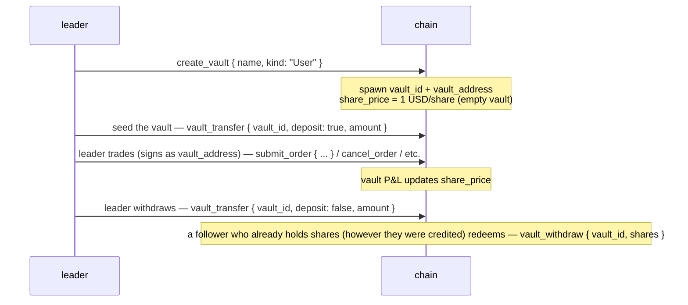
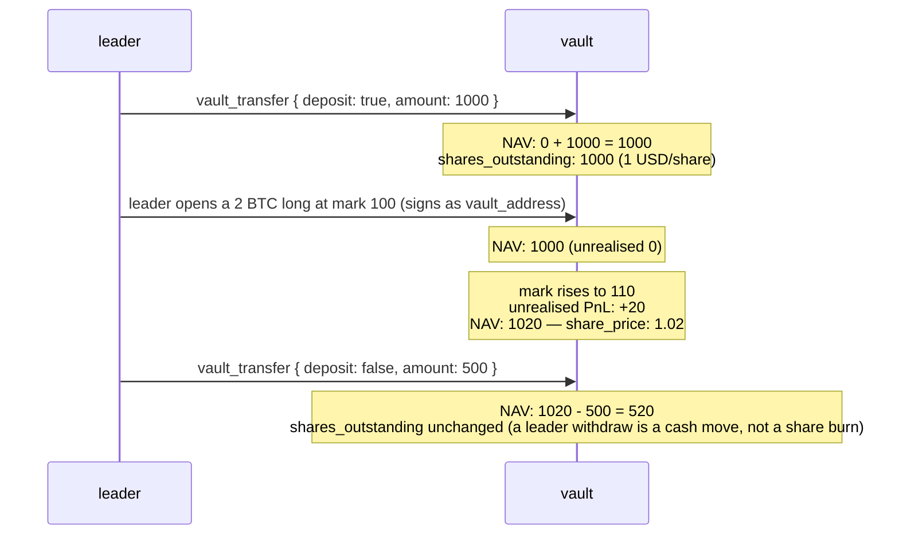

# Vaults

:::info
**Active on testnet.** Vault creation, the leader seed transfer, config update, follower share redemption and a third-party self-service deposit are all implemented and exercised on testnet. See [Depositing into a vault](#depositing).
:::

A vault pools USDC and trades it under the authority of one leader.

## Summary {#tldr}

Two vault kinds share one action set: the protocol-operated Metaliquidity vault (the MLP insurance and backstop pool) and user vaults (strategies that a leader runs). Both price shares the same way. A deposit mints shares at the current `share_price`. A withdrawal burns shares at the current `share_price`.

## Metaliquidity vault {#metaliquidity-vault}

A vault created with `kind: "Metaliquidity"` is a Metaliquidity vault. Only an MLP-whitelisted leader can create one. It has three roles:

1. Backstop counterparty. The vault takes over a failing position, and any residual loss, before the rest of the ladder runs. This is active on the core markets since 2026-08-18. Each absorption is bounded: 40% of current NAV per takeover and 100,000 USDC per block today, both set by governance. These bounds apply to one episode, not to the lifetime exposure of the vault. The vault refuses a takeover on a [builder-deployed market](../mip/mip-3.md#liquidation). See [T3 backstop](./tiered-liquidation.md#mlp-first-bite) for what a depositor now carries.
2. Market making (planned). The vault can deploy idle capital into market-making strategies on selected core markets. The vault never quotes a [deployer market](../mip/mip-2.md#scope).
3. Insurance. The vault holds reserves to socialise small losses without firing T4 ADL.

## Depositing into a vault {#depositing}

Cash moves into a vault in two ways. They are not interchangeable:

- [`vault_transfer`](../api/rest/exchange/vaults.md#vault_transfer): the vault leader moves cash between the main account and the vault, in either direction, with a `deposit: true` or `false` flag. Only the leader can send it. The handler rejects any other sender with `401`.
- `vault_distribute`: a follower deposits USD from their own account and receives shares at the current NAV. The depositing follower signs it, and it has no `owner` field. It is available on `/exchange` today.

```json
{ "type": "vault_distribute", "params": { "vault_id": 4, "pnl": "250" } }
```

`vault_id` is the numeric id from [`create_vault`](#deploy). `pnl` is the deposit amount in whole USD, as a verbatim decimal string. The field name is a wire-shape holdover, not a PnL figure. The protocol rejects the deposit in three cases:

- The vault is paused.
- The free collateral of the sender is less than `pnl`.
- The vault already carries value but has zero shares outstanding. This anti-share-capture guard means the leader must seed shares before any follower can deposit.

### Leader seed transfer {#leader-seed-transfer}

```json
{
  "type": "vault_transfer",
  "params": { "vault_id": 4, "deposit": true, "amount": "1000" }
}
```

`vault_id` is the numeric id that [`create_vault`](#deploy) returns. It is not the `0x` address of the vault. `amount` is in whole USD. See [`vault_transfer`](../api/rest/exchange/vaults.md#vault_transfer) for the full field table.

### Withdrawing {#withdrawing}

Any address that holds shares in the vault can redeem them with `vault_withdraw`. This is the exit path of a follower, and it is fully available:

```json
{
  "type": "vault_withdraw",
  "params": { "vault_id": 4, "shares": "100" }
}
```

The action burns `shares` shares at the current `share_price` and pays the USD proceeds at the next block. `shares` is a whole-share decimal, not a raw 1e8-scaled integer. See [`vault_withdraw`](../api/rest/exchange/vaults.md#vault_withdraw) for the full field table.

### Lock-up {#lock-up}

A withdrawal lock applies from deposit to the first eligible withdrawal. The lock is 4 days for a `User` vault and 7 days for a `Metaliquidity` vault. `lock_period_secs` on [`create_vault`](#deploy) is currently ignored. Every vault gets the protocol-fixed lock of its kind, whatever the request sends. The field stays only for wire-shape stability. A fresh deposit may re-lock the whole balance of the follower or only the new shares. Which one applies depends on a network upgrade gate. Check the current behavior. Do not assume per-share scoping.

The lock stops a free rider: capital that deposits right before a known T3 event and withdraws right after the protocol socialises the loss.

### Fees {#fees}

A vault charges one configurable fee, the management fee. It is in basis points, capped at 2000 (20%), and set with `new_management_fee_bps` in [`vault_modify`](#config). No separate performance fee or withdrawal fee action exists. The `performance_fee_bps` key in the [`vault_state`](#querying) read is the same management-fee number under a legacy key name. It is a wire-shape quirk, not a second fee.

## User vaults {#user-vaults}

Any account can create a vault. The vault pools USDC and runs strategies under the signing authority of its creator, the leader.

### Lifecycle {#lifecycle}


```mermaid
sequenceDiagram
    participant leader
    participant chain
    leader->>chain: create_vault { name, kind: "User" }
    Note over chain: spawn vault_id + vault_address<br/>share_price = 1 USD/share (empty vault)
    leader->>chain: seed the vault — vault_transfer { vault_id, deposit: true, amount }
    leader->>chain: leader trades (signs as vault_address) — submit_order { ... } / cancel_order / etc.
    Note over chain: vault P&L updates share_price
    leader->>chain: leader withdraws — vault_transfer { vault_id, deposit: false, amount }
    Note over chain: a follower who already holds shares (however they were credited) redeems — vault_withdraw { vault_id, shares }
```

The vault address is an account in the state machine. It has its own positions, balance and orders. The leader signs trades as the vault: the vault address is the `sender` that the fill settles against, and the leader key produces the signature.

### Deploy {#deploy}

```json
{
  "type": "create_vault",
  "params": {
    "name":             "Yield Arb Strategy",
    "lock_period_secs": 345600,
    "parent":           null,
    "kind":             "User"
  }
}
```

| Field | Range | Notes |
|-------|-------|-------|
| `name` | string | Display name |
| `lock_period_secs` | uint64 | Ignored. It stays for wire-shape stability. The actual lock is the protocol-fixed value of the kind (see [Lock-up](#lock-up)). |
| `parent` | must be `null` | A user vault has no parent |
| `kind` | `"User"` (default) / `"Metaliquidity"` | `Metaliquidity` requires the leader to be MLP-whitelisted |

The response carries the assigned `vault_id` and the derived `vault_address`. See [`create_vault`](../api/rest/exchange/vaults.md#create_vault) for the full request/response shape.

### Pricing {#pricing}

```
share_price = NAV(vault) / total_shares
```

`NAV` is marked to market. It is the settled cash, plus the unrealised PnL on every open position at the latest oracle mark, plus the unrealised funding. The Metaliquidity backstop vault also subtracts its pending-loss reserve. The price updates at every commit. A deposit or withdrawal executes at the post-commit share price, not the price at request time.

The reads carry that same NAV. [`vault_state`](../api/rest/info/vaults-staking.md#vault_state) `tvl` / `share_price`, [`vault_summaries`](../api/rest/info/node.md#vault_summaries) `tvl`, and [`account_state`](../api/rest/info/account.md#account_state-overview) `vault.equities[*].equity` all price off it, so a depositor reads the amount that [`vault_withdraw`](../api/rest/exchange/vaults.md#vault_withdraw) pays.

#### `high_water_mark` is not NAV {#high-water-mark}

`high_water_mark` is a separate number with one job: performance-fee accounting. It is a ratchet. Profit raises it, a deposit bumps it, a withdrawal lowers it, and a trading loss never does. A vault in drawdown shows `high_water_mark` above `share_price`. The gap is the profit that the leader must earn again before the vault charges a performance fee.

Never price a redemption from `high_water_mark`. It shows whether the leader has beaten the previous best. It does not show what a share is worth.

### Config update {#config}

```json
{
  "type": "vault_modify",
  "params": {
    "vault_id":                4,
    "new_name":                "v2",
    "new_lock_period_secs":    null,
    "new_management_fee_bps":  100,
    "new_paused":              false
  }
}
```

Only the leader can send it. The protocol always rejects `new_lock_period_secs` when it is non-null and differs from the current lock of the vault. This anti-rug rule stops a leader from shortening the lock later. See [`vault_modify`](../api/rest/exchange/vaults.md#vault_modify) for the full field table.

### Risk {#risk}

A vault can lose money like any account. If NAV falls to or below its liabilities, withdrawals reflect that loss at the prevailing share price. A `User` vault has no separate insolvency backstop.

A Metaliquidity vault carries one risk that a user vault does not. It is the first-loss taker on the core markets. It inherits failing positions and absorbs deficit before ADL and before the insurance fund. It earns 70% of the liquidation fee on the notional it takes, by default. The exposure is real and it lands on the share price. See [the first bite](./tiered-liquidation.md#mlp-first-bite).

A vault that reaches T3 (its own liquidation tier) follows the [tiered liquidation](./tiered-liquidation.md) ladder. T4 ADL on a vault claws back from depositors through a share-price markdown.

The vault address stays on-chain forever. An empty vault stays too, because V1 cannot reclaim gas-paid storage.

### Querying {#querying}

```bash
curl -X POST https://api.testnet.mtf.exchange/info \
  -d '{"type":"vault_state","vault":"0x<vault>"}'
```

```json
{
  "type": "vault_state",
  "data": {
    "vault":              "0x<addr>",
    "name":               "Yield Arb Strategy",
    "tvl":                "10000000000",
    "share_price":        "11500000",
    "depositor_count":    142,
    "high_water_mark":    "11500000",
    "performance_fee_bps":"100",
    "lock_period_ms":     345600000,
    "strategy":           "User"
  }
}
```

Here `performance_fee_bps` is the `new_management_fee_bps` of the vault (see [Fees](#fees)). `strategy` is the `kind` of the vault, `"User"` or `"Metaliquidity"`. See [`vault_state`](../api/rest/info/vaults-staking.md#vault_state) for the full field table. This read has no `manager` field and no per-caller `your_*` fields. To read the share holding of one account, query [`account_state`](../api/rest/info/account.md#account_state-overview) with `detail: "overview"`.

## Insurance pool {#insurance-pool}

The insurance pool is a subset of the Metaliquidity vault. It is a designated reserve that draws down during T3 backstop events. The vault takes its loss before the insurance pool. See [the first bite](./tiered-liquidation.md#mlp-first-bite) and the [deficit waterfall](./tiered-liquidation.md#t4--the-deficit-waterfall) for the order.

## Edge cases {#edge-cases}

<details>
<summary>Show edge cases</summary>

- Leader rotation. No active action reassigns the `leader` of a vault. The leader address is fixed at [`create_vault`](#deploy).
- Leader goes silent. Existing positions stay open and nothing trades automatically. Depositors can still withdraw at the share price, which reflects the mark-to-market of those positions. A liquidation caused by mark moves hits NAV.
- Paused vault. A leader can set `new_paused: true` with [`vault_modify`](#config). Check the current `vault_state` read, or `account_state` with `detail: "overview"`, for the paused flag before you assume withdrawals are open.
- Lock-up. The lock is the fixed duration of the vault kind from [Lock-up](#lock-up). The caller does not choose it.

</details>

## Leader sequence {#sequence--leader-seeds-trades-withdraws}


```mermaid
sequenceDiagram
    participant leader
    participant vault
    leader->>vault: vault_transfer { deposit: true, amount: 1000 }
    Note over vault: NAV: 0 + 1000 = 1000<br/>shares_outstanding: 1000 (1 USD/share)
    leader->>vault: leader opens a 2 BTC long at mark 100 (signs as vault_address)
    Note over vault: NAV: 1000 (unrealised 0)
    Note over vault: mark rises to 110<br/>unrealised PnL: +20<br/>NAV: 1020 — share_price: 1.02
    leader->>vault: vault_transfer { deposit: false, amount: 500 }
    Note over vault: NAV: 1020 - 500 = 520<br/>shares_outstanding unchanged (a leader withdraw is a cash move, not a share burn)
```

## See also {#see-also}

- [Tiered liquidation](./tiered-liquidation.md): the T3 backstop and the insurance pool.
- [`POST /info vault_state`](../api/rest/info/vaults-staking.md#vault_state)
- [`POST /info account_state`](../api/rest/info/account.md#account_state-overview) with `detail: "overview"`: the share holding of one account.
- [`ledger_updates` WS](../api/ws/subscriptions.md#ledger_updates): a leader `vault_transfer` arrives on this channel (`kind: vault_transfer`). No real-time event exists today for `vault_distribute`, `vault_withdraw` or fee accrual. Poll [`vault_state`](../api/rest/info/vaults-staking.md#vault_state) for share-price and NAV changes.
- [Staking](./staking.md): separate from vaults.

## FAQ {#faq}

<details>
<summary>Show FAQ</summary>

**Q: Are Metaliquidity vault deposits insured?**
A: No. They earn from backstop activity, by default 70% of the liquidation fee on the notional taken. They also absorb the losses first. Net returns are positive in normal conditions. They can be negative in severe stress.

**Q: Can a vault hold non-USDC assets?**
A: V1 vaults are USDC-denominated only.

**Q: Are vault shares transferable?**
A: No. Shares are non-transferable. A holder must withdraw. No share-transfer action exists.

**Q: Can a follower self-service deposit into a vault today?**
A: Yes, with `vault_distribute`. See [Depositing into a vault](#depositing). The leader moves cash in separately with `vault_transfer`.

**Q: Can the leader withdraw vault capital to their own address?**
A: Yes, with `vault_transfer { deposit: false }`. This is the seed and unseed lane of the leader. It is not a follower path.

</details>
