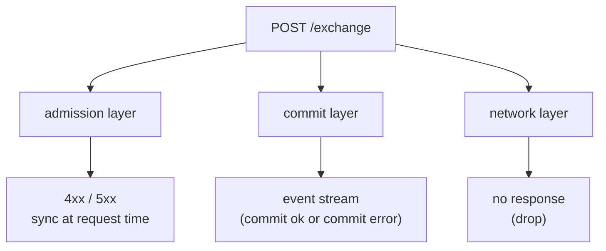
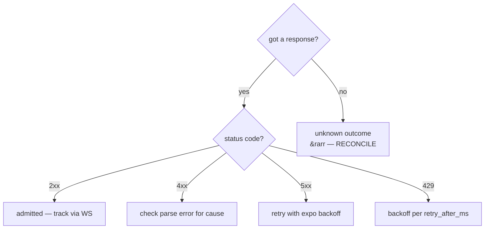
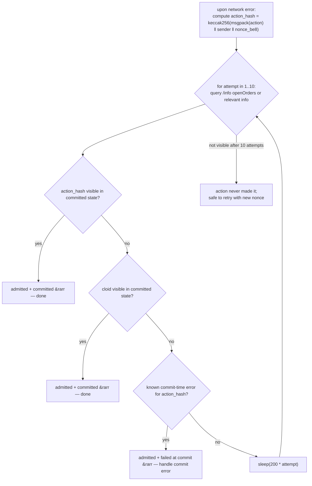

# Error handling

:::tip
**Stable.**
:::

A decision tree for production clients. The full catalog of error strings is in [errors](../api/errors.md); this page tells you what to **do** about each class.

## Three failure layers {#three-failure-layers}



| Layer | When fires | How surfaced |
|-------|-----------|--------------|
| Admission | At `/exchange` request | HTTP status + body |
| Commit | At block commit, post-admission | `userEvents` / `orderEvents` WS push, or visible in `userFills` / `openOrders` |
| Network | Anywhere | TCP error, timeout, partial response |

Each layer has different semantics. Confusing them is the most common production bug.

## Decision tree {#decision-tree}



## Layer 1 — admission errors {#layer-1--admission-errors}

The request was parsed, but rejected at admission. Status `400`, `401`, `404`, `405`, `422`.

| Class | Examples | Retry rule |
|-------|----------|------------|
| **Client bug** | `400 invalid_msgpack`, `400 unknown_action_variant`, `400 missing_field` | DO NOT retry — fix code |
| **Signing bug** | `401 signer_not_sender`, `401 unknown_chainId` | DO NOT retry — verify chainId / key / agent state |
| **Nonce bug** | `400 nonce_must_increase` | Bump nonce; retry |
| **Logical** | `422 price_not_tick_aligned`, `422 reduce_only_would_grow` | Compute the right value; retry |
| **State** | `422 liquidation_tier_blocks_action`, `422 insufficient_balance` | Top up / wait for tier transition; retry |
| **Auth state** | `401 agent_not_yet_effective` | Wait one block; retry |
| **Not found** | `404 order_not_found`, `404 account_not_found` | Don't retry; check the resource |

```typescript
async function handleAdmissionResponse(r: Response) {
  if (r.status === 202) return { admitted: true };

  const body = await r.json();
  switch (r.status) {
    case 400:
      // client bug — log loudly, do not retry
      throw new ClientBugError(body.error);

    case 401:
      // signing — depends on the cause
      if (body.error === 'agent not yet effective') {
        // wait + retry
        await sleep(200);
        return { admitted: false, retry: true };
      }
      throw new AuthError(body.error);

    case 422:
      // logical — caller can correct and retry
      throw new LogicalError(body.error);

    case 429:
      await sleep(body.retry_after_ms);
      return { admitted: false, retry: true };

    case 503:
      await sleep(body.retry_after_ms);
      return { admitted: false, retry: true };

    default:
      throw new UnknownError(`${r.status}: ${body.error}`);
  }
}
```

## Layer 2 — commit errors {#layer-2--commit-errors}

The action was admitted (`202`) but failed at commit. You learn about it only via the event stream.

| Error | Cause | Retry? |
|-------|-------|--------|
| `reduce_only_violation_post_admit` | Position changed between admit and dispatch | YES if intent still applies |
| `stp_rejected` | Self-trade prevention killed the order | NO — caller's other order matched first |
| `mark_price_band_violation` | Order price too far from mark at dispatch | NO — re-evaluate price and re-place |
| `evicted_under_cap_pressure` | Admitted but evicted from mempool before block | YES (with backoff) |
| `liquidation_pre_empted` | Account moved to T1+ between admit and dispatch | NO — fix margin first |

Subscribe to [`userEvents` WS](../api/ws/subscriptions.md#userevents) (order lifecycle events ride this channel) and dispatch on the event kind:

```typescript
ws.subscribe('orderEvents', { user: address }, (event) => {
  switch (event.data.kind) {
    case 'resting':       /* order is on the book; track oid */            break;
    case 'partialFill':   /* size partially filled; cloid still on book */ break;
    case 'filled':        /* fully filled; remove from open-order set */   break;
    case 'cancelled':     /* terminal */                                   break;
    case 'error':         /* commit-time error; handle per table above */
      handleCommitError(event.data);
      break;
  }
});
```

## Layer 3 — network errors {#layer-3--network-errors}

The most ambiguous class. Did the server receive the request? Did the action commit?

| Symptom | Action |
|---------|--------|
| TCP RST before response | Reconcile: query state to determine outcome |
| Response timeout (you set the timeout) | Same — reconcile |
| Partial / truncated response | Same — reconcile |
| Connection refused | Server side is unavailable; retry with exponential backoff |
| DNS failure | Networking / DNS issue; retry with exponential backoff |

### Reconciliation pattern {#reconciliation-pattern}



The cloid-on-orders pattern (see [idempotency](./idempotency.md)) makes this cheap: query open orders, see if your cloid is there.

For non-order actions, match on `action_hash` — deterministic from your local msgpack encoding bound to the sender and nonce: `keccak256(msgpack(action) ‖ sender_20 ‖ nonce_be8)` (the sender + 8-byte big-endian nonce are concatenated after the action bytes, so a resubmit with the same params but a new nonce yields a different hash). The `userEvents` WS feed includes `action_hash` on every event.

## Production recipes {#production-recipes}

### Order placement with retry {#order-placement-with-retry}

```typescript
async function placeOrderSafely(client: Client, order: Order, maxAttempts = 3) {
  const cloid = '0x' + randomBytes(16).toString('hex');
  let lastNonce = Date.now();

  for (let attempt = 1; attempt <= maxAttempts; attempt++) {
    try {
      const res = await client.exchange.order({ ...order, cloid }, { nonce: lastNonce });
      return res;
    } catch (e) {
      if (e instanceof NetworkError) {
        // reconcile via cloid
        const placed = await client.info.findOpenOrderByCloid(client.address, cloid);
        if (placed) return placed;

        // bump nonce and retry
        lastNonce = Date.now();
        continue;
      }
      if (e instanceof RateLimitError) {
        await sleep(e.retryAfterMs);
        lastNonce = Date.now();
        continue;
      }
      throw e;  // client / signing / logical bug — propagate
    }
  }
  throw new Error('order failed after retries');
}
```

### Cancel with idempotent safety {#cancel-with-idempotent-safety}

```typescript
async function cancelSafely(client: Client, asset: number, oid: number) {
  try {
    return await client.exchange.cancel({ asset, oid });
  } catch (e) {
    if (e.body?.error === 'order not found') return { alreadyDone: true };
    if (e instanceof NetworkError) {
      // re-query the order
      const orders = await client.info.openOrders(client.address);
      if (!orders.find(o => o.oid === oid)) return { alreadyDone: true };
      // it's still there — actually retry
      return cancelSafely(client, asset, oid);
    }
    throw e;
  }
}
```

### WS commit reconciliation {#ws-commit-reconciliation}

```typescript
const pendingByHash = new Map<string, PendingAction>();

ws.subscribe('userEvents', { user: address }, (event) => {
  const hash = event.data.action_hash;
  const pending = pendingByHash.get(hash);
  if (!pending) return;

  if (event.data.kind === 'error') pending.reject(new CommitError(event.data));
  else                              pending.resolve(event.data);
  pendingByHash.delete(hash);
});

async function submit(action: Action) {
  // action_hash binds the action bytes to the sender + 8-byte big-endian nonce
  const hash = keccak256(concat(msgpack(action), senderAddr, nonceBE8(action.nonce)));
  const p = new Promise((resolve, reject) => pendingByHash.set(hash, { resolve, reject }));
  await client.exchange.submit(action);
  return Promise.race([p, timeout(5000)]);
}
```

## Edge cases {#edge-cases}

<details>
<summary>Show edge cases</summary>

- **Gateway returns 5xx but the action actually committed.** Can happen if the gateway's post-admit reply was lost. Treat like a network drop: reconcile via cloid/action_hash.
- **WS feed is behind real state.** Resume buffer may have evicted the events while you were reconnecting. Re-poll `/info` on resume to anchor; switch to WS for the live tail.
- **Same nonce submitted twice — once succeeds.** Server enforces nonce monotonicity; the second attempt sees `nonce_too_small` and you learn the first one is live. Use this signal.
- **Time-bomb logical errors.** A `Trigger` order that admits today but never fires because its trigger condition never holds. No error; just a resting order that hangs around. Periodically reconcile your open-order set against your bot's expected set.

</details>

## See also {#see-also}

- [Errors](../api/errors.md) — complete catalog
- [Idempotency](./idempotency.md) — nonce + cloid mechanics
- [WS subscriptions](../api/ws/subscriptions.md) — commit-time events
- [Rate limits](../api/rate-limits.md) — pace retries

## FAQ {#faq}

<details>
<summary>Show FAQ</summary>

**Q: Should I treat commit-time errors as exceptions or as data?**
A: Data. They're regular order outcomes — `cancelled` because of STP, `error` because of post-admit reduce-only. Log + handle per business logic; don't crash on them.

**Q: Is there ever a reason to ignore an admission error?**
A: For pure idempotent flows (cancel of a non-existent order), `404` is fine to swallow. For everything else, log at INFO+ and either retry or surface to the operator.

**Q: How do I cap retries?**
A: Wall-clock budget per logical operation. For order placement, 5 seconds is generous; for cancels, 2 seconds. Beyond that, surface to the operator or your risk-watcher.

</details>
