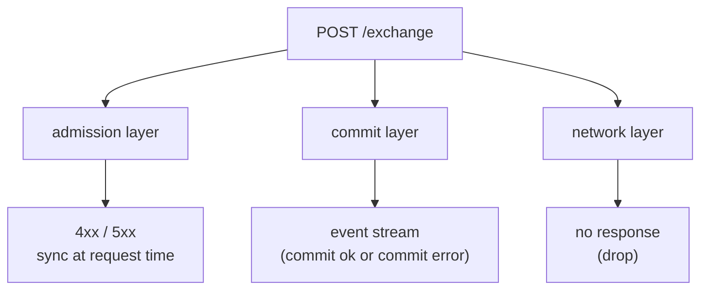
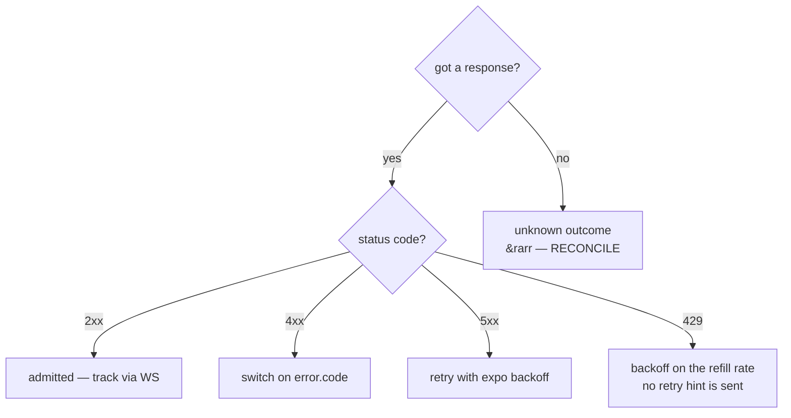
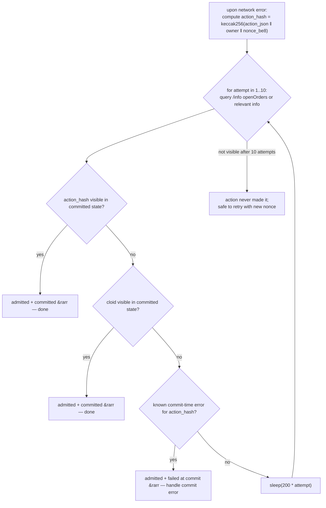

# Error handling

:::tip
**Stable.**
:::

A decision tree for production clients. Every error code, and the status it answers with, is in [errors](../api/errors.md); this page tells you what to **do** about each class.

## Three failure layers {#three-failure-layers}


```mermaid
flowchart TD
    P["POST /exchange"]
    P --> A["admission layer"]
    P --> C["commit layer"]
    P --> N["network layer"]
    A --> A2["4xx / 5xx<br/>sync at request time"]
    C --> C2["event stream<br/>(commit ok or commit error)"]
    N --> N2["no response<br/>(drop)"]
```

| Layer | When fires | How surfaced |
|-------|-----------|--------------|
| Admission | At `/exchange` request | HTTP status + body |
| Commit | At block commit, post-admission | [`order_updates`](../api/ws/subscriptions.md#order_updates) / [`fills`](../api/ws/subscriptions.md#fills) WS push, or visible in `user_fills` / `open_orders` |
| Network | Anywhere | TCP error, timeout, partial response |

Each layer has different semantics. Confusing them is the most common production bug.

## Decision tree {#decision-tree}


```mermaid
flowchart TD
    G{"got a response?"}
    G -->|yes| S{"status code?"}
    G -->|no| U["unknown outcome<br/>&rarr — RECONCILE"]
    S -->|2xx| R2xx["admitted — track via WS"]
    S -->|4xx| R4xx["switch on error.code"]
    S -->|5xx| R5xx["retry with expo backoff"]
    S -->|429| R429["backoff on the refill rate<br/>no retry hint is sent"]
```

## Layer 1 — admission errors {#layer-1--admission-errors}

The request was parsed, but rejected at admission. The body is the failure
envelope: an `error` object, and **no `data` key**.

```json
{ "error": { "code": "ORDER_INVALID_PRICE", "message": "...", "details": { "field": "px", "limit": "100", "actual": "12345" } } }
```

:::danger
**Branch on `error.code`, never on `error.message`.** `code` is the stable
contract. `message` is prose for a human and it can be reworded in any release —
a handler keyed off the sentence breaks silently, and it breaks in the direction
where a known rejection reads as an unknown one.

**And do not treat a null `data` as a failure.** A read can succeed with no
content and answer `{"data": null}`. Test whether `error` is PRESENT.
:::

| Class | `error.code` | Retry rule |
|-------|--------------|------------|
| **Client bug** | `INVALID_REQUEST`, `UNKNOWN_TYPE`, `ACTION_UNSUPPORTED` | DO NOT retry — fix the code |
| **Signing bug** | `AUTH_BAD_SIGNATURE`, `AUTH_UNAUTHORIZED` | DO NOT retry — verify chainId / key / owner |
| **Auth state** | `AUTH_AGENT_FORBIDDEN` | The approval is missing or expired. Re-approve, then retry |
| **Order shape** | `ORDER_INVALID_PRICE`, `ORDER_INVALID_SIZE`, `ORDER_ZERO_SIZE`, `ORDER_BELOW_MIN_NOTIONAL` | Compute the right value from `details.limit`; retry |
| **State** | `MARGIN_INSUFFICIENT`, `ASSET_INSUFFICIENT_BALANCE`, `MARKET_INACTIVE`, `MARKET_OI_CAP`, `PRECONDITION_FAILED` | Top up, or wait for the state to change; then retry |
| **Not found** | `ORDER_NOT_FOUND`, `MARKET_NOT_FOUND`, `NOT_FOUND` | Don't retry; check the resource |
| **Ours, not yours** | `INTERNAL`, `UNAVAILABLE` | Retry with backoff, then report |

The full list, with the status each code answers and the action for each, is in
[errors](../api/errors.md#catalog).

The classes below (`ClientBugError`, `AuthError`, …) are an example taxonomy for
a hand-rolled client working directly against `fetch`. The TypeScript SDK does
not export them — it throws one class, `MetaFluxApiError`, carrying the error
code, and you branch on that yourself (see
[TypeScript SDK](./typescript-sdk.md#error-handling)).

```typescript
async function handleAdmissionResponse(r: Response) {
  const body = await r.json();

  // The PRESENCE of `error` is the failure. `data` can be null on a success.
  if (!('error' in body)) return { admitted: true, data: body.data };

  const { code, message, details } = body.error;

  switch (code) {
    case 'RATE_LIMITED':
      // No retry hint is sent. 20 weight/s refill, so 250 ms buys back one
      // weight-5 `/exchange`.
      await sleep(250);
      return { admitted: false, retry: true };

    case 'INTERNAL':
    case 'UNAVAILABLE':
      await sleep(200);
      return { admitted: false, retry: true };

    case 'ORDER_INVALID_PRICE':
    case 'ORDER_INVALID_SIZE':
      // `details.limit` is the grid to round to.
      throw new LogicalError(code, message, details);

    default:
      // Group by prefix so a code added in a later release lands in the right
      // arm instead of the unknown one.
      if (code.startsWith('AUTH_')) throw new AuthError(code, message);
      if (code.startsWith('ORDER_') || code.startsWith('MARGIN_') ||
          code.startsWith('MARKET_') || code.startsWith('ASSET_')) {
        throw new LogicalError(code, message, details);
      }
      throw new ClientBugError(code, message);
  }
}
```

## Layer 2 — commit errors {#layer-2--commit-errors}

The action was admitted (`202`) but failed at commit. You learn about it only via the event stream.

| Error | Cause | Retry? |
|-------|-------|--------|
| `reduce_only_violation_post_admit` | Position changed between admit and dispatch | YES if intent still applies |
| `stp_rejected` | Self-trade prevention killed the order | NO — caller's other order matched first |
| `mark_price_band_violation` | Order price too far from mark at dispatch | NO — re-evaluate price and re-place |
| `evicted_under_cap_pressure` | Admitted but evicted from mempool before block | YES (with backoff) |
| `liquidation_pre_empted` | Account moved to T1+ between admit and dispatch | NO — fix margin first |

Subscribe to [`order_updates`](../api/ws/subscriptions.md#order_updates) — the live, per-account order-lifecycle channel — and dispatch on `status`:

```typescript
import { isChannelFrame } from '@metaflux-dex/client';

ws.onMessage((f) => {
  if (!isChannelFrame(f, 'order_updates')) return;
  for (const rec of f.data) {
    switch (rec.status) {
      case 'open':             /* resting on the book; track oid */             break;
      case 'filled':           /* fully filled; remove from open-order set */   break;
      case 'canceled':         /* terminal */                                   break;
      case 'rejected':         /* commit-time error; rec.reason has the cause */
        handleCommitError(rec);
        break;
      case 'cancel_rejected':  /* the cancel itself failed; rec.reason has the cause */
        handleCommitError(rec);
        break;
    }
  }
});
await ws.subscribe({ type: 'order_updates', user: address });
```

A partial fill does not get its own `status`: a maker leg reports its per-match
`filled_sz` with `status` still `open` while size rests, and a taker's fully
filled record carries `status: 'filled'` with `filled_sz` / `avg_px` set. See
[`order_updates`](../api/ws/subscriptions.md#order_updates) for the full field
table — including the gap on `modify` / `batchModify` / engine-initiated
cancels, which carry no per-order delta on this channel (use
[`open_orders`](../api/ws/subscriptions.md#open_orders) instead, a full
resting-set snapshot re-emitted on every change).

## Layer 3 — network errors {#layer-3--network-errors}

The most ambiguous class. Did the server receive the request? Did the action commit?

| Symptom | Action |
|---------|--------|
| TCP RST before response | Reconcile: query state to determine outcome |
| Response timeout (you set the timeout) | Same — reconcile |
| Partial / truncated response | Same — reconcile |
| Connection refused | Server side is unavailable; retry with exponential backoff |
| DNS failure | Networking / DNS issue; retry with exponential backoff |

### Reconciliation pattern {#reconciliation-pattern}


```mermaid
flowchart TD
    E["upon network error:<br/>compute action_hash = keccak256(action_json ‖ owner ‖ nonce_be8)"]
    E --> L{"for attempt in 1..10:<br/>query /info openOrders or relevant info"}
    L --> H{"action_hash visible in committed state?"}
    H -->|yes| D1["admitted + committed &rarr — done"]
    H -->|no| C{"cloid visible in committed state?"}
    C -->|yes| D2["admitted + committed &rarr — done"]
    C -->|no| K{"known commit-time error for action_hash?"}
    K -->|yes| D3["admitted + failed at commit &rarr — handle commit error"]
    K -->|no| SL["sleep(200 * attempt)"]
    SL --> L
    L -->|not visible after 10 attempts| D4["action never made it;<br/>safe to retry with new nonce"]
```

The cloid-on-orders pattern (see [idempotency](./idempotency.md)) makes this cheap: query open orders, see if your cloid is there.

For non-order actions, match on `action_hash`. It is deterministic and you can
compute it locally:

```
action_hash = keccak256( action_json ‖ owner_20 ‖ nonce_be8 )
```

- **`action_json` is the raw JSON bytes of the `action` field, exactly as you
  sent them.** The node hashes the bytes it received. Re-serializing changes key
  order or whitespace and gives a different hash. Keep the exact string you
  posted.
- **`owner_20` is the resolved account**, not the signer. For an agent-signed
  order that is the master, not the agent.
- `nonce_be8` is the nonce as 8 big-endian bytes.

The same params with a new nonce give a different hash. `action_hash` is
returned synchronously in the `/exchange` admission response — it is **not**
echoed on any per-account WS event. For a committed order, correlate by
`cloid` on [`order_updates`](../api/ws/subscriptions.md#order_updates) /
[`open_orders`](../api/ws/subscriptions.md#open_orders) instead. **No global, hash-keyed feed answers this any more.** The `explorer_txs` WS
channel that carried the hash is
[removed](../api/upgrade-notice-ids-and-shapes.md#explorer-channels-removed), and
its replacement [`recent_transactions`](../api/rest/info.md#recent_transactions)
does not carry a hash. Correlate by `cloid`, or read
[`action_outcome`](../api/rest/info.md#action_outcome) for the commit-time
verdict on one submitted action.

## Production recipes {#production-recipes}

### Order placement with retry {#order-placement-with-retry}

```typescript
import { Client, MetaFluxApiError, type NativeOrder } from '@metaflux-dex/client';

async function placeOrderSafely(
  client: Client,
  address: string,
  order: Omit<NativeOrder, 'cloid'>,
  maxAttempts = 3,
) {
  const cloid = '0x' + randomBytes(16).toString('hex');

  for (let attempt = 1; attempt <= maxAttempts; attempt++) {
    try {
      return await client.submitOrderNative({ ...order, cloid });
    } catch (e) {
      if (e instanceof MetaFluxApiError) {
        if (e.status === 429) {
          // The 429 body carries no retry hint; back off on the refill rate.
          await sleep(250 * attempt);
          continue;
        }
        throw e; // client / signing / logical bug — propagate
      }
      // fetch threw before any response — unknown outcome, reconcile via cloid
      const { orders } = await client.info.openOrders(address);
      const placed = orders.find((o) => o.cloid === cloid);
      if (placed) return placed;
      continue; // bump: submitOrderNative assigns a fresh nonce each call
    }
  }
  throw new Error('order failed after retries');
}
```

### Cancel with idempotent safety {#cancel-with-idempotent-safety}

```typescript
async function cancelSafely(client: Client, address: string, market: number, oid: number) {
  try {
    return await client.cancelOrderNative({ owner: address, market, oid });
  } catch (e) {
    if (e instanceof MetaFluxApiError) {
      if (e.status === 404) return { alreadyDone: true };
      throw e;
    }
    // network drop — re-query the order
    const { orders } = await client.info.openOrders(address);
    if (!orders.find((o) => o.oid === oid)) return { alreadyDone: true };
    // it's still there — actually retry
    return cancelSafely(client, address, market, oid);
  }
}
```

### WS commit reconciliation {#ws-commit-reconciliation}

`order_updates` has no `action_hash` field — correlate by `cloid` instead
(set one on every order you place):

```typescript
import { isChannelFrame, type NativeOrder } from '@metaflux-dex/client';

const pendingByCloid = new Map<string, PendingAction>();

ws.onMessage((f) => {
  if (!isChannelFrame(f, 'order_updates')) return;
  for (const rec of f.data) {
    const cloid = rec.order.cloid;
    const pending = cloid ? pendingByCloid.get(cloid) : undefined;
    if (!pending) continue;

    if (rec.status === 'rejected' || rec.status === 'cancel_rejected') {
      pending.reject(new Error(rec.reason ?? 'rejected'));
    } else {
      pending.resolve(rec);
    }
    pendingByCloid.delete(cloid!);
  }
});
await ws.subscribe({ type: 'order_updates', user: address });

async function submit(order: NativeOrder) {
  const cloid = order.cloid!;
  const p = new Promise((resolve, reject) => pendingByCloid.set(cloid, { resolve, reject }));
  await client.submitOrderNative(order);
  return Promise.race([p, timeout(5000)]);
}
```

## Edge cases {#edge-cases}

<details>
<summary>Show edge cases</summary>

- **Gateway returns 5xx but the action actually committed.** Can happen if the gateway's post-admit reply was lost. Treat like a network drop: reconcile via cloid/action_hash.
- **WS feed is behind real state.** Resume buffer may have evicted the events while you were reconnecting. Re-poll `/info` on resume to anchor; switch to WS for the live tail.
- **Same nonce submitted twice — once succeeds.** Server enforces nonce monotonicity; the second attempt sees `nonce_too_small` and you learn the first one is live. Use this signal.
- **Time-bomb logical errors.** A `Trigger` order that admits today but never fires because its trigger condition never holds. No error; just a resting order that hangs around. Periodically reconcile your open-order set against your bot's expected set.

</details>

## See also {#see-also}

- [Errors](../api/errors.md) — complete catalog
- [Idempotency](./idempotency.md) — nonce + cloid mechanics
- [WS subscriptions](../api/ws/subscriptions.md) — commit-time events
- [Rate limits](../api/rate-limits.md) — pace retries

## FAQ {#faq}

<details>
<summary>Show FAQ</summary>

**Q: Should I treat commit-time errors as exceptions or as data?**
A: Data. They're regular order outcomes — `cancelled` because of STP, `error` because of post-admit reduce-only. Log + handle per business logic; don't crash on them.

**Q: Is there ever a reason to ignore an admission error?**
A: For pure idempotent flows (cancel of a non-existent order), `404` is fine to swallow. For everything else, log at INFO+ and either retry or surface to the operator.

**Q: How do I cap retries?**
A: Wall-clock budget per logical operation. For order placement, 5 seconds is generous; for cancels, 2 seconds. Beyond that, surface to the operator or your risk-watcher.

</details>
