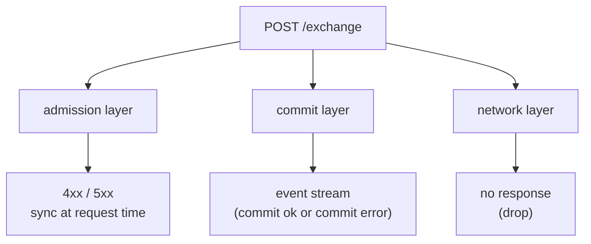
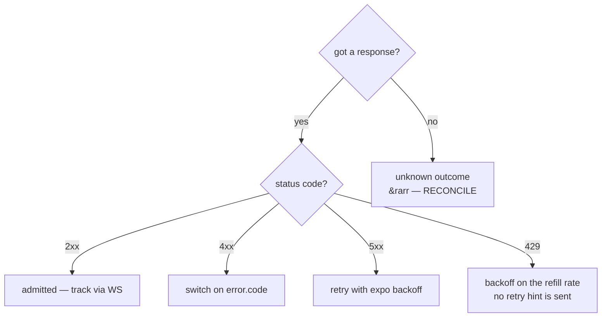
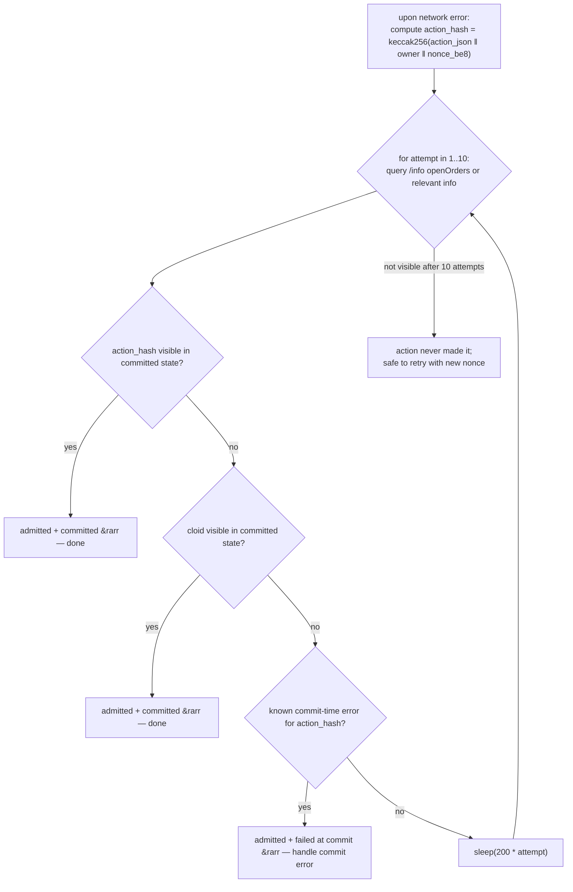

# Error handling

This page tells a production client what to do about each class of error.

:::tip
**Stable.**
:::

The [errors](../api/errors.md) page lists every error code and the status it answers with. This
page gives the action for each class.

## Three failure layers {#three-failure-layers}


```mermaid
flowchart TD
    P["POST /exchange"]
    P --> A["admission layer"]
    P --> C["commit layer"]
    P --> N["network layer"]
    A --> A2["4xx / 5xx<br/>sync at request time"]
    C --> C2["event stream<br/>(commit ok or commit error)"]
    N --> N2["no response<br/>(drop)"]
```

| Layer | When it fires | Where it shows |
|-------|---------------|----------------|
| Admission | At `/exchange` request | HTTP status + body |
| Commit | At block commit, after admission | [`order_updates`](../api/ws/subscriptions.md#order_updates) / [`fills`](../api/ws/subscriptions.md#fills) WS push, or visible in `user_fills` / `open_orders` |
| Network | Anywhere | TCP error, timeout, partial response |

Each layer has different semantics. A mix-up between them is the most common production bug.

## Decision tree {#decision-tree}


```mermaid
flowchart TD
    G{"got a response?"}
    G -->|yes| S{"status code?"}
    G -->|no| U["unknown outcome<br/>&rarr — RECONCILE"]
    S -->|2xx| R2xx["admitted — track via WS"]
    S -->|4xx| R4xx["switch on error.code"]
    S -->|5xx| R5xx["retry with expo backoff"]
    S -->|429| R429["backoff on the refill rate<br/>no retry hint is sent"]
```

## Admission errors {#layer-1--admission-errors}

The server parsed the request and rejected it at admission. The body is the failure envelope: an
`error` object, and no `data` key.

```json
{ "error": { "code": "ORDER_INVALID_PRICE", "message": "...", "details": { "field": "px", "limit": "100", "actual": "12345" } } }
```

:::danger Branch on `error.code`, never on `error.message`
`code` is the stable contract. `message` is prose for a human, and any release can reword it. A
handler keyed on the sentence breaks without a signal. It breaks in the bad direction: a known
rejection reads as an unknown one.

Do not treat a null `data` as a failure. A read can succeed with no content and answer
`{"data": null}`. Test whether `error` is PRESENT.
:::

| Class | `error.code` | Retry rule |
|-------|--------------|------------|
| **Client bug** | `INVALID_REQUEST`, `UNKNOWN_TYPE`, `ACTION_UNSUPPORTED` | DO NOT retry. Fix the code |
| **Signing bug** | `AUTH_BAD_SIGNATURE`, `AUTH_UNAUTHORIZED` | DO NOT retry. Verify chainId / key / owner |
| **Auth state** | `AUTH_AGENT_FORBIDDEN` | The approval is missing or expired. Re-approve, then retry |
| **Order shape** | `ORDER_INVALID_PRICE`, `ORDER_INVALID_SIZE`, `ORDER_ZERO_SIZE`, `ORDER_BELOW_MIN_NOTIONAL` | Compute the right value from `details.limit`, then retry |
| **State** | `MARGIN_INSUFFICIENT`, `ASSET_INSUFFICIENT_BALANCE`, `MARKET_INACTIVE`, `MARKET_OI_CAP`, `PRECONDITION_FAILED` | Add margin, or wait for the state to change, then retry |
| **Not found** | `ORDER_NOT_FOUND`, `MARKET_NOT_FOUND`, `NOT_FOUND` | Do not retry. Check the resource |
| **Server error** | `INTERNAL`, `UNAVAILABLE` | Retry with backoff, then report |

The full list, with the status and the action for each code, is in
[errors](../api/errors.md#catalog).

The classes below (`ClientBugError`, `AuthError`, …) are an example taxonomy for a hand-written
client that calls `fetch` directly. The TypeScript SDK does not export them. It throws one class,
`MetaFluxApiError`, which carries the error code, and you branch on the code yourself. See
[TypeScript SDK](./typescript-sdk.md#error-handling).

```typescript
async function handleAdmissionResponse(r: Response) {
  const body = await r.json();

  // The PRESENCE of `error` is the failure. `data` can be null on a success.
  if (!('error' in body)) return { admitted: true, data: body.data };

  const { code, message, details } = body.error;

  switch (code) {
    case 'RATE_LIMITED':
      // No retry hint is sent. 20 weight/s refill, so 250 ms buys back one
      // weight-5 `/exchange`.
      await sleep(250);
      return { admitted: false, retry: true };

    case 'INTERNAL':
    case 'UNAVAILABLE':
      await sleep(200);
      return { admitted: false, retry: true };

    case 'ORDER_INVALID_PRICE':
    case 'ORDER_INVALID_SIZE':
      // `details.limit` is the grid to round to.
      throw new LogicalError(code, message, details);

    default:
      // Group by prefix so a code added in a later release lands in the right
      // arm instead of the unknown one.
      if (code.startsWith('AUTH_')) throw new AuthError(code, message);
      if (code.startsWith('ORDER_') || code.startsWith('MARGIN_') ||
          code.startsWith('MARKET_') || code.startsWith('ASSET_')) {
        throw new LogicalError(code, message, details);
      }
      throw new ClientBugError(code, message);
  }
}
```

## Commit errors {#layer-2--commit-errors}

The server admitted the action (`202`), but it failed at commit. Only the event stream reports
this failure.

| Error | Cause | Retry? |
|-------|-------|--------|
| `reduce_only_violation_post_admit` | Position changed between admit and dispatch | YES if intent still applies |
| `stp_rejected` | Self-trade prevention killed the order | NO. The caller's other order matched first |
| `mark_price_band_violation` | Order price too far from mark at dispatch | NO. Re-evaluate the price and place again |
| `evicted_under_cap_pressure` | Admitted but evicted from mempool before block | YES (with backoff) |
| `liquidation_pre_empted` | Account moved to T1+ between admit and dispatch | NO. Fix margin first |

Subscribe to [`order_updates`](../api/ws/subscriptions.md#order_updates), the real-time order-lifecycle
channel for each account, and dispatch on `status`:

```typescript
import { isChannelFrame } from '@metaflux-dex/client';

ws.onMessage((f) => {
  if (!isChannelFrame(f, 'order_updates')) return;
  for (const rec of f.data) {
    switch (rec.status) {
      case 'open':             /* resting on the book; track oid */             break;
      case 'filled':           /* fully filled; remove from open-order set */   break;
      case 'canceled':         /* terminal */                                   break;
      case 'rejected':         /* commit-time error; rec.reason has the cause */
        handleCommitError(rec);
        break;
      case 'cancel_rejected':  /* the cancel itself failed; rec.reason has the cause */
        handleCommitError(rec);
        break;
    }
  }
});
await ws.subscribe({ type: 'order_updates', user: address });
```

A partial fill has no `status` of its own. A maker leg reports its `filled_sz` per match, with
`status` still `open` while size rests. A taker's fully filled record carries `status: 'filled'`
with `filled_sz` / `avg_px` set. See [`order_updates`](../api/ws/subscriptions.md#order_updates)
for the full field table. The table also shows a gap: `modify`, `batchModify` and
engine-initiated cancels carry no per-order delta on this channel. For those, use
[`open_orders`](../api/ws/subscriptions.md#open_orders). It is a full snapshot of the resting set,
sent again on every change.

## Network errors {#layer-3--network-errors}

This is the most ambiguous class. You do not know if the server received the request, or if the
action committed.

| Symptom | Action |
|---------|--------|
| TCP RST before response | Reconcile: query state to find the outcome |
| Response timeout (you set the timeout) | Same. Reconcile |
| Partial / truncated response | Same. Reconcile |
| Connection refused | The server is unavailable. Retry with exponential backoff |
| DNS failure | Network or DNS issue. Retry with exponential backoff |

### Reconciliation pattern {#reconciliation-pattern}


```mermaid
flowchart TD
    E["upon network error:<br/>compute action_hash = keccak256(action_json ‖ owner ‖ nonce_be8)"]
    E --> L{"for attempt in 1..10:<br/>query /info openOrders or relevant info"}
    L --> H{"action_hash visible in committed state?"}
    H -->|yes| D1["admitted + committed &rarr — done"]
    H -->|no| C{"cloid visible in committed state?"}
    C -->|yes| D2["admitted + committed &rarr — done"]
    C -->|no| K{"known commit-time error for action_hash?"}
    K -->|yes| D3["admitted + failed at commit &rarr — handle commit error"]
    K -->|no| SL["sleep(200 * attempt)"]
    SL --> L
    L -->|not visible after 10 attempts| D4["action never made it;<br/>safe to retry with new nonce"]
```

A cloid on every order makes this cheap (see [idempotency](./idempotency.md)). Query open orders
and look for your cloid.

For non-order actions, match on `action_hash`. It is deterministic and you can
compute it locally:

```
action_hash = keccak256( action_json ‖ owner_20 ‖ nonce_be8 )
```

- `action_json` is the raw JSON bytes of the `action` field, exactly as you sent them. The node
  hashes the bytes it received. A new serialization changes key order or whitespace, and gives
  a different hash. Keep the exact string that you posted.
- `owner_20` is the resolved account, not the signer. For an agent-signed order, it is the
  master and not the agent.
- `nonce_be8` is the nonce as 8 big-endian bytes.

The same params with a new nonce give a different hash. The synchronous `/exchange` admission
response returns `action_hash`. No per-account WS event echoes it. For a committed order,
correlate by `cloid` on [`order_updates`](../api/ws/subscriptions.md#order_updates) /
[`open_orders`](../api/ws/subscriptions.md#open_orders). No global feed keyed by hash answers this
any more. The `explorer_txs` WS channel that carried the hash is
[removed](../changelog/ids-and-wire-shapes.md#explorer-channels-removed). Its replacement,
[`recent_transactions`](../api/rest/info/chain.md#recent_transactions), does not carry a hash.
Correlate by `cloid`, or read
[`action_outcome`](../api/rest/info/account-history.md#action_outcome) for the commit-time verdict
on one submitted action.

## Production recipes {#production-recipes}

### Order placement with retry {#order-placement-with-retry}

```typescript
import { Client, MetaFluxApiError, type NativeOrder } from '@metaflux-dex/client';

async function placeOrderSafely(
  client: Client,
  address: string,
  order: Omit<NativeOrder, 'cloid'>,
  maxAttempts = 3,
) {
  const cloid = '0x' + randomBytes(16).toString('hex');

  for (let attempt = 1; attempt <= maxAttempts; attempt++) {
    try {
      return await client.submitOrderNative({ ...order, cloid });
    } catch (e) {
      if (e instanceof MetaFluxApiError) {
        if (e.status === 429) {
          // The 429 body carries no retry hint; back off on the refill rate.
          await sleep(250 * attempt);
          continue;
        }
        throw e; // client / signing / logical bug — propagate
      }
      // fetch threw before any response — unknown outcome, reconcile via cloid
      const { orders } = await client.info.openOrders(address);
      const placed = orders.find((o) => o.cloid === cloid);
      if (placed) return placed;
      continue; // bump: submitOrderNative assigns a fresh nonce each call
    }
  }
  throw new Error('order failed after retries');
}
```

### Idempotent cancel {#cancel-with-idempotent-safety}

```typescript
async function cancelSafely(client: Client, address: string, market: number, oid: number) {
  try {
    return await client.cancelOrderNative({ owner: address, market, oid });
  } catch (e) {
    if (e instanceof MetaFluxApiError) {
      if (e.status === 404) return { alreadyDone: true };
      throw e;
    }
    // network drop — re-query the order
    const { orders } = await client.info.openOrders(address);
    if (!orders.find((o) => o.oid === oid)) return { alreadyDone: true };
    // it's still there — actually retry
    return cancelSafely(client, address, market, oid);
  }
}
```

### WS commit reconciliation {#ws-commit-reconciliation}

`order_updates` has no `action_hash` field. Correlate by `cloid`, and set one on every order you
place:

```typescript
import { isChannelFrame, type NativeOrder } from '@metaflux-dex/client';

const pendingByCloid = new Map<string, PendingAction>();

ws.onMessage((f) => {
  if (!isChannelFrame(f, 'order_updates')) return;
  for (const rec of f.data) {
    const cloid = rec.order.cloid;
    const pending = cloid ? pendingByCloid.get(cloid) : undefined;
    if (!pending) continue;

    if (rec.status === 'rejected' || rec.status === 'cancel_rejected') {
      pending.reject(new Error(rec.reason ?? 'rejected'));
    } else {
      pending.resolve(rec);
    }
    pendingByCloid.delete(cloid!);
  }
});
await ws.subscribe({ type: 'order_updates', user: address });

async function submit(order: NativeOrder) {
  const cloid = order.cloid!;
  const p = new Promise((resolve, reject) => pendingByCloid.set(cloid, { resolve, reject }));
  await client.submitOrderNative(order);
  return Promise.race([p, timeout(5000)]);
}
```

## Edge cases {#edge-cases}

<details>
<summary>Show edge cases</summary>

- **The gateway returns 5xx, but the action committed.** This happens when the gateway's reply
  after admission is lost. Treat it as a network drop: reconcile through cloid or action_hash.
- **The WS feed is behind the real state.** The resume buffer can evict events while you
  reconnect. Poll `/info` again on resume to anchor, then use WS for the streaming tail.
- **The same nonce is submitted twice, and one succeeds.** The server enforces nonce
  monotonicity. The second attempt gets `nonce_too_small`, and you learn that the first one is
  running. Use this signal.
- **Delayed logical errors.** A `Trigger` order admits today but never fires, because its
  trigger condition never holds. There is no error, only a resting order that stays. Reconcile
  your open-order set against your bot's expected set at regular intervals.

</details>

## See also {#see-also}

- [Errors](../api/errors.md): the complete catalog
- [Idempotency](./idempotency.md): nonce and cloid mechanics
- [WS subscriptions](../api/ws/subscriptions.md): commit-time events
- [Rate limits](../api/rate-limits.md): pace retries

## FAQ {#faq}

<details>
<summary>Show FAQ</summary>

**Q: Should I treat commit-time errors as exceptions or as data?**
A: As data. They are normal order outcomes: `cancelled` because of STP, or `error` because of reduce-only after admission. Log them and handle them per your business logic. Do not crash on them.

**Q: Is there ever a reason to ignore an admission error?**
A: For a purely idempotent flow, such as a cancel of an order that does not exist, you can ignore a `404`. For everything else, log at INFO or above, then retry or report to the operator.

**Q: How do I cap retries?**
A: Set a wall-clock budget per logical operation. For order placement, 5 seconds is generous. For cancels, use 2 seconds. After that, report to the operator or to your risk-watcher.

</details>
