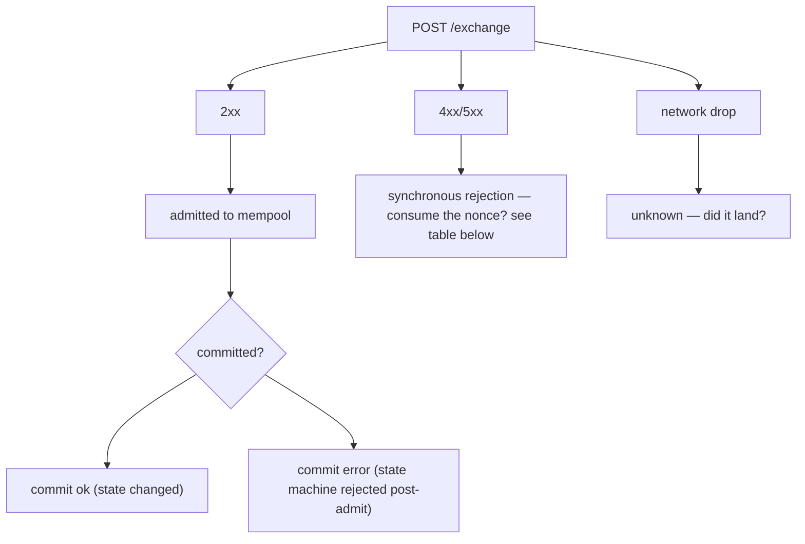
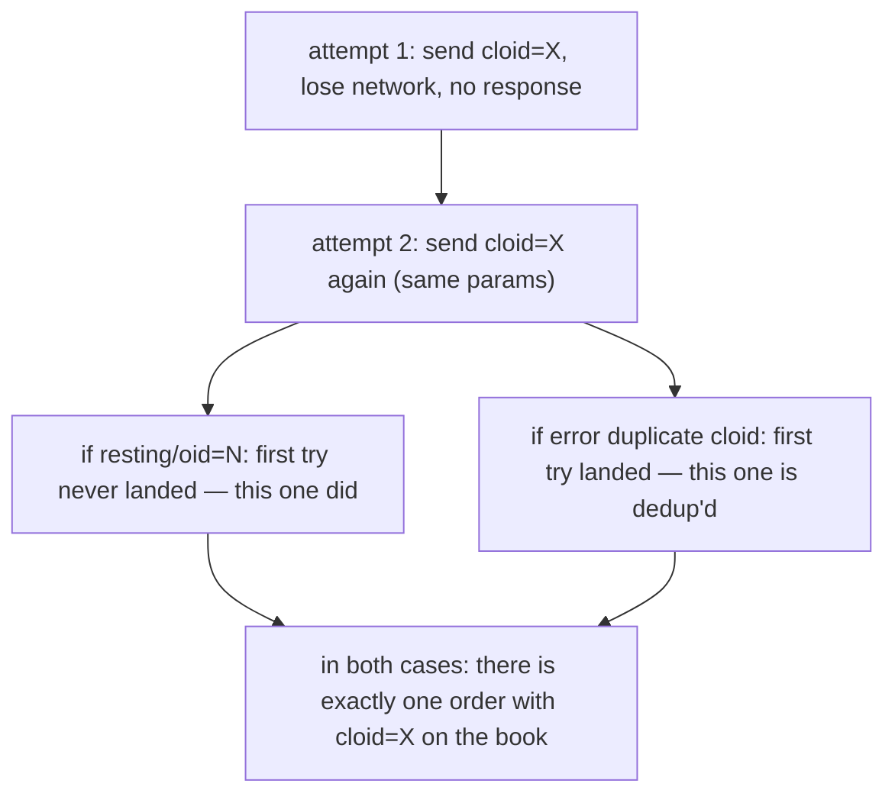
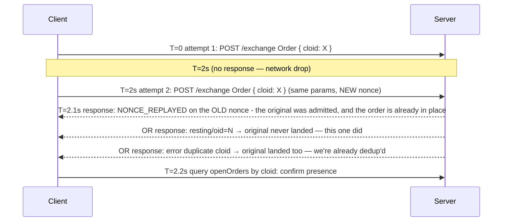

# Idempotency

This page explains how to retry an action without a duplicate nonce or a duplicate order.

:::tip
**Stable.**
:::

## Summary {#tldr}

- Every action has a `nonce`. A reused nonce returns `NONCE_REPLAYED` at HTTP `200`.
- Set a unique `cloid` on every `Order` / `ModifyOrder`. The server rejects a duplicate `cloid`
  on the same account, so a retry is safe.
- For non-order actions, the state machine is idempotent by design. A cancel of an order that
  does not exist is harmless. A balance check enforces each transfer.
- The network error model has three classes: admission rejection, commit-time error and network
  drop. Each class has a different retry rule.

## Three error classes {#three-error-classes}



## Nonce consumption {#nonce-consumption}

| Outcome | Nonce consumed? | Safe to retry? |
|---------|:---------------:|:--------------:|
| `202 admitted` | YES | NO. Duplicate effect |
| `200 NONCE_REPLAYED` | NO (already past it) | NO. Re-sign at a higher nonce |
| `400 action: <parse error>` / other parse errors | NO | YES. Fix and resubmit at the same nonce |
| `401 signer_*` | NO | NO until the signing issue is fixed. The nonce is unconsumed |
| `422 reduce_only_violation` and other admit-time logical errors | NO | YES when the logical issue is fixed |
| `429 rate limit exceeded` | NO | YES after a client-side backoff. The body carries no retry hint |
| `503 gateway overloaded` | NO | YES after a client-side backoff |
| Network drop (no response) | UNKNOWN | RECONCILE. See [reconcile after drop](#reconcile-after-network-drop) below |

The rule: when a request gets a server response, the nonce decision is made. A network drop is
the only ambiguous case.

:::warning
There is no `nonce_must_increase` and no `nonce_too_small`. Neither string exists on this API,
and neither answer is a `400`. A replayed nonce answers
[`NONCE_REPLAYED`](../api/errors.md#nonce_replayed) at HTTP `200`, because the refusal comes from
the block builder and not from admission. Branch on the code, never on a `502` body.
:::

## Cloid strategy {#strategy-cloid}

For order placement, the client order id is the strongest deduplication primitive.

```typescript
const cloid = '0x' + crypto.randomBytes(16).toString('hex');

await client.submitOrderNative({
  owner, market: 0, side: 'bid', kind: 'limit',
  size: 1_000, limit_px: 5_000_000_000_000,
  tif: 'gtc', stp_mode: 'cancel_newest', reduce_only: false,
  cloid,
});
```

The server returns one of these:

| Server response | Meaning |
|-----------------|---------|
| `{"resting":{"oid":N,"cloid":"0x..."}}` | Order placed, deduplication confirmed |
| `{"error":{"code":"ORDER_DUPLICATE_CLOID", …}}` | The server admitted a prior request with the same cloid. The order is already on the book. Look it up by cloid |
| `{"error":{"code":"<other>", …}}` | This entry failed. You can retry with a new cloid or the same one. Match on `code`, never on `message` |

Retry rule for orders: the same cloid with the same params is idempotent end to end. If the first
try landed, the second try gets `duplicate cloid`, and you know the original is in place.



The same logic applies to `ModifyOrder`. Set a new cloid for the modify, and the server
deduplicates the modify.

## State-machine idempotence {#strategy-state-machine-idempotence}

Most non-order actions are idempotent at the state-machine level:

| Action | Idempotent? | Why |
|--------|:-----------:|-----|
| `Cancel` | yes | A cancel of an order that does not exist, or is already cancelled, is refused with `ORDER_NOT_FOUND`. This is harmless |
| `CancelByCloid` | yes | Same |
| `UpdateLeverage` | yes | Leverage set to the current value is a no-op |
| `UpdateMarginMode` | yes | Same |
| `UserPortfolioMargin` | yes | Same |
| `ApproveAgent` | yes | The same approval data overwrites the existing record |
| `UsdcTransfer` | NO | Transfers a new amount each time |
| `WithdrawUsdc` | NO | Same |
| `Delegate` / `Undelegate` | NO | Each call adds to the action queue |

For an action that is not idempotent, use one of these:

- **The nonce as your deduplication key.** Track the nonces you submitted. Never submit twice
  with the same nonce. The server enforces this in all cases.
- **An external deduplication table.** Keep a `{request_id → nonce}` map. If your retry finds an
  existing nonce for this request_id, you already submitted it.

## Reconcile after network drop {#reconcile-after-network-drop}

When the response is lost (TCP closed, timeout and similar), you do not know if the action
committed. Reconcile as follows.

### Orders {#for-orders}

Query by cloid:

```bash
curl -X POST $BASE/info \
  -d '{"type":"open_orders","address":"0x..."}' | jq '.[] | select(.cloid == "0x<cloid>")'
```

1. If the order is present, the server admitted it. Treat it as a success.
2. If it is absent, check `user_fills` for a fill against that cloid.
3. If it is still absent, admission failed, or the mempool evicted it. Submit again with the same
   cloid.

### Transfers and withdrawals {#for-transfers--withdrawals}

Non-order actions have no commit lookup per action. Reconcile from the resulting state:

- Check the [`ledger_updates`](../api/ws/subscriptions.md#ledger_updates) snapshot on subscribe
  for a matching record. It holds the most recent 100 records for the account.
- Or compare [`account_state`](../api/ws/subscriptions.md#account_state) before and after the
  drop. Its `spot.balances` array carries every spot token.

`action_hash` is deterministic, and you can compute it locally. No WS event or `/info` read
echoes it today. It is useful only as the correlation key in the synchronous `/exchange`
response that you already have. It is not useful for a lookup after the fact.

```typescript
// action_hash = keccak256(action_json ‖ owner(20) ‖ nonce(8, big-endian))
// `action_json` is the RAW bytes of the `action` field you posted. Hash the
// exact string — re-serializing reorders keys and changes the hash.
// `owner` is the resolved account, not the signing agent.
const actionHash = keccak256(concat(utf8(actionJson), ownerAddr, nonceBE8(nonce)));
// Useful to log alongside the synchronous admission response for your own
// audit trail — not for matching against a later WS event or info query.
```

If you cannot find the outcome:

- **Idempotent action.** Retry. Use a new nonce, because the old one can already be consumed.
- **Action that is not idempotent.** Pause. Query the account state to see if the side effect
  happened. Resume only when you are certain.

## Retry sequence after a timeout {#sequence--retry-with-cloid-after-timeout}



The cloid and the server-side checks make the retry safe, also on an unreliable network.

## Nonce-issue troubleshooting {#nonce-issue-troubleshooting}

| Symptom | Cause | Fix |
|---------|-------|-----|
| `NONCE_REPLAYED` on every request | Local clock skew (with `Date.now()`), or one past action signed far in the future | Sync the clock, or use a monotonic counter. The window anchors on the HIGHEST nonce ever committed, so sign above that anchor |
| Two scripts collide on nonce | They share the same account | Use a shared nonce service, or one script per account |
| `NONCE_REPLAYED` after a reconnect | The local nonce counter reset to its value before the drop | Persist the last submitted nonce across restarts |

## Action expiry {#complement-action-expiry}

The nonce window stops an action from committing twice. It does not stop an unused signature from
committing late. The optional
[action `expiresAfter`](./typed-data-signing.md#action-expiry-expiresafter) closes that gap. Sign
an expiry into the action, and the chain rejects the action when consensus time passes it. A
leaked or relay-held signature therefore cannot land after its window. The two complement each
other: `nonce` guards against duplication, and `expiresAfter` guards against staleness. The
expiry is optional and off by default (`0` / absent). When it is off, the digest is byte for byte
unchanged.

## See also {#see-also}

- [`POST /exchange`](../api/rest/exchange.md): the full envelope, including `nonce` and the
  optional [`expires_after`](../api/rest/exchange.md#optional-action-expiry-expiresafter)
- [Errors](../api/errors.md): every error string and its remediation
- [Error handling](./error-handling.md): a decision tree for admission, commit and network errors
- [Rate limits](../api/rate-limits.md): pace your retries

## FAQ {#faq}

<details>
<summary>Show FAQ</summary>

**Q: Should I use `Date.now()` or a counter?**
A: `Date.now()` is fine for a single-instance client. For several instances on one account, use a shared monotonic counter (for example Redis `INCR`), so that two instances do not collide.

**Q: What if I want to replay an action on purpose (idempotent flow)?**
A: Use the same `cloid` (for orders) and a new `nonce`. The server enforces deduplication through the cloid. The nonce keeps the wire intact.

**Q: Are cloids reusable after the original order is cancelled or filled?**
A: No. A cloid is unique per account, forever. Use a new one for every order.

**Q: Does the WS feed give me a commit-time confirmation for reconcile?**
A: Yes, for orders. Subscribe to [`order_updates`](../api/ws/subscriptions.md#order_updates) or [`fills`](../api/ws/subscriptions.md#fills), and match on `cloid`. Neither channel carries `action_hash`. The WS feed is the recommended way to confirm commit state during a retry.

</details>
