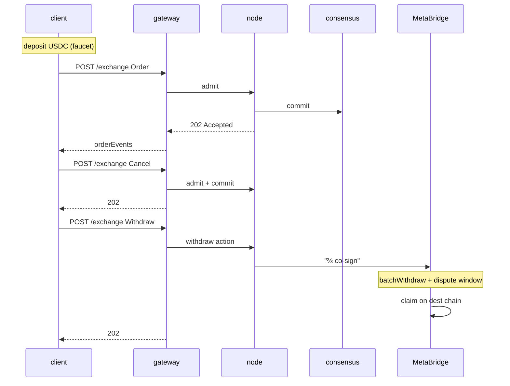

# Quickstart — 5-minute end-to-end

:::info
**Status.** **stable** wire surface. Devnet endpoints, no mainnet warranty.
:::

Deposit, place an order, cancel, withdraw. By the end of this page your TypeScript / Python / curl session has done a complete round-trip against devnet.

## Prerequisites {#prerequisites}

- An EVM private key (any 32-byte hex; for devnet, generate fresh — don't reuse a mainnet key)
- USDC on a MetaBridge source chain (Base; Solana and Arbitrum rolling out) — devnet allows the faucet route instead
- `curl` or any HTTP client

## Endpoints {#endpoints}

The gateway is the single public front door, serving the MTF-native surface.

| Service | URL (devnet) |
|---------|--------------|
| Gateway front door | `https://api.devnet.mtf.exchange` |
| MTF-native | `POST /info` · `POST /exchange` · `GET /ws` |
| EVM JSON-RPC | `POST /evm` |
| Faucet (devnet) | `POST /faucet` |
| Explorer | `https://app.mtf.exchange/explorer` |

> The faucet is **not** a separate service — it's the `POST /faucet` route on the
> gateway front door. Running the node yourself? The same native surface
> (`/info` · `/exchange` · `/ws` · `/faucet`) is served directly at
> `http://localhost:8080`. See [`POST /faucet`](../api/rest/faucet.md).

See [networks](../networks.md) for the full list including testnet and (post-launch) mainnet.

## Step 1 — Get devnet USDC {#step-1--get-devnet-usdc}

```bash
curl -X POST https://api.devnet.mtf.exchange/faucet \
  -H 'content-type: application/json' \
  -d '{"address":"0x<YOUR_ADDRESS>"}'
# -> {"address":"0x…","usdc":3000,"mtf":10,"status":"queued"}
```

One claim grants **3000 USDC** cross-collateral **and 10 MTF** spot tokens —
**once ever per address** (a second claim returns `429 address already funded`),
rate-limited at 1 / minute / IP. The optional `amount` only caps the USDC grant
*downward* (≤ 3000); MTF is fixed. The grant is `"queued"` — it lands ~1 block
later, so wait a moment before confirming the balance:

> The faucet is a **devnet/testnet convenience only**. To fund a real account
> with bridged USDC, deposit through the MetaBridge custody bridge — call the
> source chain's `deposit(mtfDest, amount)` (never a plain transfer to the
> custody address). See [bridge → deposit](../bridge/index.md#deposit-source-chain--metaflux).

The raw curls below speak **MTF-native** on the gateway (snake_case types like
`account_state` / `open_orders`). The `@metaflux/sdk` examples speak the same
native surface — the SDK just builds the signed envelope for you.

```bash
curl -X POST https://api.devnet.mtf.exchange/info \
  -H 'content-type: application/json' \
  -d '{"type":"account_state","address":"0x<YOUR_ADDRESS>"}'
```

You should see `data.account_value: "3000"`.

## Step 2 — Place a limit order {#step-2--place-a-limit-order}

The full signing flow is in [signing](./signing.md). For this quickstart use the official TypeScript SDK (`@metaflux/sdk` — ships before mainnet; see [TypeScript SDK](./typescript-sdk.md)).

```typescript
import { MetaFluxClient } from '@metaflux/sdk';

const client = new MetaFluxClient({
  privateKey: process.env.PRIVATE_KEY!,
  baseUrl:    'https://api.devnet.mtf.exchange', // MTF-native is the gateway default path
  chainId:    31337,
});

const meta = await client.info.meta();
const btcId = meta.universe.findIndex(m => m.name === 'BTC');

const result = await client.exchange.order({
  asset:    btcId,
  isBuy:    true,
  price:    '50000',
  size:     '0.1',
  tif:      'Gtc',
  reduceOnly: false,
});

console.log('order id:', result.oid);
```

Raw curl (MTF-native shape — you build the signature yourself; see [signing](./signing.md)):

```bash
curl -X POST https://api.devnet.mtf.exchange/exchange \
  -H 'content-type: application/json' \
  -d @order.json
```

where `order.json` is the signed MTF-native envelope you assembled.

### Spot trading example {#spot-trading-example}

[Spot](../products/spot.md) is a token-for-token CLOB, separate from
perps — no leverage, no positions. Place a spot order with the native
[`spot_order`](../api/rest/exchange.md#spot_order) action: it takes a **spot pair
id** (not a perp `market`), a `side`, a `limit_px`, a `size`, and a `tif`. A
resting `gtc`/`alo` order locks reserved-balance escrow; `ioc` never rests.

```jsonc
// the `action` you sign and POST to /exchange (sender-authorized, no `owner`)
{
  "type": "spot_order",
  "order": {
    "pair":     200,           // spot pair id from /info, not a perp market id
    "side":     "bid",         // bid = buy base (pays quote); ask = sell base
    "size":     100000000,
    "limit_px": 200000000,     // a limit is required — market spot is not yet supported
    "tif":      "gtc",
    "stp_mode": "cancel_oldest"
  }
}
```

The synchronous response carries the assigned `oid` with a `resting` or `filled`
entry (the same status union as a perp order). Read your spot balances and open
spot orders back via [`POST /info`](../api/rest/info.md); cancel with
[`spot_cancel`](../api/rest/exchange.md#spot_cancel), which refunds the escrow.

## Step 3 — Check the order is on the book {#step-3--check-the-order-is-on-the-book}

```bash
curl -X POST https://api.devnet.mtf.exchange/info \
  -H 'content-type: application/json' \
  -d '{"type":"open_orders","address":"0x<YOUR_ADDRESS>"}'
```

You should see your order with the `oid` from step 2.

Or, subscribe to live updates (preferred for any non-trivial usage):

```typescript
const ws = client.ws();
ws.subscribe('userEvents', { user: client.address }, (event) => {
  console.log('event:', event);
});
```

## Step 4 — Cancel {#step-4--cancel}

```typescript
await client.exchange.cancel({ asset: btcId, oid: result.oid });
```

```bash
# raw curl
curl -X POST https://api.devnet.mtf.exchange/exchange \
  -d @cancel.json
```

## Step 5 — Withdraw {#step-5--withdraw}

```typescript
await client.exchange.withdrawUsdc({
  amount:           '100',
  destinationChain: 'Arbitrum',
  destinationAddr:  '0x<DESTINATION>',
});
```

This queues a MetaBridge withdrawal. After the MetaFlux validator set co-signs it to a ⅔ stake-weighted quorum and the dispute window elapses (a few minutes), you can `claim` on the destination chain (see [bridge](../bridge/)).

## What just happened {#what-just-happened}



## Next steps {#next-steps}

- [Signing](./signing.md) — what's inside the SDK's signing
- [Agent wallets in practice](./agent-wallets-howto.md) — production hot-key pattern
- [Order types](../concepts/order-types.md) — beyond plain limit orders
- [Error handling](./error-handling.md) — admission vs commit vs network
- [WS subscriptions](../api/ws/subscriptions.md) — push for live data
- [Migrating from HL](./migrating-from-hl.md) — already have a Hyperliquid bot? this page first

## Troubleshooting {#troubleshooting}

<details>
<summary>Show troubleshooting</summary>

| Symptom | Likely cause | Fix |
|---------|--------------|-----|
| `401 signer is not the sender` | Wrong `chainId` | Use `31337` for devnet |
| `400 invalid msgpack` | Encoder reorders map keys | Use a standards-compliant msgpack lib |
| `404 unknown user` on info | Address has no on-chain state yet | Deposit first (faucet) |
| `429 rate limit` | Too many requests | See [rate limits](../api/rate-limits.md); back off |
| Withdrawal stuck on destination | MetaBridge withdrawal pending (dispute window) | Wait for the ⅔ co-signature + dispute window; then `claim` on the destination chain (see [bridge](../bridge/)) |

</details>

## See also {#see-also}

- [Networks](../networks.md) — devnet / testnet / mainnet endpoints + chainIds
- [Signing](./signing.md) — the full envelope spec
- [`POST /exchange`](../api/rest/exchange.md)
- [`POST /info`](../api/rest/info.md)
- [WS](../api/ws/index.md)
