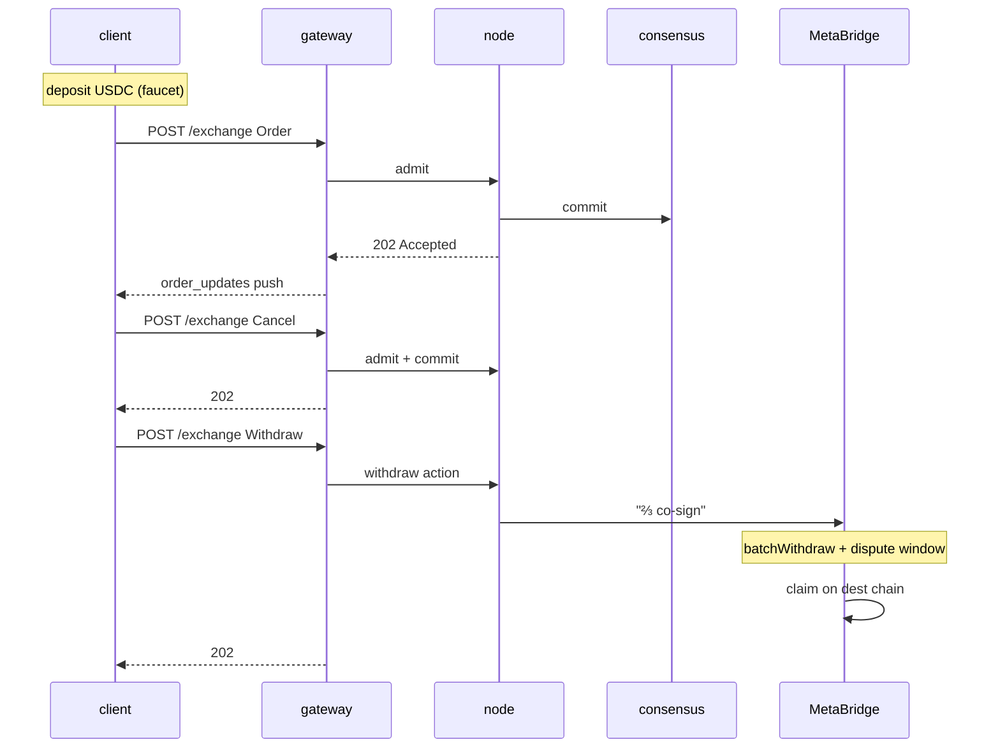

# Quickstart

This page takes a client through one full round trip on testnet: deposit, order, cancel and
withdrawal.

:::info
**Status.** **stable** wire surface. Testnet endpoints, no mainnet warranty.
:::

At the end of this page, your TypeScript, Python or curl session has deposited, placed an order,
cancelled it and withdrawn on testnet. It takes about 5 minutes.

## Prerequisites {#prerequisites}

- An EVM private key: any 32-byte hex value. Generate a new one. Never reuse a mainnet key.
- USDC on a MetaBridge source chain (Base or Arbitrum). On testnet, the faucet replaces this.
- `curl` or any HTTP client.

## Endpoints {#endpoints}

The gateway is the one public entry point. It serves the MTF-native surface.

| Service | URL (testnet) |
|---------|--------------|
| Gateway front door | `https://api.testnet.mtf.exchange` |
| MTF-native | `POST /info` · `POST /exchange` · `GET /ws` |
| EVM JSON-RPC | `POST /evm` |
| Faucet | `POST /faucet` |
| Explorer | `https://app.mtf.exchange/explorer` |

The faucet is not a separate service. It is the `POST /faucet` route on the gateway. If you run
the node yourself, it serves the same native surface (`/info` · `/exchange` · `/ws` · `/faucet`)
at `http://localhost:8080`. See [`POST /faucet`](../api/rest/faucet.md).

[Networks](../networks.md) has the full list, with testnet and, after launch, mainnet.

## 1. Get testnet USDC {#step-1-get-testnet-usdc}

```bash
curl -X POST https://api.testnet.mtf.exchange/faucet \
  -H 'content-type: application/json' \
  -d '{"address":"0x<YOUR_ADDRESS>"}'
# -> {"address":"0x…","usdc":3000,"mtf":10,"status":"queued"}
```

One claim grants 3000 USDC cross-collateral and 10 MTF spot tokens. Each address can claim only
once. A second claim returns `429 address already funded`. The faucet also limits each source IP
to one claim per minute, in addition to the rule per address. The optional `amount` can only
lower the USDC grant (≤ 3000). The MTF grant is fixed. See
[Limits](../api/rest/faucet.md#limits). The grant is `"queued"` and lands about 1 block later.
Wait a moment before you confirm the balance:

:::info `"queued"` means staged, not credited
The faucet transfers out of a reserve account. It does not create tokens, so the grant lands about
one block later. The faucet checks the reserve before it responds, so a `200` means the reserve
could pay at that moment. Confirm with `account_state` below before you trade. See
[the reserve](../api/rest/faucet.md#reserve).
:::

The faucet exists for testnet only. To fund a real account with bridged USDC, deposit through the
MetaBridge custody bridge. Call `deposit(mtfDest, amount)` on the source chain. Never send a plain
transfer to the custody address. See
[bridge deposit](../bridge/index.md#deposit-source-chain--metaflux).

The raw curls below use the MTF-native surface on the gateway, with snake_case types such as
`account_state` / `open_orders`. The `@metaflux-dex/client` examples use the same native surface.
The SDK builds the signed envelope for you.

```bash
curl -X POST https://api.testnet.mtf.exchange/info \
  -H 'content-type: application/json' \
  -d '{"type":"account_state","address":"0x<YOUR_ADDRESS>"}'
```

The response shows `data.account_value: "3000"`.

## 2. Place a limit order {#step-2--place-a-limit-order}

:::tip
[Placing orders](./placing-orders.md) is the main order guide. It covers the raw wire request and
response, the two number planes, and a tiered map of every order action.
:::

[Signing](./signing.md) has the full signing flow. For this quickstart, use the official
TypeScript SDK, `@metaflux-dex/client`. It ships before mainnet. See
[TypeScript SDK](./typescript-sdk.md).

```typescript
import { Client } from '@metaflux-dex/client';

const client = new Client({
  baseUrl:    'https://api.testnet.mtf.exchange', // MTF-native is the gateway default path
  privateKey: Buffer.from(process.env.PRIVATE_KEY!.replace(/^0x/, ''), 'hex'), // 32 bytes
});

const owner = '0x<YOUR_ADDRESS>';

// `markets()` keys by `coin` (the symbol); the numeric id a signed action
// needs is `signing_id` on `markets_meta`, the STATIC read. There is no
// `asset_id` field — reading one gives you `undefined`.
const meta = await client.info.marketsMeta();
const btc = meta.perp.find((m) => m.coin === 'BTC')!;

const result = await client.placeOrder({
  venue: 'perp',
  owner,
  market: btc.signing_id,
  side: 'bid',      // 'bid' = buy, 'ask' = sell
  kind: 'limit',
  size: 1_000,       // raw lots, scaled by the market's sz_decimals
  limit_px: 5_000_000_000_000, // 1e8 fixed-point plane
  tif: 'gtc',
  stp_mode: 'cancel_newest',
  reduce_only: false,
});

if (result.route === 'batch_order') {
  console.log('order status:', result.legs[0]?.status);
}
```

Raw curl, in the MTF-native shape. You build the signature yourself. See
[signing](./signing.md).

```bash
curl -X POST https://api.testnet.mtf.exchange/exchange \
  -H 'content-type: application/json' \
  -d @order.json
```

Here `order.json` is the signed MTF-native envelope that you assembled.

### Spot trading example {#spot-trading-example}

[Spot](../products/spot.md) is a token-for-token CLOB, separate from perps. It has no leverage
and no positions. Place a spot order with the native
[`spot_order`](../api/rest/exchange/spot.md#spot_order) action. It takes a spot pair id (not a
perp `market`), a `side`, a `limit_px`, a `size` and a `tif`. A resting `gtc`/`alo` order locks
reserved-balance escrow. An `ioc` order never rests.

```jsonc
// the `action` you sign and POST to /exchange (sender-authorized; owner is optional)
{
  "type": "spot_order",
  "order": {
    "pair":     200,           // spot pair id from /info, not a perp market id
    "side":     "bid",         // bid = buy base (pays quote); ask = sell base
    "size":     100000000,
    "limit_px": 200000000,     // 1e8 plane; 0 places a market order (must use tif "ioc")
    "tif":      "gtc",
    "stp_mode": "cancel_oldest"
  }
}
```

The synchronous response carries the assigned `oid` with a `resting` or `filled` entry. This is
the same status union as a perp order. Read your spot balances and open spot orders through
[`POST /info`](../api/rest/info.md). Cancel with
[`spot_cancel`](../api/rest/exchange/spot.md#spot_cancel), which refunds the escrow.

## 3. Check the order on the book {#step-3--check-the-order-is-on-the-book}

```bash
curl -X POST https://api.testnet.mtf.exchange/info \
  -H 'content-type: application/json' \
  -d '{"type":"open_orders","address":"0x<YOUR_ADDRESS>"}'
```

The response shows your order with the `oid` from step 2.

You can also subscribe to live updates. This is the preferred method for any real use:

```typescript
const ws = await client.connectWs();
ws.onMessage((f) => {
  if (f.channel === 'order_updates') console.log('event:', f.data);
});
await ws.subscribe({ type: 'order_updates', user: owner });
```

## 4. Cancel {#step-4--cancel}

```typescript
if (result.route === 'batch_order') {
  const status = result.legs[0]?.status;
  const oid = status && 'resting' in status ? status.resting.oid : undefined;
  if (oid !== undefined) await client.cancelOrderNative({ owner, market: btc.signing_id, oid });
}
```

```bash
# raw curl
curl -X POST https://api.testnet.mtf.exchange/exchange \
  -d @cancel.json
```

## 5. Withdraw {#step-5--withdraw}

```typescript
await client.mbWithdraw({
  chain: 'Arbitrum',
  asset: 0, // 0 = USDC cross-collateral
  amount: 100_000_000, // 100 USDC, base units
  dst_addr: '0x<DESTINATION>',
});
```

This call queues a MetaBridge withdrawal. The MetaFlux validator set co-signs it to a ⅔
stake-weighted quorum. Then the dispute window elapses, which takes a few minutes. Then you can
`claim` on the destination chain. See [bridge](../bridge/).

## Request flow {#what-just-happened}


```mermaid
sequenceDiagram
    participant client
    participant gateway
    participant node
    participant consensus
    participant MetaBridge

    Note over client: deposit USDC (faucet)

    client->>gateway: POST /exchange Order
    gateway->>node: admit
    node->>consensus: commit
    node-->>gateway: 202 Accepted
    gateway-->>client: order_updates push

    client->>gateway: POST /exchange Cancel
    gateway->>node: admit + commit
    gateway-->>client: 202

    client->>gateway: POST /exchange Withdraw
    gateway->>node: withdraw action
    node->>MetaBridge: "⅔ co-sign"
    Note over MetaBridge: batchWithdraw + dispute window
    MetaBridge->>MetaBridge: claim on dest chain
    gateway-->>client: 202
```

## Next steps {#next-steps}

- [Placing orders](./placing-orders.md): the main order guide, with batches, spot, cancels and
  number planes
- [Signing](./signing.md): what the SDK signing does
- [Agent wallets in practice](./agent-wallets-howto.md): the production hot-key pattern
- [Order types](../concepts/order-types.md): order types other than plain limit orders
- [Error handling](./error-handling.md): admission, commit and network errors
- [WS subscriptions](../api/ws/subscriptions.md): push for live data
- [Migrating from HL](./migrating-from-hl.md): read this first if you have a Hyperliquid bot

## Troubleshooting {#troubleshooting}

<details>
<summary>Show troubleshooting</summary>

| Symptom | Likely cause | Fix |
|---------|--------------|-----|
| `401 signer is not the sender` | Wrong EIP-712 domain chain id | The SDK signs against `MTF_CHAIN_ID` (testnet `114514`, mainnet `8964`) by default. Do not override `chainId` on a call unless you mean to target a different network |
| `400 action: <parse error>` | Wrong field name, wrong type, or a missing required field | Check the action's entry in the catalog |
| `404 unknown user` on info | The address has no on-chain state yet | Deposit first (faucet) |
| `429 rate limit` | Too many requests | See [rate limits](../api/rate-limits.md), and back off |
| Withdrawal stuck on destination | MetaBridge withdrawal pending (dispute window) | Wait for the ⅔ co-signature and the dispute window, then `claim` on the destination chain. See [bridge](../bridge/) |

</details>

## See also {#see-also}

- [Networks](../networks.md): testnet and mainnet endpoints and chainIds
- [Signing](./signing.md): the full envelope spec
- [`POST /exchange`](../api/rest/exchange.md)
- [`POST /info`](../api/rest/info.md)
- [WS](../api/ws/index.md)
