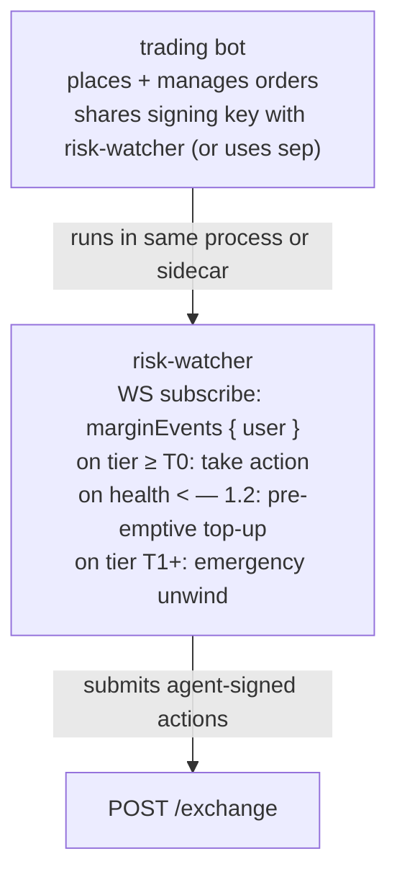
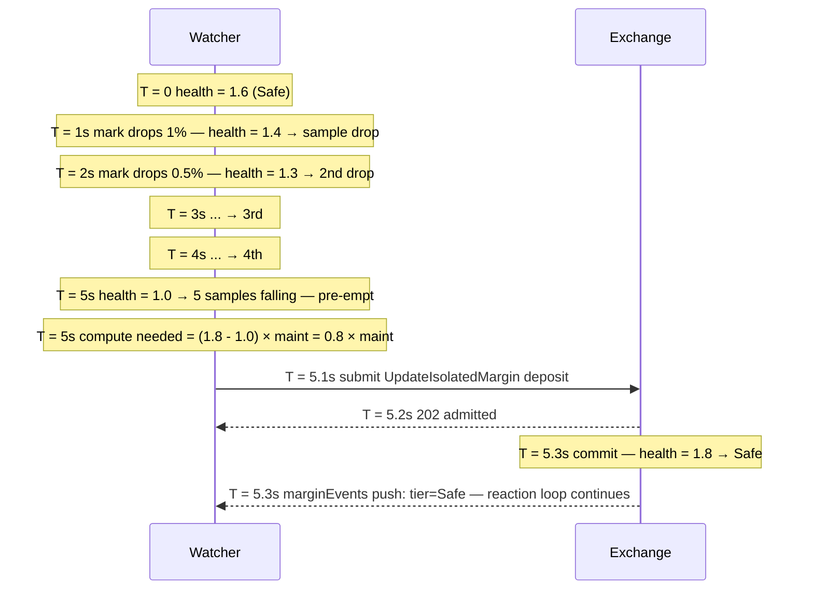

# Risk-watcher pattern

:::tip
**Stable.**
:::

A risk-watcher is an automated process that monitors your account's health and intervenes — depositing margin, reducing position, or trading defensively — before the protocol's [tiered liquidation](../concepts/tiered-liquidation.md) ladder fires on you.

Production trading bots that hold positions overnight should run one. The protocol's T0 yellow card buys you one block (~100ms); a risk-watcher uses that block productively.

## TL;DR

Subscribe to `marginEvents`, react to tier transitions, top up via `UpdateIsolatedMargin` (Isolated) or `Deposit` (Cross) before `maint_margin` becomes binding.

## Architecture



The watcher is a separate logical process even when co-located — its decisions are independent of the trading strategy's decisions. A common failure mode is conflating "should I close this position?" with "should I take this trade?"; risk-watchers answer only the first.

## Inputs

- `marginEvents` WS push: live `account_value`, `maint_margin`, `health`, `tier`.
- `mark` WS push (per held asset): for forward-looking estimation.
- `fundingTicks` WS push: to anticipate hourly funding charges.

## Reaction rules

| Trigger | Action | Rationale |
|---------|--------|-----------|
| `health < 1.5` and falling for 5 consecutive samples | Pre-emptive deposit to bring health to 1.8 | Buffer before T0 |
| `tier transition to T0` | Immediate deposit OR partial close | One block to act before T1 |
| `tier transition to T1` | Emergency: full close on highest-loss position | Pre-empt the partial close at a worse price |
| `funding payment in next 1 minute > 0.5 × free_collateral` | Pre-pay deposit | Funding charge can flip you into T0 |
| Mark moves > 3× recent-1h sigma in 30s | Snapshot positions + alert operator | Possible regime shift |

Tune thresholds to your strategy. Aggressive market-makers: tighter buffers (health 1.3 floor). Conservative books: looser (health 1.8 floor).

## Implementation sketch (TypeScript)

```typescript
import { MetaFluxClient } from '@metaflux/sdk';

const trader = new MetaFluxClient({ /* trading agent */ });
const watcher = new MetaFluxClient({ /* dedicated watcher agent */ });

const TARGET_HEALTH = 1.8;
const T0_DEPOSIT_USDC = 1000;  // tune to position size

let recentSamples: number[] = [];

watcher.ws().subscribe('marginEvents', { user: trader.address }, async (event) => {
  const { health, tier, account_value, maint_margin } = event.data;

  recentSamples.push(health);
  if (recentSamples.length > 5) recentSamples.shift();

  // Tier-based reactions
  if (tier === 'T1') {
    console.log('[ALERT] T1 — emergency unwind');
    await emergencyUnwind(trader);
    return;
  }
  if (tier === 'T0') {
    console.log('[WARN] T0 — top up');
    await deposit(watcher, T0_DEPOSIT_USDC);
    return;
  }

  // Pre-emptive
  const allFalling = recentSamples.length === 5
    && recentSamples.every((h, i) => i === 0 || h < recentSamples[i-1]);
  if (allFalling && health < 1.5) {
    console.log('[INFO] pre-emptive top-up');
    const needed = Math.ceil((TARGET_HEALTH * maint_margin - account_value) / 1e6);
    await deposit(watcher, needed);
  }
});

async function deposit(c: MetaFluxClient, usdc: number) {
  // For Cross: assume USDC already in the master's free balance
  // For Isolated: use UpdateIsolatedMargin to add to the bucket
  await c.exchange.updateIsolatedMargin({
    asset: 0,
    isIsolated: true,
    isolatedAmount: (usdc * 1e6).toString(),
  });
}

async function emergencyUnwind(c: MetaFluxClient) {
  const state = await c.info.clearinghouseState();
  for (const pos of state.assetPositions) {
    // close the largest-loss position first
    await c.exchange.order({
      asset: pos.coin,
      isBuy: pos.szi < 0,    // opposite side closes
      price: '0',            // market (extreme price)
      size:  Math.abs(pos.szi).toString(),
      tif:   'Ioc',
      reduceOnly: true,
    });
  }
}
```

## Key choices

- **Separate agent for watcher.** Trader's agent does trading; watcher's agent does margin management. Compromise of trading host doesn't enable margin manipulation.
- **Watcher's authority.** Agents can submit `UpdateIsolatedMargin` and place / cancel orders. Agents CANNOT withdraw, so the watcher can't move funds off the account — only between sub-buckets. This is desired.
- **Watcher's nonce space.** Watcher and trader share the master's nonce space (per [agent wallets](../concepts/agent-wallets.md)). Use `Date.now()` on both — collision risk is sub-millisecond.

## Pre-deposit math

To bring health from H₀ to target H₁:

```
needed_deposit = (H₁ - H₀) × maint_margin
```

Example: maint = 10 USDC, current health 1.0, target 1.5.
needed = (1.5 - 1.0) × 10 = 5 USDC.

Cap your watcher's per-block deposit to avoid spending too much on a transient regime. Aggressive default: 1× position notional reserved for top-ups; once exhausted, escalate to operator.

## Sequence — pre-emptive top-up



## Failure modes

- **Watcher and trader race.** Trader submits a new position; watcher reacts to the in-flight position. Resolve: only react after commit (margin events fire on commit, so this is already the case).
- **Watcher's own agent expired.** Mid-stress, watcher can't act. Mitigation: tight rotation cadence, monitoring of agent expiry, never < 24h to expiry.
- **Mempool full during stress.** Watcher's deposit gets 503'd. Backoff with exponential jitter; submit at most every 100ms.
- **Deposit succeeds but oracle stays bad.** The deposit raises account_value; if maint also rose (mark moved against you), health may not improve enough. Loop: re-evaluate after commit; deposit again or unwind.

## When NOT to deploy a risk-watcher

- Very short-lived positions (open and close within a single block) — health doesn't matter.
- Pure spot trading with no margin — no liquidation ladder applies.
- Fully isolated single-position bots where you've explicitly accepted the bucket loss limit — automating top-ups defeats the firewalling.

## See also

- [Tiered liquidation](../concepts/tiered-liquidation.md) — the ladder you're defending against
- [`userEvents` WS](../api/ws/subscriptions.md#userevents) — margin / tier transitions ride this channel
- [`update_isolated_margin`](../api/rest/exchange.md#update_isolated_margin)
- [Agent wallets](../concepts/agent-wallets.md) — watcher needs its own approved agent
- [Error handling](./error-handling.md) — for the deposit submission retry logic
