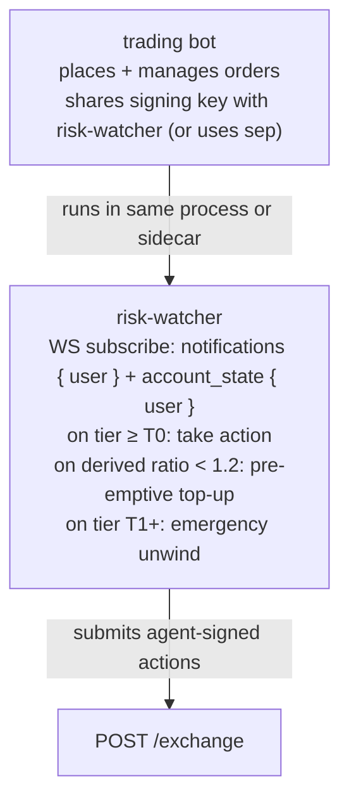
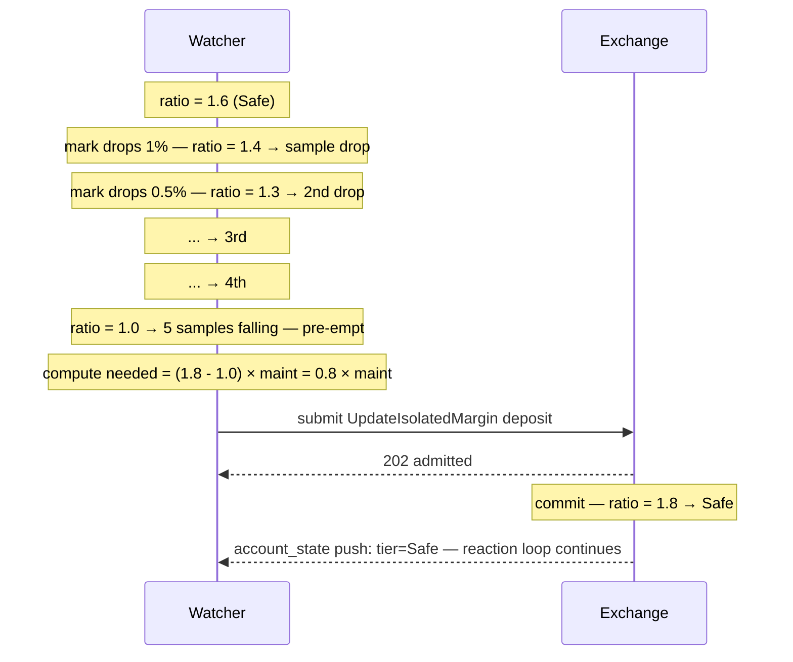

# Risk-watcher pattern

:::tip
**Stable.**
:::

A risk-watcher is an automated process that monitors your account's health and intervenes — depositing margin, reducing position, or trading defensively — before the protocol's [tiered liquidation](../concepts/tiered-liquidation.md) ladder fires on you.

Production trading bots that hold positions overnight should run one. The protocol's T0 yellow card buys you exactly one committed block; a risk-watcher uses that block productively. Block cadence is a governed, per-deployment target, not a fixed duration — measure your own deployment's committed-round rate if your reaction budget depends on the wall-clock size of that window.

## TL;DR {#tldr}

Subscribe to [`notifications`](../api/ws/subscriptions.md#notifications) for tier transitions and [`account_state`](../api/ws/subscriptions.md#account_state) for the continuous margin values, top up via `UpdateIsolatedMargin` (Isolated) or `Deposit` (Cross) before `maint_margin` becomes binding.

## Architecture {#architecture}


```mermaid
flowchart TD
    bot["trading bot<br/>places + manages orders<br/>shares signing key with risk-watcher (or uses sep)"]
    watcher["risk-watcher<br/>WS subscribe: notifications { user } + account_state { user }<br/>on tier ≥ T0: take action<br/>on derived ratio < 1.2: pre-emptive top-up<br/>on tier T1+: emergency unwind"]
    exchange["POST /exchange"]

    bot -->|"runs in same process or sidecar"| watcher
    watcher -->|"submits agent-signed actions"| exchange
```

The watcher is a separate logical process even when co-located — its decisions are independent of the trading strategy's decisions. A common failure mode is conflating "should I close this position?" with "should I take this trade?"; risk-watchers answer only the first.

## Inputs {#inputs}

- [`notifications`](../api/ws/subscriptions.md#notifications) WS push: tier transitions (`yellow_card` / `forced_close_tier` / `tier_cleared` / `forced_close`) — the immediate signal that a tier changed.
- [`account_state`](../api/ws/subscriptions.md#account_state) WS push: live `account_value`, `maint_margin`, `tier`. Derive your own health ratio from the first two — see [two meanings of health](../concepts/tiered-liquidation.md#two-meanings-of-health); the wire `health` field is a signed dollar figure, not this ratio.
- [`markets`](../api/ws/subscriptions.md#markets) WS push: `mark_px` for forward-looking estimation, and `funding.rate_per_hr` / `funding.next_payment_ts` per market to anticipate the next funding charge before it settles.
- [`user_fundings`](../api/ws/subscriptions.md#user_fundings) WS push: realized funding payments — one record per settlement, AFTER it applies. This channel cannot anticipate the next charge; use the `markets` row's `funding` block for that.

## Reaction rules {#reaction-rules}

| Trigger | Action | Rationale |
|---------|--------|-----------|
| Derived ratio < 1.5 and falling for 5 consecutive samples | Pre-emptive deposit to bring the ratio to 1.8 | Buffer before T0 |
| `tier transition to T0` | Immediate deposit OR partial close | One block to act before T1 |
| `tier transition to T1` | Emergency: full close on highest-loss position | Pre-empt the partial close at a worse price |
| Projected charge from the `markets` row's `funding` (`rate_per_hr` × position notional, due at `next_payment_ts`) > 0.5 × `withdrawable` | Pre-pay deposit before settlement | Funding charge can flip you into T0 |
| Mark moves > 3× recent-1h sigma in 30s | Snapshot positions + alert operator | Possible regime shift |

Tune thresholds to your strategy. Aggressive market-makers: tighter buffers (ratio 1.3 floor). Conservative books: looser (ratio 1.8 floor).

## Implementation sketch (TypeScript) {#implementation-sketch-typescript}

```typescript
import { Client, isChannelFrame } from '@metaflux-dex/client';

const trader = new Client({ baseUrl, privateKey: traderAgentKey /* trading agent */ });
const watcher = new Client({ baseUrl, privateKey: watcherAgentKey /* dedicated watcher agent */ });
const traderAddr = '0x<MASTER_ADDRESS>';

const TARGET_RATIO = 1.8;
const T0_DEPOSIT_USDC = 1000;  // tune to position size

interface MarginSummary {
  account_value: string;
  maint_margin: string;
}

let recentSamples: number[] = [];

// `account_state` does NOT carry an account-level `maint_margin` — only the
// signed-dollar `health` field. The account-level `maint_margin` needed for
// the ratio lives ONLY on the margin-depth account read, which has no
// dedicated SDK wrapper — use the typed `raw` escape hatch and poll it.
async function pollMarginSummary() {
  const summary = await watcher.info.raw<MarginSummary>({
    type: 'account_state', detail: 'margin',
    address: traderAddr,
  });
  const accountValue = Number(summary.account_value);
  const maintMargin = Number(summary.maint_margin);
  const ratio = maintMargin === 0 ? Infinity : accountValue / maintMargin;

  recentSamples.push(ratio);
  if (recentSamples.length > 5) recentSamples.shift();

  const allFalling = recentSamples.length === 5
    && recentSamples.every((h, i) => i === 0 || h < recentSamples[i - 1]!);
  if (allFalling && ratio < 1.5) {
    console.log('[INFO] pre-emptive top-up');
    const needed = (TARGET_RATIO * maintMargin - accountValue).toFixed(2);
    await deposit(watcher, needed);
  }
}

// notifications fires exactly on tier transitions — react to `kind` directly
// instead of polling a threshold.
async function watchNotifications() {
  const ws = await watcher.connectWs();
  ws.onMessage(async (f) => {
    if (!isChannelFrame(f, 'notifications')) return;
    for (const record of f.data) {
      if (record.kind === 'forced_close_tier') {
        console.log(`[ALERT] ${record.tier ?? 'unknown'} — emergency unwind`);
        await emergencyUnwind(trader);
      }
      if (record.kind === 'yellow_card') {
        console.log('[WARN] T0 — top up');
        await deposit(watcher, T0_DEPOSIT_USDC.toString());
      }
    }
  });
  await ws.subscribe({ type: 'notifications', user: traderAddr });
}

async function deposit(c: Client, usdcDelta: string) {
  // Isolated: add to the bucket. For Cross, deposit via the bridge instead —
  // Cross collateral is the account's one unified USDC balance.
  await c.updateIsolatedMargin({ asset: 0, delta: usdcDelta });
}

async function emergencyUnwind(c: Client) {
  const state = await c.info.accountState(traderAddr);
  const positions = state.clearinghouse_state['']?.positions ?? [];
  for (const pos of positions) {
    // close the largest-loss position first — pick pos by unrealised PnL yourself
    const size = Number(pos.size);
    await c.submitOrderNative({
      owner: traderAddr,
      market: 0, // look up the market id for `pos.coin` via marketsMeta()
      side: size < 0 ? 'bid' : 'ask', // opposite side closes
      kind: 'market',
      size: Math.round(Math.abs(size) * 1e6),
      limit_px: 0,
      tif: 'ioc',
      stp_mode: 'cancel_newest',
      reduce_only: true,
    });
  }
}
```

## Key choices {#key-choices}

- **Separate agent for watcher.** Trader's agent does trading; watcher's agent does margin management. Compromise of trading host doesn't enable margin manipulation.
- **Watcher's authority.** Agents can submit `UpdateIsolatedMargin` and place / cancel orders. Agents CANNOT withdraw, so the watcher can't move funds off the account — only between sub-buckets. This is desired.
- **Watcher's nonce space.** Watcher and trader share the master's nonce space (per [agent wallets](../concepts/agent-wallets.md)). Use `Date.now()` on both — collision risk is sub-millisecond.

## Pre-deposit math {#pre-deposit-math}

To bring your derived ratio from H₀ to target H₁ (H here is the ratio from [two meanings of health](../concepts/tiered-liquidation.md#two-meanings-of-health), not the wire `health` field):

```
needed_deposit = (H₁ - H₀) × maint_margin
```

Example: maint = 10 USDC, current health 1.0, target 1.5.
needed = (1.5 - 1.0) × 10 = 5 USDC.

Cap your watcher's per-block deposit to avoid spending too much on a transient regime. Aggressive default: 1× position notional reserved for top-ups; once exhausted, escalate to operator.

## Sequence — pre-emptive top-up {#sequence--pre-emptive-top-up}


```mermaid
sequenceDiagram
    Note over Watcher: ratio = 1.6 (Safe)
    Note over Watcher: mark drops 1% — ratio = 1.4 → sample drop
    Note over Watcher: mark drops 0.5% — ratio = 1.3 → 2nd drop
    Note over Watcher: ... → 3rd
    Note over Watcher: ... → 4th
    Note over Watcher: ratio = 1.0 → 5 samples falling — pre-empt
    Note over Watcher: compute needed = (1.8 - 1.0) × maint = 0.8 × maint
    Watcher->>Exchange: submit UpdateIsolatedMargin deposit
    Exchange-->>Watcher: 202 admitted
    Note over Exchange: commit — ratio = 1.8 → Safe
    Exchange-->>Watcher: account_state push: tier=Safe — reaction loop continues
```

## Failure modes {#failure-modes}

- **Watcher and trader race.** Trader submits a new position; watcher reacts to the in-flight position. Resolve: only react after commit (margin events fire on commit, so this is already the case).
- **Watcher's own agent expired.** Mid-stress, watcher can't act. Mitigation: tight rotation cadence, monitoring of agent expiry, never < 24h to expiry.
- **Mempool full during stress.** Watcher's deposit gets 503'd. Backoff with exponential jitter; submit at most every 100ms.
- **Deposit succeeds but oracle stays bad.** The deposit raises account_value; if maint also rose (mark moved against you), health may not improve enough. Loop: re-evaluate after commit; deposit again or unwind.

## When NOT to deploy a risk-watcher {#when-not-to-deploy-a-risk-watcher}

- Very short-lived positions (open and close within a single block) — health doesn't matter.
- Pure spot trading with no margin — no liquidation ladder applies.
- Fully isolated single-position bots where you've explicitly accepted the bucket loss limit — automating top-ups defeats the firewalling.

## See also {#see-also}

- [Tiered liquidation](../concepts/tiered-liquidation.md) — the ladder you're defending against
- [`notifications` WS](../api/ws/subscriptions.md#notifications) — tier transitions ride this channel
- [`account_state` WS](../api/ws/subscriptions.md#account_state) — continuous margin values
- [`update_isolated_margin`](../api/rest/exchange.md#update_isolated_margin)
- [Agent wallets](../concepts/agent-wallets.md) — watcher needs its own approved agent
- [Error handling](./error-handling.md) — for the deposit submission retry logic
