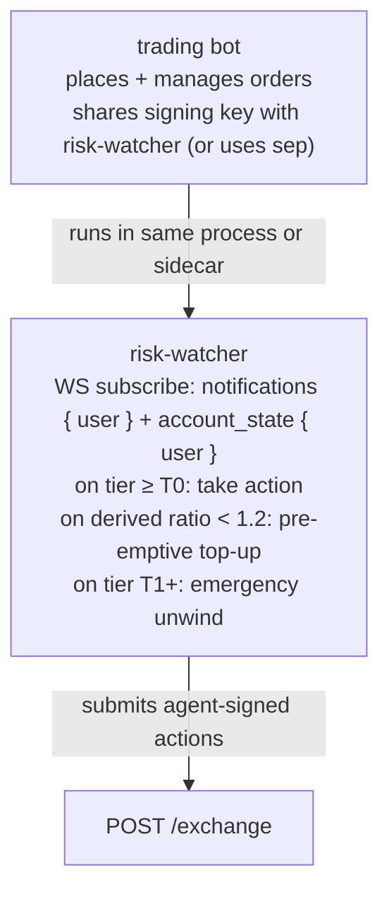
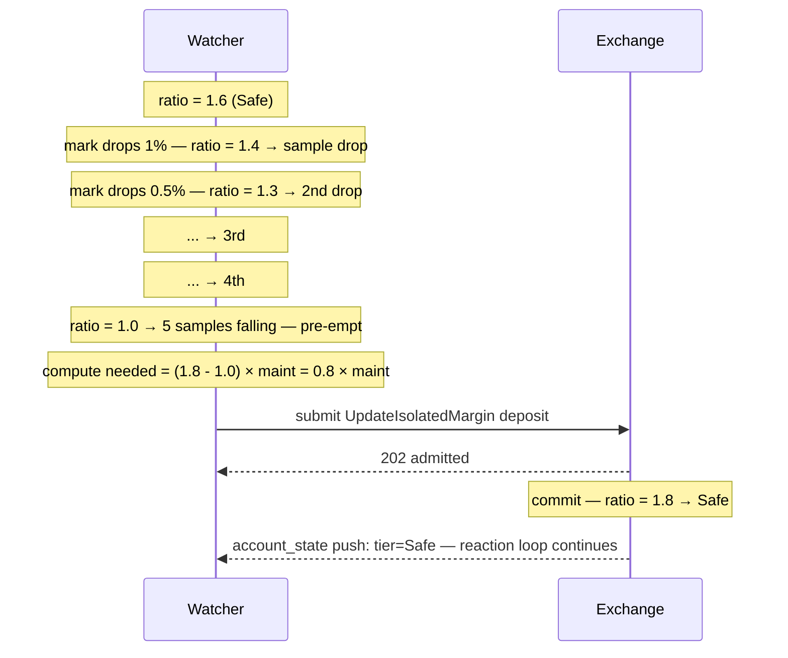

# Risk-watcher pattern

This page describes a risk-watcher: a process that protects an account from liquidation.

:::tip
**Stable.**
:::

A *risk-watcher* is an automated process that monitors your account's health. It acts before the
protocol's [tiered liquidation](../concepts/tiered-liquidation.md) ladder fires on you. It can
deposit margin, reduce a position or trade defensively.

Production trading bots that hold positions overnight should run one. The protocol's T0 yellow card
gives you exactly one committed block. A risk-watcher uses that block to act. Block cadence is a
governed target per deployment. It is not a fixed duration. If your reaction budget depends on
the wall-clock size of that window, measure the committed-round rate of your own deployment.

## Summary {#tldr}

Subscribe to [`notifications`](../api/ws/subscriptions.md#notifications) for tier transitions,
and to [`account_state`](../api/ws/subscriptions.md#account_state) for the continuous margin
values. Add margin before the maintenance requirement becomes binding: use
`UpdateIsolatedMargin` for Isolated, or `Deposit` for Cross.

## Architecture {#architecture}


```mermaid
flowchart TD
    bot["trading bot<br/>places + manages orders<br/>shares signing key with risk-watcher (or uses sep)"]
    watcher["risk-watcher<br/>WS subscribe: notifications { user } + account_state { user }<br/>on tier ≥ T0: take action<br/>on derived ratio < 1.2: pre-emptive top-up<br/>on tier T1+: emergency unwind"]
    exchange["POST /exchange"]

    bot -->|"runs in same process or sidecar"| watcher
    watcher -->|"submits agent-signed actions"| exchange
```

The watcher is a separate logical process, also when it runs on the same host. Its decisions are
independent of the trading strategy's decisions. A common failure is to mix two questions: "close
this position?" and "take this trade?". A risk-watcher answers only the first.

## Inputs {#inputs}

- [`notifications`](../api/ws/subscriptions.md#notifications) WS push: tier transitions
  (`yellow_card` / `forced_close_tier` / `tier_cleared` / `forced_close`). This is the first
  signal that a tier changed.
- [`account_state`](../api/ws/subscriptions.md#account_state) WS push: live `account_value`,
  `total_raw_usd`, `perp.total_ntl_pos`, `tier`. The account-level
  `cross_maintenance_margin_used` is not on this push. Poll `detail: "margin"` for it. Derive your
  own health ratio from `account_value` and `cross_maintenance_margin_used`. See
  [two meanings of health](../concepts/tiered-liquidation.md#two-meanings-of-health). The wire
  `health` field is a signed dollar figure, not this ratio.
- [`markets`](../api/ws/subscriptions.md#markets) WS push: `mark_px` for forward estimates, and
  `funding.rate_per_hr` / `funding.next_payment_ts` per market. Use them to predict the next
  funding charge before it settles.
- [`user_fundings`](../api/ws/subscriptions.md#user_fundings) WS push: realized funding payments,
  one record per settlement, after it applies. This channel cannot predict the next charge. Use
  the `funding` block of the `markets` row for that.

## Reaction rules {#reaction-rules}

| Trigger | Action | Rationale |
|---------|--------|-----------|
| Derived ratio < 1.5 and falling for 5 consecutive samples | Pre-emptive deposit to bring the ratio to 1.8 | Buffer before T0 |
| `tier transition to T0` | Immediate deposit OR partial close | One block to act before T1 |
| `tier transition to T1` | Emergency: full close on highest-loss position | Close before the partial close at a worse price |
| Projected charge from the `markets` row's `funding` (`rate_per_hr` × position notional, due at `next_payment_ts`) > 0.5 × `withdrawable` | Pre-pay deposit before settlement | A funding charge can move you into T0 |
| Mark moves > 3× recent-1h sigma in 30s | Snapshot positions + alert operator | Possible regime shift |

Tune the thresholds to your strategy. Aggressive market makers use tighter buffers (ratio 1.3
floor). Conservative books use looser buffers (ratio 1.8 floor).

## Implementation sketch (TypeScript) {#implementation-sketch-typescript}

```typescript
import { Client, isChannelFrame } from '@metaflux-dex/client';

const trader = new Client({ baseUrl, privateKey: traderAgentKey /* trading agent */ });
const watcher = new Client({ baseUrl, privateKey: watcherAgentKey /* dedicated watcher agent */ });
const traderAddr = '0x<MASTER_ADDRESS>';

const TARGET_RATIO = 1.8;
const T0_DEPOSIT_USDC = 1000;  // tune to position size

interface MarginSummary {
  account_value: string;
  cross_maintenance_margin_used: string;
}

let recentSamples: number[] = [];

// The full `account_state` does NOT carry an account-level maintenance figure —
// only the signed-dollar `health` field. `cross_maintenance_margin_used`, which
// the ratio needs, lives ONLY on the margin-depth account read, and that read
// has no dedicated SDK wrapper — use the typed `raw` escape hatch and poll it.
// The scope is the CROSS bucket: this watcher does not cover an isolated leg.
async function pollMarginSummary() {
  const summary = await watcher.info.raw<MarginSummary>({
    type: 'account_state', detail: 'margin',
    address: traderAddr,
  });
  const accountValue = Number(summary.account_value);
  const maintMargin = Number(summary.cross_maintenance_margin_used);
  const ratio = maintMargin === 0 ? Infinity : accountValue / maintMargin;

  recentSamples.push(ratio);
  if (recentSamples.length > 5) recentSamples.shift();

  const allFalling = recentSamples.length === 5
    && recentSamples.every((h, i) => i === 0 || h < recentSamples[i - 1]!);
  if (allFalling && ratio < 1.5) {
    console.log('[INFO] pre-emptive top-up');
    const needed = (TARGET_RATIO * maintMargin - accountValue).toFixed(2);
    await deposit(watcher, needed);
  }
}

// notifications fires exactly on tier transitions — react to `kind` directly
// instead of polling a threshold.
async function watchNotifications() {
  const ws = await watcher.connectWs();
  ws.onMessage(async (f) => {
    if (!isChannelFrame(f, 'notifications')) return;
    for (const record of f.data) {
      if (record.kind === 'forced_close_tier') {
        console.log(`[ALERT] ${record.tier ?? 'unknown'} — emergency unwind`);
        await emergencyUnwind(trader);
      }
      if (record.kind === 'yellow_card') {
        console.log('[WARN] T0 — top up');
        await deposit(watcher, T0_DEPOSIT_USDC.toString());
      }
    }
  });
  await ws.subscribe({ type: 'notifications', user: traderAddr });
}

async function deposit(c: Client, usdcDelta: string) {
  // Isolated: add to the bucket. For Cross, deposit via the bridge instead —
  // Cross collateral is the account's one unified USDC balance.
  await c.updateIsolatedMargin({ asset: 0, delta: usdcDelta });
}

async function emergencyUnwind(c: Client) {
  // Positions live on their own read now, not inside accountState. Never mix a
  // number from this frame with one from an accountState frame: the two can be
  // rendered a commit apart. Compare `height` if you must combine them.
  const state = await c.info.clearinghouseState(traderAddr);
  const positions = state.clearinghouse_state['']?.positions ?? [];
  for (const pos of positions) {
    // close the largest-loss position first — pick pos by unrealised PnL yourself
    const size = Number(pos.size);
    await c.submitOrderNative({
      owner: traderAddr,
      market: 0, // look up the market id for `pos.coin` via marketsMeta()
      side: size < 0 ? 'bid' : 'ask', // opposite side closes
      kind: 'market',
      size: Math.round(Math.abs(size) * 1e6),
      limit_px: 0,
      tif: 'ioc',
      stp_mode: 'cancel_newest',
      reduce_only: true,
    });
  }
}
```

## Key choices {#key-choices}

- **A separate agent for the watcher.** The trader's agent trades. The watcher's agent manages
  margin. A compromised trading host therefore cannot manipulate margin.
- **Watcher authority.** Agents can submit `UpdateIsolatedMargin` and place or cancel orders.
  Agents cannot withdraw. The watcher therefore cannot move funds off the account, only between
  sub-buckets. This limit is intended.
- **Watcher nonce space.** The watcher and the trader share the master's nonce space, as
  [agent wallets](../concepts/agent-wallets.md) describes. Use `Date.now()` on both. The
  collision risk is below one millisecond.

## Pre-deposit math {#pre-deposit-math}

This formula moves your derived ratio from H₀ to a target H₁. H here is the ratio from
[two meanings of health](../concepts/tiered-liquidation.md#two-meanings-of-health). It is not
the wire `health` field.

```
needed_deposit = (H₁ - H₀) × cross_maintenance_margin_used
```

Example: maintenance = 10 USDC, current health 1.0, target 1.5.
needed = (1.5 - 1.0) × 10 = 5 USDC.

Cap the watcher's deposit per block, so that it does not spend too much on a short regime. An
aggressive default reserves 1× position notional for these deposits. When the reserve is used
up, escalate to the operator.

## Pre-emptive deposit sequence {#sequence--pre-emptive-top-up}


```mermaid
sequenceDiagram
    Note over Watcher: ratio = 1.6 (Safe)
    Note over Watcher: mark drops 1% — ratio = 1.4 → sample drop
    Note over Watcher: mark drops 0.5% — ratio = 1.3 → 2nd drop
    Note over Watcher: ... → 3rd
    Note over Watcher: ... → 4th
    Note over Watcher: ratio = 1.0 → 5 samples falling — pre-empt
    Note over Watcher: compute needed = (1.8 - 1.0) × maint = 0.8 × maint
    Watcher->>Exchange: submit UpdateIsolatedMargin deposit
    Exchange-->>Watcher: 202 admitted
    Note over Exchange: commit — ratio = 1.8 → Safe
    Exchange-->>Watcher: account_state push: tier=Safe — reaction loop continues
```

## Failure modes {#failure-modes}

- **Watcher and trader race.** The trader submits a new position, and the watcher reacts to the
  in-flight position. Fix: react only after commit. Margin events fire on commit, so this is
  already the case.
- **The watcher's own agent expired.** Under stress, the watcher cannot act. Mitigation: a short
  rotation cadence, monitoring of agent expiry, and never less than 24h to expiry.
- **Mempool full under stress.** The watcher's deposit gets a 503. Back off with exponential
  jitter. Submit at most once every 100ms.
- **The deposit succeeds, but the oracle stays bad.** The deposit raises `account_value`. If the
  maintenance requirement also rose because the mark moved against you, health can stay too low.
  Loop: re-evaluate after commit, then deposit again or unwind.

## Cases that need no risk-watcher {#when-not-to-deploy-a-risk-watcher}

- Very short-lived positions that open and close within one block. Health does not matter.
- Pure spot trading with no margin. No liquidation ladder applies.
- Fully isolated single-position bots where you accept the bucket loss limit on purpose.
  Automated deposits defeat the isolation.

## See also {#see-also}

- [Tiered liquidation](../concepts/tiered-liquidation.md): the ladder the watcher defends
  against
- [`notifications` WS](../api/ws/subscriptions.md#notifications): tier transitions arrive on this
  channel
- [`account_state` WS](../api/ws/subscriptions.md#account_state): continuous margin values
- [`clearinghouse_state` WS](../api/ws/subscriptions.md#clearinghouse_state): the position rows
  that an unwind needs
- [`update_isolated_margin`](../api/rest/exchange/margin-risk.md#update_isolated_margin)
- [Agent wallets](../concepts/agent-wallets.md): the watcher needs its own approved agent
- [Error handling](./error-handling.md): the retry logic for the deposit submission
