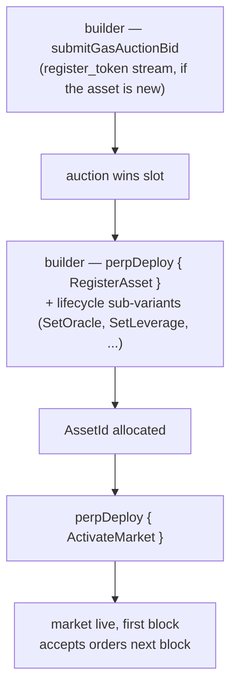

# MIP-3 — Permissionless perp market deploy

:::info
**Implemented.**
:::

Any builder can deploy a new perpetual market on MetaFlux by paying through an on-chain gas auction. There is no protocol-team gate, no review committee, no allow-list. The auction price plus a minimum deposit are the only barriers. (Permissionless **spot** market deploy is the sibling proposal, [MIP-1](./mip-1.md).)

## Why this exists

A core differentiation axis. Centralised exchanges curate listings; MetaFlux makes the listing process itself part of the protocol. Builders who want a market for some niche asset don't need permission — they need to win an auction and supply seed parameters.

This is MetaFlux's adaptation of the permissionless-market-deploy design pioneered by leading on-chain perp venues, with the following equivalences and adjustments preserved:

- Three distinct gas-auction streams (`perp_deploy_gas_auction`, `spot_pair_deploy_gas_auction`, `register_token_gas_auction`) — same structure as HL. Perp deploy is MIP-3; the spot streams back [MIP-1](./mip-1.md).
- Auction parameters (decay, refund window, slot interval) governance-configurable
- Initial maintenance ratio, max leverage, funding cap — submitted with the deploy bid, bounded by governance-set ranges

## Deploy flow



Perp deployment is the `perpDeploy` action, dispatched by a `PerpDeployKind` sub-variant covering the full market lifecycle (8 sub-variants):

1. **`RegisterAsset`** — register a new perpetual asset; allocates an `AssetId`. (Requires the token symbol to be registered first, via the `register_token_gas_auction` stream, if it isn't already.)
2. **`SetOracle`** — bind / rotate the oracle source subset for the asset.
3. **`SetLeverage`** — set the max leverage cap.
4. **`SetFeeTier`** — set the maker / taker fee tier (bps, capped by per-market limits).
5. **`SetMakerRebate`** — set the maker rebate (bps, ≤ 2).
6. **`SetMinSize`** — set the minimum order size for the market.
7. **`ActivateMarket`** — activate the market (allow trading; requires full config).
8. **`DeactivateMarket`** — close to new orders (existing positions remain).

Winning a deploy slot goes through the gas auction: a builder calls **`submitGasAuctionBid { auction_kind, bid_amount, ... }`** against the relevant stream. Each bid carries:
- A USDC amount, escrowed at submit and refunded on loss (minus a small fee).
- The market spec — initial leverage, maintenance margin ratio, funding parameters, oracle source config.

Auctions resolve at block boundaries — highest bidder per slot wins, paid amount is burned (not paid to anyone), spec parameters become the deployed market's parameters.

## Bid escrow & refund

Bids are held in escrow while the auction runs. On loss, the bid is returned to the builder's account minus a small auction fee. On win, the winning amount is burned at slot close (not paid to anyone).

Active bids are visible via:

```json
POST /info { "type": "mip3_active_bids" }
```

## Parameter bounds

Governance sets the bounds within which bid spec parameters must fall:

- Initial leverage in `[1, max_leverage]` (default `max_leverage = 50`)
- Maintenance margin ratio ≥ `min_maintenance_ratio` (default 1%)
- Funding cap ≤ `max_funding_per_hour` (default 0.5%)
- Oracle source from approved list

Bids with out-of-bounds parameters are rejected at submission.

## Auction parameters

Per stream (perp / spot / token-register), the auction has:

- **Slot interval** — how often a new auction settles (governance, default 1 hour)
- **Decay** — how the minimum bid declines if a slot is unclaimed (governance, default linear over 24 h)
- **Refund window** — how long after slot close losing bidders can claim refunds (governance, default 7 days)

All three are governance-mutable via the `SetGlobal` action (MIP-3 builder-governance globals: `SetGasAuctionDuration`, `SetMinDeployStake`, `SetGasAuctionMinBid`, `SetDeployerFeeCap`, `SetPerMarketLimits`, `SetEnableMip3`).

## After deploy

The new market lives in the canonical asset registry from the next block. Liquidity is the builder's problem; the protocol provides no seed orders.

Builders typically bootstrap depth by combining an MIP-3 deploy with a liquidity source on the same market — [MIP-2 Metaliquidity](./mip-2.md), an external market maker drawn in by builder-fee rebates, or a user-created vault.

## MIP-4

See [MIP-4 — perps liquidity aggregator / internalizer](mip-4.md) for the MetaFlux-operated aggregator that complements permissionless deploy.

## See also

- [MIP-1 — spot token standard + market deployment](./mip-1.md) — the spot sibling of permissionless deploy
- [Tiered liquidation](../concepts/tiered-liquidation.md) — applies to MIP-3 deployed markets just like protocol-listed ones
- [Portfolio margin](../concepts/portfolio-margin.md) — MIP-3 markets opt into PM via the standard scenario inclusion
