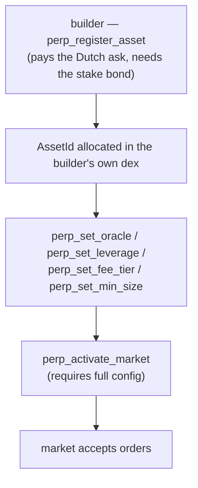

# MIP-3 — Permissionless perp market deploy

:::warning
**The deploy actions are not callable yet.** The market-deploy logic runs in the
node today, but no public action reaches it, so `POST /exchange` cannot deploy a
perp market right now. The nine action tags below **ship in the next release**;
this page is written ahead of that release so integrators can build against the
final shape. Until it activates, posting any of these tags is refused as an
unknown action. Everything on this page about **fees, bonds and limits**
describes behaviour already in the node.

Nothing has ever been deployed through this lane. Every perpetual market live
today was listed by governance.
:::

Any builder can deploy a new perpetual market on MetaFlux by paying a deploy fee
and posting a staking bond. There is no protocol-team gate, no review committee
and no allow-list. (Permissionless **spot** market deploy is the sibling
proposal, [MIP-1](./mip-1.md), and it is callable today.)

## Why this exists {#why-this-exists}

A core protocol capability. Centralised exchanges curate listings; MetaFlux makes
the listing process itself part of the protocol. Builders who want a market for
some niche asset do not need permission — they need to pay the current ask and
bond stake they can lose.

## What a deploy costs {#what-a-deploy-costs}

Two independent barriers, and they are **not** alternatives to each other:

| Barrier | Amount | Paid how |
|---------|--------|----------|
| **Deploy fee** | The current Dutch-clock ask on the perp-deploy stream | Charged **at register**, from your **free collateral** |
| **Staking bond** | `mip3_deploy_min_stake` — about 50,000 MTF by default | Committed stake you already hold. **Slashable**, not spent |

The bond is checked at the moment a new market is allocated. Stake below the
floor is refused before anything is written, so a rejected deploy is a clean
no-op that costs nothing.

:::info
**There is no bid, no escrow and no refund.** An earlier draft of this page
described an auction where builders escrowed a USDC bid that was refunded on loss
and burned on win. **The node has never worked that way for perp deploy.** A
deploy carrying a non-zero bid is **rejected outright**; the deploy pays the
Dutch-clock ask at register instead. Nothing funds a perp-deploy escrow balance
and nothing can withdraw from one. Ignore any client code that still builds a
bid.
:::

The Dutch clock is a declining ask, not a competitive auction: the price falls
over the configured window until someone registers, and registering resets it.
You bound your exposure with the `max_deploy_fee` you sign — if the ask is above
that value, the call is rejected and you are charged nothing. The fee leaves
**free** collateral, so an account whose value is committed to open positions is
refused even when its total value covers the ask.

## Deploy flow {#deploy-flow}

```mermaid
flowchart TD
    A["builder — perp_register_asset<br/>(pays the Dutch ask, needs the stake bond)"] --> B["AssetId allocated in the builder's own dex"]
    B --> C["perp_set_oracle / perp_set_leverage /<br/>perp_set_fee_tier / perp_set_min_size"]
    C --> D["perp_activate_market<br/>(requires full config)"]
    D --> E["market accepts orders"]
```

Perp deployment is dispatched by sub-variant, **nine** of them, covering the full
market lifecycle:

| Action tag | Purpose |
|------------|---------|
| `perp_register_asset` | Register a new perpetual asset; allocates an `AssetId`. Pays the fee, requires the bond |
| `perp_set_oracle` | Bind or rotate the oracle source subset |
| `perp_set_leverage` | Set the max leverage cap |
| `perp_set_fee_tier` | Set the maker / taker fee tier |
| `perp_set_maker_rebate` | Set the maker rebate (≤ 2 bps) |
| `perp_set_min_size` | Set the market's minimum order size |
| `perp_activate_market` | Activate the market. Requires full config |
| `perp_deactivate_market` | Close to new orders. Existing positions remain |
| `perp_set_sub_deployers` | Add or remove a delegated sub-deployer. Deployer-authority only |

:::info
**Nine, not eight.** Older copies of this page and of the internal plan list
eight sub-variants and omit `perp_set_sub_deployers`. The node has nine.
:::

Only the deployer of record — or a sub-deployer it delegated — may call the
lifecycle actions on a market it deployed. Delegating is the one exception:
`perp_set_sub_deployers` needs the deployer's own authority, so a sub-deployer
cannot appoint another.

## Where the new market lands {#where-the-new-market-lands}

:::warning
**Not in the canonical asset registry.** A builder-deployed market is allocated
into **the deployer's own dex**, with an asset id at or above `1000`. It is
**isolated** from the primary market set: it never joins the shared perpetual
dex, and it does not appear alongside the protocol-listed markets. An earlier
version of this page promised the opposite. Only accounts that choose to trade
the market are exposed to it.
:::

This isolation is the main containment property of the design. A builder controls
the oracle and the fee tier of its own market; keeping that market out of the
shared set means those controls cannot reach a trader who never opted in.

## Oracle {#oracle}

A deployed market's index price is pushed by its deployer through the
`mip3_set_oracle_px` action (210), which is live today. The deployer or a
registered sub-deployer signs the push; the market's configured source subset
decides what is accepted.

Because the deployer operates the oracle for its own market, treat any
builder-deployed market as carrying **deployer price risk**. This is the reason
the market is isolated and the reason the bond is slashable.

## Limits {#limits}

Governance sets the bounds a deployed market must fall within. The defaults
below are the shipped values, not a promise about the live network — governance
can move any of them, so confirm the current value through
[validator governance](../api/rest/info/governance.md) before you rely on it:

| Bound | Meaning |
|-------|---------|
| `max_leverage` | Highest leverage a deployed market may set. Protocol cap is 50 |
| `max_taker_fee_dbps` | Highest taker fee, in **deci-bps**. Default `500`, i.e. 50 bps |
| `mip3_fee_ceiling_bps` | Governance fee ceiling, in **bps** |
| `max_oi` | Highest open interest the market may carry |
| `max_oi_per_second` | Highest open-interest increase admitted per one-second window |
| `mip3_max_deploys_per_epoch` | New registrations allowed per **deploy epoch** — a fixed window of 100,000 committed rounds, about 3 hours at the current cadence. Not the staking epoch. `0` means uncapped |

:::warning
**A `0` limit means uncapped, not blocked.** `mip3_fee_ceiling_bps` and
`mip3_max_deploys_per_epoch` are `0` on the live network today, and
`max_oi_per_second` defaults to `0`. A `0` leaves each of them fully open. These are **rate**
controls. The **off-switch** is `mip3_enabled`, a separate governance flag that
closes the whole lane. Never read a `0` cap as "deployment is closed".

Enforcement of `mip3_fee_ceiling_bps` and `mip3_max_deploys_per_epoch` **begins
in the next release**; today both are served on `/info` and bind nothing.
:::

**Unit trap.** `mip3_fee_ceiling_bps` is in basis points; the fee fields on the
wire are in **deci-bps**, tenths of a basis point. The two differ by a factor of
10.

Four further fields appear in the configuration but are **reserved and unused**:
`max_active_markets`, `min_self_stake`, `bid_increment`, and a second
`min_deploy_stake`. Nothing reads them. The live staking bond is
`mip3_deploy_min_stake`. Do not build against the reserved four.

## Liquidation on a deployed market {#liquidation}

A deployed market carries its own backstop settings, set by governance per asset.
They decide how a failing account on that market is closed.

| Setting | What it does | Enforced today |
|---------|--------------|----------------|
| `mode` | `Disabled` closes on the book and never escalates to the backstop tier. `Enabled` uses the normal ladder. `Capped` is meant to bound the treasury's exposure | **`Disabled` and `Enabled` only** |
| `band_floor` | Raises the health level at which the market escalates, ahead of the global band | **Yes** |
| `deficit_cap` | The bound `Capped` is meant to apply | **No. The value is stored and ignored, so `Capped` behaves exactly like `Enabled`** |

**A market with no settings defaults to `Disabled`** when it prices from its own
deployer oracle. Read the settings back before you rely on them: a vote that
records `deficit_cap` does not bound anything today.

## After deploy {#after-deploy}

Liquidity is the builder's problem; the protocol provides no seed orders.

Builders typically bootstrap depth by combining a deploy with a liquidity source
on the same market — [MIP-2 Metaliquidity](./mip-2.md), an external market maker
drawn in by builder-fee rebates, or a user-created vault.

## MIP-4 {#mip-4}

See [MIP-4 — perps liquidity aggregator / internalizer](mip-4.md) for the
MetaFlux-operated aggregator that complements permissionless deploy.

## See also {#see-also}

- [MIP-1 — spot token standard + market deployment](./mip-1.md) — the spot sibling, callable today
- [`POST /exchange`](../api/rest/exchange.md) — the action reference
- [Tiered liquidation](../concepts/tiered-liquidation.md) — applies to deployed markets like protocol-listed ones
- [Portfolio margin](../concepts/portfolio-margin.md) — deployed markets opt into PM via the standard scenario inclusion
