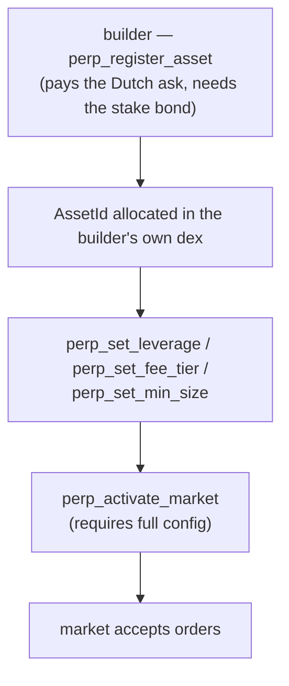

# MIP-3 — Permissionless perp market deploy

:::info
**The lane is live and in use.** Markets are deployed through it today. A
deployed market carries the deployer's dex prefix in its `coin`, so a market
named `GRAD:USDCNY` belongs to the `GRAD` dex and not to the primary market set.

One governance off-switch still applies per network: `mip3_enabled`. Read it
before you build on the lane, because a closed switch refuses a deploy call.
:::

Any builder can deploy a new perpetual market on MetaFlux by paying a deploy fee
and posting a staking bond. There is no protocol-team gate, no review committee
and no allow-list. (Permissionless **spot** market deploy is the sibling
proposal, [MIP-1](./mip-1.md), and it is callable today.)

## Why this exists {#why-this-exists}

A core protocol capability. Centralised exchanges curate listings; MetaFlux makes
the listing process itself part of the protocol. Builders who want a market for
some niche asset do not need permission — they need to pay the current ask and
bond stake they can lose.

## What a deploy costs {#what-a-deploy-costs}

Two independent barriers, and they are **not** alternatives to each other:

| Barrier | Amount | Paid how |
|---------|--------|----------|
| **Deploy fee** | The current Dutch-clock ask on the perp-deploy stream | Charged **at register**, from your **free collateral** |
| **Staking bond** | `mip3_deploy_min_stake` — about 50,000 MTF by default | Committed stake you already hold. **Slashable**, not spent |

The bond is checked at the moment a new market is allocated. Stake below the
floor is refused before anything is written, so a rejected deploy is a clean
no-op that costs nothing.

:::info
**There is no bid, no escrow and no refund.** An earlier draft of this page
described an auction where builders escrowed a USDC bid that was refunded on loss
and burned on win. **The node has never worked that way for perp deploy.** A
deploy carrying a non-zero bid is **rejected outright**; the deploy pays the
Dutch-clock ask at register instead. Nothing funds a perp-deploy escrow balance
and nothing can withdraw from one. Ignore any client code that still builds a
bid.
:::

The Dutch clock is a declining ask, not a competitive auction: the price falls
over the configured window until someone registers, and registering resets it.
You bound your exposure with the `max_deploy_fee` you sign — if the ask is above
that value, the call is rejected and you are charged nothing. The fee leaves
**free** collateral, so an account whose value is committed to open positions is
refused even when its total value covers the ask.

## Deploy flow {#deploy-flow}

```mermaid
flowchart TD
    A["builder — perp_register_asset<br/>(pays the Dutch ask, needs the stake bond)"] --> B["AssetId allocated in the builder's own dex"]
    B --> C["perp_set_leverage / perp_set_fee_tier /<br/>perp_set_min_size"]
    C --> D["perp_activate_market<br/>(requires full config)"]
    D --> E["market accepts orders"]
```

Perp deployment is dispatched by sub-variant, **ten** of them, covering the full
market lifecycle:

| Action tag | Purpose |
|------------|---------|
| `perp_register_asset` | Register a new perpetual asset; allocates an `AssetId`. Pays the fee, requires the bond |
| `perp_set_leverage` | Set the max leverage cap |
| `perp_set_fee_tier` | Set the maker / taker fee tier |
| `perp_set_maker_rebate` | Set the maker rebate (≤ 2 bps) |
| `perp_set_min_size` | Set the market's minimum order size |
| `perp_activate_market` | Activate the market. Requires full config |
| `perp_deactivate_market` | Close to new orders. Existing positions remain |
| `perp_set_fba_mode` | Set the matching venue: `0` returns the market to the CLOB, `100`-`5000` runs a frequent batch auction with that period in ms |
| `perp_set_sub_deployers` | Grant or revoke a delegate, all powers at once. Deployer-authority only |
| `perp_set_sub_deployer_perms` | Grant a delegate an exact permission mask. Deployer-authority only |
| `perp_set_oracle` | **RETIRED.** Refused from the next release — see below |

:::info
**Ten, not nine, and not eight.** Older copies of this page listed eight and
omitted `perp_set_sub_deployers`; a later copy listed nine and omitted
`perp_set_fba_mode`. The node dispatches ten today and eleven after the next
release, of which `perp_set_oracle` is refused. Ten are callable either way.
:::

## Delegation is per handler {#delegation}

Only the deployer of record — or a delegate it authorized — may call the
lifecycle actions on a market it deployed.

A delegate holds **one permission bit per handler**, so a grant names the
handlers, not the person: you can hand out the price push without handing out the
fee rates. The nine bits and the two granting lanes are on
[`perp_set_sub_deployers`](../api/rest/exchange.md#perp_set_sub_deployers).

Two rules bound it:

- **Delegating is never delegable.** Both granting lanes need the deployer's own
  authority. A delegate holding every bit still cannot appoint another. There is
  no bit for it.
- **An upgrade takes nothing away.** Every delegate committed before the release
  reads as the full mask afterwards, exactly the authority it has today. Narrow
  one by sending the mask you want it to keep.

:::warning Grant the mask explicitly
A delegate added by `perp_set_sub_deployers` alone holds every deployer power.
The mask narrows it, so send `perp_set_sub_deployer_perms` with the mask you
want the delegate to keep.
:::

## `perp_set_oracle` is retired {#perp-set-oracle-retired}

The action wrote a market's oracle source-subset mask, and **nothing read the
mask**. The call returned OK, committed state changed, and the market priced
exactly as before.

From the next release the node refuses it. Nothing replaces it, because it never
did anything: the deployer price control is
[`mip3_set_oracle_px`](../api/rest/exchange.md#mip3_set_oracle_px) (action 210), a
different action that stays. The mask field remains in market state, still with no
reader, until the next re-genesis.

## Where the new market lands {#where-the-new-market-lands}

:::warning
**Not in the canonical asset registry.** A builder-deployed market is allocated
into **the deployer's own dex**, with an asset id at or above `1000`. It is
**isolated** from the primary market set: it never joins the shared perpetual
dex, and it does not appear alongside the protocol-listed markets. An earlier
version of this page promised the opposite. Only accounts that choose to trade
the market are exposed to it.
:::

This isolation is the main containment property of the design. A builder controls
the oracle and the fee tier of its own market; keeping that market out of the
shared set means those controls cannot reach a trader who never opted in.

## Oracle {#oracle}

A deployed market does not price from the validator oracle median. Its index
price is pushed by its **deployer**, through the
[`mip3_set_oracle_px`](../api/rest/exchange.md#mip3_set_oracle_px) action (210).
The deployer, or a delegate holding [permission bit
0](../api/rest/exchange.md#perp_set_sub_deployers), signs each push.

Because the deployer operates the oracle for its own market, treat any
builder-deployed market as carrying **deployer price risk**. This is the reason
the market is isolated and the reason the bond is slashable.

:::warning
**Two corrections to an earlier version of this page.**

1. **The push is gated per chain, not unconditionally live.** The action sits
   behind the `mip3_deployer_oracle` protocol feature. That feature is active
   from genesis on a chain that started fresh, and dormant on any other chain
   until a two-thirds stake `ArmFeatures` vote arms it. While it is dormant, a
   push is refused with `mip3_deployer_oracle feature not active`. Read
   `feature_active` from
   the operator-lane [`mip3_deployer_oracle`](../api/rest/info.md#operator-reads) read on the
   network you target — do not assume a posture.
2. **The source subset mask does not decide what a push accepts.** The mask is
   committed per market, but nothing filters prices by it, and no read serves it
   — see [oracle prices](../concepts/oracle-prices.md#composition). That is why
   the action that wrote it, `perp_set_oracle`, is
   [retired](#perp-set-oracle-retired). A deployer push is bounded by the price
   rules below, and by nothing else.
:::

### Running the oracle for your market {#running-the-oracle}

The order below is the whole operator loop. Each rule has a reason, and the
reason is what tells you how to size your own push cadence.

1. **Register and activate the market first.** A push at an asset that is not a
   MIP-3 market is refused. Registration also fixes who may push: the
   `deployer`, plus any delegate granted [permission bit
   0](../api/rest/exchange.md#perp_set_sub_deployers).

2. **Choose the first price with care.** A push must sit within **±10 %** of the
   committed anchor — the last committed oracle price, or the market's committed
   mark price when no oracle price exists. A brand-new market has neither, so the
   first push has **no anchor** and any price in `(0, 1000000000000]` is accepted
   once. Every later push is chained to that value through the band, so a wrong
   first price takes several pushes to walk back. The band exists so that one
   push cannot teleport the mark and mass-liquidate the market.

3. **Expect the first push to change the margin regime.** The first push is the
   moment the market becomes deployer-priced. Cross-margin positions that already
   exist on the market are migrated into their own strict-isolated buckets. The
   migration conserves value per account: what leaves cross collateral arrives as
   isolated margin. Every position opened afterwards is strict-isolated too. The
   reason is containment — a market whose price one party controls must not share
   a collateral pool with markets that party does not control.

4. **Push faster than the staleness window.** The window is
   `mip3_stale_mark_ms`, default **60,000 ms**. Governance may set it in
   **[10,000 ms, 600,000 ms]**, and a cross-field rule ties it to the risk
   staleness window `risk_oracle_staleness_ms` (default 60,000 ms, governable in
   **[10,000 ms, 300,000 ms]**): the refresh window must stay **at or below** the
   staleness window. The two move together so a market can never be judged
   risk-stale before its own mark refresh has had a chance to fire. Confirm the
   live values before you size a cadence; do not assume the defaults.

5. **Know what a stale feed costs you.** Past the window the market turns
   **reduce-only for opens**: an order that opens or increases a position is
   refused, and a closing order still passes. Nobody is trapped in a position,
   and nobody can enter one either. This is deliberate. On a market where your
   feed is the only price, a frozen price with open entry is a free option
   against every trader on the book.

6. **Monitor with a read, not a stopwatch.**
   the operator-lane [`mip3_deployer_oracle`](../api/rest/info.md#operator-reads) read reports
   `stale`, `until_stale_ms`, and the reference stamp the gate itself uses. Alert
   on `until_stale_ms`, not on your own send time — a push counts only once it is
   committed.

:::info
**A part-time underlying yields a part-time market.** The staleness window is a
risk bound, not a trading calendar. If your underlying has venue hours, your feed
stops when the venue closes, and the market goes reduce-only for the closure.
Widening the window to span a weekend does not fix this — it lets anyone open
positions all weekend against a stale Friday price, which is the exact gap risk
the reduce-only flip exists to stop. If you want the market open through a
closure, publish a live derived price around the clock and stay inside the
window.
:::

**Price units.** `px` is a **whole-USDC decimal string**, never the `1e8` book
plane, and it is signed **verbatim** — the exact bytes you send are the bytes
inside the signature digest. See
[`mip3_set_oracle_px`](../api/rest/exchange.md#mip3_set_oracle_px) for the frozen
signing type and the full rejection table.

## Limits {#limits}

Governance sets the bounds a deployed market must fall within. The defaults
below are the shipped values, not a promise about the live network — governance
can move any of them, so confirm the current value through
[validator governance](../api/rest/info/governance.md) before you rely on it:

| Bound | Meaning |
|-------|---------|
| `max_leverage` | Highest leverage a deployed market may set. Protocol cap is 50 |
| `max_taker_fee_dbps` | Highest taker fee, in **deci-bps**. Default `500`, i.e. 50 bps |
| `mip3_fee_ceiling_bps` | Governance fee ceiling, in **bps** |
| `max_oi` | Highest open interest the market may carry |
| `max_oi_per_second` | Highest open-interest increase admitted per one-second window |
| `mip3_max_deploys_per_epoch` | New registrations allowed per **deploy epoch** — a fixed window of 100,000 committed rounds, about 3 hours at the current cadence. Not the staking epoch. `0` means uncapped |

:::warning
**A `0` limit means uncapped, not blocked.** `mip3_fee_ceiling_bps` and
`mip3_max_deploys_per_epoch` are `0` on the live network today, and
`max_oi_per_second` defaults to `0`. A `0` leaves each of them fully open. These are **rate**
controls. The **off-switch** is `mip3_enabled`, a separate governance flag that
closes the whole lane. Never read a `0` cap as "deployment is closed".

Enforcement of `mip3_fee_ceiling_bps` and `mip3_max_deploys_per_epoch` **begins
in the next release**; today both are served on `/info` and bind nothing.
:::

**Unit trap.** `mip3_fee_ceiling_bps` is in basis points; the fee fields on the
wire are in **deci-bps**, tenths of a basis point. The two differ by a factor of
10.

Four further fields appear in the configuration but are **reserved and unused**:
`max_active_markets`, `min_self_stake`, `bid_increment`, and a second
`min_deploy_stake`. Nothing reads them. The live staking bond is
`mip3_deploy_min_stake`. Do not build against the reserved four.

## Liquidation on a deployed market {#liquidation}

A deployed market carries its own backstop settings, set by governance per asset.
They decide how a failing account on that market is closed.

| Setting | What it does | Enforced today |
|---------|--------------|----------------|
| `mode` | `Disabled` closes on the book and never escalates to the backstop tier. `Enabled` uses the normal ladder. `Capped` is meant to bound the treasury's exposure | **`Disabled` and `Enabled` only** |
| `band_floor` | Raises the health level at which the market escalates, ahead of the global band | **Yes** |
| `deficit_cap` | The bound `Capped` was meant to apply | **No. `0` is the only accepted value, and `0` means no cap** |

**A market with no settings defaults to `Disabled`** when it prices from its own
deployer oracle.

:::caution
**Starting the next release, a vote that sets `deficit_cap` to any non-zero value
is REFUSED.** This is not live yet; the current node still accepts the value and
ignores it. The refusal is deliberate. A capped deficit leaves the remainder with
no owner: the shortfall above the cap is neither paid by the treasury nor
assigned to anyone, so the books do not balance. `0` means "no cap", which is the
only sound setting. `Capped` and `Enabled` therefore stay behaviourally
identical, and the mode name is kept only because the wire encoding is
name-based.
:::

:::warning
**The protocol's Metaliquidity vault does NOT backstop a deployed market.** The
vault backstop is **live on the core markets since 2026-08-18** — there it takes
over a failing position ahead of the netting, and pays deficit ahead of ADL. A
deployed market is refused at **both** entry points, whether or not it prices
from its own oracle, so its bad debt can never reach the vault's liquidity
providers.

Plan for it. Your market's shortfall is handled by its own backstop settings, its
own participants and, past those, the deficit waterfall — never by protocol LP
capital.
:::

## After deploy {#after-deploy}

Liquidity is the builder's problem; the protocol provides no seed orders.

Builders typically bootstrap depth by combining a deploy with a liquidity source
on the same market — [MIP-2 Metaliquidity](./mip-2.md), an external market maker
drawn in by builder-fee rebates, or a user-created vault.

## MIP-4 {#mip-4}

A market deployed here can be the **underlying** of an
[option series](../products/options.md), if it carries a live price feed. The
option lane keeps its own collateral: it does not share the margin account of the
perpetual. See [MIP-4 — Options](mip-4.md).

## See also {#see-also}

- [MIP-1 — spot token standard + market deployment](./mip-1.md) — the spot sibling, callable today
- [`POST /exchange`](../api/rest/exchange.md) — the action reference
- [Tiered liquidation](../concepts/tiered-liquidation.md) — applies to deployed markets like protocol-listed ones
- [Portfolio margin](../concepts/portfolio-margin.md) — deployed markets opt into PM via the standard scenario inclusion
