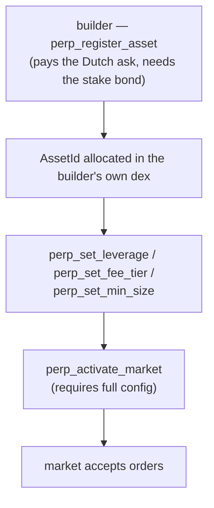

# MIP-3: Permissionless perp market deploy

MIP-3 lets any builder deploy a perpetual market on MetaFlux.

:::info The lane is live and in use
Markets are deployed through it today. A deployed market carries the deployer's dex prefix in
its `coin`. A market named `GRAD:USDCNY` therefore belongs to the `GRAD` dex and not to the
primary market set.

One governance off-switch still applies per network: `mip3_enabled`. Read it before you build on
the lane. A closed switch refuses a deploy call.
:::

A builder deploys a new perpetual market by paying a deploy fee and posting a staking bond.
There is no protocol-team gate, no review committee and no allow-list. Permissionless spot market
deploy is the sibling proposal, [MIP-1](./mip-1.md), and it is callable today.

## Purpose {#why-this-exists}

Permissionless listing is a core protocol capability. Centralised exchanges curate listings.
MetaFlux makes the listing process itself part of the protocol. A builder who wants a market for
a niche asset needs no permission. The builder pays the current ask and bonds stake that it can
lose.

## Deploy cost {#what-a-deploy-costs}

A deploy has two independent barriers. A builder pays both:

| Barrier | Amount | Paid how |
|---------|--------|----------|
| **Deploy fee** | The current Dutch-clock ask on the perp-deploy stream | Charged at register, from your free collateral |
| **Staking bond** | `mip3_deploy_min_stake`, about 50,000 MTF by default | Committed stake you already hold. Slashable, not spent |

The chain checks the bond when it allocates a new market. It refuses stake below the floor
before it writes anything. A rejected deploy is therefore a clean no-op that costs nothing.

:::info There is no bid, no escrow and no refund
An earlier draft of this page described an auction. In it, builders escrowed a USDC bid that was
refunded on a loss and burned on a win. The node has never worked that way for perp deploy. The
chain rejects a deploy that carries a non-zero bid. The deploy pays the Dutch-clock ask at
register. Nothing funds a perp-deploy escrow balance, and nothing can withdraw from one. Ignore
any client code that still builds a bid.
:::

The Dutch clock is a declining ask. It is not a competitive auction. The price falls over the
configured window until someone registers, and a registration resets it. The `max_deploy_fee`
that you sign bounds your exposure. If the ask is above that value, the chain rejects the call
and charges you nothing. The fee comes from free collateral. The chain therefore refuses an
account whose value is committed to open positions, even when its total value covers the ask.

## Deploy flow {#deploy-flow}

```mermaid
flowchart TD
    A["builder — perp_register_asset<br/>(pays the Dutch ask, needs the stake bond)"] --> B["AssetId allocated in the builder's own dex"]
    B --> C["perp_set_leverage / perp_set_fee_tier /<br/>perp_set_min_size"]
    C --> D["perp_activate_market<br/>(requires full config)"]
    D --> E["market accepts orders"]
```

Perp deployment dispatches on twelve sub-variants. They cover the full market lifecycle:

| Action tag | Purpose |
|------------|---------|
| `perp_register_asset` | Registers a new perpetual asset and allocates an `AssetId`. Pays the fee, requires the bond |
| `perp_set_leverage` | Sets the max leverage cap |
| `perp_set_fee_tier` | Sets the maker / taker fee tier |
| `perp_set_maker_rebate` | Sets the maker rebate (≤ 2 bps) |
| `perp_set_min_size` | Sets the market's minimum order size |
| `perp_set_oi_cap` | Sets the market's open-interest cap, in whole units. `0` removes it. |
| `perp_activate_market` | Activates the market. Requires full config |
| `perp_deactivate_market` | Closes to new orders. Existing positions remain |
| `perp_set_fba_mode` | Sets the matching venue: `0` returns the market to the CLOB, `100`-`5000` runs a frequent batch auction with that period in ms |
| `perp_set_sub_deployers` | Grants or revokes a delegate, all powers at once. Deployer-authority only |
| `perp_set_sub_deployer_perms` | Grants a delegate an exact permission mask. Deployer-authority only |
| `perp_set_oracle` | **RETIRED.** Refused. See below |

:::info Eleven callable tags
Older copies of this page listed eight tags and left out `perp_set_sub_deployers`. A later copy
listed nine and left out `perp_set_fba_mode`. The table lists twelve tags. The chain refuses
`perp_set_oracle`, so eleven are callable.
:::

## Delegation {#delegation}

Only the deployer of record, or a delegate it authorized, can call the lifecycle actions on a
market it deployed.

A delegate holds one permission bit per handler. A grant therefore names the handlers, and not
the person. You can give out the price push without giving out the fee rates. The ten bits and
the two granting lanes are on
[`perp_set_sub_deployers`](../api/rest/exchange/deploy-perp.md#perp_set_sub_deployers).

Two rules bound delegation:

- **Delegation is never delegable.** Both granting lanes need the deployer's own authority. A
  delegate that holds every bit still cannot appoint another delegate. No bit exists for it.
- **An upgrade removes no authority.** Every delegate committed before the release reads as the
  full mask after it. That is exactly the authority it has today. To narrow a delegate, send the
  mask that you want it to keep.

:::warning Grant the mask explicitly
A delegate added by `perp_set_sub_deployers` alone holds every deployer power. The mask narrows
it. Send `perp_set_sub_deployer_perms` with the mask that you want the delegate to keep.
:::

## The retired `perp_set_oracle` action {#perp-set-oracle-retired}

The action wrote a market's oracle source-subset mask, and nothing read the mask. The call
returned OK and committed state changed, but the market priced exactly as before.

The node refuses it. Nothing replaces it, because it never did anything. The deployer price
control is [`mip3_set_oracle_px`](../api/rest/exchange/deploy-perp.md#mip3_set_oracle_px)
(action 210), a different action that stays. The mask field stays in market state, still with no
reader, until the next re-genesis.

## Market placement {#where-the-new-market-lands}

:::warning Not in the canonical asset registry
The chain allocates a builder-deployed market into the deployer's own dex, with an asset id of
`1000` or more. The market is isolated from the primary market set. It never joins the shared
perpetual dex, and it does not appear next to the protocol-listed markets. An earlier version of
this page promised the opposite. Only accounts that choose to trade the market are exposed to it.
:::

This isolation is the main containment property of the design. A builder controls the oracle and
the fee tier of its own market. The market stays out of the shared set, so those controls cannot
reach a trader who never opted in.

## Oracle {#oracle}

A deployed market does not price from the validator oracle median. Its *deployer* pushes its
index price through the
[`mip3_set_oracle_px`](../api/rest/exchange/deploy-perp.md#mip3_set_oracle_px) action (210).
The deployer, or a delegate with [permission bit
0](../api/rest/exchange/deploy-perp.md#perp_set_sub_deployers), signs each push.

The deployer operates the oracle for its own market. Treat every builder-deployed market as a
carrier of *deployer price risk*. This risk is the reason the market is isolated, and the reason
the bond is slashable.

:::warning Two corrections to an earlier version of this page
1. **The push is gated per chain.** It is not live on every chain. The action sits behind the
   `mip3_deployer_oracle` protocol feature. The feature is active from genesis on a chain that
   started fresh. On any other chain it is dormant until a two-thirds stake `ArmFeatures` vote
   arms it. While it is dormant, the chain refuses a push with
   `mip3_deployer_oracle feature not active`. Read `feature_active` from
   the operator-lane [`mip3_deployer_oracle`](../api/rest/info.md#operator-reads) read on the
   network you target. Do not assume a posture.
2. **The source subset mask does not decide what a push accepts.** The mask is committed per
   market, but nothing filters prices by it, and no read serves it. See
   [oracle prices](../concepts/oracle-prices.md#composition). For this reason the action that
   wrote it, `perp_set_oracle`, is [retired](#perp-set-oracle-retired). Only the price rules
   below bound a deployer push.
:::

### Oracle operation {#running-the-oracle}

The steps below are the full operator loop. Each rule has a reason. Use the reason to size your
own push cadence.

1. **Register and activate the market first.** The chain refuses a push at an asset that is not
   a MIP-3 market. Registration also fixes who can push: the `deployer`, and any delegate with
   [permission bit 0](../api/rest/exchange/deploy-perp.md#perp_set_sub_deployers).

2. **Choose the first price with care.** A push must be within ±10 % of the committed anchor.
   The anchor is the last committed oracle price. If no oracle price exists, it is the market's
   committed mark price. A new market has neither, so the first push has no anchor. The chain
   accepts any price in `(0, 1000000000000]` once. The band chains every later push to that
   value, so a wrong first price takes several pushes to correct. The band exists so that one
   push cannot move the mark in a single step and liquidate the whole market.

3. **Expect the first push to change the margin regime.** At the first push, the market becomes
   deployer-priced. The chain moves existing cross-margin positions on the market into their own
   strict-isolated buckets. The move conserves value per account: what leaves cross collateral
   arrives as isolated margin. Every position opened after that is strict-isolated too. The
   reason is containment. A market whose price one party controls must not share a collateral
   pool with markets that the party does not control.

4. **Push faster than the staleness window.** The window is `mip3_stale_mark_ms`, default
   60,000 ms. Governance can set it in [10,000 ms, 600,000 ms]. A cross-field rule ties it to the
   risk staleness window `risk_oracle_staleness_ms`, default 60,000 ms, governable in
   [10,000 ms, 300,000 ms]. The refresh window must stay at or below the staleness window. The
   two move together, so the chain never judges a market risk-stale before its own mark refresh
   had a chance to fire. Confirm the live values before you size a cadence. Do not assume the
   defaults.

5. **Know the cost of a stale feed.** After the window, the market becomes reduce-only for
   opens. The chain refuses an order that opens or increases a position. A closing order still
   passes. Nobody is trapped in a position, and nobody can enter one. This is deliberate. On a
   market where your feed is the only price, a frozen price with open entry is a free option
   against every trader on the book.

6. **Monitor with a read, not with a timer.** The operator-lane
   [`mip3_deployer_oracle`](../api/rest/info.md#operator-reads) read reports `stale`,
   `until_stale_ms`, and the reference stamp that the gate itself uses. Alert on
   `until_stale_ms`, and not on your own send time. A push counts only when it is committed.

:::info A part-time underlying gives a part-time market
The staleness window is a risk bound. It is not a trading calendar. If your underlying has venue
hours, your feed stops when the venue closes, and the market becomes reduce-only for the closure.
A wider window that spans a weekend does not fix this. It lets anyone open positions all weekend
against a stale Friday price. That is the exact gap risk the reduce-only change exists to stop.
To keep the market open through a closure, publish a live derived price at all hours and stay
inside the window.
:::

**Price units.** `px` is a whole-USDC decimal string, never the `1e8` book plane. It is signed
verbatim: the exact bytes you send are the bytes inside the signature digest. See
[`mip3_set_oracle_px`](../api/rest/exchange/deploy-perp.md#mip3_set_oracle_px) for the frozen
signing type and the full rejection table.

## Limits {#limits}

Governance sets the bounds for a deployed market. The defaults below are the shipped values.
They are not a promise about the live network. Governance can move any of them. Confirm the
current value through [validator governance](../api/rest/info/governance.md) before you rely on
it:

| Bound | Meaning |
|-------|---------|
| `max_leverage` | Highest leverage a deployed market can set. The protocol cap is 50 |
| `max_taker_fee_dbps` | Highest taker fee, in deci-bps. Default `500`, which is 50 bps |
| `mip3_fee_ceiling_bps` | Governance fee ceiling, in bps |
| `max_oi` | The open-interest cap of a deployer market that activates with no cap, in whole units of the base asset. The deployer then changes it with [`perp_set_oi_cap`](../api/rest/exchange/deploy-perp.md#perp_set_oi_cap): higher, lower, or `0` for no cap |
| `max_oi_per_second` | Highest open-interest increase admitted per one-second window, in whole units of the base asset |
| `mip3_max_deploys_per_epoch` | New registrations allowed per *deploy epoch*: a fixed window of 100,000 committed rounds, about 3 hours at the current cadence. This is not the staking epoch. `0` means uncapped |

:::warning A `0` limit means uncapped
A `0` limit does not block anything. `mip3_fee_ceiling_bps` and `mip3_max_deploys_per_epoch` are
`0` on the live network today, and `max_oi_per_second` defaults to `0`. A `0` leaves each of them
fully open. These are rate controls. The off-switch is `mip3_enabled`, a separate governance flag
that closes the whole lane. Never read a `0` cap as "deployment is closed".

`mip3_fee_ceiling_bps` and `mip3_max_deploys_per_epoch` both bind admission today.
:::

**Unit trap.** `max_oi` and `max_oi_per_second` are in whole units, not in lots. Each is a single
value that applies to every market. A lot is a different real quantity on each market, so one
shared lot count cannot state one real limit. The chain converts each value into the market's own
size plane before it applies it.

**Unit trap.** `mip3_fee_ceiling_bps` is in basis points. The fee fields on the wire are in
deci-bps, tenths of a basis point. The two differ by a factor of 10.

Four more fields appear in the configuration, but they are reserved and unused:
`max_active_markets`, `min_self_stake`, `bid_increment`, and a second `min_deploy_stake`.
Nothing reads them. The live staking bond is `mip3_deploy_min_stake`. Do not build against the
four reserved fields.

## Liquidation on a deployed market {#liquidation}

A deployed market has its own backstop settings. Governance sets them per asset. They decide how
the chain closes a failing account on that market.

| Setting | What it does | Enforced today |
|---------|--------------|----------------|
| `mode` | `Disabled` closes on the book and never escalates to the backstop tier. `Enabled` uses the normal ladder. `Capped` is meant to bound the treasury's exposure | `Disabled` and `Enabled` only |
| `band_floor` | Raises the health level at which the market escalates, ahead of the global band | Yes |
| `deficit_cap` | The bound that `Capped` was meant to apply | No. `0` is the only accepted value, and `0` means no cap |

A market with no settings defaults to `Disabled` when it prices from its own deployer oracle.

:::caution
The chain refuses a vote that sets `deficit_cap` to a non-zero value, with
`deficit_cap must be 0 (no cap)`. The refusal is deliberate. A capped deficit leaves the
remainder with no owner. The treasury does not pay the shortfall above the cap, and nobody else
is assigned it, so the books do not balance. `0` means "no cap", and it is the only sound
setting. `Capped` and `Enabled` therefore behave the same. The mode name stays only because the
wire encoding is name-based.
:::

:::warning The Metaliquidity vault does not backstop a deployed market
The vault backstop is live on the core markets since 2026-08-18. There it takes over a failing
position ahead of the netting, and it pays deficit ahead of ADL. The chain refuses a deployed
market at both entry points, whether or not it prices from its own oracle. Its bad debt can
therefore never reach the vault's liquidity providers.

Plan for this. Your market's own backstop settings and its own participants handle its
shortfall. After those, the deficit waterfall handles it. Protocol LP capital never does.
:::

## After deploy {#after-deploy}

Liquidity is the builder's task. The protocol places no seed orders.

Builders usually bootstrap depth in one of two ways: an external market maker attracted by
builder-fee rebates, or a user-created vault on the same market.

The protocol's [Metaliquidity vault](./mip-2.md#scope) does not quote a deployer market. It
trades core markets only, so do not plan your depth around it. The chain also refuses a vault
order that opens or extends a position on a deployer market.

## MIP-4 {#mip-4}

A market deployed here can be the *underlying* of an [option series](../products/options.md), if
it has a live price feed. The option lane keeps its own collateral. It does not share the margin
account of the perpetual. See [MIP-4 — Options](mip-4.md).

## See also {#see-also}

- [MIP-1 — spot token standard + market deployment](./mip-1.md): the spot sibling, callable today
- [`POST /exchange`](../api/rest/exchange.md): the action reference
- [Tiered liquidation](../concepts/tiered-liquidation.md): applies to deployed markets as it does
  to protocol-listed ones
- [Portfolio margin](../concepts/portfolio-margin.md): deployed markets opt into PM through the
  standard scenario inclusion
