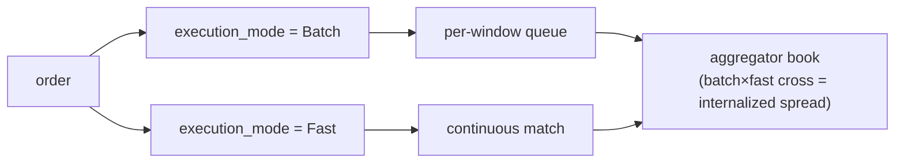

# MIP-4 — Perps Liquidity Aggregator / Internalizer

:::info
**Planned.** Targeted for V2; not in v1 mainnet scope.
:::

MIP-4 is a MetaFlux-operated **perps liquidity aggregator / internalizer** — a wholesaler that absorbs incoming order flow against its own book and pockets the internalization spread. The model is borrowed directly from equities market structure, where a single wholesaler handling a large share of retail flow runs the most profitable line in the business. MIP-4 brings that pattern to on-chain perps.

## Why this exists {#why-this-exists}

A capability-driven approach: rather than competing on listing breadth (that's [MIP-3](./mip-3.md)), MIP-4 competes on execution quality for retail flow. By internalizing flow against its own resting book, the aggregator can recapture spread that would otherwise be paid out as maker fees — and hand part of that back to the user as price improvement. That is the same pitch a retail-broker wholesaler makes: "best price, often better than top of book."

It pairs naturally with a Robinhood-style retail UI built on top of the existing client SDKs — product/front-end, not protocol.

## What it is {#what-it-is}

A new market mode and protocol layer that:

1. **Runs its own order book per asset** — `BTC-AGG`, `ETH-AGG`, `SOL-AGG`, etc. — alongside the corresponding MIP-3 markets (`BTC`, `ETH`, `SOL`). The aggregator book is distinct from the canonical CLOB, with its own price and depth structure.
2. **Executes in two tiers**, selected per order via an `execution_mode` field:
   - **Batch** (low fee, ~1–2 bps taker) — orders pool into a per-window queue and clear at a single price every `batch_window_ms` (default 200–300 ms). FBA-style uniform-price clearing within the aggregator's own book. UI label: "Best Price".
   - **Fast** (higher fee, ~5–8 bps taker) — orders match continuously against the aggregator's resting book at top of book. UI label: "Instant".
3. **Captures the internalization spread** — when batch flow crosses against fast flow (or two batch orders cross), the aggregator sits in the middle and captures the spread. This is the real revenue driver.

For aggregator markets the `execution_mode` field is required; for the canonical Continuous/FBA markets it is ignored.

## Two execution tiers — Batch vs Fast {#two-execution-tiers--batch-vs-fast}

Both tiers execute against the aggregator's **own** book; the user picks the tier per order via the `execution_mode` field. Internalization is what happens *inside* the aggregator's book when the two tiers cross.

- **Batch** — orders pool into a per-window queue and clear at a single uniform price every `batch_window_ms` (default 200–300 ms), FBA-style.
- **Fast** — orders match continuously against the aggregator's resting book at top of book.
- **Internalization** — when batch flow crosses fast flow (or two batch orders cross), the aggregator sits in the middle and captures the spread. This is the revenue driver.

### Residual routing (later phases) {#residual-routing-later-phases}

When the aggregator's own book is too thin to absorb an order, the **residual** routes out — first to the canonical on-chain CLOB (the MIP-3 markets), and, in a later phase, to external venues once MetaBridge matures. External-venue fallback is a **V3+** upgrade; the V2 routing target is the on-chain CLOB only. The structure leaves room for it but V2 does not ship it.

## MetaFlux-operated, not builder-deployed {#metaflux-operated-not-builder-deployed}

Unlike [MIP-3](./mip-3.md) — where any builder can permissionlessly deploy a market through a gas auction — the aggregator is operated by **MetaFlux itself**. Only the governance multisig can deploy aggregator instances, and there is a single canonical instance per asset.

This is a deliberate, locked design choice:

- **Avoids adverse selection** from multiple competing aggregators fragmenting the same flow.
- **Avoids regulatory ambiguity** around permissionless market making.
- **Keeps revenue flowing to the protocol** — internalization revenue lands in the same fee waterfall as everything else (below), not in a third-party operator's pocket.

## Relationship to MIP-3 — complementary, not cannibalizing {#relationship-to-mip-3--complementary-not-cannibalizing}

MIP-3 and MIP-4 serve two different sides of the flow:

- **MIP-3 markets** carry **pro flow** and remain the venue for **price discovery**. These are the canonical, permissionlessly-deployed perp/spot markets.
- **MIP-4 aggregator** carries **retail flow** through a curated, internalized book.

The aggregator does not cannibalize MIP-3: pro traders keep trading the MIP-3 books (that's where the reference price lives), and the aggregator even hedges its inventory back into those books. Two-sided by design. The aggregator markets are namespaced (`-AGG`) precisely so the two never collide.

## Fee economics {#fee-economics}

Internalization revenue feeds the **same fee-distribution waterfall as MIP-3** — there is no separate MIP-4 economics. Per [the fee model](../concepts/fees.md), aggregator revenue flows:

- **70%** — buyback-and-burn (reduces effective supply)
- **20%** — validators, who distribute it to their stakers as the dividend
- **10%** — Foundation / Treasury

On the retail side, the builder-code fee (capped at 8 bps) is the natural economic seat for a retail UI to charge — the same place a retail broker monetizes its order flow.

## Outcomes → MIP-6, deferred to V3 {#outcomes--mip-6-deferred-to-v3}

The number "MIP-4" previously sketched **Outcomes / prediction markets**. That mechanism has been **renumbered to [MIP-6](./mip-6.md)** and deferred to **V3**. MIP-4 now means the aggregator and only the aggregator; do not reuse MIP-4 for Outcomes.

## See also {#see-also}

- [MIP-3 — permissionless perp market deploy](./mip-3.md) — the complementary, pro-flow / price-discovery side
- [MIP-6 — Outcomes / prediction markets](./mip-6.md) — the renumbered Outcomes proposal, deferred to V3
- [Fees](../concepts/fees.md) — the shared fee waterfall internalization revenue feeds into
- [FBA](../concepts/fba.md) — batch-clearing mechanics the Batch tier builds on
