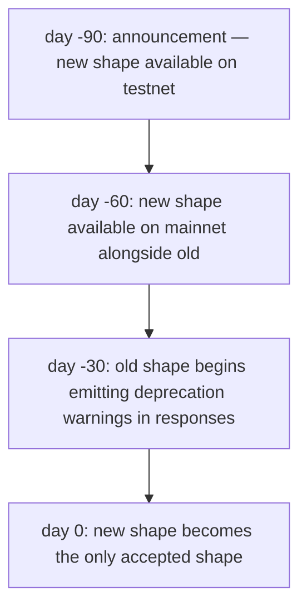
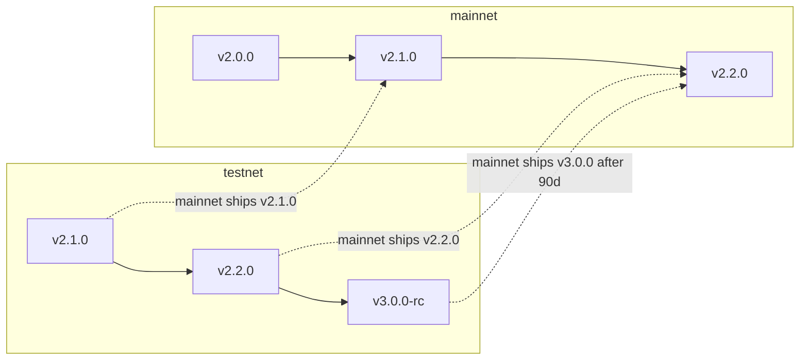

# Versioning and deprecation {#versioning--deprecation}

This page states how the MetaFlux protocol version changes and how a breaking change is deprecated.

:::info
Status: stable policy. The change log lists specific version transitions.
:::

## Summary {#tldr}

- Protocol version is a semver-shaped triplet (`MAJOR.MINOR.PATCH`).
- Breaking wire changes go in `MAJOR`; non-breaking additions in `MINOR`; fixes in `PATCH`.
- Mainnet breaking changes require a 90-day deprecation window with both old and new wire shapes accepted.
- Testnet runs ahead of mainnet to surface migration issues before production.

## Version components {#version-components}

The node does not serve the protocol version on the wire. No read returns it, so do not gate client behavior on a version string fetched at run time. Take the version from the [change log](#change-log). Detect capability from the shapes the node accepts.

| Component | Meaning | Examples |
|-----------|---------|----------|
| MAJOR | Breaking wire change | Renamed `Order` fields; removed action variant; changed signing domain; changed RPC URL shape |
| MINOR | Additive non-breaking | New action variant; new info type; new WS channel; new error string |
| PATCH | Behaviour-only fix | Bug fixes that preserve wire shape; performance |

## Wire shape {#whats-wire-shape}

Wire shape is everything a client commits to in its serialization and signing logic:

| Wire-shape | Examples |
|-----------|----------|
| Yes | Action `type` strings, field names, field types, enum values, response shape, status codes, error strings, EIP-712 domain |
| Yes | Numerical scaling conventions (fixed-point integers, USDC base units) |
| Yes | WS channel names, payload shapes, frame format |
| No | Server-internal storage; consensus implementation; mark/oracle source weights (governance-controlled, not protocol-versioned); fee tier thresholds (governance) |

Governance-mutable parameters are not part of the wire-shape commitment. Examples are fee tiers, mark composition weights, scenario shocks and liquidation thresholds. Their shape is committed. Their values can change at any time.

## Mainnet promise {#mainnet-promise}

| Change class | Notification | Grace period |
|--------------|--------------|--------------|
| MAJOR (breaking) | 90 days before activation | Old and new shape both accepted for at least 90 days |
| MINOR (additive) | 0 days; announced in change log | n/a |
| PATCH (fix) | 0 days | n/a |

A MAJOR change rolls out in four steps:



The 90-day window matches institutional change-management cycles. Bot operators have time to migrate. Clients can run dual-wire code during the overlap.

## Deprecation warnings {#deprecation-warnings}

During the overlap window, a response to the old shape includes a non-fatal warning:

```json
{
  "accepted": true,
  "mempool_depth": 3,
  "_deprecation": {
    "field":      "params.price",
    "deprecated_at_version": "2.0.0",
    "removal_at_version":    "3.0.0",
    "migration": "use px (string, fixed-point 10^8)"
  }
}
```

Treat the `_deprecation` field as optional in your parser. Clients on the new shape never see it.

## Change log {#change-log}

The protocol change log is published at `https://mtf.exchange/changelog` (the URL is TBD before launch). It is mirrored in this repo at `CHANGELOG.md`. Each entry has:

- The version triple.
- The date of activation.
- The class (MAJOR, MINOR or PATCH).
- A description of each change, with migration notes for MAJOR and MINOR changes.

To subscribe, use one of these:

- RSS at `https://mtf.exchange/changelog.rss`.
- GitHub Releases on this repo.
- A WS push on a planned `_meta` channel (TBD).

## Testnet ahead of mainnet {#testnet-ahead-of-mainnet}

Testnet typically runs 1 or 2 minor versions ahead of mainnet. Migration problems surface on testnet before the mainnet rollout date. Bot operators with a testnet integration get early warning of breaking changes.



## What governance can change without versioning {#what-governance-can-change-without-versioning}

The protocol layer is wire-versioned. Governance can change these without a version change:

- Per-market parameters (tick size, leverage cap, maintenance ratio, mark composition, funding cap)
- Fee tier thresholds and rates
- PM scenario shock magnitudes and correlation matrix
- Liquidation tier thresholds and cooldowns (within bounds; a substantial change requires MAJOR)
- Rate-limit budgets
- Insurance pool replenishment ratios

These changes do not bump the protocol version. They emit events on the planned `_governance` WS channel. `/info` returns their current values.

A client that computes against current parameter values, such as PM margin, must read the parameters live. Never hard-code them.

## Client SDK versioning {#client-sdk-versioning}

The client SDKs follow semver independently of the protocol. They are `@metaflux-dex/client` for TypeScript and `metaflux-client` for Rust. These are the only two supported client SDKs.

- `0.x.y`: pre-mainnet. A breaking change is allowed at each minor bump.
- `1.x.y`: post-mainnet. The API surface follows strict semver.

The `1.x` API surface of an SDK targets one protocol MAJOR. When the protocol bumps MAJOR, the SDK bumps MAJOR. SDK 1.x supports protocol 2.x, and SDK 2.x supports protocol 3.x. Both overlap during the 90-day window.

## Pre-mainnet caveats {#pre-mainnet-caveats}

Until mainnet launch:

- Testnet runs the latest protocol MINOR or MAJOR ahead of the planned mainnet release. Expect breakage on testnet.
- The status banner on each page shows whether it is stable, preview or planned.

## See also {#see-also}

- [Networks](./networks.md): endpoints and chain IDs per network.
- [Security](./security.md): the security model and disclosure policy.
