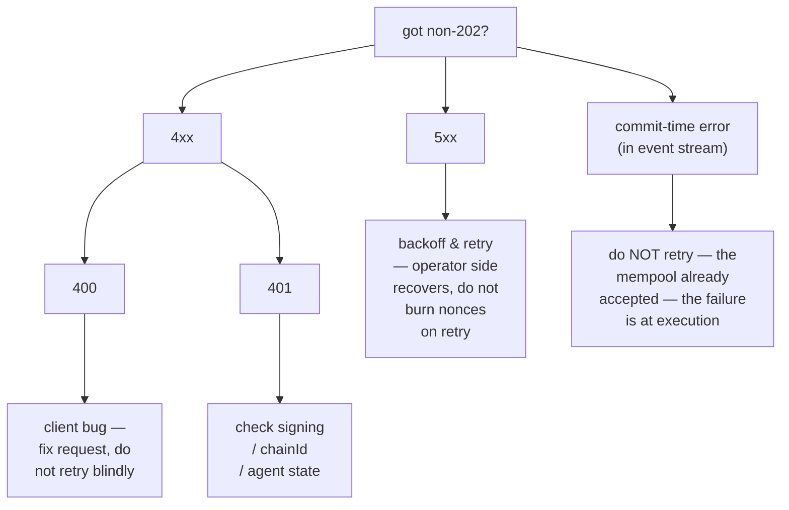

# فهرس الأخطاء

:::info
**الحالة.** **مستقرة** للرموز المدرجة. قد تُضاف سلاسل أخطاء جديدة؛ أما الموجودة فهي مستقرة.
:::

تعداد شامل لرموز حالة HTTP، واصطلاحات سلاسل الأخطاء، والأسباب الجذرية، وطرق المعالجة. عند الشك في كيفية التعامل مع استجابة غير `202`، ابدأ من هنا.

## خلاصة سريعة

- **2xx** — نجاح. لاحظ أن نقاط نهاية HL-compat ترجع `200 OK` حتى عند وجود أخطاء على مستوى التطبيق، وتُشير إليها في جسم الاستجابة (`{"status":"err"}`). أما نقاط النهاية الأصلية لـ MTF فتستخدم رموز الحالة الصحيحة.
- **400** — خطأ من جانب العميل: طلب مشوّه، أو توقيع بصيغة غير صحيحة، أو نوع إجراء غير معروف. لا تُعيد المحاولة دون إصلاح.
- **401** — فشل التحقق من التوقيع. استعِد العنوان محليًا وتحقق منه.
- **404** — المورد غير موجود. شائع على `/info` عندما لم يُرَ الحساب / السوق / الخزينة المُستعلَم عنها من قبل.
- **405** — طريقة HTTP غير صحيحة (معظم نقاط النهاية تستخدم POST).
- **422** — الطلب مُنسَّق بشكل صحيح لكنه غير صالح منطقيًا (مثل: حجم صفري، أو رافعة تتجاوز الحد الأقصى). لا تُعيد المحاولة؛ صحِّح وأعِد الإرسال.
- **429** — تجاوز حد المعدل. انتظر وأعِد المحاولة وفق `retry_after_ms`.
- **5xx** — خطأ من جانب الخادم. أعِد المحاولة مع تراجع أسي؛ الأعطال المستمرة تشير إلى حادثة على جانب المشغّل.

## شكل الجسم

جميع الاستجابات غير 2xx على نقاط النهاية الأصلية لـ MTF تتبع الصيغة التالية:

```json
{
  "error":          "<short_string>",
  "detail":         "<optional human-readable elaboration>",
  "retry_after_ms": 1200
}
```

يظهر `detail` و`retry_after_ms` فقط عند الاقتضاء. حقل `error` هو المُعرِّف الثابت — احرص على أن يعتمد معالج الأخطاء لديك على هذا الحقل.

نقاط نهاية HL-compat (مثل `/info` و`/exchange` على البوابة) تُغلّف كل شيء على النحو التالي:

```json
{ "status": "ok"|"err", "response": ... }
```

إذ يحمل `status: "err"` سلسلة نصية في `response` للأخطاء على مستوى التطبيق عند HTTP 200. أما الأخطاء على مستوى النقل (JSON مشوّه، طريقة غير صحيحة) فتظهر بشكل طبيعي كاستجابات 4xx.

## الفهرس

### 400 — طلب غير صالح

| `error` | يُثار عند | المعالجة |
|---------|----------------|-------------|
| `sender: expected 40 hex chars, got N` | طول حقل `sender` غير صحيح | احذف البادئة `0x`؛ تحقق من صحة العنوان (20 بايت) |
| `signature: expected 130 hex chars, got N` | التوقيع يفتقر إلى بايت `v` | أضِف بايت الاسترداد |
| `invalid hex` | أحرف غير سداسية عشرية في `sender` / `signature` | عقِّم المدخلات |
| `unknown action variant: <X>` | `action.type` مكتوب بشكل خاطئ أو غير مدعوم | راجع [فهرس الإجراءات](./rest/exchange.md#action-catalog) |
| `missing field: params.<X>` | حقل مطلوب محذوف من نوع ما | راجع جدول ذلك النوع |
| `invalid msgpack` | خطأ في تسلسل الإجراء / msgpack غير مطابق للمواصفات | استخدم مكتبة msgpack بخيارات افتراضية |
| `nonce must increase` | إعادة استخدام `nonce` أو ترتيب غير متسلسل | استخدم عداد تصاعديًا (مثل `Date.now()`) |
| `duplicate cloid` | `Order`/`ModifyOrder` أعاد استخدام معرّف طلب عميل موجود | استخدم `cloid` جديدًا |
| `empty batch` | `orders[]` أو `cancels[]` فارغة | أرسِل عنصرًا واحدًا على الأقل |
| `invalid numeric` | حقل النقطة الثابتة غير قابل للتحليل بوصفه `u128` | أرسِل على شكل سلسلة JSON، أساس 10، بلا بادئة `+` أو مسافات |
| `unknown info type: <X>` | `type` الخاص بـ `/info` غير معروف | راجع [مرجع info](./rest/info.md) |
| `chain_id mismatch` | حقل chainId في غلاف التوقيع المتعدد لا يطابق الشبكة | طابِق `chainId` الخاص بالشبكة |

### 401 — غير مُصرَّح له (فشل التوقيع)

| `error` | يُثار عند | المعالجة |
|---------|----------------|-------------|
| `signer is not the sender and not an approved agent` | العنوان المُستردّ ≠ المُرسِل وليس ضمن مجموعة الوكلاء | تحقق من المفتاح الخاص والعنوان؛ تأكد من تنفيذ `ApproveAgent` |
| `agent expired` | العنوان المُستردّ وكيل للمُرسِل، لكن `expires_at_ms` مضى | أعِد الموافقة أو دوِّر الوكيل |
| `agent not yet effective` | `ApproveAgent` لا يزال في مرحلة الانتشار (≤ كتلة واحدة) | انتظر كتلة واحدة وأعِد المحاولة |
| `unknown chainId` | `chainId` خاطئ في نطاق التوقيع ← عنوان مُستردّ وهمي | طابِق [chainId الشبكة](../networks.md) |
| `signature parse failed` | بايتات توقيع مشوّهة | تحقق من ترميز `r ‖ s ‖ v` (65 بايت) |
| `multisig threshold not met` | الإجراء الداخلي يحمل أقل من `threshold` من التوقيعات الصالحة | اجمع المزيد من التوقيعات |
| `multisig duplicate signer` | نفس العنوان يوقّع مرتين في غلاف التوقيع المتعدد | يجب أن يكون كل موقِّع مختلفًا |

### 404 — غير موجود

| `error` | يُثار عند |
|---------|----------------|
| `account not found` | `/info` استُعلِم بعنوان لا توجد له حالة على السلسلة |
| `market not found` | `market_id` / `coin` غير مسجَّل في السجل |
| `vault not found` | `vault_id` غير موجود |
| `order not found` | `Cancel` لمعرّف طلب تم إلغاؤه بالفعل / تنفيذه / لم يوجد أصلًا |

بالنسبة لاستعلامات `/info`، ترجع نقاط النهاية الأصلية لـ MTF القيمة `404`؛ بينما ترجع HL-compat القيمة `200` مع `{"status":"err","response":"<msg>"}` (اصطلاح HL).

### 405 — الطريقة غير مسموح بها

| `error` | يُثار عند |
|---------|----------------|
| (لا جسم) | استُخدم `GET` على نقطة نهاية `POST` (أو العكس) |

### 422 — كيان غير قابل للمعالجة

الطلب مُنسَّق بشكل صحيح والتوقيع صالح، لكن الإجراء نفسه غير صالح منطقيًا.

| `error` | يُثار عند | المعالجة |
|---------|----------------|-------------|
| `price not tick-aligned` | `px` ليس مضاعفًا لحجم الخطوة في السوق | قرِّب إلى أقرب خطوة صالحة |
| `size below market minimum` | `size` < الحد الأدنى للسوق | زِد الحجم أو استخدم سوقًا آخر |
| `reduce_only would grow position` | خيار التخفيض فقط مُفعَّل، لكن الطلب سيفتح أو يوسِّع المركز | احذف `reduce_only` أو تحقق من المركز الحالي |
| `leverage above asset cap` | الرافعة المطلوبة > `max_leverage` للأصل | استخدم `≤ max_leverage` (راجع معلومات `meta`) |
| `pm_min_equity_not_met` | `UserPortfolioMargin{enabled:true}` لكن الحساب دون الحد الأدنى | زِد حقوق الملكية أو ابقَ على الهامش التقليدي |
| `liquidation tier blocks action` | الحساب في T1+؛ الصفقات الإضافية محظورة | أضِف هامشًا، واخرج من المستوى أولًا |
| `insufficient balance` | السحب / التحويل يتجاوز الرصيد الحر | تحقق من `clearinghouseState` أولًا |
| `out of bounds: <param>` | انتُهك حد حوكمة (مثل: حد التمويل في `PerpDeployGasAuctionBid`) | استخدم قيمة ضمن الحد المُعلَن |

### 429 — تجاوز حد المعدل

```json
{ "error": "rate limit exceeded", "scope": "per_ip"|"per_account", "retry_after_ms": 1200 }
```

| `scope` | المعنى |
|---------|---------|
| `per_ip` | استُنفد ميزانية الأوزان لكل IP على البوابة |
| `per_account` | استُنفد QPS لكل حساب على البوابة |
| `mempool_per_account` | عدد كبير جدًا من الإجراءات المعلّقة في mempool من حساب واحد |

راجع [حدود المعدل](./rate-limits.md) للاطلاع على الميزانيات وآلية معالجة الطفرات.

### 503 — الخدمة غير متاحة

| `error` | السبب | المعالجة |
|---------|-------|-------------|
| `mempool at capacity` | ازدحام الشبكة؛ رُفض الانتظار في الصف | تراجع أسي (`retry_after_ms` يبدأ من 200) |
| `gateway not ready` | البوابة تبدأ التشغيل / تفشل في الفحوصات الصحية | أعِد المحاولة مع تراجع؛ راجع [الحالة](../networks.md#status) |
| `node downstream unreachable` | البوابة فقدت اتصالها بالعقدة | من جانب المشغّل؛ تراجع وراقب الحالة |

### أخطاء وقت الالتزام (ليست HTTP، في تدفق الأحداث)

بعض الإخفاقات تحدث بعد `202 Accepted` لأنها لا تكون معروفة إلا في سياق تنفيذ الكتلة. تظهر هذه الأخطاء على قناة الـ WS الخاصة بـ `orderEvents` / `userEvents` على النحو التالي: `{"error":"<reason>", "action_hash":"0x..."}`.

| `error` | السبب |
|---------|-------|
| `reduce_only_violation_post_admit` | تغيّر المركز بين القبول والإرسال (أغلقته عمليات تنفيذ أخرى) |
| `stp_rejected` | آلية منع التداول الذاتي أوقفت الطلب عند الإرسال |
| `mark_price_band_violation` | سعر الطلب خارج نطاق الانحراف المسموح به في السوق عند التنفيذ |
| `evicted_under_cap_pressure` | قُبل في mempool لكن طُرد قبل اقتراح الكتلة |
| `liquidation_pre_empted` | انتقل الحساب إلى T1+ بين القبول والإرسال |

## شجرة القرار



## انظر أيضًا

- [`POST /exchange`](./rest/exchange.md) — مسار الكتابة
- [`POST /info`](./rest/info.md) — مسار القراءة
- [حدود المعدل](./rate-limits.md)
- [الأمان من التكرار](../integration/idempotency.md) — كيفية إعادة المحاولة بأمان
- [دليل معالجة الأخطاء](../integration/error-handling.md) — أنماط لعملاء الإنتاج
