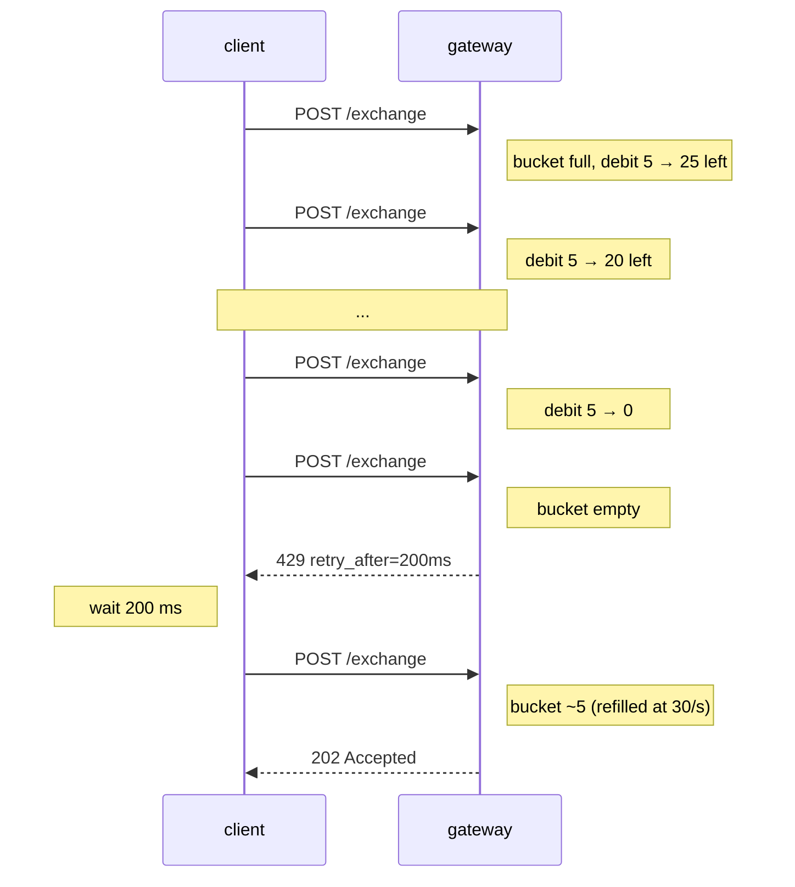

# حدود معدل الطلبات

:::info
**معاينة.** تُطبّق البوابة الحدود الواردة أدناه؛ أما العقدة المباشرة فتقبل حركة مرور غير محدودة من النظراء المصادق عليهم عبر mTLS (مخصصة للبنية التحتية الموثوقة فقط — لا تُعرّض المنفذ `8080` على الإنترنت العام في بيئة الإنتاج).
:::

## ملخص سريع

- ميزانيتان: **وزن لكل IP** (حركة المرور المجهولة) و**QPS لكل حساب** (حركة المرور الموقّعة).
- تستهلك الأحمال المتقطعة رصيد دلو الرموز؛ أما حركة المرور المستمرة فتخضع لمعدل إعادة التعبئة.
- يحمل الرمز `429` دائمًا الحقل `retry_after_ms`. تعامل معه باحترام.
- استعلامات `/info` رخيصة (وزن 1)؛ اشتراكات WS أرخص منها (وزن 1 عند الاشتراك، 0 لكل رسالة). أما `/exchange` فوزنها 5 لكل طلب.
- تمتلك مجموعة الانتظار (mempool) حدًا مستقلًا لكل حساب على الإجراءات المعلّقة.

## الميزانيات

| الميزانية | الحد (الافتراضي) | إعادة التعبئة | الانطلاقة القصوى |
|-----------|-----------------|---------------|-----------------|
| وزن لكل IP | 1200 وزن / دقيقة | 20 وزن / ثانية | 1200 (دلو كامل) |
| QPS لكل حساب | 30 طلب / ثانية | 30 / ث | 60 |
| إجراءات Mempool لكل حساب | 50 معلّقًا | يستنزف مع تأكيد الإجراءات | — |
| اشتراكات WS لكل اتصال | 256 | — | — |

جميع الحدود تخضع للحوكمة. يمكن الاطلاع على لقطة ميزانية الحساب عبر قراءة [`user_rate_limit`](./rest/info.md) الأصلية على مسار البوابة الافتراضي (تُظهر البوابة أيضًا نفس البيانات بصيغة `userRateLimit` متوافقة مع HL تحت `/hl`):

```bash
curl -X POST https://devnet-gateway.mtf.exchange/info \
  -H 'content-type: application/json' \
  -d '{"type":"user_rate_limit","address":"0x<addr>"}'
```

> **قراءة مخطط لها.** مسار `GET /limits` المخصص لنشر الإعداد *الثابت* لكل IP وكل حساب الموضح أدناه **لم يُنفَّذ بعد** — القيم هي الإعدادات الافتراضية المُهيَّأة، ولا تُقدَّم بعد من نقطة نهاية. تعامل مع JSON أدناه كإعدادات مرجعية افتراضية:

```json
{
  "per_ip": {
    "weight_per_minute": 1200,
    "burst":             1200,
    "refill_per_second": 20
  },
  "per_account": {
    "qps":          30,
    "burst":        60,
    "refill":       30
  },
  "mempool_per_account": 50,
  "ws_subs_per_conn":    256
}
```

## الوزن حسب نقطة النهاية

| نقطة النهاية | الوزن |
|-------------|-------|
| `POST /info` (معظم الأنواع) | 1 |
| `POST /info` `l2Book`, `metaAndAssetCtxs` | 2 |
| `POST /info` `userFills`, `historicalOrders` (مُقسَّمة إلى صفحات) | 2 |
| `POST /exchange` | 5 |
| `GET /ccxt/markets`, `GET /ccxt/ticker` | 1 |
| `GET /ccxt/orderbook`, `GET /ccxt/ohlcv` | 2 |
| `GET /ccxt/balance`, `/positions`, `/myTrades` | 2 |
| `POST /ccxt/orders`, `DELETE /ccxt/orders/{id}` | 5 |
| WS `subscribe` | 1 |
| رسالة WS منشورة | 0 |
| WS `unsubscribe` | 0 |

عميل يُرسل أمرًا واحدًا في الثانية ويستطلع `clearinghouseState` مرة في الثانية يُنفق `5 + 1 = 6 وزن/ث = 360 وزن/دقيقة` — وهو في نطاق الميزانية بكل ارتياح.

## QPS لكل حساب

بمجرد توقيع طلب ما، تُصادق البوابة على `sender` وتحتسبه على ميزانية الحساب بدلًا من ميزانية IP (أو إضافةً إليها).

| حالة المُرسِل | يُحتسب على |
|--------------|-----------|
| مجهول (بلا توقيع، مثل `GET /ccxt/markets`) | لكل IP |
| موقَّع بالمفتاح الرئيسي | لكل IP + لكل حساب |
| موقَّع بوكيل | لكل IP + لكل حساب رئيسي |

الطلبات الموقَّعة تُحتسب فعليًا مرتين — على ميزانية IP وعلى ميزانية الحساب؛ العملاء الذين يُرسلون كميات كبيرة من IP واحدة لحساب واحد سيصطدمون بأضيق الميزانيتين.

## حد مجموعة الانتظار (Mempool)

مستقل عن حدود معدل الطلبات. يرفض نظام الحالة قبول أكثر من 50 إجراءً معلّقًا (لم يُؤكَّد بعد) لكل `sender`. هذا يمنع أي حساب من احتكار مساحة مجموعة الانتظار.

إذا أرسلت إجراءً حادِيًا وخمسين بينما 50 معلّقة:

```json
{ "error": "mempool_per_account_full", "retry_after_ms": 100 }
```

عمليًا، لا يحدث هذا إلا مع العملاء المتصرفين بشكل غير سليم — زمن البلوك الصحي البالغ ~100 مللي ثانية كافٍ لاستنزاف 30 QPS بسهولة. إذا واجهت هذا، فأنت ملتزم بحد QPS للحساب لكنك ترسل أسرع مما تُؤكِّده البلوكات.

## سلوك الانطلاقة القصوى

تمتلئ الدلاء حتى قيمة `burst` وتُعبَّأ بمعدل `refill` في الثانية. انطلاقة من `N ≤ burst` طلبًا تُنفَّذ فورًا؛ الطلبات اللاحقة تُقيَّد بمعدل إعادة التعبئة.


استجابة `429` المصحوبة بـ `retry_after_ms` تُخبرك تحديدًا متى سيحتوي الدلو على ما يكفي لطلب واحد بوزن 1. للمهام الدُّفعية يُفضَّل ضبط الإيقاع من جانب العميل؛ للأحمال التفاعلية، الانسحاب الأسّي مع المؤشر المُعطى كافٍ.

## الاستراتيجيات

### بوت تدفق الأوامر

- قيِّد معدل الطلبات مسبقًا من جانب العميل إلى ~25 QPS لترك هامش أمان.
- استخدم تجميع `Order`: طلب واحد بـ 10 أوامر يكلف 5 وزنًا (نفس كُلفة أمر واحد)؛ يعدّ QPS للحساب الطلبات لا أطرافها.
- استخدم `BatchModify` بدلًا من N من `ModifyOrder` المنفصلة.
- احتفظ ببيانات السوق على تغذية WS، لا على استطلاع `/info`.

### مستهلك بيانات السوق

- اشترك في قنوات WS (`l2Book`, `trades`, `userEvents`)؛ لا تستطلع.
- وزن `subscribe` هو 1، والرسائل داخل التدفق تكلف 0.
- أعد الاتصال بـ `resume_token` بدلًا من إعادة الاشتراك في جميع القنوات من البداية (الاشتراكات تستنزف الوزن مرة أخرى على الاتصال الجديد).

### منفّذ تصفية عالي التردد

- شغِّل من عقدتك الخاصة المستضافة ذاتيًا (مصادق عليها بـ mTLS، `localhost:8080`)، متجاوزًا حدود البوابة العامة.
- ضع في اعتبارك أن هذا يستلزم تشغيل بنية تحتية مُتزاملة مع مُحقِّق.
- وصول البوابة العامة كافٍ لأحمال عمل بعشرات الأوامر في الثانية؛ لكنه غير كافٍ للتداول عالي التردد (HFT).

## التسلسل — التعرض للتقييد والتعافي منه



## قنوات الاستثناء

| القناة | ملاحظات |
|--------|---------|
| نظير mTLS لمُحقِّق | يتجاوز حدود معدل البوابة (أنت على المسار الموثوق) |
| IP / حساب مُدرَج في القائمة البيضاء (من جانب المشغّل) | يجوز للمشغلين نشر ميزانيات مرفوعة لصانعي السوق المُعيَّنين |
| نقاط نهاية خاصة (`/limits`, `/health`) | غير خاضعة لتقييد المعدل |

الإعدادات الافتراضية العامة تفترض عدم تطبيق أي استثناء.

## انظر أيضًا

- [الأخطاء](./errors.md)
- [اشتراكات WS](./ws/subscriptions.md)
- [الأصالة](../integration/idempotency.md) — كيفية إعادة المحاولة ضمن ميزانية معدل الطلبات

## الأسئلة الشائعة

<details>
<summary>عرض الأسئلة الشائعة</summary>

**س: هل الحدود لكل زوج مفاتيح أم لكل عنوان؟**
ج: لكل `sender` (عنوان). جميع وكلاء الحساب الرئيسي ذاته يتشاركون الميزانية، لأن آلية القبول تحتسب على الحساب الرئيسي.

**س: هل يمكنني تجميع أمر واحد عبر 10 أسواق لتوفير الوزن؟**
ج: نعم. `Order { orders: [<10 legs>] }` تكلف 5 وزنًا لا 50.

**س: هل استطلاعات `/info` واشتراكات WS تتشاركان ميزانية واحدة؟**
ج: نعم — نفس دلو IP وكل حساب. اشتراكات WS تكلف 1 لكل منها، ثم 0 لكل رسالة؛ لتغذيات البيانات عالية التردد، WS دائمًا أرخص من الاستطلاع.

**س: ماذا عن Devnet؟**
ج: تمتلك Devnet ميزانيات أعلى ولا حد لمجموعة الانتظار. لا تضبط عميلك استنادًا إلى Devnet؛ بل أعد حسابات الميزانية مقابل `/limits` على الشبكة التي ستنشر عليها.

</details>
