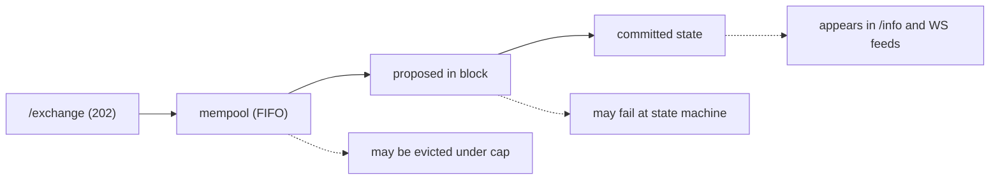
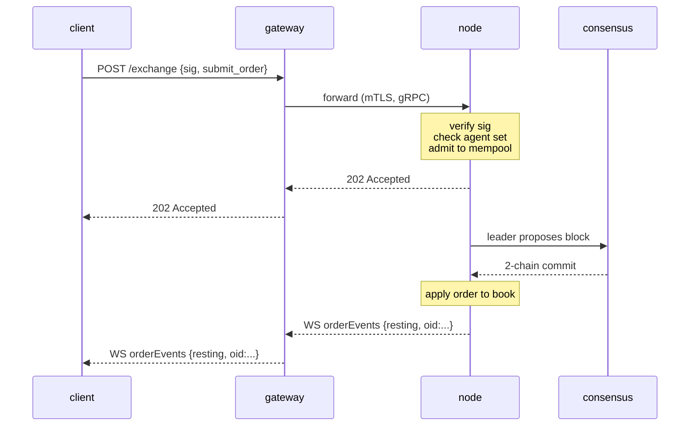

# `POST /exchange` — إرسال إجراء موقّع

:::info
**الحالة.** **مستقر** لمتغيرات الإجراء المدرجة. شكل نقطة النهاية ملتزم به للإصدار V1.
:::

## ملخص سريع

كل **إجراء مستخدم** يُغيّر الحالة — إيداع أمر، إلغاؤه، إيداع في خزينة، اعتماد وكيل، تخزين رهن، وغير ذلك — يُرسَل عبر غلاف JSON واحد موقّع وفق EIP-712 إلى `POST /exchange`. يُحدَّد نوع الإجراء بحقل `type`. يُعيد **الأمر** الاستجابة `200 OK` مع `oid` المعيّن بصورة متزامنة (ينتظر المعالج التأكيد)؛ أما **كل إجراء آخر** فيُعيد `202 Accepted` عند القبول، ويصل تأكيد التنفيذ عبر [تغذية WS](../ws/subscriptions.md) أو بالاستطلاع الدوري.

:::warning
**إجراءات المستخدمين فقط.** `/exchange` هو مسار الكتابة العام **للمستخدم**. الكتابات الامتيازية / النظامية — إرسال سعر الأوراكل، أرصدة الحنفية، `SystemUserModify`، `SystemSpotSend`، تصويتات المحققين — **لا تمرّ أبدًا** عبر `/exchange`، بل تُحقن عبر طوابير محلية للعقدة مؤمَّنة بصلاحيات المحقق (انظر [جدول الإجراءات غير المجسَّرة](#non-bridged-actions) و[الحنفية](./faucet.md#why-this-is-not-on-exchange)). إرسال وسم نظامي أصلي يُعيد `400 unsupported action`.
:::

## عنوان URL

```
POST  https://api.<net>.mtf.exchange/exchange
```

| المسار | شكل البيانات |
|------|-----------|
| `POST /exchange` (البوابة) | **MTF-native** (هذا المستند) |

تخدم البوابة المسار `/exchange` الأصلي لـ MTF. إذا كنت تشغّل العقدة بنفسك، يُقدَّم نفس المسار `/exchange` الأصلي مباشرةً على `http://localhost:8080`.

## غلاف الطلب

```json
{
  "signature": "0xabcd...1b",
  "nonce":     1735689600001,
  "action": {
    "type": "submit_order",
    "order": { /* أحد المتغيرات أدناه */ }
  }
}
```

| الحقل | النوع | مطلوب | الوصف |
|-------|------|----------|-------------|
| `signature` | سلسلة hex، 65 بايت (130 حرف hex؛ `0x` اختيارية) | نعم | ECDSA secp256k1 للاسترداد على ملخص EIP-712 [للبيانات المكتوبة](#signing) لحقول الإجراء المنظَّمة + `nonce`. `r ‖ s ‖ v`. كلا الشكلَين مقبولان: legacy `v ∈ {27, 28}` وEIP-2098 `v ∈ {0, 1}`. |
| `nonce` | uint64 | نعم | تصاعدي صارم لكل ممثل. اصطلاحًا `Date.now()`. مُدمَج في الملخص الموقَّع. انظر [الاتساق](../../integration/idempotency.md). |
| `action` | كائن | نعم | متغير مُوسوم: `{ "type": "<snake_case_tag>", ... }`. انظر [كتالوج الإجراءات](#action-catalog) أدناه. |

:::info
**لا يوجد حقل `sender` على المستوى الأعلى.** لا يحمل الغلاف حقل `sender`. يُحدَّد الحساب الذي تتغير حالته حسب الإجراء:
- **الإجراءات التي تدَّعي ملكية المالك** (`submit_order`، `cancel_order`) تحمل المالك *داخل* جسم الإجراء — `action.order.owner` / `action.cancel.owner`. يسترد الخادم الموقِّع من التوقيع ويشترط مطابقته لذلك `owner` **أو** كونه [وكيلًا](../../concepts/agent-wallets.md) معتمدًا له.
- **الإجراءات المُفوَّضة بالمُرسِل** (الحوكمة، الهامش، قائد الخزينة، التخزين…) **لا تحمل** حقل مالك على الإطلاق: الموقِّع المُستردّ *هو* الممثل، وتُجرى التفويضات على مستوى الإجراء (عضوية المحقق، قائد الخزينة، إلخ) عند التوزيع.
:::

يُعيد الخادم بناء البنية المكتوبة وفق EIP-712 من `action.type` + `action.params` ويستردّ الموقِّع على **تلك القيم الحقلية** — لذا يجب أن تحمل `action.params` التي ترسلها **نفس القيم** (ونفس سلاسل الأرقام العشرية القياسية) التي أدرجتها في الرسالة المكتوبة التي وقّعتها. أي عدم تطابق يُفضي إلى استرداد موقِّع مختلف ويُرفض الطلب بـ `401`. انظر [توقيع البيانات المكتوبة](../../integration/typed-data-signing.md).

## التوقيع

التوقيع هو استرداد ECDSA secp256k1 على ملخص EIP-712 قياسي. يُوقَّع كل إجراء باعتباره **بيانات EIP-712 مكتوبة منظَّمة** (`eth_signTypedData_v4`) مع نوع أساسي لكل إجراء `MetaFluxTransaction:<Action>`، فيُظهر المحفظة كل حقل باسمه. يُعيد الخادم بناء البنية المكتوبة من `action.type` + `action.params`، ويُعيد حساب الملخص، ويسترد الموقِّع:

```
struct_hash = keccak256( typeHash(MetaFluxTransaction:<Action>) ‖ encodeData(fields) )
signed_hash = keccak256( 0x1901 ‖ domain_separator ‖ struct_hash )
```

حيث يكون فاصل النطاق:

```
domain_separator = keccak256(
  keccak256("EIP712Domain(string name,string version,uint256 chainId,address verifyingContract)") ‖
  keccak256("MetaFlux") ‖
  keccak256("1") ‖
  chainId_as_uint256_be ‖
  address_zero_padded_to_32
)
```

سلاسل النوع لكل إجراء، وقواعد `encodeData` الذرية، والأمثلة التفصيلية موجودة في [توقيع البيانات المكتوبة](../../integration/typed-data-signing.md) — مخطط التوقيع الوحيد. يُثبّت اختبار الإجابة المعروفة المشترك بين التطبيقات ملخص كل إجراء.

:::info
**`sig_scheme` أثر تاريخي.** حملت الإصدارات السابقة محدِّد `sig_scheme` على الغلاف؛ لم يعد مطلوبًا ويتجاهله الخادم (يُجرى استرداد البيانات المكتوبة دائمًا بلا شروط). **احذفه.** إذا وُجد، القيمة الوحيدة المقبولة هي `"typed"`.
:::

### معرّفات السلسلة

| الشبكة | `chainId` |
|---------|-----------|
| Devnet (الافتراضية) | `31337` |
| Testnet | `114514` |
| Mainnet | `8964` |

يجب أن يساوي `chainId` في نطاق التوقيع **`chain_id` الإجماعية للعقدة** — استعلم عنها عبر [`/info` `node_info`](./info.md#node_info) (`data.chain_id`) واستخدم تلك القيمة بالضبط. التوقيع بـ `chainId` خاطئ يُعيد `401` لأن العنوان المُستردّ يختلف عن `owner` الإجراء (أو، للإجراءات المُفوَّضة بالمُرسِل، يُستردّ عنوان وهمي لا يجتاز أي فحص تفويض). انظر [الشبكات](../../networks.md) لمعرفة نقاط النهاية.

## اصطلاحات الأرقام

| النوع | شكل البيانات | السبب |
|------|----------|-----|
| `uint64` ≤ 2^53 | رقم JSON | آمن في IEEE-754 |
| `uint64` > 2^53، `u128`، أعداد صحيحة مُحجَّمة | سلسلة JSON | أرقام JSON الأصلية تفقد الدقة بصمت بعد 2^53 |
| العنوان | سلسلة hex `"0x..."` | 20 بايت، 40 حرف hex (مع أو بدون `0x`) |
| القيم المنطقية | `true` / `false` | JSON حرفي |
| الحقول الاختيارية | `null` أو الحذف | كلاهما مقبول؛ `null` هو الشكل القياسي |

**حقول النقطة الثابتة.** حقول السعر والحجم هي أعداد صحيحة بنقطة ثابتة بـ 8 خانات عشرية؛ مبالغ USDC هي وحدات أساسية بـ 6 خانات عشرية. القيمة تحمل المقياس، لا اسم الحقل — مثلًا `px = "10050000000"` تعني `100.50`. أرسلها دائمًا كسلسلة؛ يحللها الخادم إلى `u128`.

## دلالات الموقِّع

يمكن لمعظم الإجراءات أن يوقّعها **إما** الحساب الرئيسي **أو** [محفظة وكيل](../../concepts/agent-wallets.md) نشطة. مجموعة فرعية **للحساب الرئيسي فقط** — يُحرم الوكلاء صراحةً من صلاحية السحب وامتيازات إدارة الحساب.

| فئة الصلاحية | يمكن للحساب الرئيسي التوقيع؟ | يمكن للوكيل التوقيع؟ |
|------------------|:----------------:|:---------------:|
| وضع / إلغاء / تعديل الأوامر | نعم | نعم |
| تحديث الرافعة / وضع الهامش | نعم | نعم |
| إيداع / سحب الخزينة | نعم | نعم |
| إنشاء حساب فرعي | نعم | لا |
| تحويل الحساب الفرعي | نعم | لا |
| اعتماد / إلغاء الوكيل | نعم | لا |
| السحب الخارجي (USDC، spot) | نعم | لا |
| التحويل إلى توقيع متعدد | نعم | لا |
| غلاف التوقيع المتعدد | (خاص — انظر [التوقيع المتعدد](../../concepts/multi-sig.md)) | لا |

تُدرج كل إجراء في [الكتالوج](#action-catalog) قاعدة الموقِّع الخاصة به صراحةً.

---

## كتالوج الإجراءات

كل متغير كائن مُوسوم `{ "type": "<snake_case_tag>", <flat body> }`. مفاتيح الجسم **مسطَّحة تحت كائن الإجراء** (لا يوجد `type` بحالة PascalCase ولا غلاف `params` عام) — مثلًا `submit_order` يحمل كائن `order`، و`cancel_order` يحمل كائن `cancel`، والإجراءات المُفوَّضة بالمُرسِل تحمل كائن `params`. انقر للاطلاع على الجدول التفصيلي للحقول. تُجمِّع الجداول الإجمالية أدناه كل إجراء حسب الفئة؛ **تعريفات الحقول الكاملة التي تعقبها مقسَّمة حسب نوع التداول** — [إجراءات أوامر العقود الدائمة](#perpetual-order-actions)، [إجراءات تداول Spot](#spot-trading-actions)، [إجراءات هامش Spot وEarn](#spot-margin--earn-actions)، [إجراءات هامش العقود الدائمة والمخاطر](#perpetual-margin--risk-actions)، و[إجراءات الحساب والتخزين والخزائن والجسر](#account-staking-vaults--bridge-actions).

:::warning
**`px` / `size` هي `u64` غير موقَّعة بنقطة ثابتة على البيانات الأصلية**، تُرسَل كأرقام JSON (يفككها العقدة كـ `u64` ثم يوسّعها داخليًا). العناوين هي hex بـ `0x` (40 حرفًا)؛ `cloid` هو `0x` + 32 حرف hex (16 بايت).
:::

### وضع الأوامر ودورة حياتها

| `type` | الغرض | الموقِّع | متكرر آمن |
|--------|---------|-----------|-----------|
| [`submit_order`](#submit_order) | وضع أمر واحد | owner / agent | بـ `cloid` |
| [`batch_order`](#batch_order) | N أمر / توقيع واحد | owner / agent | `cloid` لكل ساق |
| [`cancel_order`](#cancel_order) | إلغاء بـ `oid` | owner / agent | نعم |
| [`batch_cancel`](#batch_cancel) | N إلغاء / توقيع واحد | owner / agent | نعم |
| [`cancel_by_cloid`](#cancel_by_cloid) | إلغاء بمعرف أمر العميل | sender / agent | نعم |
| [`cancel_all_orders`](#cancel_all_orders) | إلغاء الكل (فلتر أصول اختياري) | sender / agent | نعم |
| [`modify`](#modify) | تعديل سعر/حجم أمر قائم | sender / agent | نعم |
| [`batch_modify`](#batch_modify) | N تعديل / توقيع واحد | sender / agent | لكل إدخال |
| [`schedule_cancel`](#schedule_cancel) | مشغّل إلغاء الكل في كتلة مستقبلية | sender / agent | نعم |
| [`twap_order`](#twap_order) | جدولة أمر مُقسَّم (TWAP) | sender / agent | بـ `twap_id` |
| [`twap_cancel`](#twap_cancel) | إلغاء أمر TWAP رئيسي قيد التشغيل | sender / agent | نعم |

### تداول Spot

Spot هو CLOB للتبادل بين الرموز (بلا رافعة مالية، بلا مراكز) — دفاتر وأرصدة منفصلة عن العقود الدائمة. يُجمِّد أمر Spot القائم الأموال التي ستُسدَّد عند التنفيذ في **رصيد محجوز**: يحجز `bid` **عملة الاقتباس** (قيمته الاسمية بسعر الحد)، ويحجز `ask` **العملة الأساسية** التي يُقدّمها. يُقيَّد حجم الأمر **عند القبول** بما يغطيه رصيدك، وتُخصَم الرسوم من الساق التي يستلمها كل طرف. كلا الإجراءين **مُفوَّضان بالمُرسِل** (الموقِّع هو المتداول؛ لا يوجد `owner`). انظر [تداول spot](../../products/spot.md) للنموذج المفاهيمي الكامل.

| `type` | الغرض | الموقِّع | متكرر آمن |
|--------|---------|-----------|-----------|
| [`spot_order`](#spot_order) | وضع أمر spot واحد | sender / agent | بـ `cloid` |
| [`spot_cancel`](#spot_cancel) | إلغاء أمر spot قائم بـ `oid` | sender / agent | نعم |

### هامش Spot وEarn

:::info
**متاح على devnet (معاينة).** يعمل تداول Spot بالرافعة ([هامش spot](../../products/spot-margin.md)) وجانب عرض الإقراض فيه ([Earn](../../concepts/earn.md)) من البداية إلى النهاية على **devnet اليوم**: أودع الضمانة، اقترض من مجمع Earn، اشتر العملة الأساسية بضغط IOC برافعة مالية، وأغلق لسداد القرض. تعامل معه باعتباره **معاينة** — تسوية التصفية القسرية غير مُوصَّلة بعد (الإغلاق القسري لا يُحقق ربحًا/خسارة ولا يُنقص الفائدة المفتوحة)، ونسب الصيانة لكل زوج معاملات حوكمة لا تزال قيد المعايرة. لا تفترض الأمان الإنتاجي على نطاق واسع.
:::

مركز spot برافعة مالية **معزول لكل `(account, pair)`**: الضمانة المُنشرة بعملة الاقتباس هي احتياطي خسارة صرف، ويُموَّل الشراء بنسبة 100% عبر قرض بعملة الاقتباس مسحوب من مجمع Earn الخاص بالزوج، والعملة الأساسية المشتراة محتجزة **منفصلة** في حساب الهامش (لا تضاف أبدًا إلى أرصدتك القابلة للإنفاق). Earn هو الجانب الآخر — يودع الموردون عملة الاقتباس القابلة للإقراض مقابل حصص المجمع، ويرفع فائدة القرض التي يدفعها متداولو هامش spot قيمة كل حصة. الإجراءات الست كلها **مُفوَّضة بالمُرسِل** (الموقِّع هو الممثل؛ لا يوجد `owner`). `amount` / `shares` / `borrow` هي أعداد عشرية تُرسَل كسلاسل JSON؛ `size` / `limit_px` هي `u64` على مستويات `1e8` / lot الخام مثل [`spot_order`](#spot_order). يُعيد كل إجراء غلاف القبول [`202 Accepted`](#202-accepted--non-order-admission) (وليس `oid` متزامنًا)؛ تابع النتيجة المُنفَّذة عبر [`/info` `spot_margin_state`](./info/spot.md#spot_margin_state) و[`earn_state`](./info/spot.md#earn_state).

| `type` | الغرض | الموقِّع | متكرر آمن |
|--------|---------|-----------|-----------|
| [`spot_margin_deposit`](#spot_margin_deposit) | إيداع ضمانة بعملة الاقتباس لزوج | sender / agent | لا |
| [`spot_margin_withdraw`](#spot_margin_withdraw) | سحب الضمانة الحرة | sender / agent | لا |
| [`spot_margin_open`](#spot_margin_open) | اقتراض + شراء IOC للعملة الأساسية برافعة | sender / agent | لا |
| [`spot_margin_close`](#spot_margin_close) | بيع العملة الأساسية المحتجزة وسداد القرض | sender / agent | لا |
| [`earn_deposit`](#earn_deposit) | توريد عملة الاقتباس إلى مجمع الإقراض مقابل حصص | sender / agent | لا |
| [`earn_withdraw`](#earn_withdraw) | استرداد حصص المجمع (مقيّد بالحصة الخاملة) | sender / agent | لا |

### الهامش والمخاطر

| `type` | الغرض | الموقِّع |
|--------|---------|-----------|
| [`update_leverage`](#update_leverage) | تغيير الرافعة / تبديل العزل على أصل | sender / agent |
| [`update_isolated_margin`](#update_isolated_margin) | دلتا هامش العزل الموقَّعة | sender / agent |
| [`top_up_isolated_only_margin`](#top_up_isolated_only_margin) | تعبئة هامش العزل الصارم | sender / agent |
| [`user_portfolio_margin`](#user_portfolio_margin) | التسجيل / إلغاء التسجيل في PM | sender / agent |

### إدارة الحساب

| `type` | الغرض | الموقِّع |
|--------|---------|-----------|
| [`approve_agent`](#approve_agent) | اعتماد محفظة وكيل | sender / agent |
| [`set_display_name`](#set_display_name) | تعيين اسم الحساب المعروض | sender / agent |
| [`set_referrer`](#set_referrer) | الربط بعنوان محيل | sender / agent |
| [`approve_builder_fee`](#approve_builder_fee) | اعتماد سقف رسوم البنّاء | sender / agent |
| [`create_sub_account`](#create_sub_account) | فتح حساب فرعي تحت المُرسِل | sender / agent |
| [`sub_account_transfer`](#sub_account_transfer) | نقل الضمانة المشتركة للعقود الدائمة بين الحساب الرئيسي والفرعي | sender / agent |
| [`sub_account_spot_transfer`](#sub_account_spot_transfer) | نقل رصيد رمز spot بين الحساب الرئيسي والفرعي | sender / agent |
| [`convert_to_multi_sig_user`](#convert_to_multi_sig_user) | رفع الحساب إلى توقيع متعدد | sender / agent |
| [`set_position_mode`](#set_position_mode) | تبديل وضع المركز الأحادي/المزدوج | sender / agent |

### التخزين والتجريد

| `type` | الغرض | الموقِّع |
|--------|---------|-----------|
| [`c_deposit`](#c_deposit) | نقل MTF الـ spot إلى رصيد التخزين الحر | sender / agent |
| [`c_withdraw`](#c_withdraw) | نقل رصيد التخزين الحر إلى MTF الـ spot | sender / agent |
| [`token_delegate`](#token_delegate) | تفويض / إلغاء تفويض الرهن | sender / agent |
| [`claim_rewards`](#claim_rewards) | المطالبة بمكافآت التخزين | sender / agent |
| [`link_staking_user`](#link_staking_user) | تعيين اسم مستعار لهدف التخزين | sender / agent |
| [`user_dex_abstraction`](#user_dex_abstraction) | تبديل علامة تجريد DEX للمستخدم | sender / agent |
| [`user_set_abstraction`](#user_set_abstraction) | تهيئة التجريد بنطاق المستخدم الذاتي | sender / agent |
| [`agent_set_abstraction`](#agent_set_abstraction) | تهيئة التجريد بنطاق الوكيل | sender / agent |
| [`priority_bid`](#priority_bid) | دفع رسوم أولوية للتقديم الأمامي في الكتلة | sender / agent |

### الأوامر المشفَّرة

| `type` | الغرض | الموقِّع |
|--------|---------|-----------|
| [`submit_encrypted_order`](#submit_encrypted_order) | نص مشفَّر للأمر بتشفير عتبة | sender / agent |

### الخزائن والسيولة المعدنية

| `type` | الغرض | الموقِّع |
|--------|---------|-----------|
| [`create_vault`](#create_vault) | إنشاء خزينة من قِبل القائد | sender / agent |
| [`vault_transfer`](#vault_transfer) | تحويل بذرة القائد | sender / agent |
| [`vault_modify`](#vault_modify) | تحديث إعدادات الخزينة (للقائد فقط) | sender / agent |
| [`vault_withdraw`](#vault_withdraw) | استرداد حصة المتابع | sender / agent |
| [`REDACTED`](#REDACTED) | تصويت القائمة البيضاء لـ MLP | مفتاح المحقق |
| [`REDACTED`](#REDACTED) | تسجيل / إلغاء تسجيل مشغّل استراتيجية | قائد الخزينة |

### سحوبات الجسر

تغادر السحوبات الخارجية السلسلة عبر [MetaBridge](../../bridge/index.md). الإجراء **مُفوَّض بالمُرسِل**: الموقِّع المُستردّ هو الحساب المُدان، لذا تقتصر صلاحية السحب فعليًا على **الحساب الرئيسي فقط** — توقيع الوكيل سيتصرف على حساب الوكيل الخاص (المنفصل)، ولن يمس حساب المالك أبدًا.

| `type` | الغرض | الموقِّع |
|--------|---------|-----------|
| [`core_evm_transfer`](#core_evm_transfer) | نقل USDC من دفتر Core إلى MetaFluxEVM | sender (رئيسي) |
| [`mb_withdraw`](#mb_withdraw) | سحب ضمانة USDC المشتركة إلى سلسلة خارجية | sender (رئيسي) |

### الإجراءات الغير متاحة على المسار العام `/exchange`

تظهر أسماء الإجراءات هذه في المسودات السابقة (وبعضها في الواجهة المتوافقة مع HL)، لكنها **غير مُجسَّرة على معالج `/exchange` الأصلي لـ MTF**. إما أنها كتابات امتيازية / نظامية لا يجب أن تعبر مسار المستخدم العام، أو هي نماذج مخطط معترف بها لكن غير مُعيَّنة. إرسالها يُعيد `400 unsupported action`. انظر [الجدول أدناه](#non-bridged-actions) لمعرفة موضع كل منها.

| الاسم المسودي | الوسم الأصلي (إن وُجد) | سبب عدم التجسير |
|-----------|----------------------------|-----------------|
| `ScaleOrder` | — | لا يوجد إجراء أصلي؛ قسّمه على جانب العميل إلى `batch_order` |
| `UpdateMarginMode` | — | لا يوجد إجراء أصلي؛ العزل هو علامة `is_isolated` في `update_leverage` |
| `MultiSig` | — | غلاف جمع وتنفيذ التوقيع المتعدد غير مُجسَّر (معاينة / لا ينفّذ — الحساب *مُسجَّل* عبر `convert_to_multi_sig_user`) |
| `RegisterReferrer` | — | غير مُجسَّر (يُربط المُحيل بالعنوان عبر `set_referrer`) |
| `UsdcTransfer` / `SpotTransfer` | — | تدفقات التحويل من مستخدم إلى مستخدم غير مُجسَّرة |
| `WithdrawUsdc` | — | اسم مسودي؛ السحب الخارجي هو [`mb_withdraw`](#mb_withdraw) |
| `BorrowLend` | — | غير مُجسَّر |
| `REDACTED` | — | إجراء محقق/نظام؛ يسير عبر مسار الإجماع، ولا يمر بـ `/exchange` أبدًا |
| `RfqQuote` / `RfqAccept` | `rfq_request` / `rfq_accept` | نموذج معترف به لكن غير مُعيَّن → `unsupported action` |
| `FbaOrder` | `fba_submit` | نموذج معترف به لكن غير مُعيَّن → `unsupported action` |
| (توزيع الخزينة) | `vault_distribute` | معالج جزئي/نموذج؛ غير مُجسَّر على `/exchange` |
| (دورة حياة PM) | `pm_enroll` / `pm_unenroll` / `pm_rebalance` | نموذج معترف به لكن غير مُعيَّن → `unsupported action` |
| (عبر السلاسل) | `cross_chain_send` | نموذج معترف به لكن غير مُعيَّن → `unsupported action` |
| (بديل إرسال مشفَّر) | `encrypted_order_submit` | نموذج؛ استخدم [`submit_encrypted_order`](#submit_encrypted_order) بدلًا منه |

---

## إجراءات أوامر العقود الدائمة

وضع الأوامر ودورة حياتها في أسواق **العقود الدائمة** (معرف سوق `market` دائم). تستخدم هذه الإجراءات CLOB المشترك؛ إجراءات تداول [spot](#spot-trading-actions) و[هامش spot](#spot-margin--earn-actions) موجودة في أقسام منفصلة أدناه. عناصر تحكم الرافعة والهامش للعقود الدائمة موجودة تحت [إجراءات هامش العقود الدائمة والمخاطر](#perpetual-margin--risk-actions).

### `submit_order`

وضع أمر واحد. يُحمَل جسم الأمر تحت `action.order`؛ `owner` هو الحساب المُدَّعى (يشترط الخادم أن يساوي الموقِّع المُستردّ هذا `owner` أو أن يكون وكيلًا معتمدًا له). لوضع عدة أوامر تحت توقيع واحد، استخدم [`batch_order`](#batch_order).

```json
{
  "type": "submit_order",
  "order": {
    "owner":       "0x00000000000000000000000000000000000000aa",
    "market":       7,
    "side":         "bid",
    "kind":         "limit",
    "size":         100000000,
    "limit_px":     10050000000,
    "tif":          "gtc",
    "stp_mode":     "cancel_oldest",
    "reduce_only":  false,
    "cloid":        "0xabababababababababababababababab",
    "builder":      { "fee": 5, "user": "0x00000000000000000000000000000000000000ff" },
    "position_side": "long"
  }
}
```

| الحقل | النوع | النطاق / القيم | الوصف |
|-------|------|----------------|-------------|
| `owner` | عنوان hex | 40 حرف hex | الحساب المُدَّعى؛ يجب أن يساوي الموقِّع المُستردّ أو وكيلًا معتمدًا له. خاص بالبيانات فقط — يُحذف عند الخفض |
| `market` | uint32 | `[0, market_count)` | معرف الأصل/السوق (مُعيَّن لـ `AssetId`) |
| `side` | enum | `"bid"` / `"ask"` | — |
| `kind` | enum | `"limit"` / `"market"` / `"stop_loss"` / `"take_profit"` | `limit` / `market` يضعان أمرًا حيًا. `stop_loss` / `take_profit` مقبولان **فقط عند وجود كتلة `trigger` أيضًا** — يُوقف هذا الزوج ساقًا واحدة للحماية بصورة حصرية (انظر [أوامر التشغيل](#trigger-orders-stop_loss--take_profit))؛ `stop_loss` / `take_profit` *بدون* كتلة `trigger` يُرفضان (`unsupported order kind`) |
| `trigger` | كائن \| null | — | [كتلة trigger](#trigger-orders-stop_loss--take_profit) اختيارية. وجودها — على **أي** `kind` — يحوّل هذا `submit_order` إلى ساق حماية واحدة موقوفة حصرية بدلًا من أمر حي: `{ "trigger_px": <u64>, "is_market": <bool>, "tpsl": "tp" \| "sl" }` |
| `size` | uint64 | `> 0` | وحدات tick بنقطة ثابتة (تُوسَّع إلى `u128`) |
| `limit_px` | uint64 | `> 0` | وحدات tick بنقطة ثابتة (تُوسَّع إلى `i128`) |
| `tif` | enum | `"gtc"`، `"ioc"`، `"alo"` | `"aon"` مرفوض (`unsupported time-in-force` — لا مكافئ في النواة) |
| `stp_mode` | enum | `"cancel_oldest"`، `"cancel_newest"`، `"cancel_both"` | `"reject"` مرفوض (`unsupported stp_mode` — لا مكافئ في النواة) |
| `reduce_only` | bool | — | إذا كان true، يُرفض عند التنفيذ إذا كان سيُكبِّر المركز |
| `cloid` | سلسلة hex \| null | `0x` + 32 حرف hex (16 بايت) | معرف أمر العميل الاختياري؛ يُتيح `cancel_by_cloid` وإلغاء التكرار |
| `builder` | كائن \| null | — | تحميل اختياري لرسوم البنّاء: `{ "fee": <bps u16>, "user": <0x-hex address> }` |
| `position_side` | enum \| null | `"long"` / `"short"` | **[وضع التحوط](../../concepts/hedge-mode.md) فقط.** الساق المستهدفة للأمر. **احذفه من حساب أحادي الاتجاه** (الافتراضي) **وأرسله من حساب تحوط** — يُرفض الحساب الأحادي الذي يرسله، أو الحساب المزدوج الذي يحذفه. يُقيَّم `reduce_only` مقابل الساق المسمّاة فقط. انظر [وضع التحوط](#position_side-hedge-mode) أدناه |

**الاتساق**: يُرفض `cloid` المكرر على نفس الحساب عند القبول بـ `error: "duplicate cloid"`. استخدم `cloid` كمفتاح إلغاء تكرار على جانب العميل.

**الأخطاء الشائعة**: `px` غير مُحاذٍ مع tick، `size` أقل من الحد الأدنى للسوق، `reduce_only` سيُكبِّر المركز، الرفض عبر STP، الحساب في مستوى تصفية T1+.

**مدخلات حالة الاستجابة** (لكل أمر، بالترتيب — انظر الاتحاد الكامل تحت [الاستجابة → 200 OK](#200-ok--order-path-synchronous-oid)):

```json
{"resting": {"oid": 12345, "cloid": "0x..."}}                       // نُشر في الدفتر
{"filled":  {"oid": 12345, "total_sz": "100000000", "avg_px": "10050000000"}}
{"error":   "<reason>"}                                             // رُفض هذا الإدخال عند التنفيذ/القبول
{"pending": {"action_hash": "0x...", "nonce": 1735689600001}}       // مقبول، لا تأكيد في نافذة الانتظار
```

#### `position_side` (وضع التحوط)

حقل `position_side` الاختياري في جسم الأمر يختار الساق التي يُطبَّق عليها الأمر عندما يكون الحساب في [وضع التحوط](../../concepts/hedge-mode.md).

- **الحساب الأحادي الاتجاه (الافتراضي):** **احذف** `position_side`. إرساله على حساب أحادي الاتجاه يُرفض.
- **الحساب المزدوج:** `position_side` **مطلوب** في كل أمر (`"long"` أو `"short"`). حذفه على حساب مزدوج يُرفض.

تُختار الساق صراحةً — **لا تُستنتج أبدًا** من `side` — فلا يمكن لـ `bid` المقصود *لتقليص مركز قصير* أن يفتح مركزًا طويلًا أو يُكبِّره بالخطأ. عند تعيين `reduce_only`، يُقيَّم **مقابل الساق المسمّاة فقط**: أمر `reduce_only` على `short` لا يمس ساق `long` أبدًا، والعكس صحيح. لا يوجد انقلاب ضمني — إغلاق الساق الطويلة لا يفتح مركزًا قصيرًا.

| `side` | `position_side` | `reduce_only` | التأثير (حساب التحوط) |
|--------|-----------------|---------------|------------------------|
| `bid` | `long` | false | فتح/إضافة إلى الساق الطويلة |
| `ask` | `long` | true | تقليص/إغلاق الساق الطويلة |
| `ask` | `short` | false | فتح/إضافة إلى الساق القصيرة |
| `bid` | `short` | true | تقليص/إغلاق الساق القصيرة |

حوِّل الحساب إلى وضع التحوط (وهو مستوٍ) باستخدام [`set_position_mode`](#set_position_mode).

#### أوامر التشغيل (`stop_loss` / `take_profit`)

يُعبَّر عن ساق حماية مفردة (وقف خسارة أو جني أرباح) كـ `submit_order` يحمل جسم `order` به كتلة `trigger`. **وجود** الكتلة — لا `kind` — هو ما يوجّهها: يُوقف الأمر في سجل التشغيل القياسي بدلًا من إضافته إلى الدفتر، ويُطلق لاحقًا كـ **IOC حصري** عندما يتجاوز سعر العلامة `trigger_px`.

```json
{
  "type": "submit_order",
  "order": {
    "owner":       "0x00000000000000000000000000000000000000aa",
    "market":       7,
    "side":         "ask",
    "kind":         "take_profit",
    "size":         50000000,
    "limit_px":     0,
    "tif":          "ioc",
    "stp_mode":     "cancel_oldest",
    "reduce_only":  false,
    "trigger":     { "trigger_px": 4200000000000, "is_market": true, "tpsl": "tp" }
  }
}
```

| الحقل | النوع | النطاق / القيم | الوصف |
|-------|------|----------------|-------------|
| `trigger.trigger_px` | uint64 | `> 0` | سعر التشغيل بوحدات tick ذات نقطة ثابتة (تُوسَّع إلى `i128`). تُوقف الساق المُوقوفة **عند هذا السعر** — يُعاد استخدامه كسعر الساق المُطلقة (يُهمَل `limit_px` الخاص بالأمر للتشغيل) |
| `trigger.is_market` | bool | — | تسمية إرشادية (`true` = الساق المُطلقة هي market/IOC). مسار الإيقاف يُطلق دائمًا IOC حصريًا بصرف النظر؛ مُقتنى لأمانة مسار القراءة، لا للتحكم |
| `trigger.tpsl` | enum | `"tp"` / `"sl"` | تسمية إرشادية لجني الأرباح/وقف الخسارة. يستنتج المنفّذ اتجاه الإطلاق من `side` الساق مقابل العلامة؛ تظهر في `/info`، لا للتحكم |

الدلالات:

- **الحصرية مُفرضة.** ساق التشغيل تُغلق دائمًا — لا يمكنها فتح مركز أو تكبيره أبدًا — بصرف النظر عن قيمة `reduce_only` الواردة في الأمر.
- **`side` الساق تحدد ما يُحمى.** تشغيل `ask` يُغلق مركزًا طويلًا؛ تشغيل `bid` يُغلق مركزًا قصيرًا. على [حساب التحوط](#position_side-hedge-mode)، أرسل `position_side` لتسمية الساق، تمامًا كما في الأمر الحي.
- **`trigger_px` هو السعر الموقوف**، ليس `limit_px` الأمر — أرسل `limit_px` كما تشاء (`0` مقبول)؛ سعر كتلة التشغيل هو ما يُستخدم.
- **OCO.** تنهار ساق التشغيل المجمَّعة معًا عند الإطلاق (ساق مُطلَقة تُتقاعد؛ أختها تُلغى).

القبول يُعيد نفس اتحاد حالة كل أمر كـ `submit_order` حي. تشغيل يُوقف يُبلَّغ عنه عبر مسار الأمر؛ الإطلاق النهائي هو تأثير مُنفَّذ يمكن مراقبته على [تغذية WS](../ws/subscriptions.md) / `/info`. سلات متعددة الأوامر للحماية تستخدم [`batch_order`](#batch_order) مع `grouping: "normalTpsl"` / `"positionTpsl"`.

---

### `batch_order`

N من الأوامر يحملها مغلّف موقّع واحد / nonce واحد. كل إدخال عبارة عن جسم أمر
[`submit_order`](#submit_order) كامل (نفس الحقول، بما فيها `owner` / `cloid` / `builder` لكل أمر).

```json
{
  "type": "batch_order",
  "params": {
    "orders": [
      { "owner": "0x...aa", "market": 1, "side": "bid", "kind": "limit",
        "size": 1000, "limit_px": 5000, "tif": "gtc",
        "stp_mode": "cancel_oldest", "reduce_only": false },
      { "owner": "0x...aa", "market": 2, "side": "ask", "kind": "limit",
        "size": 2000, "limit_px": 6000, "tif": "gtc",
        "stp_mode": "cancel_oldest", "reduce_only": false }
    ],
    "grouping": "na"
  }
}
```

| الحقل | النوع | القيم | الوصف |
|-------|------|--------|-------------|
| `orders[*]` | order | — | كل إدخال يحمل الشكل الكامل لأمر `submit_order` |
| `grouping` | enum | `"na"`, `"normalTpsl"`, `"positionTpsl"` | تجميع عائلة الأوامر؛ القيمة الافتراضية `"na"` إذا حُذف |

يُعيد مصفوفة من حالات كل طرف (نفس union الخاصة بـ `submit_order`).

---

### `cancel_order`

إلغاء أمر واحد بواسطة `oid`. جسم الإلغاء موجود ضمن `action.cancel`؛ `owner`
هو الحساب المُعلَن عنه (يجب أن يتطابق الموقِّع المُستردّ معه أو أن يكون وكيلاً معتمداً).
لإلغاء عدة أوامر تحت توقيع واحد، استخدم [`batch_cancel`](#batch_cancel).

```json
{
  "type": "cancel_order",
  "cancel": {
    "owner":  "0x00000000000000000000000000000000000000aa",
    "market": 3,
    "oid":    12345
  }
}
```

| الحقل | النوع | الوصف |
|-------|------|-------------|
| `owner` | hex address | الحساب المُعلَن عنه؛ يُرسَل عبر السلك فقط |
| `market` | uint32 | معرّف الأصل/السوق |
| `oid` | uint64 | معرّف الأمر على الخادم (يُعاد في استجابة `submit_order`). **مطلوب** — الإلغاء الذي يحتوي فقط على `cloid` يُرفض (`cancel requires an oid`)؛ استخدم [`cancel_by_cloid`](#cancel_by_cloid) بدلاً من ذلك |
| `cloid` | hex string \| null | مقبول عبر السلك لكنه **لا** يُستخدم للإلغاء هنا |

**مضمون التكرار**: إلغاء أمر مُلغى مسبقاً أو مُنفَّذ بالكامل يُعيد `{"error":"order not found"}` وهو غير ضار.

---

### `batch_cancel`

N من الإلغاءات يحملها مغلّف موقّع واحد. كل إدخال عبارة عن جسم إلغاء
[`cancel_order`](#cancel_order) (يُشترط وجود `oid` في كل إدخال؛
تُرفض الإدخالات التي تعتمد على `cloid` فقط).

```json
{
  "type": "batch_cancel",
  "params": {
    "cancels": [
      { "owner": "0x...aa", "market": 1, "oid": 10 },
      { "owner": "0x...aa", "market": 2, "oid": 11 }
    ]
  }
}
```

نفس شكل استجابة كل إدخال الخاصة بـ `cancel_order`.

---

### `cancel_by_cloid`

إلغاء بواسطة معرّف الأمر من طرف العميل. مفيد حين لا يكون المُستدعي قد رأى
`oid` من جانب الخادم بعد (تسابق بين استجابة `submit_order` وقرار الإلغاء).
هذا إجراء **مُخوَّل للمُرسِل** (لا يوجد حقل `owner` — الموقِّع المُستردّ هو الفاعل).

```json
{
  "type": "cancel_by_cloid",
  "params": {
    "asset": 7,
    "cloid": "0xabababababababababababababababab"
  }
}
```

| الحقل | النوع | الوصف |
|-------|------|-------------|
| `asset` | uint32 | معرّف الأصل/السوق |
| `cloid` | hex string | `0x` + 32 حرف سداسي عشري (16 بايت) |

نفس شكل الاستجابة الخاصة بـ `cancel_order`.

---

### `cancel_all_orders`

إلغاء جميع الأوامر المعلّقة للمُرسِل، مع إمكانية التصفية على أصل واحد اختيارياً.

```json
{
  "type": "cancel_all_orders",
  "params": { "asset": 3 }
}
```

| الحقل | النوع | الوصف |
|-------|------|-------------|
| `asset` | uint32 \| null | `null` / محذوف = جميع الأصول؛ `Some(a)` = الأصل `a` فقط |

يُعيد عدد الأوامر المُلغاة.

---

### `modify`

تعديل سعر و/أو حجم أمر معلّق في مكانه. يجب أن يكون أحد `new_px` /
`new_size` على الأقل موجوداً. يُحدَّد الأمر المستهدف **بواسطة `oid`** أو **بواسطة
`cloid`** (معرّف الأمر من طرف العميل الذي وُضع به الأمر) — أرسل أحدهما فقط.

```json
{
  "type": "modify",
  "params": {
    "market":   3,
    "oid":      12345,
    "new_px":   10049000000,
    "new_size": 100000000
  }
}
```

العنونة بـ `cloid` بدلاً من `oid` (احذف `oid` أو اتركه `0`):

```json
{
  "type": "modify",
  "params": {
    "market":       3,
    "cloid":        "0xabababababababababababababababab",
    "new_px":       10049000000,
    "always_place": true
  }
}
```

| الحقل | النوع | الوصف |
|-------|------|-------------|
| `market` | uint32 | معرّف الأصل/السوق |
| `oid` | uint64 | معرّف الأمر المستهدف. القيمة الافتراضية `0` (= عنونة بـ `cloid`) عند الحذف |
| `cloid` | hex string \| null | `0x` + 32 حرف سداسي عشري (16 بايت). عند التعيين، يُحَلّ الهدف بواسطة معرّف الأمر من طرف العميل (نفس محلِّل [`cancel_by_cloid`](#cancel_by_cloid)) بدلاً من `oid`. يُرفض `cloid` المشوّه عند الإدخال |
| `new_px` | uint64 \| null | السعر الجديد بوحدات نقطة الفاصلة الثابتة (`null` / محذوف = بدون تغيير) |
| `new_size` | uint64 \| null | الحجم الجديد بوحدات نقطة الفاصلة الثابتة (`null` / محذوف = بدون تغيير) |
| `always_place` | bool | عند `true`، يُعدّ الهدف الذي لم يعد معلّقاً بمثابة عملية لا تأثير لها بدلاً من رفضه. القيمة الافتراضية `false` |

يُعيد حالة تعديل واحدة.

---

### `batch_modify`

تطبيق N من عمليات `modify` تحت توقيع واحد. كل إدخال يحمل نفس شكل
`modify.params`.

```json
{
  "type": "batch_modify",
  "params": {
    "modifications": [
      { "market": 1, "oid": 5, "new_px": 100, "new_size": null },
      { "market": 2, "oid": 6, "new_px": null, "new_size": 7 }
    ]
  }
}
```

| الحقل | النوع | الوصف |
|-------|------|-------------|
| `modifications[*]` | modify | كل إدخال يحمل الشكل الكامل لمعاملات [`modify`](#modify) (`market`, `oid`, `new_px` / `new_size` الاختياريان) |

**الاستجابة.** إجراء غير مرتبط بالأوامر ←
[مغلّف القبول `202 Accepted`](#202-accepted--non-order-admission):

```json
{ "accepted": true, "mempool_depth": 3, "nonce": 1735689600001, "action_hash": "0x..." }
```

**عند الالتزام** تُطبَّق الإدخالات **بترتيب الإدخال** وهي **ليست
إما الكل أو لا شيء**: كل تعديل يُطبَّق باستقلالية أو يُعيد خطأ بسبب محدد
(نتيجة الالتزام تحمل حالة واحدة لكل إدخال، بترتيب الإدخال، بالإضافة إلى
عدد الإدخالات المُطبَّقة). لا تحمل استجابة HTTP حالات لكل إدخال — تتبّع
الالتزام عبر `action_hash` المُعاد. يُرفض مصفوفة `modifications` الفارغة
(`empty batch`)؛ أكثر من **1000** إدخال يُرفض (تقييد معدل)؛
إدخال بـ `new_px` و`new_size` كلاهما null يُعيد خطأ (`nothing to modify`).

---

### `schedule_cancel`

تفعيل إلغاء شامل مجدوَل لكتلة مستقبلية: عند بلوغ `cancel_at_block`، تُلغى
جميع الأوامر المفتوحة للمُرسِل (مفتاح إيقاف تلقائي).

```json
{
  "type": "schedule_cancel",
  "params": { "cancel_at_block": 999 }
}
```

| الحقل | النوع | الوصف |
|-------|------|-------------|
| `cancel_at_block` | uint64 | ارتفاع الكتلة الذي تُلغى عنده الأوامر المفتوحة للمُرسِل |

---

### `twap_order`

جدولة أمر مُجزَّأ (موزون زمنياً). يُقسَّم الأمر الأصلي إلى `slice_count`
من الأوامر الفرعية تتباعد بفاصل `delay_ms`.

```json
{
  "type": "twap_order",
  "params": {
    "market":      4,
    "side":        "ask",
    "total_size":  1000000000,
    "slice_count": 10,
    "delay_ms":    500,
    "reduce_only": true
  }
}
```

| الحقل | النوع | الوصف |
|-------|------|-------------|
| `market` | uint32 | معرّف الأصل/السوق |
| `side` | enum | `"bid"` / `"ask"` |
| `total_size` | uint64 | الحجم الإجمالي بوحدات نقطة الفاصلة الثابتة (مُوسَّع إلى `u128`) |
| `slice_count` | uint32 | عدد الشرائح الفرعية (`> 0`) |
| `delay_ms` | uint64 | الفاصل الزمني بين الشرائح بالميلي ثانية |
| `reduce_only` | bool | — |

**الاستجابة.** إجراء غير مرتبط بالأوامر ←
[مغلّف القبول `202 Accepted`](#202-accepted--non-order-admission):

```json
{ "accepted": true, "mempool_depth": 1, "nonce": 1735689600001, "action_hash": "0x..." }
```

يُعيَّن `twap_id` الأصلي (uint64) **عند الالتزام** من عدّاد محدد الحتمية لكل سلسلة
ويُحمَل في نتيجة الالتزام — وهو **غير** موجود في استجابة HTTP.
تتبّع الالتزام عبر `action_hash` المُعاد. يُسبّب `total_size` الصفري
أو `slice_count` الصفري خطأً عند الالتزام. تنتقل أحداث الشرائح عبر
[قناة `user_events` على WebSocket](../ws/subscriptions.md) (بث `twap*` مخصص
في خارطة الطريق).

---

### `twap_cancel`

إلغاء أمر TWAP أصلي جارٍ. الشرائح المُنفَّذة بالفعل تبقى مُنفَّذة؛ الشرائح المستقبلية تتوقف.

```json
{
  "type": "twap_cancel",
  "params": { "twap_id": 17 }
}
```

| الحقل | النوع | الوصف |
|-------|------|-------------|
| `twap_id` | uint64 | معرّف أمر TWAP الأصلي المُعاد من `twap_order` |

---

## إجراءات تداول السبوت

إجراءات [السبوت](../../products/spot.md) من رمز إلى رمز — بلا رافعة مالية، بلا مراكز،
وبدفاتر أوامر وأرصدة منفصلة تماماً عن العقود الآجلة الدائمة.

### `spot_order`

وضع أمر واحد على سوق **سبوت**. صفقات السبوت عبارة عن مبادلة رمز برمز
بلا رافعة مالية ولا مراكز؛ دفاتر الأوامر والأرصدة منفصلة تماماً عن العقود الآجلة الدائمة.
يُحمَل جسم الأمر ضمن `action.order`. أوامر السبوت **مُخوَّلة للمُرسِل** —
الموقِّع المُستردّ هو المتداول، لذا **لا يوجد حقل `owner`**. `pair` هو **معرّف زوج السبوت**
(`SpotPairSpec.pair_id`)، وهو مختلف عن معرّف `market` للعقود الآجلة ومعرّف الرمز.

```json
{
  "type": "spot_order",
  "order": {
    "pair":      200,
    "side":      "bid",
    "size":      100000000,
    "limit_px":  200000000,
    "tif":       "gtc",
    "stp_mode":  "cancel_oldest",
    "cloid":     "0xabababababababababababababababab"
  }
}
```

| الحقل | النوع | النطاق / القيم | الوصف |
|-------|------|----------------|-------------|
| `pair` | uint32 | زوج سبوت نشط | معرّف زوج السبوت (`SpotPairSpec.pair_id`) — **ليس** معرّف رمز |
| `side` | enum | `"bid"` / `"ask"` | `bid` يشتري الأصل الأساسي (يدفع بالأصل المرجعي)؛ `ask` يبيع الأصل الأساسي (يستلم الأصل المرجعي) |
| `size` | uint64 | `> 0` | حجم الأصل الأساسي بالوحدات الخام (`10^sz_decimals` لكل وحدة كاملة)؛ مُوسَّع إلى `u128` |
| `limit_px` | uint64 | `> 0` | سعر الحد في مستوى `1e8`. الأوامر السوقية (`0`) **غير مدعومة بعد** — أرسل دائماً حداً |
| `tif` | enum | `"gtc"`, `"ioc"`, `"alo"` | متبقيات `gtc` / `alo` **تستريح** (مدعومة بالضمان)؛ `ioc` لا تستريح أبداً. `"aon"` مرفوض |
| `stp_mode` | enum | `"cancel_oldest"`, `"cancel_newest"`, `"cancel_both"` | منع التداول الذاتي. `"reject"` مرفوض (لا يوجد مكافئ في النواة) |
| `cloid` | hex string \| null | `0x` + 32 حرف سداسي عشري (16 بايت) | معرّف الأمر من طرف العميل (اختياري) |

**الضمان.** أمر السبوت المعلّق (متبقي `gtc` / `alo`) يقفل الأموال التي سيدين بها
عند التنفيذ في رصيد محجوز: `bid` يحجز **الأصل المرجعي** (قيمته الاسمية بسعر الحد)،
و`ask` يحجز **الأصل الأساسي** الذي يعرضه. الأموال المحجوزة غير قابلة للإنفاق؛
تُدفع للطرف المقابل عند التنفيذ، أو تُعاد إليك عند الإلغاء أو منع التداول الذاتي
أو تعطيل السوق. أرصدة كل رمز محفوظة بدقة تامة.

**القدرة على التمويل.** يُقيَّد حجم الأمر عند الإدخال بما يمكنك تمويله
(شراء بـ `quote_balance ÷ limit_px`؛ بيع بما تمتلكه من الأصل الأساسي). الأمر
غير القابل للتمويل كلياً يُقبَل كعملية لا تأثير لها (لا تنفيذ، لا شيء يستريح).

**الرسوم والتسوية.** يبادل التنفيذ الأصلَ الأساسي بالأصل المرجعي بسعر الصانع
المعلّق. تُؤخذ رسوم المتلقي من الجانب الذي يستلمه المتلقي؛ ورسوم الصانع من
الجانب الذي يستلمه الصانع. تتراكم الرسوم في حساب رسوم السبوت.

**الحدود.** يمكن لكل حساب تعليق ما يصل إلى **1000** أمر لكل زوج سبوت؛ أمر
جديد معلّق يتجاوز هذا الحد يُرفض (`spot resting-order cap reached` — ألغِ بعضها
أولاً). حسابات صانعي السوق المعتمدة معفاة. عند إيقاف السبوت بواسطة الحوكمة،
تُرفض الأوامر الجديدة (`spot trading disabled`) — لكن يمكنك الاستمرار في
[`spot_cancel`](#spot_cancel) واسترداد الضمان.

**الاستجابة.** كما في [`submit_order`](#submit_order) للعقود الآجلة الدائمة، يُعيد `spot_order`
حالة **متزامنة** لكل أمر بمجرد التزام الأمر — معرّف `oid` الفعلي المعيَّن مع
إدخال `resting` أو `filled` (أو `error`)، أو `pending` إذا لم يصل أي التزام
خلال نافذة انتظار الأمر. اتحاد الحالة هو نفسه لـ
[`submit_order`](#200-ok--order-path-synchronous-oid). أرصدة السبوت / الأوامر
المفتوحة قابلة للاستعلام أيضاً عبر [`/info`](./info.md)؛ تنفيذات السبوت لم تُضَف
بعد إلى خلاصات الصفقات / الشمعات على WebSocket.

---

### `spot_cancel`

إلغاء أحد أوامر السبوت المعلّقة **الخاصة بك** بواسطة `oid` على زوج محدد،
مع استرداد الضمان المقفول. مُخوَّل للمُرسِل؛ **لا يحق إلغاء الأمر إلا لصاحبه** —
طرف ثالث (أو مالك خاطئ) يُرفض (`not the order owner`). `oid` غير معروف أو
غير معلّق يُعيد خطأ مُصنَّف (`order not found`). الإلغاءات **لا تُعاق**
بإيقاف السبوت، لذا يمكنك دائماً الخروج من الأمر المعلّق واسترداد الضمان.

```json
{
  "type": "spot_cancel",
  "cancel": { "pair": 200, "oid": 12345 }
}
```

| الحقل | النوع | النطاق / القيم | الوصف |
|-------|------|----------------|-------------|
| `pair` | uint32 | زوج سبوت نشط | معرّف زوج السبوت الذي يستريح عليه الأمر |
| `oid` | uint64 | `oid` معلّق للسبوت | معرّف الأمر على الخادم المراد إلغاؤه (الإلغاء بـ`cloid` غير مُعيَّن بعد للسبوت) |

---

## إجراءات هامش السبوت والعائد

[هامش السبوت](../../products/spot-margin.md) برافعة مالية وجانب
العرض في [الإقراض عبر Earn](../../concepts/earn.md). **متاح على devnet
(معاينة).** جميع الإجراءات هنا مُفوَّضة من المُرسِل وتُعيد
مغلف القبول [`202 Accepted`](#202-accepted--non-order-admission).

### `spot_margin_deposit`

:::info
**متاح على devnet (معاينة).** راجع نظرة عامة [على هامش السبوت والعائد](#spot-margin--earn) للاطلاع على تحفظات المعاينة.
:::

أودِع ضماناً عرضياً (USDC) في حساب الهامش الخاص بك لـ `(account, pair)`، يُخصَم من رصيدك النقدي القابل للإنفاق. الضمان هو **احتياطي خسائر فقط** — فهو لا يموّل عملية الشراء (ذلك يتم عبر اقتراض [`spot_margin_open`](#spot_margin_open)). مُفوَّض من المُرسِل؛ يُحمَل المحتوى ضمن `action.params`. `pair` هو **معرّف زوج السبوت**. يُنشأ الحساب عند أول إيداع ويتراكم عند الإيداعات المتكررة.

```json
{
  "type": "spot_margin_deposit",
  "params": { "pair": 200, "amount": "100" }
}
```

| الحقل | النوع | النطاق / القيم | الوصف |
|-------|------|----------------|-------------|
| `pair` | uint32 | زوج سبوت نشط مع تفعيل الهامش | معرّف زوج السبوت (`SpotPairSpec.pair_id`) — **وليس** معرّف رمز |
| `amount` | سلسلة عشرية | `> 0` | الضمان العرضي المراد إيداعه (وحدات كاملة)، بوصفه سلسلة JSON |

**الاشتراطات.** يجب أن يكون الهامش **مُفعَّلاً للزوج** — يحتاج الزوج إلى معاملات مخاطر خاصة به موجودة، وهي إعداد حوكمة لا يزال قيد المعايرة. يُرفض الإيداع على زوج دون هذه المعاملات (`spot margin not enabled for pair`). كذلك يُرفض الزوج غير المعروف، أو قيمة `amount` غير موجبة، أو مبلغ يتجاوز رصيدك العرضي القابل للإنفاق، وذلك عند القبول.

**الاستجابة.** تُعيد مغلف القبول [`202 Accepted`](#202-accepted--non-order-admission) (وليس `oid` متزامناً). تأكد من رصيد الضمان المُضاف عبر [`/info` `spot_margin_state`](./info/spot.md#spot_margin_state). راجع [هامش السبوت](../../products/spot-margin.md).

---

### `spot_margin_withdraw`

:::info
**متاح على devnet (معاينة).** راجع نظرة عامة [على هامش السبوت والعائد](#spot-margin--earn) للاطلاع على تحفظات المعاينة.
:::

انقل الضمان الحر من حساب الهامش الخاص بك لـ `(account, pair)` إلى رصيدك العرضي القابل للإنفاق. **في غياب أي مركز مفتوح** يمكن سحب الضمان بالكامل (ويُحذف الحساب المُفرَّغ). **في حال وجود مركز مفتوح** يخضع السحب لشرط متطلب الهامش الأولي مقابل القاعدة المحتجزة المقيَّمة بسعر آخر صفقة سبوت للزوج — وإذا لم يتوفر سعر مرجعي يُرفض السحب (قاعدة محافظة حتمية). مُفوَّض من المُرسِل؛ المحتوى ضمن `action.params`.

```json
{
  "type": "spot_margin_withdraw",
  "params": { "pair": 200, "amount": "50" }
}
```

| الحقل | النوع | النطاق / القيم | الوصف |
|-------|------|----------------|-------------|
| `pair` | uint32 | زوج سبوت نشط | معرّف زوج السبوت المرتبط بحساب الهامش |
| `amount` | سلسلة عشرية | `> 0`، `≤` الضمان المُودَع | الضمان العرضي المراد سحبه (وحدات كاملة)، بوصفه سلسلة JSON |

**الاشتراطات.** يُرفض في حال عدم وجود حساب هامش للزوج، أو إذا تجاوز `amount` الضمان المُودَع، أو (في حال وجود مركز مفتوح) إذا كان الضمان المتبقي سيقل عن متطلب الهامش الأولي، أو إذا لم يوجد سعر مرجعي لتقييم القاعدة المحتجزة.

**الاستجابة.** تُعيد مغلف القبول [`202 Accepted`](#202-accepted--non-order-admission). تأكد عبر [`/info` `spot_margin_state`](./info/spot.md#spot_margin_state).

---

### `spot_margin_open`

:::info
**متاح على devnet (معاينة).** راجع نظرة عامة [على هامش السبوت والعائد](#spot-margin--earn) للاطلاع على تحفظات المعاينة. تعمل الرافعة المالية بالكامل على devnet؛ **لم يُربط بعد تسوية التصفية الإجبارية**.
:::

افتح مركزاً شراء برافعة مالية: اقترض `borrow` عرضاً من مجمع Earn الخاص بالزوج و**اشترِ** `size` من القاعدة بأمر IOC بسعر لا يتجاوز `limit_px`. يُموَّل الشراء بالكامل من الاقتراض؛ ضمانك المُودَع هو احتياطي الخسائر (الرافعة ≈ القيمة الاسمية / الضمان). تُحتجز القاعدة المشتراة **بصورة منفصلة** في حساب الهامش — ولا تُضاف إلى أرصدتك القابلة للإنفاق. يُسدَّد **أي اقتراض غير مُستخدَم فوراً** بعد تسوية الأمر IOC، بحيث يعكس القرض القائم فقط ما أُنفق فعلياً في الشراء. أمر IOC بتعبئة صفرية هو عملية مقبولة ولا تُغيّر شيئاً (استرداد كامل، بلا اقتراض، الحساب يبقى مفتوحاً). تسمح v1 بـ**مركز واحد مفتوح لكل `(account, pair)`** — لا إضافات. مُفوَّض من المُرسِل؛ المحتوى ضمن `action.params`.

```json
{
  "type": "spot_margin_open",
  "params": { "pair": 200, "size": 200, "limit_px": 200000000, "borrow": "400" }
}
```

| الحقل | النوع | النطاق / القيم | الوصف |
|-------|------|----------------|-------------|
| `pair` | uint32 | زوج سبوت نشط مع تفعيل الهامش | معرّف زوج السبوت (`SpotPairSpec.pair_id`) |
| `size` | uint64 | `> 0` | حجم الشراء بالوحدات الأساسية الخام (`10^sz_decimals` لكل وحدة كاملة)؛ يُوسَّع إلى `u128` |
| `limit_px` | uint64 | `> 0` | سعر الحد في مستوى `1e8` |
| `borrow` | سلسلة عشرية | `> 0` | رأس المال العرضي المراد استقطاعه من مجمع Earn (وحدات كاملة)، بوصفه سلسلة JSON |

**بوابة الهامش الأولي.** يخضع الفتح مسبقاً لشرط **أسوأ تكلفة محتملة** (`limit_px × size`): يُرفض الفتح ما لم يكن `collateral ≥ init_ratio × worst_cost`، حيث `init_ratio` هو معامل الهامش الأولي المعايَر للزوج. ونظراً لاستخدام البوابة لأسوأ حالة، فإن الفتح الناجح لا يحتاج أبداً إلى تفكيك — يمكن أن يكون الإنفاق الفعلي أقل فقط (أسعار الصانع `≤ limit_px`، الحجم محدود).

**الاشتراطات.** يُرفض إذا لم يكن الهامش مُفعَّلاً للزوج، أو إذا لم يوجد حساب هامش (أودِع ضماناً أولاً)، أو إذا كان مركز مفتوح بالفعل على الزوج، أو إذا كانت السيولة الخاملة لمجمع Earn أقل من `borrow`، أو إذا كان تداول السبوت موقوفاً، أو عند `size` صفري / `borrow` غير موجب.

**الاستجابة.** تُعيد مغلف القبول [`202 Accepted`](#202-accepted--non-order-admission) (وليس `oid` متزامناً — تعبئة الأمر IOC الداخلي تأثير مُلتزَم به). راقب الـ`borrowed` / الـ`base_held` الناتجَين عبر [`/info` `spot_margin_state`](./info/spot.md#spot_margin_state)؛ يتغير `total_borrowed` للمجمع في [`earn_state`](./info/spot.md#earn_state). راجع [هامش السبوت](../../products/spot-margin.md).

---

### `spot_margin_close`

:::info
**متاح على devnet (معاينة).** راجع نظرة عامة [على هامش السبوت والعائد](#spot-margin--earn) للاطلاع على تحفظات المعاينة.
:::

أغلق المركز: **بِع** القاعدة المحتجزة بأمر IOC بسعر لا يقل عن `limit_px`، وسدِّد الدَّين المتراكم (الأصل + الفائدة) لمجمع Earn، وأعِد الباقي إليك. عند **الإغلاق الكامل** ينضم الضمان إلى ميزانية السداد، وأي فائض يبقى لك، ويُحذف الحساب. **التعبئة الجزئية تُبقي الحساب مفتوحاً**: تعود القاعدة غير المباعة إلى الاحتجاز المنفصل، وتُسدَّد العائدات المحققة فقط (الضمان دون تغيير)، وينخفض الأصل القائم وفقاً لذلك. v1 مخصصة للإغلاق الكامل فقط (بلا وسيطة `size` — يُعرَض كامل الحيازة). مُفوَّض من المُرسِل؛ المحتوى ضمن `action.params`.

```json
{
  "type": "spot_margin_close",
  "params": { "pair": 200, "limit_px": 200000000 }
}
```

| الحقل | النوع | النطاق / القيم | الوصف |
|-------|------|----------------|-------------|
| `pair` | uint32 | زوج سبوت نشط | معرّف زوج السبوت المرتبط بالمركز |
| `limit_px` | uint64 | `> 0` | الحد الأدنى لسعر بيع الإغلاق، في مستوى `1e8` |

**التسوية.** تتراكم الفائدة `O(1)` استناداً إلى مؤشر الاقتراض في المجمع منذ الفتح. عند إغلاق لا تكفي فيه العائدات والضمان لتغطية الدَّين، يغادر إجمالي الأصل كتاب الاقتراض في المجمع ويُوزَّع **العجز على المورِّدين** (يُخفَّض إجمالي المبلغ المُوفَّر في المجمع، مع حد أدنى صفر). التسوية القسرية/المدفوعة بالتصفية **لم تُربط بعد** في هذه المعاينة — الإغلاق إجراء طوعي من المستخدم.

**الاشتراطات.** يُرفض إذا لم يوجد حساب هامش، أو إذا لم يكن هناك مركز مفتوح (لا شيء محتجز)، أو إذا كان المركز يحمل دَيناً لكن مجمع Earn للزوج غائب.

**الاستجابة.** تُعيد مغلف القبول [`202 Accepted`](#202-accepted--non-order-admission). تأكد من الإغلاق الكامل مقابل الجزئي والمبلغ المُسدَّد عبر [`/info` `spot_margin_state`](./info/spot.md#spot_margin_state) (الحساب المحذوف لن يظهر بعد الآن)؛ تأثيرات جانب المورِّد تظهر في [`earn_state`](./info/spot.md#earn_state).

---

### `earn_deposit`

:::info
**متاح على devnet (معاينة).** راجع نظرة عامة [على هامش السبوت والعائد](#spot-margin--earn) للاطلاع على تحفظات المعاينة.
:::

وفِّر عرضاً لمجمع إقراض واحصل على **حصص في المجمع** مُسعَّرة استناداً إلى صافي قيمة أصول المجمع. يُكسب أول مورِّد في المجمع حصصاً **1:1**؛ الإيداعات اللاحقة تُسعَّر وفق صافي القيمة، لذا بعد أن ترفع فوائد المقترض قيمة المجمع يُكسب إيداع بنفس الحجم حصصاً **أقل** نسبياً. **يُنشأ المجمع تلقائياً عند أول إيداع** لأي أصل يمثل عرضاً لزوج سبوت مسجَّل. مُفوَّض من المُرسِل؛ المحتوى ضمن `action.params`. `asset` هو **معرّف الأصل العرضي القابل للإقراض** (مفتاح المجمع)، وليس معرّف زوج.

```json
{
  "type": "earn_deposit",
  "params": { "asset": 100, "amount": "5000" }
}
```

| الحقل | النوع | النطاق / القيم | الوصف |
|-------|------|----------------|-------------|
| `asset` | uint32 | الأصل العرضي لزوج سبوت مسجَّل (أو مجمع قائم) | معرّف الأصل القابل للإقراض — مفتاح المجمع |
| `amount` | سلسلة عشرية | `> 0` | العرض المراد توفيره (وحدات كاملة)، بوصفه سلسلة JSON |

**الاشتراطات.** يُرفض عند قيمة `amount` غير موجبة، أو إذا كان الرصيد القابل للإنفاق أقل من `amount`، أو إذا لم يكن `asset` قابلاً للإقراض (ليس عرضاً لأي زوج وليس له مجمع قائم). يُرفض الإيداع الصغير جداً الذي سيُكسب صفر حصص.

**الاستجابة.** تُعيد مغلف القبول [`202 Accepted`](#202-accepted--non-order-admission). تأكد من الحصص المُكتسبة / حصتك عبر [`/info` `earn_state`](./info/spot.md#earn_state) (مرِّر `user` لتضمين `user_shares` / `user_value` الخاصة بك). راجع [Earn](../../concepts/earn.md).

---

### `earn_withdraw`

:::info
**متاح على devnet (معاينة).** راجع نظرة عامة [على هامش السبوت والعائد](#spot-margin--earn) للاطلاع على تحفظات المعاينة.
:::

استردَّ حصص المجمع إلى عرض يُضاف إلى رصيدك القابل للإنفاق. يُحدَّد الدفع **بالسيولة الخاملة في المجمع** (`total_supplied − total_borrowed`): استرداد يتجاوز الخامل يدفع بالضبط قيمة الخامل ويحرق حصصاً أقل نسبياً، بحيث يمكن للمورِّد دائماً الخروج بما لم يُقرَض ولا يُعطِّل دفتر الاقتراض. لا توجد **خطوة مطالبة منفصلة** — يتراكم العائد في قيمة الحصة مع رفع فوائد المقترض لصافي القيمة، وتحققه عند السحب. مُفوَّض من المُرسِل؛ المحتوى ضمن `action.params`.

```json
{
  "type": "earn_withdraw",
  "params": { "asset": 100, "shares": "1234.5" }
}
```

| الحقل | النوع | النطاق / القيم | الوصف |
|-------|------|----------------|-------------|
| `asset` | uint32 | مجمع تمتلك فيه حصصاً | معرّف الأصل القابل للإقراض — مفتاح المجمع |
| `shares` | سلسلة عشرية | `> 0`، `≤` الحصص التي تمتلكها | حصص المجمع المراد استردادها، بوصفها سلسلة JSON |

**الاشتراطات.** يُرفض إذا لم يوجد المجمع، أو عند قيمة `shares` غير موجبة، أو إذا تجاوزت `shares` ما تمتلكه، أو إذا كان المجمع معسراً (صافي قيمة صفري مع حصص قائمة)، أو إذا كان المجمع بـ**سيولة خاملة صفرية** (كل شيء مُقرَض حالياً — انتظر حتى يسدِّد المقترضون). يُرفض الاسترداد الذي يُكمِّم إلى صفر.

**الاستجابة.** تُعيد مغلف القبول [`202 Accepted`](#202-accepted--non-order-admission)؛ قد يكون عدد الحصص المحروقة **أقل من المطلوب** عند تحديد الدفع بالخامل. تأكد من الحصة المتبقية وإجماليات المجمع عبر [`/info` `earn_state`](./info/spot.md#earn_state). راجع [Earn](../../concepts/earn.md).

---

## إجراءات هامش العقود الدائمة والمخاطر

ضوابط الرافعة المالية، والهامش المعزول، وهامش المحفظة لمراكز **العقود الدائمة**.
راجع [أوضاع الهامش](../../concepts/margin-modes.md) و
[هامش المحفظة](../../concepts/portfolio-margin.md) للاطلاع على النماذج.

### `update_leverage`

حدِّد الرافعة المالية لكل أصل، واختر اختيارياً تفعيل الوضع المعزول للأصل.

```json
{
  "type": "update_leverage",
  "params": { "asset": 2, "leverage": 25, "is_isolated": true }
}
```

| الحقل | النوع | النطاق | الوصف |
|-------|------|-------|-------------|
| `asset` | uint32 | — | الأصل المستهدف |
| `leverage` | uint32 | `[1, 100]` وأقل من أو يساوي الحد الأقصى الديناميكي للأصل | الرافعة المالية الجديدة |
| `is_isolated` | bool | — | `true` يُفعِّل أيضاً الوضع المعزول للأصل |

لا يوجد إجراء منفصل لوضع الهامش: العزل يُضبط عبر علامة `is_isolated` هنا.

---

### `update_isolated_margin`

طبِّق دلتا هامش موقَّعة على مركز معزول (`+` إضافة، `−` سحب).

```json
{
  "type": "update_isolated_margin",
  "params": { "asset": 1, "delta": "-12.5" }
}
```

| الحقل | النوع | الوصف |
|-------|------|-------------|
| `asset` | uint32 | الأصل المستهدف |
| `delta` | عشري (سلسلة أو رقم) | دلتا الهامش الموقَّعة؛ غير صفرية |

---

### `top_up_isolated_only_margin`

أضِف هامشاً إلى مركز معزول صارم. في اتجاه الإضافة فقط (مبلغ موجب).

```json
{
  "type": "top_up_isolated_only_margin",
  "params": { "asset": 5, "amount": "3.0" }
}
```

| الحقل | النوع | الوصف |
|-------|------|-------------|
| `asset` | uint32 | الأصل المستهدف |
| `amount` | عشري (سلسلة أو رقم) | المبلغ الموجب المراد إضافته |

---

### `user_portfolio_margin`

سجِّل الحساب في هامش المحفظة أو ألغِ تسجيله.

```json
{
  "type": "user_portfolio_margin",
  "params": { "enroll": true }
}
```

| الحقل | النوع | الوصف |
|-------|------|-------------|
| `enroll` | bool | `true` = تسجيل، `false` = إلغاء التسجيل |

يشترط أن يكون حقوق ملكية الحساب ≥ `pm_min_equity` (معامل حوكمة). راجع [هامش المحفظة](../../concepts/portfolio-margin.md).

---

## إجراءات الحساب والتخزين والخزائن والجسر

إجراءات متقاطعة غير خاصة بمنتج تداول واحد — محافظ الوكيل،
الاسم المعروض، المُحيل، التعدد الرقمي، الحسابات الفرعية، وضع المركز، التخزين
والتجريد، الأوامر المشفرة، الخزائن / Metaliquidity، وسحوبات الجسر.

### `approve_agent`

اعتمِد محفظة وكيل للتوقيع نيابة عن الحساب. راجع [محافظ الوكيل](../../concepts/agent-wallets.md) للاطلاع على دورة الحياة.

```json
{
  "type": "approve_agent",
  "params": {
    "agent":         "0x00000000000000000000000000000000000000aa",
    "name":          "trading-bot-1",
    "expires_at_ms": 1735689600000
  }
}
```

| الحقل | النوع | الوصف |
|-------|------|-------------|
| `agent` | عنوان سداسي عشري | عنوان 20 بايت لمفتاح توقيع الوكيل |
| `name` | سلسلة \| null | تسمية اختيارية لأغراض التنظيم |
| `expires_at_ms` | uint64 \| null | تاريخ انتهاء الصلاحية بنظام Unix-ms؛ `null` = لا ينتهي أبداً |

**الاستجابة.** إجراء غير مرتبط بأمر ←
[مغلف القبول `202 Accepted`](#202-accepted--non-order-admission):

```json
{ "accepted": true, "mempool_depth": 1, "nonce": 1735689600001, "action_hash": "0x..." }
```

لا يوجد تأكيد اعتماد متزامن في جسم HTTP — تتبَّع الالتزام عبر `action_hash` المُعاد.

**الأخطاء الشائعة** (عند الالتزام): `cannot approve self` (عنوان الوكيل يساوي عنوان المُرسِل)، `zero address`. إعادة اعتماد وكيل معتمد بالفعل **يُحدِّث** إدخاله (`name` + `expires_at_ms`) بدلاً من إعادة خطأ.

يصبح سارياً **بعد بلوك واحد من الالتزام**. تقديم إجراء موقَّع من الوكيل قبل ذلك يُعيد `401`.

---

### `set_display_name`

حدِّد المعرِّف المقروء للحساب.

```json
{
  "type": "set_display_name",
  "params": { "display_name": "alice.mtf" }
}
```

| الحقل | النوع | الوصف |
|-------|------|-------------|
| `display_name` | سلسلة | المعرِّف (مثل `alice.mtf`) |

---

### `set_referrer`

اربط الحساب بـ**عنوان** مُحيل (وليس رمزاً).

```json
{
  "type": "set_referrer",
  "params": { "referrer": "0x00000000000000000000000000000000000000bb" }
}
```

| الحقل | النوع | الوصف |
|-------|------|-------------|
| `referrer` | عنوان سداسي عشري | عنوان المُحيل بـ20 بايت |

قابل للضبط **مرة واحدة** لكل حساب؛ المحاولات اللاحقة تُعيد `{"error":"referrer already set"}`.

---

### `approve_builder_fee`

اعتمِد عنوان مُنشئ حتى سقف رسوم (bps). `0` يلغي الاعتماد؛ يحدُّ المعالج الأساسي عند 8 bps.

```json
{
  "type": "approve_builder_fee",
  "params": {
    "builder": "0x00000000000000000000000000000000000000aa",
    "max_bps": 7
  }
}
```

| الحقل | النوع | الوصف |
|-------|------|-------------|
| `builder` | عنوان سداسي عشري | عنوان المُنشئ بـ20 بايت |
| `max_bps` | uint16 | الحد الأقصى المعتمد للرسوم بـbps (`0` يلغي؛ محدود بـ8) |

---

### `convert_to_multi_sig_user`

حوِّل الحساب إلى قائمة تعدد توقيع. **لا رجعة فيه**.

```json
{
  "type": "convert_to_multi_sig_user",
  "params": {
    "signers": [
      "0x00000000000000000000000000000000000000aa",
      "0x00000000000000000000000000000000000000bb"
    ],
    "threshold": 2
  }
}
```

| الحقل | النوع | الوصف |
|-------|------|-------------|
| `signers` | مصفوفة عناوين سداسية عشرية | مجموعة موقِّعي التعدد الرقمي |
| `threshold` | uint32 | عتبة M-of-N (`1 ≤ threshold ≤ signers.len()`؛ يتحقق منها المعالج الأساسي) |

:::warning
**التحويل يعمل؛ غلاف التجميع والتنفيذ في معاينة.**
`convert_to_multi_sig_user` **يُسجِّل** القائمة (العتبة + مجموعة الموقِّعين) على
الحساب ويسري فوراً. الغلاف المصاحب `multi_sig` الذي
**يجمع التوقيعات وينفذ إجراءً داخلياً ملفوفاً** **لا ينفَّذ بعد**:
يتحقق من القائمة والعتبة ومن أن كل موقِّع مُدرَج في المجموعة المُعدَّة، لكنه **لا** يتحقق من توقيعات الأعضاء و**لا** ينفِّذ الإجراء الداخلي. كما أنه **لا يُجسَّر على مسار `/exchange` العام**
(راجع [جدول الإجراءات غير المُجسَّرة](#non-bridged-actions)). تعامَل مع
التعدد الرقمي بوصفه **تسجيلاً فقط / معاينة** في الوقت الحالي — لا تعتمد عليه لإخضاع تغييرات الحالة المباشرة للبوابة.
:::

راجع [التعدد الرقمي](../../concepts/multi-sig.md).

---

### `create_sub_account`

فتح حساب فرعي مملوك للمُرسِل (يصبح الموقِّع المُستعاد هو المسؤول الوحيد).
يحصل الحساب الفرعي على عنوان مشتق على السلسلة يحمل أرصدته الخاصة. **مُصرَّح به من المُرسِل** — لا يوجد حقل `owner`.

```json
{
  "type": "create_sub_account",
  "params": {
    "name":             "trading-bot-1",
    "explicit_index":   null,
    "shared_stp_group": true
  }
}
```

| الحقل | النوع | الوصف |
|-------|------|-------------|
| `name` | string | تسمية مقروءة للحساب الفرعي (غير فارغة) |
| `explicit_index` | uint32 \| null | فهرس صريح اختياري للحساب الفرعي؛ `null` = استخدم الفهرس الحر التالي. يُرفض الفهرس الصريح المستخدم مسبقاً عند الالتزام (`index in use`) |
| `shared_stp_group` | bool | ما إذا كان الحساب الفرعي يشارك مجموعة الوقاية من التداول الذاتي للحساب الأصلي |

**الاستجابة.** إجراء غير مرتبط بالأوامر →
[`202 Accepted` غلاف القبول](#202-accepted--non-order-admission). يتم نقل
`sub_id` المُعيَّن وعنوان الحساب الفرعي المشتق في **نتيجة الالتزام**، لا في جسم HTTP — تتبع الالتزام عبر `action_hash` المُعاد.

**الأخطاء الشائعة** (عند الالتزام): `empty name`، `index in use`.

---

### `sub_account_transfer`

نقل ضمانات USDC لهامش العقود الآجلة المتقاطعة بين الحساب الرئيسي وأحد حساباته الفرعية. **مُصرَّح به من المُرسِل** — لا يوجد حقل `owner`؛ الموقِّع هو الحساب الرئيسي.

```json
{
  "type": "sub_account_transfer",
  "params": {
    "sub_index": 0,
    "deposit":   true,
    "amount":    "150.5"
  }
}
```

| الحقل | النوع | الوصف |
|-------|------|-------------|
| `sub_index` | uint32 | فهرس الحساب الفرعي للمُرسِل (كما تم تعيينه عند الإنشاء) |
| `deposit` | bool | `true` = من الرئيسي إلى الفرعي؛ `false` = من الفرعي إلى الرئيسي |
| `amount` | decimal string | USDC للهامش المتقاطع المراد نقله (`> 0`)، كسلسلة JSON |

يجب أن يحتفظ المصدر بما لا يقل عن `amount` من الضمانات المتقاطعة الحرة؛ الخصم والإضافة متساويان مما يحافظ على المجموع الكلي للحساب الأصلي والحسابات الفرعية.

**الاستجابة.** إجراء غير مرتبط بالأوامر →
[`202 Accepted` غلاف القبول](#202-accepted--non-order-admission).

**الأخطاء الشائعة** (عند الالتزام): `amount must be positive`، `sub account not
found` (`sub_index` غير معروف أو غير مملوك)، `insufficient cross collateral`.

---

### `sub_account_spot_transfer`

نقل رصيد **رمز فوري** بين الحساب الرئيسي وأحد حساباته الفرعية. **مُصرَّح به من المُرسِل** — لا يوجد حقل `owner`.

```json
{
  "type": "sub_account_spot_transfer",
  "params": {
    "sub_index": 0,
    "token":     101,
    "deposit":   false,
    "amount":    "42"
  }
}
```

| الحقل | النوع | الوصف |
|-------|------|-------------|
| `sub_index` | uint32 | فهرس الحساب الفرعي للمُرسِل |
| `token` | uint32 | معرّف الرمز الفوري المراد نقله |
| `deposit` | bool | `true` = من الرئيسي إلى الفرعي؛ `false` = من الفرعي إلى الرئيسي |
| `amount` | decimal string | كمية الرمز المراد نقلها (`> 0`)، كسلسلة JSON |

يجب أن يحتفظ المصدر بما لا يقل عن `amount` من الرمز؛ يُحافَظ على المجموع الكلي للرمز للحساب الأصلي والفرعي.

**الاستجابة.** إجراء غير مرتبط بالأوامر →
[`202 Accepted` غلاف القبول](#202-accepted--non-order-admission).

**الأخطاء الشائعة** (عند الالتزام): `amount must be positive`، `sub account not
found`، `insufficient spot balance`.

---

### `set_position_mode`

التبديل بين وضع الاتجاه الواحد (صافي مركز واحد لكل سوق) ووضع
[التحوط](../../concepts/hedge-mode.md) (ساق شراء وساق بيع منفصلتان لكل سوق)
في حساب المُرسِل. هذا إجراء **مُصرَّح به من المُرسِل** — لا يوجد حقل `owner`؛ الموقِّع المُستعاد هو المنفِّذ.

```json
{
  "type": "set_position_mode",
  "params": { "hedge": true }
}
```

| الحقل | النوع | القيم | الوصف |
|-------|------|--------|-------------|
| `hedge` | bool | `true` / `false` | `true` = وضع التحوط (ثنائي الاتجاه)، `false` = وضع الاتجاه الواحد (الافتراضي) |

**شرط مسبق — صفر مراكز في جميع الأسواق.** لا يكون التبديل قانونياً إلا عندما لا يمتلك المُرسِل **أي مركز مفتوح في أي سوق** (كل ساق مغلقة). إذا كان أي مركز مفتوحاً، يُرفض الإجراء بوصفه **عملية بدون تأثير** (تبقى الحالة متطابقة بايت لبايت): يمنع هذا إعادة تفسير صافي مركز قائم بصمت على أنه ساق منفردة. تعيين الوضع على القيمة الحالية مع إغلاق جميع المراكز يُعدّ نجاحاً بدون تأثير.

**الأخطاء الشائعة**: `precondition failed: cannot change position mode with an
open position` (الحساب ليس خالياً من المراكز).

:::info
بمجرد تفعيل وضع التحوط للحساب، **يجب أن يحمل كل أمر `position_side` صريحاً**
(`"long"` / `"short"`) — انظر
[`position_side` في `submit_order`](#position_side-hedge-mode). هامش ونسبة تصفية كل ساق وإعداد تقارير المركز ذي الساقين لا يزالان قيد الطرح؛ انظر
[وضع التحوط](../../concepts/hedge-mode.md) للتوفر الحالي.
:::

---

### `c_deposit`

نقل MTF كامل من **رصيد MTF الفوري** للمُرسِل إلى **رصيد التخزين الحر**
(المجمع غير المُفوَّض الذي يسحب منه [`token_delegate`](#token_delegate)). نقل قيمة بحت بين دفترين — لا إصدار، لا حرق — ولا يؤثر
**بأي شكل** على التفويضات أو قوة التصويت أو مجموعة المحققين. **مُصرَّح به من المُرسِل** — لا يوجد حقل `owner`.

```json
{
  "type": "c_deposit",
  "params": { "amount": "1000" }
}
```

| الحقل | النوع | الوصف |
|-------|------|-------------|
| `amount` | decimal string | MTF المراد نقله من الفوري إلى رصيد التخزين الحر (`> 0`)، كسلسلة JSON |

**الاستجابة.** إجراء غير مرتبط بالأوامر →
[`202 Accepted` غلاف القبول](#202-accepted--non-order-admission). أكِّد الأرصدة الناتجة عبر [`/info`](./info.md).

**الأخطاء الشائعة** (عند الالتزام): `amount must be positive`، `insufficient spot MTF
balance`، أصل MTF الفوري غير مُهيَّأ على هذه السلسلة.

---

### `c_withdraw`

عكس [`c_deposit`](#c_deposit) تماماً: نقل MTF كامل من
**رصيد التخزين الحر** للمُرسِل إلى **رصيد MTF الفوري**. لا تنطبق أي نافذة إلغاء ربط — هذا هو الرصيد *الحر* (غير المُفوَّض)؛ الحصة **المُفوَّضة** لها نافذة إلغاء ربط خاصة بها عبر [`token_delegate`](#token_delegate)، ولا يمسّها هذا الإجراء. **مُصرَّح به من المُرسِل** — لا يوجد حقل `owner`.

```json
{
  "type": "c_withdraw",
  "params": { "amount": "250.25" }
}
```

| الحقل | النوع | الوصف |
|-------|------|-------------|
| `amount` | decimal string | MTF المراد نقله من رصيد التخزين الحر إلى الفوري (`> 0`)، كسلسلة JSON |

**الاستجابة.** إجراء غير مرتبط بالأوامر →
[`202 Accepted` غلاف القبول](#202-accepted--non-order-admission).

**الأخطاء الشائعة** (عند الالتزام): `amount must be positive`، `insufficient staking
balance`، أصل MTF الفوري غير مُهيَّأ على هذه السلسلة.

---

### `token_delegate`

تفويض حصة إلى محقق أو إلغاء تفويضها. يسحب جانب التفويض من
**رصيد التخزين الحر** (الممول بواسطة [`c_deposit`](#c_deposit))؛ يدخل إلغاء التفويض
في نافذة إلغاء ربط قابلة للمصادرة قبل عودة الحصة إلى ذلك الرصيد.

```json
{
  "type": "token_delegate",
  "params": {
    "validator":     "0x00000000000000000000000000000000000000aa",
    "amount":        "100.5",
    "is_undelegate": false
  }
}
```

| الحقل | النوع | الوصف |
|-------|------|-------------|
| `validator` | hex address | عنوان المحقق (20 بايت) |
| `amount` | decimal (string or number) | مقدار الحصة |
| `is_undelegate` | bool | `true` = إلغاء الحصة / وضع إلغاء التفويض في الطابور؛ `false` = تفويض |

---

### `claim_rewards`

المطالبة بمكافآت التخزين، مع إمكانية تحديد نطاق محقق واحد.

```json
{
  "type": "claim_rewards",
  "params": { "validator": "0x00000000000000000000000000000000000000bb" }
}
```

| الحقل | النوع | الوصف |
|-------|------|-------------|
| `validator` | hex address \| null | `null` / محذوف = المطالبة عبر جميع التفويضات |

---

### `link_staking_user`

ربط عنوان هدف التخزين بالمُرسِل عبر اسم مستعار.

```json
{
  "type": "link_staking_user",
  "params": { "target": "0x00000000000000000000000000000000000000aa" }
}
```

| الحقل | النوع | الوصف |
|-------|------|-------------|
| `target` | hex address | عنوان هدف التخزين (20 بايت) |

---

### `user_dex_abstraction`

تبديل علامة تجريد DEX العالمية للمُرسِل.

```json
{
  "type": "user_dex_abstraction",
  "params": { "enabled": true }
}
```

| الحقل | النوع | الوصف |
|-------|------|-------------|
| `enabled` | bool | `true` = الاشتراك، `false` = إلغاء الاشتراك |

---

### `user_set_abstraction`

ضبط إعدادات تجريد ذاتي النطاق. `kind` عبارة عن وسم إرسال غير شفاف؛ `value` هو الإعداد.

```json
{
  "type": "user_set_abstraction",
  "params": { "kind": 3, "value": "42" }
}
```

| الحقل | النوع | الوصف |
|-------|------|-------------|
| `kind` | uint8 | وسم النوع الفرعي (0–255) |
| `value` | decimal (string or number) | قيمة الإعداد (التفسير حسب `kind`) |

---

### `agent_set_abstraction`

إعدادات تجريد نطاق الوكيل: يوقّع الوكيل لتحديث إعدادات مستخدم آخر.
يُنفِّذ المعالج الأساسي فحص موافقة الوكيل مقابل `user` عند الإرسال.

```json
{
  "type": "agent_set_abstraction",
  "params": {
    "user":  "0x00000000000000000000000000000000000000bb",
    "kind":  1,
    "value": "9.9"
  }
}
```

| الحقل | النوع | الوصف |
|-------|------|-------------|
| `user` | hex address | المستخدم الذي يُحدِّث الوكيلُ إعداداتِه |
| `kind` | uint8 | وسم النوع الفرعي |
| `value` | decimal (string or number) | قيمة الإعداد |

---

### `priority_bid`

دفع رسوم أولوية (bps) لتقديم تدفق المُرسِل نحو مقدمة الكتلة التالية.

```json
{
  "type": "priority_bid",
  "params": { "asset": 8, "bid_bps": 6 }
}
```

| الحقل | النوع | الوصف |
|-------|------|-------------|
| `asset` | uint32 | الأصل المرتبط بهذا العرض |
| `bid_bps` | uint16 | العرض بوحدة bps (محدود بـ 8 من قِبَل المعالج الأساسي) |

---

### `submit_encrypted_order`

**الحالة: متاح على Devnet (معاينة).** يُقبل الإجراء وتنطبق ميكانيكيات المجمع المعلق أدناه، لكن خط أنابيب الأوامر المشفرة بعتبة لا يزال سطحاً تجريبياً — توقع تغييرات قبل أن يصبح جاهزاً للإنتاج.

نشر نص مشفر بعتبة لأمر في المجمع المعلق. يكون النص الصريح مخفياً حتى `target_block` وحصول ما يكفي من حصص فك التشفير.

```json
{
  "type": "submit_encrypted_order",
  "params": {
    "ciphertext":         [1, 2, 3],
    "commitment":         [0, 0, /* … 32 bytes … */ 0],
    "threshold":          2,
    "target_block":       100,
    "reveal_deadline_ms": 5000
  }
}
```

| الحقل | النوع | الوصف |
|-------|------|-------------|
| `ciphertext` | byte array | بايتات السلك للأمر المشفر (محدودة) |
| `commitment` | 32-byte array | `keccak(plaintext‖salt)` التزام |
| `threshold` | uint8 | الحصص المطلوبة للكشف (`≥ 1`) |
| `target_block` | uint64 | الكتلة التي يمكن عندها أو بعدها المضي في فك التشفير |
| `reveal_deadline_ms` | uint64 | وقت التوافق (بالمللي ثانية) الذي يُحظر بعده الكشف |

**الاستجابة.** إجراء غير مرتبط بالأوامر →
[`202 Accepted` غلاف القبول](#202-accepted--non-order-admission). عمق المجمع المعلق بعد الدفع منقول في **نتيجة الالتزام**، لا في جسم HTTP. يُسبب نص مشفر فارغ أو متجاوز الحجم أو عتبة صفرية أو مجمع معلق ممتلئ خطأً عند الالتزام.

---

### `create_vault`

يُنشئ القائد خزنة.

```json
{
  "type": "create_vault",
  "params": {
    "name":             "mlp",
    "lock_period_secs": 604800,
    "parent":           null,
    "kind":             "Metaliquidity"
  }
}
```

| الحقل | النوع | القيم | الوصف |
|-------|------|--------|-------------|
| `name` | string | — | اسم العرض |
| `lock_period_secs` | uint64 | — | فترة القفل (محددة حالياً بواسطة البروتوكول؛ محتفظ بها لاستقرار API) |
| `parent` | uint64 \| null | — | يجب أن تكون `null` (خزنات المستخدمين ليس لها حساب أصلي) |
| `kind` | enum | `"User"` (افتراضي)، `"Metaliquidity"` | يتطلب `Metaliquidity` أن يكون القائد في قائمة المسموح بهم في MLP |

يُعيد `vault_id` الجديد وعنوان `vault_address` المشتق.

---

### `vault_transfer`

تحويل بذرة القائد بين الحساب الرئيسي للقائد وحساب Vault الفرعي.

```json
{
  "type": "vault_transfer",
  "params": { "vault_id": 4, "deposit": true, "amount": "500" }
}
```

| الحقل | النوع | الوصف |
|-------|------|-------------|
| `vault_id` | uint64 | معرّف الـ vault المستهدف |
| `deposit` | bool | `true` = من القائد إلى الـ vault؛ `false` = من الـ vault إلى القائد |
| `amount` | decimal (string or number) | المبلغ بالدولار الأمريكي |

---

### `vault_modify`

تحديث إعدادات الـ vault مخصّص للقائد فقط. كلّ حقل من حقول `new_*` اختياري (`null` =
بدون تغيير).

```json
{
  "type": "vault_modify",
  "params": {
    "vault_id":               4,
    "new_name":               "v2",
    "new_lock_period_secs":   null,
    "new_management_fee_bps":  100,
    "new_paused":              true
  }
}
```

| الحقل | النوع | الوصف |
|-------|------|-------------|
| `vault_id` | uint64 | معرّف الـ vault المستهدف |
| `new_name` | string \| null | الاسم المعروض الجديد |
| `new_lock_period_secs` | uint64 \| null | **يُرفض دائمًا إذا كان `Some` وكانت القيمة مختلفة** (حماية من السرقة: لا يمكن تقصير فترة القفل) |
| `new_management_fee_bps` | uint16 \| null | رسوم الإدارة الجديدة بالنقاط الأساسية (بحدٍّ أقصى 2000 = 20%) |
| `new_paused` | bool \| null | حالة الإيقاف المؤقت الجديدة |

---

### `vault_withdraw`

استرداد حصص المتابع.

```json
{
  "type": "vault_withdraw",
  "params": { "vault_id": 4, "shares": "250" }
}
```

| الحقل | النوع | الوصف |
|-------|------|-------------|
| `vault_id` | uint64 | معرّف الـ vault |
| `shares` | decimal (string or number) | عدد الحصص المراد استردادها (عدد الحصص الصحيح = `shares.trunc()`) |

يُعيد هذا الإجراء المبلغ المصروف بالسنت الأمريكي وعدد الحصص المُحرقة.

---

### `REDACTED`

تصويت حوكمة المُدقِّق وفق MIP-2: تحديد عضوية عنوان ما في قائمة MLP البيضاء. **مُخوَّل للمُدقِّق** — يجب أن يكون الموقِّع المُستعاد مُدقِّقًا؛ يسري التغيير بمجرد بلوغ نصاب حصة المُدقِّقين.

```json
{
  "type": "REDACTED",
  "params": {
    "address": "0x00000000000000000000000000000000000000aa",
    "allowed": true
  }
}
```

| الحقل | النوع | الوصف |
|-------|------|-------------|
| `address` | hex address | عنوان MLP الذي يُراد تحديد عضويته |
| `allowed` | bool | `true` = إضافة إلى القائمة البيضاء؛ `false` = حذف |

---

### `REDACTED`

إجراء قائد الـ vault وفق MIP-2: تسجيل مشغّل استراتيجية خارج السلسلة أو إلغاء تسجيله بوصفه وكيلًا معتمدًا لـ vault Metaliquidity. **مُخوَّل لقائد الـ vault** عند الإرسال؛ يجب أن يكون المشغّل مدرجًا في قائمة MLP البيضاء.

```json
{
  "type": "REDACTED",
  "params": {
    "vault_id":      4,
    "operator":      "0x00000000000000000000000000000000000000bb",
    "allowed":       true,
    "expires_at_ms": null
  }
}
```

| الحقل | النوع | الوصف |
|-------|------|-------------|
| `vault_id` | uint64 | معرّف الـ vault المستهدف من Metaliquidity |
| `operator` | hex address | مفتاح الاستراتيجية الخارجية (يجب أن يكون مدرجًا في قائمة MLP البيضاء) |
| `allowed` | bool | `true` = تسجيل كوكيل معتمد؛ `false` = إلغاء التسجيل |
| `expires_at_ms` | uint64 \| null | تاريخ انتهاء صلاحية الاعتماد الاختياري؛ `null` = لا تنتهي الصلاحية |

---

### `core_evm_transfer`

نقل USDC من **سجل Core للمقاصة** إلى جانب **MetaFluxEVM**: يُخصم USDC كضمانة متقاطعة من حساب المُرسل على Core، ويُسكّ USDC بـ 6 منازل عشرية بعد تحويل النطاق إلى `destination` في كتلة EVM التالية. يُعدّ هذا الإجراء نظير MTF لتحويل الأصول من Core إلى EVM. **مُخوَّل للمُرسل** — لا يوجد حقل `owner`؛ الموقِّع المُستعاد هو الحساب المُخصوم. ولذلك فإن توقيع الوكيل يعمل على **حساب الوكيل نفسه** لا حساب المالك الرئيسي، مما يجعل هذا الإجراء فعليًا مقتصرًا على المالك الرئيسي (متوافقًا مع [جدول التوقيع](#signed-by-semantics)).

نوعه الأساسي في EIP-712 [typed-data](#signing) هو
`MetaFluxTransaction:CoreEvmTransfer`.

```json
{
  "type": "core_evm_transfer",
  "params": {
    "amount":      "250.5",
    "to_evm":      true,
    "destination": "0xabababababababababababababababababababab"
  }
}
```

| الحقل | النوع | النطاق / القيم | الوصف |
|-------|------|----------------|-------------|
| `amount` | decimal string | `> 0` | المبلغ في مستوى **USDC الكامل** (وحدة الضمانة المتقاطعة على Core)، كسلسلة نصية JSON. يُحمل حرفيًا في ملخص التوقيع ثم يُحلَّل. يستلم جانب EVM `amount × 1e6` من وحدات FiatToken الأساسية (6 منازل عشرية) |
| `to_evm` | bool | `true` فقط | الاتجاه. `true` = **من Core إلى EVM** (الاتجاه المدعوم الوحيد في هذا المسار). `false` (**من EVM إلى Core**) **مرفوض** — انظر أدناه |
| `destination` | hex address | 40 حرفًا سداسيًا (`0x` اختياري) | المستلم على جانب EVM (20 بايت). عنوان EVM الخاص بالمُرسل للجسر الذاتي؛ أو أي حساب EVM آخر (الرصيد على EVM هو سكّ للعنوان دون التحقق من الملكية) |

**الاتجاه (من Core إلى EVM فقط).** يُقبل هنا `to_evm: true` فقط. إرسال `to_evm: false` (**من EVM إلى Core**) **يُرفض عند الالتزام** (`EVM->Core
transfer must originate as an EVM burn tx, not /exchange`): خصم USDC من جانب EVM هو عملية **حرق** FiatToken لا يمكن إجراؤها إلا من منفّذ EVM الخاص بالعقدة، وإضافة رصيد إلى Core دون عملية حرق مؤكدة تعني سكّ قيمة من العدم. لنقل USDC من EVM إلى Core، أرسل معاملة EVM تحرق USDC على EVM إلى مصرف السحب، وستعكس العقدة عملية الحرق على سجل Core.

**التحويل.** USDC على Core هو مستوى ضمانة متقاطعة عشري كامل؛ وUSDA على EVM هو عدد صحيح من FiatToken بـ 6 منازل عشرية. معادلة التحويل: `evm_units = whole_usdc ×
1e6`. يُخصم مبلغ USDC الكامل من Core فور التزام الإجراء، لذا فإن رصيد EVM المنتظر مضمون دائمًا (مجموع صفري).

**فحص التمويل.** يخضع النقل لشرط **الضمانة الحرة** (حقوق الملكية مطروحًا منها الهامش المحتجز بمراكز مفتوحة)، لا إجمالي حقوق الملكية — فالضمانة المدعومة بمراكز مفتوحة غير قابلة للتحويل، على غرار بوابة [`mb_withdraw`](#mb_withdraw) /
الضمانة القابلة للسحب. يُفضي التحويل غير الممول إلى خطأ عند الالتزام
(`insufficient free collateral for core->evm transfer`).

**ما يفعله الالتزام.** الخصم وإدراج سكّ EVM في قائمة الانتظار عمليتان ذريتان عند الالتزام: يغادر `amount` رصيد الضمانة المتقاطعة على Core للمُرسل، وتُدرج مدخلة تحويل من L1 إلى EVM في قائمة الانتظار كي تسكّ العقدة USDC بـ 6 منازل عشرية بعد تحويل النطاق إلى `destination` في كتلة EVM التالية. ونظرًا لأن Core يُخصم عند الالتزام، فإن الرصيد المنتظر مضمون بالكامل.

**الاستجابة.** إجراء غير خاص بالأوامر →
[`202 Accepted` غلاف القبول](#202-accepted--non-order-admission):

```json
{ "accepted": true, "mempool_depth": 1, "nonce": 1735689600001, "action_hash": "0x..." }
```

سكّ EVM غير متزامن: الخصم من Core فوري عند الالتزام، ويصل الرصيد على EVM في الكتلة التالية.

**الأخطاء الشائعة** (عند الالتزام): `amount must be positive`، `zero destination`،
`evm disabled` (جانب EVM غير مفعّل على هذه السلسلة)، `EVM->Core transfer
must originate as an EVM burn tx, not /exchange`، `insufficient free collateral
for core->evm transfer`.

**تنبيهات.**
- `destination` هو المستلم على **جانب EVM** و**لا** يخضع لفحص الملكية — الرصيد هو سكّ لذلك العنوان. تحقّق منه جيدًا؛ التحويل إلى عنوان خاطئ لكنه صحيح الصياغة غير قابل للاسترداد.
- اضبط `to_evm: true`. الاتجاه العكسي ليس إجراء `/exchange` — استخدم معاملة حرق EVM (انظر أعلاه).

---

### `mb_withdraw`

سحب خارجي عبر [MetaBridge](../../bridge/index.md): يُخصم USDC كضمانة متقاطعة من حساب المُرسل، ويُدرج رسالة **Outbound** للجسر في قائمة الانتظار لتوقيع المُدقِّقين المشترك (⅔ من الحصة النشطة)، وبعدها تُحرَّر الأموال إلى `dst_addr` على السلسلة المستهدفة. **مُخوَّل للمُرسل** — لا يوجد حقل `owner`؛ الموقِّع المُستعاد هو الحساب المُخصوم. ولذلك فإن توقيع الوكيل يعمل على **حساب الوكيل نفسه** لا حساب المالك الرئيسي، مما يجعل صلاحية السحب فعليًا مقتصرة على المالك الرئيسي (متوافقًا مع
[جدول التوقيع](#signed-by-semantics)).

```json
{
  "type": "mb_withdraw",
  "params": {
    "chain":    "Base",
    "asset":    0,
    "amount":   1000000,
    "dst_addr": "0xabababababababababababababababababababab"
  }
}
```

| الحقل | النوع | النطاق / القيم | الوصف |
|-------|------|----------------|-------------|
| `chain` | enum | `"Base"`، `"Arbitrum"`، `"Solana"` | السلسلة المستهدفة. يجب أن يكون لها عقد MetaBridge مسجَّل وغير موقوف، وإلا أفضى الإجراء إلى خطأ عند الالتزام |
| `asset` | uint32 | `0` | معرّف أصل MetaFlux. فقط `0` (USDC كضمانة متقاطعة) قابل للجسر حاليًا؛ أي معرّف آخر يُفضي إلى خطأ عند الالتزام (`only USDC cross-collateral is bridgeable`) |
| `amount` | uint64 | `> 0` | المبلغ بوحدات USDC الأساسية بـ 6 منازل عشرية (`1000000` = 1 USDC)؛ يُوسَّع داخليًا إلى `u128` |
| `dst_addr` | hex string | 40 أو 64 حرفًا سداسيًا (`0x` اختياري) | الوجهة: عنوان EVM بـ 20 بايت لـ Base / Arbitrum (يُحشى داخليًا إلى 32 بايت)، أو مستلم كامل بـ 32 بايت لـ Solana. أي طول آخر يُرفض عند القبول (`400`) |

**فحص التمويل.** يخضع السحب لشرط **الضمانة الحرة** (حقوق الملكية مطروحًا منها الهامش المحتجز بمراكز مفتوحة)، لا إجمالي حقوق الملكية — فالضمانة المدعومة بمراكز مفتوحة غير قابلة للسحب، على غرار بوابة ما قبل التداول. يُفضي السحب غير الممول إلى خطأ عند الالتزام (`insufficient free collateral for withdrawal`).

**ما يفعله الالتزام.** الخصم والإدراج في قائمة الانتظار عمليتان ذريتان عند الالتزام: يغادر المبلغ رصيد الضمانة المتقاطعة، وتُسجَّل مدخلة سحب معلّق (يحمل نتيجة الالتزام `withdrawal_id` الخاص بها، وهو عدّاد لكل حساب)، وتُدرج رسالة MetaBridge Outbound في قائمة الانتظار للتوقيع المشترك من المُدقِّقين. بمجرد أن يوقّع ⅔ من الحصة النشطة، يُرسل مُرحِّل عملية الإفراج على السلسلة المستهدفة — راجع [صفحة الجسر](../../bridge/index.md) للاطلاع على خط أنابيب الإفراج ونافذة النزاع.

**الاستجابة.** إجراء غير خاص بالأوامر →
[`202 Accepted` غلاف القبول](#202-accepted--non-order-admission):

```json
{ "accepted": true, "mempool_depth": 2, "nonce": 1735689600001, "action_hash": "0x..." }
```

لا يحمل ردّ HTTP الـ `withdrawal_id`؛ تتبّع الالتزام عبر `action_hash` المُعاد. الإفراج على السلسلة المستهدفة غير متزامن (عبر سلاسل): الخصم من L1 فوري عند الالتزام، ويتبع الدفع التوقيعَ المشترك وإرسال المُرحِّل ونافذة النزاع على السلسلة.

**الأخطاء الشائعة** (عند الالتزام): `amount must be positive`، `chain paused
(per-chain or global)`، `chain not deployed (no registered MetaBridge
contract)`، `only USDC cross-collateral is bridgeable`، `insufficient free
collateral for withdrawal`.

**تنبيهات.**
- يُتحقَّق من `dst_addr` **بالطول فقط** — لا يوجد مجموع تحقق أو فحص ملكية. الأموال المُحرَّرة إلى عنوان خاطئ لكنه صحيح الصياغة غير قابلة للاسترداد؛ تحقّق من الوجهة بعناية، خاصةً صيغة 32 بايت الخاصة بـ Solana.
- أرسل صيغة EVM (40 حرفًا سداسيًا) لـ Base / Arbitrum وصيغة 32 بايت (64 حرفًا سداسيًا) لـ Solana. لا يستطيع الخادم التمييز بين حشو 64 حرفًا لعنوان EVM مكتوب خطأ ومفتاح Solana حقيقي.
- الإرسال المكرَّر هو **سحب ثانٍ**، لا إعادة محاولة — الإيدمبوتينسية مرتبطة بالـ nonce، وكل `mb_withdraw` ملتزم يُجري خصمًا جديدًا.

---

<a id="non-bridged-actions"></a>

### الإجراءات غير المجسَّرة

أسماء الإجراءات التجريبية التالية **غير مرتبطة** بمعالج `/exchange` الأصيل لـ MTF. إرسالها يُعيد `400 unsupported action` (نماذج معروفة لكنها غير مُعيَّنة) أو `400 action: unknown type` (لا علامة أصيلة على الإطلاق). توثَّق هنا فقط لتوجيه المطوّرين نحو المسار المدعوم.

| الاسم التجريبي | العلامة الأصيلة | التصرف | البديل |
|-----------|-----------|-------------|-------------|
| `Order` (متعدد) / `Cancel` (متعدد) | — | الأمر الفردي والمجمَّع علامتان مختلفتان | [`submit_order`](#submit_order) + [`batch_order`](#batch_order)؛ [`cancel_order`](#cancel_order) + [`batch_cancel`](#batch_cancel) |
| `ScaleOrder` | — | لا يوجد إجراء أصيل | تقسيمه يدويًا إلى سلّم أوامر عبر [`batch_order`](#batch_order) |
| `UpdateMarginMode` | — | لا يوجد إجراء أصيل | علامة `is_isolated` في [`update_leverage`](#update_leverage) |
| `MultiSig` | — | غلاف الجمع والتنفيذ غير مجسَّر (معاينة / غير منفَّذ) | [`convert_to_multi_sig_user`](#convert_to_multi_sig_user) *يسجّل* القائمة |
| `RegisterReferrer` | — | غير مجسَّر | [`set_referrer`](#set_referrer) يربط بالعنوان |
| `UsdcTransfer` / `SpotTransfer` | — | تدفقات التحويل من مستخدم لآخر غير مجسَّرة | — |
| `WithdrawUsdc` | — | اسم تجريبي؛ ليس علامة أصيلة | [`mb_withdraw`](#mb_withdraw) يسحب USDC كضمانة متقاطعة خارجيًا |
| `BorrowLend` | — | غير مجسَّر | — |
| `REDACTED` | — | إجراء مُدقِّق/نظام؛ مسار التوافق فقط | — |
| `RfqQuote` / `RfqAccept` | `rfq_request` / `rfq_accept` | نموذج معروف لكنه غير مُعيَّن ← `unsupported action` | — |
| `FbaOrder` | `fba_submit` | نموذج معروف لكنه غير مُعيَّن ← `unsupported action` | — |
| (توزيع vault) | `vault_distribute` | معالج جزئي/نموذج؛ غير مجسَّر على `/exchange` | — |
| (دورة حياة PM) | `pm_enroll` / `pm_unenroll` / `pm_rebalance` | نموذج معروف لكنه غير مُعيَّن ← `unsupported action` | [`user_portfolio_margin`](#user_portfolio_margin) للتسجيل/إلغاء التسجيل |
| (عبر السلاسل) | `cross_chain_send` | نموذج معروف لكنه غير مُعيَّن ← `unsupported action` | — |
| (بديل الإرسال المشفَّر) | `encrypted_order_submit` | نموذج | [`submit_encrypted_order`](#submit_encrypted_order) |

---

## الاستجابة

يعتمد شكل الاستجابة على نوع الإجراء:

- **إجراءات الأوامر** (`submit_order`) → `200 OK` مع مصفوفة `statuses` (يُوقف المعالج التنفيذ في انتظار الالتزام والإرسال ويُعيد الـ `oid` الحقيقي المُعيَّن).
- **جميع الإجراءات الأخرى** → `202 Accepted` مع غلاف القبول.
- **أي رفض عند وقت القبول** → غلاف الرفض (`accepted:false`) مع حالة HTTP الموثَّقة.

### `200 OK` — مسار الأوامر (oid متزامن)

يحجب `submit_order` التنفيذ حتى نافذة انتظار الأوامر لدى العقدة (افتراضيًا ~5 ثوانٍ؛ Devnet يلتزم في ~250 مللي ثانية) كي تحمل الاستجابة الـ `oid` الحقيقي وحالة الاستقرار/الاكتمال. عند انتهاء الوقت تُعيد مدخلة `pending` — **لا تُرجع أبدًا `oid` مُلفَّقًا**.

```json
{ "statuses": [ { "resting": { "oid": 12345, "cloid": "0x..." } } ] }
```

اتحاد حالة الأمر لكل مدخلة (مدخلة واحدة، بالترتيب):

```json
{ "resting": { "oid": 12345, "cloid": "0x..." } }                       // نُشر في دفتر الأوامر (cloid يُصدى هنا فقط، وفقط إن أُرسل)
{ "filled":  { "oid": 12345, "total_sz": "100000000", "avg_px": "10050000000" } }  // تمّت المطابقة
{ "error":   "<reason>" }                                               // رُفضت هذه المدخلة عند الالتزام/القبول
{ "pending": { "action_hash": "0x<keccak>", "nonce": 1735689600001 } }  // قُبل لكن لم يُرصد الالتزام في نافذة الانتظار
```

مدخلة `pending` تعني أن الإجراء قُبل وقد لا يزال يلتزم لاحقًا — تتبّعه عبر [خلاصة WS](../ws/subscriptions.md) أو باستطلاع `/info` مع `action_hash` المُعاد.

### `202 Accepted` — قبول إجراء غير خاص بالأوامر

كل إجراء غير خاص بالأوامر (إلغاء، هامش، vault، تحصيص، حوكمة، ...) يُعيد غلاف القبول:

```json
{
  "accepted":      true,
  "mempool_depth": 3,
  "nonce":         1735689600001,
  "action_hash":   "0x<keccak256_of_action_json>"
}
```

`mempool_depth` معلومة إرشادية عند وقت القبول. `action_hash` هو المعرّف الحتمي (`0x` + keccak256 لبايتات JSON لـ `action` الموقَّعة تمامًا) الذي يمكنك مطابقته مع أحداث الالتزام.

### غلاف الرفض

كل رفض عند وقت القبول (4xx) يحمل نفس الجسم المسطَّح — `accepted:false`،
سبب `error`، وعمق `mempool_depth` في ذلك الوقت:

```json
{ "accepted": false, "error": "signature: expected 130 hex chars, got 4", "mempool_depth": 0 }
```

### `400 Bad Request` — طلب مشوَّه

| قيمة `error` | السبب | الحل |
|---------------|-------|-------------|
| `signature: expected 130 hex chars, got N` | طول التوقيع خاطئ / نسيان بايت الاسترداد (`v`) | أرسل 65 بايتًا `r‖s‖v` |
| `owner: expected 40 hex chars, got N` | طول `owner` داخل الإجراء خاطئ | احذف `0x` وعدّ الأحرف السداسية |
| `action: <parse error>` | `action` ليس JSON صالحًا / `type` غير معروف (التحليل يحدث **بعد** استرداد التوقيع — التوقيع السيئ يُعيد 401 أولًا) | راجع الفهرس أعلاه؛ أرسل JSON صالحًا |
| `unsupported action: <Variant>` | متغيّر الإجراء معروف لكنه غير مجسَّر على `/exchange` | انظر [جدول الإجراءات غير المجسَّرة](#non-bridged-actions) |
| `unsupported time-in-force` / `unsupported stp_mode` | الأمر يحمل `aon` (لا يوجد all-or-none على Core) / `reject` (لا يوجد STP مكافئ على Core) | استخدم قيمة مدعومة |
| `unsupported order kind` | `stop_loss` / `take_profit` **بدون** كتلة `trigger` | أضف كتلة [`trigger`](#trigger-orders-stop_loss--take_profit)، أو استخدم `limit` / `market` |
| `action carries no owner` | إجراء بلا `owner` غير مُخوَّل للمُرسل | استخدم إجراءً مدعومًا |
| `duplicate cloid` | أعاد `submit_order` استخدام معرّف أمر العميل على نفس الحساب | استخدم `cloid` جديدًا |

### `401 Unauthorized` — فشل التوقيع / التخويل

| قيمة `error` | السبب |
|---------------|-------|
| `recover: <detail>` | تعذّر استرداد التوقيع (بايتات مشوَّهة، معرّف استرداد `v` خاطئ، `chainId` خاطئ → عنوان وهمي) |
| `signer is neither the owner nor an approved agent` | العنوان المُستعاد ≠ `owner` الإجراء وليس وكيلًا معتمدًا نشطًا له |

:::info
**الاسترداد يأتي أولًا.** يستردّ المعالج الموقِّع من بايتات `action` الخام **قبل** تحليل الإجراء المكتوب. لذا فإن الطلب الذي يحمل توقيعًا سيئًا ونوع إجراء مجهول يُعيد خطأ `401 recover:`، لا `400`.
يُطبَّق مكافحة التكرار (تفرّد الـ nonce) في **الحالة الملتزمة** (نافذة انزلاق بعرض 64 لكل حساب)، لا عند القبول — الـ nonce المُعاد استخدامه يُقبل عند حافة HTTP ويُسقط عند الالتزام، لذا لا يوجد رفض `nonce` متزامن هنا.
:::

### `429 Too Many Requests` — تجاوز حد الطلبات

```json
{ "error": "rate limit exceeded", "retry_after_ms": 1200 }
```

راجع [حدود المعدل](../rate-limits.md).

### `503 Service Unavailable` — mempool ممتلئ

```json
{ "error": "mempool at capacity", "retry_after_ms": 200 }
```

أوقف الإرسال مؤقتاً ثم أعد المحاولة. استمرار الخطأ 503 يشير إلى ازدحام في الشبكة؛ وسيعكس اتصال WS ثنائي الاتجاه هذه الحالة.

---

## القبول ≠ الإيداع

`202` يعني القبول في الـ mempool. وهذا لا يعني:

- التضمين في كتلة (يمكن إقصاء الإجراءات المقبولة عند الضغط على السعة قبل أن يقترح القائد الكتلة التالية).
- النجاح في آلة الحالة (مثلاً، أمر يخالق قيد reduce-only يجتاز القبول لكنه يفشل عند الإيداع).



تتبع حالة الإيداع عبر [تدفق WS](../ws/subscriptions.md) (`orderEvents` / `userEvents`) أو باستطلاع `/info` للحصول على `openOrders` / `userFills`. يظهر `action_hash` المُعاد عند القبول دون تغيير في أحداث الإيداع.

## مخطط التسلسل — تقديم أمر ورؤيته في دفتر الأوامر



## الحالات الحدية

<details>
<summary>عرض الحالات الحدية</summary>

- **تعارض بين `ApproveAgent` وأول أمر يُوقّعه الوكيل.** قدّم `ApproveAgent`، وانتظر إيداع `orderEvents`، ثم ابدأ حركة المرور عبر الوكيل. أو تقبّل أن الطلبات الأولى 1–2 ستُعيد `401` وأعد المحاولة بتراجع خطي لمدة ≤2 كتلتين (~200 مللي ثانية).
- **وصول طلب الإلغاء بعد إيداع التنفيذ.** يُعيد `"order not found"`. هذا غير ضار. راقب التنفيذات أولاً إن كانت الدقة مهمة.
- **قُبل الأمر لكنه فشل عند الإيداع** (مثلاً، اكتُشف خرق قيد reduce-only بعد القبول بسبب تنفيذات متداخلة). يحمل حدث الإيداع `{"error":"<reason>"}`؛ والأمر غير موجود في دفتر الأوامر.
- **تجاوز العدد في حقول الفاصلة العائمة الثابتة.** يُقبل كل ما يتسع في `u128`. يرفض الخادم بـ `400 invalid numeric` إن تجاوزت سلسلتك المشفّرة `2^128 - 1`.
- **`batch_order.orders` / `batch_cancel.cancels` فارغة.** مرفوضة عند القبول بـ `400 empty batch`.
- **الذرية عبر الكتل.** إن `batch_order` ذا أطراف متعددة **ذري على مستوى الكتلة** — تستخدم جميع الأطراف حالة البداية ذاتها. لكنه ليس ذرياً عبر كتل متعددة (إجراء أمر ثانٍ في كتلة لاحقة يرى نتيجة الأول).

</details>

## انظر أيضاً

- [`POST /info`](./info.md) — مسار القراءة (أصيل في MTF)
- [محافظ الوكلاء](../../concepts/agent-wallets.md)
- [شرح عملية التوقيع](../../integration/signing.md)
- [توقيع البيانات المكتوبة](../../integration/typed-data-signing.md) — مخطط توقيع EIP-712
- [أنواع الأوامر](../../concepts/order-types.md)
- [الأمانة](../../integration/idempotency.md)
- [الأخطاء](../errors.md)
- [حدود المعدل](../rate-limits.md)

## الأسئلة الشائعة

<details>
<summary>عرض الأسئلة الشائعة</summary>

**س: كيف تُوقَّع الإجراءات؟**
ج: كبيانات مكتوبة منظمة وفق EIP-712 (`eth_signTypedData_v4`)، بنوع أساسي واحد لكل إجراء (`MetaFluxTransaction:<Action>`)، مما يجعل المحافظ (MetaMask، Rabby، Ledger) تعرض كل حقل باسمه بدلاً من كونه كتلة غامضة. يُعيد الخادم بناء البنية المكتوبة من `action.type` + `action.params`، ويُعيد حساب الملخص، ويستعيد هوية الموقّع — لذا يجب أن تحمل `action.params` نفس قيم الحقول (ونفس سلاسل العشرية القانونية) التي وقّعت عليها. يُثبّت اختبار معروف الإجابة عبر التطبيقات المختلفة ملخص كل إجراء. المواصفة الكاملة: [توقيع البيانات المكتوبة](../../integration/typed-data-signing.md).

**س: هل يمكنني تجميع إجراءات غير مترابطة في طلب واحد؟**
ج: لا. كل طلب يمثّل `action` واحداً. لتجميع أوامر متعددة استخدم `batch_order` (مصفوفة `orders: []` تحت توقيع واحد)، ولتجميع إلغاءات متعددة استخدم `batch_cancel` (مصفوفة `cancels: []`)، وهكذا.

**س: ما أصغر طلب ممكن؟**
ج: إلغاء لـ oid واحدة: ~250 بايت بما فيها التوقيع البالغ 65 بايتاً والمُرسِل بـ 40 حرفاً. معظم الأوامر تتراوح بين 350–500 بايت.

**س: كيف أتعامل مع `429`؟**
ج: تراجع خطي مع `retry_after_ms`. ينبغي لبوتات تدفق الأوامر تحديد معدل الطلبات من جانب العميل بشكل استباقي للبقاء دون `per_account_qps` — راجع [حدود المعدل](../rate-limits.md).

**س: هل يجب أن يكون `nonce` طابعاً زمنياً؟**
ج: لا. يجب أن يكون متصاعداً صارماً لكل `sender`. الاتفاقية هي استخدام `Date.now()` لأنه رتيب وقابل للقراءة البشرية في السجلات، لكن أي uint64 رتيب يُجزئ.

</details>
