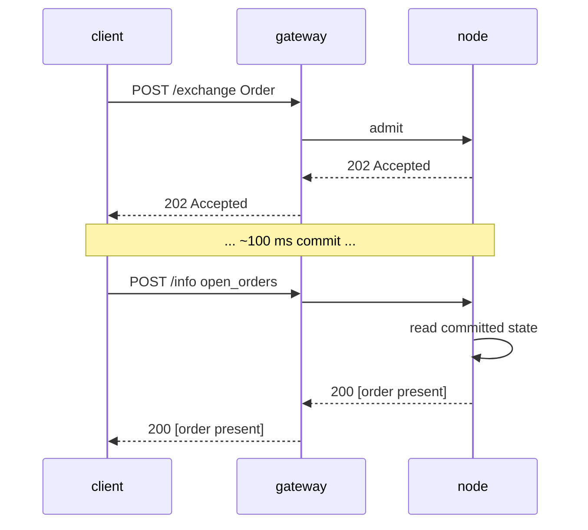

# `POST /info` — نقطة نهاية القراءة والاستعلام

:::info
**الحالة.** شكل **مستقر**. تُضاف أنواع الاستعلام بمرور الوقت؛ الغلاف ثابت ومُلتزم به.
:::

## ملخص سريع

نقطة نهاية واحدة، متعددة الأنواع. تُوزَّع الطلبات بناءً على حقل `type` في جسم الطلب. للقراءة فقط — لا تُعدِّل الحالة أبدًا، ولا تتطلب توقيعًا.

:::tip
**التقسيم حسب المنتج.** استعلامات القراءة الخاصة بأسواق العقود الدائمة موجودة في [استعلامات العقود الدائمة](./info/perpetuals.md)؛ واستعلامات القراءة الخاصة بالرمز الفوري وهامش الرمز الفوري وEarn موجودة في [استعلامات الرمز الفوري والهامش](./info/spot.md). تغطي هذه الصفحة الغلاف والاصطلاحات، وقراءات الحساب/الحوكمة/الخزينة/المُحقِّق.
:::

## عنوان URL

```
POST  https://api.<net>.mtf.exchange/info
```

| المسار | شكل الإرسال |
|------|-----------|
| `POST /info` (البوابة) | MTF-native (هذه الوثيقة) |

تخدم البوابة المسار `/info` الأصلي لـ MTF. عند تشغيل العقدة بنفسك، يُقدَّم
نفس المسار `/info` الأصلي مباشرةً على `http://localhost:8080`.

## الغلاف

الطلب:

```json
{ "type": "<query_type>", /* وسائط خاصة بالنوع */ }
```

الاستجابة:

```json
{ "type": "<query_type>", "data": { /* خاصة بالنوع */ } }
```

عند تلقّي `type` غير معروف: `400 Bad Request` مع `{"error":"unknown info type: <X>"}`.
عند تلقّي مورد غير معروف (مثل معرّف خزينة مجهول): `404 Not Found` مع `{"error":"<resource> not found"}`.

## أنواع الاستعلام

### `node_info`

هوية العقدة الثابتة وإصدار البروتوكول. لا توجد معاملات.

```json
{ "type": "node_info" }
```

الاستجابة:

```json
{
  "type": "node_info",
  "data": {
    "network":           "testnet",
    "chain_id":          114514,
    "protocol_version":  "1.0.0",
    "validator_index":   null,
    "build_commit":      "unknown",
    "version":           "0.0.1",
    "freeze_halt_supported": true,
    "uptime_seconds":    0
  }
}
```

| الحقل | النوع | الوصف |
|-------|------|-------------|
| `network` | `"devnet" \| "testnet" \| "mainnet"` | نوع الشبكة، مشتقّ من `chain_id` (`31337`=devnet، `114514`=testnet، `8964`=mainnet) |
| `chain_id` | uint64 | معرّف السلسلة EIP-712 — نفس القيمة التي يجب أن يستخدمها مجال توقيع `/exchange` |
| `protocol_version` | semver string | إصدار بروتوكول الإرسال |
| `validator_index` | uint32 \| null | فهرس هذه العقدة في مجموعة المُحقِّقين النشطة؛ **مُعلَّم:** `null` حتى يستدعي وقت التشغيل `set_validator_index` |
| `build_commit` | hex string | معرّف البناء الذي نشره المشغِّل؛ **مُعلَّم:** `"unknown"` حتى يُنشَر |
| `version` | semver string | إصدار برنامج العقدة، مُدمَج عند وقت البناء. يشترك إصدار واحد في `version` عبر ثنائياته — `build_commit` هو الميزة المميِّزة لكل بناء |
| `freeze_halt_supported` | bool | دائمًا `true` لهذا الثنائي — علامة القدرة: تلتزم العقدة بـ [`exchange_status.scheduled_freeze_height`](#exchange_status)، وتتوقف بشكل نظيف برمز خروج `77` بمجرد تثبيت ارتفاع التجميد حتى يتمكن مشرف العقدة من تبديل الإصدار التالي |
| `uptime_seconds` | uint64 | وقت تشغيل العملية؛ **مُعلَّم:** `0` حتى يستدعي وقت التشغيل `set_uptime_seconds` |

هذه حقول **خاصة بالعقدة** (هوية العقدة / وقت التشغيل)، وليست حالة توافق، لذا قد تختلف بشكل مشروع بين العقد.

### `account_state`

لقطة لكل حساب.

```json
{ "type": "account_state", "address": "0x<addr>" }
```

| الوسيط | النوع | مطلوب |
|-----|------|----------|
| `address` | hex address | نعم |

يُعيد **العنوان المجهول** (الذي لم يُرَ على السلسلة قط) **200** مع سجل مُصفَّر بالكامل
(`account_value:"0"`، `positions` / `balances.spot` فارغة)، وليس `404`.

الاستجابة (حساب ممول من الصنبور، بدون مراكز):

```json
{
  "type": "account_state",
  "data": {
    "address":         "0x00000000000000000000000000000000000ca11e",
    "account_value":   "3000",
    "free_collateral": "3000",
    "maint_margin":    "0",
    "init_margin":     "0",
    "health":          "3000",
    "tier":            "Safe",
    "mode":            "Cross",
    "pm_enabled":      false,
    "positions": [],
    "balances": {
      "usdc": "3000",
      "spot": { "MTF": { "total": "10", "hold": "0" } }
    }
  }
}
```

كل رمز في `balances.spot` هو كائن `{total, hold}` (توافق HL): `hold` هو
المبلغ المقفل خلف أمر رمز فوري معلَّق (ضمان)، و`total` هو الرصيد الكامل؛
والمبلغ القابل للإنفاق هو `total − hold`. يظهر الرمز الذي يكون محتجزًا بالكامل
أيضًا. للقراءة **الخفيفة** لمجرد مقاييس الهامش (بدون تمشيط `positions[]`، بدون
فحص الأرصدة — الاستدعاء المناسب لاستطلاع صحة التصفية)، استخدم
[`margin_summary`](#margin_summary).

يُضيف حساب بمراكز مدخلات تحت `positions`:

```json
{
  "asset":             0,
  "size":              "100000000",
  "entry":             "67000.00",
  "upnl":              "5.00",
  "isolated":          false,
  "lev":               10,
  "liq":               "61000.00",
  "roe":               "0.0075",
  "funding":           "-0.12",
  "margin":            "201.00",
  "notional":          "6705.00"
}
```

| الحقل | النوع | الوصف |
|-------|------|-------------|
| `account_value` | Decimal string | حقوق الملكية شاملةً PnL المُسوَّى، **مستوى USDC الكامل** (`"3000"` = 3000 USDC، وليس وحدات أساسية) |
| `free_collateral` | Decimal string | حقوق الملكية مطروحًا منها هامش البدء المحتجز بالمراكز المفتوحة |
| `maint_margin` | Decimal string | مجموع الهامش المُستخدَم لكل أصل (هامش الصيانة) |
| `init_margin` | Decimal string | متطلبات هامش البدء المحتجز |
| `health` | Decimal string | `account_value − maint_margin` (مُوقَّع؛ قد يكون سالبًا) |
| `tier` | enum | `"Safe"`، `"T0"`، `"T1"`، `"T2"`، `"T3"` (نطاق BOLE لـ `account_value / maint_margin`؛ `"Safe"` عند عدم وجود هامش صيانة) — انظر [التصفية المتدرجة](../../concepts/tiered-liquidation.md) |
| `mode` | enum | `"Cross"`، `"Isolated"`، `"StrictIso"` (مشتق من المراكز المفتوحة للحساب) |
| `pm_enabled` | bool | حالة الاشتراك في هامش المحفظة |
| `positions[*].asset` | uint32 | معرّف الأصل |
| `positions[*].size` | i128 string | حجم المركز الموقَّع بـ **الوحدات الخام (lots)** — `size / 10^sz_decimals` = الوحدات الكاملة (`sz_decimals` هي دقة حجم السوق، مثل 5 لـ BTC). هذا مستوى الحجم SIZE، مستقل عن مستوى السعر 1e8. |
| `positions[*].entry` | Decimal string | سعر الدخول لكل وحدة كاملة = `\|entry_notional\| / \|real size\|`، **مستوى USDC الكامل** |
| `positions[*].upnl` | Decimal string | الربح والخسارة غير المحقق = `real size × mark − signed entry_notional`، **مستوى USDC الكامل** (موقَّع) |
| `positions[*].isolated` | bool | `true` ما لم يكن المركز بهامش مشترك |
| `positions[*].lev` | uint8 | الرافعة المالية القصوى للمركز |
| `positions[*].liq` | Decimal string | السعر (USDC الكامل) الذي سيُوصِل هذا المركز وحده الحساب إلى الصيانة — تقريب مشترك لمركز واحد؛ `"0"` عندما يكون الحجم / الرافعة المالية صفرًا (لا يوجد سعر تصفية محدود) |
| `positions[*].roe` | Decimal string | `upnl / initial_margin` كسر عشري (`initial_margin = \|entry_notional\| / leverage`)؛ `"0"` عند رافعة مالية / قيمة اسمية صفرية |
| `positions[*].funding` | Decimal string | التمويل المتراكم غير المُسوَّى للجزء، **USDC الكامل** (موقَّع)؛ `real_size × (cumulative_funding − funding_entry)` — نفس الصيغة التي يدفعها تسوية التمويل |
| `positions[*].margin` | Decimal string | هامش الصيانة الذي يُسهم به الجزء، **USDC الكامل**: `\|entry_notional\| × maint_margin_ratio` |
| `positions[*].notional` | Decimal string | القيمة الاسمية للمركز عند سعر المؤشر، **USDC الكامل** (موقَّع): `real_size × mark_px` |
| `positions[*].side` | enum \| absent | **[وضع التحوط](../../concepts/hedge-mode.md) فقط** — `"long"` / `"short"`، الجزء الذي يُبلِّغ عنه هذا الكائن. **غائب في حساب أحادي الاتجاه** (مركز *صافي* واحد قد يكون حجمه سالبًا). يُعيد حساب التحوط الذي يحمل كلا الجزأين على أصل واحد **كائنَين**، أحدهما لكل جانب. |
| `balances.usdc` | Decimal string | **يعكس `account_value`** (الضمان المشترك بـ USDC)، وليس رصيد USDC فوري منفصل |
| `balances.spot` | object | أرصدة رموز الرمز الفوري غير USDC، مُفهرَسة بـ **اسم الرمز** (مثل `"MTF"`)؛ كل قيمة هي كائن `{total, hold}` (`hold` = ضمان مقفل خلف أوامر رمز فوري معلَّقة؛ القابل للإنفاق = `total − hold`)؛ فارغ إذا لم يكن هناك شيء |

### `margin_summary`

**مقاييس الهامش فقط** — `account_state` مطروحًا منه تمشيط `positions[]`
وفحص أرصدة الرمز الفوري. الاستدعاء المناسب لاستطلاع صحة التصفية المتكرر (بوت
مراقبة المخاطر، إعادة تعبئة الهامش الآلية) عندما لا يكون تفصيل المركز/الرصيد
ضروريًا. مطلوب: `address` (0x hex).

```json
{ "type": "margin_summary", "address": "0x<addr>" }
```

الاستجابة (`data`): `address`، `account_value`، `free_collateral`،
`maint_margin`، `init_margin`، `health`، `tier`، `mode`، `pm_enabled` —
دلالات الحقول مطابقة للحقول التي تحمل الاسم ذاته في
[`account_state`](#account_state) (محسوبة بواسطة المساعد المشترك، لذا لن يتعارض الاثنان أبدًا).

### `vault_state`

لقطة لكل خزينة.

```json
{ "type": "vault_state", "vault": "0x<vault_addr>" }
```

الاستجابة:

```json
{
  "type": "vault_state",
  "data": {
    "vault":              "0x<addr>",
    "name":               "MFlux Conservative",
    "tvl":             "10000000000",
    "share_price":     "10500000",
    "depositor_count":    142,
    "high_water_mark": "10500000",
    "performance_fee_bps":1000,
    "lock_period_ms":     86400000,
    "strategy":           "MarketNeutral"
  }
}
```

### `staking_state`

```json
{ "type": "staking_state", "address": "0x<addr>" }
```

الاستجابة:

```json
{
  "type": "staking_state",
  "data": {
    "address":         "0x<addr>",
    "total_staked": "1000000000",
    "delegations": [
      {
        "validator":         "0x<val_addr>",
        "amount":         "500000000",
        "since_ts":          1735000000000,
        "pending_rewards":"1000000"
      }
    ],
    "pending_unstakes": [
      { "amount": "200000000", "matures_at_ts": 1735780000000 }
    ]
  }
}
```

### `fee_schedule`

```json
{ "type": "fee_schedule" }
```

الاستجابة:

```json
{
  "type": "fee_schedule",
  "data": {
    "tiers": [
      { "volume_30d": "0",         "maker_bps": "2.0", "taker_bps": "5.0" },
      { "volume_30d": "100000000", "maker_bps": "1.5", "taker_bps": "4.5" },
      { "volume_30d": "1000000000","maker_bps": "1.0", "taker_bps": "4.0" }
    ],
    "builder_rebate_bps": "0.2",
    "burn_ratio":         "0.30",
    "referrer_share_bps": "1.0"
  }
}
```

أسعار الرسوم هي **نقاط أساس** عشرية كنصوص (`"2.0"` = 2 نقطة أساس = 0.02%). `burn_ratio` هو كسر عشري (`"0.30"` = 30% من الرسوم تُحرَق). انظر [الرسوم](../../concepts/fees.md).

### `open_orders`

الأوامر المعلَّقة لكل حساب عبر جميع دفاتر العقود الدائمة.

```json
{ "type": "open_orders", "account_id": 42 }
```

| الوسيط | النوع | مطلوب |
|-----|------|----------|
| `account_id` | uint64 | أحد `account_id` / `address` |
| `address` | hex address | أحد `account_id` / `address` |

إما `account_id` (u64) أو `address` (0x hex) لتحديد الحساب. عندما يُوفِّر
الطلب `account_id`، يُعاد إرساله في `data.account_id`.

الاستجابة:

```json
{
  "type": "open_orders",
  "data": {
    "address":    "0x<addr>",
    "account_id": 42,
    "orders": [
      {
        "oid":          12345,
        "market_id":    0,
        "side":         "bid",
        "px":        "99000",
        "size":      "700",
        "cloid":        "0x000000000000000000000000cafef00d",
        "inserted_at_ms": 1700000000000
      }
    ]
  }
}
```

| الحقل | النوع | الوصف |
|-------|------|-------------|
| `address` | hex address | عنوان الحساب المُحلَّل |
| `account_id` | uint64 | يُعاد إرساله فقط عندما استخدم الطلب `account_id` |
| `orders[*].oid` | uint64 | معرّف الأمر على الخادم |
| `orders[*].market_id` | uint32 | معرّف الأصل / السوق الذي يرتكز عليه الأمر |
| `orders[*].side` | `"bid"` / `"ask"` | جانب الأمر |
| `orders[*].px` | i128 string | سعر الارتكاز، نص عشري بالفاصلة الثابتة |
| `orders[*].size` | u128 string | الحجم المتبقي، نص عشري بالفاصلة الثابتة |
| `orders[*].cloid` | hex string \| null | معرّف أمر العميل الذي وُضع به الأمر (`0x` + 32 حرف hex)؛ `null` عندما لم يُحدِّد الأمر أيًا |
| `orders[*].inserted_at_ms` | uint64 | طابع زمني للإيداع / الإدراج (توافق ms) |

### `user_fills`

تاريخ التنفيذ لكل حساب، يُقدَّم مباشرةً من الحالة المُثبَّتة على العقدة (حلقة
تنفيذ محدودة لكل حساب مطوية في AppHash — بدون مُفهرِس خارجي).

```json
{ "type": "user_fills", "account_id": 42 }
```

| الوسيط | النوع | مطلوب | الوصف |
|-----|------|----------|-------------|
| `account_id` | uint64 | أحد `account_id` / `address` | معرّف الحساب الداخلي |
| `address` | hex address | أحد `account_id` / `address` | عنوان الحساب |
| `limit` | uint32 | لا | تحديد عدد السجلات **الأحدث** المُعادة؛ غائب / `0` ⇒ الحلقة الكاملة |

إما `account_id` (u64) أو `address` (0x hex) لتحديد الحساب. عندما يُوفِّر
الطلب `account_id`، يُعاد إرساله في `data.account_id`.

الاستجابة:

```json
{
  "type": "user_fills",
  "data": {
    "address":    "0x<addr>",
    "account_id": 42,
    "fills": [
      {
        "coin":           0,
        "side":           "B",
        "px":             "67042.50",
        "sz":             "0.125",
        "time":           1700000000555,
        "oid":            12345,
        "tid":            90123,
        "fee":            "4.19",
        "closed_pnl":     "0",
        "dir":            "Open Long",
        "start_position": "0",
        "block":          562,
        "hash":           "0x2315b79b9e82c2deb279a59448bf7841f3767d30d874e5b544d75bb9fd1e9b0c"
      }
    ]
  }
}
```

تُرتَّب السجلات من الأقدم إلى الأحدث (الأحدث في النهاية). الحلقة محدودة، لذا هذه
نافذة حديثة وليست كامل التاريخ. يُعيد حساب بدون تنفيذات
`"fills": []`.

| الحقل | النوع | الوصف |
|-------|------|-------------|
| `address` | hex address | عنوان الحساب المُحلَّل |
| `account_id` | uint64 | يُعاد إرساله فقط عندما استخدم الطلب `account_id` |
| `fills[*].coin` | uint32 | معرّف الأصل / السوق الذي نُفِّذ عليه التنفيذ |
| `fills[*].side` | `"B"` / `"A"` | رمز جانب هذا الجزء — `"B"` = شراء/عرض، `"A"` = بيع/طلب |
| `fills[*].px` | Decimal string | سعر التنفيذ، **USDC عشري** (قابل للقراءة البشرية) |
| `fills[*].sz` | Decimal string | الحجم المنفَّذ، **الوحدات الأساسية** (وحدة كاملة) |
| `fills[*].time` | uint64 | الطابع الزمني للتنفيذ (توافق ms) |
| `fills[*].oid` | uint64 | معرّف أمر هذا الطرف |
| `fills[*].tid` | uint64 | معرّف الصفقة الحتمي (مشترك بين كلا جزأي الطباعة) |
| `fills[*].fee` | Decimal string | الرسوم التي دفعها هذا الطرف، **USDC عشري** |
| `fills[*].closed_pnl` | Decimal string | الربح والخسارة المحقق على الجزء المغلق، **USDC عشري** (موقَّع) |
| `fills[*].dir` | string | تسمية الاتجاه، مثل `"Open Long"`، `"Close Short"`، `"Open Short"`، `"Close Long"` |
| `fills[*].start_position` | Decimal string | حجم الجزء الموقَّع قبل التنفيذ، **الوحدات الأساسية** (وحدة كاملة، موقَّع) |
| `fills[*].block` | uint64 | ارتفاع الكتلة المُثبَّتة التي استقرّ فيها التنفيذ (محدّد على السلسلة) |
| `fills[*].hash` | hex string | هاش المعاملة للأمر الأصلي، hex مسبوق بـ `0x` — يُتيح تتبع التنفيذ على السلسلة |

### `user_fills_by_time`

مثل [`user_fills`](#user_fills)، لكنه مُصفَّى وفق نافذة زمنية محددة بناءً على حقل `time` الخاص بكل سجل. شكل سجل التنفيذ مطابق.

```json
{ "type": "user_fills_by_time", "address": "0x<addr>", "start_time": 1700000000000, "end_time": 1700003600000 }
```

| الوسيط | النوع | مطلوب | الوصف |
|-----|------|----------|-------------|
| `account_id` | uint64 | أحد `account_id` / `address` | معرّف الحساب الداخلي |
| `address` | hex address | أحد `account_id` / `address` | عنوان الحساب |
| `start_time` | uint64 | لا | بداية النافذة الزمنية (بالميلي‌ثانية، شاملة)؛ يُصفَّى بناءً على حقل `time` للتنفيذ. إذا غاب، تكون الحدود السفلى مفتوحة |
| `end_time` | uint64 | لا | نهاية النافذة الزمنية (بالميلي‌ثانية، شاملة). إذا غاب، تكون الحدود العليا مفتوحة |

الاستجابة:

```json
{
  "type": "user_fills_by_time",
  "data": {
    "address":    "0x<addr>",
    "account_id": 42,
    "start_time": 1700000000000,
    "end_time":   1700003600000,
    "fills": [ /* same record shape as user_fills */ ]
  }
}
```

| الحقل | النوع | الوصف |
|-------|------|-------------|
| `address` | hex address | عنوان الحساب بعد الحل |
| `account_id` | uint64 | يُعاد إرساله فقط إذا استخدم الطلب `account_id` |
| `start_time` | uint64 \| null | بداية النافذة المُعادة (`null` إذا لم يُحدَّد) |
| `end_time` | uint64 \| null | نهاية النافذة المُعادة (`null` إذا لم يُحدَّد) |
| `fills` | array | سجلات التنفيذ ضمن النافذة (بنفس شكل سجل التنفيذ في [`user_fills`](#user_fills))، مرتبةً من الأقدم إلى الأحدث |

### `order_status`

البحث في دورة حياة أمر منفرد باستخدام `oid` (معرّف الأمر من طرف الخادم) **أو** `cloid` (معرّف الأمر من طرف العميل). يقرأ الدفاتر النشطة، وسجل الأوامر المشروطة، وحلقة التنفيذات المُسجَّلة — وهي حالة ملتزمة بالكامل على العقدة.

```json
{ "type": "order_status", "oid": 12345 }
```

أو باستخدام معرّف الأمر من طرف العميل:

```json
{ "type": "order_status", "cloid": "0x000000000000000000000000cafef00d" }
```

| الوسيط | النوع | مطلوب | الوصف |
|-----|------|----------|-------------|
| `oid` | uint64 | أحد `oid` / `cloid` | معرّف الأمر من طرف الخادم |
| `cloid` | hex string | أحد `oid` / `cloid` | معرّف الأمر من طرف العميل — `0x` + 32 حرف سداسي عشري |

إذا لم يتوفر أيٌّ منهما، يُعاد `400 {"error":"missing field oid or cloid"}`. أما `cloid` المُشوَّه فيُعاد له `400`. يتوقف البحث عند أول نتيجة، وفق الترتيب التالي: أمر رابض نشط ← أمر مشروط منتظر ← تنفيذ نهائي ← غير معروف.

يميّز `data.status` بين الفروع:

`"resting"` — أمر نشط مفتوح في دفتر عقود آجلة أو نقدية:

```json
{
  "type": "order_status",
  "data": {
    "status": "resting",
    "order": {
      "oid":            12345,
      "market_id":      0,
      "side":           "bid",
      "px":             "67000",
      "size":           "700",
      "inserted_at_ms": 1700000000000,
      "cloid":          "0x000000000000000000000000cafef00d"
    }
  }
}
```

`"triggered"` — أمر جني ربح/وقف خسارة/دخول منتظر في انتظار تجاوز سعر العلامة:

```json
{
  "type": "order_status",
  "data": {
    "status": "triggered",
    "trigger": {
      "oid":              12345,
      "market_id":        0,
      "side":             "ask",
      "trigger_px":       "66000",
      "trigger_above":    false,
      "size":             "700",
      "registered_at_ms": 1700000000000,
      "fired":            false
    }
  }
}
```

`"filled"` — أحدث تنفيذ مطابق في حلقة التنفيذات الخاصة بالحساب (الكائن `fill` له نفس شكل سجل [`user_fills`](#user_fills)):

```json
{
  "type": "order_status",
  "data": {
    "status": "filled",
    "fill": { /* same shape as a user_fills fill record */ }
  }
}
```

`"unknown"` — لم يُرصَد قط، أو جرى حذفه من الحلقة المحدودة (يُحسم هنا أيضاً الاستعلام بـ `cloid` فقط الذي لا يُطابق أي أمر رابض أو مشروط، إذ إن سجل الأوامر المشروطة وحلقة التنفيذات مفهرَسان بـ `oid`):

```json
{ "type": "order_status", "data": { "status": "unknown" } }
```

| الحقل | النوع | الوصف |
|-------|------|-------------|
| `status` | `"resting" \| "triggered" \| "filled" \| "unknown"` | حالة دورة الحياة بعد الحل |
| `order` | object | موجود عند `"resting"` — `oid`، `market_id`، `side` (`"bid"`/`"ask"`)، `px` / `size` (سلاسل عشرية ذات فاصلة ثابتة)، `inserted_at_ms`، `cloid` (hex \| null) |
| `trigger` | object | موجود عند `"triggered"` — `oid`، `market_id`، `side`، `trigger_px` / `size` (سلاسل عشرية ذات فاصلة ثابتة)، `trigger_above` (منطقي: يُطلَق عند تجاوز سعر العلامة للأعلى)، `registered_at_ms`، `fired` (منطقي) |
| `fill` | object | موجود عند `"filled"` — سجل التنفيذ المطابق (انظر [`user_fills`](#user_fills)) |

### `block_info`

بيانات تعريفية للكتلة المُلتزَم بها. لا توجد وسيطات مطلوبة (`height` مقبول لكن يُتجاهل — تحتفظ حالة القراءة بآخر سياق مُلتزَم فحسب).

```json
{ "type": "block_info" }
```

الاستجابة:

```json
{
  "type": "block_info",
  "data": {
    "height":       562,
    "round":        562,
    "epoch":        0,
    "timestamp_ms": 1780475491562,
    "block_hash":   "0x2315b79b9e82c2deb279a59448bf7841f3767d30d874e5b544d75bb9fd1e9b0c"
  }
}
```

| الحقل | النوع | الوصف |
|-------|------|-------------|
| `height` | uint64 | ارتفاع آخر كتلة مُلتزَم بها |
| `round` | uint64 | جولة الإجماع لتلك الكتلة |
| `epoch` | uint64 | الحقبة الحالية |
| `timestamp_ms` | uint64 | طابع زمني للكتلة (ميلي‌ثانية توافق) |
| `block_hash` | hex string (32 bytes) | هاش الكتلة المُلتزَم به الفعلي (مُضمَّن الآن في حالة القراءة — لم يعد مُعبَّأً بالأصفار) |

### `agents`

محافظ الوكلاء / واجهات API المعتمدة لحساب معين.

```json
{ "type": "agents", "account_id": 42 }
```

| الوسيط | النوع | مطلوب |
|-----|------|----------|
| `account_id` | uint64 | أحد `account_id` / `address` |
| `address` | hex address | أحد `account_id` / `address` |

الاستجابة:

```json
{
  "type": "agents",
  "data": {
    "address":    "0x<master>",
    "account_id": 42,
    "agents": [
      { "agent": "0x<agent_addr>", "name": "trading-bot", "expires_at_ms": 1700000500000 }
    ]
  }
}
```

| الحقل | النوع | الوصف |
|-------|------|-------------|
| `address` | hex address | عنوان الحساب الرئيسي بعد الحل |
| `account_id` | uint64 | يُعاد إرساله فقط إذا استخدم الطلب `account_id` |
| `agents[*].agent` | hex address | عنوان محفظة الوكيل المعتمدة |
| `agents[*].name` | string \| null | تسمية الوكيل المُعيَّنة عند الاعتماد؛ `null` إذا لم تُحدَّد |
| `agents[*].expires_at_ms` | uint64 \| null | تاريخ انتهاء صلاحية اعتماد الوكيل (ميلي‌ثانية توافق)؛ `null` إذا كان الاعتماد لا ينتهي |

### `sub_accounts`

الحسابات الفرعية لحساب معين.

```json
{ "type": "sub_accounts", "account_id": 42 }
```

| الوسيط | النوع | مطلوب |
|-----|------|----------|
| `account_id` | uint64 | أحد `account_id` / `address` |
| `address` | hex address | أحد `account_id` / `address` |

الاستجابة:

```json
{
  "type": "sub_accounts",
  "data": {
    "address":    "0x<parent>",
    "account_id": 42,
    "sub_accounts": [
      { "index": 0, "address": "0x<sub_addr>" }
    ]
  }
}
```

| الحقل | النوع | الوصف |
|-------|------|-------------|
| `address` | hex address | عنوان الحساب الأصل بعد الحل |
| `account_id` | uint64 | يُعاد إرساله فقط إذا استخدم الطلب `account_id` |
| `sub_accounts[*].index` | uint32 | فهرس الحساب الفرعي تحت الحساب الأصل |
| `sub_accounts[*].address` | hex address | عنوان الحساب الفرعي |

### `protocol_metrics`

مُجمِّعات ومُعدَّات على مستوى البروتوكول. لا توجد معاملات. كل حقل يُقرأ مباشرةً من حالة `Exchange` المُلتزَم بها (العدادات، وصناديق الرسوم، واحتياطيات BOLE، والتحصيص) — لا يُحسَب أي شيء من محرك المطابقة أو أوراكل الأسعار، لذا يُعيد التشغيل المتكرر النتيجة ذاتها بدقة.

```json
{ "type": "protocol_metrics" }
```

الاستجابة:

```json
{
  "type": "protocol_metrics",
  "data": {
    "counters": {
      "total_orders":               1000,
      "total_fills":                750,
      "total_liquidations":         3,
      "total_deposits":             40,
      "total_withdrawals":          12,
      "total_vault_transfers":      0,
      "total_sub_account_transfers":0
    },
    "fee_pools": {
      "burned":         "8000",
      "mflux_vault":    "0",
      "validator_pool": "1000",
      "treasury":       "1000",
      "burned_mtf":     "55"
    },
    "insurance_fund_total":    "750",
    "treasury_backstop_total": "9000",
    "bole_pool": {
      "total_deposits":  "20000",
      "shortfall_total": "7"
    },
    "open_interest_total_1e8": "1500000",
    "staking": {
      "total_stake":   "100",
      "n_validators":  1,
      "n_active":      1,
      "n_jailed":      0,
      "current_epoch": 4
    },
    "counts": {
      "n_markets":             1,
      "n_spot_pairs":          5,
      "n_user_vaults":         0,
      "n_accounts_with_state": 12
    }
  }
}
```

| الحقل | النوع | الوصف |
|-------|------|-------------|
| `counters.total_orders` | uint64 | إجمالي الأوامر المقبولة منذ البدء |
| `counters.total_fills` | uint64 | إجمالي التنفيذات منذ البدء (الإشارة الوحيدة المُفصَّلة للصفقات — **عدد**، لا قيمة اسمية) |
| `counters.total_liquidations` | uint64 | إجمالي عمليات التصفية منذ البدء |
| `counters.total_deposits` / `total_withdrawals` | uint64 | إجمالي عمليات الإيداع / السحب منذ البدء |
| `counters.total_vault_transfers` | uint64 | إجمالي تحويلات الإيداع/السحب للخزينة منذ البدء |
| `counters.total_sub_account_transfers` | uint64 | إجمالي تحويلات الحسابات الفرعية منذ البدء |
| `fee_pools.burned` | Decimal string | إجمالي USDC المُوجَّه تراكمياً لإعادة الشراء والإحراق (وحدات USDC كاملة) |
| `fee_pools.mflux_vault` | Decimal string | تراكم رسوم خزينة MFlux (`"0"` — حصة الخزينة صفرية) |
| `fee_pools.validator_pool` | Decimal string | تراكم رسوم صندوق المُحقِّقين تراكمياً (وحدات USDC كاملة) |
| `fee_pools.treasury` | Decimal string | تراكم رسوم الخزانة تراكمياً (وحدات USDC كاملة) |
| `fee_pools.burned_mtf` | Decimal string | إجمالي MTF المُسحَب من قِبَل منفّذ إعادة الشراء تراكمياً |
| `insurance_fund_total` | Decimal string | Σ احتياطيات `bole_pool.insurance_fund` لكل أصل (وحدات USDC كاملة) |
| `treasury_backstop_total` | Decimal string | Σ احتياطيات `bole_pool.treasury_backstop` لكل أصل (وحدات USDC كاملة) |
| `bole_pool.total_deposits` | Decimal string | إجمالي ودائع صندوق إقراض BOLE (وحدات USDC كاملة) |
| `bole_pool.shortfall_total` | Decimal string | Σ الديون المعدومة المتبقية الموقوفة بعد سلسلة: ADL ← التأمين ← الخزانة |
| `open_interest_total_1e8` | u128 string | Σ الفائدة المفتوحة لكل سوق، **مستوى الدفتر 1e8** (مُصنَّف `_1e8`، لا وحدات USDC كاملة) |
| `staking.total_stake` | Decimal string | إجمالي MTF المُحصَّص (وحدات MTF كاملة) |
| `staking.n_validators` | uint64 | المُحقِّقون في المجموعة المُلتزَم بها |
| `staking.n_active` | uint64 | المُحقِّقون النشطون في هذه الحقبة |
| `staking.n_jailed` | uint64 | المُحقِّقون المُقيَّدون حالياً |
| `staking.current_epoch` | uint64 | حقبة التحصيص الحالية |
| `counts.n_markets` | uint64 | أسواق العقود الآجلة الدائمة المسجَّلة MIP-3 (`mip3_market_specs`) |
| `counts.n_spot_pairs` | uint64 | أزواج النقدية المسجَّلة (`mip3_spot_pair_specs`) |
| `counts.n_user_vaults` | uint64 | خزائن المستخدمين المسجَّلة |
| `counts.n_accounts_with_state` | uint64 | الحسابات التي لها حالة مستخدم مُلتزَم بها |

:::info
**لا يوجد رقم تراكمي لإجمالي حجم التداول.** يتتبع المحرك **حجم الرسوم لآخر 30 يوماً** لكل مستخدم (انظر [`user_fees`](#user_fees)) وعدد التنفيذات منذ البدء (`counters.total_fills`) — إلا أنه **لا يوجد مُجمِّع مُشغَّل مُلتزَم به على مستوى البروتوكول للحجم بالدولار**، لذا تتعمد هذه القراءة حذفه بدلاً من الإيحاء بوجود مجموع إجمالي لحجم التداول. العدادات هي أرقام نشاط تراكمية، لا أموال.
:::

State source: `locus.{counters, fee_tracker.fee_distribution, bole_pool}` + `c_staking` + registry sizes.

### `user_fees`

مستوى الرسوم / الحجم لكل حساب. مطلوب: `account_id` (u64) **أو** `address` (سداسي عشري بـ 0x).

```json
{ "type": "user_fees", "account_id": 42 }
```

| الوسيط | النوع | مطلوب |
|-----|------|----------|
| `account_id` | uint64 | أحد `account_id` / `address` |
| `address` | hex address | أحد `account_id` / `address` |

إذا لم يتوفر أيٌّ منهما، يُعاد `400`. أما الحساب الذي لا يملك حالة رسوم فيُعاد له **200** مع أحجام صفرية ونقاط الأساس للمستوى الأساسي — النمط الصفري المعتمد.

الاستجابة:

```json
{
  "type": "user_fees",
  "data": {
    "address":          "0x<addr>",
    "account_id":       42,
    "taker_volume_30d": "1250000",
    "maker_volume_30d": "800000",
    "vip_tier":         2,
    "mm_tier":          1,
    "referrer":         "0x<referrer>",
    "referrer_credit":  "420",
    "maker_bps":        1,
    "taker_bps":        3
  }
}
```

| الحقل | النوع | الوصف |
|-------|------|-------------|
| `address` | hex address | عنوان الحساب بعد الحل |
| `account_id` | uint64 | يُعاد إرساله فقط إذا استخدم الطلب `account_id` |
| `taker_volume_30d` | Decimal string | حجم المُتلقِّي المتجدد لآخر 30 يوماً (وحدات USDC كاملة) |
| `maker_volume_30d` | Decimal string | حجم صانع السوق المتجدد لآخر 30 يوماً (وحدات USDC كاملة) |
| `vip_tier` | uint | مؤشر مستوى VIP لكل مستخدم مُلتزَم به؛ `0` عند عدم التتبع |
| `mm_tier` | uint | مؤشر مستوى صانع السوق لكل مستخدم مُلتزَم به؛ `0` عند عدم التتبع |
| `referrer` | hex address \| null | المُحيل لهذا الحساب إن وُجد، وإلا `null` |
| `referrer_credit` | Decimal string | Σ الخصم المتراكم *لـ* هذا العنوان بصفته مُحيلاً (وحدات USDC كاملة) |
| `maker_bps` | uint | نقاط الأساس **الفعلية** لرسوم صانع السوق، مُحسوبة من جدول مستويات حجم [`fee_schedule`](#fee_schedule) المُلتزَم به وفق حجم صانع السوق لآخر 30 يوماً لهذا الحساب |
| `taker_bps` | uint | نقاط الأساس **الفعلية** لرسوم المُتلقِّي، مُحسوبة من الجدول المُلتزَم به وفق حجم المُتلقِّي لآخر 30 يوماً لهذا الحساب |

تُحسَب `maker_bps` / `taker_bps` الفعلية لكل جانب من جدول مستويات الحجم المُلتزَم به ([`fee_schedule`](#fee_schedule)) — معدل صانع السوق عند حجمه، ومعدل المُتلقِّي عند حجمه — باستخدام نفس الروتين المُستخدَم في مسار التسوية، مما يعني أن نقاط الأساس المُبلَّغ عنها تطابق ما يُحسَب على الحساب فعلاً. تجاوز المواصفة لكل سوق وفق MIP-3 **غير مُنعكَس هنا**: هذا هو المعدل الأساسي عبر جميع الأسواق. يظل `vip_tier` / `mm_tier` مؤشرَي المستوى لكل مستخدم المُلتزَم بهما وهما إشارة منفصلة، تُعرَض إلى جانب نقاط الأساس الفعلية.

State source: `locus.fee_tracker.{user_to_taker_volume_30d, user_to_maker_volume_30d, user_to_vip_tier, user_to_mm_tier, referee_to_referrer, referrer_credit}` + the committed volume-tier ladder.

### `staking_apr`

معدل إصدار التخزين السنوي الفعلي مع مدخلاته المُثبَّتة. لا يتطلب أي معاملات.

```json
{ "type": "staking_apr" }
```

الاستجابة:

```json
{
  "type": "staking_apr",
  "data": {
    "total_stake":             "1000000",
    "effective_apr":           "0.08",
    "effective_apr_bps":       "800",
    "governance_rate_bps":     800,
    "emission_floor_stake":    "50000000",
    "n_active_validators":     1,
    "current_epoch":           2,
    "is_gross_pre_commission": true
  }
}
```

| الحقل | النوع | الوصف |
|-------|------|-------------|
| `total_stake` | Decimal string | إجمالي MTF المُخزَّن (بالوحدة الكاملة) |
| `effective_apr` | Decimal string | معدل الإصدار السنوي الذي يطبّقه تأثير مكافأة بداية الكتلة فعلياً (كسر) |
| `effective_apr_bps` | Decimal string | `effective_apr × 10_000`، مُقتطَع |
| `governance_rate_bps` | uint | `reward_rate_bps` المُحدَّد بالحوكمة (مُثبَّت) — انظر العلامة |
| `emission_floor_stake` | uint string | حد التخزين الأدنى (`50M` MTF)، يكون المعدل ثابتاً دونه |
| `n_active_validators` | uint64 | المُحقِّقون النشطون في هذه الحقبة |
| `current_epoch` | uint64 | حقبة التخزين الحالية |
| `is_gross_pre_commission` | bool | دائماً `true` — معدل العائد إجمالي، قبل عمولة كل مُحقِّق |

`effective_apr` هو المنحنى الذي يشتق منه تأثير مكافأة بداية الكتلة:

```text
effective_apr = 0.08 × √( 50M / max(total_stake, 50M) )
```

أي **8% ثابتة** عند/دون 50M MTF مُخزَّن، تتناقص بنسبة ∝ 1/√stake فوق ذلك (مثلاً:
إجمالي التخزين = 200M ⇒ 4× الحد الأدنى ⇒ النسبة 1/4 ⇒ √ = 1/2 ⇒ 4% / 400 bps).

:::warning
**`governance_rate_bps` مُثبَّت لكنه لا يُستهلك من قِبَل تأثير المكافأة.** يشتق
تأثير المكافأة معدل الدفع من **منحنى التخزين** أعلاه، لا من
`reward_rate_bps`. يُعرض كلاهما لإتاحة رصد التباين بدلاً من إخفائه — معدل العائد
الفعلي للدفع هو `effective_apr`، لا `governance_rate_bps`.
وقيمة `effective_apr` هي معدل **إصدار إجمالي** (`is_gross_pre_commission: true`):
صافي معدل عائد المُفوِّض الفردي هو `effective_apr × (1 − commission)`.
:::

مصدر الحالة: `c_staking.{total_stake, reward_rate_bps, current_epoch, validators}` + منحنى الإصدار.

### `oracle_sources`

مجموعة مصدر الأوراكل الفرعية المُثبَّتة لكل سوق. يُحلَّل السوق بواسطة `asset_id`
(u32) **أو** `coin` (الرمز).

```json
{ "type": "oracle_sources", "asset_id": 0 }
```

أو بالاسم:

```json
{ "type": "oracle_sources", "coin": "BTC" }
```

| المعامل | النوع | مطلوب |
|-----|------|----------|
| `asset_id` | uint32 | أحد `asset_id` / `coin` |
| `coin` | symbol | أحد `asset_id` / `coin` |

غياب كليهما ← `400`؛ سوق غير معروف ← `404 {"error":"market not found"}`.

الاستجابة:

```json
{
  "type": "oracle_sources",
  "data": {
    "asset_id":          0,
    "name":              "BTC",
    "oracle_set":        true,
    "source_count":      3,
    "num_sources":       10,
    "enabled_sources":   [0, 2, 5],
    "subset_mask":       37,
    "weights_committed": false
  }
}
```

| الحقل | النوع | الوصف |
|-------|------|-------------|
| `asset_id` | uint32 | معرّف الأصل المُردَّد / المُحلَّل |
| `name` | string | رمز السوق |
| `oracle_set` | bool | هل أكّد المُنشئ صراحةً المجموعة الفرعية عبر `SetOracle` |
| `source_count` | uint64 | عدد المصادر الممكَّنة (عدد البتات المضبوطة في القناع) |
| `num_sources` | uint8 | إجمالي فتحات المصادر (`NUM_ORACLE_SOURCES = 10`) |
| `enabled_sources` | uint8[] | مؤشرات البتات المضبوطة في قناع المجموعة الفرعية (فتحات المصادر الممكَّنة) |
| `subset_mask` | uint16 | `oracle_source_subset_mask` المُثبَّت ذو 10 بتات (البتة `i` مضبوطة ⇒ المصدر `i` يغذّي المتوسط) |
| `weights_committed` | bool | دائماً `false` — الأوزان لكل مصدر غير مُثبَّتة (انظر العلامة) |

:::warning
**الموجود على السلسلة فقط هو القناع الرقمي — أسماء المنصات والأوزان غير مُثبَّتة**
(`weights_committed: false`). هويات المصادر العشرة محددة بروتوكولياً خارج السلسلة،
وأوزانها محددة بروتوكولياً، لذا تحمل الحالة المُثبَّتة قناع المجموعة الفرعية فقط. تُعرض هذه القراءة
`enabled_sources` كـ **مؤشرات بتات**، لا كمنصات مُسمَّاة، ولا تُصدر قائمة أوزان لكل منصة
بدلاً من اختلاقها.
:::

مصدر الحالة: `mip3_market_specs[asset].{oracle_source_subset_mask, oracle_set}`.

## أنواع استعلامات الحوكمة

سطح الحوكمة على السلسلة: آلية التصويت الحية (`gov_state`)،
عرض المقترحات المعلقة عبر الفئات مع مسافة النصاب (`gov_proposals`)، ومسار مراجعة
المعاملات المُفعَّلة (`gov_history`). تقرأ جميعها الحالة المُثبَّتة لـ `Exchange`؛ نفس
غلاف `{type, data}`. نصاب الحصة ⅔ (موزون بالحصة)؛ يُستبعد المُحقِّقون **المُعاقَبون**
من مقام الحصة النشطة وكل إحصاء، متوافقاً مع فحص التفعيل على السلسلة.

### `gov_state`

سطح الحوكمة الحي — سياق نصاب الحصة، جولات `voteGlobal` المعلقة،
مقترحات `govPropose` المفتوحة، والقيمة الحالية لكل معامل محكوم.
لا يتطلب أي معاملات.

```json
{ "type": "gov_state" }
```

الاستجابة:

```json
{
  "type": "gov_state",
  "data": {
    "total_stake":  "150000",
    "quorum_bps":   6667,
    "quorum_stake": "100005",
    "pending_vote_global": [
      {
        "kind":          "set_reward_rate_bps",
        "kind_id":       3,
        "votes": [
          { "validator": "0x<val>", "value": "900", "stake": "60000", "submitted_at_ms": 1700000000000 }
        ],
        "leading_stake": "60000"
      }
    ],
    "open_proposals": [
      { "proposal_id": 5, "voters": 2, "aye_stake": "90000", "nay_stake": "30000" }
    ],
    "params": {
      "reward_rate_bps":   800,
      "default_taker_bps": 5,
      "default_maker_bps": 2,
      "burn_bps":          8000
    },
    "oracle_weight_overrides": [
      { "asset_id": 0, "weights": [1000, 1000, 1000] }
    ]
  }
}
```

| الحقل | النوع | الوصف |
|-------|------|-------------|
| `total_stake` | decimal string | Σ الحصة عبر جميع المُحقِّقين |
| `quorum_bps` | uint | عتبة نصاب ⅔ بالنقاط الأساسية (`6667`) |
| `quorum_stake` | decimal string | الحصة المطلوبة للتفعيل (`total_stake × quorum_bps / 10000`) |
| `pending_vote_global[*].kind` | string | اسم المعامل المُحكَّم (snake_case)، مثلاً `"set_reward_rate_bps"` |
| `pending_vote_global[*].kind_id` | uint | معرّف النوع الرقمي |
| `pending_vote_global[*].votes[*].validator` | hex address | المُحقِّق المُصوِّت |
| `pending_vote_global[*].votes[*].value` | decimal string | القيمة المقترحة المُفكَّكة (hex `0x…` إذا كانت الحمولة مُبهَمة) |
| `pending_vote_global[*].votes[*].stake` | decimal string | حصة المُصوِّت |
| `pending_vote_global[*].votes[*].submitted_at_ms` | uint64 | طابع زمني لتقديم التصويت (ملي ثانية إجماع) |
| `pending_vote_global[*].leading_stake` | decimal string | أكبر حصة مُجمَّعة خلف حمولة واحدة في هذه الجولة |
| `open_proposals[*].proposal_id` | uint64 | معرّف جولة govPropose |
| `open_proposals[*].voters` | uint64 | عدد الأصوات المُدلى بها |
| `open_proposals[*].aye_stake` / `nay_stake` | decimal string | الحصة المُصوِّتة بنعم / لا |
| `params` | object | القيمة الحالية لكل معامل محكوم (كل منها قيمة مُثبَّتة مفردة) |
| `oracle_weight_overrides[*].asset_id` | uint32 | الأصل الذي يملك تجاوز وزن أوراكل مخصصاً |
| `oracle_weight_overrides[*].weights` | uint[] | الأوزان المُثبَّتة لكل مصدر للأصل |

يحمل كائن `params` مجموعة المعاملات المُحكَّمة الكاملة التي تستطيع آلية التصويت تحريكها
(توزيع الرسوم، ضبط التخزين، حدود MIP-3، حدود المخاطر، علامات spot /
EVM / bridge، …)؛ كل منها القيمة المُثبَّتة الحية.

### `gov_proposals`

كل مقترح حوكمة **نشط** عبر **جميع** فئات التصويت (ليس فقط
`voteGlobal`)، مع إحصاء الحصة الحية لكل حمولة والمسافة إلى نصاب ⅔.
عرض "ما يُصوَّت عليه الآن، وكم اقترب من النصاب" عبر الفئات. لا يتطلب أي معاملات.

```json
{ "type": "gov_proposals" }
```

الاستجابة:

```json
{
  "type": "gov_proposals",
  "data": {
    "total_active_stake":  "120000",
    "quorum_bps":          6667,
    "quorum_needed_stake": "80004",
    "proposals": [
      {
        "round":         1000003,
        "category":      "vote_global",
        "sub_id":        3,
        "proposer":      "0x<val>",
        "created_at_ms": 1700000000000,
        "voter_count":   1,
        "leading_stake": "60000",
        "meets_quorum":  false,
        "payloads": [
          { "payload_hex": "0392…", "stake": "60000", "meets_quorum": false }
        ],
        "proposal": {
          "kind":         3,
          "kind_name":    "set_reward_rate_bps",
          "value":        "900",
          "title":        "Raise staking rewards",
          "proposer":     "0x<val>",
          "opened_at_ms": 1700000000000
        }
      }
    ]
  }
}
```

| الحقل | النوع | الوصف |
|-------|------|-------------|
| `total_active_stake` | decimal string | Σ حصة المُحقِّقين غير المُعاقَبين (مقام النصاب) |
| `quorum_bps` | uint | عتبة نصاب ⅔ بالنقاط الأساسية (`6667`) |
| `quorum_needed_stake` | decimal string | الحصة التي يجب أن تبلغها حمولة واحدة للتفعيل |
| `proposals[*].round` | uint64 | معرّف جولة التصويت الاصطناعي |
| `proposals[*].category` | string | فئة التصويت، مثلاً `"gov_propose"`، `"vote_global"`، `"dynamic_risk"`، `"treasury"`، `"metaliquidity"`، `"oracle_weights"`، `"funding_formula"`، `"spot_margin"` |
| `proposals[*].sub_id` | uint64 | المعرّف النسبي للفئة (الجولة ناقص قاعدة نطاق الفئة) |
| `proposals[*].proposer` | hex address \| null | أول مُصوِّت (وكيل المُقترِح) |
| `proposals[*].created_at_ms` | uint64 | طابع زمني لأول تصويت (ملي ثانية إجماع) |
| `proposals[*].voter_count` | uint64 | عدد الأصوات المُدلى بها في الجولة |
| `proposals[*].leading_stake` | decimal string | أكبر حصة مُجمَّعة خلف حمولة واحدة |
| `proposals[*].meets_quorum` | bool | هل تبلغ حصة الحمولة الرائدة نصاب ⅔ |
| `proposals[*].payloads[*].payload_hex` | hex string | حمولة مُصوَّت عليها متميزة (بدون بادئة `0x`) |
| `proposals[*].payloads[*].stake` | decimal string | الحصة النشطة المُجمَّعة خلف تلك الحمولة |
| `proposals[*].payloads[*].meets_quorum` | bool | هل تبلغ هذه الحمولة وحدها النصاب |
| `proposals[*].proposal` | object \| null | سجل govPropose المكتوب عندما تُفتح الجولة عبر `govPropose`، وإلا `null` |
| `proposals[*].proposal.kind` | uint | معرّف نوع المعامل المُحكَّم |
| `proposals[*].proposal.kind_name` | string \| null | اسم النوع المُفكَّك (snake_case)، `null` إذا كان غير معروف |
| `proposals[*].proposal.value` | decimal string | القيمة المقترحة |
| `proposals[*].proposal.title` | string | عنوان المقترح قابل للقراءة البشرية |
| `proposals[*].proposal.proposer` | hex address | الحساب الذي فتح المقترح |
| `proposals[*].proposal.opened_at_ms` | uint64 | طابع زمني لفتح المقترح (ملي ثانية إجماع) |

### `gov_history`

مسار مراجعة الحوكمة المُفعَّلة (حلقة مُقيَّدة، الأقدم أولاً) — كل إدخال
يُثبت أن معاملاً **تحرَّك** بواسطة حوكمة على السلسلة عن قيمته الأصلية. لا يتطلب
معاملات. يُكمِّل `gov_proposals` (الجانب **المعلق**).

```json
{ "type": "gov_history" }
```

الاستجابة:

```json
{
  "type": "gov_history",
  "data": {
    "count": 1,
    "enacted": [
      {
        "round":         1000003,
        "kind":          3,
        "kind_name":     "set_reward_rate_bps",
        "value":         "900",
        "via":           "vote_global",
        "enacted_at_ms": 1700000900000,
        "description":   "reward_rate_bps -> 900"
      }
    ]
  }
}
```

| الحقل | النوع | الوصف |
|-------|------|-------------|
| `count` | uint | عدد الإدخالات في الحلقة |
| `enacted[*].round` | uint64 | جولة التصويت الاصطناعية التي أجرت التفعيل |
| `enacted[*].kind` | uint | معرّف نوع المعامل المُحكَّم |
| `enacted[*].kind_name` | string \| null | اسم النوع المُفكَّك (snake_case)، `null` إذا كان غير معروف |
| `enacted[*].value` | decimal string | القيمة المُفعَّلة |
| `enacted[*].via` | `"proposal" \| "vote_global" \| "other"` | مسار المصدر — `govPropose`/`govVote` مقابل `voteGlobal` المباشر |
| `enacted[*].enacted_at_ms` | uint64 | طابع زمني للتفعيل (ملي ثانية إجماع) |
| `enacted[*].description` | string | ملخص قابل للقراءة البشرية للتغيير |

تقتصر الحلقة على الحد المُثبَّت لسجل التفعيل على السلسلة، لذا هي نافذة حديثة لا تاريخ كامل.

## أنواع الاستعلامات المتقدمة (RFQ / FBA / هامش المحفظة)

تقرأ هذه الأنواع الحالة الحية لمحركات RFQ وFBA وهامش المحفظة — وتُكمِّل
علامات `market_info.fba_enabled` / `account_state.pm_enabled` بحالة المحرك
نفسها. نفس غلاف `{type, data}` والاتفاقيات الخاصة بـ MTF. **مستوى الأسعار:**
أسعار وأحجام RFQ + FBA هي سلاسل أعداد صحيحة بـ **1e8 fixed-point** خام (مستوى الدفتر/الأمر،
مطابق لـ [`open_orders`](#open_orders) / [`l2_book`](./info/perpetuals.md#l2_book))،
**لا** USDC كاملة؛ مقادير هامش المحفظة هي سلاسل أعداد صحيحة بـ **سنت دولار أمريكي**.

### `rfq_open`

كل طلب RFQ مفتوح مع عروض أسعار صانع السوق. لا يتطلب معاملات. انظر [مفهوم RFQ](../../concepts/rfq.md).

```json
{ "type": "rfq_open" }
```

الاستجابة:

```json
{
  "type": "rfq_open",
  "data": {
    "rfqs": [
      {
        "rfq_id":              1,
        "market_id":           7,
        "side":                "bid",
        "size":                "1000",
        "requester":           "0x<addr>",
        "requester_stp_group": 42,
        "expiry_ms":           5000,
        "limit_px":            "105",
        "created_at_ms":       10,
        "quotes": [
          {
            "maker":           "0x<addr>",
            "maker_stp_group": null,
            "price":           "104",
            "max_size":        "800",
            "valid_until_ms":  4000,
            "submitted_at_ms": 20
          }
        ]
      }
    ]
  }
}
```

يتكرر `rfqs` بصورة حتمية بحسب `rfq_id`. محرك فارغ يُعيد `"rfqs": []`.

| الحقل | النوع | الوصف |
|-------|------|-------------|
| `rfqs[*].rfq_id` | uint64 | معرّف طلب RFQ |
| `rfqs[*].market_id` | uint32 | معرّف الأصل / السوق الخاص بـ RFQ |
| `rfqs[*].side` | `"bid"` / `"ask"` | الجانب الذي يريد الطالب أخذه |
| `rfqs[*].size` | u128 string | الحجم المطلوب، 1e8 fixed-point |
| `rfqs[*].requester` | hex address | الحساب الطالب |
| `rfqs[*].requester_stp_group` | uint \| null | مجموعة منع التداول الذاتي للطالب؛ `null` إذا لم تُضبط |
| `rfqs[*].expiry_ms` | uint64 | طابع زمني لانتهاء صلاحية RFQ (ملي ثانية إجماع) |
| `rfqs[*].limit_px` | i128 string \| null | سعر الحد للطالب، 1e8 fixed-point؛ `null` إذا لم يُضبط |
| `rfqs[*].created_at_ms` | uint64 | طابع زمني للإنشاء (ملي ثانية إجماع) |
| `rfqs[*].quotes[*].maker` | hex address | صانع السوق المُقدِّم للعرض |
| `rfqs[*].quotes[*].maker_stp_group` | uint \| null | مجموعة STP لصانع السوق؛ `null` إذا لم تُضبط |
| `rfqs[*].quotes[*].price` | i128 string | سعر العرض، 1e8 fixed-point |
| `rfqs[*].quotes[*].max_size` | u128 string | الحجم الأقصى الذي سيُنفِّذه صانع السوق، 1e8 fixed-point |
| `rfqs[*].quotes[*].valid_until_ms` | uint64 | الموعد النهائي لصلاحية العرض (ملي ثانية إجماع) |
| `rfqs[*].quotes[*].submitted_at_ms` | uint64 | طابع زمني لتقديم العرض (ملي ثانية إجماع) |

### `rfq_user`

طلبات أسعار (RFQ) يكون الحساب طرفاً فيها — مقسّمة إلى تلك التي فتحها والتي قدّم عروضاً عليها. راجع [مفهوم RFQ](../../concepts/rfq.md).

```json
{ "type": "rfq_user", "account_id": 42 }
```

| الوسيط | النوع | مطلوب |
|-----|------|----------|
| `account_id` | uint64 | أحد: `account_id` / `address` |
| `address` | hex address | أحد: `account_id` / `address` |

يُعرَّف الحساب إمّا بـ`account_id` (u64) أو بـ`address` (0x hex)؛ وحين يُمرَّر `account_id` في الطلب يُعاد إرساله في `data.account_id`. غياب كليهما → `400`؛ `address` غير صالحة → `400 {"error":"invalid hex"}`.

الاستجابة:

```json
{
  "type": "rfq_user",
  "data": {
    "address":    "0x<addr>",
    "account_id": 42,
    "requested": [ /* <rfq>, same per-RFQ shape as rfq_open */ ],
    "quoted":    [ /* <rfq> */ ]
  }
}
```

| الحقل | النوع | الوصف |
|-------|------|-------------|
| `address` | hex address | عنوان الحساب المُحدَّد |
| `account_id` | uint64 | يُعاد إرساله فقط حين استُخدم `account_id` في الطلب |
| `requested` | array&lt;rfq&gt; | طلبات RFQ التي فتحها هذا الحساب (كطالب)؛ بنية RFQ الفردية مماثلة لـ[`rfq_open`](#rfq_open) |
| `quoted` | array&lt;rfq&gt; | طلبات RFQ التي قدّم عليها هذا الحساب عروضاً (يظهر كـ`maker`)؛ بنية RFQ الفردية مماثلة |

تُرتَّب كل قائمة بصورة حتمية حسب `rfq_id`. يُعيد حساب لا تنتمي إليه أي طلبات **200** مع قائمتَين فارغتَين (السلوك الافتراضي المعتمد).

### `fba_batch_state`

حوض FBA الحالي مع التسوية الاسترشادية لسوق واحد. راجع [مفهوم FBA](../../concepts/fba.md).

```json
{ "type": "fba_batch_state", "market_id": 3 }
```

| الوسيط | النوع | مطلوب |
|-----|------|----------|
| `market_id` | uint32 | نعم |

غياب `market_id` → `400`. لا يُعاد **404** لسوق غير مسجّل: FBA يعتمد على الاشتراك بالسوق، لذا يُعيد سوق بلا حوض **200** مع حقول قيمتها صفر (`enabled:false`، `period_ms:0`، `orders` فارغة، `indicative:null`).

الاستجابة:

```json
{
  "type": "fba_batch_state",
  "data": {
    "market_id":      3,
    "enabled":        true,
    "period_ms":      200,
    "min_lot":        "1",
    "last_settle_ms": 500,
    "next_settle_ms": 700,
    "order_count":    2,
    "bid_count":      1,
    "ask_count":      1,
    "bid_size":       "10",
    "ask_size":       "6",
    "orders": [
      {
        "oid":             1,
        "owner":           "0x<addr>",
        "side":            "bid",
        "price":           "105",
        "size":            "10",
        "stp_group":       null,
        "submitted_at_ms": 1
      }
    ],
    "indicative": { "clearing_px": "100", "matched_size": "6" }
  }
}
```

| الحقل | النوع | الوصف |
|-------|------|-------------|
| `market_id` | uint32 | معرّف السوق المُعاد إرساله |
| `enabled` | bool | هل FBA مفعَّل لهذا السوق |
| `period_ms` | uint32 | فترة الدُفعة |
| `min_lot` | u128 string | الحجم الأدنى للعقد، بدقة 1e8 |
| `last_settle_ms` | uint64 | الطابع الزمني لآخر تسوية دُفعة (ميلي ثانية إجماع) |
| `next_settle_ms` | uint64 | **مشتقّ** `last_settle_ms + period_ms` — الحدّ الزمني القادم الذي يستخدمه فحص `is_due` في بداية الكتلة (غير مخزَّن صراحةً)؛ `0` حين `period_ms == 0` |
| `order_count` | uint64 | الأوامر في النافذة الحالية |
| `bid_count` / `ask_count` | uint64 | عدد الأوامر لكل جانب في النافذة |
| `bid_size` / `ask_size` | u128 string | مجموع الحجم لكل جانب، بدقة 1e8 |
| `orders[*].oid` | uint64 | معرّف الأمر على الخادم |
| `orders[*].owner` | hex address | مالك الأمر |
| `orders[*].side` | `"bid"` / `"ask"` | جانب الأمر |
| `orders[*].price` | i128 string | سعر الأمر، بدقة 1e8 |
| `orders[*].size` | u128 string | حجم الأمر، بدقة 1e8 |
| `orders[*].stp_group` | uint \| null | مجموعة منع التداول الذاتي؛ `null` إذا لم يُحدَّد |
| `orders[*].submitted_at_ms` | uint64 | الطابع الزمني لتقديم الأمر (ميلي ثانية إجماع) |
| `indicative` | object \| null | السعر الموحَّد المعظِّم للحجم + الحجم المتوافق الذي ستسوّيه الدُفعة **التالية** إذا اعتُمد الوضع الحالي — قراءة استرشادية فقط، **لم تُسوَّ / لم تُثبَّت بعد**. `null` حين لا يوجد تقاطع (نافذة أحادية الجانب أو فارغة) |
| `indicative.clearing_px` | i128 string | سعر التسوية الموحَّد الاسترشادي، بدقة 1e8 |
| `indicative.matched_size` | u128 string | الحجم الذي سيُسوَّى عند `clearing_px`، بدقة 1e8 |

### `pm_summary`

حالة التسجيل في الهامش المحفظي + آخر أرقام السيناريو المحسوبة للحساب. راجع [الهامش المحفظي](../../concepts/portfolio-margin.md).

```json
{ "type": "pm_summary", "account_id": 42 }
```

| الوسيط | النوع | مطلوب |
|-----|------|----------|
| `account_id` | uint64 | أحد: `account_id` / `address` |
| `address` | hex address | أحد: `account_id` / `address` |

إمّا `account_id` (u64) أو `address` (0x hex)؛ غياب كليهما → `400`. يُعيد الحساب غير المسجَّل **200** مع `enrolled:false` وأرقام قيمتها صفر.

الاستجابة:

```json
{
  "type": "pm_summary",
  "data": {
    "address":                     "0x<addr>",
    "account_id":                  42,
    "enrolled":                    true,
    "enrolled_at_ms":              1000,
    "last_computed_block":         77,
    "pm_maint_margin_cents":       "250000",
    "net_value_cents":             "9000000",
    "concentration_penalty_cents": "1500"
  }
}
```

| الحقل | النوع | الوصف |
|-------|------|-------------|
| `address` | hex address | عنوان الحساب المُحدَّد |
| `account_id` | uint64 | يُعاد إرساله فقط حين استُخدم `account_id` في الطلب |
| `enrolled` | bool | هل الحساب مسجَّل في الهامش المحفظي |
| `enrolled_at_ms` | uint64 | الطابع الزمني للتسجيل (ميلي ثانية إجماع)؛ `0` إذا لم يُسجَّل |
| `last_computed_block` | uint64 | ارتفاع الكتلة عند آخر حساب لسيناريو PM |
| `pm_maint_margin_cents` | u128 string | آخر متطلب صيانة PM محسوب، **سنت USD** |
| `net_value_cents` | i128 string | آخر صافي قيمة محسوبة للحساب، **سنت USD** |
| `concentration_penalty_cents` | u128 string | آخر غرامة تركّز محسوبة، **سنت USD** |

يُحذَف خسارة أسوأ سيناريو ممكن عمداً: إذ لا تُحفظ في الحالة المُثبَّتة، وإعادة حسابها تستلزم إعادة تشغيل مسح السيناريو، وهو ليس عملية للقراءة فحسب.

## أنواع استعلامات لقطة العقدة

تعرض أنواع الاستعلام التالية سطح لقطة الحالة المُثبَّتة للعقدة. يقرأ كل منها `core_state::Exchange` المُثبَّت ويستخدم غلاف `{type, data}` ذاته واتفاقيات MTF الأصلية (أرقام عشرية نصية، عناوين `0x`-hex، معرّفات أصول `u32`، ترتيب `BTreeMap`). عمليات البحث مُفهرَسة (بالعنوان / الأصل)، لا مسح O(N)، إلّا حين تكون المجموعة صغيرة بطبيعتها (الأسواق / الخزائن / المحقّقون) أو مُفهرَسة مسبقاً (`liquidatable` عبر مؤشر BOLE). قراءات لقطات الفوري / الهامش الفوري / Earn لها صفحتها الخاصة ([استعلامات الفوري والهامش](./info/spot.md))؛ قراءات أسواق العقود الدائمة في صفحة [استعلامات العقود الدائمة](./info/perpetuals.md). قراءات اللقطة العامة (المشتركة) مذكورة أدناه.

## أنواع استعلامات لقطة العقدة العامة

قراءات لقطة العقدة غير المرتبطة بمنتج تداول واحد — حالة البورصة، مساعدات الواجهة الأمامية / الأوامر المفتوحة، التصفية، حدود المعدل، الخزائن، المحقّقون، التوقيع المتعدد، وبيانات `web_data2` الإجمالية.

### `exchange_status`

حالة التداول العالمية. لا يتطلب أي معاملات.

```json
{ "type": "exchange_status" }
```

الاستجابة:

```json
{
  "type": "exchange_status",
  "data": {
    "spot_disabled": false,
    "post_only_until_time_ms": 0,
    "post_only_until_height": 0,
    "scheduled_freeze_height": null,
    "mip3_enabled": true
  }
}
```

| الحقل | النوع | الوصف |
|-------|------|-------------|
| `spot_disabled` | bool | تداول الفوري معطَّل عالمياً |
| `post_only_until_time_ms` | uint64 | نهاية نافذة post-only (ميلي ثانية إجماع)؛ `0` = لا يوجد |
| `post_only_until_height` | uint64 | نهاية نافذة post-only (الارتفاع)؛ `0` = لا يوجد |
| `scheduled_freeze_height` | uint64 \| null | ارتفاع إيقاف الترقية المجدوَل، `null` إذا لم يُحدَّد |
| `mip3_enabled` | bool | `true` بمجرد تسجيل أي مواصفة سوق/زوج MIP-3 |

مصدر الحالة: `spot_disabled`، `post_only_until_*`، `scheduled_freeze_height`، `mip3_market_specs` / `mip3_spot_pair_specs`.

### `frontend_open_orders`

مماثل لـ`open_orders`، بالإضافة إلى تفاصيل `tif` / `cloid` / `trigger` لكل أمر. مطلوب: `address` (0x hex).

```json
{ "type": "frontend_open_orders", "address": "0x<addr>" }
```

الاستجابة:

```json
{
  "type": "frontend_open_orders",
  "data": {
    "address": "0x<addr>",
    "orders": [
      {
        "oid": 7, "market_id": 0, "side": "bid", "px": "50000", "size": "20000",
        "tif": "gtc", "cloid": "0x000…cafe",
        "trigger": { "trigger_px": "49000", "trigger_above": false },
        "inserted_at_ms": 1700000000000
      }
    ]
  }
}
```

| الحقل | النوع | الوصف |
|-------|------|-------------|
| `orders[*].oid` | uint64 | معرّف الأمر على السلسلة |
| `orders[*].market_id` | uint32 | معرّف الأصل |
| `orders[*].side` | `"bid" \| "ask"` | جانب الأمر |
| `orders[*].px` / `size` | decimal string | السعر المعلَّق / الحجم المتبقي |
| `orders[*].tif` | `"alo" \| "ioc" \| "gtc"` | مدة صلاحية الأمر |
| `orders[*].cloid` | hex string \| null | معرّف الأمر لدى العميل، `null` إذا لم يُحدَّد |
| `orders[*].trigger` | object \| null | `{trigger_px, trigger_above}` إذا كان هناك شرط تفعيل مسجَّل للـoid، وإلّا `null` |
| `orders[*].inserted_at_ms` | uint64 | الطابع الزمني للإدراج (ميلي ثانية إجماع) |

مصدر الحالة: الأوامر المعلَّقة لكل دفتر + `Exchange.trigger_registry`.

### `vault_summaries`

ملخّص جميع الخزائن. لا يتطلب أي معاملات.

```json
{ "type": "vault_summaries" }
```

الاستجابة:

```json
{
  "type": "vault_summaries",
  "data": {
    "vaults": [
      { "id": 7, "address": "0x<vault>", "leader": "0x<leader>", "tvl": "10000000000", "follower_count": 2, "kind": "user" }
    ]
  }
}
```

| الحقل | النوع | الوصف |
|-------|------|-------------|
| `vaults[*].id` | uint64 | معرّف الخزينة |
| `vaults[*].address` / `leader` | hex address | عنوان الخزينة على السلسلة / القائد |
| `vaults[*].tvl` | decimal string | وكيل NAV (علامة الحدّ الأعلى، سنت USD) |
| `vaults[*].follower_count` | uint64 | عدد حاملي الحصص |
| `vaults[*].kind` | `"user" \| "metaliquidity"` | نوع الخزينة |

مصدر الحالة: `Exchange.user_vaults`.

> **ملاحظة.** يستخدم `tvl` علامة الحدّ الأعلى كوكيل عن NAV؛ يتطلب احتساب NAV الكامل محرّك المطابقة + أوراكل الأسعار.

### `user_vault_equities`

الخزائن التي أودع فيها المستخدم + الحصة / المساهمة. مطلوب: `address` (0x hex).

```json
{ "type": "user_vault_equities", "address": "0x<addr>" }
```

الاستجابة:

```json
{
  "type": "user_vault_equities",
  "data": {
    "address": "0x<addr>",
    "equities": [ { "vault_id": 7, "vault_address": "0x<vault>", "shares": "1000000000000000000", "equity": "5000000000" } ]
  }
}
```

| الحقل | النوع | الوصف |
|-------|------|-------------|
| `equities[*].vault_id` | uint64 | معرّف الخزينة |
| `equities[*].vault_address` | hex address | عنوان الخزينة |
| `equities[*].shares` | decimal string | عدد حصص المستدعي (18 منازل عشرية) |
| `equities[*].equity` | decimal string | `shares × share_price(high_water_mark)`، مقطوع |

مصدر الحالة: `user_vaults[*].follower_shares[addr]` (مُفهرَس لكل خزينة).

### `leading_vaults`

الخزائن التي يقودها المستخدم. مطلوب: `address` (0x hex). يُعيد بنية الصف ذاتها كـ`vault_summaries`.

```json
{ "type": "leading_vaults", "address": "0x<addr>" }
```

الاستجابة:

```json
{ "type": "leading_vaults", "data": { "address": "0x<addr>", "vaults": [ /* <vault_summaries row> */ ] } }
```

مصدر الحالة: `Exchange.user_vaults` مُصفَّى حسب `leader == addr`.

### `user_rate_limit`

إحصاءات إجراءات المستخدم / ميزانية حدود المعدل. مطلوب: `address` (0x hex).

```json
{ "type": "user_rate_limit", "address": "0x<addr>" }
```

الاستجابة:

```json
{
  "type": "user_rate_limit",
  "data": { "address": "0x<addr>", "last_nonce": 9, "pending_count": 2, "lifetime_count": 123 }
}
```

| الحقل | النوع | الوصف |
|-------|------|-------------|
| `last_nonce` | uint64 | آخر nonce إجراء مقبول |
| `pending_count` | uint32 | عدد الإجراءات المعلَّقة (قيد المعالجة) |
| `lifetime_count` | uint64 | إجمالي الإجراءات المقدَّمة مدى الحياة |

مصدر الحالة: `locus.user_action_registry[addr]` (`UserActionStats`)؛ الحساب الغائب → قيم صفرية.

### `delegator_summary`

ملخّص التفويض للعنوان. مطلوب: `address` (0x hex).

```json
{ "type": "delegator_summary", "address": "0x<addr>" }
```

الاستجابة:

```json
{
  "type": "delegator_summary",
  "data": {
    "address": "0x<addr>", "total_delegated": "500", "pending_withdrawal": "50",
    "claimable_rewards": "7", "n_delegations": 2
  }
}
```

| الحقل | النوع | الوصف |
|-------|------|-------------|
| `total_delegated` | decimal string | مجموع التفويضات النشطة |
| `pending_withdrawal` | decimal string | مجموع إلغاءات التفويض المعلَّقة |
| `claimable_rewards` | decimal string | المكافآت المتراكمة للمفوَّض |
| `n_delegations` | uint64 | عدد التفويضات النشطة |

مصدر الحالة: `c_staking.{delegations, pending_undelegations, delegator_rewards}`.

### `max_builder_fee`

سقف رسوم المبني المعتمَد للزوج `(address, builder)`. مطلوب: `address` (0x hex) + `builder` (0x hex).

```json
{ "type": "max_builder_fee", "address": "0x<addr>", "builder": "0x<builder>" }
```

الاستجابة:

```json
{
  "type": "max_builder_fee",
  "data": { "address": "0x<addr>", "builder": "0x<builder>", "max_fee_bps": 8, "approved": true }
}
```

| الحقل | النوع | الوصف |
|-------|------|-------------|
| `max_fee_bps` | uint32 | سقف النقاط الأساسية المعتمَد؛ `0` إذا لم يُعتمَد |
| `approved` | bool | هل الزوج `(address, builder)` معتمَد |

مصدر الحالة: `locus.fee_tracker.approved_builders[addr][builder]` (مُفهرَس).

### `user_to_multi_sig_signers`

إعدادات التوقيع المتعدد لعنوان معين. المعامل المطلوب: `address` (بصيغة 0x hex).

```json
{ "type": "user_to_multi_sig_signers", "address": "0x<addr>" }
```

الاستجابة:

```json
{
  "type": "user_to_multi_sig_signers",
  "data": { "address": "0x<addr>", "is_multi_sig": true, "threshold": 2, "signers": ["0x…", "0x…"] }
}
```

| الحقل | النوع | الوصف |
|-------|------|-------------|
| `is_multi_sig` | bool | هل الحساب من نوع التوقيع المتعدد |
| `threshold` | uint32 | العتبة M-of-N؛ القيمة `0` إذا لم يكن توقيعًا متعددًا |
| `signers` | hex address[] | مجموعة الموقّعين؛ فارغة إذا لم يكن توقيعًا متعددًا |

مصدر الحالة: `multi_sig_tracker.configs[addr]` (`MultiSigConfig`).

### `user_role`

دور الحساب المستنتج. المعامل المطلوب: `address` (بصيغة 0x hex).

```json
{ "type": "user_role", "address": "0x<addr>" }
```

الاستجابة:

```json
{ "type": "user_role", "data": { "address": "0x<addr>", "role": "user" } }
```

| الحقل | النوع | الوصف |
|-------|------|-------------|
| `role` | `"missing" \| "user" \| "agent" \| "vault" \| "sub_account"` | الدور المستنتج |

الأولوية: `vault` (أي `user_vaults[*].vault_address`) ← `sub_account` (`sub_account_tracker.sub_to_parent`) ← `agent` (وكيل معتمد لأحد المالكين) ← `user` (لديه حالة مستخدم / إعدادات / إدخال spot) ← `missing`.

### `validator_l1_votes`

تصويتات L1 الحالية للمحققين. لا توجد معاملات.

```json
{ "type": "validator_l1_votes" }
```

الاستجابة:

```json
{
  "type": "validator_l1_votes",
  "data": {
    "latest_round": 5,
    "votes": [ { "round": 5, "validator": "0x<validator>", "submitted_at_ms": 1700000000000 } ]
  }
}
```

| الحقل | النوع | الوصف |
|-------|------|-------------|
| `latest_round` | uint64 | أحدث جولة تصويت مقبولة |
| `votes[*].round` | uint64 | جولة التصويت |
| `votes[*].validator` | hex address | المحقق المصوِّت |
| `votes[*].submitted_at_ms` | uint64 | طابع زمني للإرسال (بالميلي ثانية وفق الإجماع) |

مصدر الحالة: `validator_l1_vote_tracker.round_to_votes`. حمولة التصويت عبارة عن بيانات أوراكل غير شفافة (يفككها الوحدة H) — تُبلّغ طبقة القراءة عن البيانات الوصفية فقط، لا عن الحمولة الخام.

### `validator_summaries`

لقطة لكل محقق على حدة (HL `validatorSummaries`). لا توجد معاملات. تُدرج جميع المحققين في `c_staking.validators` الملتزمة (مجموعة صغيرة ومحدودة) وفق ترتيب `BTreeMap` الملتزم.

```json
{ "type": "validator_summaries" }
```

الاستجابة:

```json
{
  "type": "validator_summaries",
  "data": {
    "epoch": 3,
    "total_stake": "1400",
    "n_active": 1,
    "validators": [
      {
        "validator": "0x1111…", "signer": "0xa1a1…", "validator_index": 0,
        "stake": "1000", "self_stake": "100", "commission_bps": 500,
        "is_active": true, "is_jailed": false, "jailed_at_ms": null,
        "unjail_at_ms": null, "first_active_epoch": 2
      }
    ]
  }
}
```

| الحقل | النوع | الوصف |
|-------|------|-------------|
| `epoch` | uint64 | حقبة الرهن الحالية (`c_staking.current_epoch`) |
| `total_stake` | decimal string | مجموع الرهن عبر جميع المحققين |
| `n_active` | uint64 | حجم المجموعة النشطة |
| `validators[*].validator` | 0x address | العنوان الرئيسي للمحقق |
| `validators[*].signer` | 0x address | الموقّع التشغيلي (المفتاح الساخن) |
| `validators[*].validator_index` | uint32 | مؤشر الإجماع |
| `validators[*].stake` | decimal string | إجمالي الرهن المفوَّض |
| `validators[*].self_stake` | decimal string | مساهمة المحقق الخاصة |
| `validators[*].commission_bps` | uint32 | العمولة (بالنقاط الأساسية) |
| `validators[*].is_active` | bool | ضمن المجموعة النشطة في هذه الحقبة |
| `validators[*].is_jailed` | bool | مسجون حاليًا |
| `validators[*].jailed_at_ms` | uint64 \| null | طابع زمني لبداية السجن (null إذا لم يكن مسجونًا) |
| `validators[*].unjail_at_ms` | uint64 \| null | أقرب موعد للإفراج (null إذا لم يكن مسجونًا) |
| `validators[*].first_active_epoch` | uint64 | أول حقبة كان فيها المحقق نشطًا |

مصدر الحالة: `c_staking.{validators, jailed, validator_index, active_set, current_epoch, total_stake}`. لا يُتتبّع `name` / `n_recent_blocks` على السلسلة — يُحذف بدلًا من اختلاقه.

### `gossip_root_ips`

نقاط نهاية النظراء الجذريين/البذريين المُهيَّأة للنشر الإذاعي (HL `gossipRootIps`). لا توجد معاملات. هذه بيانات طوبولوجية شبكية، **وليست** حالة ملتزمة: ينشر وقت التشغيل نقاط نهاية `network.peers[].gossip` لهذه العقدة إلى طبقة القراءة عند بدء التشغيل. العقدة المنفردة لا يوجد لها نظراء → فارغة بشكل صادق.

```json
{ "type": "gossip_root_ips" }
```

الاستجابة:

```json
{ "type": "gossip_root_ips", "data": { "root_ips": ["seed-a.example:4001", "seed-b.example:4001"] } }
```

| الحقل | النوع | الوصف |
|-------|------|-------------|
| `root_ips` | string[] | نقاط نهاية النظراء المُهيَّأة للنشر الإذاعي (`host:port`)؛ فارغة في العقدة المنفردة |

مصدر الحالة: إعداد العقدة `network.peers[].gossip` (يُنشر في `NodeReadState` عند بدء التشغيل؛ ليست حالة ملتزمة، ولا تُدرج في AppHash).

### `web_data2`

لقطة مجمَّعة "كل شيء للواجهة الأمامية" لعنوان معين. المعامل المطلوب: `address` (بصيغة 0x hex). مُجمَّعة من القراء الآخرين بحيث لا تتباين الأشكال أبدًا.

```json
{ "type": "web_data2", "address": "0x<addr>" }
```

الاستجابة:

```json
{
  "type": "web_data2",
  "data": {
    "address": "0x<addr>",
    "clearinghouse": {
      "account_value": "1000000", "margin_used": "100000",
      "positions": [ { "asset": 0, "size": "50", "entry_ntl": "2500", "mode": "cross", "lev": 10 } ]
    },
    "spot_balances": [ /* <spot_clearinghouse_state.balances> */ ],
    "open_orders": [ /* <frontend_open_orders.orders> */ ],
    "vault_equities": [ /* <user_vault_equities.equities> */ ],
    "exchange_status": { /* <exchange_status.data> */ }
  }
}
```

| الحقل | النوع | الوصف |
|-------|------|-------------|
| `clearinghouse.account_value` | decimal string | قيمة الحساب المتقاطع |
| `clearinghouse.margin_used` | decimal string | مجموع الهامش المستخدم لكل أصل |
| `clearinghouse.positions` | object[] | المراكز المفتوحة لكل أصل |
| `spot_balances` | object[] | يُعيد استخدام `spot_clearinghouse_state.balances` |
| `open_orders` | object[] | يُعيد استخدام `frontend_open_orders.orders` |
| `vault_equities` | object[] | يُعيد استخدام `user_vault_equities.equities` |
| `exchange_status` | object | يُعيد استخدام `exchange_status.data` |

مصدر الحالة: مُجمَّع من القراء المذكورين أعلاه.

## الأخطاء

| HTTP | الجسم | السبب |
|------|------|-------|
| 200 | استجابة طبيعية | نجاح (يُعيد **عنوان مجهول** في `account_state` وما شابهه **200** بسجل يساوي صفرًا، وليس 404) |
| 400 | `{"error":"missing field \`type\`"}` | لا يوجد مميِّز `type` |
| 400 | `{"error":"unknown info type: <X>"}` | `type` مكتوب خطأً أو غير مدعوم |
| 400 | `{"error":"missing field: address"}` / `{"error":"missing field market_id"}` | وسيط خاص بالنوع مطلوب وغائب (يتفاوت التحجيم حسب القارئ) |
| 400 | `{"error":"invalid hex"}` | وسيط العنوان مشوَّه |
| 404 | `{"error":"market not found"}` | معرّف الأصل / اسم العملة مجهول (`market_info` فقط) |
| 404 | `{"error":"vault not found"}` | عنوان الخزنة مجهول (`vault_state` فقط) |
| 405 | (لا جسم) | الطلب ليس POST |
| 429 | `{"error":"rate limit exceeded","retry_after_ms":N}` | راجع [حدود المعدل](../rate-limits.md) |

:::warning
**لا يوجد خطأ `account not found`**: القراء المُفهرَسون بالحساب (`account_state`،
`open_orders`، `user_rate_limit`، `staking_state`، ...) يُعيدون سجلًا **200** يساوي
صفرًا للعناوين التي لم تظهر على السلسلة قط — ولا يُعيدون 404 أبدًا.
:::

## اتساق القراءة بعد الكتابة

يقرأ `/info` من أحدث كتلة ملتزمة. لن يكون طلب `POST /exchange` المقبول في الوقت `T` مرئيًا في `/info` حتى يلتزم القائد بالكتلة التي تحتوي عليه (عادةً أقل من 200 مللي ثانية عند معدل الضربات الافتراضي).

للحصول على دلالة "اقرأ ما كتبتَ"، اشترك في [قناة WS `userEvents`](../ws/subscriptions.md#userevents)؛ تصل الأحداث المقبولة ثم الملتزمة بالترتيب، مما يُغني عن الاستطلاع المتكرر.

## تسلسل — الاستعلام عن حساب ورؤية أوامرك الخاصة



## انظر أيضًا

- [`POST /exchange`](./exchange.md) — مسار الكتابة
- [`POST /faucet`](./faucet.md) — منح تمويل اختبار Devnet/testnet (USDC + MTF)
- [اشتراكات WS](../ws/subscriptions.md) — المكافئات بالدفع

## الأسئلة الشائعة

<details>
<summary>عرض الأسئلة الشائعة</summary>

**س: لماذا يُقبل كلٌّ من `asset_id` و`coin` في `market_info`؟**
ج: `asset_id` هو المعيار الأساسي؛ `coin` وسيلة راحة للمستخدمين البشريين. كلاهما يُحلَّل إلى نفس السجل.

**س: هل تحتاج `user_fills` / `recent_trades` إلى مُفهرِس خارجي؟**
ج: لا. كلاهما يقرأ من شريط ملتزم على العقدة (حلقة تعبئة محدودة لكل حساب وحلقة تداول محدودة لكل سوق مُدمجة في AppHash)، لذا تخدم أي عقدة السجلات مباشرةً — دون الحاجة إلى مُفهرِس خارجي. الحلقات محدودة الحجم، فتحتفظ بنافذة حديثة؛ للحصول على تغذية مباشرة متواصلة اشترك في [قنوات WS](../ws/subscriptions.md).

**س: هل الاستجابة حتمية عبر العقد؟**
ج: نعم. أي عقدة نزيهة تُعيد استجابات متطابقة لنفس الاستعلام عند نفس الارتفاع الملتزم. قد تختلف العقد ذات الارتفاعات الملتزمة المختلفة. حقول هوية كل عقدة (`node_info.validator_index` / `uptime_seconds`، `gossip_root_ips`) ليست حالة إجماع وقد تختلف مشروعًا. استخدم [`block_info`](#block_info) لمعرفة الارتفاع الذي التزمت به العقدة.

</details>
