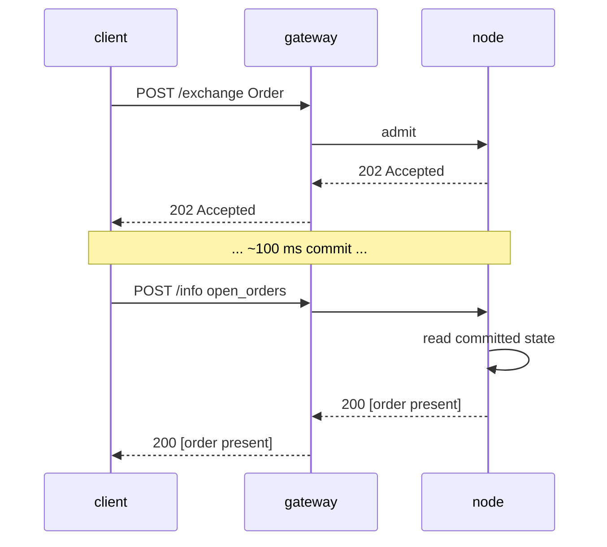

# `POST /info` — مسار القراءة (MTF-native)

:::info
**الحالة.** **مستقرة** الشكل. تُضاف أنواع الاستعلام بمرور الوقت؛ الغلاف ملتزم بثباته.
:::

## ملخص سريع

نقطة نهاية واحدة، متعددة الأنواع. تُوزِّع الطلبات بناءً على حقل `type` في جسم الطلب. للقراءة فقط — لا تُعدِّل الحالة أبدًا، ولا تتطلب توقيعًا.

## عنوان URL

```
POST  https://<net>-gateway.mtf.exchange/info
```

| المسار | شكل السلك |
|------|-----------|
| `POST /info` (البوابة الافتراضية) | MTF-native (هذا المستند) |
| `POST /hl/info` (البوابة، تحت `/hl`) | **متوافق مع HL** — راجع [hl-compat.md](./hl-compat.md) |

MTF-native هو المسار الافتراضي للبوابة؛ أما الوضع المتوافق مع HL فيندرج تحت `/hl/*`.
عند تشغيل العقدة بنفسك، يُخدَّم المسار الأصلي `/info` مباشرةً على
`http://localhost:8080`.

## الغلاف

الطلب:

```json
{ "type": "<query_type>", /* وسائط خاصة بالنوع */ }
```

الرد:

```json
{ "type": "<query_type>", "data": { /* خاص بالنوع */ } }
```

عند إرسال `type` غير معروف: `400 Bad Request` مع `{"error":"unknown info type: <X>"}`.
عند طلب مورد غير موجود (مثل معرف vault مجهول): `404 Not Found` مع `{"error":"<resource> not found"}`.

## أنواع الاستعلام

### `node_info`

هوية العقدة الثابتة + إصدار البروتوكول. لا يتطلب معاملات.

```json
{ "type": "node_info" }
```

الرد:

```json
{
  "type": "node_info",
  "data": {
    "network":           "testnet",
    "chain_id":          114514,
    "protocol_version":  "1.0.0",
    "validator_index":   null,
    "build_commit":      "unknown",
    "version":           "0.0.1",
    "freeze_halt_supported": true,
    "uptime_seconds":    0
  }
}
```

| الحقل | النوع | الوصف |
|-------|------|-------------|
| `network` | `"devnet" \| "testnet" \| "mainnet"` | متغير الشبكة، مشتق من `chain_id` (`31337`=devnet، `114514`=testnet، `8964`=mainnet) |
| `chain_id` | uint64 | معرف سلسلة EIP-712 — القيمة ذاتها التي يجب أن تستخدمها دومين التوقيع في `/exchange` |
| `protocol_version` | سلسلة semver | إصدار بروتوكول السلك |
| `validator_index` | uint32 \| null | فهرس هذه العقدة في مجموعة المدققين النشطة؛ **علامة مؤقتة:** `null` حتى يستدعي وقت التشغيل `set_validator_index` |
| `build_commit` | سلسلة hex | معرف البناء الذي ينشره المشغّل؛ **علامة مؤقتة:** `"unknown"` حتى يُنشر |
| `version` | سلسلة semver | إصدار برنامج العقدة، مضمَّن وقت البناء. يشترك إصدار واحد في `version` واحدة عبر ثنائياته — `build_commit` هو المُميِّز على مستوى البناء |
| `freeze_halt_supported` | bool | دائمًا `true` لهذا الثنائي — علامة قدرة: تُكرِّم العقدة [`exchange_status.scheduled_freeze_height`](#exchange_status)، وتتوقف نظيفةً بكود الخروج `77` بمجرد أن يُثبَّت ارتفاع التجميد، ليتمكن مشرف العقدة من تشغيل الإصدار التالي |
| `uptime_seconds` | uint64 | وقت تشغيل العملية؛ **علامة مؤقتة:** `0` حتى يستدعي وقت التشغيل `set_uptime_seconds` |

هذه حقول **خاصة بكل عقدة** (هوية العقدة / وقت التشغيل)، وليست حالة إجماع، لذا قد تختلف بشكل مشروع بين العقد.

### `account_state`

لقطة لكل حساب.

```json
{ "type": "account_state", "address": "0x<addr>" }
```

| المعامل | النوع | مطلوب |
|-----|------|----------|
| `address` | عنوان hex | نعم |

**عنوان مجهول** (لم يُرَ على السلسلة من قبل) يُعيد **200** مع سجل مُصفَّر بالكامل
(`account_value:"0"`، `positions` / `balances.spot` فارغة)، وليس `404`.

الرد (حساب ممول من الصنبور، بلا مراكز):

```json
{
  "type": "account_state",
  "data": {
    "address":         "0x00000000000000000000000000000000000ca11e",
    "account_value":   "3000",
    "free_collateral": "3000",
    "maint_margin":    "0",
    "init_margin":     "0",
    "health":          "3000",
    "tier":            "Safe",
    "mode":            "Cross",
    "pm_enabled":      false,
    "positions": [],
    "balances": {
      "usdc": "3000",
      "spot": { "MTF": { "total": "10", "hold": "0" } }
    }
  }
}
```

كل رمز في `balances.spot` هو كائن `{total, hold}` (متوافق مع HL): `hold` هو المبلغ المقفل خلف أمر spot ساكن (ضمان)، و`total` هو الرصيد الكامل؛ والمبلغ القابل للإنفاق هو `total − hold`. يظل رمز محجوز بالكامل ظاهرًا. للقراءة **الخفيفة** التي تقتصر على معاملات الهامش فقط (دون مسح `positions`، ودون فحص الأرصدة — المناسبة لاستطلاع صحة التصفية)، استخدم
[`margin_summary`](#margin_summary).

يضيف الحساب ذو المراكز إدخالات تحت `positions`:

```json
{
  "asset":             0,
  "size":              "100000000",
  "entry":             "67000.00",
  "upnl":              "5.00",
  "isolated":          false,
  "lev":               10,
  "liq":               "61000.00",
  "roe":               "0.0075",
  "funding":           "-0.12",
  "margin":            "201.00",
  "notional":          "6705.00"
}
```

| الحقل | النوع | الوصف |
|-------|------|-------------|
| `account_value` | سلسلة عشرية | قيمة حقوق الملكية شاملةً الأرباح والخسائر المحققة، **مستوى USDC الكامل** (`"3000"` = 3000 USDC، وليس الوحدات الأساسية) |
| `free_collateral` | سلسلة عشرية | حقوق الملكية ناقصًا الهامش الأولي المحتجز بالمراكز المفتوحة |
| `maint_margin` | سلسلة عشرية | مجموع الهامش المستخدم لكل أصل (الصيانة) |
| `init_margin` | سلسلة عشرية | متطلب الهامش الأولي المحتجز |
| `health` | سلسلة عشرية | `account_value − maint_margin` (موقَّع؛ قد يكون سالبًا) |
| `tier` | enum | `"Safe"` أو `"T0"` أو `"T1"` أو `"T2"` أو `"T3"` (نطاق BOLE لـ `account_value / maint_margin`؛ `"Safe"` عندما لا يوجد هامش صيانة) — راجع [التصفية المتدرجة](../../concepts/tiered-liquidation.md) |
| `mode` | enum | `"Cross"` أو `"Isolated"` أو `"StrictIso"` (مشتق من المراكز المفتوحة للحساب) |
| `pm_enabled` | bool | حالة الاشتراك في هامش المحفظة |
| `positions[*].asset` | uint32 | معرف الأصل |
| `positions[*].size` | سلسلة i128 | حجم المركز الموقَّع بـ **lots أولية** — `size / 10^sz_decimals` = الوحدات الكاملة (`sz_decimals` هي دقة حجم السوق، مثلاً 5 لـ BTC). هذا هو مستوى الحجم، مستقلًا عن مستوى السعر 1e8. |
| `positions[*].entry` | سلسلة عشرية | سعر الدخول لكل وحدة كاملة = `\|entry_notional\| / \|real size\|`، **مستوى USDC الكامل** |
| `positions[*].upnl` | سلسلة عشرية | الربح والخسارة بالسعر السوقي = `real size × mark − signed entry_notional`، **مستوى USDC الكامل** (موقَّع) |
| `positions[*].isolated` | bool | `true` إلا إذا كان المركز بهامش مشترك |
| `positions[*].lev` | uint8 | الرافعة المالية القصوى للمركز |
| `positions[*].liq` | سلسلة عشرية | السعر (USDC كامل) الذي يجعل هذا المركز منفردًا يُبلغ الحساب حدَّ الصيانة — تقريب مشترك لمركز واحد؛ `"0"` عندما يكون الحجم / الرافعة صفرًا (لا يوجد سعر تصفية منتهٍ) |
| `positions[*].roe` | سلسلة عشرية | `upnl / initial_margin` ككسر عشري (`initial_margin = \|entry_notional\| / leverage`)؛ `"0"` عند صفر الرافعة / القيمة الاسمية |
| `positions[*].funding` | سلسلة عشرية | التمويل المتراكم غير المسوَّى للساق، **USDC كامل** (موقَّع)؛ `real_size × (cumulative_funding − funding_entry)` — بنفس الصيغة التي يدفع بها تسوية التمويل |
| `positions[*].margin` | سلسلة عشرية | الهامش الذي تُسهم به الساق في الصيانة، **USDC كامل**: `\|entry_notional\| × maint_margin_ratio` |
| `positions[*].notional` | سلسلة عشرية | القيمة الاسمية للمركز بالسعر السوقي، **USDC كامل** (موقَّع): `real_size × mark_px` |
| `positions[*].side` | enum \| غائب | **[وضع التحوط](../../concepts/hedge-mode.md) فقط** — `"long"` / `"short"`، الساق التي يُبلِّغ عنها هذا الكائن. **محذوف في حساب الاتجاه الواحد** (مركز صافٍ واحد قد يكون `size` سالبًا). يُعيد حساب التحوط الذي يمتلك كلتا الساقين على أصل واحد **كائنَين**، كائن لكل ساق. |
| `balances.usdc` | سلسلة عشرية | **يعكس `account_value`** (الضمان بـ USDC المشترك)، وليس رصيد USDC فوريًا مستقلًا |
| `balances.spot` | كائن | أرصدة رموز الفوري غير USDC، مفهرسة بـ **اسم الرمز** (مثل `"MTF"`)؛ كل قيمة هي كائن `{total, hold}` (`hold` = الضمان المقفل خلف أوامر الفوري الساكنة؛ القابل للإنفاق = `total − hold`)؛ فارغة إن لم توجد |

### `margin_summary`

**معاملات الهامش فقط** — `account_state` دون مسح `positions[]` وفحص الأرصدة الفورية. الاستدعاء المناسب لاستطلاع صحة التصفية المتكرر (روبوت مراقبة المخاطر، إضافة هامش آلية) حين لا تكون تفاصيل المراكز / الأرصدة مطلوبة. مطلوب: `address` (hex يبدأ بـ 0x).

```json
{ "type": "margin_summary", "address": "0x<addr>" }
```

الرد (`data`): `address`، `account_value`، `free_collateral`،
`maint_margin`، `init_margin`، `health`، `tier`، `mode`، `pm_enabled` —
دلالات الحقول مطابقة للحقول المسماة في
[`account_state`](#account_state) (محسوبة بواسطة مساعد مشترك، لذا لن يتعارض الاثنان أبدًا).

### `market_info`

بيانات وصفية لكل سوق.

```json
{ "type": "market_info", "asset_id": 0 }
```

أو بالاسم:

```json
{ "type": "market_info", "coin": "BTC" }
```

الرد:

```json
{
  "type": "market_info",
  "data": {
    "asset_id":        0,
    "name":            "BTC",
    "kind":            "perp",
    "sz_decimals":     5,
    "mark_px":         "67079.265",
    "oracle_px":       "67073.35",
    "mid_px":          "67079.27",
    "premium":         "0.0015",
    "tick_size":       "1000000",
    "step_size":       "1",
    "min_order":       "1",
    "max_leverage":    50,
    "maint_margin_ratio": "300",
    "init_margin_ratio":  "200",
    "funding": {
      "rate_per_hr":  "0",
      "cap_per_hr":   "400",
      "interval_ms":     3600000,
      "next_payment_ts": 0
    },
    "mark_source": "MedianOfOraclesAndMid",
    "fba_enabled": false,
    "open_interest": "0"
  }
}
```

:::info
**مستوى الإبلاغ عن الأسعار.** في هذه القراءة، كلٌّ من `mark_px` و`oracle_px` في
**مستوى USDC الكامل العشري** (دولارات للإنسان — `"67079.265"` / `"67073.35"`)،
وهي الوحدة ذاتها لأسعار مراكز الحسابات. `mark_px` هو سعر السوق الداخلي مُقلَّصًا من التمثيل الثابت 1e8 للمحرك، مع التراجع إلى سعر الأوراكل عند غياب سعر السوق في دفتر الأوامر؛ و`oracle_px` هو أحدث سعر مؤشر مُثبَّت. أيٌّ منهما يكون `"0"` عند غيابه. لاحظ أن **مستوى تقديم الأوامر/الدفاتر يظل ثابت 1e8** — أسعار مستويات `l2_book` وأسعار حدود الأوامر `limit_px` ليست USDC كاملة؛ يحافظ MTF على تمييز مستويَي القياس، ويُبلِّغ عن الأسعار بـ USDC الكاملة فقط في القراءات المخصصة للإنسان (`market_info`، `markets`، المراكز).
:::

:::info
**دقة السعر مقابل `sz_decimals`.** `mark_px` و`oracle_px` **ملتزمان بتدرج سعر السوق**
(`tick_size`، مُقرَّبان نحو الصفر) لذا لن تظهر قراءة بها ضوضاء دون التدرج — عند تدرج `$0.01` (`tick_size: "1000000"` في مستوى 1e8) يُبلَّغ عن `66735.255` كـ `"66735.25"`. لاحظ أن `sz_decimals` هي دقة **الحجم**
(دقة كمية الأوامر — `5` ⇒ `0.00001` وحدة)، ولا تتحكم في خانات الأسعار العشرية؛ التدرج السعري هو المحدِّد. المحوران مستقلان (نفس التقسيم المستخدم في HL).
:::

### `markets`

كل سوق عقود دائمة مسجَّلة بـ MIP-3، في استدعاء واحد. لا يتطلب معاملات.

```json
{ "type": "markets" }
```

حمولة `data` هي **مصفوفة** من نفس السجل الغني لكل سوق الذي يُعيده
[`market_info`](#market_info) لأصل واحد. السجلات مرتبة بشكل حتمي تصاعديًا حسب `asset_id` (تُكرِّر العقدة `BTreeMap` الخاص بـ `mip3_market_specs`). يُعيد كون دون أسواق `"data": []`.

الرد:

```json
{
  "type": "markets",
  "data": [
    {
      "asset_id":        0,
      "name":            "BTC",
      "kind":            "perp",
      "sz_decimals":     5,
      "mark_px":         "67042.335",
      "oracle_px":       "67042.335",
      "mid_px":          "67042.33",
      "premium":         "0.0015",
      "tick_size":       "1000000",
      "step_size":       "1",
      "min_order":       "1",
      "max_leverage":    50,
      "maint_margin_ratio": "300",
      "init_margin_ratio":  "200",
      "funding": {
        "rate_per_hr":  "0",
        "cap_per_hr":   "400",
        "interval_ms":     3600000,
        "next_payment_ts": 0
      },
      "mark_source": "MedianOfOraclesAndMid",
      "fba_enabled": false,
      "open_interest": "0"
    }
  ]
}
```

| الحقل | النوع | الوصف |
|-------|------|-------------|
| `asset_id` | uint32 | معرف الأصل الأساسي (مفتاح الترتيب) |
| `name` | string | رمز السوق، مثل `"BTC"` |
| `kind` | `"perp"` | نوع السوق (بالأحرف الصغيرة) |
| `sz_decimals` | uint8 | خانات عرض الحجم العشرية (من سجل الرمز الفوري الأساسي؛ `0` إن لم يوجد مواصفات رمز) |
| `mark_px` | سلسلة عشرية | سعر السوق الداخلي، **مستوى USDC الكامل** (سعر السوق مُقلَّص من 1e8، مع تراجع للأوراكل؛ `"0"` إن لم يُضبَط) |
| `oracle_px` | سلسلة عشرية | سعر المؤشر، **مستوى USDC الكامل** (`"0"` إن لم يُضبَط) |
| `mid_px` | سلسلة عشرية \| null | منتصف دفتر الأوامر الفعلي `(best_bid + best_ask) / 2`، **مستوى USDC الكامل** (ملتزم بالتدرج)؛ `null` عندما يكون الدفتر أحادي الجانب / فارغًا |
| `premium` | سلسلة عشرية \| null | أحدث عينة علاوة تمويل مُثبَّتة (موقَّعة)؛ `null` عند غياب عينة |
| `tick_size` | سلسلة i128 | الحد الأدنى لتدرج السعر، **ثابت نقطة 1e8** (مستوى تقديم الأوامر/الدفاتر) |
| `step_size` | سلسلة u128 | الحد الأدنى لتدرج الحجم (حجم الوحدة)، نقطة ثابتة |
| `min_order` | سلسلة u128 | الحد الأدنى لحجم الأمر |
| `max_leverage` | uint8 | الرافعة المالية القصوى |
| `maint_margin_ratio` | سلسلة bps | نسبة هامش الصيانة، نقاط أساس عشرية |
| `init_margin_ratio` | سلسلة bps | نسبة الهامش الأولي (`1 / max_leverage`)، نقاط أساس عشرية |
| `funding.rate_per_hr` | سلسلة bps | أحدث عينة علاوة تمويل، نقاط أساس عشرية |
| `funding.cap_per_hr` | سلسلة bps | حد معدل التمويل في الساعة، نقاط أساس عشرية |
| `funding.interval_ms` | uint64 | دورية التمويل (1 ساعة = `3600000`) |
| `funding.next_payment_ts` | uint64 | طابع زمني لدفع التمويل التالي (`0` حتى توجد عينة) |
| `mark_source` | string | وصف سعر السوق (`"MedianOfOraclesAndMid"`) |
| `fba_enabled` | bool | تفعيل المزاد المجمَّع المتكرر لهذا السوق |
| `open_interest` | سلسلة u128 | الفائدة المفتوحة الحالية، نقطة ثابتة |

كل عنصر مطابق بايت لبايت لحقل `data` في رد `market_info` المقابل لأصل واحد — كلاهما مبنيان من نفس منشئ سجل كل سوق، لذا لن يتباعد الشكل الفردي والجماعي أبدًا. راجع [`market_info`](#market_info) للدلالات على مستوى الحقول والملاحظات الخاصة بالبدائل (`mark_source`، `next_payment_ts`).
### `vault_state`

لقطة لكل خزينة.

```json
{ "type": "vault_state", "vault": "0x<vault_addr>" }
```

الرد:

```json
{
  "type": "vault_state",
  "data": {
    "vault":              "0x<addr>",
    "name":               "MFlux Conservative",
    "tvl":             "10000000000",
    "share_price":     "10500000",
    "depositor_count":    142,
    "high_water_mark": "10500000",
    "performance_fee_bps":1000,
    "lock_period_ms":     86400000,
    "strategy":           "MarketNeutral"
  }
}
```

### `staking_state`

```json
{ "type": "staking_state", "address": "0x<addr>" }
```

الرد:

```json
{
  "type": "staking_state",
  "data": {
    "address":         "0x<addr>",
    "total_staked": "1000000000",
    "delegations": [
      {
        "validator":         "0x<val_addr>",
        "amount":         "500000000",
        "since_ts":          1735000000000,
        "pending_rewards":"1000000"
      }
    ],
    "pending_unstakes": [
      { "amount": "200000000", "matures_at_ts": 1735780000000 }
    ]
  }
}
```

### `fee_schedule`

```json
{ "type": "fee_schedule" }
```

الرد:

```json
{
  "type": "fee_schedule",
  "data": {
    "tiers": [
      { "volume_30d": "0",         "maker_bps": "2.0", "taker_bps": "5.0" },
      { "volume_30d": "100000000", "maker_bps": "1.5", "taker_bps": "4.5" },
      { "volume_30d": "1000000000","maker_bps": "1.0", "taker_bps": "4.0" }
    ],
    "builder_rebate_bps": "0.2",
    "burn_ratio":         "0.30",
    "referrer_share_bps": "1.0"
  }
}
```

معدلات الرسوم عبارة عن **نقاط أساس** عشرية كسلاسل نصية (`"2.0"` = 2 نقطة أساس = 0.02%). `burn_ratio` هو كسر عشري (`"0.30"` = 30% من الرسوم تُحرَق). راجع [الرسوم](../../concepts/fees.md).

### `open_orders`

الأوامر الساكنة لحساب محدد عبر كل دفاتر العقود الدائمة.

```json
{ "type": "open_orders", "account_id": 42 }
```

| المعامل | النوع | مطلوب |
|-----|------|----------|
| `account_id` | uint64 | أحد `account_id` / `address` |
| `address` | عنوان hex | أحد `account_id` / `address` |

يُحدد الحساب إما بـ `account_id` (u64) أو `address` (hex يبدأ بـ 0x). عند تقديم `account_id` في الطلب، يُردَّد في `data.account_id`.

الرد:

```json
{
  "type": "open_orders",
  "data": {
    "address":    "0x<addr>",
    "account_id": 42,
    "orders": [
      {
        "oid":          12345,
        "market_id":    0,
        "side":         "bid",
        "px":        "99000",
        "size":      "700",
        "cloid":        "0x000000000000000000000000cafef00d",
        "inserted_at_ms": 1700000000000
      }
    ]
  }
}
```

| الحقل | النوع | الوصف |
|-------|------|-------------|
| `address` | عنوان hex | عنوان الحساب بعد الحل |
| `account_id` | uint64 | يُردَّد فقط عندما يستخدم الطلب `account_id` |
| `orders[*].oid` | uint64 | معرف الأمر على الخادم |
| `orders[*].market_id` | uint32 | معرف الأصل / السوق الذي يستقر عليه الأمر |
| `orders[*].side` | `"bid"` / `"ask"` | جانب الأمر |
| `orders[*].px` | سلسلة i128 | سعر الاستقرار، سلسلة عشرية بنقطة ثابتة |
| `orders[*].size` | سلسلة u128 | الحجم المتبقي، سلسلة عشرية بنقطة ثابتة |
| `orders[*].cloid` | سلسلة hex \| null | معرف أمر العميل الذي وُضع به الأمر (`0x` + 32 حرف hex)؛ `null` إن لم يُحدَّد |
| `orders[*].inserted_at_ms` | uint64 | طابع زمني للإيداع / الإدراج (توافق ms) |

### `l2_book`

مستويات الطلب/العرض المجمَّعة لسوق محدد.

```json
{ "type": "l2_book", "market_id": 0 }
```

| المعامل | النوع | مطلوب |
|-----|------|----------|
| `market_id` | uint32 | نعم |

الرد:

```json
{
  "type": "l2_book",
  "data": {
    "market_id": 0,
    "bids": [ { "px": "99000", "size": "700", "n_orders": 1 } ],
    "asks": [ { "px": "101000", "size": "750", "n_orders": 2 } ]
  }
}
```

الطلبات مرتبة من الأفضل (تنازلي السعر)، والعروض تصاعدي. كل مستوى يُجمِّع `size` الإجمالية وعدد `n_orders` الأوامر الساكنة. يُعيد السوق المجهول / الفارغ مصفوفتَي `bids` / `asks` فارغتَين.

| الحقل | النوع | الوصف |
|-------|------|-------------|
| `market_id` | uint32 | معرف السوق المردَّد |
| `bids[*].px` / `asks[*].px` | سلسلة i128 | سعر المستوى، سلسلة عشرية بنقطة ثابتة |
| `bids[*].size` / `asks[*].size` | سلسلة u128 | الحجم الإجمالي عند المستوى |
| `bids[*].n_orders` / `asks[*].n_orders` | uint64 | الأوامر الساكنة عند المستوى |

### `recent_trades`

شريط التداول العام للسوق، يُخدَّم مباشرةً من الحالة المثبَّتة على العقدة
(حلقة تداول محدودة لكل سوق مطوية في AppHash — لا يلزم مُفهرس خارجي).

```json
{ "type": "recent_trades", "market_id": 0 }
```

| المعامل | النوع | مطلوب | الوصف |
|-----|------|----------|-------------|
| `market_id` | uint32 | نعم | معرف الأصل / السوق |
| `limit` | uint32 | لا | تحديد عدد السجلات **الأحدث** المُعادة؛ غياب / `0` ⇒ الحلقة بأكملها |

الرد:

```json
{
  "type": "recent_trades",
  "data": {
    "market_id":      0,
    "last_trade_ms":  1700000000555,
    "trades": [
      {
        "coin":  0,
        "side":  "B",
        "px":    "67042.50",
        "sz":    "0.125",
        "time":  1700000000555,
        "tid":   90123,
        "block": 562,
        "hash":  "0x2315b79b9e82c2deb279a59448bf7841f3767d30d874e5b544d75bb9fd1e9b0c"
      }
    ]
  }
}
```

السجلات مرتبة من الأقدم إلى الأحدث. الحلقة محدودة، لذا هذه نافذة حديثة لا تاريخ كامل. يُعيد السوق المجهول / الذي لم يُتداوَل فيه `"trades": []` و`last_trade_ms: 0`.

| الحقل | النوع | الوصف |
|-------|------|-------------|
| `market_id` | uint32 | معرف السوق المردَّد |
| `last_trade_ms` | uint64 | طابع زمني لآخر صفقة (`0` إن لم توجد) |
| `trades[*].coin` | uint32 | معرف الأصل / السوق الذي نُفِّذت فيه الصفقة |
| `trades[*].side` | `"B"` / `"A"` | جانب المتعامِل (المهاجم) — `"B"` = شراء، `"A"` = بيع |
| `trades[*].px` | سلسلة عشرية | سعر التنفيذ، **USDC عشري** (قابل للقراءة البشرية) |
| `trades[*].sz` | سلسلة عشرية | الحجم المنفَّذ، **الوحدات الأساسية** (وحدة كاملة) |
| `trades[*].time` | uint64 | طابع زمني للصفقة (توافق ms) |
| `trades[*].tid` | uint64 | معرف صفقة حتمي (مشترك بين ساقَي الطباعة) |
| `trades[*].block` | uint64 | ارتفاع الكتلة المثبَّتة التي تمت فيها الصفقة (محدِّد موقع على السلسلة) |
| `trades[*].hash` | سلسلة hex | تجزئة معاملة الأمر المنشئ، hex مسبوقة بـ `0x` — تتيح تتبع الطباعة على السلسلة |

### `candle`

أعمدة OHLCV التاريخية لـ `(coin, interval)` عبر نافذة زمنية. مكمِّل REST لقناة WS المباشرة [`candles`](../ws/subscriptions.md#candles) — تدفع WS العمود المتشكِّل مع ورود الصفقات، بينما تُعيد هذه القراءة التاريخ المغلق.

```json
{ "type": "candle", "coin": "BTC", "interval": "1m" }
```

| المعامل | النوع | مطلوب | الوصف |
|-----|------|----------|-------------|
| `coin` | string | نعم | رمز السوق، مثل `"BTC"` |
| `interval` | string | نعم | رمز الفئة — أحد `1m`، `5m`، `15m`، `1h`، `4h`، `1d` |
| `start_time` | uint64 | لا | بداية النافذة (ms)؛ تُصفِّي على الافتتاح. الافتراضي `0` |
| `end_time` | uint64 | لا | نهاية النافذة (ms)؛ تُصفِّي على الافتتاح. الافتراضي غير محدود |

يمكن تمرير المعاملات بشكل مُسطَّح (أعلاه) أو مُدمَّجة تحت كائن `req`؛ `start_time` / `end_time` يقبلان أيضًا تهجئة camelCase `startTime` / `endTime`. غياب `coin` أو `interval` → `400 {"error":"missing field <name>"}`.

الرد:

```json
{
  "type": "candle",
  "data": [
    {
      "t": 1700000040000,
      "T": 1700000099999,
      "s": "BTC",
      "i": "1m",
      "o": "67000.00",
      "c": "67042.50",
      "h": "67080.00",
      "l": "66990.00",
      "v": "12.5",
      "q": "837843.75",
      "n": 37
    }
  ]
}
```

الأعمدة مرتبة من الأقدم حسب `t` (وقت الافتتاح)؛ أحدث عنصر هو العمود المتشكِّل. مصفوفة فارغة هي الإجابة الصريحة لرمز `interval` غير مدعوم، أو سوق بلا صفقات مُفهرَسة، أو نشر دون مُفهرس موصول.

| الحقل | النوع | الوصف |
|-------|------|-------------|
| `t` | uint64 | طابع زمني **افتتاح** العمود (ms، مُحاذى للفئة) |
| `T` | uint64 | طابع زمني **إغلاق** العمود (ms) — `t + interval − 1` |
| `s` | string | رمز العملة / السوق |
| `i` | string | رمز فئة الفترة |
| `o` / `c` / `h` / `l` | سلسلة عشرية | سعر **الافتتاح** / **الإغلاق** / **الأعلى** / **الأدنى**، **USDC عشري** (دولارات بشرية، مثل `"67042.50"`) |
| `v` | سلسلة عشرية | **حجم الأصل الأساسي** — مجموع الحجم المتداول في العمود (حجم العملة، وليس القيمة الاسمية) |
| `q` | سلسلة عشرية | **حجم الاقتباس (USD)** — `مجموع السعر × الحجم` عبر عمليات التنفيذ في العمود |
| `n` | uint64 | عدد الصفقات (عمليات التنفيذ) في العمود |

:::info
**السلسلة بلا فجوات.** الفترة التي **لا توجد فيها صفقات** تُصدر عمودًا مسطحًا يحمل
إغلاق العمود السابق للأمام: `o = h = l = c = previous close`، و
`v = q = 0`، `n = 0`. يحصل المستهلكون على سلسلة متواصلة عمودًا بكل فترة دون ثغرات للاستكمال. **لا يُصدَر عمود قبل أول صفقة في السوق** — السلسلة تبدأ من فئة أول طباعة، لذا المصفوفة الفارغة تعني عدم تداول السوق أبدًا (أو غياب التاريخ)، لا أن الفئات المبكرة سقطت.
:::

:::info
**هذا النوع يُخدَّم من البوابة لا من العقدة.** الشموع هي بيانات عرض مشتقة من دفق الصفقات العامة — ليست حالة سلسلة مثبَّتة، ولا تمسّ app-hash، ولا تحمل ضمان إجماع. تجيب البوابة على `candle` من مخزنها المتجدد؛ عقدة مجردة تُستعلَم مباشرةً تُعيد `unknown info type: candle`. فارغة صادقة (`"data": []`) عند غياب تاريخ تداول للسوق في البوابة.
:::

### `user_fills`

سجل تنفيذ حساب محدد، يُخدَّم مباشرةً من الحالة المثبَّتة على العقدة (حلقة تنفيذ محدودة لكل حساب مطوية في AppHash — لا يلزم مُفهرس خارجي).

```json
{ "type": "user_fills", "account_id": 42 }
```

| المعامل | النوع | مطلوب | الوصف |
|-----|------|----------|-------------|
| `account_id` | uint64 | أحد `account_id` / `address` | معرف الحساب الداخلي |
| `address` | عنوان hex | أحد `account_id` / `address` | عنوان الحساب |
| `limit` | uint32 | لا | تحديد عدد السجلات **الأحدث** المُعادة؛ غياب / `0` ⇒ الحلقة بأكملها |

يُحدد الحساب إما بـ `account_id` (u64) أو `address` (hex يبدأ بـ 0x). عند تقديم `account_id` في الطلب، يُردَّد في `data.account_id`.

الرد:

```json
{
  "type": "user_fills",
  "data": {
    "address":    "0x<addr>",
    "account_id": 42,
    "fills": [
      {
        "coin":           0,
        "side":           "B",
        "px":             "67042.50",
        "sz":             "0.125",
        "time":           1700000000555,
        "oid":            12345,
        "tid":            90123,
        "fee":            "4.19",
        "closed_pnl":     "0",
        "dir":            "Open Long",
        "start_position": "0",
        "block":          562,
        "hash":           "0x2315b79b9e82c2deb279a59448bf7841f3767d30d874e5b544d75bb9fd1e9b0c"
      }
    ]
  }
}
```

السجلات مرتبة من الأقدم إلى الأحدث. الحلقة محدودة، لذا هذه نافذة حديثة لا تاريخ كامل. يُعيد الحساب الذي بلا تنفيذات `"fills": []`.

| الحقل | النوع | الوصف |
|-------|------|-------------|
| `address` | عنوان hex | عنوان الحساب بعد الحل |
| `account_id` | uint64 | يُردَّد فقط عندما يستخدم الطلب `account_id` |
| `fills[*].coin` | uint32 | معرف الأصل / السوق الذي نُفِّذت فيه الصفقة |
| `fills[*].side` | `"B"` / `"A"` | رمز جانب هذه الساق — `"B"` = شراء/طلب، `"A"` = بيع/عرض |
| `fills[*].px` | سلسلة عشرية | سعر التنفيذ، **USDC عشري** (قابل للقراءة البشرية) |
| `fills[*].sz` | سلسلة عشرية | الحجم المنفَّذ، **الوحدات الأساسية** (وحدة كاملة) |
| `fills[*].time` | uint64 | طابع زمني للتنفيذ (توافق ms) |
| `fills[*].oid` | uint64 | معرف أمر هذا الطرف |
| `fills[*].tid` | uint64 | معرف صفقة حتمي (مشترك بين ساقَي الطباعة) |
| `fills[*].fee` | سلسلة عشرية | الرسوم التي دفعها هذا الطرف، **USDC عشري** |
| `fills[*].closed_pnl` | سلسلة عشرية | الربح والخسارة المحقَّق على الجزء المغلَق، **USDC عشري** (موقَّع) |
| `fills[*].dir` | string | تسمية الاتجاه، مثل `"Open Long"`، `"Close Short"`، `"Open Short"`، `"Close Long"` |
| `fills[*].start_position` | سلسلة عشرية | حجم الساق الموقَّع قبل التنفيذ، **الوحدات الأساسية** (وحدة كاملة، موقَّع) |
| `fills[*].block` | uint64 | ارتفاع الكتلة المثبَّتة التي تمت فيها الصفقة (محدِّد موقع على السلسلة) |
| `fills[*].hash` | سلسلة hex | تجزئة معاملة الأمر المنشئ، hex مسبوقة بـ `0x` — تتيح تتبع التنفيذ على السلسلة |

### `user_fills_by_time`

مثل [`user_fills`](#user_fills)، لكن مُصفَّى على نافذة زمنية بناءً على `time` الإجماعي لكل سجل. نفس شكل سجل التنفيذ.

```json
{ "type": "user_fills_by_time", "address": "0x<addr>", "start_time": 1700000000000, "end_time": 1700003600000 }
```

| المعامل | النوع | مطلوب | الوصف |
|-----|------|----------|-------------|
| `account_id` | uint64 | أحد `account_id` / `address` | معرف الحساب الداخلي |
| `address` | عنوان hex | أحد `account_id` / `address` | عنوان الحساب |
| `start_time` | uint64 | لا | بداية النافذة (ms، شاملة)؛ تُصفِّي على `time` التنفيذ. غياب ⇒ حد أدنى مفتوح |
| `end_time` | uint64 | لا | نهاية النافذة (ms، شاملة). غياب ⇒ حد أعلى مفتوح |

الرد:

```json
{
  "type": "user_fills_by_time",
  "data": {
    "address":    "0x<addr>",
    "account_id": 42,
    "start_time": 1700000000000,
    "end_time":   1700003600000,
    "fills": [ /* نفس شكل السجل في user_fills */ ]
  }
}
```

| الحقل | النوع | الوصف |
|-------|------|-------------|
| `address` | عنوان hex | عنوان الحساب بعد الحل |
| `account_id` | uint64 | يُردَّد فقط عندما يستخدم الطلب `account_id` |
| `start_time` | uint64 \| null | بداية النافذة المردَّدة (`null` إن أُغفِلت) |
| `end_time` | uint64 \| null | نهاية النافذة المردَّدة (`null` إن أُغفِلت) |
| `fills` | مصفوفة | سجلات التنفيذ ضمن النافذة (نفس شكل التنفيذ الفردي في [`user_fills`](#user_fills))، من الأقدم إلى الأحدث |

### `order_status`

بحث عن دورة حياة أمر واحد بـ `oid` (معرف أمر الخادم) **أو** `cloid` (معرف أمر العميل). يقرأ الدفاتر المباشرة، وسجل المشغِّل، وحلقة التنفيذ المثبَّتة — كلها حالة مثبَّتة على العقدة.

```json
{ "type": "order_status", "oid": 12345 }
```

أو بمعرف أمر العميل:

```json
{ "type": "order_status", "cloid": "0x000000000000000000000000cafef00d" }
```

| المعامل | النوع | مطلوب | الوصف |
|-----|------|----------|-------------|
| `oid` | uint64 | أحد `oid` / `cloid` | معرف أمر الخادم |
| `cloid` | سلسلة hex | أحد `oid` / `cloid` | معرف أمر العميل — `0x` + 32 حرف hex |

غياب كليهما → `400 {"error":"missing field oid or cloid"}`. `cloid` مشوَّه → `400`. يتوقف الحل عند أول إصابة، بهذا الترتيب: أمر ساكن مباشر → مشغِّل مُوقَف → تنفيذ محدود → مجهول.

`data.status` يُميِّز الفرع:

`"resting"` — أمر مباشر مفتوح في دفتر عقود دائمة أو فوري:

```json
{
  "type": "order_status",
  "data": {
    "status": "resting",
    "order": {
      "oid":            12345,
      "market_id":      0,
      "side":           "bid",
      "px":             "67000",
      "size":           "700",
      "inserted_at_ms": 1700000000000,
      "cloid":          "0x000000000000000000000000cafef00d"
    }
  }
}
```

`"triggered"` — أمر TP/SL/إيقاف مُوقَف ينتظر تجاوز السعر:

```json
{
  "type": "order_status",
  "data": {
    "status": "triggered",
    "trigger": {
      "oid":              12345,
      "market_id":        0,
      "side":             "ask",
      "trigger_px":       "66000",
      "trigger_above":    false,
      "size":             "700",
      "registered_at_ms": 1700000000000,
      "fired":            false
    }
  }
}
```

`"filled"` — أحدث تنفيذ مطابق في حلقة الحساب (كائن `fill`
بنفس شكل سجل [`user_fills`](#user_fills)):

```json
{
  "type": "order_status",
  "data": {
    "status": "filled",
    "fill": { /* نفس شكل سجل تنفيذ user_fills */ }
  }
}
```

`"unknown"` — لم يُرَ قط، أو طُرد من الحلقة المحدودة (استعلام `cloid` فقط لم يطابق أمرًا ساكنًا/مشغَّلًا يُحل هنا أيضًا، لأن سجل المشغِّل وحلقة التنفيذ مفهرسان بـ `oid`):

```json
{ "type": "order_status", "data": { "status": "unknown" } }
```

| الحقل | النوع | الوصف |
|-------|------|-------------|
| `status` | `"resting" \| "triggered" \| "filled" \| "unknown"` | حالة دورة الحياة بعد الحل |
| `order` | كائن | موجود عند `"resting"` — `oid`، `market_id`، `side` (`"bid"`/`"ask"`)، `px` / `size` (سلاسل عشرية بنقطة ثابتة)، `inserted_at_ms`، `cloid` (hex \| null) |
| `trigger` | كائن | موجود عند `"triggered"` — `oid`، `market_id`، `side`، `trigger_px` / `size` (سلاسل عشرية بنقطة ثابتة)، `trigger_above` (bool: التشغيل عند تجاوز السعر للأعلى)، `registered_at_ms`، `fired` (bool) |
| `fill` | كائن | موجود عند `"filled"` — سجل التنفيذ المطابق (راجع [`user_fills`](#user_fills)) |

### `funding_history`

عينات علاوة التمويل لسوق محدد.

```json
{ "type": "funding_history", "market_id": 0 }
```

| المعامل | النوع | مطلوب |
|-----|------|----------|
| `market_id` | uint32 | نعم |

الرد:

```json
{
  "type": "funding_history",
  "data": {
    "market_id": 0,
    "samples": [
      { "ts_ms": 1700000000000, "premium": "0.0015", "funding_rate": "0.0015" },
      { "ts_ms": 1700000008000, "premium": "-0.0007", "funding_rate": "-0.0007" }
    ]
  }
}
```

العينات هي الحلقة المرتبة لقطات العلاوة من متتبع التمويل.
`premium` هو `Decimal` الدقيق قبل التحديد المُحوَّل إلى سلسلة (موقَّع، دقة كاملة)؛ `funding_rate` هو تلك العلاوة بعد المرور بسقف التمويل لكل أصل (`±funding_rate_cap`، تجاوز مخاطر ديناميكي أو أساس `0.04`/hr) — أي المعدل المحقَّق الذي سيُحتسب فعلًا. عندما تكون العلاوة ضمن السقف، `funding_rate == premium`؛ وإذا تجاوزته، يُحدَّد `funding_rate` بالسقف الموقَّع. يُعيد السوق المجهول / الفارغ `"samples": []`.

| الحقل | النوع | الوصف |
|-------|------|-------------|
| `market_id` | uint32 | معرف السوق المردَّد |
| `samples[*].ts_ms` | uint64 | طابع زمني للعينة (توافق ms) |
| `samples[*].premium` | سلسلة عشرية | عينة علاوة التمويل الخام، قبل التحديد (موقَّعة) |
| `samples[*].funding_rate` | سلسلة عشرية | المعدل المحقَّق = `premium` مُحدَّدًا بسقف كل أصل (موقَّع) |

### `predicted_fundings`

معدل التمويل المتوقَّع + وقت الدفع التالي لكل سوق، عبر جميع أسواق العقود الدائمة المسجَّلة. لا يتطلب معاملات.

```json
{ "type": "predicted_fundings" }
```

حمولة `data` هي **مصفوفة**، مرتبة بشكل حتمي تصاعديًا حسب `asset` (تُكرِّر العقدة `BTreeMap` الخاص بمواصفات السوق). يُعيد كون دون أسواق `"data": []`.

الرد:

```json
{
  "type": "predicted_fundings",
  "data": [
    { "asset": 0, "predicted_rate": "0.0015", "next_funding_time": 1700003600000 }
  ]
}
```

`predicted_rate` هو أحدث عينة علاوة (وكيل معدل بالساعة، سلسلة عشرية) — `"0"` قبل أول عينة. `next_funding_time` هو الطابع الزمني المشتق لدفع التمويل التالي (`last_sample_ts + 1h`)، `0` قبل أول عينة.

| الحقل | النوع | الوصف |
|-------|------|-------------|
| `asset` | uint32 | معرف الأصل / السوق |
| `predicted_rate` | سلسلة عشرية | أحدث عينة علاوة (وكيل معدل بالساعة)؛ `"0"` قبل العينة |
| `next_funding_time` | uint64 | طابع زمني لدفع التمويل التالي (توافق ms)؛ `0` قبل العينة |

### `block_info`

بيانات وصفية للكتلة المثبَّتة. لا توجد معاملات مطلوبة (`height` مقبول لكنه مُهمَل — حالة القراءة تحتفظ فقط بأحدث سياق مثبَّت).

```json
{ "type": "block_info" }
```

الرد:

```json
{
  "type": "block_info",
  "data": {
    "height":       562,
    "round":        562,
    "epoch":        0,
    "timestamp_ms": 1780475491562,
    "block_hash":   "0x2315b79b9e82c2deb279a59448bf7841f3767d30d874e5b544d75bb9fd1e9b0c"
  }
}
```

| الحقل | النوع | الوصف |
|-------|------|-------------|
| `height` | uint64 | أحدث ارتفاع للكتلة المثبَّتة |
| `round` | uint64 | جولة الإجماع لتلك الكتلة |
| `epoch` | uint64 | الحقبة الحالية |
| `timestamp_ms` | uint64 | طابع زمني الكتلة (توافق ms) |
| `block_hash` | سلسلة hex (32 بايت) | تجزئة الكتلة المثبَّتة الفعلية (متصلة الآن بحالة القراءة — لم تعد العنصر النائب الكل أصفار) |

### `agents`

عملاء / محافظ API المعتمدة لحساب.

```json
{ "type": "agents", "account_id": 42 }
```

| المعامل | النوع | مطلوب |
|-----|------|----------|
| `account_id` | uint64 | أحد `account_id` / `address` |
| `address` | عنوان hex | أحد `account_id` / `address` |

الرد:

```json
{
  "type": "agents",
  "data": {
    "address":    "0x<master>",
    "account_id": 42,
    "agents": [
      { "agent": "0x<agent_addr>", "name": "trading-bot", "expires_at_ms": 1700000500000 }
    ]
  }
}
```

| الحقل | النوع | الوصف |
|-------|------|-------------|
| `address` | عنوان hex | عنوان الحساب الرئيسي بعد الحل |
| `account_id` | uint64 | يُردَّد فقط عندما يستخدم الطلب `account_id` |
| `agents[*].agent` | عنوان hex | عنوان محفظة العميل المعتمد |
| `agents[*].name` | string \| null | تسمية العميل المحددة وقت الاعتماد؛ `null` إن لم تُحدَّد |
| `agents[*].expires_at_ms` | uint64 \| null | انتهاء صلاحية اعتماد العميل (توافق ms)؛ `null` لاعتماد غير منتهٍ |

### `sub_accounts`

الحسابات الفرعية لحساب.

```json
{ "type": "sub_accounts", "account_id": 42 }
```

| المعامل | النوع | مطلوب |
|-----|------|----------|
| `account_id` | uint64 | أحد `account_id` / `address` |
| `address` | عنوان hex | أحد `account_id` / `address` |

الرد:

```json
{
  "type": "sub_accounts",
  "data": {
    "address":    "0x<parent>",
    "account_id": 42,
    "sub_accounts": [
      { "index": 0, "address": "0x<sub_addr>" }
    ]
  }
}
```

| الحقل | النوع | الوصف |
|-------|------|-------------|
| `address` | عنوان hex | عنوان الحساب الأب بعد الحل |
| `account_id` | uint64 | يُردَّد فقط عندما يستخدم الطلب `account_id` |
| `sub_accounts[*].index` | uint32 | فهرس الحساب الفرعي تحت الأب |
| `sub_accounts[*].address` | عنوان hex | عنوان الحساب الفرعي |

### `mip3_active_bids`

لقطة مزاد الغاز لنشر العقود الدائمة بدون إذن في MIP-3. لا يتطلب معاملات.

```json
{ "type": "mip3_active_bids" }
```

الرد:

```json
{
  "type": "mip3_active_bids",
  "data": {
    "auction_round":   2,
    "current_bid":     "12345",
    "current_winner":  "0x<bidder>",
    "auction_end_ms":  1700086400000,
    "started_at_ms":   1700000000000,
    "bids": [
      {
        "bidder":          "0x<bidder>",
        "amount":          "12345",
        "submitted_at_ms": 1700000000500,
        "tag":             "ETH-PERP"
      }
    ]
  }
}
```

| الحقل | النوع | الوصف |
|-------|------|-------------|
| `auction_round` | uint64 | جولة المزاد الحالية |
| `current_bid` | سلسلة عشرية | مبلغ العرض الرائد |
| `current_winner` | عنوان hex \| null | الفائز الحالي بالمزاد، `null` إن لم يوجد |
| `auction_end_ms` | uint64 | طابع زمني إغلاق المزاد (توافق ms) |
| `started_at_ms` | uint64 | طابع زمني بدء المزاد (توافق ms) |
| `bids[*].bidder` | عنوان hex | عنوان مقدِّم العرض |
| `bids[*].amount` | سلسلة عشرية | مبلغ العرض |
| `bids[*].submitted_at_ms` | uint64 | طابع زمني تقديم العرض (توافق ms) |
| `bids[*].tag` | string | علامة العرض (مثل الاسم المقترح للسوق) |
### `protocol_metrics`

مجمِّعات / عدادات البروتوكول على مستوى بروتوكول كامل. لا يتطلب معاملات. كل حقل يُقرأ مباشرةً من حالة `Exchange` المثبَّتة (عدادات، مجمعات رسوم، احتياطيات BOLE، الرهن) — لا شيء محسوب من محرك المطابقة أو الأوراكل، لذا تُعيد أي إعادة تشغيل النتيجة ذاتها.

```json
{ "type": "protocol_metrics" }
```

الرد:

```json
{
  "type": "protocol_metrics",
  "data": {
    "counters": {
      "total_orders":               1000,
      "total_fills":                750,
      "total_liquidations":         3,
      "total_deposits":             40,
      "total_withdrawals":          12,
      "total_vault_transfers":      0,
      "total_sub_account_transfers":0
    },
    "fee_pools": {
      "burned":         "8000",
      "mflux_vault":    "0",
      "validator_pool": "1000",
      "treasury":       "1000",
      "burned_mtf":     "55"
    },
    "insurance_fund_total":    "750",
    "treasury_backstop_total": "9000",
    "bole_pool": {
      "total_deposits":  "20000",
      "shortfall_total": "7"
    },
    "open_interest_total_1e8": "1500000",
    "staking": {
      "total_stake":   "100",
      "n_validators":  1,
      "n_active":      1,
      "n_jailed":      0,
      "current_epoch": 4
    },
    "counts": {
      "n_markets":             1,
      "n_spot_pairs":          5,
      "n_user_vaults":         0,
      "n_accounts_with_state": 12
    }
  }
}
```

| الحقل | النوع | الوصف |
|-------|------|-------------|
| `counters.total_orders` | uint64 | الأوامر المقبولة مدى الحياة |
| `counters.total_fills` | uint64 | التنفيذات مدى الحياة (الإشارة التداولية المُفصَّلة الوحيدة — **عدد**، لا قيمة اسمية) |
| `counters.total_liquidations` | uint64 | التصفيات مدى الحياة |
| `counters.total_deposits` / `total_withdrawals` | uint64 | عداد الإيداعات / السحوبات مدى الحياة |
| `counters.total_vault_transfers` | uint64 | التحويلات لإيداع/سحب الخزينة مدى الحياة |
| `counters.total_sub_account_transfers` | uint64 | تحويلات الحسابات الفرعية مدى الحياة |
| `fee_pools.burned` | سلسلة عشرية | USDC التراكمي المُوجَّه لإعادة الشراء والحرق (USDC كامل) |
| `fee_pools.mflux_vault` | سلسلة عشرية | حصة رسوم خزينة MFlux التراكمية (`"0"` — حصة الخزينة صفر) |
| `fee_pools.validator_pool` | سلسلة عشرية | حصة رسوم مجمع المدققين التراكمية (USDC كامل) |
| `fee_pools.treasury` | سلسلة عشرية | حصة رسوم الخزينة التراكمية (USDC كامل) |
| `fee_pools.burned_mtf` | سلسلة عشرية | MTF التراكمي المُتقاعَد بواسطة منفِّذ إعادة الشراء |
| `insurance_fund_total` | سلسلة عشرية | مجموع احتياطيات `bole_pool.insurance_fund` لكل أصل (USDC كامل) |
| `treasury_backstop_total` | سلسلة عشرية | مجموع احتياطيات `bole_pool.treasury_backstop` لكل أصل (USDC كامل) |
| `bole_pool.total_deposits` | سلسلة عشرية | إجمالي ودائع مجمع إقراض BOLE (USDC كامل) |
| `bole_pool.shortfall_total` | سلسلة عشرية | مجموع الديون المعدومة المتبقية بعد شلال ADL → التأمين → الخزينة |
| `open_interest_total_1e8` | سلسلة u128 | مجموع الفائدة المفتوحة لكل سوق، **مستوى دفتر 1e8** (موسوم بـ `_1e8`، وليس USDC كامل) |
| `staking.total_stake` | سلسلة عشرية | إجمالي MTF المرهون (MTF كامل) |
| `staking.n_validators` | uint64 | المدققون في المجموعة المثبَّتة |
| `staking.n_active` | uint64 | المدققون النشطون هذه الحقبة |
| `staking.n_jailed` | uint64 | المدققون المحتجزون حاليًا |
| `staking.current_epoch` | uint64 | حقبة الرهن الحالية |
| `counts.n_markets` | uint64 | أسواق العقود الدائمة MIP-3 المسجَّلة (`mip3_market_specs`) |
| `counts.n_spot_pairs` | uint64 | أزواج الفوري المسجَّلة (`mip3_spot_pair_specs`) |
| `counts.n_user_vaults` | uint64 | الخزائن المستخدِمة المسجَّلة |
| `counts.n_accounts_with_state` | uint64 | الحسابات ذات حالة مستخدم مثبَّتة |

:::info
**لا يوجد مجموع تراكمي للقيمة الاسمية المتداولة.** يتتبع المحرك **حجم رسوم 30 يومًا** لكل مستخدم
(راجع [`user_fees`](#user_fees)) وعدد التنفيذات مدى الحياة
(`counters.total_fills`) — **لا يوجد مجمِّع تراكمي مثبَّت للدولار المتداول على مستوى البروتوكول**،
لذا تحذف هذه القراءة عمدًا ذلك بدلًا من الإيحاء بوجود إجمالي حجم. العدادات هي حاصلات نشاط رتيبة، لا أموال.
:::

مصدر الحالة: `locus.{counters, fee_tracker.fee_distribution, bole_pool}` + `c_staking` + أحجام السجل.

### `user_fees`

رسوم / شريحة حجم لكل حساب. مطلوب: `account_id` (u64) **أو** `address` (hex يبدأ بـ 0x).

```json
{ "type": "user_fees", "account_id": 42 }
```

| المعامل | النوع | مطلوب |
|-----|------|----------|
| `account_id` | uint64 | أحد `account_id` / `address` |
| `address` | عنوان hex | أحد `account_id` / `address` |

غياب كليهما → `400`. يُعيد حساب بدون حالة رسوم **200** مع أحجام مُصفَّرة ونقاط أساس الشريحة الأساسية — النمط المُصفَّر المعتمد.

الرد:

```json
{
  "type": "user_fees",
  "data": {
    "address":          "0x<addr>",
    "account_id":       42,
    "taker_volume_30d": "1250000",
    "maker_volume_30d": "800000",
    "vip_tier":         2,
    "mm_tier":          1,
    "referrer":         "0x<referrer>",
    "referrer_credit":  "420",
    "maker_bps":        1,
    "taker_bps":        3
  }
}
```

| الحقل | النوع | الوصف |
|-------|------|-------------|
| `address` | عنوان hex | عنوان الحساب بعد الحل |
| `account_id` | uint64 | يُردَّد فقط عندما يستخدم الطلب `account_id` |
| `taker_volume_30d` | سلسلة عشرية | حجم المتعامِل المتدحرج 30 يومًا (USDC كامل) |
| `maker_volume_30d` | سلسلة عشرية | حجم صانع السوق المتدحرج 30 يومًا (USDC كامل) |
| `vip_tier` | uint | فهرس شريحة VIP المثبَّت لكل مستخدم؛ `0` عند عدم التتبع |
| `mm_tier` | uint | فهرس شريحة صانع السوق المثبَّت لكل مستخدم؛ `0` عند عدم التتبع |
| `referrer` | عنوان hex \| null | مُحيل هذا الحساب إن وُجد، وإلا `null` |
| `referrer_credit` | سلسلة عشرية | مجموع الخصم المتراكم *لهذا* العنوان بصفته مُحيلًا (USDC كامل) |
| `maker_bps` | uint | نقاط أساس رسوم صانع السوق **الفعلية**، محلولة من سلَّم شريحة الحجم المثبَّت في [`fee_schedule`](#fee_schedule) عند حجم صانع السوق لمدة 30 يومًا لهذا الحساب |
| `taker_bps` | uint | نقاط أساس رسوم المتعامِل **الفعلية**، محلولة من السلَّم المثبَّت عند حجم المتعامِل لمدة 30 يومًا لهذا الحساب |

نقاط أساس `maker_bps` / `taker_bps` الفعلية محلولة لكل جانب من سلَّم شريحة الحجم المثبَّت ([`fee_schedule`](#fee_schedule)) — معدل صانع السوق عند حجمه، ومعدل المتعامِل عند حجمه — باستخدام نفس الروتين الذي يُحاسَب به مسار التسوية، فتطابق نقاط الأساس المُبلَّغة ما يُفوتَر للحساب. تجاوز مواصفات MIP-3 لكل سوق **غير منعكس** هنا: هذا المعدل الأساسي عبر الأسواق. تظل `vip_tier` / `mm_tier` فهارس الشريحة المثبَّتة لكل مستخدم وهي إشارة منفصلة، تُعرض جنبًا إلى جنب مع نقاط الأساس الفعلية.

مصدر الحالة: `locus.fee_tracker.{user_to_taker_volume_30d, user_to_maker_volume_30d, user_to_vip_tier, user_to_mm_tier, referee_to_referrer, referrer_credit}` + سلَّم شريحة الحجم المثبَّت.

### `staking_apr`

معدل الإصدار السنوي الفعلي للرهن + مدخلاته المثبَّتة. لا يتطلب معاملات.

```json
{ "type": "staking_apr" }
```

الرد:

```json
{
  "type": "staking_apr",
  "data": {
    "total_stake":             "1000000",
    "effective_apr":           "0.08",
    "effective_apr_bps":       "800",
    "governance_rate_bps":     800,
    "emission_floor_stake":    "50000000",
    "n_active_validators":     1,
    "current_epoch":           2,
    "is_gross_pre_commission": true
  }
}
```

| الحقل | النوع | الوصف |
|-------|------|-------------|
| `total_stake` | سلسلة عشرية | إجمالي MTF المرهون (MTF كامل) |
| `effective_apr` | سلسلة عشرية | معدل الإصدار السنوي الذي يُطبِّقه تأثير مكافأة بدء الكتلة فعليًا (كسر) |
| `effective_apr_bps` | سلسلة عشرية | `effective_apr × 10_000`، مقتطع |
| `governance_rate_bps` | uint | `reward_rate_bps` المُعيَّن بالحوكمة (مثبَّت) — راجع العلامة |
| `emission_floor_stake` | سلسلة uint | رهن الحد الأدنى (`50M` MTF) الذي دونه يكون المعدل ثابتًا |
| `n_active_validators` | uint64 | المدققون النشطون هذه الحقبة |
| `current_epoch` | uint64 | حقبة الرهن الحالية |
| `is_gross_pre_commission` | bool | دائمًا `true` — APR إجمالي، قبل عمولة كل مدقق |

`effective_apr` هو المنحنى الذي يشتق منه تأثير مكافأة بدء الكتلة:

```text
effective_apr = 0.08 × √( 50M / max(total_stake, 50M) )
```

أي **8% ثابتة** عند/أدنى 50M MTF مرهونة، تتناقص ∝ 1/√stake فوق ذلك (مثلاً:
إجمالي الرهن = 200M ⇒ 4× الحد الأدنى ⇒ النسبة 1/4 ⇒ √ = 1/2 ⇒ 4% / 400 نقطة أساس).

:::warning
**`governance_rate_bps` مثبَّت لكنه لا يُستهلَك من تأثير المكافأة.** يشتق تأثير المكافأة معدل الدفع من **منحنى الرهن** أعلاه، لا من `reward_rate_bps`. كلاهما مُعرَّضان ليكون الانحراف قابلًا للملاحظة لا مخفيًا — APR الدفع الفعلي هو `effective_apr`، لا `governance_rate_bps`.
و`effective_apr` هو معدل إصدار **إجمالي** (`is_gross_pre_commission: true`):
APR الصافي لمفوِّض فردي هو `effective_apr × (1 − commission)`.
:::

مصدر الحالة: `c_staking.{total_stake, reward_rate_bps, current_epoch, validators}` + منحنى الإصدار.

### `oracle_sources`

مجموعة فرعية مثبَّتة من مصادر الأوراكل لكل سوق. تحل السوق بـ `asset_id` (u32) **أو** `coin` (الرمز).

```json
{ "type": "oracle_sources", "asset_id": 0 }
```

أو بالاسم:

```json
{ "type": "oracle_sources", "coin": "BTC" }
```

| المعامل | النوع | مطلوب |
|-----|------|----------|
| `asset_id` | uint32 | أحد `asset_id` / `coin` |
| `coin` | رمز | أحد `asset_id` / `coin` |

غياب كليهما → `400`؛ سوق مجهول → `404 {"error":"market not found"}`.

الرد:

```json
{
  "type": "oracle_sources",
  "data": {
    "asset_id":          0,
    "name":              "BTC",
    "oracle_set":        true,
    "source_count":      3,
    "num_sources":       10,
    "enabled_sources":   [0, 2, 5],
    "subset_mask":       37,
    "weights_committed": false
  }
}
```

| الحقل | النوع | الوصف |
|-------|------|-------------|
| `asset_id` | uint32 | معرف الأصل المردَّد / المحلول |
| `name` | string | رمز السوق |
| `oracle_set` | bool | ما إذا أكد المنشئ صراحةً المجموعة الفرعية عبر `SetOracle` |
| `source_count` | uint64 | عدد المصادر الممكَّنة (عدد البتات في القناع) |
| `num_sources` | uint8 | إجمالي خانات المصادر (`NUM_ORACLE_SOURCES = 10`) |
| `enabled_sources` | uint8[] | مؤشرات البت المحددة في قناع المجموعة الفرعية (خانات المصادر الممكَّنة) |
| `subset_mask` | uint16 | قناع `oracle_source_subset_mask` العشري البتي المثبَّت (البت `i` محدد ⇒ المصدر `i` يُغذِّي الوسيط) |
| `weights_committed` | bool | دائمًا `false` — الأوزان لكل مصدر غير مثبَّتة (راجع العلامة) |

:::warning
**فقط القناع الرقمي على السلسلة — أسماء المنصات والأوزان غير مثبَّتة**
(`weights_committed: false`). هويات المصادر العشرة ثابتة بروتوكوليًا خارج السلسلة وأوزانها
ثابتة بروتوكوليًا، لذا تحمل الحالة المثبَّتة قناع المجموعة الفرعية فقط. تُعرض هذه القراءة `enabled_sources` كـ **مؤشرات بت**، لا منصات مسماة، ولا تُصدر قائمة أوزان لكل منصة بدلًا من اختلاقها.
:::

مصدر الحالة: `mip3_market_specs[asset].{oracle_source_subset_mask, oracle_set}`.

## أنواع استعلام الحوكمة

سطح الحوكمة على السلسلة: آلية التصويت المباشر (`gov_state`)، عرض المقترحات المعلقة عبر الفئات مع مسافة الحصة النصابية (`gov_proposals`)، وسجل التدقيق للمعاملات المُنفَّذة (`gov_history`). كلها تقرأ حالة `Exchange` المثبَّتة؛ نفس غلاف `{type, data}`. الحصة النصابية هي ⅔ (مرجَّحة بالحصة)؛ المدققون **المحتجزون** مستثنون من المقام والعدد النشط وكل إحصاء، مطابقًا لفحص التنفيذ على السلسلة.

### `gov_state`

سطح الحوكمة المباشر — سياق الحصة النصابية، جولات `voteGlobal` المعلقة،
مقترحات `govPropose` المفتوحة، والقيمة الحالية لكل معامل خاضع للحوكمة.
لا يتطلب معاملات.

```json
{ "type": "gov_state" }
```

الرد:

```json
{
  "type": "gov_state",
  "data": {
    "total_stake":  "150000",
    "quorum_bps":   6667,
    "quorum_stake": "100005",
    "pending_vote_global": [
      {
        "kind":          "set_reward_rate_bps",
        "kind_id":       3,
        "votes": [
          { "validator": "0x<val>", "value": "900", "stake": "60000", "submitted_at_ms": 1700000000000 }
        ],
        "leading_stake": "60000"
      }
    ],
    "open_proposals": [
      { "proposal_id": 5, "voters": 2, "aye_stake": "90000", "nay_stake": "30000" }
    ],
    "params": {
      "reward_rate_bps":   800,
      "default_taker_bps": 5,
      "default_maker_bps": 2,
      "burn_bps":          8000
    },
    "oracle_weight_overrides": [
      { "asset_id": 0, "weights": [1000, 1000, 1000] }
    ]
  }
}
```

| الحقل | النوع | الوصف |
|-------|------|-------------|
| `total_stake` | سلسلة عشرية | مجموع الحصة عبر جميع المدققين |
| `quorum_bps` | uint | عتبة الحصة النصابية ⅔ بنقاط الأساس (`6667`) |
| `quorum_stake` | سلسلة عشرية | الحصة المطلوبة للتنفيذ (`total_stake × quorum_bps / 10000`) |
| `pending_vote_global[*].kind` | string | اسم المعامل الخاضع للحوكمة (snake_case)، مثل `"set_reward_rate_bps"` |
| `pending_vote_global[*].kind_id` | uint | معرف النوع الرقمي |
| `pending_vote_global[*].votes[*].validator` | عنوان hex | المدقق المصوِّت |
| `pending_vote_global[*].votes[*].value` | سلسلة عشرية | القيمة المقترحة المُفكَّكة (hex `0x…` إن كانت الحمولة معتمة) |
| `pending_vote_global[*].votes[*].stake` | سلسلة عشرية | حصة المصوِّت |
| `pending_vote_global[*].votes[*].submitted_at_ms` | uint64 | طابع زمني تقديم التصويت (توافق ms) |
| `pending_vote_global[*].leading_stake` | سلسلة عشرية | أكبر حصة مُجمَّعة خلف حمولة واحدة في هذه الجولة |
| `open_proposals[*].proposal_id` | uint64 | معرف جولة govPropose |
| `open_proposals[*].voters` | uint64 | عدد الأصوات المُدلى بها |
| `open_proposals[*].aye_stake` / `nay_stake` | سلسلة عشرية | الحصة المصوِّتة للموافقة / الرفض |
| `params` | كائن | القيمة الحالية لكل معامل خاضع للحوكمة (كل منها عدد قياسي مثبَّت) |
| `oracle_weight_overrides[*].asset_id` | uint32 | الأصل ذو تجاوز وزن أوراكل لكل أصل |
| `oracle_weight_overrides[*].weights` | uint[] | الأوزان المثبَّتة لكل مصدر للأصل |

يحمل كائن `params` مجموعة المعاملات الكاملة الخاضعة للحوكمة التي يمكن لآلية التصويت تحريكها (توزيع الرسوم، معاملات الرهن، حدود MIP-3، سقف المخاطر، علامات الفوري / EVM / الجسر، …)؛ كل منها القيمة المباشرة المثبَّتة.

### `gov_proposals`

كل مقترح حوكمة **نشط** عبر **جميع** فئات التصويت (ليس فقط `voteGlobal`)، كل منه مع إحصاء حصة الحمولة المباشر والمسافة إلى الحصة النصابية ⅔. العرض المتقاطع عبر الفئات "ما الذي يُصوَّت عليه الآن، وما مدى اقترابه". لا يتطلب معاملات.

```json
{ "type": "gov_proposals" }
```

الرد:

```json
{
  "type": "gov_proposals",
  "data": {
    "total_active_stake":  "120000",
    "quorum_bps":          6667,
    "quorum_needed_stake": "80004",
    "proposals": [
      {
        "round":         1000003,
        "category":      "vote_global",
        "sub_id":        3,
        "proposer":      "0x<val>",
        "created_at_ms": 1700000000000,
        "voter_count":   1,
        "leading_stake": "60000",
        "meets_quorum":  false,
        "payloads": [
          { "payload_hex": "0392…", "stake": "60000", "meets_quorum": false }
        ],
        "proposal": {
          "kind":         3,
          "kind_name":    "set_reward_rate_bps",
          "value":        "900",
          "title":        "Raise staking rewards",
          "proposer":     "0x<val>",
          "opened_at_ms": 1700000000000
        }
      }
    ]
  }
}
```

| الحقل | النوع | الوصف |
|-------|------|-------------|
| `total_active_stake` | سلسلة عشرية | مجموع حصة المدققين غير المحتجزين (مقام الحصة النصابية) |
| `quorum_bps` | uint | عتبة الحصة النصابية ⅔ بنقاط الأساس (`6667`) |
| `quorum_needed_stake` | سلسلة عشرية | الحصة التي يجب أن تبلغها حمولة واحدة للتنفيذ |
| `proposals[*].round` | uint64 | معرف جولة التصويت الاصطناعي |
| `proposals[*].category` | string | فئة التصويت، مثل `"gov_propose"`، `"vote_global"`، `"dynamic_risk"`، `"treasury"`، `"metaliquidity"`، `"oracle_weights"`، `"funding_formula"`، `"spot_margin"` |
| `proposals[*].sub_id` | uint64 | معرف نسبي للفئة (الجولة ناقصًا أساس نطاق الفئة) |
| `proposals[*].proposer` | عنوان hex \| null | أول مصوِّت (وكيل المقترح) |
| `proposals[*].created_at_ms` | uint64 | طابع زمني أول تصويت (توافق ms) |
| `proposals[*].voter_count` | uint64 | عدد الأصوات المُدلى بها على الجولة |
| `proposals[*].leading_stake` | سلسلة عشرية | أكبر حصة مُجمَّعة خلف حمولة واحدة |
| `proposals[*].meets_quorum` | bool | ما إذا كانت حصة الحمولة الرائدة تبلغ الحصة النصابية ⅔ |
| `proposals[*].payloads[*].payload_hex` | سلسلة hex | حمولة مُصوَّت عليها مختلفة (دون بادئة `0x`) |
| `proposals[*].payloads[*].stake` | سلسلة عشرية | الحصة النشطة المُجمَّعة خلف تلك الحمولة |
| `proposals[*].payloads[*].meets_quorum` | bool | ما إذا كانت هذه الحمولة منفردةً تبلغ الحصة النصابية |
| `proposals[*].proposal` | كائن \| null | سجل govPropose المحدد النوع عند فتح الجولة عبر `govPropose`، وإلا `null` |
| `proposals[*].proposal.kind` | uint | معرف نوع المعامل الخاضع للحوكمة |
| `proposals[*].proposal.kind_name` | string \| null | اسم النوع المُفكَّك (snake_case)، `null` إن كان مجهولًا |
| `proposals[*].proposal.value` | سلسلة عشرية | القيمة المقترحة |
| `proposals[*].proposal.title` | string | عنوان المقترح قابل للقراءة البشرية |
| `proposals[*].proposal.proposer` | عنوان hex | الحساب الذي فتح المقترح |
| `proposals[*].proposal.opened_at_ms` | uint64 | طابع زمني فتح المقترح (توافق ms) |

### `gov_history`

سجل تدقيق الحوكمة المُنفَّذة (حلقة محدودة، من الأقدم إلى الأحدث) — كل إدخال يُثبت أن معاملًا **تحرَّك** بالحوكمة على السلسلة مقارنةً بقيمته عند الإنشاء. لا يتطلب معاملات. يُكمِّل `gov_proposals` (الجانب **المعلق**).

```json
{ "type": "gov_history" }
```

الرد:

```json
{
  "type": "gov_history",
  "data": {
    "count": 1,
    "enacted": [
      {
        "round":         1000003,
        "kind":          3,
        "kind_name":     "set_reward_rate_bps",
        "value":         "900",
        "via":           "vote_global",
        "enacted_at_ms": 1700000900000,
        "description":   "reward_rate_bps -> 900"
      }
    ]
  }
}
```

| الحقل | النوع | الوصف |
|-------|------|-------------|
| `count` | uint | عدد الإدخالات في الحلقة |
| `enacted[*].round` | uint64 | جولة التصويت الاصطناعية التي نُفِّذت |
| `enacted[*].kind` | uint | معرف نوع المعامل الخاضع للحوكمة |
| `enacted[*].kind_name` | string \| null | اسم النوع المُفكَّك (snake_case)، `null` إن كان مجهولًا |
| `enacted[*].value` | سلسلة عشرية | القيمة المُنفَّذة |
| `enacted[*].via` | `"proposal" \| "vote_global" \| "other"` | مسار المصدر — `govPropose`/`govVote` مقابل `voteGlobal` المباشر |
| `enacted[*].enacted_at_ms` | uint64 | طابع زمني التنفيذ (توافق ms) |
| `enacted[*].description` | string | ملخص التغيير قابل للقراءة البشرية |

الحلقة مقيَّدة بحد السجل المُنفَّذ على السلسلة، لذا هذه نافذة حديثة لا تاريخ كامل.
## أنواع استعلام المُميِّزات (RFQ / FBA / هامش المحفظة)

تقرأ هذه الأنواع الحالة المباشرة خلف محركات مُميِّزات MTF — تُكمِّل علامات `market_info.fba_enabled` / `account_state.pm_enabled` بحالة المحرك ذاتها. نفس غلاف `{type, data}` واصطلاحات MTF-native. **مستوى السعر:** أسعار RFQ + FBA وأحجامها هي سلاسل أعداد صحيحة **بنقطة ثابتة 1e8** (مستوى الدفتر / الأمر، مطابق لـ [`open_orders`](#open_orders) / [`l2_book`](#l2_book))، **وليست** USDC كاملة؛ المقادير المتعلقة بهامش المحفظة هي سلاسل أعداد صحيحة **بسنتات USD**.

### `rfq_open`

كل طلب RFQ مفتوح مع عروض أسعار صانعي السوق. لا يتطلب معاملات. راجع [مفهوم RFQ](../../concepts/rfq.md).

```json
{ "type": "rfq_open" }
```

الرد:

```json
{
  "type": "rfq_open",
  "data": {
    "rfqs": [
      {
        "rfq_id":              1,
        "market_id":           7,
        "side":                "bid",
        "size":                "1000",
        "requester":           "0x<addr>",
        "requester_stp_group": 42,
        "expiry_ms":           5000,
        "limit_px":            "105",
        "created_at_ms":       10,
        "quotes": [
          {
            "maker":           "0x<addr>",
            "maker_stp_group": null,
            "price":           "104",
            "max_size":        "800",
            "valid_until_ms":  4000,
            "submitted_at_ms": 20
          }
        ]
      }
    ]
  }
}
```

`rfqs` تتكرر بشكل حتمي حسب `rfq_id`. محرك فارغ يُعيد `"rfqs": []`.

| الحقل | النوع | الوصف |
|-------|------|-------------|
| `rfqs[*].rfq_id` | uint64 | معرف طلب RFQ |
| `rfqs[*].market_id` | uint32 | معرف الأصل / السوق الخاص بـ RFQ |
| `rfqs[*].side` | `"bid"` / `"ask"` | الجانب الذي يريد الطالب أخذه |
| `rfqs[*].size` | سلسلة u128 | الحجم المطلوب، نقطة ثابتة 1e8 |
| `rfqs[*].requester` | عنوان hex | الحساب الطالب |
| `rfqs[*].requester_stp_group` | uint \| null | مجموعة منع التداول الذاتي للطالب؛ `null` عند عدم التعيين |
| `rfqs[*].expiry_ms` | uint64 | طابع زمني انتهاء RFQ (توافق ms) |
| `rfqs[*].limit_px` | سلسلة i128 \| null | سعر الحد للطالب، نقطة ثابتة 1e8؛ `null` عند عدم التعيين |
| `rfqs[*].created_at_ms` | uint64 | طابع زمني الإنشاء (توافق ms) |
| `rfqs[*].quotes[*].maker` | عنوان hex | صانع السوق مقدِّم العرض |
| `rfqs[*].quotes[*].maker_stp_group` | uint \| null | مجموعة STP لصانع السوق؛ `null` عند عدم التعيين |
| `rfqs[*].quotes[*].price` | سلسلة i128 | سعر العرض، نقطة ثابتة 1e8 |
| `rfqs[*].quotes[*].max_size` | سلسلة u128 | الحجم الأقصى الذي سيُنفِّذه صانع السوق، نقطة ثابتة 1e8 |
| `rfqs[*].quotes[*].valid_until_ms` | uint64 | الموعد النهائي لصلاحية العرض (توافق ms) |
| `rfqs[*].quotes[*].submitted_at_ms` | uint64 | طابع زمني تقديم العرض (توافق ms) |

### `rfq_user`

طلبات RFQ التي يكون الحساب طرفًا فيها — مقسَّمة إلى تلك التي فتحها وتلك التي قدَّم فيها عروض أسعار. راجع [مفهوم RFQ](../../concepts/rfq.md).

```json
{ "type": "rfq_user", "account_id": 42 }
```

| المعامل | النوع | مطلوب |
|-----|------|----------|
| `account_id` | uint64 | أحد `account_id` / `address` |
| `address` | عنوان hex | أحد `account_id` / `address` |

يُحدد الحساب إما بـ `account_id` (u64) أو `address` (hex يبدأ بـ 0x)؛ عند تقديم `account_id` يُردَّد في `data.account_id`. غياب كليهما → `400`؛ `address` مشوَّه → `400 {"error":"invalid hex"}`.

الرد:

```json
{
  "type": "rfq_user",
  "data": {
    "address":    "0x<addr>",
    "account_id": 42,
    "requested": [ /* <rfq>, نفس شكل كل RFQ في rfq_open */ ],
    "quoted":    [ /* <rfq> */ ]
  }
}
```

| الحقل | النوع | الوصف |
|-------|------|-------------|
| `address` | عنوان hex | عنوان الحساب بعد الحل |
| `account_id` | uint64 | يُردَّد فقط عندما يستخدم الطلب `account_id` |
| `requested` | مصفوفة&lt;rfq&gt; | طلبات RFQ التي فتحها هذا الحساب (طالب)؛ نفس شكل كل RFQ في [`rfq_open`](#rfq_open) |
| `quoted` | مصفوفة&lt;rfq&gt; | طلبات RFQ التي قدَّم فيها هذا الحساب عروضًا (يظهر كـ `maker`)؛ نفس الشكل |

كل قائمة تتكرر بشكل حتمي حسب `rfq_id`. حساب ليس طرفًا في أي شيء يُعيد **200** مع كلتا القائمتين فارغتين (النمط المُصفَّر المعتمد).

### `fba_batch_state`

مجمع FBA المباشر بالإضافة إلى التسوية الاستشارية لسوق واحد. راجع [مفهوم FBA](../../concepts/fba.md).

```json
{ "type": "fba_batch_state", "market_id": 3 }
```

| المعامل | النوع | مطلوب |
|-----|------|----------|
| `market_id` | uint32 | نعم |

غياب `market_id` → `400`. **لا يوجد 404** لسوق غير مسجَّل: FBA اشتراكي لكل سوق، لذا سوق بدون مجمع يُعيد **200** مع حقول مُصفَّرة (`enabled:false`، `period_ms:0`، `orders` فارغة، `indicative:null`).

الرد:

```json
{
  "type": "fba_batch_state",
  "data": {
    "market_id":      3,
    "enabled":        true,
    "period_ms":      200,
    "min_lot":        "1",
    "last_settle_ms": 500,
    "next_settle_ms": 700,
    "order_count":    2,
    "bid_count":      1,
    "ask_count":      1,
    "bid_size":       "10",
    "ask_size":       "6",
    "orders": [
      {
        "oid":             1,
        "owner":           "0x<addr>",
        "side":            "bid",
        "price":           "105",
        "size":            "10",
        "stp_group":       null,
        "submitted_at_ms": 1
      }
    ],
    "indicative": { "clearing_px": "100", "matched_size": "6" }
  }
}
```

| الحقل | النوع | الوصف |
|-------|------|-------------|
| `market_id` | uint32 | معرف السوق المردَّد |
| `enabled` | bool | ما إذا كان FBA مفعَّلًا لهذا السوق |
| `period_ms` | uint32 | فترة الدفعة |
| `min_lot` | سلسلة u128 | الحد الأدنى لحجم الوحدة، نقطة ثابتة 1e8 |
| `last_settle_ms` | uint64 | طابع زمني آخر تسوية دفعة (توافق ms) |
| `next_settle_ms` | uint64 | **مشتق** `last_settle_ms + period_ms` — الحد التالي المستحق الذي يستخدمه فحص `is_due` في بدء الكتلة (غير مخزَّن صراحةً)؛ `0` عند `period_ms == 0` |
| `order_count` | uint64 | الأوامر في النافذة الحالية |
| `bid_count` / `ask_count` | uint64 | عدد أوامر كل جانب في النافذة |
| `bid_size` / `ask_size` | سلسلة u128 | مجموع حجم كل جانب، نقطة ثابتة 1e8 |
| `orders[*].oid` | uint64 | معرف أمر الخادم |
| `orders[*].owner` | عنوان hex | مالك الأمر |
| `orders[*].side` | `"bid"` / `"ask"` | جانب الأمر |
| `orders[*].price` | سلسلة i128 | سعر الأمر، نقطة ثابتة 1e8 |
| `orders[*].size` | سلسلة u128 | حجم الأمر، نقطة ثابتة 1e8 |
| `orders[*].stp_group` | uint \| null | مجموعة منع التداول الذاتي؛ `null` عند عدم التعيين |
| `orders[*].submitted_at_ms` | uint64 | طابع زمني تقديم الأمر (توافق ms) |
| `indicative` | كائن \| null | السعر الموحَّد الذي يُعظِّم الحجم + الحجم المطابق الذي **ستُسوِّيه** الدفعة التالية بالنافذة الحالية — محسوب للقراءة فقط، **غير مُسوَّى / مثبَّت بعد**. `null` عند عدم وجود تقاطع (نافذة أحادية الجانب أو فارغة) |
| `indicative.clearing_px` | سلسلة i128 | سعر التسوية الموحَّد الاستشاري، نقطة ثابتة 1e8 |
| `indicative.matched_size` | سلسلة u128 | الحجم الذي سيُسوَّى عند `clearing_px`، نقطة ثابتة 1e8 |

### `pm_summary`

اشتراك هامش المحفظة + أرقام السيناريو الأخيرة المحسوبة لحساب. راجع [هامش المحفظة](../../concepts/portfolio-margin.md).

```json
{ "type": "pm_summary", "account_id": 42 }
```

| المعامل | النوع | مطلوب |
|-----|------|----------|
| `account_id` | uint64 | أحد `account_id` / `address` |
| `address` | عنوان hex | أحد `account_id` / `address` |

إما `account_id` (u64) أو `address` (hex يبدأ بـ 0x)؛ غياب كليهما → `400`. يُعيد حساب غير مشترك **200** مع `enrolled:false` وأرقام مُصفَّرة.

الرد:

```json
{
  "type": "pm_summary",
  "data": {
    "address":                     "0x<addr>",
    "account_id":                  42,
    "enrolled":                    true,
    "enrolled_at_ms":              1000,
    "last_computed_block":         77,
    "pm_maint_margin_cents":       "250000",
    "net_value_cents":             "9000000",
    "concentration_penalty_cents": "1500"
  }
}
```

| الحقل | النوع | الوصف |
|-------|------|-------------|
| `address` | عنوان hex | عنوان الحساب بعد الحل |
| `account_id` | uint64 | يُردَّد فقط عندما يستخدم الطلب `account_id` |
| `enrolled` | bool | ما إذا كان الحساب مشتركًا في هامش المحفظة |
| `enrolled_at_ms` | uint64 | طابع زمني الاشتراك (توافق ms)؛ `0` عند عدم الاشتراك |
| `last_computed_block` | uint64 | ارتفاع الكتلة لآخر حساب سيناريو PM |
| `pm_maint_margin_cents` | سلسلة u128 | متطلب الصيانة PM الأخير المحسوب، **سنتات USD** |
| `net_value_cents` | سلسلة i128 | صافي قيمة الحساب الأخيرة المحسوبة، **سنتات USD** |
| `concentration_penalty_cents` | سلسلة u128 | عقوبة التركز الأخيرة المحسوبة، **سنتات USD** |

خسارة السيناريو الأسوأ مُحذوفة عمدًا: لا تُحفظ في الحالة المثبَّتة، وإعادة حسابها تستلزم إعادة تشغيل مسح السيناريو، وهو ليس عملية للقراءة فقط.

## أنواع استعلام لقطة العقدة

تعرض أنواع الاستعلام التالية سطح لقطة الحالة المثبَّتة للعقدة. كل منها يقرأ `core_state::Exchange` المثبَّت ويستخدم نفس غلاف `{type, data}` واصطلاحات MTF-native (أموال بسلسلة عشرية، عناوين hex مسبوقة بـ `0x`، معرفات أصول `u32`، ترتيب `BTreeMap`). عمليات بحث مفهرَسة (حسب العنوان / الأصل)، لا مسح O(N)، إلا حيث تكون المجموعة صغيرة بطبيعتها (الأسواق / الخزائن / المدققون) أو مُفهرَسة مسبقًا (`liquidatable` عبر فهرس BOLE). مقسَّمة أدناه حسب نوع التداول — قراءات [الفوري / هامش الفوري / Earn](#أنواع-استعلام-الفوري-وهامش-الفوري-وEarn) أولًا، ثم قراءات [اللقطة العامة](#أنواع-استعلام-لقطة-العقدة-العامة) (العقود الدائمة والمشتركة). قراءات سوق العقود الدائمة موجودة في قسم [أنواع الاستعلام](#أنواع-الاستعلام) الرئيسي أعلاه، حيث العقود الدائمة هي الافتراضي.

## أنواع استعلام الفوري وهامش الفوري وEarn

سطح القراءة لأسواق [الفوري](../../products/spot.md) المتداولة،
[هامش الفوري](../../products/spot-margin.md) بالرافعة، و
مجمع الإقراض [Earn](../../concepts/earn.md).

### `spot_meta`

كون أزواج الفوري + سجل الرموز لكل رمز. لا يتطلب معاملات.

```json
{ "type": "spot_meta" }
```

الرد:

```json
{
  "type": "spot_meta",
  "data": {
    "pairs": [
      { "id": 100, "name": "USDC", "base": 100, "quote": 100, "taker_fee_bps": 0, "min_notional": "0", "active": true },
      { "id": 101, "name": "BTC",  "base": 101, "quote": 101, "taker_fee_bps": 0, "min_notional": "0", "active": false },
      { "id": 104, "name": "MTF",  "base": 104, "quote": 104, "taker_fee_bps": 0, "min_notional": "0", "active": false },
      { "id": 110, "name": "BTC/USDC", "base": 101, "quote": 100, "taker_fee_bps": 5, "min_notional": "100", "active": true },
      { "id": 113, "name": "MTF/USDC", "base": 104, "quote": 100, "taker_fee_bps": 5, "min_notional": "100", "active": true }
    ],
    "tokens": [
      { "id": 100, "name": "USDC", "sz_decimals": 2, "wei_decimals": 6 },
      { "id": 101, "name": "BTC",  "sz_decimals": 5, "wei_decimals": 8 },
      { "id": 102, "name": "ETH",  "sz_decimals": 4, "wei_decimals": 18 },
      { "id": 103, "name": "SOL",  "sz_decimals": 2, "wei_decimals": 9 },
      { "id": 104, "name": "MTF",  "sz_decimals": 2, "wei_decimals": 8 }
    ]
  }
}
```

:::info
**`pairs` يحتوي نوعَين من الإدخالات.** "الأزواج الذاتية" لكل رمز (`id` =
معرف الرمز، `base == quote`، مثل `100`/USDC، `101`/BTC، …، `104`/MTF) هي سجل الرموز مُسقَطًا كأزواج؛ **الأزواج القابلة للتداول الفعلية** لها معرفات `110+`
(`BTC/USDC`=110، `ETH/USDC`=111، `SOL/USDC`=112، `MTF/USDC`=113) مع `base`/`quote` مختلفَين و`active:true`. `active` الزوج الذاتي يعكس ما إذا كان دفتر الرمز المستقل مباشرًا (USDC فقط على devnet).
:::

| الحقل | النوع | الوصف |
|-------|------|-------------|
| `pairs[*].id` | uint32 | معرف الزوج (`SpotPairSpec.pair_id`)؛ `110+` = أزواج `BASE/USDC` الفعلية |
| `pairs[*].name` | string | اسم الزوج (مثل `"BTC/USDC"`) |
| `pairs[*].base` / `quote` | uint32 | معرف أصل الأساس / الاقتباس (متساويان للأزواج الذاتية) |
| `pairs[*].taker_fee_bps` | uint16 | رسوم المتعامِل (نقاط أساس)؛ `0` إن لم تُعيَّن |
| `pairs[*].min_notional` | سلسلة عشرية | الحد الأدنى للقيمة الاسمية (سنتات USDC)؛ `"0"` إن لم تُعيَّن |
| `pairs[*].active` | bool | ما إذا كان الزوج نشطًا للتداول |
| `tokens[*].id` | uint32 | معرف أصل الرمز الفوري (`100`=USDC، `101`=BTC، `102`=ETH، `103`=SOL، `104`=MTF) |
| `tokens[*].name` | string | اسم الرمز (مثل `"USDC"`، `"MTF"`) |
| `tokens[*].sz_decimals` | uint8 | دقة العرض / الحجم |
| `tokens[*].wei_decimals` | uint8 | خانات الرمز الأصلية (بأسلوب ERC-20) (USDC=6، BTC=8، ETH=18، SOL=9، MTF=8) |

`tokens` و`pairs` في ترتيب `BTreeMap` المثبَّت (حسب معرف الأصل / الزوج).

مصدر الحالة: `Exchange.mip3_spot_pair_specs` (الأزواج) + `Exchange.mip3_spot_token_specs` (الرموز).

### `spot_clearinghouse_state`

أرصدة الرموز الفورية لكل حساب. مطلوب: `address` (hex يبدأ بـ 0x).

```json
{ "type": "spot_clearinghouse_state", "address": "0x<addr>" }
```

الرد:

```json
{
  "type": "spot_clearinghouse_state",
  "data": {
    "address": "0x<addr>",
    "balances": [ { "asset": 104, "name": "MTF", "total": "10", "hold": "0" } ]
  }
}
```

| الحقل | النوع | الوصف |
|-------|------|-------------|
| `balances[*].asset` | uint32 | معرف الأصل الفوري (`104` = MTF) |
| `balances[*].name` | string | اسم الرمز / الزوج، وإلا `asset:<id>` |
| `balances[*].total` | سلسلة عشرية | الرصيد الكامل، مقتطع نحو الصفر |
| `balances[*].hold` | سلسلة عشرية | مقفول خلف أوامر الفوري الساكنة (ضمان)؛ القابل للإنفاق = `total − hold` |

مجموعة الرموز هي اتحاد مفاتيح الرصيد والضمان (`reserved`) للحساب — رمز محتجز بالكامل مع رصيد قابل للإنفاق صفر يظل ظاهرًا. مُفحوص بالنطاق لكل حساب (لا مسح جدول كامل). مصدر الحالة:
`locus.spot_clearinghouse.{balances, reserved}` (كلاهما مفهرَس بـ `(owner, asset)`).

### `spot_margin_state`

:::info
**متاح على devnet (معاينة).** سطح القراءة لـ [هامش الفوري](../../products/spot-margin.md) بالرافعة؛ راجع صفحة المفهوم للتنبيهات الخاصة بالمعاينة.
:::

كل مراكز هامش الفوري التي يمتلكها حساب واحد. مطلوب: `user` (hex يبدأ بـ 0x).

```json
{ "type": "spot_margin_state", "user": "0x<addr>" }
```

الرد:

```json
{
  "type": "spot_margin_state",
  "data": {
    "user": "0x<addr>",
    "accounts": [
      {
        "pair": 200,
        "collateral": "5",
        "borrowed": "20",
        "borrow_index_snapshot": "1",
        "base_held": "9.99",
        "current_debt": "22",
        "params": { "init_bps": 2000, "maint_bps": 1000 }
      }
    ]
  }
}
```

| الحقل | النوع | الوصف |
|-------|------|-------------|
| `accounts[*].pair` | uint32 | معرف زوج الفوري الذي يقع عليه المركز |
| `accounts[*].collateral` | سلسلة عشرية | الضمان الاقتباسي المُودَع (مُخزِّن الخسارة) |
| `accounts[*].borrowed` | سلسلة عشرية | **أصل** القرض المعلق (عند مؤشر اللقطة) |
| `accounts[*].borrow_index_snapshot` | سلسلة عشرية | مؤشر اقتراض المجمع المُلتقَط عند الفتح (أساس تراكم الدين) |
| `accounts[*].base_held` | سلسلة عشرية | الأساس المشتري بالرافعة المُعزَل (غير موجود في الأرصدة القابلة للإنفاق) |
| `accounts[*].current_debt` | سلسلة عشرية | الدين المتراكم حتى الآن: `borrowed × (pool_index / snapshot)` |
| `accounts[*].params` | كائن \| null | `{ init_bps, maint_bps }` لكل زوج؛ `null` = الهامش غير ممكَّن / غير مُعايَر للزوج |

المراكز مُدرَجة بترتيب معرف الزوج. يُعيد الحساب الذي بلا مراكز مصفوفة `accounts` فارغة.

### `earn_state`

:::info
**متاح على devnet (معاينة).** سطح القراءة لمجمعات إقراض [Earn](../../concepts/earn.md)؛ راجع صفحة المفهوم للتنبيهات الخاصة بالمعاينة.
:::

كل مجمعات إقراض Earn، بالإضافة إلى حصة حساب واحد عند توفير `user`. اختياري: `user` (hex يبدأ بـ 0x).

```json
{ "type": "earn_state", "user": "0x<addr>" }
```

الرد:

```json
{
  "type": "earn_state",
  "data": {
    "pools": [
      {
        "asset": 100,
        "total_supplied": "1000",
        "total_borrowed": "20",
        "idle": "980",
        "shares_total": "1000",
        "share_value": "1",
        "borrow_index": "1",
        "reserve_factor_bps": 1000,
        "borrow_rate_bps_annual": 0,
        "reserve_accrued": "0",
        "user_shares": "100",
        "user_value": "100"
      }
    ]
  }
}
```

| الحقل | النوع | الوصف |
|-------|------|-------------|
| `pools[*].asset` | uint32 | معرف أصل الاقتباس القابل للإقراض (مفتاح المجمع) |
| `pools[*].total_supplied` | سلسلة عشرية | صافي أصول المجمع — الأصل المُزوَّد بالإضافة إلى الفائدة المسدَّدة المُدمَجة |
| `pools[*].total_borrowed` | سلسلة عشرية | الاقتباس المُقرَض حاليًا لمقترضي هامش الفوري |
| `pools[*].idle` | سلسلة عشرية | `total_supplied − total_borrowed` — الحد القابل للسحب فورًا |
| `pools[*].shares_total` | سلسلة عشرية | إجمالي الأسهم القائمة |
| `pools[*].share_value` | سلسلة عشرية | `total_supplied / shares_total` (`0` عند غياب الأسهم) |
| `pools[*].borrow_index` | سلسلة عشرية | مؤشر الاقتراض التراكمي (أساس تراكم الدين) |
| `pools[*].reserve_factor_bps` | uint16 | حصة البروتوكول من فائدة الاقتراض (نقاط أساس) |
| `pools[*].borrow_rate_bps_annual` | uint32 | معدل الاقتراض السنوي (نقاط أساس) |
| `pools[*].reserve_accrued` | سلسلة عشرية | الاحتياطي البروتوكولي المتراكم من الفائدة |
| `pools[*].user_shares` | سلسلة عشرية | **مع `user` فقط** — الأسهم التي يمتلكها الحساب في المجمع |
| `pools[*].user_value` | سلسلة عشرية | **مع `user` فقط** — `user_shares × share_value` |

المجمعات مُدرَجة بترتيب معرف الأصل. حذف `user` يُسقط حقلَي `user_shares` / `user_value`.

## أنواع استعلام لقطة العقدة العامة

قراءات لقطة العقدة غير المخصصة لمنتج تداول واحد — حالة الصرف، مساعدات الواجهة الأمامية / الأوامر المفتوحة، التصفية، حدود المعدل، الخزائن، المدققون، التوقيع المتعدد، وبيانات `web_data2` الإجمالية.

### `exchange_status`

حالة التداول العامة. لا يتطلب معاملات.

```json
{ "type": "exchange_status" }
```

الرد:

```json
{
  "type": "exchange_status",
  "data": {
    "spot_disabled": false,
    "post_only_until_time_ms": 0,
    "post_only_until_height": 0,
    "scheduled_freeze_height": null,
    "mip3_enabled": true
  }
}
```

| الحقل | النوع | الوصف |
|-------|------|-------------|
| `spot_disabled` | bool | تداول الفوري معطَّل عالميًا |
| `post_only_until_time_ms` | uint64 | نهاية نافذة الإيداع فقط (توافق ms)؛ `0` = لا شيء |
| `post_only_until_height` | uint64 | نهاية نافذة الإيداع فقط (الارتفاع)؛ `0` = لا شيء |
| `scheduled_freeze_height` | uint64 \| null | ارتفاع توقف الترقية المجدوَل، `null` إن لم يوجد |
| `mip3_enabled` | bool | `true` بمجرد تسجيل أي مواصفات سوق / زوج MIP-3 |

مصدر الحالة: `spot_disabled`، `post_only_until_*`، `scheduled_freeze_height`، `mip3_market_specs` / `mip3_spot_pair_specs`.

### `frontend_open_orders`

مثل `open_orders`، بالإضافة إلى تفاصيل `tif` / `cloid` / `trigger` لكل أمر. مطلوب: `address` (hex يبدأ بـ 0x).

```json
{ "type": "frontend_open_orders", "address": "0x<addr>" }
```

الرد:

```json
{
  "type": "frontend_open_orders",
  "data": {
    "address": "0x<addr>",
    "orders": [
      {
        "oid": 7, "market_id": 0, "side": "bid", "px": "50000", "size": "20000",
        "tif": "gtc", "cloid": "0x000…cafe",
        "trigger": { "trigger_px": "49000", "trigger_above": false },
        "inserted_at_ms": 1700000000000
      }
    ]
  }
}
```

| الحقل | النوع | الوصف |
|-------|------|-------------|
| `orders[*].oid` | uint64 | معرف الأمر على السلسلة |
| `orders[*].market_id` | uint32 | معرف الأصل |
| `orders[*].side` | `"bid" \| "ask"` | جانب الأمر |
| `orders[*].px` / `size` | سلسلة عشرية | السعر الساكن / الحجم المتبقي |
| `orders[*].tif` | `"alo" \| "ioc" \| "gtc"` | مدة الصلاحية |
| `orders[*].cloid` | سلسلة hex \| null | معرف أمر العميل، `null` إن لم يوجد |
| `orders[*].trigger` | كائن \| null | `{trigger_px, trigger_above}` إن كان مشغِّل مسجَّل للـ oid، وإلا `null` |
| `orders[*].inserted_at_ms` | uint64 | طابع زمني الإدراج (توافق ms) |

مصدر الحالة: أوامر الدفاتر الساكنة + `Exchange.trigger_registry`.

### `liquidatable`

الحسابات المصنَّفة حاليًا للتصفية. لا يتطلب معاملات.

```json
{ "type": "liquidatable" }
```

الرد:

```json
{
  "type": "liquidatable",
  "data": { "accounts": [ { "address": "0x<addr>", "tier": "PartialMarket50" } ] }
}
```

| الحقل | النوع | الوصف |
|-------|------|-------------|
| `accounts[*].address` | عنوان hex | الحساب الذي يحتاج إجراءً |
| `accounts[*].tier` | `"YellowCard" \| "PartialMarket50" \| "FullMarket" \| "BackstopTakeover"` | شريحة BOLE |

مصدر الحالة: `Exchange.bole_index.tier` (فهرس BOLE لما يحتاج إجراء — **وليس** إعادة مسح كامل للحسابات).

> **علامة مؤقتة.** `bole_index` هو `#[serde(skip)]` حالة مشتقة غير أساسية، يُعاد بناؤها بمسح كامل عند أول استخدام / بعد تحميل اللقطة. في لقطة منشورة حديثًا تكون فارغة حتى يُشغِّل وقت التشغيل مرور BOLE مرة واحدة على الأقل.

### `active_asset_data`

الرافعة المالية / وضع الهامش / الحجم الأقصى للصفقة لكل أصل لمستخدم. مطلوب: `address` (hex يبدأ بـ 0x) + `asset_id` (u32).

```json
{ "type": "active_asset_data", "address": "0x<addr>", "asset_id": 0 }
```

الرد:

```json
{
  "type": "active_asset_data",
  "data": {
    "address": "0x<addr>", "asset_id": 0, "leverage": 7,
    "margin_mode": "isolated", "max_trade_size": "5000000000", "has_position": true
  }
}
```

| الحقل | النوع | الوصف |
|-------|------|-------------|
| `leverage` | uint32 | رافعة المركز إن كان مفتوحًا، وإلا افتراضي الحساب، وإلا حد السوق الأقصى |
| `margin_mode` | `"cross" \| "isolated" \| "strict_iso"` | وضع الهامش الفعلي |
| `max_trade_size` | سلسلة عشرية | سقف الأمر الأقصى لكل أصل (راجع `max_market_order_ntls`) |
| `has_position` | bool | ما إذا كان للمستخدم مركز غير صفري على هذا الأصل |

مصدر الحالة: `locus.clearinghouses[asset].positions[addr]`، `locus.user_account_configs[addr]`، مواصفات السوق / المخاطر الديناميكية.

### `max_market_order_ntls`

الحد الأقصى لقيمة أمر السوق لكل أصل. لا يتطلب معاملات.

```json
{ "type": "max_market_order_ntls" }
```

الرد:

```json
{
  "type": "max_market_order_ntls",
  "data": { "ntls": [ { "asset_id": 0, "max_market_order_ntl": "5000000000" } ] }
}
```

| الحقل | النوع | الوصف |
|-------|------|-------------|
| `ntls[*].asset_id` | uint32 | معرف الأصل |
| `ntls[*].max_market_order_ntl` | سلسلة عشرية | سقف الحجم المشتق من سقف OI |

مصدر الحالة: `PerpAnnotation.oi_cap` لكل سوق، وإلا `default_mip3_limits.max_oi_per_market`.

> **علامة مؤقتة.** لا يوجد حقل "حد القيمة الاسمية الأقصى لأمر السوق" مخصص لكل أصل في الحالة المثبَّتة؛ سقف OI هو أقرب سقف مخاطر مثبَّت، مُبلَّغ عنه بوحدات **الحجم** (تُحوِّل طبقة المطابقة إلى قيمة اسمية بسعر السوق المباشر).

### `vault_summaries`

ملخص كل الخزائن. لا يتطلب معاملات.

```json
{ "type": "vault_summaries" }
```

الرد:

```json
{
  "type": "vault_summaries",
  "data": {
    "vaults": [
      { "id": 7, "address": "0x<vault>", "leader": "0x<leader>", "tvl": "10000000000", "follower_count": 2, "kind": "user" }
    ]
  }
}
```

| الحقل | النوع | الوصف |
|-------|------|-------------|
| `vaults[*].id` | uint64 | معرف الخزينة |
| `vaults[*].address` / `leader` | عنوان hex | عنوان الخزينة على السلسلة / القائد |
| `vaults[*].tvl` | سلسلة عشرية | وكيل صافي الأصول (علامة المياه العالية، سنتات USD) |
| `vaults[*].follower_count` | uint64 | عدد حاملي الأسهم |
| `vaults[*].kind` | `"user" \| "metaliquidity"` | نوع الخزينة |

مصدر الحالة: `Exchange.user_vaults`.

> **علامة مؤقتة.** `tvl` يستخدم علامة المياه العالية كوكيل لصافي الأصول؛ صافي الأصول الكامل يحتاج محرك المطابقة + الأوراكل.

### `user_vault_equities`

الخزائن التي أودع فيها المستخدم + الحصة / حقوق الملكية. مطلوب: `address` (hex يبدأ بـ 0x).

```json
{ "type": "user_vault_equities", "address": "0x<addr>" }
```

الرد:

```json
{
  "type": "user_vault_equities",
  "data": {
    "address": "0x<addr>",
    "equities": [ { "vault_id": 7, "vault_address": "0x<vault>", "shares": "1000000000000000000", "equity": "5000000000" } ]
  }
}
```

| الحقل | النوع | الوصف |
|-------|------|-------------|
| `equities[*].vault_id` | uint64 | معرف الخزينة |
| `equities[*].vault_address` | عنوان hex | عنوان الخزينة |
| `equities[*].shares` | سلسلة عشرية | عدد أسهم المُستدعي (18 خانة عشرية) |
| `equities[*].equity` | سلسلة عشرية | `shares × share_price(high_water_mark)`، مقتطع |

مصدر الحالة: `user_vaults[*].follower_shares[addr]` (مفهرَس لكل خزينة).

### `leading_vaults`

الخزائن التي يقودها المستخدم. مطلوب: `address` (hex يبدأ بـ 0x). يُعيد نفس شكل الصف في `vault_summaries`.

```json
{ "type": "leading_vaults", "address": "0x<addr>" }
```

الرد:

```json
{ "type": "leading_vaults", "data": { "address": "0x<addr>", "vaults": [ /* <صف vault_summaries> */ ] } }
```

مصدر الحالة: `Exchange.user_vaults` مُصفَّى بـ `leader == addr`.

### `user_rate_limit`

إحصاءات إجراءات المستخدم / ميزانية حد المعدل. مطلوب: `address` (hex يبدأ بـ 0x).

```json
{ "type": "user_rate_limit", "address": "0x<addr>" }
```

الرد:

```json
{
  "type": "user_rate_limit",
  "data": { "address": "0x<addr>", "last_nonce": 9, "pending_count": 2, "lifetime_count": 123 }
}
```

| الحقل | النوع | الوصف |
|-------|------|-------------|
| `last_nonce` | uint64 | آخر nonce إجراء مقبول |
| `pending_count` | uint32 | عدد الإجراءات المعلقة (قيد التنفيذ) |
| `lifetime_count` | uint64 | الإجراءات المُقدَّمة مدى الحياة |

مصدر الحالة: `locus.user_action_registry[addr]` (`UserActionStats`)؛ حساب غائب → مُصفَّر.

### `spot_deploy_state`

حالة مزاد الغاز لنشر زوج الفوري MIP-1. لا يتطلب معاملات.

```json
{ "type": "spot_deploy_state" }
```

الرد:

```json
{
  "type": "spot_deploy_state",
  "data": {
    "auction_round": 3, "current_bid": "999", "current_winner": "0x<bidder>",
    "auction_end_ms": 0, "started_at_ms": 0, "total_burned": "4200", "deposit": "0"
  }
}
```

| الحقل | النوع | الوصف |
|-------|------|-------------|
| `auction_round` | uint64 | الجولة الحالية |
| `current_bid` | سلسلة عشرية | العرض الرائد |
| `current_winner` | عنوان hex \| null | أعلى مزايد حاليًا |
| `auction_end_ms` / `started_at_ms` | uint64 | نافذة المزاد (توافق ms) |
| `total_burned` | سلسلة عشرية | القيمة الاسمية للعطاء الفائز المحروقة التراكمية |
| `deposit` | سلسلة عشرية | إجمالي الوديعة المحتجزة (الوحدات الأساسية) |

مصدر الحالة: `Exchange.spot_pair_deploy_gas_auction`.

### `delegator_summary`

ملخص الرهن لعنوان. مطلوب: `address` (hex يبدأ بـ 0x).

```json
{ "type": "delegator_summary", "address": "0x<addr>" }
```

الرد:

```json
{
  "type": "delegator_summary",
  "data": {
    "address": "0x<addr>", "total_delegated": "500", "pending_withdrawal": "50",
    "claimable_rewards": "7", "n_delegations": 2
  }
}
```

| الحقل | النوع | الوصف |
|-------|------|-------------|
| `total_delegated` | سلسلة عشرية | مجموع التفويضات النشطة |
| `pending_withdrawal` | سلسلة عشرية | مجموع إلغاءات التفويض المعلقة |
| `claimable_rewards` | سلسلة عشرية | مكافآت المفوِّض المتراكمة |
| `n_delegations` | uint64 | عدد التفويضات النشطة |

مصدر الحالة: `c_staking.{delegations, pending_undelegations, delegator_rewards}`.

### `max_builder_fee`

سقف رسوم المنشئ المعتمد لـ `(address, builder)`. مطلوب: `address` (hex يبدأ بـ 0x) + `builder` (hex يبدأ بـ 0x).

```json
{ "type": "max_builder_fee", "address": "0x<addr>", "builder": "0x<builder>" }
```

الرد:

```json
{
  "type": "max_builder_fee",
  "data": { "address": "0x<addr>", "builder": "0x<builder>", "max_fee_bps": 8, "approved": true }
}
```

| الحقل | النوع | الوصف |
|-------|------|-------------|
| `max_fee_bps` | uint32 | سقف نقاط الأساس المعتمد؛ `0` إن لم يُعتمَد |
| `approved` | bool | ما إذا كان `(address, builder)` زوجًا معتمدًا |

مصدر الحالة: `locus.fee_tracker.approved_builders[addr][builder]` (مفهرَس).

### `user_to_multi_sig_signers`

إعداد التوقيع المتعدد لعنوان. مطلوب: `address` (hex يبدأ بـ 0x).

```json
{ "type": "user_to_multi_sig_signers", "address": "0x<addr>" }
```

الرد:

```json
{
  "type": "user_to_multi_sig_signers",
  "data": { "address": "0x<addr>", "is_multi_sig": true, "threshold": 2, "signers": ["0x…", "0x…"] }
}
```

| الحقل | النوع | الوصف |
|-------|------|-------------|
| `is_multi_sig` | bool | ما إذا كان الحساب بتوقيع متعدد |
| `threshold` | uint32 | عتبة M-of-N؛ `0` إن لم يكن توقيعًا متعددًا |
| `signers` | عنوان hex[] | مجموعة الموقِّعين؛ فارغة إن لم يكن توقيعًا متعددًا |

مصدر الحالة: `multi_sig_tracker.configs[addr]` (`MultiSigConfig`).

### `user_role`

دور الحساب المشتق. مطلوب: `address` (hex يبدأ بـ 0x).

```json
{ "type": "user_role", "address": "0x<addr>" }
```

الرد:

```json
{ "type": "user_role", "data": { "address": "0x<addr>", "role": "user" } }
```

| الحقل | النوع | الوصف |
|-------|------|-------------|
| `role` | `"missing" \| "user" \| "agent" \| "vault" \| "sub_account"` | الدور المشتق |

الأسبقية: `vault` (عنوان `user_vaults[*].vault_address`) → `sub_account` (`sub_account_tracker.sub_to_parent`) → `agent` (عميل معتمد لحساب رئيسي ما) → `user` (لديه حالة مستخدم / إعداد / إدخال فوري) → `missing`.

### `perps_at_open_interest_cap`

الأصول التي بلغت فائدتها المفتوحة السقف أو تجاوزته. لا يتطلب معاملات.

```json
{ "type": "perps_at_open_interest_cap" }
```

الرد:

```json
{ "type": "perps_at_open_interest_cap", "data": { "assets": [0] } }
```

| الحقل | النوع | الوصف |
|-------|------|-------------|
| `assets` | uint32[] | معرفات الأصول عند/فوق `oi_cap` خاصتها، تصاعدي |

مصدر الحالة: `open_interest` لكل دفتر مقابل `PerpAnnotation.oi_cap` (الدفاتر التي ليس لها سقف إيجابي تُتخطى).

### `validator_l1_votes`

أصوات L1 الحالية للمدققين. لا يتطلب معاملات.

```json
{ "type": "validator_l1_votes" }
```

الرد:

```json
{
  "type": "validator_l1_votes",
  "data": {
    "latest_round": 5,
    "votes": [ { "round": 5, "validator": "0x<validator>", "submitted_at_ms": 1700000000000 } ]
  }
}
```

| الحقل | النوع | الوصف |
|-------|------|-------------|
| `latest_round` | uint64 | أحدث جولة تصويت مقبولة |
| `votes[*].round` | uint64 | جولة التصويت |
| `votes[*].validator` | عنوان hex | المدقق المُدلي بالتصويت |
| `votes[*].submitted_at_ms` | uint64 | طابع زمني التقديم (توافق ms) |

مصدر الحالة: `validator_l1_vote_tracker.round_to_votes`. حمولة التصويت بايتات أوراكل معتمة (يُفككها الوحدة H) — يُبلِّغ سطح القراءة عن البيانات الوصفية، لا الحمولة الخام.

### `margin_table`

جدول شرائح الهامش (الرافعة المالية → نسب الصيانة / الأولي). لا يتطلب معاملات.

```json
{ "type": "margin_table" }
```

الرد:

```json
{
  "type": "margin_table",
  "data": { "tiers": [ { "asset_id": 0, "max_leverage": 50, "maint_margin_ratio": "300", "init_margin_ratio": "200" } ] }
}
```

| الحقل | النوع | الوصف |
|-------|------|-------------|
| `tiers[*].asset_id` | uint32 | معرف الأصل |
| `tiers[*].max_leverage` | uint8 | الرافعة المالية القصوى الفعلية (تجاوز أو ثابت) |
| `tiers[*].maint_margin_ratio` | سلسلة bps | نسبة هامش الصيانة (تجاوز أو حد 3% ثابت) |
| `tiers[*].init_margin_ratio` | سلسلة bps | `1 / max_leverage` |

مصدر الحالة: `dynamic_risk_overrides[asset]` أو الخط الأساسي الثابت.

> **علامة مؤقتة.** الحالة المثبَّتة تخزن شريحة مخاطر فعلية واحدة لكل سوق (تجاوز أو ثابت)، لا سلَّم رافعة متعدد الصفوف كما يُخدِّم HL. الوكيل هو صف واحد لكل سوق — الصف الذي يُنفِّذه المحرك اليوم.

### `perp_dexs`

سرد مكونات DEX للعقود الدائمة. لا يتطلب معاملات.

```json
{ "type": "perp_dexs" }
```

الرد:

```json
{ "type": "perp_dexs", "data": { "dexs": [ { "index": 0, "n_assets": 1, "assets": [0] } ] } }
```

| الحقل | النوع | الوصف |
|-------|------|-------------|
| `dexs[*].index` | uint64 | فهرس DEX في `Exchange.perp_dexs` |
| `dexs[*].n_assets` | uint64 | عدد دفاتر الأصول في DEX |
| `dexs[*].assets` | uint32[] | معرفات الأصول في DEX |

مصدر الحالة: `Exchange.perp_dexs`.

### `validator_summaries`

لقطة لكل مدقق (مكافئ HL لـ `validatorSummaries`). لا يتطلب معاملات. يُدرج كل مدقق في `c_staking.validators` المثبَّت (مجموعة صغيرة محدودة) بترتيب `BTreeMap` المثبَّت.

```json
{ "type": "validator_summaries" }
```

الرد:

```json
{
  "type": "validator_summaries",
  "data": {
    "epoch": 3,
    "total_stake": "1400",
    "n_active": 1,
    "validators": [
      {
        "validator": "0x1111…", "signer": "0xa1a1…", "validator_index": 0,
        "stake": "1000", "self_stake": "100", "commission_bps": 500,
        "is_active": true, "is_jailed": false, "jailed_at_ms": null,
        "unjail_at_ms": null, "first_active_epoch": 2
      }
    ]
  }
}
```

| الحقل | النوع | الوصف |
|-------|------|-------------|
| `epoch` | uint64 | حقبة الرهن الحالية (`c_staking.current_epoch`) |
| `total_stake` | سلسلة عشرية | مجموع الحصة عبر جميع المدققين |
| `n_active` | uint64 | حجم المجموعة النشطة |
| `validators[*].validator` | عنوان 0x | العنوان الأساسي للمدقق |
| `validators[*].signer` | عنوان 0x | الموقِّع التشغيلي (المفتاح الساخن) |
| `validators[*].validator_index` | uint32 | فهرس الإجماع |
| `validators[*].stake` | سلسلة عشرية | إجمالي الحصة المفوَّضة |
| `validators[*].self_stake` | سلسلة عشرية | مساهمة المدقق الخاصة |
| `validators[*].commission_bps` | uint32 | العمولة (نقاط الأساس) |
| `validators[*].is_active` | bool | في المجموعة النشطة هذه الحقبة |
| `validators[*].is_jailed` | bool | محتجز حاليًا |
| `validators[*].jailed_at_ms` | uint64 \| null | طابع زمني بدء الاحتجاز (null إن لم يكن محتجزًا) |
| `validators[*].unjail_at_ms` | uint64 \| null | أقرب طابع زمني للإفراج (null إن لم يكن محتجزًا) |
| `validators[*].first_active_epoch` | uint64 | أول حقبة كان فيها المدقق نشطًا |

مصدر الحالة: `c_staking.{validators, jailed, validator_index, active_set, current_epoch, total_stake}`. `name` / `n_recent_blocks` غير متتبَّعَين على السلسلة — محذوفان بدلًا من اختلاقهما.

### `gossip_root_ips`

نقاط نهاية gossip root/seed المُهيَّأة (مكافئ HL لـ `gossipRootIps`). لا يتطلب معاملات. طوبولوجيا الشبكة، **وليست** حالة مثبَّتة: تنشر وقت التشغيل نقاط نهاية gossip الخاصة بـ `network.peers[].gossip` لهذه العقدة إلى طبقة القراءة عند البدء. عقدة منفردة لا تمتلك نظراء → صريحة الفراغ.

```json
{ "type": "gossip_root_ips" }
```

الرد:

```json
{ "type": "gossip_root_ips", "data": { "root_ips": ["seed-a.example:4001", "seed-b.example:4001"] } }
```

| الحقل | النوع | الوصف |
|-------|------|-------------|
| `root_ips` | string[] | نقاط نهاية gossip المُهيَّأة (`host:port`)؛ فارغة على العقدة المنفردة |

مصدر الحالة: إعداد العقدة `network.peers[].gossip` (منشور لـ `NodeReadState` عند البدء؛ ليست حالة مثبَّتة، وغير مطوية في AppHash).

### `web_data2`

لقطة مركَّبة "كل شيء للواجهة الأمامية" لعنوان. مطلوب: `address` (hex يبدأ بـ 0x). مُركَّبة من القراء الآخرين لضمان عدم تباعد الأشكال.

```json
{ "type": "web_data2", "address": "0x<addr>" }
```

الرد:

```json
{
  "type": "web_data2",
  "data": {
    "address": "0x<addr>",
    "clearinghouse": {
      "account_value": "1000000", "margin_used": "100000",
      "positions": [ { "asset": 0, "size": "50", "entry_ntl": "2500", "mode": "cross", "lev": 10 } ]
    },
    "spot_balances": [ /* <spot_clearinghouse_state.balances> */ ],
    "open_orders": [ /* <frontend_open_orders.orders> */ ],
    "vault_equities": [ /* <user_vault_equities.equities> */ ],
    "exchange_status": { /* <exchange_status.data> */ }
  }
}
```

| الحقل | النوع | الوصف |
|-------|------|-------------|
| `clearinghouse.account_value` | سلسلة عشرية | قيمة الحساب المشترك |
| `clearinghouse.margin_used` | سلسلة عشرية | مجموع الهامش المستخدم لكل أصل |
| `clearinghouse.positions` | كائن[] | المراكز المفتوحة لكل أصل |
| `spot_balances` | كائن[] | يُعيد استخدام `spot_clearinghouse_state.balances` |
| `open_orders` | كائن[] | يُعيد استخدام `frontend_open_orders.orders` |
| `vault_equities` | كائن[] | يُعيد استخدام `user_vault_equities.equities` |
| `exchange_status` | كائن | يُعيد استخدام `exchange_status.data` |

مصدر الحالة: مُركَّب من القراء أعلاه.
## جدول المقارنة: مستعار hl-compat → نوع MTF-native

يُعرِّض سطح [hl-compat](./hl-compat.md) الخاص بالبوابة كل نوع من أنواع لقطة العقدة تحت مستعار camelCase لعملاء الاستبدال الفوري. العمود الأيسر هو ذلك المستعار؛ الوسط هو نوع عقدة MTF-native الذي يُعيَّن إليه؛ ✅ = مُخدَّم، ⚠️ = مُخدَّم مع وكيل مُعلَّم عليه (لا دعم دقيق في الحالة المثبَّتة).

| مستعار hl-compat | نوع MTF-native | الحالة | ملاحظات |
|----------------------------|------------------------------|--------|-------|
| `meta` | `markets` | ✅ | مُخدَّم بالفعل (S6) |
| `spotMeta` | `spot_meta` | ✅ | `mip3_spot_pair_specs` + `mip3_spot_token_specs` |
| `clearinghouseState` | `account_state` | ✅ | مُخدَّم بالفعل (S6) |
| `spotClearinghouseState` | `spot_clearinghouse_state` | ✅ | مفهرَس بـ `(owner, asset)` |
| `exchangeStatus` | `exchange_status` | ✅ | علامات قياسية |
| `openOrders` | `open_orders` | ✅ | مُخدَّم بالفعل (S6) |
| `frontendOpenOrders` | `frontend_open_orders` | ✅ | + مشغِّل / tif / cloid |
| `liquidatable` | `liquidatable` | ✅ | فهرس BOLE (⚠️ فارغ حتى أول مرور BOLE) |
| `activeAssetData` | `active_asset_data` | ✅ | المركز / الإعداد / السوق |
| `maxMarketOrderNtls` | `max_market_order_ntls` | ⚠️ | سقف OI كوكيل لسقف الحجم |
| `vaultSummaries` | `vault_summaries` | ✅ | ⚠️ `tvl` = وكيل صافي الأصول بعلامة المياه العالية |
| `userVaultEquities` | `user_vault_equities` | ✅ | مفهرَس لكل خزينة |
| `leadingVaults` | `leading_vaults` | ✅ | مُصفَّى بالقائد |
| `userRateLimit` | `user_rate_limit` | ✅ | `UserActionStats` |
| `spotDeployState` | `spot_deploy_state` | ✅ | مزاد الغاز الفوري |
| `delegatorSummary` | `delegator_summary` | ✅ | مجموع الرهن |
| `maxBuilderFee` | `max_builder_fee` | ✅ | `approved_builders` |
| `userToMultiSigSigners` | `user_to_multi_sig_signers` | ✅ | `MultiSigConfig` |
| `userRole` | `user_role` | ✅ | مشتق من السجلات |
| `perpsAtOpenInterestCap` | `perps_at_open_interest_cap` | ✅ | OI مقابل `oi_cap` |
| `validatorL1Votes` | `validator_l1_votes` | ✅ | البيانات الوصفية (حمولة معتمة) |
| `validatorSummaries` | `validator_summaries` | ✅ | الحصة / العمولة / علامات النشاط+الاحتجاز |
| `gossipRootIps` | `gossip_root_ips` | ✅ | نقاط نهاية النظراء المُهيَّأة (فارغة على المنفردة) |
| `marginTable` | `margin_table` | ⚠️ | شريحة فعلية واحدة لكل سوق (لا سلَّم متعدد الصفوف) |
| `perpDexs` | `perp_dexs` | ✅ | الفهرس + عدد الأصول |
| `webData2` | `web_data2` | ✅ | مركَّب |
| `userFees` | `fee_schedule` | ✅ | مُخدَّم بالفعل (S6) |
| `delegations` | `staking_state` | ✅ | مُخدَّم بالفعل (S6) |
| `perpDeployAuctionStatus` | `mip3_active_bids` | ✅ | مُخدَّم بالفعل (S6) |
| `subAccounts` | `sub_accounts` | ✅ | مُخدَّم بالفعل (S6) |

## الأخطاء

| HTTP | الجسم | السبب |
|------|------|-------|
| 200 | الرد الطبيعي | نجاح (**عنوان مجهول** في `account_state` ونحوه هو **200** مع سجل مُصفَّر، وليس 404) |
| 400 | `{"error":"missing field \`type\`"}` | لا يوجد مُميِّز `type` |
| 400 | `{"error":"unknown info type: <X>"}` | `type` مكتوب بشكل خاطئ أو غير مدعوم |
| 400 | `{"error":"missing field: address"}` / `{"error":"missing field market_id"}` | معامل مطلوب لنوع محدد مُغفَل (حالة الأحرف تختلف حسب القارئ) |
| 400 | `{"error":"invalid hex"}` | معامل العنوان مُشوَّه |
| 404 | `{"error":"market not found"}` | معرف الأصل / اسم العملة مجهول (في `market_info` فقط) |
| 404 | `{"error":"vault not found"}` | عنوان الخزينة مجهول (في `vault_state` فقط) |
| 405 | (لا جسم) | الطلب ليس POST |
| 429 | `{"error":"rate limit exceeded","retry_after_ms":N}` | راجع [حدود المعدل](../rate-limits.md) |

:::warning
**لا يوجد خطأ `account not found`**: القراء المُفهرَسة بالحساب (`account_state`،
`open_orders`، `user_rate_limit`، `staking_state`، …) تُعيد **200** مع
سجل مُصفَّر لأي عنوان لم يظهر على السلسلة من قبل — لن تُعيد 404 أبدًا.
:::

## اتساق القراءة بعد الكتابة

`/info` يقرأ من أحدث كتلة مثبَّتة. طلب `POST /exchange` مقبول في الوقت `T` لن يكون مرئيًا في `/info` حتى يُثبِّت القائد الكتلة التي تحتويه (عادةً أقل من 200 مللي ثانية عند المدة الافتراضية).

للحصول على دلالة قراءة-ما-كتبت، اشترك في [قناة WS `userEvents`](../ws/subscriptions.md#userevents)؛ تصل أحداث القبول-ثم-التثبيت بالترتيب، مما يُلغي الحاجة للاستطلاع.

## التسلسل — استعلام حساب، رؤية أمرك الخاص



## انظر أيضًا

- [`POST /exchange`](./exchange.md) — مسار الكتابة
- [`POST /faucet`](./faucet.md) — منحة اختبار تمويل devnet/testnet (USDC + MTF)
- [HL-compat `/info`](./hl-compat.md) — شكل camelCase، أنواع استعلام إضافية
- [اشتراكات WS](../ws/subscriptions.md) — المكافئات بالدفع

## أسئلة شائعة

<details>
<summary>عرض الأسئلة الشائعة</summary>

**س: لماذا يُقبَل كلٌّ من `asset_id` و`coin` في `market_info`؟**
ج: `asset_id` هو الأساسي؛ `coin` هو وسيلة راحة للمُستدعين البشريين. كلاهما يحل إلى نفس السجل.

**س: هل يحتاج `user_fills` / `recent_trades` مُفهرِسًا خارجيًا؟**
ج: لا. كلاهما يقرأ من شريط مثبَّت على العقدة (حلقة تنفيذ محدودة لكل حساب وحلقة تداول لكل سوق مطوية في AppHash)، لذا تُخدِّم أي عقدة سجلات حقيقية مباشرةً — لا يلزم مُفهرِس خارجي. الحلقات محدودة، لذا تحتفظ بنافذة حديثة؛ للحصول على تغذية مباشرة متواصلة، اشترك في [قنوات WS](../ws/subscriptions.md).

**س: هل الرد حتمي عبر العقد؟**
ج: نعم. تُعيد أي عقدة نزيهة ردودًا مطابقة لنفس الاستعلام عند نفس الارتفاع المثبَّت. العقد ذات ارتفاعات تثبيت مختلفة قد تختلف. حقول هوية كل عقدة (`node_info.validator_index` / `uptime_seconds`، `gossip_root_ips`) ليست حالة إجماع وتختلف بشكل مشروع. استخدم [`block_info`](#block_info) لرؤية الارتفاع الذي ثبَّتت عليه العقدة.

</details>
