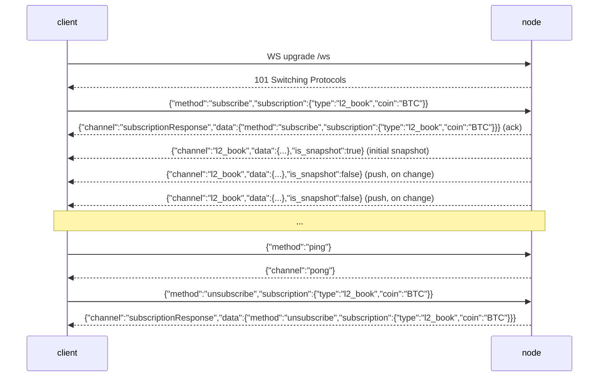

# واجهة برمجة تطبيقات WebSocket

:::info
**الحالة.** تعمل حاليًا على العقدة لقنوات `l2_book` و`bbo` (دفتر الأوامر / أعلى الدفتر) و`trades` و`active_asset_ctx` (علامة السعر / سعر الأوراكل / التمويل / الفائدة المفتوحة لكل سوق) و`all_mids` و`fills` و`user_events` و`candles` (شمعات OHLCV المتجددة لكل `(coin, interval)`) — وجميعها تدفع البيانات المُثبَّتة فعليًا، وتُشغَّل بناءً على التغييرات فحسب (يُصدر القناة إطارًا فقط حين يتغير حالتها منذ آخر إثبات) — بالإضافة إلى `post` (طلب/استجابة عبر WS) و`ping`/`pong`. راجع [الاشتراكات](./subscriptions.md) للاطلاع على أشكال كل قناة.
:::

:::info
**أسماء القنوات بتنسيق snake_case (الأصيل في MTF).** سطح `/ws` للعقدة هو الأصيل في MTF، لذا تأتي أسماء القنوات على السلك بتنسيق snake_case: `l2_book` و`bbo` و`trades` و`active_asset_ctx` و`fills` و`candles` و`user_events`. أما العملاء الراغبون في أسماء القنوات بتنسيق camelCase الخاص بـ HL (مثل `l2Book` و`userEvents` و`userFills` و`candle` وغيرها) فيتصلون بـ **`/hl/ws`** في البوابة (متوافق مع HL)، التي تُترجمها داخليًا إلى snake_case الأصيل. وفقًا لتوجيه البوابة الموحَّدة: `<net>-gateway.mtf.exchange/ws` = snake_case الأصيل، و`/hl/ws` = camelCase الخاص بـ HL.
:::

## ملخص سريع

تُعدِّد اتصال WS واحد اشتراكاتٍ في قنوات متعددة. يعكس بروتوكول الإطارات بروتوكول HL (`{"method":"subscribe","subscription":{"type":...}}`), غير أن **أسماء القنوات هي snake_case الأصيل في MTF** (مثل `l2_book` و`user_events`): ترسل اشتراكًا، فيُجيبك الخادم بتأكيد `subscriptionResponse` يعقبه لقطة أولية، ثم يدفع إطارات `{"channel":...,"data":...}` عند كل إثبات لحالة. قنوات الدفتر (`l2_book` و`bbo`) مرتبطة **بكل سوق على حدة** وتستلزم تحديد `coin`. اقرأ هذه الصفحة لفهم دورة حياة الاتصال، وراجع [الاشتراكات](./subscriptions.md) لكتالوج القنوات.

## عنوان URL

```
wss://<net>-gateway.mtf.exchange/ws
```

WS الأصيل في MTF (قنوات snake_case) هو الافتراضي في البوابة على المسار `/ws`؛ أما WS المتوافق مع HL (قنوات camelCase) فيتوفر على `/hl/ws`. تُنهي البوابة الأمامية تشفير TLS (`wss://`). عند تشغيل العقدة بنفسك، يُقدَّم WS الأصيل ذاته عبر الاتصال العادي على `ws://localhost:8080/ws` — بروتوكول الإطارات متطابق في كلتا الحالتين.

## دورة حياة الاتصال



## الإطارات

جميع الإطارات هي إطارات **نصية** بتنسيق JSON. تُرفض الإطارات الثنائية بإطار خطأ (يبقى الاتصال مفتوحًا). تُفهرَس الإطارات الواردة بحقل `method`؛ وتُفهرَس الإطارات الصادرة بحقل `channel`.

### `subscribe`

```json
{
  "method": "subscribe",
  "subscription": { "type": "<channel>", "coin": "<coin>" }
}
```

- `subscription.type` (مطلوب) — اسم القناة (بتنسيق snake_case، مثلًا `l2_book`). تُنتج الأسماء غير المعروفة إطار خطأ.
- `subscription.coin` (مطلوب لقنوات كل سوق على حدة `l2_book` / `bbo` / `trades` / `active_asset_ctx`؛ يُحذف في حالة `user_events`) — راجع [معامل Coin](#coin-parameter).

يرد الخادم بـ **إطارَين** بالترتيب:

1. التأكيد:

```json
{
  "channel": "subscriptionResponse",
  "data": { "method": "subscribe", "subscription": { "type": "l2_book", "coin": "BTC" } }
}
```

2. إطار لقطة أولية على القناة المشترك فيها (راجع كل قناة في [الاشتراكات](./subscriptions.md)). بالنسبة لـ `l2_book` / `bbo` هي لقطة حقيقية لآخر دفتر أوامر مُثبَّت؛ أما القنوات التي ليس لها مصدر حي بعد فتُعيد محتوى فارغًا لكنه صحيح.

يُتجاهَل الاشتراك المكرر في نفس `(type, coin)` **صامتًا** (لا تأكيد ثانٍ، لا خطأ) — تطابقًا مع سلوك HL.

### `unsubscribe`

```json
{ "method": "unsubscribe", "subscription": { "type": "l2_book", "coin": "BTC" } }
```

التأكيد (يعكس تأكيد الاشتراك مع `method: "unsubscribe"`):

```json
{
  "channel": "subscriptionResponse",
  "data": { "method": "unsubscribe", "subscription": { "type": "l2_book", "coin": "BTC" } }
}
```

بعد التأكيد لا تصل مزيد من الإطارات على تلك `(type, coin)` حتى تعيد الاشتراك. إلغاء الاشتراك في `(type, coin)` لم تشترك فيها أصلًا هو عملية بلا أثر (لا تزال تتلقى التأكيد).

### `ping` / `pong`

```json
{ "method": "ping" }
```

```json
{ "channel": "pong" }
```

`{"method":"ping"}` البسيط (بدون `subscription`) هو إشارة حيوية على مستوى التطبيق؛ يرد الخادم بـ `{"channel":"pong"}`. تُجيب العقدة أيضًا على نبضات إطار تحكم WebSocket المنخفضة المستوى (RFC 6455 `Ping`) بـ `Pong` تلقائيًا، لذا يعمل كلا آليتَي الإشارة الحيوية.

### إطار الخطأ

أي إطار وارد مشوه أو غير معروف يُنتج إطار خطأ **دون إغلاق الاتصال**:

```json
{ "channel": "error", "data": { "error": "<reason>" } }
```

الأسباب تشمل: JSON مشوه، غياب `method`، غياب `subscription` / `subscription.type`، اسم قناة غير معروف (`"unknown channel: <name>"``)، إطار ثنائي، أو method غير معروفة. يستطيع العميل تصحيح المشكلة وإعادة المحاولة على نفس الاتصال.

### رسائل الدفع

تتشارك إطارات البيانات الحية في غلاف واحد:

```json
{ "channel": "<channel>", "data": { /* channel-specific */ }, "is_snapshot": false }
```

- `is_snapshot` قيمة منطقية: `true` في الإطار الأولي عند الاشتراك (اللقطة الكاملة)، و`false` في الدفعات اللاحقة المشغَّلة بالتغييرات. **كل إطار يحتوي على لقطة كاملة** (مثلًا `l2_book` يحتوي على أعلى 20 مستوى كاملة، و`all_mids` الخريطة الكاملة، و`account_state` حالة الحساب كاملة) — `is_snapshot` للإعلام فحسب، وليس علامة "هذا فرق". يبقى العميل الذي يستبدل حالته المحلية عند كل إطار صحيحًا ويمكنه تجاهل هذا الحقل.
- علامة اللقطة في الغلاف **مدركة للهجة**، تمامًا كأسماء `type` في القنوات: في نقطة التركيب الأصيلة `/ws` تكون snake_case بصيغة `is_snapshot`؛ أما في نقطة التركيب المتوافقة مع HL `/hl/ws` فنفس الحقل يكون camelCase بصيغة `isSnapshot`.
- **لا** يوجد حقل `seq` أو `ts` أو `sub_id` في الإطار. استخدم `channel` للتمييز (وللقنوات المرتبطة بأسواق محددة، استخدم `coin` داخل `data`).

التحديثات **مشغَّلة بالتغييرات**: بعد كل إثبات تنشر العقدة إطارًا لقناة مشترَك فيها **فقط حين تتغير حالة تلك القناة المُثبَّتة فعليًا** منذ الإثبات السابق. الإثبات الذي لا يمس قناة مراقَبة لا يُصدر شيئًا لها — لذا تتلقى إطارات أقل من عدد الكتل، ولا إعادة دفع زائدة لبيانات لم تتغير (راجع [الدفع لكل مشترك](#per-subscriber-push)).

### `post` (طلب/استجابة عبر WS)

يتيح لك `post` إصدار استدعاء طلب/استجابة منفرد عبر نفس الاتصال بدلًا من فتح اتصال REST. جسم `request` هو نفس غلاف `{type, payload}` الذي تقبله مسارات REST ويُوزَّع عبر **نفس المعالجات تمامًا** كـ `POST /info` و`POST /exchange` — بما في ذلك التحقق من التوقيع على الإجراءات.

الطلب:

```json
{
  "method": "post",
  "id": 42,
  "request": { "type": "info", "payload": { "type": "node_info" } }
}
```

الاستجابة (ربطها بـ `id`):

```json
{
  "channel": "post",
  "data": {
    "id": 42,
    "response": { "type": "info", "payload": { /* same body as POST /info */ } }
  }
}
```

- `request.type` هو إما `"info"` أو `"action"`.
- في حالة `"action"`، يجب أن يكون `payload` غلاف تبادل موقَّعًا كاملًا (`signature` / `nonce` / `action`)، مطابقًا لـ [`POST /exchange`](../rest/exchange.md). يُوقَّع الإجراء على **تسلسل `serde_json` المضغوط لكائن `action`** — الصورة الحتمية الأساسية التي يُثبِّت عليها SDK.
- تُعاد الأخطاء كإطار `post` عادي يحتوي على `response.type: "error"` وسلسلة نصية في `payload` (لا يُغلق الاتصال أبدًا):

```json
{ "channel": "post", "data": { "id": 42, "response": { "type": "error", "payload": "<message>" } } }
```

الإجراء الفاشل لكن المُشكَّل بشكل صحيح (مثلًا توقيع خاطئ) يُعاد كاستجابة `action` عادية تحتوي على `payload.accepted: false` وسلسلة `error`، لا كاستجابة من نوع `error`.

## معامل Coin

مركز التوزيع مُفهرَس بـ `(channel, coin)`. بالنسبة لقنوات كل سوق `l2_book` و`bbo` هذا يعني:

- **`coin` مطلوب.** بدونه تقع في الدلو `(channel, None)` الذي لا يكتب إليه ناشر دفتر أوامر كل سوق أبدًا — ستتلقى اللقطة الأولية الفارغة فقط دون أي تحديثات حية.
- **المشترك في `BTC` لا يتلقى سوى إطارات `BTC`.** إثباتات ETH لا تصل إلى اشتراك BTC، والعكس صحيح.

يُوحَّد `coin` إلى **سلسلة نصية لمعرف الأصل** قبل الفهرسة، لذا يُحلَّل شكلان إلى نفس الدلو:

- **معرف أصل رقمي** — مثل `"0"` أو `"7"` — يُعيَّن مباشرة إلى ذلك السوق (المفتاح الأصيل في MTF).
- **رمز** — مثل `"BTC"` — يُحلَّل مقارنةً بالكون المُثبَّت (`mip3_market_specs`، بالمطابقة على `symbol` أو `asset_name`) إلى معرف الأصل الخاص به.

لذا يتشارك المشترك المُفهرَس بـ `"BTC"` والمشترك بالمعرف الرقمي `"0"` (إذا كان BTC هو الأصل 0) **نفس** دلو التوجيه عند النشر لكل إثبات. الرمز الذي ليس رقميًا ولا رمزًا معروفًا في الكون يُحتفظ به كما هو في دلوه الخاص — تتلقى التأكيد واللقطة الفارغة دون إطارات حية أبدًا (تعامل صادق مع "سوق غير معروف" بدلًا من تعيين مُخترَع).

## الدفع لكل مشترك

الدفعات **مقيَّدة بالمشتركين، ومخصصة لكل سوق، ومشغَّلة بالتغييرات**. بعد كل كتلة مُثبَّتة تتحقق العقدة، لكل سوق، من `has_receivers(channel, coin)` — بحث بتعقيد O(1) — وعندها فقط تجمع دفتر أوامر ذلك السوق وتبثه **فقط إذا تغيّر** منذ الإثبات السابق. النتائج:

- السوق الذي لا يراقبه أحد لا يتكلف سوى التحقق O(1)؛ لا يُبنى أي دفتر.
- المشترك في `BTC` لا يُشغِّل بناء دفتر `ETH` أبدًا.
- السوق الذي لم يتغير دفتره في إثبات ما لا يُبث له شيء في ذلك الإثبات — لا إعادة دفع زائدة.
- تُسلَّم الإطارات إلى **جميع** المشتركين الحاليين في دلو `(channel, coin)` ذاك.

## ضغط الظهر والتأخر

كل اشتراك مدعوم بمخزن حلقي محدود للبث (بسعة **256** إطارًا). المستهلك الذي يتأخر أكثر من 256 إطارًا **يُسقَط**: يرسل الخادم إطار خطأ أخير يصف التأخر ثم يتوقف عن إرسال الاشتراك.

```json
{ "channel": "error", "data": { "error": "lagged behind broadcast by <n> messages" } }
```

عند هذه الإشارة، أعد الاشتراك (ستحصل على لقطة جديدة). العقدة **لا** تتخطى صامتةً — على سلسلة مشتقات، الفجوة في حالة دفتر الأوامر أسوأ من الإسقاط الصريح.

## المصادقة

قنوات السوق العامة (`l2_book` و`bbo` و`trades` و`all_mids`) **لا تستلزم مصادقة**.

قنوات كل حساب (`fills` و`user_events`) حية وتُوجَّه لكل عنوان `user` بصيغة 0x، لكن **لا توجد بوابة مصادقة بعد** — أي اتصال يمكنه الاشتراك في تغذية أي عنوان (البيانات هي نفس التعبئات المُثبَّتة العامة، مُفهرَسة بالحساب). غلاف مصادقة عند الاشتراك (بحيث يرى الاتصال حسابه الخاص فقط) موجود في خارطة الطريق. لعمليات القراءة/الكتابة الموثَّقة اليوم، استخدم قناة `post` (قراءات المعلومات، والإجراءات الموقَّعة عبر نفس التحقق EIP-712 كـ `POST /exchange`). راجع [الاشتراكات](./subscriptions.md).

## التعدد

يمكن لاتصال واحد الاحتفاظ باشتراكات متعددة؛ يُفكَّك كل منها بـ `(channel, coin)`. يملك كل اشتراك مستقبل بث وبرنامج إعادة توجيه خاص به؛ يخلط الاتصال إطاراتها على الاتصال الواحد. وجِّه الإطارات الواردة بـ `channel` زائد `coin` داخل `data`.

```
l2_book  coin "0" (BTC)
l2_book  coin "1" (ETH)
bbo      coin "0" (BTC)
```

## سلوك الإغلاق

- إطار `close` من العميل (أو EOF) يُفكك الاتصال ويُلغي كل مهام إعادة التوجيه.
- خطأ في القراءة يُسجَّل ويُغلق الاتصال.
- الاشتراك المتأخر يُسقَط بشكل فردي (إطار خطأ)، لكن **الاتصال يبقى مفتوحًا** — الاشتراكات الأخرى تستمر في التدفق.

لا توجد جدول رموز إغلاق مخصصة اليوم؛ رموز إغلاق WebSocket القياسية سارية.

## استراتيجية إعادة الاتصال

1. عند قطع الاتصال، أعد الاتصال بتراجع أسي (المقترح: قاعدة 200 ملي ثانية، حد أقصى 30 ثانية، اهتزاز ±20%).
2. أعد الاشتراك في كل `(type, coin)` من البداية. الإطار الأول بعد كل اشتراك هو لقطة جديدة، لذا لا رمز استئناف للإدارة — تجاهل حالة الدفتر المحلية وأعد بناءها من اللقطة.
3. عند إطار خطأ `lagged`، تعامل معه كانقطاع اتصال لذلك الاشتراك وأعد الاشتراك.

:::warning
**لا** يوجد آلية `seq` / `resume` / `resume_token` اليوم. كل (إعادة) اشتراك يبدأ من لقطة جديدة. مخازن الاستئناف في خارطة الطريق ولم تُنفَّذ بعد.
:::

## انظر أيضًا

- [كتالوج اشتراكات WS](./subscriptions.md)
- [`POST /exchange`](../rest/exchange.md) — نفس غلاف EIP-712 المستخدم في مسار إجراءات `post`
- [`POST /info`](../rest/info.md) — مكافئات REST للقراءات المنفردة (متاحة أيضًا عبر `post`)
