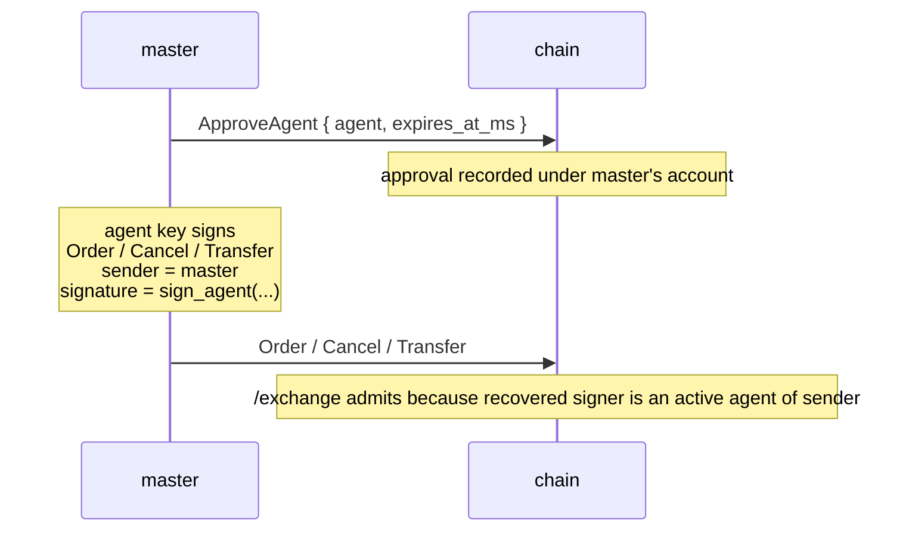

# محافظ الوكلاء

:::tip
**مستقر.**
:::

**محفظة الوكيل** (المعروفة أيضًا بـ"محفظة API") هي مفتاح يوقّع إجراءات التداول نيابةً عن الحساب الرئيسي دون أن يمتلك صلاحية السحب في أي وقت. هذه هي الطريقة التي يعمل بها كل صانع سوق جاد فعلًا: يبقى المفتاح الرئيسي في التخزين البارد، بينما يشغّل مفتاح ساخن بوتات التداول.

نفس البنية الأساسية التي تعتمدها محافظ API في أبرز منصات DEX للعقود الدائمة على السلسلة. متوافق مباشرةً على مستوى البروتوكول.

## لماذا تستخدم هذه الميزة

- **المفتاح الرئيسي في تخزين بارد.** وافق مرة واحدة من التخزين البارد، ولن تحتاج بعد ذلك إلى التوقيع مجددًا من المفتاح عالي القيمة.
- **نطاق عمل مخصص لكل بوت.** وكلاء مختلفون لكل استراتيجية أو كل جهاز؛ إلغاء الوكيل المخترق لا يؤثر على الآخرين.
- **انتهاء الصلاحية.** الموافقة مع طابع زمني للانتهاء؛ ينتهي المفتاح من تلقاء نفسه حتى لو نسيت إلغاءه.
- **التدقيق.** كل إجراء موقّع من وكيل محدد، ما يجعل سجل السلسلة نظيفًا من الناحية الجنائية.

## دورة الحياة



يوقّع المفتاح الرئيسي `ApproveAgent` مرة واحدة. بعد تأكيد ذلك الكتلة، يمكن للوكيل توقيع أي إجراء باستخدام `sender = master_addr` وتعامله السلسلة كما لو وقّعه المفتاح الرئيسي. يمكن أن تتضمن الموافقات تاريخ انتهاء صريحًا حتى تتقاعد المفاتيح الساخنة تلقائيًا حتى دون إلغاء صريح.

## فحص التفويض

كل طلب إلى [`POST /exchange`](../api/rest/exchange.md) يحمل ثلاثة عناصر:

```
sender    = "0x<claimed master address>"
signature = secp256k1 ECDSA over the EIP-712 envelope
action    = the state-mutating action
```

تُجري السلسلة هذا الفحص عند كل قبول:

```
recovered_addr = ecrecover(eip712_envelope(action), signature)

if recovered_addr == sender:
    admit                                # master signed
else if recovered_addr is an active agent of sender (not expired):
    admit                                # an active agent of sender signed
else:
    return 401
```

نتيجتان جديرتان بالإشارة:

1. **لا رموز حاملة، لا مفاتيح API.** التوقيع نفسه هو المصادقة. امتلاك المفتاح الخاص للوكيل هو ما يُثبت الصلاحية؛ لا شيء في رابط الطلب أو رؤوسه يمنح الوصول.
2. **`sender` يُثق به من جانب الخادم فقط بسبب التوقيع.** الإدعاء بـ`sender = anyone` لا يُثبت شيئًا حتى يتطابق المُسترد من التوقيع مع مجموعة الموافقات لذلك الحساب.

## غلاف EIP-712 بالتفصيل

الحمولة الموقّعة لأي إجراء هي:

```
message_hash  = keccak256( msgpack(action) )
signed_hash   = keccak256( 0x1901 ‖ domain_separator ‖ message_hash )
signature     = secp256k1_sign( signed_hash, agent_private_key )
```

حيث:

```
domain_separator = keccak256(
    keccak256("EIP712Domain(string name,string version,uint256 chainId,address verifyingContract)") ‖
    keccak256("MetaFlux") ‖
    keccak256("1") ‖
    chain_id_as_uint256_be ‖
    address(0).padded_to_32
)
```

هذا التركيب يتطابق مع دلالات الغلاف القياسي لـEIP-712؛ العملاء على مكدس EVM الذين يدعمون EIP-712 بالفعل (MetaMask، Rabby، Ledger، WalletConnect) يمكن توجيههم إلى هذا النطاق دون تعديل.

يُوقَّع `action` كـ**بيانات مهيكلة ذات أنواع وفق EIP-712** — نوع أساسي واحد لكل متغير من متغيرات الإجراء (`MetaFluxTransaction:<Action>`)، ما يجعل المحافظ تعرض كل حقل باسمه. راجع [توقيع البيانات المهيكلة](../integration/typed-data-signing.md) للاطلاع على سلاسل الأنواع الخاصة بكل إجراء. استرداد التوقيع وتوافق EVM يبقيان دون تغيير سواء وقّع المفتاح الرئيسي أو وكيل معتمد.

## ما تخزّنه السلسلة

لكل حساب رئيسي، مجموعة وكلاء معتمدين:

```
approval = {
  agent          : address (20 bytes),
  approved_at_ms : u64 (block time at approval),
  expires_at_ms  : u64 or null (null = no expiry),
  name           : optional label for bookkeeping
}
```

جميع حقول الوقت مشتقة من وقت الكتلة عبر الإجماع، وليس من الساعة الجدارية. الحتمية: كل مدقق يتفق على حالة الوكيل عند نفس ارتفاع الكتلة.

## اعتماد وكيل

يُرسل المفتاح الرئيسي إجراء `ApproveAgent` عبر [`POST /exchange`](../api/rest/exchange.md):

```json
{
  "sender":    "0x<master_addr>",
  "signature": "0x<master_signature>",
  "action": {
    "type": "ApproveAgent",
    "params": {
      "agent":          "0x<agent_addr>",
      "expires_at_ms":  1735689600000,
      "name":           "trading-bot-1"
    }
  }
}
```

`expires_at_ms`:
- `null` ← لا انتهاء للصلاحية (يبقى حتى إلغائه صراحةً)
- عدد صحيح موجب ← وقت يونكس بالميلي ثانية، بعده ترفض السلسلة الطلبات الموقّعة من الوكيل

`name` هو مجرد تسمية لأغراض متابعتك الخاصة — يظهر في استعلامات `userState` / `subAccounts`.

## التداول من خلال الوكيل

بعد تأكيد كتلة الاعتماد، وقّع أي شيء بمفتاح **الوكيل** لكن أرسل مع عنوان **الحساب الرئيسي** كـ`sender`. تتولى SDK الخاصة بك إنشاء غلاف EIP-712 وإرسال الحزمة الموقّعة. تسترد السلسلة عنوان الوكيل من التوقيع، تلاحظ عدم التطابق مع `sender`، تتحقق من مجموعة الموافقات، ثم تقبل الطلب.

## تأخير الانتشار

بعد تأكيد `ApproveAgent` عند ارتفاع الكتلة `H`:
- الطلبات في الكتلة `H+1` وما بعدها ترى الاعتماد الجديد

عمليًا، يعني هذا: انتظر دورة إجماع واحدة بعد إرسال `ApproveAgent` قبل البدء في حركة مرور موقّعة من الوكيل. سياسة إعادة المحاولة في SDK مع التراجع الخطي تتعامل مع هذا الحد بشكل نظيف.

تشديد انتهاء الصلاحية (ما يعادل تقاعد الوكيل) يتبع نفس التأخير لكتلة واحدة.

## التدوير وانتهاء الصلاحية

طريقتان لإيقاف عمل الوكيل:

- **انتهاء الصلاحية** يُحدَّد عند وقت الاعتماد وينفَّذ تلقائيًا — حالما يكون `now > expires_at_ms`، تفشل الطلبات. لا حاجة لإرسال أي شيء آخر.
- **إعادة الاعتماد** بانتهاء صلاحية مُشدَّد. إرسال `ApproveAgent` جديد لنفس عنوان الوكيل يستبدل السجل السابق؛ تعيين `expires_at_ms` إلى الماضي يُقاعد المفتاح فعليًا.

للتدوير الاعتيادي، يُفضَّل اعتماد انتهاء الصلاحية. تتعامل SDK مع دورة التجديد بشفافية.

## الحماية من إعادة التشغيل

تفرض السلسلة أرقام تسلسل (nonces) لكل مستخدم:

- كل إجراء يحمل `nonce`
- إعادة استخدام نفس الـ`nonce` ضد المستخدم ذاته يُرفض حتى لو كان التوقيع صحيحًا في جوانب أخرى

الأثر العملي: يمكن للوكيل نفسه إرسال إجراءات متزامنة بأمان ما دام كل منها يحمل `nonce` فريدًا. تستخدم SDK عادةً وقت يونكس بالميلي ثانية مع اهتزاز عشوائي.

بالنسبة للطلبات الموقّعة من وكيل، تنتمي فضاء الـ`nonce` إلى **الحساب الرئيسي** (`sender`)، لا إلى الوكيل. وكيلان مختلفان للحساب الرئيسي نفسه يشتركان في نفس فضاء الـ`nonce`.

## قائمة مراجعة الإنتاج

أنماط مُختبرة ميدانيًا لتشغيل أسطول مفاتيح وكلاء في بيئة الإنتاج:

| البند | السبب |
|------|-----|
| المفتاح الرئيسي في تخزين بارد (محفظة مادية / HSM) | المفتاح الرئيسي لا يوقّع إلا `ApproveAgent` (و`WithdrawUsdc` عند السحب) — أحداث نادرة |
| وكيل واحد لكل مضيف / حاوية | إذا اختُرق مضيف، لا تتعرض إلا صلاحية ذلك الوكيل؛ ألغِ دون التأثير على الآخرين |
| `expires_at_ms` مضبوط على ≤ 30 يومًا من الاعتماد | يفرض دورة تجديد؛ تجاهل التجديد يعادل إلغاءً تلقائيًا |
| اسم الوكيل يُضمَّن فيه المضيف ووقت البدء | يجعل التدقيق الجنائي بديهيًا: `mm-host-3 / 2026-Q2` |
| سكريبت التدوير: استعداد مسبق بوكيل جديد قبل انتهاء صلاحية القديم | أرسل `ApproveAgent` للمفتاح الجديد قبل 24 ساعة من انتهاء القديم؛ حوّل حركة المرور؛ اترك القديم ينتهي |
| تمرين الاختراق: كتيب تشغيل للإلغاء والتدوير يُختبر ربع سنوي | عند تسرب مفتاح فعليًا، يُهم التنفيذ الميكانيكي |
| مراقبة `userEvents` لأحداث `agentApproved` / `agentExpired` | تأكيد أن حالة السلسلة تتطابق مع توقعاتك |
| استخدام وكيل مختلف للإلغاء فقط مقابل التداول الكامل | مفاتيح الإلغاء فقط أكثر أمانًا في البيئات شبه الموثوقة |

### نمط التدوير

```
day -1   submit ApproveAgent { agent: new_key, expires_at_ms: NOW + 30d }
          wait 1 block (consensus tick); confirm via /info agents
day 0    flip traffic in your bot: stop using old_key, start using new_key
day 0    submit ApproveAgent { agent: old_key, expires_at_ms: NOW + 1h }
          to bound the old key's remaining authority window
day +1h  old_key expires automatically
```

الاستعداد المسبق يتجنب أي نافذة يمكن فيها استخدام المفتاحين معًا بالتوازي
(وهو أمر مقبول أيضًا — الوكلاء المتزامنون يشتركون في فضاء الـnonce للحساب الرئيسي).

## ما لا يستطيع الوكيل فعله

تصميميًا، لا تملك الوكلاء **أي صلاحية سحب**. أي شيء ينقل الأموال خارج الحساب الرئيسي (سحب إلى سلاسل خارجية، تحويل إلى عناوين أخرى) يجب أن يوقّعه المفتاح الرئيسي. إدارة الوكلاء ذاتها (إنشاء الموافقات أو تمديدها) أيضًا مقتصرة على المفتاح الرئيسي — لا وكيل عن وكيل بأي حال.

*يستطيع* الوكلاء التداول، والإلغاء، وتعديل وضع الهامش ضمن الحدود، ووضع/إلغاء TWAP، وأغلب عمليات التداول الاعتيادية.

## حالات الفشل

| العَرَض | السبب | الحل |
|---------|-------|-----|
| `401` على كل طلب موقّع من وكيل | لم يتم تأكيد الاعتماد بعد | انتظر كتلة واحدة بعد `ApproveAgent` |
| `401` بعد فترة كانت تعمل فيها الأمور | انتهت صلاحية الوكيل | اعتمد من جديد (انتهاء صلاحية جديد) أو دوّر إلى وكيل جديد |
| `401` على إجراءات السحب فقط | الوكلاء لا يملكون صلاحية السحب (تصميميًا) | وقّع عمليات السحب بالمفتاح الرئيسي |
| `401` فوري على حساب رئيسي جديد | `sender` مُعلَن كحساب رئيسي لكن الموقِّع كان شخصًا آخر ولا يوجد اعتماد | تحقق أنك تستخدم المفتاح الصحيح للتوقيع |

## انظر أيضًا

- [`POST /exchange`](../api/rest/exchange.md) — مسار القبول
- [جولة إرشادية في التوقيع](../integration/signing.md) — مثال عملي شامل من البداية إلى النهاية لـEIP-712
- [الانتقال من HL](../integration/migrating-from-hl.md) — أنماط جاهزة للتطبيق لبوتات HL
