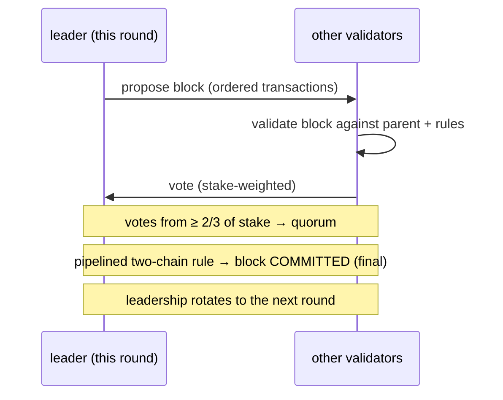
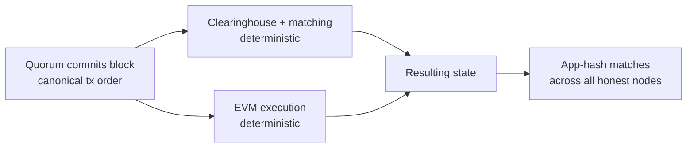

# الإجماع (MetaFluxBFT)

:::info
**مُشغَّل.** MetaFluxBFT هو محرك الإجماع الإنتاجي الذي يؤمّن
L1 الخاص بـ MetaFlux. يُرتّب كل معاملة — الأوامر، والإلغاءات، والتصفيات، والتحويلات،
واستدعاءات EVM — في سلسلة قانونية واحدة ذات نهائية حتمية وفورية.
:::

## ملخص سريع

**MetaFluxBFT** هو محرك إجماع إثبات الحصة (BFT) المقاوم للأخطاء البيزنطية في MetaFlux.
تتفق مجموعة من المدققين موزونة بالحصص، كتلةً بكتلة،
على ترتيب قانوني أحادي لكل معاملة. بمجرد تأكيد كتلة
بواسطة النصاب، تصبح **نهائية فوريًا** — لا تأكيدات احتمالية، ولا
"انتظر N كتلة"، ولا إعادة تنظيم. هذا الترتيب الكلي الفوري هو بالضبط
ما يُتيح لـ MetaFlux تشغيل دفتر أوامر وغرفة مقاصة كاملين على السلسلة: كل
تطابق وتعبئة ودفعة تمويل وتصفية تتسوّى مقابل أمر يتفق عليه
الشبكة بأسرها مسبقًا.

## لماذا تحتاج منصة التداول إلى هذا

تكون منصة التداول عادلة فقط حين يرى الجميع الدفتر ذاته بالترتيب ذاته.
يوفر MetaFluxBFT خاصيتين تهمان المتداولين والمطورين مباشرةً:

| الخاصية | ما تعنيه بالنسبة لك |
|----------|------------------------|
| **الترتيب الكلي** | لكل معاملة موضع متفق عليه في التسلسل. يعالج محرك التطابق الأوامر بذلك الترتيب تحديدًا — لا توجد قناة جانبية مُميَّزة قادرة على إعادة ترتيب الأوامر حولك. |
| **النهائية الفورية** | لا يمكن التراجع عن كتلة مؤكدة. تُعدّ التعبئة أو التسوية منتهية في لحظة تأكيدها — لن تحتاج أبدًا إلى الخصم بسبب احتمال إعادة التنظيم. |

يوفر هذان العنصران معًا **تطابقًا مقاومًا للتقدم** و**تسوية فورية**:
التسلسل القانوني ذاته الذي يؤمّن السلسلة هو التسلسل الذي يُطابق دفتر الأوامر وفقه.

## السياق التصميمي

MetaFluxBFT هو تطبيق **أصيل لـ MetaFlux** ينتمي أكاديميًا إلى عائلة بروتوكولات BFT
المُخطَّطة **HotStuff / Jolteon** (سلسلة الأبحاث التي تشمل أيضًا DiemBFT). تتميز هذه العائلة بما يلي:

- **قائمة على القائد** — في كل جولة يقترح مدقق واحد الكتلة التالية،
  ويصوّت الآخرون عليها.
- **متزامنة جزئيًا** — تظل *آمنة* (لا تُنتج تاريخًا نهائيًا متعارضًا)
  في جميع الأوقات، وتُحرز *تقدمًا* بمجرد أن تبدأ الشبكة
  في تسليم الرسائل في الوقت المناسب.
- **تأكيد ثنائي السلسلة** — تُحقق النهائية من خلال سلسلة قصيرة مُخطَّطة من
  الأصوات بدلاً من جولة واحدة كاملة أو لا شيء، مما يُبقي زمن التأكيد
  منخفضًا مع الحفاظ على أمان BFT.

تبني MetaFlux محركها الخاص على هذه الأسس البحثية العامة بدلاً من
تفريع قاعدة كود موجودة، حتى يمكن ضبط البروتوكول لاحتياجات منصة
تداول على السلسلة (تنفيذ حتمي، EVM متكامل، مجموعة مدققين مشتقة من الحصص).

## المدققون والتحصيص

تُستمَد مجموعة المدققين مباشرةً من **الحصص على السلسلة** — إذ إن MetaFluxBFT بروتوكول
إثبات حصة. يمكن لأي شخص يستوفي متطلبات الحصة تشغيل مدقق؛ والمفوّضون يدعمون المدققين بـ MTF (انظر [التحصيص](./staking.md)).

- **تصويت موزون بالحصة.** تأثير المدقق في الإجماع
  يتناسب مع الحصة المُسندة إليه، لا بصوت واحد لكل عقدة.
- **النصاب = ثلثا الحصة.** لا تُؤكَّد كتلة إلا حين يصوّت عليها مدققون
  يمثلون **ما لا يقل عن ثلثي إجمالي قوة التصويت المُحصَّصة**.
  هذا النصاب الثنائي هو جوهر ضمان BFT.
- **تدوير القيادة.** يتناوب حق الاقتراح بين المدققين، لذا
  لا يسيطر مدقق واحد على إنتاج الكتل.

### الحقب

تكون مجموعة المدققين ثابتة خلال **الحقبة** ولا يمكن تغييرها إلا عند حدود الحقب.
يُبقي تثبيت المجموعة طوال الحقبة الإجماعَ حتميًا وقابلاً للتنبؤ، مع إتاحة
تطور المجموعة بمرور الوقت بحسب تحولات الحصص وانضمام المدققين ومغادرتهم. عند انتهاء حقبة،
يعتمد البروتوكول المجموعة الجديدة المشتقة من الحصص للحقبة التالية.

## الأمان والحيوية

يحدد ضمانان ما يعد به MetaFluxBFT بالمفهوم الكلاسيكي لـ BFT:

:::tip الأمان
**لا تُنهي السلسلة أبدًا تاريخين متعارضين**، طالما أن **أكثر من
ثلثي** قوة التصويت المُحصَّصة نزيهة. بصياغة مكافئة، يتحمل MetaFluxBFT
ما يصل إلى **ثلث** قوة التصويت التي تكون بيزنطية (معطلة بشكل عشوائي)
دون أن يُؤكد كتلًا متعارضة قط. يظل الأمان قائمًا حتى حين
تكون الشبكة بطيئة أو الرسائل متأخرة.
:::

:::tip الحيوية
**تواصل السلسلة إحراز التقدم** — بتأكيد كتل جديدة — بمجرد أن تكون الشبكة
متزامنة بما يكفي لتسليم الرسائل في الوقت المناسب. ولأن القيادة تتدوّر،
لا يستطيع قائد واحد متوقف أو غير مستجيب إيقاف السلسلة: يُمرر
البروتوكول القيادة إلى الأمام ويواصل العمل.
:::

هذا هو الفصل المعياري في BFT المتزامن جزئيًا: *الأمان دائمًا*،
*الحيوية عند التزامن*.

## النهائية والتنفيذ الحتمي

النهائية في MetaFluxBFT **فورية ومطلقة**. في اللحظة التي يُؤكد فيها النصابُ كتلةً،
تصبح تلك الكتلة — وترتيب المعاملات الدقيق الذي تحمله — دائمةً. لا توجد
فترة تسوية احتمالية ولا خطر إعادة تنظيم.

يُبنى التنفيذ فوق ذلك الترتيب المُؤكَّد، وهو **حتمي بالكامل**:

1. يُحدد الإجماع الترتيب القانوني للمعاملات في كتلة.
2. تُشغّل كل عقدة **انتقال الحالة ذاته** على ذلك الترتيب —
   غرفة المقاصة ومحرك التطابق للتداول، وEVM لمعاملات العقود الذكية.
3. ولأن المدخلات (المعاملات المُرتَّبة) ودالة الانتقال متطابقة،
   تصل كل عقدة نزيهة بشكل مستقل إلى **الحالة الناتجة ذاتها**.

تتحقق العقد من اتفاقها بمقارنة بصمة مدمجة للحالة الناتجة (تُسمى "app-hash"). الترتيب المتطابق مع التنفيذ الحتمي يعني أن app-hash لكل عقدة نزيهة تتطابق — تظل الشبكة في توافق تام دون الثقة بحسابات عقدة واحدة.

## المساءلة

يتحمل المدققون مساءلة اقتصادية عن طريقة مشاركتهم. يمكن **سجن** المدقق الذي
**يُثبت سوء سلوكه** (إزالته من المشاركة الفعلية) و**تقليص حصته**
(خسارة جزء من الحصة). يمكن أن يؤدي عدم التوفر المستمر أيضًا إلى السجن.
يربط هذا المركزَ الاقتصادي للمدقق بالعمل النزيه ويدعم ضمانات الإجماع بحصة حقيقية
في خطر. ينبغي للمفوّضين تقييم سجل تشغيل المدقق؛
انظر [التحصيص](./staking.md) لمعرفة كيفية انعكاس التقليص والسجن على
الحصة المُفوَّضة.

## كيف تتكامل الأجزاء

MetaFluxBFT هو الأساس الذي يقوم عليه بقية البروتوكول:

- **دفتر الأوامر وغرفة المقاصة** يُطابقان ويُسوّيان وفق الترتيب القانوني الأحادي — هذا ما يجعل التطابق على السلسلة عادلاً.
- تُطبَّق **التصفيات** و**التمويل** عند نقاط مشتقة من الإجماع في
  ذلك الترتيب ذاته، فتُصفّي كل عقدة وتُموّل بشكل متطابق.
- تنفّذ **السلسلة الجانبية EVM** أيضًا على الترتيب المُؤكَّد، مشاركةً النهائية ذاتها.
- **التحصيص** و**الحوكمة** يُغذّيان الإجماع: تُحدد الحصة مجموعة المدققين،
  والمعلمات التي تحددها الحوكمة تُؤكَّد هي ذاتها عبر السلسلة.

## انظر أيضًا

- [التحصيص](./staking.md) — تفويض MTF، ودعم المدققين، وكسب المكافآت، وقواعد التقليص/السجن التي تُؤمّن الإجماع
- [أسعار العلامة](./mark-prices.md) — الأسعار المشتقة من الإجماع التي تُحرك الهامش والتصفية
- [التصفية المتدرجة](./tiered-liquidation.md) — كيفية تطبيق التصفيات على الترتيب المُؤكَّد
- [نموذج تنفيذ EVM](../evm/execution-model.md) — كيف يُنفَّذ EVM على ترتيب الكتلة المُؤكَّد

## الأسئلة الشائعة

Show FAQ

**س: كم عدد التأكيدات التي يجب انتظارها؟**
ج: لا شيء. النهائية فورية — بمجرد تأكيد كتلة، تصبح نهائية ولا يمكن
إعادة تنظيمها. تُسوَّى التعبئة في لحظة تأكيد كتلتها.

**س: هل يمكن للسلسلة التراجع عن صفقة؟**
ج: لا. لا توجد إعادة تنظيم. التاريخ المُؤكَّد دائم.

**س: ماذا يحدث إذا تعطّل القائد الحالي؟**
ج: تتدوّر القيادة. لا يستطيع قائد متوقف إيقاف السلسلة؛ يُمرر البروتوكول
القيادة إلى الأمام ويواصل تأكيد الكتل بمجرد أن تُسلّم الشبكة
الرسائل في الوقت المناسب.

**س: كم من الحصة المعيبة يمكن للشبكة تحملها؟**
ج: يمكن أن يكون ما يصل إلى ثلث إجمالي قوة التصويت المُحصَّصة بيزنطيًا دون أن
تُنهي السلسلة تاريخًا متعارضًا قط. يستلزم الأمان أن يكون أكثر من ثلثي
قوة التصويت نزيهًا.

**س: هل هذا إثبات عمل؟**
ج: لا. MetaFluxBFT هو إثبات حصة — تُشتق مجموعة المدققين وقوة التصويت
من حصة MTF على السلسلة، لا من التعدين.

