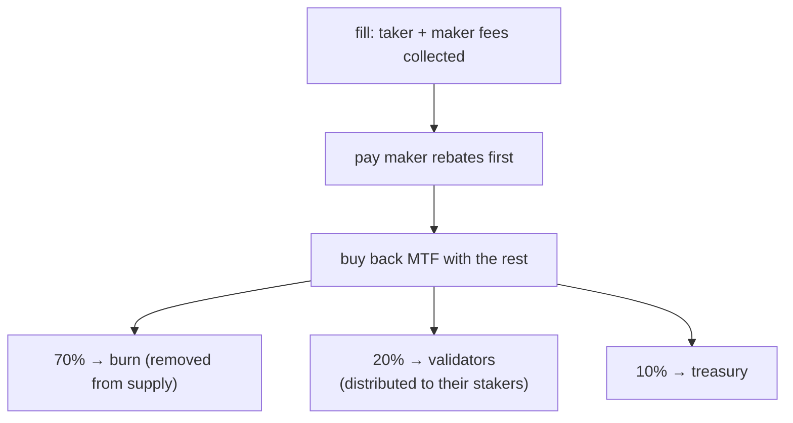

# الرسوم

:::info
**صفحة مفاهيم.** تشرح هذه الصفحة كيفية احتساب رسوم التداول لكل صفقة مُنفَّذة، وعمولات المنشئ والمُحيل، ورسوم السوق الفوري والتصفية، والجهة التي تؤول إليها الرسوم المحصَّلة. للاطلاع على المعدلات الفعلية — شرائح رسوم الحجم، وشرائح خصم صانع السوق، وشرائح خصم التخزين — راجع [جدول الرسوم](./fee-schedule.md). قيم الرسوم معاملات شبكية قابلة للتحديث عبر الحوكمة.
:::

## ملخص سريع

تُفرض على كل صفقة منفَّذة رسوم على صانع السوق وآخذ السيولة، وفق ما يحدده [جدول الرسوم](./fee-schedule.md). يمكن لعمولة المنشئ توجيه نسبة من الرسوم إلى مصدر تدفق الأوامر، كما يمكن لعمولة المُحيل توجيه نسبة من رسوم آخذ السيولة إلى المُحيل. بعد دفع خصومات صانع السوق، يستخدم البروتوكول عائد الرسوم المتبقي **لإعادة شراء MTF**، ثم يوزع MTF المُعاد شراؤه بنسبة **70% حرق / 20% مُحققو العقد / 10% الخزينة**. تُخصَم الرسوم من رصيدك لحظة تنفيذ الصفقة وتظهر في [`userFills`](../api/rest/info.md#user_fills).

## كيفية احتساب الرسوم

تُسوَّى الرسوم على مستوى USDC الكامل: القيمة الاسمية هي حاصل ضرب السعر في الحجم، مُقطَّعًا نحو الصفر.

### لكل صفقة منفَّذة

```text
notional    = |price × size|
taker_fee   = notional × taker_rate
maker_fee   = notional × maker_rate
builder_fee = notional × builder_rate    # additive, taker-only, capped
```

تأتي معدلات آخذ السيولة وصانع السوق من شريحتك في [جدول الرسوم](./fee-schedule.md): معدلك الأساسي المحسوب على حجم التداول خلال 30 يومًا، وخصم إضافي لصانع السوق بناءً على نسبة حجم صنع السوق لديك، وخصم لآخذ السيولة بحسب كمية MTF المُخزَّنة. المعدل الفعلي السلبي لصانع السوق يعني خصمًا يُدفع **لـ** صانع السوق، ممولًا من رسوم آخذي السيولة المحصَّلة على التدفق ذاته — لا يدفع البروتوكول أبدًا أكثر مما يستوفي.

تظهر رسوم كل صفقة منفَّذة في كل إدخال في [`userFills`](../api/rest/info.md#user_fills) تحت حقل `fee` (بوحدات USDC الأساسية؛ موجب = مدفوع، سالب = خصم مستلَم).

## عمولة المنشئ

يمكن لمصدر تدفق الأوامر المطالبة بنسبة من رسوم آخذ السيولة بتحديد عنوان منشئ على الأمر. تُدفع العمولة عند كل صفقة منفَّذة إلى ذلك العنوان. الاستخدامات الشائعة:

- واجهة مستخدم أمامية أو مُجمِّع قام بتوجيه التدفق،
- واجهة برمجية لبيانات السوق تُجمِّع التنفيذ،
- خدمة آلية لإدارة المخاطر تضع أوامر وقائية.

يجب أن يكون المنشئ عنوانًا مسجَّلًا (راجع [`approve_builder_fee`](../api/rest/exchange.md#approve_builder_fee)). يُتجاهل المنشئون غير المسجَّلين بصمت. عمولة المنشئ إضافية ومقتصرة على آخذ السيولة مع حد أقصى لكل أمر، ولا تؤثر على جانب صانع السوق.

## عمولة المُحيل

عندما يكون للحساب مُحيل مُعيَّن، يُوجَّه جزء من **رسوم آخذ السيولة** إلى المُحيل **قبل** توزيع الباقي — يأتي من حصة البروتوكول لا كرسوم إضافية على آخذ السيولة. لا تتضمن رسوم صانع السوق أي عمولة للمُحيل.

الإحالات أحادية المستوى (بدون سلسلة متعددة المستويات — حماية من مخططات بونزي). يُحدَّد المُحيل مرة واحدة باستخدام [`set_referrer`](../api/rest/exchange.md#set_referrer) ويصبح ثابتًا بعد ذلك؛ يُرفض تعيين نفسك مُحيلًا لنفسك.

يمكن لعمولة المنشئ وعمولة المُحيل أن تنطبقا معًا على الصفقة الواحدة — كلتاهما تُصرف بشكل مستقل.

## إلى أين تذهب الرسوم

تتدفق الرسوم المحصَّلة عبر منظومة واحدة لتراكم القيمة:



1. **تُدفع خصومات صانع السوق أولًا.** تُسوَّى معدلات صانع السوق الصافية السالبة (راجع [جدول الرسوم](./fee-schedule.md)) من الرسوم المحصَّلة على التدفق ذاته.
2. **يُستخدم الباقي لإعادة شراء MTF.** جميع عائدات الرسوم المتبقية بعد الخصومات تُستخدم لشراء MTF بسعر السوق وفق سعر البروتوكول المرجعي. يُولِّد ذلك ضغطًا شرائيًا ويُحوِّل عائدات الرسوم إلى MTF قبل توزيعه.
3. **يُوزَّع MTF المُعاد شراؤه بنسبة 70 / 20 / 10:**
   - **70% يُحرق** — يُزال نهائيًا من التداول (أثر انكماشي).
   - **20% يذهب لمحققي العقد**، الذين يوزعونه على المخزِّنين لديهم. هذا هو **عائد المخزِّنين** — يصل عائد الرسوم إلى المخزِّنين عبر حصة محقق العقد الخاص بهم.
   - **10% يذهب للخزينة** (وتمتص الكسور التقريبية لضمان التوزيع الكامل دون فقدان).

تُتابَع إجمالي المجمَّعات التراكمية (MTF المُعاد شراؤه والمحروق، ومجمَّع المحققين، والخزينة) في الحالة المُثبَّتة وتُعرَض في مسار القراءة عبر [`protocol_metrics`](../api/rest/info.md#protocol_metrics):

```bash
curl -X POST https://devnet-gateway.mtf.exchange/info -d '{"type":"protocol_metrics"}'
```

نظرًا لأن عائد المخزِّنين يُسلَّم عبر حصة المحقق، خزِّن المزيد من MTF (أو فوِّض إلى محقق) للحصول على حصة أكبر — راجع [التخزين](./staking.md).

## رسوم السوق الفوري

تنطبق ذات البنية من صانع/آخذ السيولة على صفقات السوق الفوري، غير أن رسومه تُحسَب على **حساب رسوم منفصل** عن العقود الدائمة، وتُؤخذ **من الطرف الذي يستلمه كل طرف** — لا من رصيد العملة المرجعية دائمًا:

- رسوم **آخذ السيولة** تُؤخذ من الطرف الذي يستلمه آخذ السيولة،
- رسوم **صانع السوق** تُؤخذ من الطرف الذي يستلمه صانع السوق.

بذلك، **المشتري** في السوق الفوري (المستلِم للعملة الأساسية) يدفع رسومه بالعملة **الأساسية**، و**البائع** (المستلِم للعملة المرجعية) يدفع رسومه بالعملة **المرجعية**. يمكن لكل زوج فوري تحديد معدل صانع/آخذ السيولة الخاص به؛ عند عدم تحديده يُطبَّق الإعداد الافتراضي العالمي للسوق الفوري. راجع شرائح السوق الفوري في استجابة [`/info fee_schedule`](../api/rest/info.md#fee_schedule)، و[التداول الفوري](../products/spot.md#matching-fills-and-fees) لنموذج التسوية.

## الرسوم على صفقات التصفية

تمر إغلاقات التصفية عبر مسار رسوم آخذ السيولة المعياري الموصوف أعلاه. رسوم التصفية المنفصلة — رسوم إضافية تُوزَّع بين مجمَّع التأمين والخزينة لإبقاء التأمين قادرًا على الوفاء وتعويض صانعي السوق الذين يمتصون التدفق الإجباري — هي توجه تصميمي لم يُفعَّل بعد. عند تفعيلها، ستدفعها الحسابات المُصفَّاة كجزء من الخسارة المُسوَّاة عند الإغلاق، وستظهر مُعلَّمة على صفقات التصفية في [`userFills`](../api/rest/info.md#user_fills). راجع [التصفية المتدرجة](./tiered-liquidation.md) لآليات الإغلاق.

## الاستعلام

```bash
# tier overview (MTF-native — gateway default path; running the node yourself: localhost:8080)
curl -X POST https://devnet-gateway.mtf.exchange/info -d '{"type":"fee_schedule"}'

# your personal tier and recent volume — MTF-native (gateway default path)
curl -X POST https://devnet-gateway.mtf.exchange/info \
  -d '{"type":"user_fees","address":"0x<addr>"}'

# or the HL-compat shape under /hl on the gateway
curl -X POST https://devnet-gateway.mtf.exchange/hl/info \
  -d '{"type":"userFees","user":"0x<addr>"}'
```

## الحالات الطرفية

<details>
<summary>عرض الحالات الطرفية</summary>

- **الحجم عبر الحسابات الفرعية.** يتشارك الحساب الرئيسي وجميع حساباته الفرعية شريحةً واحدة للحجم. يحصل المكتب الذي يُدير استراتيجيات متعددة تحت حساب رئيسي واحد على الشريحة الإجمالية.
- **دورية تقييم الشريحة.** تُعاد تقييم الشرائح باستمرار على نافذة الـ30 يومًا الحالية — لا توجد لقطات دورية. الصفقة التي تدفعك إلى شريحة جديدة تُطبَّق على الصفقة التالية.
- **عمولة المنشئ ≠ عمولة المُحيل.** كلتاهما قد تنطبق على الصفقة الواحدة — حساب المستخدم له مُحيل، وأمر تلك الصفقة حدَّد منشئًا. كلا المسارين يصرفان بشكل مستقل.
- **شريحة صانع السوق بمعدل سالب.** عندما يكون صافي معدل صانع السوق أقل من الصفر، يُدفع لصانع السوق من رسوم آخذي السيولة المحصَّلة على التدفق ذاته (وعبر جميع الصفقات في الكتلة ذاتها)؛ البروتوكول لا يصرف أبدًا أكثر مما يستوفي.

</details>

## انظر أيضًا

- [جدول الرسوم](./fee-schedule.md) — بطاقة المعدلات: شرائح رسوم الحجم، وشرائح خصم صانع السوق، وشرائح خصم التخزين، وكيفية تضافرها
- [التخزين](./staking.md) — خزِّن MTF للحصول على عائد حصة المحقق وخصم آخذ السيولة
- [`POST /info fee_schedule`](../api/rest/info.md#fee_schedule)
- [`POST /info user_fees`](../api/rest/info.md#user_fees) — شريحة المستخدم وحجم الـ30 يومًا (MTF-native)
- [`POST /info protocol_metrics`](../api/rest/info.md#protocol_metrics) — مجمَّعات الرسوم التراكمية (الحرق / الخزينة / المحققون)
- [`POST /info userFees`](../api/rest/hl-compat.md#userfees) — HL-compat
- [التصفية المتدرجة](./tiered-liquidation.md) — آليات التصفية

## الأسئلة الشائعة

<details>
<summary>عرض الأسئلة الشائعة</summary>

**س: هل تُطبَّق الرسوم على كل صفقة منفَّذة أم على كل أمر؟**
ج: على كل صفقة منفَّذة. الأمر المُنفَّذ جزئيًا يتراكم عليه رسوم بنسبة الحجم المنفَّذ في كل حدث تنفيذ.

**س: هل تُدفع الرسوم بـ USDC أم بـ MTF؟**
ج: تدفع بعملة الصفقة (USDC للعقود الدائمة؛ الطرف المستلَم في السوق الفوري). يستخدم البروتوكول بعدها عائد الرسوم لإعادة شراء MTF، وهو MTF المُعاد شراؤه الذي يُحرق ويُوزَّع.

**س: هل ثمة حد أدنى للرسوم؟**
ج: لا يوجد حد أدنى. الصفقة الصغيرة جدًا تُنتج رسومًا بأجزاء من السنت (تُقرَّب للأسفل في العرض، وتُحصَل بدقة كاملة داخليًا).

**س: هل تدفع كل شريحة TWAP رسوم آخذ سيولة؟**
ج: نعم — كل شريحة هي IOC وفق تقدير البروتوكول. إجمالي رسوم TWAP = مجموع رسوم الشرائح.

**س: هل يمكن أن تكون عمولة المنشئ صفرًا؟**
ج: نعم. إذا لم تُحدِّد منشئًا على الأمر، لا تُخصَّص أي عمولة؛ وتتدفق الحصة الكاملة للبروتوكول إلى منظومة إعادة الشراء والتوزيع.

**س: كيف يكسب المخزِّنون من الرسوم؟**
ج: عبر حصة المحقق. بعد إعادة الشراء، يذهب 20% من MTF المُعاد شراؤه إلى المحققين الذين يوزعونه على المخزِّنين لديهم — لذا يُدرّ التخزين (أو التفويض) عليك حصة من عائد الرسوم. راجع [التخزين](./staking.md).

</details>
