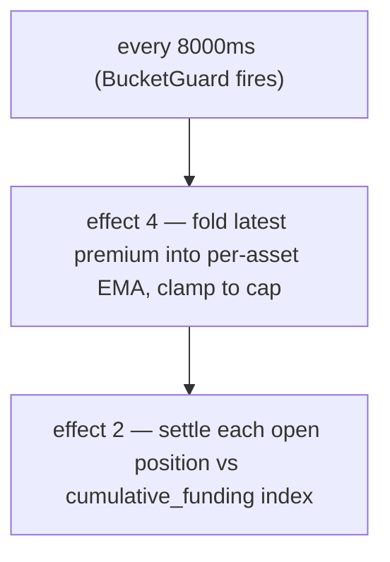

# معدلات التمويل

:::tip
**مستقر.**
:::

## ملخص سريع

تتراكم على المراكز الدائمة مدفوعات تمويل مستمرة (يتم تسويتها كل **8 ثوانٍ** على السلسلة) بما يتناسب مع **علاوة العقد الدائم فوق سعر الأوراكل** — مقاسةً من **سعر التأثير** المرجَّح بالعمق، لا من صفقة واحدة — بالإضافة إلى مكوّن **فائدة** أساسية صغيرة. يدفع الشراؤون (اللونغ) للبائعين (الشورت) عندما يتداول العقد الدائم فوق سعر الأوراكل، ويدفع البائعون للشراؤون حين يكون دونه. تُقيَّد النتيجة بحد افتراضي لكل سوق يبلغ **`±4% / ساعة`**، وتتم التسوية مقابل **سعر الأوراكل**.

## لماذا يوجد التمويل

العقود الدائمة لا تنتهي صلاحيتها، لذا لا توجد قوة مراجحة تربطها بالأصل الأساسي. التمويل يتولى هذه المهمة: حين يرتفع سعر العقد الدائم عن السعر الفوري، يدفع الشراؤون، مما يحفّز البائعين ويثبّط الشراؤون حتى يعود السعر إلى أسفل. البروتوكول لا يأخذ أي طرف من الطرفين — الدفع يكون من مستخدم لمستخدم.

## الصيغة

> الملخص السريع أعلاه هو النموذج المفاهيمي. الأرقام أدناه هي القيم **المُطبَّقة** فعلياً. في حال وجود تعارض بين النص والكود، الكود هو المرجع؛ والفوارق مُشار إليها في السياق.

### طريقة الحساب

يعتمد التمويل على **متوسط متحرك أسي حتمي (EMA)** للعلاوة (سعر التأثير − سعر الأوراكل)، ويُسوَّى كل **8 ثوانٍ**، لا كل ساعة. الحد الأقصى هو **4% / ساعة**، لا 0.05%.

يعمل تأثيران عند بداية كل كتلة لإدارة الدورة، كل منهما محمي بـ `BucketGuard` مدته 8000 ميلي ثانية:

- **التأثير 4 `update_funding_rates`** — يُدمج أحدث عيّنة علاوة في EMA الخاص بكل أصل، ثم يُقيّده.
- **التأثير 2 `distribute_funding`** — يُسوّي كل مركز مفتوح مقابل مؤشر التمويل التراكمي.

#### 0. أساس العلاوة — سعر التأثير (لا آخر صفقة)

**عيّنة العلاوة** لكل كتلة هي الفجوة بين **سعر تأثير** العقد الدائم وسعر الأوراكل:

```
premium = (impact_mid − oracle) / oracle
impact_mid = mid( impact_bid, impact_ask )
impact_bid/ask = VWAP of walking the committed book to fill a fixed notional (default ~$10k)
```

استخدام سعر *التأثير* — أي السعر المرجَّح بالحجم لتنفيذ حجم حقيقي من السيولة — بدلاً من آخر صفقة أو أفضل عرض، يعني أن صفقة منفردة أو أمراً بحجم ضئيل بسعر غير منطقي **لا تستطيع** تحريك التمويل: لا بد من تحريك عمق حقيقي فعلي. هذا يعكس التصميم المرجعي للعقود الدائمة. (وضع قديم لكل سوق يأخذ عيّنة بدلاً باستخدام `premium = (mark − oracle)/oracle`؛ الأسواق الجديدة والمُهاجَرة تستخدم أساس التأثير أعلاه.)

#### 1. EMA لمؤشر العلاوة (لكل سوق)

تُسوَّى العلاوة باستخدام **متوسط متحرك أسي حتمي** (*مؤشر العلاوة*). يخزّن المُجمِّع كسراً ذا فاصلة ثابتة `(num, denom)` — لا أعداد عشرية عائمة، بل حسابات دقيقة بـ `rust_decimal::Decimal` بحيث تكون حالة كل عقدة طبق الأصل من غيرها على مستوى البت. تُدمَج كل عيّنة على النحو التالي:

```
num'   = num   * decay + sample
denom' = denom * decay + 1
value  = num / denom
```

- `sample` = أحدث علاوة للأصل × `funding_rate_multiplier` الخاص بالأصل (الافتراضي `1.0`؛ يُعدَّل تلقائياً بمحرك مخاطر ديناميكي).
- `decay = 0.5` (الافتراضي المقترح → ≈ عمر نصف 7 ثوانٍ عند تكرار العيّنات كل 5 ثوانٍ). يُقيَّد إلى `[0, 1]` عند التحديث.
- تكرار أخذ العيّنات: **5 ث**؛ تكرار دمج EMA والتسوية: **8000 ميلي ثانية** (`funding_update_guard` / `funding_distribute_guard`).

> **الحالة:** حلقة التمويل الكاملة **نشطة** من البداية إلى النهاية. في كل فترة 8 ث يأخذ مشغّل المعدل عيّنة العلاوة من الحالة المُؤكَّدة (علاوة التأثير مقابل الأوراكل أعلاه، عيّنة واحدة لكل سوق دائم)، ويدمجها في EMA مؤشر العلاوة الخاص بالأصل، ثم يستنتج المعدل (فائدة + تقييد)، ويضع الحد الأقصى عليه، ثم يُقدّم التسوية مؤشر التمويل التراكمي وينقل `size × Δindex` بين أرصدة أصحاب المراكز (مجموع صفري: الشراؤون يدفعون للبائعين أو العكس، لا إصدار/حرق) — وكل ذلك من حالة السوق المُؤكَّدة دون أي مُغذّي علاوة خارجي. مختبَر بالحفاظ على الخصائص والحتمية بأربع عقد نهاية-لنهاية تُثبت: الانحراف → العلاوة → EMA → الفهرس → نقل الرصيد.

#### 2. المعدل من مؤشر العلاوة (فائدة + تقييد)

معدل التمويل **ليس** مؤشر العلاوة الخام. يُجمَع المؤشر المُسوَّى `premium_idx` مع مكوّن **فائدة** أساسية من خلال تقييد لكل خطوة:

```
interest = 0.0000125 / h        # = 0.01% / 8h — the baseline carry
clamp    = ±0.0005              # per-step bound

funding = premium_idx + clamp( interest − premium_idx, −clamp, +clamp )
```

عندما يكون مؤشر العلاوة صغيراً، يتجه التمويل نحو مستوى الفائدة الأساسية `interest`؛ وحين تكون العلاوة كبيرة، يهيمن مكوّن `premium_idx` ويحدد التقييد مدى قوة جذب الفائدة لكل خطوة. كل من `interest` و`clamp` يمكن تعديلهما بحوكمة لكل أصل. (الوضع القديم لكل سوق يقرأ قيمة EMA مباشرةً كمعدل دون تحويل فائدة/تقييد.)

#### 3. الحد الأقصى الخارجي

يُقيَّد `funding` أخيراً بالحد الأقصى للساعة:

```
cap_per_hour = 0.04          # 4 %/h default
funding = clamp(funding, −cap_per_hour, +cap_per_hour)
```

الحد الأقصى هو معامل حوكمة لكل سوق: `dynamic_risk_overrides[asset].funding_rate_cap` يحل محل القيمة الافتراضية `0.04` حين يُضبَط.

#### 4. الدفع (لكل مركز، لكل تسوية)

يتراكم التمويل في مؤشر تراكمي لكل سوق (`clearinghouse.cumulative_funding`)؛ يحمل كل مركز آخر مؤشر مُسوَّى له (`funding_entry`). عند التسوية:

```
payment = size_signed * oracle_px * (cum_global - funding_entry) * funding_rate_multiplier[asset]
funding_entry := cum_global      # roll forward
```

(الحسابات مُبرمَجة ومُقفَلة على الحتمية؛ نقل الرصيد الفعلي يحدث مع تسوية BOLE الكاملة.)

| الرمز | المعنى / المستوى |
|--------|-----------------|
| `size_signed` | حجم المركز بإشارة؛ `i128`. شراء (لونغ) > 0، بيع (شورت) < 0. |
| `oracle_px` | سعر الأوراكل المُركَّب — مستوى `Decimal` بوحدة USDC الكاملة (انظر [أسعار المارك](./mark-prices.md)). |
| `cum_global − funding_entry` | التمويل التراكمي المتراكم لهذا السوق منذ آخر تسوية للمركز. |
| `decay` | معامل تراجع EMA 0.5. |
| `cap_per_hour` | الافتراضي `0.04` (4%/ساعة)؛ تجاوز لكل سوق عبر المخاطر الديناميكية. |
| `funding_rate_multiplier` | مُضاعِف لكل أصل، افتراضي `1.0`، يُعدَّل تلقائياً بالمخاطر الديناميكية. |

`funding_rate` (قيمة EMA) موقَّعة: إيجابي → الشراؤون يدفعون للبائعين؛ سلبي → البائعون يدفعون للشراؤين.

**الفائدة الأساسية:** `0.0000125/h` (= `0.01%/8h`) — هي التكلفة التحملية الأساسية التي يُضاف إليها EMA العلاوة.

> ⚠️ **تصحيح مقابل النص السابق.** النص القديم ذكر "كل ساعة"، و"نافذة EMA 60 دقيقة"، و"حد أقصى 0.05%/ساعة". التطبيق الفعلي يُسوّي كل **8 ث**، ومعامل تراجع EMA هو **0.5** (≈ عمر نصف 7 ث)، والحد الأقصى **4%/ساعة**. النموذج الذهني بالساعات مقبول للحسابات التقريبية، لكن التكرار والحد على السلسلة كما هو موضح أعلاه.

## تكرار الدفع

يُسوَّى التمويل **كل 8 ثوانٍ** (فترة `funding_distribute_guard`)، مدفوعاً بطوابع زمنية للكتلة مستقاة من الإجماع — لا من ساعة الحائط. تُسوَّى المراكز مقابل مؤشر التمويل التراكمي، لذا يدفع المركز المفتوح في منتصف فترة ما فقط عن التراكم منذ فتحه (لا يوجد "لقطة عند الساعة").



تُسوَّى المدفوعات كتعديلات على الأرصدة — لا صفقة على السلسلة، لا رسوم. تظهر في سجل المستخدم بصيغة `kind: "funding"`.

## التوقيف عند عدم الوثوق بالأوراكل

التمويل **يُسوَّى مقابل سعر الأوراكل**، لذا يجب ألا يحرّك الدفعَ سعرٌ لا يثق به البروتوكول. في كل فترة، تخضع عيّنة العلاوة للتوقيف: تُتجاهَل (تُؤخذ عيّنتها كـ **0**) عندما:

- يكون **الأوراكل مفقوداً أو ≤ 0** للسوق، أو
- يكون **الأوراكل قديماً** تجاوز `funding_oracle_staleness_ms` (الافتراضي **60 ث**)، أو
- يكون **الكتاب رقيقاً جداً** لتعبئة الفارق الافتراضي للتأثير من الجانبين (لا سعر تأثير).

تُدمَج العيّنة المُتجاهَلة بوصفها 0، فيتجه EMA مؤشر العلاوة نحو **الصفر تدريجياً** ويتلاشى معدل التمويل بدلاً من التسوية على أساس قديم أو قابل للتلاعب. (انظر أيضاً [الحالات الحدية](#edge-cases).)

:::info
**هذا هو سبب رؤيتك لفجوة كبيرة بين المارك والأوراكل مع تمويل ≈ 0.** إذا كان مغذّي الأوراكل لسوق ما معطلاً أو غير موثوق، يُوقَف التمويل ويتلاشى إلى 0 — حتى بينما يقف [المارك](./mark-prices.md#mark-vs-oracle--why-they-diverge) (المبني من الكتاب والعقود الدائمة الخارجية) بعيداً عن آخر أوراكل جيد. الفجوة الواسعة مع تمويل ~0 تعني أن البروتوكول *يرفض تحصيل التمويل على أساس أوراكل سيئ*، وليست خللاً في التمويل.
:::

## مثال عملي

السوق: عقد BTC الدائم، الحالة الحالية (مستوى الأوراكل بوحدة USDC الكاملة):

```
mark         = 100.50
oracle       = 100.00
premium      = mark - oracle = 0.50
EMA(premium) settles toward 0.50 with decay 0.5 over a few 5s samples
funding cap  = 4% / hour (default)
```

لنفترض أن قيمة EMA تُسفر عن معدل تمويل `+0.0005` (0.05%) للفترة (داخل حد 4%/ساعة بمراحل). مراكز الحسابات:

```
long 1 BTC      → pays funding
short 0.5 BTC   → receives funding
```

```
funding_rate = clamp(ema_value, -0.04, +0.04) = +0.0005   (not capped — far below 4%/h)

long 1 BTC:
  payment = +1   * oracle_px * Δcum  ≈ +1   * 100.00 * 0.0005 = +0.0500 USDC  (long pays)

short 0.5 BTC:
  payment = -0.5 * oracle_px * Δcum  ≈ -0.5 * 100.00 * 0.0005 = -0.0250 USDC  (short receives 0.0250)
```

(يستخدم الدفع `size_signed * oracle_px * (cum_global - funding_entry)`؛ هنا `Δcum` هو التمويل المتراكم منذ آخر تسوية للمركز.) بالتسوية كل 8 ث، الحجم لكل فترة ضئيل جداً؛ الحد الأقصى يهم فقط عند الاختلال الجانبي المستمر، حيث تبلغ 4%/ساعة السقف.

## حدود التمويل والقيود الديناميكية

| المعامل | الافتراضي | المصدر / التجاوز |
|-----------|---------|-------------------|
| حد التمويل (لكل ساعة) | `0.04` (`4 %/h`) | `dynamic_risk_overrides[asset].funding_rate_cap` (تصويت الحوكمة) |
| `decay` لـ EMA | `0.5` (≈ عمر نصف 7 ث) | مقترح؛ قد تُعيد المعايرة ضبطه على 0.3/0.7 |
| تكرار أخذ العيّنات | `5 s` | ثابت بالبروتوكول |
| فترة التسوية / التحديث | `8000 ms` | `funding_distribute_guard` / `funding_update_guard` BucketGuards |
| الفائدة الأساسية | `0.0000125/h` (`0.01 %/8h`) | ثابت بالبروتوكول |
| `funding_rate_multiplier` | `1.0` | لكل أصل، يُعدَّل تلقائياً بالمخاطر الديناميكية |

`funding_rate_multiplier` الخاص بكل أصل هو ما يميّز MTF عن القيمة الثابتة حوكمةً لدى HL: يُعدَّل تلقائياً استناداً إلى التذبذب المحقَّق على مدى 30 يوماً من محرك المخاطر الديناميكية، مما يُقيّس عيّنة العلاوة قبل دخولها في EMA.

## سجل التمويل

سجل الحساب عبر [`POST /info user_fills`](../api/rest/info.md) — تظهر مدفوعات التمويل بصيغة `kind: "funding"` مع الأصل ذي الصلة.

سجل السوق:

```bash
curl -X POST https://devnet-gateway.mtf.exchange/info \
  -H 'content-type: application/json' \
  -d '{"type":"funding_history","market_id":0}'
```

يُعيد الحلقة المرتبة من عيّنات `(ts_ms, premium)` (انظر
[`funding_history`](../api/rest/info/perpetuals.md#funding_history)):

```json
{
  "type": "funding_history",
  "data": {
    "market_id": 0,
    "samples": [
      { "ts_ms": 1700000000000, "premium": "0.0015" },
      { "ts_ms": 1700000008000, "premium": "-0.0007" }
    ]
  }
}
```

قناة `fundingTicks` عبر WebSocket مدرجة في [خارطة طريق WS](../api/ws/subscriptions.md#roadmap--not-yet-available)؛ استخدم [`funding_history`](../api/rest/info/perpetuals.md#funding_history) في الوقت الراهن.

## ما لا يفعله التمويل

- **لا علاقة له بالرسوم.** التمويل من مستخدم لمستخدم؛ الرسوم هي خصومات صانع/آخذ السوق للمنصة. انظر [الرسوم](./fees.md).
- **لا فائدة على الضمانات.** رصيد USDC لا يتراكم عليه فائدة من التمويل. التمويل يتعلق فقط بتضييق الفجوة بين المارك والأوراكل.
- **غير قابل للتنبؤ على نوافذ طويلة.** يمكن أن يعكس التمويل إشارته من ساعة إلى أخرى. لا تعامله كتكلفة تحملية ثابتة.

## الحالات الحدية

<details>
<summary>عرض الحالات الحدية</summary>

- **فتح المركز في منتصف الفترة.** لا توجد **لقطة ساعية** — يتراكم التمويل في مؤشر تراكمي، والمركز لا يدفع إلا عن حركة المؤشر منذ آخر تسويته. افتح مركزاً بُعيد تسوية وستدفع تقريباً لا شيء لتلك الفترة؛ لا يوجد "منقطع داخل اللقطة / خارجها".
- **إغلاق المركز في منتصف الفترة.** الأمر ذاته — يُسوّي المركز تراكمه حتى تاريخه عند الخروج؛ لا تقريب في أي اتجاه للجزء الجزئي من الفترة.
- **نظام سلبي.** سوق يتداول فيه العقد الدائم باستمرار دون الأوراكل (البائعون يدفعون للشراؤين) يشهد `funding_rate` سالباً لفترات مستمرة؛ الشراؤون يتلقون التمويل.
- **أوراكل قديم / كتاب رقيق.** تُوقَف عيّنة العلاوة عند 0 ويتلاشى المعدل نحو 0 — انظر [التوقيف](#gating-when-the-oracle-is-untrusted). التمويل لا يُسوَّى على أوراكل غير موثوق.

</details>

## انظر أيضاً

- [أسعار المارك](./mark-prices.md) — كيف يُشتَق `oracle`
- [التصفية المتدرجة](./tiered-liquidation.md) — مدفوعات التمويل تُعدّل `account_value`، مما يحرّك `health`
- [قناة `fundingTicks` عبر WS (خارطة الطريق)](../api/ws/subscriptions.md#roadmap--not-yet-available)
- [الرسوم](./fees.md) — مستقلة عن التمويل

## الأسئلة الشائعة

<details>
<summary>عرض الأسئلة الشائعة</summary>

**س: هل التمويل مثله مثل التمويل في البورصات المركزية؟**
ج: النموذج الذهني ذاته. معظم البورصات المركزية تدفع كل 8 ساعات؛ MetaFlux تُسوّي كل 8 ثوانٍ (فترة `funding_distribute_guard`) فيكون تأثير كل دفعة ضئيلاً والتكلفة التحملية أكثر استقراراً. الحد الأقصى 4%/ساعة هو ما يُقيّد المعدل الجانبي المستمر.

**س: هل يمكن للتمويل أن يُجبرني على التصفية؟**
ج: نعم — دفعة التمويل تُخفّض `account_value`. التسويات كل 8 ث بزيادات ضئيلة (لا خصم ساعي كبير)، لكن معدلاً جانبياً مستمراً قريباً من الحد الأقصى قد ينزف `account_value` بمرور الوقت ويدفعك من نطاق T0 إلى T1. راقب `health` إذا كان مركزك كبيراً والمعدل في مواجهتك باستمرار.

**س: هل يسري التمويل على مراكز السوق الفوري؟**
ج: لا. التمويل آلية خاصة بالعقود الدائمة فحسب. مراكز السوق الفوري لا تتراكم عليها تكاليف تحملية.

**س: هل إيصالات التمويل خاضعة للضريبة؟**
ج: هذا ليس سؤالاً يتعلق بالبروتوكول. تحدث مع المختصين الضريبيين في ولايتك القضائية.

</details>
