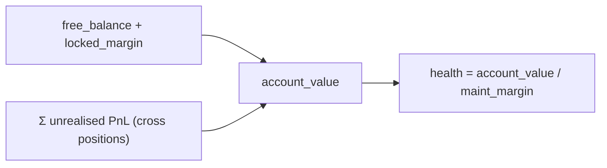
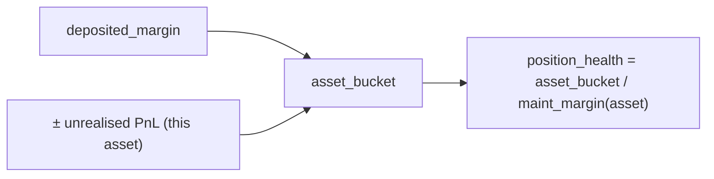
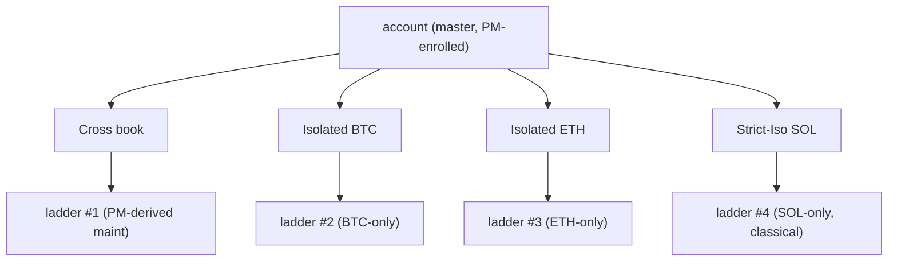
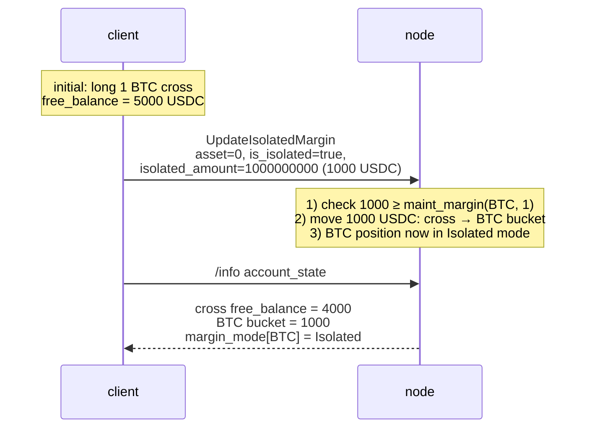

# أوضاع الهامش

:::tip
**مستقر.**
:::

## ملخص سريع

ثلاثة أوضاع لكل أصل: **Cross** و**Isolated** و**Strict-Iso**. يجمع وضع Cross الضمانات عبر جميع مراكزك؛ أما وضع Isolated فيُحيط الهامش بسياج خاص لكل أصل؛ وفوق ذلك، يستبعد وضع Strict-Iso الأصلَ من أي مقاصة ضمن [هامش المحفظة](./portfolio-margin.md).

## مقارنة بين الأوضاع

| الوضع | مصدر الضمانات | الخسائر قد تستنزف | مؤهَّل لـ PM | عزل التصفية |
|------|-------------------|----------------|-------------|----------------------|
| **Cross** | الرصيد الحر على مستوى الحساب | مراكز أخرى | نعم | سُلَّم على مستوى الحساب بالكامل |
| **Isolated** | وعاء مُخصَّص مسبقاً لكل أصل | الوعاء المخصَّص فحسب | لا | سُلَّم لكل أصل على حدة؛ أقصى خسارة = الوعاء |
| **Strict-Iso** | وعاء مُخصَّص مسبقاً لكل أصل | الوعاء المخصَّص فحسب | لا (مستبعَد حتى حين يكون الحساب الرئيسي مُسجَّلاً في PM) | سُلَّم لكل أصل على حدة |

في وضع Cross، يمكن للمراكز الرابحة أن تدعم المراكز الأقل صحة — إذ يكون رصيدك الحر قابلاً للاستخدام عبر الحساب بأكمله. أما في وضع Isolated، فإن انهيار مركز أحد الأصول يبقى محاصَراً داخل وعاء ذلك الأصل.

## كيفية احتساب الهامش

> جميع المبالغ محسوبة على **المستوى العشري `Decimal` بالكامل بوحدة USDC** (القيمة الاسمية، الضمانات، الهامش)، لا على مستوى الدفتر 1e8 — راجع [أسعار المرجع: مستويان للسعر](./mark-prices.md#two-price-planes-read-this-before-reading-any-number).

### الهامش الابتدائي (بوابة ما قبل الصفقة)

يجب على أي أمر يفتح تعرضاً جديداً تقديم هامش ابتدائي:

```
notional        = |px × size|                         # raw integer product, Decimal scale-0
effective_lev   = dynamic_risk_override.max_leverage   # if set, else position cap, else MAX_LEVERAGE_CAP (50)
required_init    = ceil( notional / effective_lev )    # rounded UP — conservative
free_collateral  = cross_account_value − Σ held_initial_margin
reject  iff  required_init > free_collateral            # InsufficientMargin
```

إذن `init_margin = notional / max_leverage`، وهي نسبة `1 / max_leverage` الكلاسيكية. قيمة `effective_lev` هي `max(1, …)`؛ والحد الأقصى العالمي هو `MAX_LEVERAGE_CAP = 50`، مع سقف صارم لـ `UpdateLeverage` عند **100×** وتجاوزات المخاطر الديناميكية لكل أصل التي يمكنها تضييقه. التقريب يكون **للأعلى** (`Decimal::ceil`) بحيث أن أي كسر يُشدِّد دائماً البوابة. أوامر `reduce_only` تتجاوز هذه البوابة (إذ تُقلِّص التعرض فحسب).

يجمع `held_initial_margin` قيمة `ceil(|entry_notional| / effective_lev(asset))` لكل مركز Cross مفتوح (تُستبعَد مراكز Isolated من هذا الحساب — إذ إن ضماناتها هي الوعاء المُودَع بشكل منفصل).

### هامش الصيانة والصحة المالية

```
health = account_value / maint_margin
```

- `account_value` = `cross_account_value` (الرصيد الحر ± الربح والخسارة غير المُحقَّق)، من نوع `i128` موقَّع.
- `maint_margin` = مجموع `|entry_notional| × maint_margin_ratio` لكل جزء مركز مُحتَجَز (مستخرَج مباشرةً من المراكز)، **أو** رقم PM حين تكون [هامش المحفظة](./portfolio-margin.md) مُفعَّلة (`last_computed_pm_cents / 100`).

نسبة الصيانة لكل أصل تأتي من تجاوز المخاطر الديناميكي حين يُحدِّده الحوكمة، وإلا فالخط الأساسي للبروتوكول هو **300 bps = 3%**. حدُّ الإغلاق القسري المستخرَج للانزلاق السعري هو نصف النسبة الفعلية (1.5% للسوق الأساسية) ما لم يُحدَّد بشكل صريح.

يقع هامش الصيانة دون الحد الابتدائي (`notional / max_leverage`)، فيُمكن فتح مركز ثم الانزلاق إلى أرضية الصيانة قبل التصفية. الصحة المالية < 1.0 تدخل [سُلَّم التصفية](./tiered-liquidation.md) عند مستويات (1.1 / 1.0 / 0.8 / 0.667).

> الحسابات تستخدم `Decimal` / `i128` طوال الوقت (لا أعداد عشرية عائمة)؛ وقرار تحديد المستوى يُزيح كلا المعاملَين يميناً بمقدار مشترك قبل قسمة `Decimal` حين تتجاوز قيمة الحساب `Decimal::MAX`، مما يحافظ على نسبة الصحة المالية بحيث لا يتأثر قرار المستوى.

## Cross — الوضع الافتراضي



`maint_margin` هو مجموع متطلبات الصيانة لكل مركز (أو رقم PM إذا كانت [هامش المحفظة](./portfolio-margin.md) مُفعَّلة).

**الانعكاس العملي:** تراجع 10% سلبي في BTC يُخفِّض الصحة المالية للحساب بأكمله، حتى لو كان مركز ETH لديك بخير. يمكنك دعم مركز BTC بإغلاق الفائز في ETH.

## Isolated

:::warning
**فجوة في التنفيذ.** النموذج المفاهيمي أدناه يمثّل **السلوك المستهدف**.
بوابة الهامش ما قبل الصفقة تُنفِّذ حالياً مسار **Cross / الضمانات المجمَّعة
فحسب** — مسار التداول يفتح كل مركز بوضع cross. حقل `margin_mode` في المركز
(0 = cross، 1 = isolated) يُقرأ بالفعل لـ *استبعاد* مراكز Isolated من مجموع
الهامش الابتدائي المحتجَز في Cross، لكن بوابة ما قبل الصفقة المخصَّصة لـ Isolated
(التي تفحص `isolated_margin` المُدرَجة في الأمر مقابل قيمته الاسمية)
لم تُوصَل بعد.
:::

حين تُفعِّل `is_isolated: true` لأصل ما، يُنقل البروتوكول مبلغ `isolated_amount` من USDC من الرصيد المشترك إلى وعاء خاص بالمركز. يُستوفى ربح/خسارة هذا المركز من الوعاء وحده:



إذا انزلقت `position_health` إلى مستوى تصفية، يعمل سُلَّم **المركز المحدَّد**. يبقى باقي الحساب دون تأثير.

يمكنك الإيداع في الوعاء أو السحب منه بينما المركز مفتوح:

```json
// add 500 USDC to the isolated bucket on asset 0
{ "type":"UpdateIsolatedMargin", "params": {
  "asset": 0, "is_isolated": true, "isolated_amount": "500000000"
}}
```

يمكن أن يكون `isolated_amount` **موجباً** (نقل من cross إلى الوعاء) أو **سالباً** (سحب من الوعاء إلى cross). يُرفَض أي سحب يُدخل المركز في مستوى أسوأ.

## Strict-Iso

نفس السياج كـ Isolated، إضافةً إلى خيار صريح بالانسحاب من سيناريوهات PM. حتى لو كان حسابك الرئيسي مُسجَّلاً في هامش المحفظة، فإن مركز Strict-Iso:

- لا يُسهم في محرك سيناريوهات Cross
- لا يحصل على أي رصيد مقاصة
- يُحسَب هامشه وفق النموذج **الكلاسيكي** (الخط الأساسي لكل أصل)

استخدم Strict-Iso في الحالات التالية:
- الأصول الجديدة / غير السائلة حيث لا تنطبق افتراضيات الارتباط في PM
- ميزانية المضاربة التي تريد عزلها بجدار ناري عن دفترك الأساسي المُحوَّط
- الإدراجات (MIP-3) حيث نسبة الصيانة محافِظة حتى يتراكم السيولة

## متى تستخدم كل وضع

| الهدف | الوضع |
|------|------|
| تعظيم كفاءة رأس المال على دفتر متسق | Cross (+ PM) |
| تشغيل استراتيجيات متعددة غير مترابطة تحت حساب واحد | Isolated لكل استراتيجية، أو الحسابات الفرعية |
| احتواء مركز واحد خطر بعيداً عن البقية | Isolated أو Strict-Iso |
| التحوط عبر الأصول مع رغبة في رصيد المقاصة | Cross + PM |
| تداول إدراج طويل الذيل بنظام تذبذب مجهول | Strict-Iso |

للعزل متعدد الاستراتيجيات، تكون [الحسابات الفرعية](./sub-accounts.md) عادةً أنسب من Isolated — فالحسابات الفرعية تعزل الحساب بالكامل بما يشمل مفاتيح الوكلاء وفضاء الأوامر، لا الهامش فقط.

## الانتقال بين الأوضاع

يستخدم التبديل بين الأوضاع إجراء [`update_isolated_margin`](../api/rest/exchange.md#update_isolated_margin) (علامة `is_isolated` — لا يوجد إجراء منفصل لوضع الهامش)، ولا يُسمح به إلا في الحالات التالية:

| من → إلى | مسموح حين |
|-----------|--------------|
| Cross → Isolated | تحديد `isolated_amount` يُغطي هامش الصيانة على الأقل |
| Isolated → Cross | يندمج الوعاء في الرصيد المشترك؛ مسموح في أي وقت يبقى فيه الحساب المدمج في مستوى `Safe` |
| Isolated → Strict-Iso | دائماً (دون تحريك للهامش) |
| Strict-Iso → Isolated | دائماً |
| Strict-Iso/Isolated → Cross (تحت حساب رئيسي مُسجَّل في PM) | يستلزم أن يتناسب المركز مع مجموعة سيناريوهات PM |

التبديل في وضع الهامش أثناء بقاء المركز مفتوحاً **ليس** إغلاقاً وإعادة فتح — يبقى المركز كما هو، ويتغير فحسب نظام محاسبة الهامش.

## سلوك التصفية

يُطبَّق سُلَّم [التصفية متعدد المستويات](./tiered-liquidation.md) بشكل مستقل لكل نطاق:

- **Cross**: سُلَّم واحد لكل الحساب
- **Isolated**: سُلَّم واحد لكل أصل Isolated
- **Strict-Iso**: سُلَّم واحد لكل أصل Strict-Iso

في وضع Cross على المستوى T1، تُغلَق المراكز في الدفتر المشترك بنسبة مساهمة كل منها في الصيانة. أما التصفية T1 لـ Isolated فتُغلق المركز المعزول فحسب. يعمل الضامن T3 وـ ADL على مستوى T4 بنطاق خاص لكل وضع — انهيار مركز Isolated لا يستعيد خسائره من الفائزين في Cross.



## التسلسل — التبديل من cross إلى isolated



## الحالات الحدية

<details>
<summary>عرض الحالات الحدية</summary>

- **الإيداع التلقائي عند إضافة هامش.** تستوفي مراكز Isolated أي عجز في هامش الصيانة من الوعاء فحسب — متى نُضِب الوعاء، يُصفَّى المركز. لا يُغطِّي Cross الوعاءَ المعزول تلقائياً؛ يجب عليك يدوياً إرسال `UpdateIsolatedMargin` بقيمة `isolated_amount` موجبة لتعبئته.
- **إغلاق مركز Isolated.** يُؤدي إغلاق المركز بالكامل إلى إعادة الوعاء إلى الرصيد المشترك.
- **وضع الأصل الجديد.** تكون المراكز الجديدة بوضع Cross بشكل افتراضي إلا إذا أجبرت علامة `meta` الخاصة بالأصل `onlyIsolated: true` على وضع Isolated (مُحدَّدة لكل سوق وقت النشر عبر [MIP-3](../mip/mip-3.md)).
- **Isolated تحت حساب رئيسي مُسجَّل في PM.** رصيد مقاصة PM ينطبق على مراكز Cross فقط. تُجمَع مراكز Isolated بالطريقة الكلاسيكية. حساب مُسجَّل في PM يمتلك مركز Isolated ضخماً ودفتر Cross صغيراً لا يحصل على كاد أي فائدة من PM.

</details>

## انظر أيضاً

- [هامش المحفظة](./portfolio-margin.md) — حسابيات PM مقابل النموذج الكلاسيكي
- [التصفية متعددة المستويات](./tiered-liquidation.md) — سلالم لكل نطاق
- [الحسابات الفرعية](./sub-accounts.md) — عزل على مستوى الحساب بالكامل
- [`update_isolated_margin`](../api/rest/exchange.md#update_isolated_margin) — وضع الهامش هو علامة `is_isolated` هنا؛ لا يوجد إجراء منفصل لوضع الهامش

## الأسئلة الشائعة

<details>
<summary>عرض الأسئلة الشائعة</summary>

**س: هل يمكن لأصل واحد أن يمتلك وعاءَي Isolated وStrict-Iso في آنٍ واحد؟**
ج: لا. الوضع لكل أصل ذو قيمة واحدة: `Cross | Isolated | StrictIso`.

**س: هل يُكلِّف التبديل بين الأوضاع أي صفقة؟**
ج: لا رسوم ولا تنفيذات. إنه تحوُّل صرف في الحالة.

**س: ماذا يحدث إذا نُضِب وعاء Isolated تحت مستوى الصيانة؟**
ج: يعمل سُلَّم التصفية لذلك الأصل. يبقى باقي حسابك دون تأثير.

**س: هل إزالة الرافعة التلقائية (ADL) تعمل عبر النطاقات أم لكل نطاق منفرد؟**
ج: لكل نطاق على حدة. ADL على مركز Isolated لا تستعيد خسائره إلا من الأطراف المقابلة لـ *ذلك* الأصل تحديداً، لا من دفتر Cross الخاص بك ولا من مراكز Isolated أخرى.

</details>
