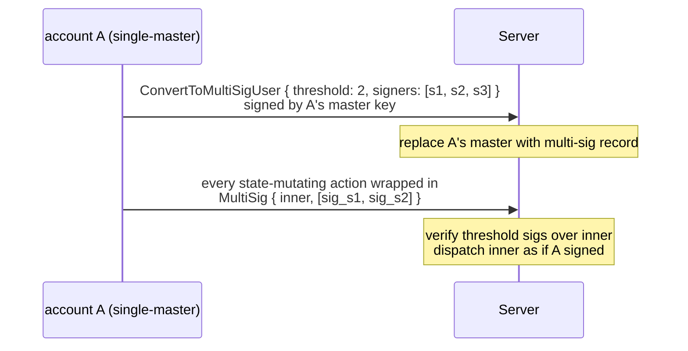
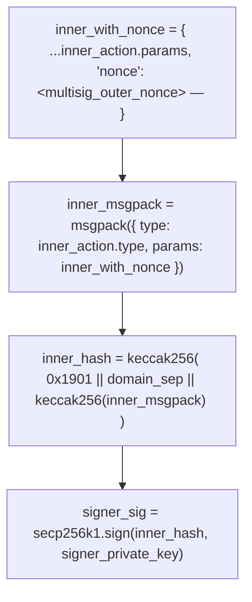

# حسابات التوقيع المتعدد (Multi-sig)

:::info
**معاينة.**
:::

## ملخص سريع

حوِّل حسابًا عاديًا إلى توقيع متعدد بنظام M-of-N: يُستبدَل المفتاح الرئيسي بمجموعة موقِّعين، ويجب أن تحصل كل عملية تُغيِّر الحالة على عدد `threshold` من التوقيعات من `signers`، والتحويل **لا رجعة فيه**. مُصمَّم للحضانة المؤسسية، وخزائن DAOs، ومكاتب التداول المشتركة.

## لماذا التوقيع المتعدد

تعتمد الحسابات العادية على مفتاح رئيسي واحد. فقدانه يعني فقدانًا كاملًا. يوزِّع التوقيع المتعدد مخاطر الحضانة على عدة موقِّعين:

- 2-of-3: يكفي أي موقِّعَين من ثلاثة للتصرف؛ يمكن فقدان أحدهم دون تجميد الحساب.
- 3-of-5: يُشترط 3 توقيعات؛ يمكن تحمُّل فقدان ما يصل إلى مفتاحَين؛ لا يستطيع ما يصل إلى مفتاحَين مخترَقَين تحريك الأموال.

هذا هو المكوِّن الأساسي ذاته الذي يدعم كل إعداد Gnosis Safe / حضانة ذاتية مؤسسية، مُطبَّق على مستوى البروتوكول مباشرةً وليس عبر عقد ذكي.

## دورة الحياة



## التحويل

```json
{
  "type": "ConvertToMultiSigUser",
  "params": {
    "threshold": 2,
    "signers": [ "0x...s1", "0x...s2", "0x...s3" ]
  }
}
```

يُوقَّع بالمفتاح الرئيسي **الحالي** (التوقيع الفردي، وهو آخر توقيع منفرد يصدر عن هذا الحساب).

| القيد | القيمة |
|------------|-------|
| `threshold` | `[1, len(signers)]` |
| `len(signers)` | `[2, 16]` |
| `signers[*]` | عناوين مميزة |

بعد التأكيد:
- يُخزَّن `is_multisig: true` و`multisig_set: { threshold, signers }` في الحساب.
- يُرفض أي إجراء مباشر (غير مُغلَّف) موقَّع من أي شخص — بما في ذلك المفتاح الرئيسي القديم — مع الرسالة `{"error":"account is multisig"}`.

**لا رجعة فيه**: لا يوجد `RevertFromMultiSig`. يمكن **تحديث** مجموعة الموقِّعين عبر `UpdateMultiSig` مُغلَّف بالتوقيع المتعدد (انظر أدناه)، لكن لا يمكن العودة إلى المفتاح الرئيسي الفردي.

## التصرف كحساب توقيع متعدد

غلِّف كل إجراء داخل `MultiSig`:

```json
{
  "sender":    "0x<multisig_addr>",
  "signature": "0x<any_signer_sig>",   ← outer envelope signed by any one signer
  "action": {
    "type": "MultiSig",
    "params": {
      "inner_action": {
        "type": "Order",
        "params": { ... }
      },
      "signatures": [
        { "signer": "0x...s1", "signature": "0x<sig over inner>" },
        { "signer": "0x...s2", "signature": "0x<sig over inner>" }
      ],
      "nonce": 1735689600099
    }
  }
}
```

فحوصات الخادم:

1. يستعيد توقيع الغلاف الخارجي أحد `signers` (أي توقيع فردي من المجموعة).
2. يستعيد كل `signatures[*].signature` مفتاح `signatures[*].signer` الخاص به.
3. الموقِّعون المستعادون جميعهم ضمن `signers`، ومتميزون، وعددهم ≥ `threshold`.
4. كل توقيع داخلي مُوقَّع على **الترميز القانوني msgpack لـ`inner_action` مع `nonce` الغلاف**، مُغلَّف في مظروف EIP-712 مطابق للإجراء العادي.

في حال فشل أي فحص: `{"error":"multisig threshold not met"}` أو `{"error":"multisig duplicate signer"}` أو `{"error":"signer not in set"}`.

إذا اجتازت جميع الفحوصات: يُرسَل الإجراء الداخلي كما لو كان `sender` قد وقَّعه مباشرةً.

### التوقيع على الإجراء الداخلي

يحسب كل موقِّع ما يلي:



يُبنى حزمة الغلاف بعد ذلك خارج السلسلة (يجمع المنسِّق التوقيعات) ويُقدِّمها أي موقِّع.

## تحديث مجموعة الموقِّعين

```json
{
  "type": "UpdateMultiSig",
  "params": {
    "threshold": 3,
    "signers":   [ "0x...s1", "0x...s2", "0x...s4", "0x...s5", "0x...s6" ]
  }
}
```

يُغلَّف في `MultiSig`، ويشترط عدد `threshold` من التوقيعات من المجموعة **الحالية**. يسري مع الكتلة التالية؛ تُطبَّق المجموعة الجديدة من تلك اللحظة فصاعدًا.

يُستخدم للقيام بما يلي:
- تدوير المفاتيح المخترَقة
- إضافة موقِّعين أو إزالتهم
- تغيير `threshold` (مثلًا الانتقال من 2-of-3 إلى 3-of-5 مع نمو المكتب)

## التنسيق خارج السلسلة

لا يُدمج البروتوكول تدفق التوقيع المتعدد — يحتاج الموقِّعون إلى وسيلة خارج النطاق لمشاركة الرسالة المراد توقيعها وتجميع التوقيعات. الأنماط الشائعة:

| النمط | الآلية |
|---------|-----------|
| خدمة منسِّق داخلية | تستطلع محفظة كل موقِّع صندوق بريد مشترك؛ تُرمِّز الإجراء الداخلي؛ توقِّع؛ ترفع التوقيع؛ يُقدِّم المنسِّق عند الوصول إلى العتبة |
| قناة خاصة مشتركة | دردشة جماعية مشفَّرة / بريد إلكتروني؛ يلصق كل موقِّع توقيعه؛ يجمع موقِّع واحد التوقيعات ويُقدِّمها |
| SDK التوقيع المتعدد (مُخطَّط) | يشحن SDK الرسمي سير عمل لتجميع التوقيعات يُخفي طبقة التنسيق |

حتى يصدر SDK، يُطبِّق المُدمجون منسِّقهم الخاص. الجانب على السلسلة لا يتغيَّر — التوقيعات وحدها هي ما يهم.

## التوافق مع الحسابات الفرعية والوكلاء

| السؤال | الإجابة |
|----------|--------|
| هل يمكن لحساب التوقيع المتعدد امتلاك حسابات فرعية؟ | نعم. `CreateSubAccount` هو بحد ذاته إجراء مُغلَّف بالتوقيع المتعدد. يرث كل حساب فرعي اشتراط التوقيع المتعدد. |
| هل يمكن لحساب التوقيع المتعدد الموافقة على محافظ الوكلاء؟ | نعم. `ApproveAgent` مُغلَّف بالتوقيع المتعدد. بعد الموافقة، يمكن للوكيل التوقيع بشكل عادي **دون** جمع توقيعات متعددة إضافية — توقيع الوكيل وحده يكفي للإجراءات المخوَّلة له. هذا هو الإعداد المؤسسي النموذجي: يحتفظ التوقيع المتعدد بصلاحية السحب وإدارة الوكلاء؛ يشغِّل الوكيل تدفق التداول اليومي. |
| هل يمكن لحساب التوقيع المتعدد ذاته التوقيع بوصفه وكيلًا لحساب آخر؟ | نعم — يمكن الموافقة على حسابات التوقيع المتعدد كوكلاء. تستدعي الحسابات الأخرى التي توافق عليها `ApproveAgent { agent: <multisig_addr> }`. تُوقِّع مجموعة موقِّعي التوقيع المتعدد عند الحاجة. |

## الحالات الحدية

<details>
<summary>عرض الحالات الحدية</summary>

- **المفاتيح المفقودة**: يتحمَّل نظام M-of-N فقدان ما يصل إلى `N - M` مفاتيح. خطِّط لحضانة المفاتيح لتوزيع سطح الفقدان (ولايات قضائية مختلفة، وحدات HSM مختلفة، أشخاص مختلفون).
- **المفتاح المخترَق**: يتحمَّل نظام M-of-N ما يصل إلى `M - 1` اختراقًا قبل أن يُمكَّن تحريك الأموال. الكشف المبكر ضروري — اضبط تنبيهات مراقبة المعدل على `userEvents` لحساب التوقيع المتعدد.
- **تصادم النونس**: نونس التوقيع المتعدد هو نونس على مستوى الحساب، تصاعدي، مطابق للتوقيع الفردي. إذا اختار جهدان توقيع متوازيان نفس النونس: يُؤكَّد أحدهما فقط؛ يُعيد الآخر `{"error":"nonce_too_small"}`. ينبغي للمنسِّق تعيين النونسات.
- **انتهاء صلاحية التوقيع**: لا تنتهي صلاحية التوقيعات من تلقاء نفسها — توقيع جُمع اليوم صالح حتى تُقدَّم الحزمة. يُضيف بعض المُدمجين تاريخ انتهاء صلاحية خارج السلسلة.

</details>

## الاستعلام

```bash
curl -X POST https://api.devnet.mtf.exchange/info \
  -d '{"type":"user_to_multi_sig_signers","user":"0x<multisig>"}'
```

```json
{
  "type": "user_to_multi_sig_signers",
  "data": {
    "address":      "0x<multisig>",
    "is_multi_sig": true,
    "threshold":    2,
    "signers":      ["0x...", "0x...", "0x..."]
  }
}
```

يكون `is_multi_sig` بقيمة `false` (و`signers` فارغًا) للحساب العادي. تأتي مجموعة الموقِّعين والعتبة مباشرةً من إعداد `multi_sig_tracker` المؤكَّد.

## التسلسل — أمر التوقيع المتعدد

```mermaid
sequenceDiagram
    participant S1 as signer s1
    participant S2 as signer s2
    participant C as coordinator
    participant Chain as chain
    Note over S1: T-1 prepares inner_action = Order{...}<br/>computes inner_hash — signs → sig_s1
    S1->>C: sends inner_action + sig_s1 to coordinator
    Note over S2: T-2 receives inner_action via coordinator<br/>verifies inner_hash — signs → sig_s2
    S2->>C: sends sig_s2 to coordinator
    Note over C: T-3 coordinator (any signer or service):<br/>assembles MultiSig{ inner_action, signatures: [sig_s1, sig_s2], nonce }<br/>wraps in outer envelope — signs outer with own key
    C->>Chain: POST /exchange
    Note over Chain: T-4 chain admits:<br/>verify outer sig<br/>verify both inner sigs ≥ threshold(2)<br/>dispatch Order → admit to mempool
    Chain-->>C: return 202
    Note over Chain: T+commit inner Order applied — orderEvents fires;<br/>multi-sig account now has the new resting order
```

## انظر أيضًا

- [`POST /exchange convert_to_multi_sig_user`](../api/rest/exchange.md#convert_to_multi_sig_user)
- [دلالات التوقيع في `/exchange`](../api/rest/exchange.md#signed-by-semantics) — غلاف التوقيع المتعدد
- [محافظ الوكلاء](./agent-wallets.md) — الجمع بين التوقيع المتعدد وتفويض الوكيل
- [الحسابات الفرعية](./sub-accounts.md) — يمكن لحسابات التوقيع المتعدد امتلاك حسابات فرعية

## الأسئلة الشائعة

<details>
<summary>عرض الأسئلة الشائعة</summary>

**س: هل يمكنني استخدام 1-of-N (توقيع "أي شخص")؟**
ج: نعم — `threshold: 1`. مفيد للتكرار دون الحاجة إلى تنسيق. يكافئ وظيفيًا امتلاك N حسابًا منفصلًا بصلاحية سحب مشتركة، لكنه أرخص على السلسلة.

**س: هل يمكن مشاركة توقيعات الإجراء الداخلي عبر إجراءات داخلية مختلفة؟**
ج: لا. كل توقيع مرتبط بإجراء داخلي محدد ونونس محدد. محاولة إعادة استخدام توقيع على إجراء داخلي مختلف تُعيد `{"error":"multisig threshold not met"}`.

**س: هل تغليف التوقيع المتعدد متكرِّر؟**
ج: لا. يُرفض `MultiSig { inner_action: MultiSig { ... } }`. طبقة واحدة فقط.

**س: هل يمكن لـMultiSig تغليف `MultiSig`؟ (سؤال ميتا.)**
ج: نفس الإجابة أعلاه — التكرار محظور. للتصرف بوصف توقيع متعدد نيابةً عن توقيع متعدد آخر، يوافق الحساب الخارجي على الحساب الداخلي بوصفه وكيلًا.

</details>
