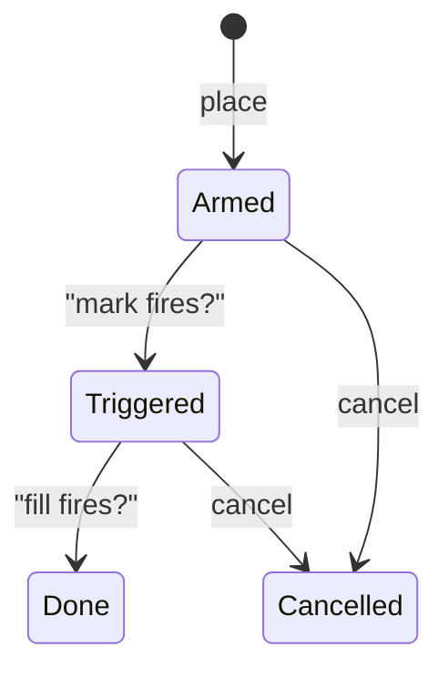
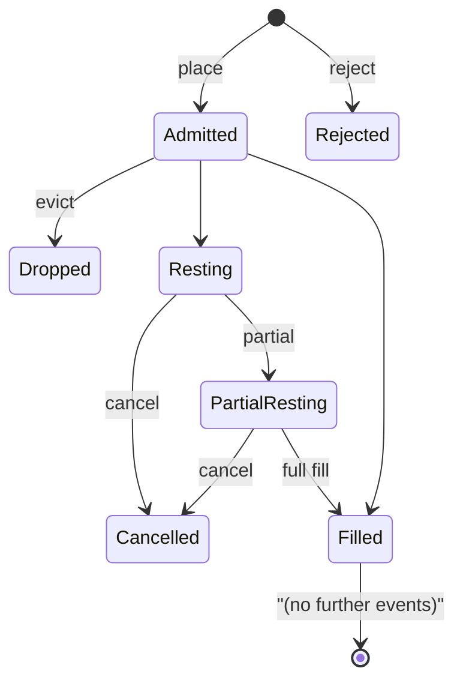

# أنواع الأوامر

:::tip
**مستقر.**
:::

## ملخص سريع

تدعم MetaFlux سلسلة كاملة من أوليات الأوامر — أوامر محدودة السعر، IOC، ALO، FOK، أوامر السوق، وقف الخسارة، جني الأرباح، حدود التفعيل، TWAP، الأوامر التدريجية (Scale)، والأوامر المخفِّضة للمركز فقط (Reduce-Only) — إضافةً إلى أوضاع الحماية من الصفقات الذاتية (STP) التي تتحكم في التنفيذ عند تطابق أوامرك مع أوامرك الخاصة. كل متغير يتخذ شكل `POST /exchange { type: "Order", ... }`؛ أما التدفقات المتخصصة كـ TWAP والأوامر التدريجية فتستخدم متغيرات إجراء خاصة بها.

## مدة السريان

| مدة السريان | السلوك | متى تستخدمها |
|-----|-----------|----------|
| `Gtc` | ساري حتى الإلغاء. يبقى في دفتر الأوامر حتى يُنفَّذ أو يُلغى. | الوضع الافتراضي؛ التربص على الدفتر، الاقتباس المستمر |
| `Ioc` | فوري أو ملغى. ينفّذ ما هو متاح ويلغي الكمية المتبقية غير المنفّذة. | سحب السيولة فوراً؛ عدم الرغبة في البقاء على الدفتر |
| `Alo` | إضافة إلى الدفتر فقط ("post-only"). إذا كان أي جزء من الأمر سيُقابَل، يُلغى الأمر بالكامل. | صانع سعر صارم؛ ضمان عدم دفع رسوم متلقي السيولة |
| `Fok` | نفّذ كاملاً أو ألغِ. إما تنفيذ الكمية بالكامل فوراً أو إلغاء كل شيء. | تنفيذ ذري عند مستوى سعر واحد |

```
Buy 1 BTC @ 100.5 Gtc      →  rests on book, fills as ask reaches 100.5 or lower
Buy 1 BTC @ 100.5 Ioc      →  immediately matches asks ≤ 100.5; cancels rest
Buy 1 BTC @ 100.5 Alo      →  IF any ask ≤ 100.5  THEN reject  ELSE rest
Buy 1 BTC @ 100.5 Fok      →  IF total ≥ 1.0 @ ≤ 100.5  THEN fill  ELSE reject
```

## تخفيض المركز فقط (Reduce-Only)

`reduce_only: true` يرفض الأمر عند قبوله إذا كان تنفيذه سيُكبِّر الحجم المطلق للمركز. مفيد للخروج الوقائي — أمر وقف الخسارة المخصص لتخفيض المركز لا يمكنه أن يقلب مركزك بغير قصد من شراء إلى بيع.

```
position: long 1 BTC
sell 0.5 reduce_only=true   →  ok (closes 0.5 of long)
sell 2.0 reduce_only=true   →  rejected: would flip to short 1
buy  0.5 reduce_only=true   →  rejected: would grow long to 1.5
```

يُقيَّم شرط Reduce-Only **عند الإيداع في الدفتر**، لا عند القبول، حيث تُقرأ حالة المركز من آخر حالة مؤكدة. إذا أغلقت صفقة متسابقة مركزك بين مرحلة القبول والتوزيع، قد يحدث خطأ `reduce_only_violation_post_admit` عند الإيداع (راجع [الأخطاء](../api/errors.md#commit-time-errors-not-http-in-event-stream)).

## الحماية من الصفقات الذاتية (STP)

إذا كان أمر جديد سيُقابَل مع أمر قائم من نفس `sender`، يُفعَّل وضع STP.

| وضع STP | عند تقاطع الأمر الجديد مع القديم | عند تساوي الأسعار وبقاء كليهما |
|----------|---------------------|-----------------------------|
| `None` | السماح بالصفقة | كلاهما يبقى على الدفتر |
| `CancelNewest` | يُلغى الأمر الجديد | يُلغى الأمر الجديد |
| `CancelOldest` | يُلغى الأمر القديم، يستمر الجديد في البحث عن تنفيذ | يُلغى الأمر القديم، يبقى الجديد على الدفتر |
| `CancelBoth` | يُلغى كلاهما | يُلغى كلاهما |
| `DecrementAndCancel` | تنفيذ `min(new, old)`؛ إلغاء الأصغر؛ الأكبر يحتفظ بالكمية المتبقية | نفس الآلية — تنفيذ ثم إلغاء الأصغر |

مثال توضيحي — `DecrementAndCancel`:

```
your resting bid:  buy 1 BTC @ 100.5  (oid 1)
you place sell:    sell 0.4 BTC @ 100.5  (oid 2)  with stp=DecrementAndCancel

result:
  - oid 1 is decremented to 0.6 BTC remaining
  - oid 2 is cancelled (smaller order)
  - no trade fires (no fee, no fill event)
  - your position is unchanged
```

يُطبَّق STP عند خطوة التطابق، لذا يعمل عبر جانب الأصل والسعر والوقت. لا يأخذ STP في الحسبان إلا الأوامر الموقّعة بنفس `sender` — تُحسب أوامر الوكلاء تحت نفس الحساب الرئيسي.

## أوامر التفعيل (Triggers)

**أمر التفعيل** هو شرط ساكن على الدفتر، متى اكتمل أطلق أمراً داخلياً إلى دفتر الأوامر.

| نوع التفعيل | يُطلَق عند | الأمر الداخلي |
|--------------|-----------|-------------|
| `StopLoss` | يتجاوز السعر العادل `trigger_px` من الاتجاه "الآمن" إلى اتجاه "الخسارة" | سوق أو محدود؛ عادةً مع Reduce-Only |
| `TakeProfit` | يتجاوز السعر العادل `trigger_px` من اتجاه "الخسارة" إلى اتجاه "الربح" | سوق أو محدود؛ عادةً مع Reduce-Only |
| `StopLimit` | نفس `StopLoss` | أمر محدود فقط |
| `TakeProfitLimit` | نفس `TakeProfit` | أمر محدود فقط |

للمركز الشرائي (Long):
- يُطلَق `StopLoss` عندما `mark ≤ trigger_px` (انخفاض السعر يقطع المركز الشرائي)
- يُطلَق `TakeProfit` عندما `mark ≥ trigger_px` (ارتفاع السعر يُحجز الربح)

للمركز البيعي (Short)، تنعكس الاتجاهات.

`limit_px`:
- `null` ← إطلاق أمر سوق (`Ioc`) عند التفعيل
- قيمة موجودة ← إطلاق أمر محدود عند `limit_px`

آلة حالات التفعيل:



تُقيَّم أوامر التفعيل عند كل تحديث للسعر العادل (كل إيداع). تستمر عبر الكتل وعبر إعادة التشغيل.

## التجميع (Grouping)

`Order { grouping: ... }` يجمع الأطراف في عائلة واحدة.

| نوع التجميع | المعنى |
|----------|---------|
| `Na` | أوامر مستقلة |
| `NormalTpsl` | أمران: دخول + أحد {StopLoss, TakeProfit}. تنفيذ أحدهما يُلغي الآخر (OCO). |
| `PositionTpsl` | أمرا تفعيل مرتبطان بـ **المركز**، لا بأمر الدخول. يبقيان فاعلَين عبر تغييرات المركز (مثل المتوسط التراكمي) ولا يُلغيان إلا عند إغلاق المركز. |

استخدم `PositionTpsl` لـ "أريد دائماً وقفاً على صافي مركزي" — تبقى أوامر TPSL مسلّحة سواء زدت في المركز أو خفّضته.

## الأوامر التدريجية (Scale Orders)

`ScaleOrder` ينشر سلّماً من أوامر محدودة السعر.

```json
{
  "type": "ScaleOrder",
  "params": {
    "asset": 0, "side": "Buy",
    "total_size": "1000000000",
    "start_price": "9900000000",
    "end_price":   "9800000000",
    "n_levels": 10,
    "shape": "Flat"
  }
}
```

الأشكال:

| الشكل | توزيع الحجم عبر الأطراف |
|-------|------------------------------|
| `Flat` | متساوٍ لكل طرف |
| `Linear` | تصاعد خطي من طرف إلى آخر |
| `Geometric` | تصاعد هندسي (أصغر قرب الفارق، أكبر بعيداً) |

يحصل كل طرف على `cloid` مُعيَّن تلقائياً مشتقّ من `cloid_prefix + leg_index`. لإلغاء السلّم بالكامل، ألغِ كل طرف على حدة، أو استخدم [`cancel_by_cloid`](../api/rest/exchange.md#cancel_by_cloid) مع توسيع البادئة.

## TWAP

`TwapOrder` يجدول شرائح تنفيذ على مدى `duration_ms`.

```
duration = 1 hour = 3,600,000 ms
slices   = duration / SLICE_INTERVAL  (default 60s slice; 60 slices per hour)
sz_per_slice = size / slices

slice  1: send IOC near mid at t = randomize(0, SLICE_INTERVAL * (1 + jitter%))
slice  2: send IOC at t = slice_1_t + SLICE_INTERVAL * (1 + jitter%)
...
slice 60: send last IOC just before t = duration
```

`randomize_pct` ∈ `[0, 50]` يُضيف تشويشاً على أوقات الشرائح بمقدار ±`randomize_pct/100 × slice_interval`. ارفعه لتصعيب الكشف؛ اخفضه للتحكم الدقيق بالتوقيت.

تُرسَل الشرائح من قِبل البروتوكول؛ لا يحتاج العميل لفعل أي شيء بعد إرسال `TwapOrder`. تصل أحداث الشرائح عبر [قناة `userEvents` على WebSocket](../api/ws/subscriptions.md#userevents) (بث `twap*` مخصص قادم في خارطة الطريق).

يمكن إلغاء TWAP أثناء التنفيذ عبر `TwapCancel`؛ الشرائح المنفَّذة بالفعل تبقى، والشرائح المستقبلية تتوقف.

## أوامر السوق

لا يوجد إجراء "سوق" منفصل — أمر السوق هو أمر `Ioc` محدود بسعر متطرف (`MAX_PRICE` للشراء، `0` للبيع). تقوم حزم SDK بهذا تلقائياً عند استدعاء `marketBuy(...)`. يُطابق الدفتر أي سيولة متاحة؛ تُلغى الكمية غير المنفّذة.

تحذير: جميع أوامر السوق تخضع لـ **نطاق السعر العادل** — إذا كان أفضل سعر طلب يتجاوز السعر العادل بنسبة 5%، سيُنفَّذ أمر الشراء على السيولة المتاحة حتى `mark × (1 + band_pct)` وتُلغى الكمية المتبقية. راجع [الأسعار العادلة](./mark-prices.md).

## آلة حالات دورة حياة الأمر



كل انتقال بين الحالات يُصدر حدثاً مقابلاً على [`userEvents`](../api/ws/subscriptions.md#userevents) (أحداث دورة حياة الأمر تمر عبر هذه القناة).

## الحالات الحدية

<details>
<summary>عرض الحالات الحدية</summary>

- **تسابق Reduce-Only مع التنفيذ.** الوقف مقيّد بـ Reduce-Only؛ صفقة تُغلق المركز؛ يُطلَق الوقف؛ يفشل الفحص عند الإيداع بخطأ `reduce_only_violation_post_admit`. الحل: توصيل أحداث `userFills` بروبوتك لإلغاء أوامر الحماية عند الإغلاق الكامل.
- **STP عند القبول مقابل التطابق.** STP يُطبَّق فقط عند خطوة التطابق. أمران على جانبَين متعاكسَين لا يتقاطعان سيبقيان على الدفتر. STP يُفعَّل فقط عندما يكونان على وشك التداول فعلياً.
- **TWAP خلال تذبذب حاد.** كل شريحة هي IOC قرب منتصف الفارق — إذا نضبت السيولة بين الشرائح، قد تعود الشرائح غير منفّذة كلياً. راقب أحداث الشرائح.
- **ALO وتقاطع الدفتر.** الأمر ALO الذي سيتقاطع مع *أي* مستوى يُرفض كلياً، لا جزئياً. للدخول إلى الدفتر بسعر قريب، استخدم أمراً محدوداً غير متقاطع بفارق تيك واحد عن أفضل سعر معاكس.
- **التفعيل ومدة السريان.** وقف خسارة `StopLoss` بـ `limit_px` محدّد يبقى كأمر Gtc محدود عند التفعيل. أضف رشّاً يدوياً شبيهاً بـ TWAP إذا أردت خروجاً على شرائح.

</details>

## أمثلة — TypeScript

```typescript
// limit buy, GTC, post-only
await client.order({
  asset: 0, side: 'Buy', priceE8: '10050000000', sizeE8: '100000000',
  tif: 'Alo', reduceOnly: false, stpMode: 'CancelNewest'
});

// stop-loss attached to a long position
await client.trigger({
  asset: 0, side: 'Sell', sizeE8: '100000000',
  triggerPxE8: '9500000000', limitPxE8: null,
  triggerKind: 'StopLoss', reduceOnly: true
});

// 1-hour TWAP buy
await client.twap({
  asset: 0, side: 'Buy', sizeE8: '1000000000',
  durationMs: 3_600_000, randomizePct: 20, reduceOnly: false
});

// 10-level scale buy
await client.scale({
  asset: 0, side: 'Buy',
  totalSizeE8: '1000000000',
  startPriceE8: '9900000000',
  endPriceE8: '9800000000',
  nLevels: 10, shape: 'Linear'
});
```

## انظر أيضاً

- [`POST /exchange`](../api/rest/exchange.md) — المخططات الكاملة لكل متغير
- [أوضاع الهامش](./margin-modes.md)
- [الأسعار العادلة](./mark-prices.md) — كيفية تفعيل أوامر التفعيل
- [التصفية التدريجية](./tiered-liquidation.md) — كيفية إدارة المراكز تحت الضغط

## الأسئلة الشائعة

<details>
<summary>عرض الأسئلة الشائعة</summary>

**س: هل يدفع أمر ALO رسوم متلقي السيولة في أي وقت؟**
ج: لا قط. إذا كان سيتقاطع مع الدفتر، يُرفض الأمر بالكامل عند القبول — لا تنفيذ جزئي كمتلقٍّ.

**س: هل يمكن لإجراء `Order` واحد خلط أنواع مدد السريان؟**
ج: نعم. `orders: []` متغاير؛ لكل إدخال `tif` خاصة به.

**س: كيف تتعامل محرك التطابق مع التعادل عند نفس السعر؟**
ج: FIFO صارم — أقدم `oid` له الأولوية. أوامر ALO تكتسب الأولوية لبقائها على الدفتر أولاً؛ ذلك هو ميزتها الطبيعية في استرداد رسوم صنع السيولة.

**س: هل شرائح TWAP تُحسب ضمن حد المعدل لديّ؟**
ج: لا — تُرسَل داخلياً من قِبل البروتوكول، لا من قِبل عميلك. إرسال `TwapOrder` يُحسب تهمة واحدة فقط من حد المعدل.

</details>
