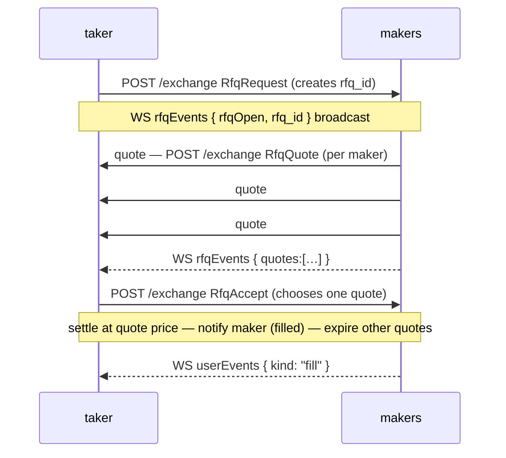
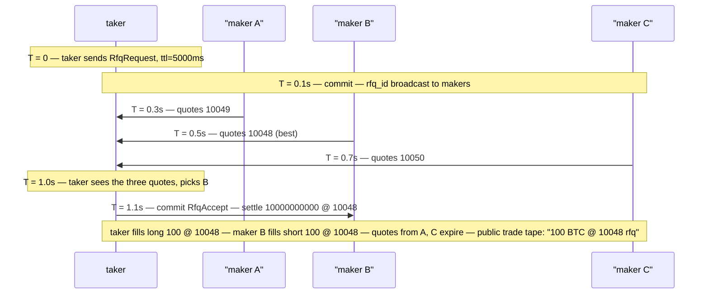

# طلب عرض السعر (RFQ)

:::info
**معاينة.**
:::

## ملخص سريع

يتيح نظام RFQ للطرف الآخذ (Taker) طلب عرض سعر خاص لحجم محدد من مجموعة من صانعي السوق المسجلين، ثم قبول أفضل عرض والتسوية بذلك السعر — دون الكشف عن الحجم في دفتر الأوامر العام مسبقاً. مفيد للأحجام الكبيرة التي قد تحرك الدفتر المرئي.

## لماذا RFQ؟

تنفيذ الأوامر على دفتر CLOB العام يكشف النية. أمر بقيمة 5 مليون دولار على أصل ذي سيولة منخفضة يوحي بكل شيء قبل إتمام أول صفقة. نظام RFQ يقلب المعادلة:

- **الآخذ (Taker)** ينشر طلب RFQ للأصل والاتجاه والحجم وسعر مرجعي اختياري.
- **الصانعون (Makers)** (المسجلون والمشتركون في هذا الأصل) يردون بعروض أسعار خلال نافزة زمنية (عادةً من 1 إلى 5 ثوانٍ).
- **الآخذ** يقبل أفضل عرض ← تسوية فورية بذلك السعر؛ تنتهي صلاحية بقية العروض.

العروض مرئية للآخذ فقط (وليس في الدفتر العام). يرى المشاركون الآخرون الصفقة بعد إتمامها على قناة [`trades` عبر WS](../api/ws/subscriptions.md#trades) مع وسم `kind: "rfq"`.

## دورة الحياة



## تدفق الإجراءات

### الآخذ — طلب RFQ

`RfqRequest` (نوع الإجراء؛ يشبه شكل [`submit_order`](../api/rest/exchange.md#submit_order)):

```json
{
  "type": "RfqRequest",
  "params": {
    "asset":          0,
    "side":           "Buy",
    "size":        "10000000000",
    "reference_px":"10050000000",
    "max_slippage_bps": 50,
    "ttl_ms":         5000
  }
}
```

| الحقل | المعنى |
|-------|---------|
| `reference_px` | السعر المرجعي الذي يقدمه الآخذ (غالباً السعر المرجعي العام)؛ يستخدمه الصانعون لتثبيت عروضهم |
| `max_slippage_bps` | الحد الأقصى للانحراف عن السعر المرجعي؛ تُستبعد العروض الخارجة عنه |
| `ttl_ms` | المدة الزمنية التي يبقى فيها طلب RFQ مفتوحاً قبل انتهاء صلاحيته تلقائياً |

الرد:

```json
{ "accepted": true, "rfq_id": "0x<16 bytes>" }
```

يُبثّ طلب RFQ إلى الصانعين المشتركين عبر [قناة `userEvents` عبر WS](../api/ws/subscriptions.md#userevents) (بث أحداث `rfq*` مخصص مدرج في خارطة الطريق).

### الصانع — تقديم عرض سعر

`RfqQuote`:

```json
{
  "type": "RfqQuote",
  "params": {
    "rfq_id":       "0x<...>",
    "px":     "10049000000",
    "size":      "10000000000",
    "expires_at_ms":1735690000000
  }
}
```

يمكن للصانع تقديم عروض متعددة (مثلاً تعبئات جزئية بأسعار مختلفة) طوال فترة صلاحية طلب RFQ. كل `RfqQuote` إجراء مستقل ويحصل على `quote_id` خاص به.

### الآخذ — القبول

`RfqAccept`:

```json
{
  "type": "RfqAccept",
  "params": { "rfq_id": "0x<...>", "quote_id": "0x<...>" }
}
```

التسوية تتم فورياً في الكتلة التالية:
- يزيد مركز الآخذ بمقدار `size` عند السعر `px`.
- يزيد مركز الصانع بمقدار `size` في الجانب المعاكس بنفس السعر.
- تنتهي صلاحية العروض الأخرى لهذا `rfq_id`.
- هيكل الرسوم: نفس شرائح الصانع/الآخذ المعتمدة للتعبئة من الدفتر العام ([الرسوم](./fees.md)).

### انتهاء الصلاحية التلقائي

عند انقضاء `ttl_ms` دون قبول:

```json
{ "kind": "rfqExpired", "rfq_id": "0x<...>" }
```

لا رسوم؛ تُتجاهل جميع العروض المقدمة.

## تسجيل الصانعين

لاستحقاق تقديم عروض على أصل معين، يسجل الصانع عبر `RfqRegister`:

```json
{
  "type": "RfqRegister",
  "params": { "asset": 0, "active": true, "min_size": "1000000000" }
}
```

يتيح `min_size` للصانعين تجاهل طلبات RFQ الصغيرة التي لا يريدون استقبال إشعارات بشأنها. لإلغاء التسجيل استخدم `active: false`.

يتلقى الصانعون المسجلون بث طلبات RFQ عبر `rfqEvents`. إلا أنهم **غير ملزمين** بتقديم عروض — المشاركة اختيارية لكل طلب RFQ.

## آليات التسوية

| الخاصية | تعبئة RFQ |
|----------|----------|
| السعر | `px` الخاص بالعرض، بصرف النظر عن الدفتر العام |
| الطرف المقابل | صانع واحد فقط (موقّع العرض المختار) |
| تأثير الدفتر | لا شيء — الصفقة لا تتطابق مع الأوامر المعلقة |
| الشفافية العامة | تظهر الصفقة في شريط الصفقات بعد التسوية مع وسم `rfq` |
| الرسوم | معدلات الصانع/الآخذ القياسية وفق جدول الرسوم |
| الهامش | نفس التعبئة العادية (`init_margin` يُخصم من كلا الطرفين) |
| التصفية | نفس الآلية — يصبح المركز مركزاً عادياً بعد التسوية |

## ما لا يفعله RFQ

- **لا يتجاوز متطلبات الهامش.** يجب على الآخذ امتلاك هامش كافٍ للمركز؛ رفض القبول لنقص الهامش يُعيد الخطأ المعتاد `422`.
- **لا يخفي الصفقات بعد إتمامها.** تُنشر الصفقة في تغذية الصفقات العامة بعد التسوية مع وسم `rfq`.
- **ليس مزاداً هولندياً.** لا تتراجع العروض تدريجياً؛ يقدم الصانعون عروضاً بسعر ثابت ويختار الآخذ أحدها.
- **لا يتيح التعبئة من صانعين متعددين.** قبول RFQ الواحد يُطابق عرض صانع واحد بالكامل. لتوزيع الحجم على صانعين متعددين، أرسل طلبات RFQ متعددة.

## الاستعلام عن طلبات RFQ المفتوحة

تتوفر حالة محرك RFQ عبر مسار القراءة `/info` على العقدة من خلال نوعين من الاستعلامات — راجع [`rfq_open`](../api/rest/info.md#rfq_open) و[`rfq_user`](../api/rest/info.md#rfq_user) للاطلاع على أشكال الاستجابة الكاملة وجداول الحقول. قيم `size` / `price` / `max_size` / `limit_px` هي سلاسل أعداد صحيحة بصيغة **نقطة ثابتة 1e8** (مستوى الدفتر/الأوامر).

لا يأخذ `rfq_open` **أي معاملات** ويُعيد جميع طلبات RFQ المفتوحة مع عروض الصانعين المرتبطة بها:

```bash
curl -X POST https://devnet-gateway.mtf.exchange/info \
  -H 'content-type: application/json' \
  -d '{"type":"rfq_open"}'
```

لطلبات RFQ التي يكون حساب معين طرفاً فيها، يأخذ `rfq_user` المعاملة `account_id` (u64) أو `address` (0x hex) ويقسم النتيجة إلى `requested` (طلبات RFQ التي فتحها الحساب) و`quoted` (طلبات RFQ التي قدم عليها عروضاً):

```bash
curl -X POST https://devnet-gateway.mtf.exchange/info \
  -H 'content-type: application/json' \
  -d '{"type":"rfq_user","address":"0x..."}'
```

يُعيد الحساب الذي ليس طرفاً في أي شيء استجابة 200 مع كلتا القائمتين فارغتين.

## الحالات الحدية

<details>
<summary>عرض الحالات الحدية</summary>

- **عروض متعددة من نفس الصانع.** مسموح به؛ يختار الآخذ الأفضل.
- **وصول عرض الصانع بعد قبول الآخذ.** يُتجاهل العرض صامتاً دون خطأ.
- **انتهاء صلاحية RFQ أثناء توقيع الآخذ للقبول.** يُعيد القبول `{"error":"rfq expired"}`. أعد المحاولة بطلب `RfqRequest` جديد.
- **الحساب الآخذ غير مؤهل وقت القبول.** إذا انتقل حساب الآخذ إلى المستوى T1+ بين الطلب والقبول، يُرفض القبول. يحتفظ الصانع بحق تقديم عروض على طلبات RFQ المستقبلية.
- **هامش الصانع غير كافٍ وقت القبول.** يُرفض القبول مع `{"error":"maker margin"}`. يمكن للآخذ تجربة عرض مختلف من نفس طلب RFQ.

</details>

## التسلسل الزمني — طلب RFQ مقبول



## انظر أيضاً

- [أنواع الأوامر](./order-types.md) — بدائل الدفتر العام
- [فهرس إجراءات `/exchange`](../api/rest/exchange.md#action-catalog) — `RfqQuote` / `RfqAccept` (حالياً موثقة كأنواع معروفة دون ربط فعلي)
- [`userEvents` عبر WS](../api/ws/subscriptions.md#userevents) — تمر أحداث RFQ عبر هذه القناة
- [الرسوم](./fees.md) — تخضع تعبئات RFQ لنفس الشريحة القياسية

## الأسئلة الشائعة

<details>
<summary>عرض الأسئلة الشائعة</summary>

**س: لماذا لا أضع أمراً مخفياً في الدفتر؟**
ج: الأوامر المخفية لا تزال تكشف نفسها عبر التعبئات. نظام RFQ لا يُنشر في أي مكان — الحجم غير مرئي حتى التسوية.

**س: هل يمكن إلغاء عروض RFQ؟**
ج: نعم — `RfqCancelQuote { quote_id }`. مفيد عندما يتغير خطر الصانع في منتصف طلب RFQ.

**س: هل ثمة خوارزمية مطابقة مخصصة لتعبئات RFQ ينبغي معرفتها؟**
ج: لا — بمجرد قبول الآخذ، تتم التسوية مباشرة بين الآخذ والصانع المختار. لا يتدخل محرك CLOB في العملية.

**س: هل يمكن أن يكون لسوق دون سيولة كافية في CLOB سوق RFQ نشط؟**
ج: نعم — يمكن للصانعين المسجلين تقديم عروض على أي سوق بصرف النظر عن عمق الدفتر. نظام RFQ مفيد بشكل خاص للأصول ذات السيولة المنخفضة / أصول الذيل الطويل حيث لا يستطيع الدفتر العام استيعاب الأحجام الكبيرة.

</details>
