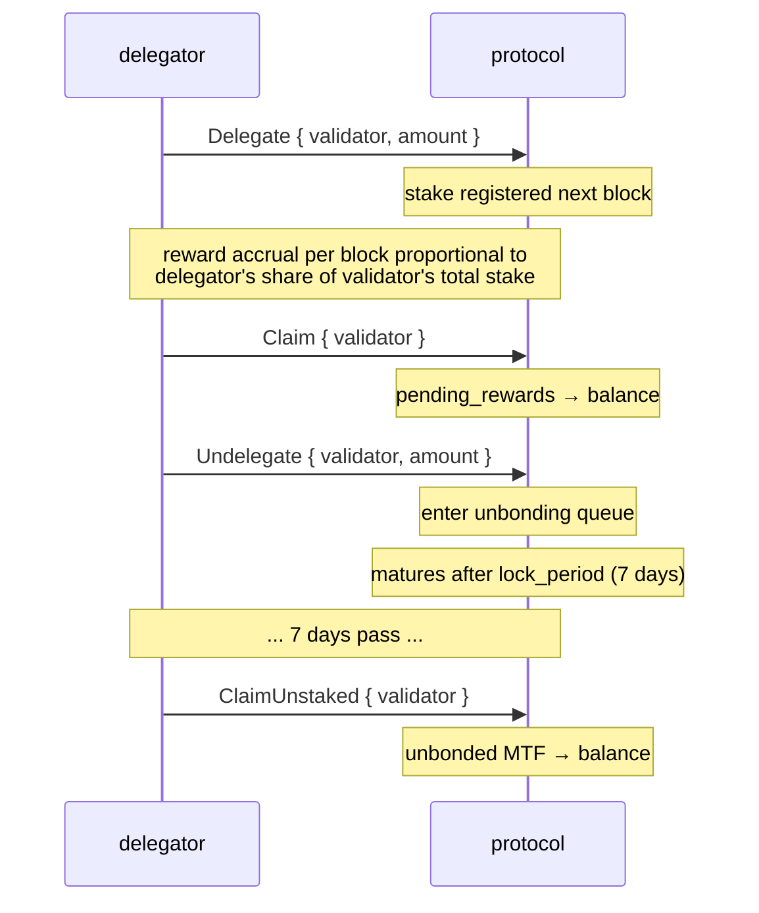
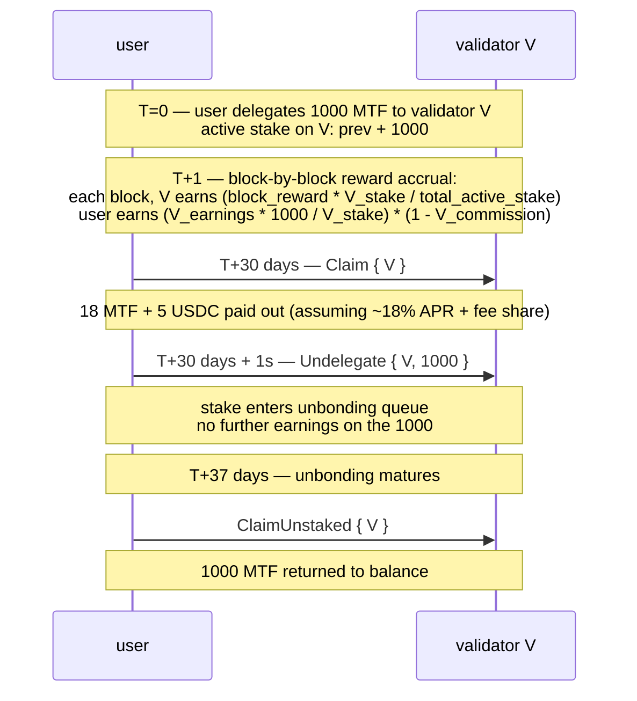

# التحصيص

:::info
**مفعّل على Devnet.** عمليات التفويض وإلغاء التفويض والمطالبة بالمكافآت وتسجيل المدققين نشطةٌ ومُتحقَّقٌ منها من البداية إلى النهاية عبر التوافق على شبكة Devnet المكوّنة من 4 عُقد.
:::

## ملخص سريع

احتفظ بـ MTF، فوّض إلى مدقق، واكسب مكافآت التحصيص. المصدر المستمر هو عائدات رسوم البروتوكول: الرسوم تموّل المدققين — أي **حصة المدققين البالغة 20%** من [إعادة شراء الرسوم](./fees.md) — والمدققون يموّلون المحصِّصين، بتمرير تلك الحصة إليهم بعد خصم العمولة. في المرحلة المبكرة تُستكمل هذه العائدات بميزانية تمهيدية محدودة ممولة من الخزينة (وليس بإصدار جديد أبدًا). الحصة تكون سائلة حتى `lock_period`؛ يستغرق إلغاء التحصيص `7 days` للإفراج الكامل. يُطبَّق الخفض (Slashing) على المدققين المخالفين، ويتحمل المفوِّضون جزءًا من مخاطر هذا الخفض.

## الأطراف المشاركة

| الدور | الوصف |
|------|-------------|
| **المدقق (Validator)** | يُشغّل عقدة توافق، يقترح كتلًا، ويُصوِّت. يجب أن يتجاوز الرهن الذاتي `min_self_bond` (الافتراضي 100k MTF). |
| **المفوِّض (Delegator)** | يحتفظ بـ MTF، يختار مدققًا، ويكسب مكافآت بعد خصم عمولة المدقق. |
| **البروتوكول (Protocol)** | يوزع المكافآت لكل كتلة بحسب الحصة المُحصَّصة: حصة المدققين من عائدات الرسوم بالإضافة إلى الميزانية التمهيدية من الخزينة. |

## تدفق التحصيص



## الإجراءات

### `Delegate`

```json
{
  "type": "Delegate",
  "params": { "validator": "0x<val_addr>", "amount": "10000000000" }
}
```

ينقل MTF من الرصيد إلى مجموعة تفويض المدقق. يسري اعتبارًا من الكتلة التالية، وتبدأ المكافآت من تلك اللحظة.

### `Undelegate`

```json
{
  "type": "Undelegate",
  "params": { "validator": "0x<val_addr>", "amount": "10000000000" }
}
```

يُزيل الحصة من التحصيص النشط وتدخل في قائمة انتظار إلغاء الربط. لا تُكتسب مكافآت خلال فترة إلغاء الربط. تنضج عند `now + lock_period_ms`.

### `Redelegate`

```json
{
  "type": "Redelegate",
  "params": { "from": "0x<val1>", "to": "0x<val2>", "amount": "10000000000" }
}
```

نقل الحصة بين المدققين **دون** الدخول في قائمة انتظار إلغاء الربط. مقيّد بعملية إعادة تفويض واحدة لكل زوج `(from, to)` ضمن نافذة 24 ساعة (للحدّ من التأرجح المتكرر).

### `Claim`

```json
{
  "type": "Claim",
  "params": { "validator": "0x<val_addr>" }
}
```

يجمع المكافآت المتراكمة من `pending_rewards` إلى رصيد MTF للمفوِّض. لا أثر له إذا كانت المكافآت المعلقة صفرًا.

المطالبة التلقائية **ليست** تلقائية — أجرِ المطالبة بانتظام (يوميًا / أسبوعيًا) أو قبل تعديل التفويض.

### `ClaimUnstaked`

```json
{
  "type": "ClaimUnstaked",
  "params": { "validator": "0x<val_addr>" }
}
```

يجمع عمليات إلغاء التفويض الناضجة (تلك التي انقضت فترة قفلها) إلى رصيد MTF. العملية ذات طبيعة متكافئة (Idempotent).

## مصادر المكافآت

| المصدر | التكرار | الحصة |
|--------|---------|-------|
| عائدات الرسوم — حصة المدققين من إعادة الشراء (الرسوم → المدققون → المحصِّصون) | لكل حقبة | `validator_share_inflow × stake_share × (1 - commission)` |
| المكافآت التمهيدية (ممولة من الخزينة، المرحلة المبكرة) | لكل كتلة | `reward_per_block × stake_share × (1 - validator_commission)` |

عائدات الرسوم هي المصدر المستمر: وفق [دولاب الرسوم](./fees.md)، تُوزَّع رموز MTF المُعاد شراؤها بنسبة **70% حرق / 20% مدققون / 10% خزينة**، وتُمرَّر حصة المدققين البالغة 20% إلى المحصِّصين بعد خصم العمولة.
`reward_per_block`: تُحدَّد بالحوكمة، وتُصرف من صندوق التمهيد التابع للخزينة — **وليست إصدارًا جديدًا**؛ القيمة الحالية في استعلام `staking_state`.
`validator_commission`: خاصة بكل مدقق، مقيّدة بـ `20%` من قِبل الحوكمة.

تُحسب المكافآت بـ MTF (المكافآت التمهيدية) وبـ USDC (عائدات الرسوم) — المطالبة تُعيد كليهما. يُظهر `staking_state` المعلقَ بكل عملة.

## فترة القفل

الافتراضي: **7 أيام** لإلغاء التحصيص. قابل للضبط بالحوكمة لكل مجموعة حصص.

| الحالة | المدة | تكسب مكافآت؟ | قابل للخفض؟ |
|-------|----------|:--------------:|:----------:|
| نشط (مفوَّض) | غير محدودة | نعم | نعم |
| في إلغاء الربط | `lock_period_ms` | لا | نعم (حتى النضج) |
| مُلغى الربط (في قائمة المطالبة) | حتى المطالبة | لا | لا |

التعرض للخفض خلال إلغاء الربط هو المخاطرة الخفية — فالمدقق الذي يتعرض للخفض في منتصف إلغاء ربط حصته يجرف معه المفوِّضين الذين بدأوا إلغاء الربط، حتى وإن كانوا قد أشاروا إلى الخروج.

## الخفض (Slashing)

يُعرَّض المدققون للخفض في الحالات التالية:

| المخالفة | الخفض | الأثر على المفوِّض |
|---------|-------|--------------------------|
| التوقيع المزدوج (التوقيع على كتلتين متعارضتين على نفس الارتفاع) | 5% من الحصة + السجن | خسارة 5% من التفويض بالتناسب |
| التوقف (تفويت `downtime_blocks` فترات اقتراح متتالية) | 0.1% من الحصة + السجن | خسارة 0.1% بالتناسب |
| التصويت على فرع غير صالح | 5% + الإزالة الدائمة | خسارة 5% بالتناسب |

يرى المفوِّضون المتضررون تقليص `delegation.amount` الخاص بهم عند كتلة الخفض. لا إشعار مسبق — الخفض مشتق من التوافق.

تدابير التخفيف:
- اختَر مدققين يتمتعون بتشغيل جيد (سجل وقت تشغيل، استقرار العمولة).
- تنوَّع عبر عدة مدققين (خفض مدقق واحد يطال تلك الحصة فقط).
- تجنَّب المدققين القريبين من `min_self_bond` (أكثر عرضة للخروج بشكل غير منتظم).

## اختيار المدقق

```bash
curl -X POST https://devnet-gateway.mtf.exchange/info -d '{"type":"validator_summaries"}'
```

يُعيد مجموعة المدققين النشطة (`{epoch, total_stake, n_active, validators[]}`);
يحمل كل مدخل:

```json
{
  "validator":          "0x<val>",
  "signer":             "0x<signer>",
  "validator_index":    3,
  "stake":              "10000000000000",
  "self_stake":         "100000000000",
  "commission_bps":     500,
  "is_active":          true,
  "is_jailed":          false,
  "first_active_epoch": 12
}
```

اختَر بناءً على:
- **العمولة** (`commission_bps`): كلما انخفضت → ارتفع صافي APR. لكن احذر من الإغراء ثم رفع السقف.
- **الرهن الذاتي** (`self_stake`): كلما ارتفع → زاد التزام المشغّل الشخصي.
- **حالة السجن** (`is_jailed`): المدقق المسجون حاليًا لا يكسب شيئًا حتى يُفرَج عنه.
- **النشاط** (`is_active`): فقط المدققون الذين `is_active: true` ضمن مجموعة التوقيع الفعلية.

## تقدير APR

نوع استعلام [`staking_apr`](../api/rest/info.md#staking_apr) لـ `/info` هو **مباشر** —
يُعيد APR المكافآت التمهيدية الفعلي الذي يطبّقه تأثير مكافأة بداية الكتلة فعليًا، بالإضافة إلى مدخلاته المُلتزَمة:

```bash
curl -X POST https://devnet-gateway.mtf.exchange/info -d '{"type":"staking_apr"}'
```

```json
{
  "type": "staking_apr",
  "data": {
    "total_stake":             "1000000",
    "effective_apr":           "0.08",
    "effective_apr_bps":       "800",
    "governance_rate_bps":     800,
    "emission_floor_stake":    "50000000",
    "n_active_validators":     1,
    "current_epoch":           2,
    "is_gross_pre_commission": true
  }
}
```

يُشتَق `effective_apr` من **منحنى الحصة**، لا من معدل الحوكمة:

```text
effective_apr = 0.08 × √( 50M / max(total_stake, 50M) )
```

أي **8%** ثابتة عند 50M MTF مُحصَّصة أو أقل، تتراجع ∝ 1/√stake فوق ذلك (كلما زادت الحصة انخفضت حصة كل محصِّص). `governance_rate_bps` مُلتزَمٌ به لكنه **غير مستهلَك** من قِبل تأثير المكافأة — يُعرض كلاهما لجعل الفجوة قابلة للملاحظة. APR هو **إجمالي** قبل عمولة المدقق (`is_gross_pre_commission: true`).

يُموَّل تأثير مكافأة بداية الكتلة هذا من الميزانية التمهيدية التابعة للخزينة (انظر [اقتصاديات الرمز](./tokenomics.md)) — مكافآت التحصيص لا تعتمد أبدًا على إصدار جديد. ومع نمو عائدات الرسوم، تصبح حصة المدققين البالغة 20% من [إعادة شراء الرسوم](./fees.md) المصدر المهيمن للمكافآت.

صافي APR للمفوِّض:

```
net_apr  =  effective_apr  ×  (1 - validator_commission_bps/10_000)
```

## الحالات الطرفية

<details>
<summary>عرض الحالات الطرفية</summary>

- **خروج المدقق أثناء إلغاء الربط.** تنتقل حصتك المُلغاة ربطها إلى المدقق التالي في قائمة الانتظار عند كتلة الخفض. يمكنك إعادة التفويض بعد الخروج إذا فضّلت مدققًا آخر؛ تستمر فترة القفل مقابل المدقق الجديد.
- **تغيير المجموعة النشطة.** إذا خرج المدقق من المجموعة النشطة (انخفضت تفويضاته دون الحد الفاصل)، لا تكسب حصتك مكافآت خلال غيابه. يمكنك إعادة التفويض إلى مدقق نشط.
- **الحد الأدنى للرهن الذاتي.** المدقق الذي ينخفض رهنه الذاتي دون `min_self_bond` (بسبب الخفض أو السحب) يُودَع السجن؛ لا يكسب المفوِّضون خلال فترة السجن.

</details>

## التسلسل — دورة كاملة



## انظر أيضًا

- [`POST /exchange Delegate / Undelegate / Claim`](../api/rest/exchange.md)  (متغيرات الإجراءات المدعومة على Devnet)
- [`POST /info staking_state`](../api/rest/info.md#staking_state)
- [`POST /info staking_apr`](../api/rest/info.md#staking_apr) — APR المكافآت التمهيدية الفعلي + المدخلات الملتزمة
- [`POST /info protocol_metrics`](../api/rest/info.md#protocol_metrics) — إجماليات التحصيص على مستوى البروتوكول (`staking.*`)
- [الرسوم](./fees.md) — عائدات الرسوم أحد مصادر مكافآت التحصيص

## الأسئلة الشائعة

<details>
<summary>عرض الأسئلة الشائعة</summary>

**س: هل يمكنني التحصيص والتداول في آنٍ واحد؟**
ج: نعم — رصيد MTF المُحصَّص ورصيد التداول بـ USDC هما أرصدة فرعية منفصلة ضمن الحساب ذاته.

**س: هل أحتاج إلى محفظة وكيل للتحصيص؟**
ج: لا — لكن يمكنك استخدامها. بإمكان محافظ الوكيل استدعاء `Delegate` / `Undelegate` / `Claim` (لا يلزم تفويض السحب لتغييرات التحصيص).

**س: هل يمكنني إلغاء عملية إلغاء الربط؟**
ج: لا — بمجرد الإرسال، عليك انتظار `lock_period` كاملًا. استخدم إعادة التفويض بدلًا من ذلك إذا احتجت الحصة في مكان آخر.

**س: من أين تأتي مكافآت التحصيص؟**
ج: عائدات الرسوم هي المصدر المستمر: يتلقى المدققون **حصة المدققين البالغة 20%** من [إعادة شراء الرسوم](./fees.md) (70% حرق / 20% مدققون / 10% خزينة) ويوزعونها على محصِّصيهم بعد خصم العمولة. في المرحلة المبكرة تُستكمل بميزانية تمهيدية محدودة ممولة من الخزينة. البروتوكول **لا يسكّ أبدًا رموز MTF جديدة للمكافآت** — الرافعة الوحيدة للعرض هي إعادة الربط السنوية بعدد السكان ([اقتصاديات الرمز](./tokenomics.md)).

</details>
