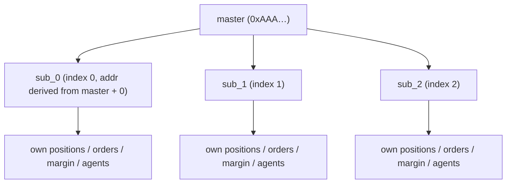
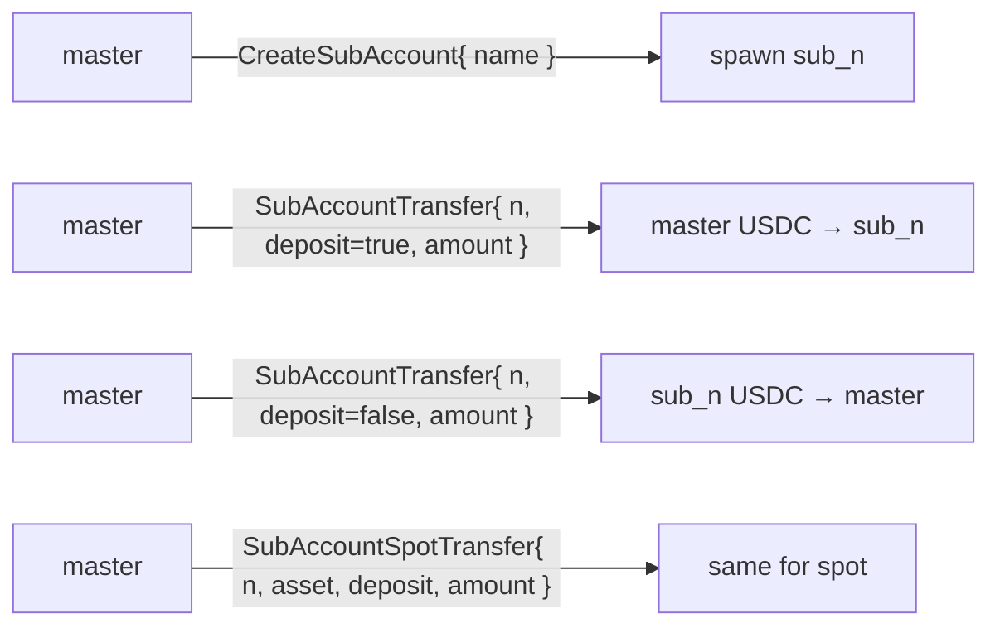
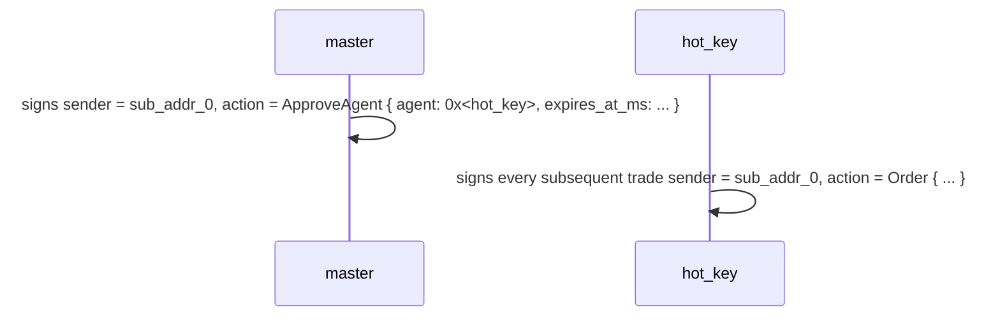
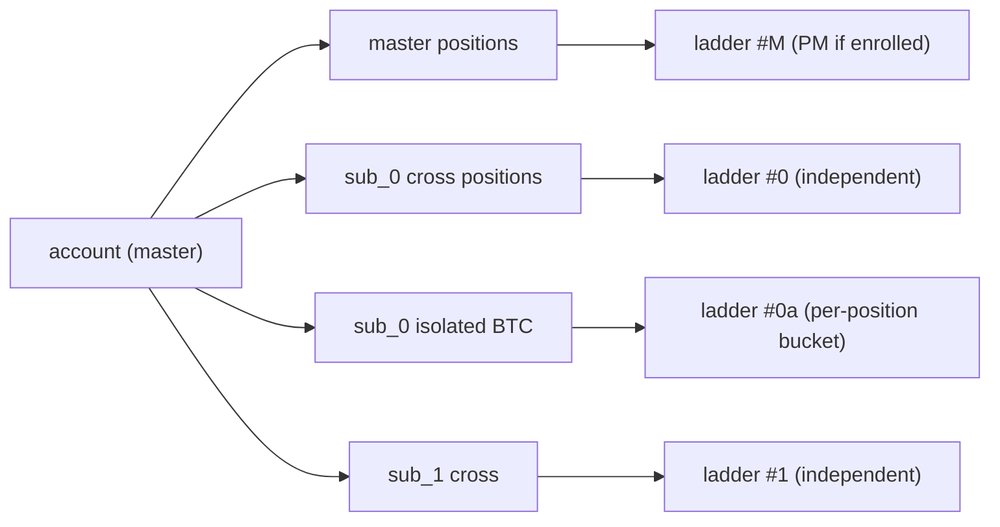
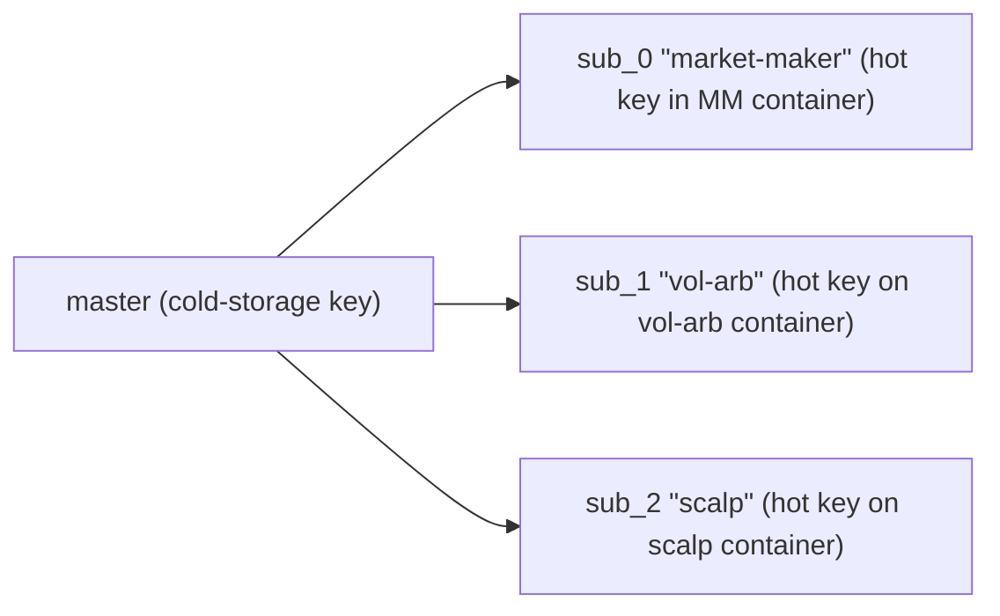
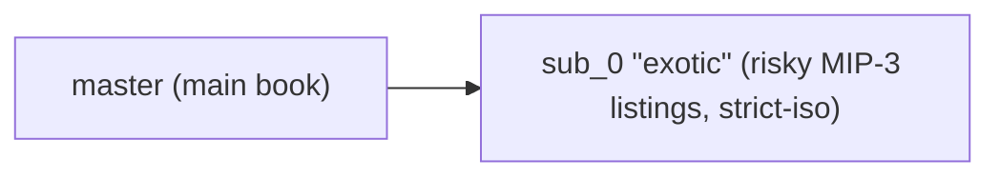
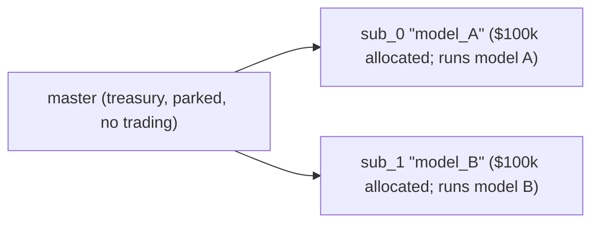

# الحسابات الفرعية

:::info
**معاينة.** واجهة برمجة التطبيقات المرئية للمستخدم مستقرة؛ وسيُثبَّت مخطط اشتقاق العناوين قبل الإطلاق على الشبكة الرئيسية.
:::

## ملخص سريع

الحساب الفرعي هو عنوان مشتق من الحساب الرئيسي، يمتلك مراكزه وهامشه وأوامره الخاصة، غير أن تدفق الأموال إليه ومنه لا يمر إلا عبر الحساب الرئيسي. يمكن إنشاء ما يصل إلى 32 حسابًا فرعيًا لكل حساب رئيسي. استخدمها لعزل الاستراتيجيات، وتفكيك مكاتب التداول، أو اختبار المحافظ بالمقارنة دون الحاجة إلى إعادة الإعداد.

## النموذج الذهني



كل حساب فرعي هو حساب مستقل من الدرجة الأولى في آلة الحالة — له رصيده ومراكزه وحد التصفية الخاص به و[محافظ الوكلاء](./agent-wallets.md) الخاصة به. تُسجَّل علاقة الرئيسي بالفرعي في خريطة جانبية.

الحد الأقصى الثابت: **32 حسابًا فرعيًا** لكل رئيسي (قابل للتوسعة في الإصدار الثاني). عند الوصول إلى الحد الأقصى، تُعيد `CreateSubAccount` الخطأ `{"error":"sub_account_cap"}`.

## التحويلات

تقتصر التحويلات على ما بين الرئيسي والفرعي:



يجب أن تصدر عمليات السحب الخارجية (خارج السلسلة، إلى عنوان طرف ثالث) من **الحساب الرئيسي**. لا تستطيع الحسابات الفرعية السحب مباشرةً خارج السلسلة.

## اشتقاق العناوين

يُعيَّن كل مؤشر فرعي `n` بصورة حتمية إلى عنوان مشتق من عنوان الحساب الرئيسي المكوَّن من 20 بايت:

```
sub_addr_n = first_20_bytes( keccak256( master_addr || uint64_be(n) ) )
```

يستطيع أي طرف احتساب عنوان الحساب الفرعي دون الحاجة إلى حالة على السلسلة. يُثبَّت مخطط الاشتقاق عند إطلاق الإصدار الأول؛ لذا عامل العناوين المُعادة على أنها السلطة المرجعية حتى ذلك الحين.

## ضمانات عزل الأموال

| الضمان | الآلية |
|-----------|-----------|
| خسارة الحساب الفرعي لا تُفرغ الرئيسي | يُصفَّى الفرعي مقابل رصيده الخاص؛ لا يرى الرئيسي سوى دفتر التحويلات |
| خسارة حساب فرعي لا تُفرغ الحسابات الفرعية الأخرى | المبدأ ذاته — كل حساب فرعي حد عزل مستقل من الدرجة الأولى |
| يستطيع الرئيسي اختياريًا تغطية الحساب الفرعي الخاسر | طوعيًا، عبر `SubAccountTransfer` بالإيداع |
| لا يُمكن إجبار الرئيسي على التغطية | تقع تبعات انهيار الفرعي على الفرعي وحده، دون استثناء |
| يمكن للرئيسي السحب **من** الحساب الفرعي | السحب عبر `SubAccountTransfer` (شريطة بقاء الفرعي في مستوى Safe بعد التحويل) |

## الإنشاء

```json
{
  "type": "CreateSubAccount",
  "params": { "name": "scalping-desk", "explicit_index": null }
}
```

| الحقل | النوع | الوصف |
|-------|------|-------------|
| `name` | string ≤ 64 chars | تسمية للأغراض المحاسبية |
| `explicit_index` | uint32 \| null | فتحة محددة للمطالبة بها؛ `null` تعني الفتحة الحرة التالية |

الاستجابة:

```json
{
  "accepted": true,
  "data": {
    "sub_index":   0,
    "sub_address": "0x<derived>",
    "name":        "scalping-desk"
  }
}
```

**المؤشرات تتصاعد بلا رجعة** — بمجرد تخصيص مؤشر لا يُعاد استخدامه أبدًا، حتى لو أُفرغ الحساب الفرعي وهُجر. استخدم `explicit_index` بعناية.

## التمويل

```json
{
  "type": "SubAccountTransfer",
  "params": { "sub_index": 0, "deposit": true, "amount": "1000000000" }
}
```

`amount` بوحدات USDC الأساسية (6 منازل عشرية). `deposit: true` يعني من الرئيسي إلى الفرعي؛ `false` يعني من الفرعي إلى الرئيسي.

لأصول السوق الفورية، استخدم `SubAccountSpotTransfer` (مع إضافة حقل `asset`).

**يجب أن يُبقي التحويل الحساب الفرعي في مستوى Safe** — يُرفض أي سحب قد يدفع الفرعي إلى مستوى T0+ ويُعيد `{"error":"insufficient sub balance"}`. أضف رصيدًا أولًا ثم اسحب الفائض.

## التداول من حساب فرعي

الحساب الفرعي حساب اعتيادي. وقِّع بمفتاح الحساب الفرعي (أو [وكيل معتمد](./agent-wallets.md)) وأرسل مع عنوان الفرعي كـ `sender`.

النمط الشائع: يوقِّع الرئيسي على `ApproveAgent` لكل حساب فرعي انطلاقًا من عنوان الفرعي — يمتلك الرئيسي صلاحية التفويض على حساباته الفرعية، لذا يُسمح بهذا حتى وإن كانت `ApproveAgent` مقتصرة في الأصل على الرئيسي. يكتسب كل حساب فرعي بذلك تدفق التداول بمفتاحه الساخن الخاص.



يعرض SDK كل حساب فرعي كنسخة مستقلة من `Client` بزوج مفاتيح خاص بها، مُوجَّهة إلى عنوانها المشتق.

## عزل التصفية

تُحسَب [التصفية المتدرجة](./tiered-liquidation.md) للحساب الفرعي مقابل قيمة حسابه **الخاصة** وهامش الصيانة الخاص به. لا يُشكِّل انهيار `sub_0` أي خطر على `sub_1` أو الحساب الرئيسي.

يمكنك أيضًا ضبط وضع الهامش للحساب الفرعي على `StrictIso` لكل أصل على حدة، بحيث لا تُسهم مراكز ذلك الأصل في إدارة المخاطر متعددة الأصول حتى لو كان الحساب الرئيسي مسجَّلًا في PM.



## التسجيل في PM لكل حساب فرعي

يُسجِّل كل حساب فرعي بشكل مستقل في [هامش المحفظة](./portfolio-margin.md) (مع فحص حقوق ملكية خاصة به مقابل `pm_min_equity`).

```json
{
  "sender": "0x<sub_0_addr>",
  "action": { "type": "UserPortfolioMargin", "params": { "enabled": true } }
}
```

يمكن للرئيسي الإبقاء على الهامش الكلاسيكي بينما يُفعِّل أحد الحسابات الفرعية PM؛ وهذا مفيد حين يدير حساب فرعي دفترًا محوَّطًا بينما تدير حسابات أخرى صفقات اتجاهية.

## الاستعلام

```bash
curl -X POST https://devnet-gateway.mtf.exchange/info \
  -d '{"type":"sub_accounts","address":"0x<master>"}'
```

يُعيد قائمة الحسابات الفرعية بمؤشراتها وعناوينها المشتقة وتسمياتها ولقطة من حالة غرفة المقاصة لكل منها.

يمكن الاستعلام عن كل حساب فرعي أيضًا باعتباره حسابًا مستقلًا من الدرجة الأولى عبر `account_state` و`open_orders` و`user_fills` وغيرها، بتمرير عنوانه في معامل `address`.

[المعادل المتوافق مع HL](../api/rest/hl-compat.md#subaccounts).

## الحدود

| الحد | القيمة الافتراضية | ملاحظات |
|-------|---------|-------|
| الحسابات الفرعية لكل رئيسي | 32 | قد يتوسع في الإصدار الثاني |
| طول اسم الحساب الفرعي | 64 chars | UTF-8؛ لا تحقق سوى من الطول |
| التحويلات المتزامنة قيد التنفيذ | 8 per master | حد منطقة الانتظار |
| يستطيع الرئيسي السحب من الفرعي | نعم، إذا بقي الفرعي في مستوى Safe | يُرفض خلاف ذلك |
| يستطيع الفرعي السحب خارج السلسلة | لا | يجب التوجيه عبر الرئيسي |
| يمكن للفرعي امتلاك وكلاء | نعم | يُضبط لكل حساب فرعي على حدة |
| يمكن للفرعي أن يكون متعدد التوقيع | لا | في الإصدار الأول، الرئيسي فقط يمكنه ذلك |

## أنماط حالات الاستخدام

### فصل الاستراتيجيات



لكل استراتيجية مفتاحها الوكيل الخاص بها، وحدود التصفية الخاصة بها، وتقارير الربح والخسارة الخاصة بها.

### جدار حماية المخاطر



يستفيد الدفتر الرئيسي من كامل المكاسب؛ وينحصر انهيار sub_0 في حدود إيداعه.

### محافظ A/B



تُحدِّد المقارنة الفصلية لصافي قيمة الأصول لكل حساب فرعي الحساب الذي يستحق تخصيص أكبر.

## الحالات الطرفية

<details>
<summary>عرض الحالات الطرفية</summary>

- **تسابق بين `CreateSubAccount` وأول حركة مرور وكيل.** يصبح الحساب الفرعي فعّالًا عند الكتلة التالية، كسائر تغييرات الحالة. الترتيب: إنشاء → اعتماد الوكيل → انتظار كتلة واحدة → التداول.
- **يحاول الرئيسي التحويل من الفرعي أثناء تصفية T1 للفرعي.** يُرفض؛ الضمان الجانبي للفرعي مُستخدَم في الدفاع. يُسمح بالتحويل بعد عودة الفرعي إلى مستوى Safe.
- **يحذف الرئيسي حسابًا فرعيًا أو يهجره.** غير متاح في الإصدار الأول. تبقى الحسابات الفرعية في الفهرس إلى الأبد. الحسابات الفرعية الفارغة لا تُكلِّف شيئًا من ناحية الحالة؛ لا داعي للقلق.
- **تعرَّض مفتاح وكيل الفرعي للاختراق.** اسحب الاعتماد عبر الرئيسي (الذي يمتلك صلاحية التفويض). استخدم `ApproveAgent` ذاتها مع ضبط `expires_at_ms` في الماضي.
- **حساب فرعي من حساب فرعي.** غير مدعوم. تُرفض `CreateSubAccount` الصادرة من حساب فرعي.

</details>

## التسلسل — الإعداد الكامل

```mermaid
sequenceDiagram
    participant master
    participant sub_0
    participant hot_key
    master->>sub_0: T=0 master creates sub_0
    Note over sub_0: T+1 sub_0 active
    master->>sub_0: T+1 master transfers 1000 USDC into it
    master->>sub_0: T+2 signs ApproveAgent { agent: hot_key, ... } AS sub_0
    Note over sub_0,hot_key: T+3 approval committed; hot_key can sign for sub_0
    hot_key->>sub_0: T+4 places first order on sub_0
    Note over sub_0: T+5 order admits; fills; sub_0 has a position
```

## انظر أيضًا

- [محافظ الوكلاء](./agent-wallets.md) — المفاتيح الساخنة لكل حساب فرعي
- [هامش المحفظة](./portfolio-margin.md) — التفاعل مع PM متعدد الأصول
- [أوضاع الهامش](./margin-modes.md) — الوضع الكلي / المعزول / Strict-Iso لكل حساب فرعي
- [`POST /info sub_accounts`](../api/rest/info.md#sub_accounts) — استعلام MTF الأصلي
- [`subAccounts` HL-compat](../api/rest/hl-compat.md#subaccounts) — استعلام بتنسيق HL

## الأسئلة الشائعة

<details>
<summary>عرض الأسئلة الشائعة</summary>

**س: هل تُجمَّع رسوم الحساب الفرعي مع رسوم الرئيسي لأغراض تحديد المستوى؟**
ج: نعم. يُحتسب حجم التداول للمستوى خلال 30 يومًا بالتجميع عبر الرئيسي وجميع الحسابات الفرعية. يُحتسب التداول داخل الحسابات الفرعية ضمن خصم مستوى الرئيسي.

**س: هل يمكن للحساب الفرعي استلام أموال من حساب آخر مباشرةً (دون المرور بالرئيسي)؟**
ج: نعم — `UsdcTransfer` إلى عنوان الفرعي يعمل تمامًا كما هو الحال مع أي حساب. بعد ذلك لا يُقيَّد تدفق الأموال بالمرور عبر الرئيسي؛ هي مجرد أرصدة في رصيد الفرعي.

**س: هل تتشارك الحسابات الفرعية فضاء الـ nonce مع الرئيسي؟**
ج: لا. لكل حساب فرعي تسلسل nonce الخاص به. نونسات الرئيسي للرئيسي؛ نونسات sub_0 لـ sub_0؛ وهكذا.

**س: هل يمكنني تحويل حساب فرعي إلى حساب رئيسي أو فصله؟**
ج: لا في الإصدار الأول. الحساب الفرعي يظل فرعيًا بشكل دائم. للفصل، أنشئ حسابًا جديدًا بعنوان مختلف وانقل الأموال إليه.

</details>
