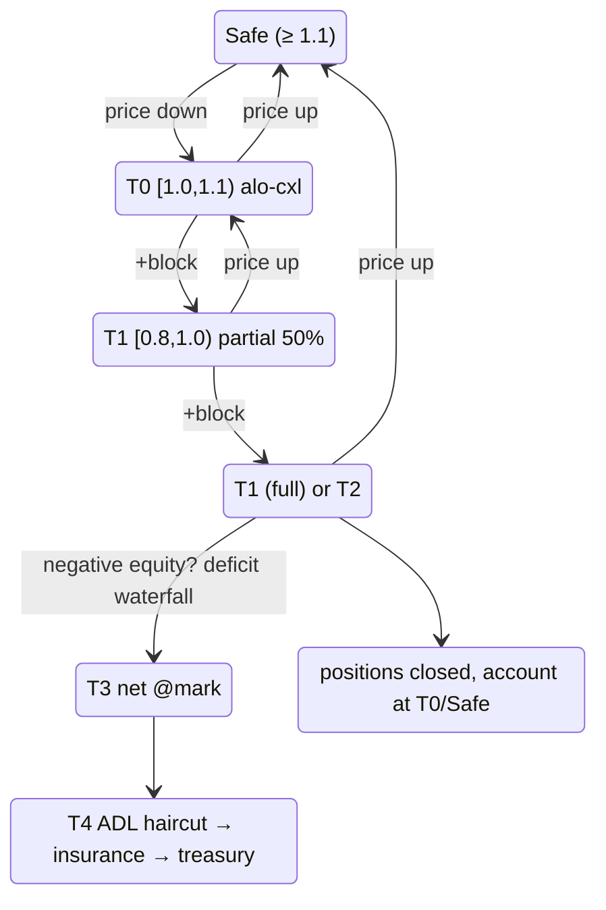

# التصفية المتدرجة

:::tip
**مستقر.**
:::

## ملخص سريع

سُلَّم من 5 مستويات مدفوع بالمعادلة `health = account_value / maint_margin`. يحدد كل مستوى ما يتخذه البروتوكول عند انخفاض الصحة. [البطاقة الصفراء](#why-a-yellow-card) (T0) هي فترة سماح هيستيريسيس خاصة بـ MetaFlux — كتلة واحدة من التحذير قبل بيع أي مركز. أما T4 [ADL](./adl.md) فهو الملاذ الأخير لتوزيع الخسائر.

| المستوى | نطاق الصحة | الإجراء | هل يُمس المركز؟ |
|------|-------------|--------|---|
| (آمن) | `health ≥ 1.1` | خامل | — |
| **T0** | `1.0 ≤ health < 1.1` | **بطاقة صفراء**: إلغاء قسري لأوامر ALO، إشعار المحفظة | لا |
| **T1** | `0.8 ≤ health < 1.0` | إغلاق جزئي [بحدٍّ أدنى للسعر](#how-a-forced-close-executes-the-price-floor) (50%) — إغلاق كامل إذا أُطلق T1 خلال `cooldown_ms` | نعم (50%) أو نعم (100%) |
| **T2** | `0.667 ≤ health < 0.8` | إغلاق كامل [بحدٍّ أدنى للسعر](#how-a-forced-close-executes-the-price-floor) | نعم (100%) |
| **T3** | `health < 0.667` | [مقاصة بسعر الإشارة](#t3-backstop--netting-at-mark) في مقابل الأطراف المقابلة ذات الأرباح (تصعيد بقايا T1/T2 غير القابلة للتنفيذ إلى هنا أيضاً) | نعم — مقاصة بسعر الإشارة |
| **T4** | حقوق ملكية سالبة بعد T3 | [شلال العجز](#t4--the-deficit-waterfall): خصم ADL ← صندوق التأمين ← قائمة انتظار الخزينة | خصم من أرباح الرابحين المحققة |

`account_value` يشمل الربح والخسارة غير المحققين. `maint_margin` هو الحد الأساسي لكل أصل (كلاسيكي) أو مشتق من SPAN (المسجل في PM).

## كيفية احتساب المستويات

النطاقات أدناه هي **ثوابت الكود الحرفية**، لا تقريبات.

`BoleEngine::decide(account, account_value: i128, maintenance_margin: u128, ts_ms)` هي **دالة نقية** — تقرأ حالة التهدئة لكن لا تعدّلها أبدًا — وتُرجع قرار `BoleDecision` واحدًا:

```
if maintenance_margin == 0            → Idle
if account_value < 0                  → Backstop { deficit = maintenance_margin + |account_value| }

health = account_value / maintenance_margin            # Decimal division

if health ≥ 1.1   (yellow_card_threshold)              → Idle            (Safe)
if health ≥ 1.0                                        → YellowCard      (T0)
if health < 0.667 (full_market_floor)                 → Backstop { deficit = maintenance_margin − account_value }   (T3)
if health < 0.8   (partial_threshold)                 → FullMarket { size_to_close = maintenance_margin }           (T2)
# else 0.8 ≤ health < 1.0  (T1):
if partial_cooldown_active(account)                   → FullMarket { size_to_close = maintenance_margin }
else                                                  → PartialMarket50 { size_to_close = maintenance_margin / 2 }
```

| الثابت | القيمة | الرمز |
|----------|-------|--------|
| عتبة البطاقة الصفراء (قمة T0) | `1.1` | `default_yellow_card_threshold` |
| عتبة الإغلاق الجزئي (قمة T1) | `0.8` | `default_partial_threshold` |
| حد السوق الكامل (دخول T3) | `0.667` (≈ 2/3) | `full_market_floor` |
| فترة التهدئة جزئي→كامل | `30_000 ms` | `DEFAULT_PARTIAL_COOLDOWN_MS` |

- جميع المقارنات من نوع `rust_decimal::Decimal` (بدون أرقام عشرية). عندما يتجاوز `account_value` قيمة `Decimal::MAX`، تزيح الدالة `decide` كلا المعاملين يمينًا بعدد بتات مشترك أولًا — وهذا يحافظ على نسبة الصحة بحيث يظل المستوى المختار دون تغيير عند تلك الأحجام.
- **`PartialMarket50` وحده يُشغّل فترة التهدئة** (`record_attempt`)؛ لا تحجب `FullMarket` أو `Backstop` عمليات الإغلاق الجزئي اللاحقة. لذا يُطلق تصعيد T1 من جزئي إلى كامل فقط عندما تكون *عملية جزئية سابقة* لا تزال داخل نافذة الـ 30 ثانية.
- `size_to_close` للإغلاق الجزئي هو `maintenance_margin / 2` (مقطوع بالصحيح). أما `deficit` للنسخ الاحتياطي فهو `maintenance_margin − account_value` عندما يكون `account_value ≥ 0`، وإلا `maintenance_margin + |account_value|`.
- يقيّم المحرك **مجموعة قذرة تدريجية** في كل كتلة (حسابات مُلوَّثة بالأحداث + شريحة إصلاح ذاتي متدحرجة)، لا مسحًا كاملًا — ثُبت تكافؤه مع المسح من الصفر عبر اختبار فوضوي. تُلغى سيولة ALO الراسية لحسابات T0 قسرًا بعد التصنيف.

## كيفية تنفيذ الإغلاق القسري (الحد الأدنى للسعر)

الإغلاق القسري عند T1/T2 **ليس جارفًا للسوق أبدًا**. يُنفَّذ كأمر IOC LIMIT
محدد بناءً على سعر الإشارة الملتزم:

```
sell (long leg):      limit = mark × (1 − liq_floor)
buy-back (short leg): limit = mark × (1 + liq_floor)
```

- `liq_floor` هو معامل مخاطر لكل سوق؛ **وهو بشكل افتراضي نصف نسبة الصيانة
  للسوق** (سوق بنسبة صيانة 5% يكون حده الأدنى للتنفيذ 2.5%
  عن سعر الإشارة). نسبة الصيانة مُعيَّرة لتغطية الانزلاق عند التصفية
  بالإضافة إلى الرسوم، لذا يضمن الحد الأدنى أن الإغلاق القسري لن يُحقق
  انزلاقًا يتجاوز ما حُجز له المخزن المؤقت.
- تُنفَّذ الشريحة فقط عند أسعار مساوية للحد الأدنى أو أفضل منه. **ما لا يمكن
  تنفيذه فوق الحد الأدنى لا يُباع في سوق رقيقة** — بل يُصعَّد فورًا إلى
  قائمة انتظار النسخ الاحتياطي T3. هذا هو القيد المانع للتتالي: لا يمكن للإغلاق
  القسري أن يخفض سعر الإشارة إلى ما دون الحد الأدنى، فلا يجرف حسابات أخرى
  إلى دائرة التصفية.
- تُسوَّى التعبئات عبر **نفس مسار التسوية كالتعبئة العادية**: يضرب الربح/الخسارة
  المحقق الحساب، ويتحرك الفائدة المفتوحة، وتُسوَّى الجانب صانع السوق
  للطرف المقابل بشكل طبيعي.
- تُخصم **رسوم التصفية** (50 نقطة أساس افتراضيًا من القيمة الاسمية المغلقة،
  قابلة للتهيئة لكل سوق) من حقوق الملكية الموجبة المتبقية في الحساب — ولا
  تُنشئ عجزًا أبدًا — وتُضاف إلى صندوق التأمين، وهو بالضبط المجموعة التي
  تمتص نقص النسخ الاحتياطي.
- **أوامر الحساب الراسية على الجانب المقابل تُلغى، لا تُملأ ذاتيًا**
  (إذ إن الملء الذاتي سيُعيد فتح ما أغلقه الإغلاق للتو).

حجم الإغلاق الجزئي (T1) هو 50% من الجانب المستهدف في الأسواق الرئيسية؛
يمكن للأسواق التي ينشئها المطوّر تهيئة منحدر متناسب مع الصحة (إغلاق شريحة
صغيرة أسفل خط الصيانة مباشرةً، وشرائح أكبر كلما غاصت الصحة، بحد أقصى
لكل سوق) إضافةً إلى فترة التهدئة البالغة 30 ثانية بين الشرائح.

## آلة الحالة الكاملة



`cooldown_ms` يُعيَّن افتراضيًا على `30 s`. داخل نافذة التهدئة، يُصعَّد الدخول المجدد إلى T1 إلى إغلاق كامل.

## لماذا البطاقة الصفراء

تنتقل معظم سلاسل المشتقات العامة مباشرةً من "صحي" إلى "إغلاق جزئي". ارتجاج الأسعار الذي يخفض الصحة من 1.5 إلى 0.95 في نقطة واحدة يُطلق بيعًا قسريًا يُخفض سعر الإشارة، فيجرف مزيدًا من الحسابات إلى المستوى ذاته. هذا التتالي هو المصدر الرئيسي لألم التصفية في الأحداث الموثقة.

T0 هو **طبقة هيستيريسيس مؤلفة من كتلة واحدة**. تدخل النطاق؛ تجمّد السلسلة أوامرك الراسية المفتوحة (ALO فقط — انظر أدناه) وتُشعر عميلك، لكن لا يُباع شيء من ممتلكاتك. لديك حتى كتلة الإجماع التالية لـ:

- تعبئة الهامش عبر `Deposit` (أو `UpdateIsolatedMargin` للإضافة إلى مجموعة)،
- إغلاق جزء من المركز يدويًا،
- أو عدم فعل شيء — وفي هذه الحالة يُطلق T1 في التقييم التالي.

عند زمن كتلة 100 ms، تكون نافذة السماح قصيرة لكنها حتمية وكافية لتفاعل عملية مخاطر آلية.

### لماذا تُلغى أوامر ALO فقط

| مدة صلاحية الأمر | تُلغى عند T0؟ | السبب |
|-----------|:----------------:|-------|
| `Alo` | نعم | استراحة خالصة بدون رسوم؛ رأس المال أجدى في الدفاع عن المركز |
| `Gtc` (حد نشط) | لا | ربما هو اكتشاف السعر النشط لديك؛ إلغاؤه قد يزيد الخسارة |
| `Ioc` (قيد التنفيذ) | لا ينطبق | يُحسم عند القبول؛ لا يرتاح أبدًا |
| أمر مشروط (StopLoss / TakeProfit) | لا | غالبًا ما يكون بالضبط الدفاع الذي تريده أن ينطلق |

القصد: تحرير رأس المال المقيّد من الاستراحة السلبية، والحفاظ على قراراتك النشطة للمخاطر.

## الانتقال من T1 جزئي إلى كامل

يبدأ T1 بإغلاق جزئي 50%. منطق التهدئة:

- **أول إطلاق لـ T1**: إغلاق 50%. `cooldown_armed_at = now`.
- **إذا عادت الصحة إلى T0/آمن** قبل `cooldown_armed_at + cooldown_ms`: تُنزع التهدئة تلقائيًا فور مغادرة T1.
- **إذا بقيت الصحة في T1** لمدة `cooldown_ms`: يُصعَّد تقييم T1 التالي إلى إغلاق **كامل** بدلًا من إغلاق جزئي آخر.
- لا تُعاد شحن التهدئة عند T2 أو T3.

```
T = 0       T1 fire #1, 50% close, cooldown armed
T = 5s      mark slips further, still in T1
T = 20s     mark recovers slightly; in T0
T = 31s     cooldown elapsed (would have escalated, but we're not in T1)
            account considered T0/Safe; cooldown reset
```

مقابل:

```
T = 0       T1 fire #1, 50% close
T = 5s      still T1
T = 30s     STILL T1 (cooldown elapses while in T1)
T = 30s+    T1 fire #2 → full close
```

التهدئة *ليست* منطقة خمول — يستمر T1 في إطلاق الإغلاقات الجزئية. التهدئة تتحكم فقط في الترقية من جزئي إلى كامل.

### مثال توضيحي

حساب: مركز شراء 1 BTC عند دخول 100، مجموعة USDC معزولة = 20.

```
mark = 100   account_value = 20 + 0 = 20   maint = 5 (5% of 100)  health = 4.0  → Safe
mark = 90    account_value = 20 - 10 = 10  maint = 4.5            health = 2.2  → Safe
mark = 85    account_value = 20 - 15 = 5   maint = 4.25           health = 1.18 → T0 (alo cancel)
mark = 84.5  account_value = 20 - 15.5     maint = 4.225          health = 1.06 → T0
mark = 84    account_value = 20 - 16 = 4   maint = 4.2            health = 0.95 → T1
                  T1 fire: close 0.5 BTC at mark 84
                  realised PnL: -8 (closed 0.5 BTC, entry 100, exit 84)
                  bucket: 20 - 8 = 12
                  remaining position: 0.5 BTC long entry 100, mark 84
                  account_value = 12 - 8 = 4 (unrealised -8 on 0.5 BTC)
                  maint = 0.5 * 84 * 0.05 = 2.1
                  health = 4 / 2.1 = 1.9 → back to Safe
```

أعاد الإغلاق الجزئي بنسبة 50% الصحة من 0.95 (T1) إلى 1.9 (آمن). الهدف من الإغلاق الجزئي هو إعادة ضبط حجم المركز بحيث تستطيع المجموعة المتبقية حمل التعرض الأصغر.

إذا لم يُعِد الإغلاق 50% الصحة (هبوط أعمق)، سيُصعَّد إطلاق T1 الثاني ضمن التهدئة:

```
mark = 84    T1 fire partial: 0.5 BTC closed, health → 1.9
mark = 82    health = 0.95 again (still in T1, cooldown active)
              T1 escalates to full close: remaining 0.5 BTC closed at 82
              realised PnL: -9
              bucket: 12 - 9 = 3
              position: 0
              account closed cleanly with 3 USDC remaining; insurance untouched
```

## T3 النسخ الاحتياطي — المقاصة بسعر الإشارة

أسفل `health = 0.667` (≈ 2/3 من الصيانة) تتوقف السلسلة عن محاولة الدفتر.
يُقاصَّ المركز — وأي وحدات إغلاق قسري عجز الدفتر عن استيعابها ضمن
[حد السعر الأدنى](#how-a-forced-close-executes-the-price-floor) — **بسعر الإشارة
الملتزم** في مقابل المراكز الأكثر ربحًا على الجانب المقابل للأداة ذاتها
(ترتيب حسب أعلى ربح/خسارة غير محقق، مع فاصل حتمي عند التعادل):

```
when account enters T3 (or parked un-fillable lots exist):
   match its position lots against profitable opposite-side holders
   close BOTH sides at MARK              # no book interaction, no price impact
   both sides realise PnL at that mark   # value-neutral: equity unchanged
                                         # by the netting itself
   lots with no profitable counterparty stay parked for the next block
```

الأطراف المقابلة المُختارة للمقاصة تحتفظ بـ **كل قرش من أرباحها** (محققة
بسعر الإشارة) — ولا تخسر إلا المركز المفتوح. لا تُفرض رسوم على أي جانب.
مقاصة بدون سعر إشارة صالح، أو بدون أي جانب مقابل رابح، تنتظر ببساطة —
فالسلسلة لا تبيع قسرًا في دفتر فارغ أبدًا.

## T4 — شلال العجز

إذا كان الحساب مُسطَّحًا في كل مكان وحقوق ملكيته **سالبة**، تُوزَّع تلك
الديون المعدومة بترتيب ثابت (ADL **قبل** صندوق التأمين — تمتص أرباح
المستفيدين المحققة أولًا، مما يُبقي الصندوق للأحداث الذيلية الحقيقية):

1. **خصم ADL** — يسترد متحكم الشدة التكيفي حتى مقدار
   الأرباح التي **حققها للتو** الأطراف المقابلة في المقاصة (لا يتجاوز ما
   تلقوه، ولا يمس أبدًا أرباح الورق غير المحققة).
2. **صندوق التأمين** — يمتص تلقائيًا الباقي (هذا هو المجمع الذي
   تُغذيه [رسوم التصفية](#how-a-forced-close-executes-the-price-floor)).
3. **الاحتياطي الخزيني** — ما تبقى يُدرج في قائمة انتظار سحب الخزينة
   المرخَّص بالتوقيع المتعدد (تدخل بشري، ملاذ أخير).

يُصفَّر رصيد الحساب السالب بعد ذلك — والدين يعيش في الشلال. راجع [ADL](./adl.md)
لرياضيات المتحكم.

## فحص الهامش عند نقطتين

يُفحص أهليةُ التصفية عند **نقطتين** خلال كل كتلة:

1. **بداية الكتلة**، بعد تحديث أسعار الإشارة — يلتقط الحسابات التي انزلقت للتو إلى مستوى أدنى بفعل تحرك السعر وحده.
2. **ما بعد الإجراء**، بعد كل `Order` / `Cancel` / `Withdraw` من هذا الحساب — يلتقط الحسابات التي أوصلت نفسها إلى مستوى أدنى (مثلًا: سحب ضمانات زائد).

هذا يمنع التلاعب "المجاني" داخل الكتلة حيث يضيف المستخدم مخاطر بين بداية الكتلة وبقيتها.

## أنماط التعافي

| السيناريو | الاستراتيجية |
|----------|----------|
| متجه نحو T0 | تعبئة عبر `UpdateIsolatedMargin` (معزول) أو `Deposit` (متقاطع). ضع أوامر مشروطة قبل الضغوط. |
| في T0 بالفعل | نفسه. أوامر ALO مُلغاة بالفعل؛ ضع حدودًا جديدة عند مستويات حماية. |
| تتأرجح داخل/خارج T0 | شدد التنبيهات الداخلية على `health < 1.2`. ابحث في المحرك — مدفوعات تمويل؟ حافة نطاق الإشارة؟ انقطاع الأوراكل؟ |
| أُطلق T1 جزئيًا للتو | أعِد التقييم. المركز أصغر بنسبة 50%؛ فكر في إغلاق الباقي طوعًا قبل تصعيد الإغلاق الكامل عند انتهاء التهدئة. |
| فخاخ تهدئة T1 المتكررة | حجم المركز خاطئ بالنسبة للمجموعة. لا تعبئ المجموعة دون إعادة ضبط الحجم أيضًا. |

## كيف تبقى في المنطقة الآمنة

- راقب `health` عبر استعلامات `userState` (متوافقة مع HL) أو [`account_state`](../api/rest/info.md#account_state).
- اضبط تنبيهات داخلية عند `health < 1.2` — فوق T0 بفارق مريح.
- للاستراتيجيات الآلية، سجِّل [بوت مراقب المخاطر](../integration/risk-watcher.md) لإيداع الهامش عند تجاوز الصحة حدًا معينًا.
- راقب [`userEvents`](../api/ws/subscriptions.md#userevents) على تغذية WS للاطلاع الفوري على انتقالات المستويات (أحداث الهامش/التصفية ترد على هذه القناة).

## الحالات الحدية

<details>
<summary>عرض الحالات الحدية</summary>

- **نطاق سعر الإشارة نشط.** أثناء تفعيل نطاق الإشارة، تستمر تقييمات التصفية في الإطلاق — لكن بالنسبة لسعر الإشارة المُقيَّد بالنطاق. قد يكون الدفتر عند سعر أسوأ مما يمكن للبروتوكول الاعتراف به. عمليًا: الارتفاع العدائي الذي يُكبته النطاق لا يُصفيك فورًا؛ صحتك تُحسب بالنسبة لسعر الإشارة المُكبَّت.
- **مدفوعة التمويل تتجاوز حدود المستوى.** تُقلص مدفوعة التمويل `account_value`. إذا كنت عند `health = 1.05` وخفضتك رسوم تمويل 0.1% إلى 0.99، يُطلق T1 في الكتلة ذاتها. راقب إيقاع التمويل بالنسبة لمخزنك المؤقت.
- **إطلاق T1 متزامن لأصلين (متقاطع).** يحدث كلا الإغلاقين الجزئيين في الكتلة ذاتها. الترتيب: أبجديًا باسم الأصل (حتمي عبر المدققين). تنطبق أهلية التأمين وADL لكل أصل على حدة.
- **دخول T0 ثم الخروج قبل الكتلة التالية.** ممكن إذا عبّأ عميلك الهامش في الكتلة ذاتها (T0 في بداية الكتلة ← `Deposit` من إجراء المستخدم ← يجتاز فحص ما بعد الإجراء T0). أوامر ALO المُلغاة في بداية الكتلة تبقى ملغاة؛ لا يُعيد النظام إنشاءها تلقائيًا.

</details>

## انظر أيضًا

- [هامش المحفظة](./portfolio-margin.md) — الانضمام الاختياري لهامش متقاطع متعدد الأصول يُقلل الصيانة الأساسية
- [خوارزمية تخصيص ADL](./adl.md) — رياضيات T4
- [أوضاع الهامش](./margin-modes.md) — النطاقات المتقاطع / المعزول / المعزول الصارم للسُّلَّم
- [أسعار الإشارة](./mark-prices.md) — ما يقود الصحة
- [قناة WS `userEvents`](../api/ws/subscriptions.md#userevents) — انتقالات المستويات ترد على هذه القناة
- [نمط مراقب المخاطر](../integration/risk-watcher.md) — تعبئة الهامش الآلية

## الأسئلة الشائعة

<details>
<summary>عرض الأسئلة الشائعة</summary>

**س: هل يمكنني إطلاق T1 يدويًا على حساب آخر؟**
ج: لا. التصفية مستمدة من الإجماع بالنسبة لسعر الإشارة الملتزم + حالة الحساب. لا يوجد إجراء "تصفية" يمكن للمستخدم تقديمه؛ يُطلق البروتوكول التصفية من منطقه الخاص عند بداية الكتلة / نقاط التحقق بعد الإجراء.

**س: ما أدنى صحة يمكنني الوصول إليها في البطاقة الصفراء والخروج سالمًا؟**
ج: يُطلق T0 عند `1.0 ≤ health < 1.1`. إذا عدت إلى الآمن (`health ≥ 1.1`) قبل التقييم التالي، لا تُعاد إنشاء أوامر ALO (ستحتاج لإعادة تقديمها) لكن لا تُطلق أي إجراءات T0 إضافية.

**س: هل هناك طريقة للانسحاب من T1 (إجباره على تخطي الجزئي إلى الكامل)؟**
ج: لا. T1 يجرب الجزئي دائمًا أولًا. قدم إغلاقًا يدويًا عند T0 إذا أردت الإغلاق الكامل بشروطك.

**س: كيف يُحدد سعر الإغلاق عند T1/T2؟**
ج: أمر IOC **بحد** عند الدفتر السائد، مُقيَّد بـ `mark × (1 ∓ liq_floor)` — انظر [حد السعر الأدنى](#how-a-forced-close-executes-the-price-floor). الانزلاق المحقق محدود بالحد الأدنى (افتراضيًا: نصف نسبة الصيانة)؛ وما لا يستطيع الدفتر استيعابه ضمن الحد الأدنى يُصعَّد إلى النسخ الاحتياطي بدلًا من اجتياح المستويات الأعمق.

</details>
