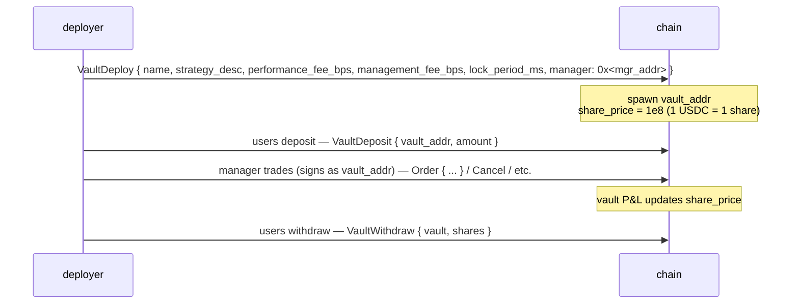
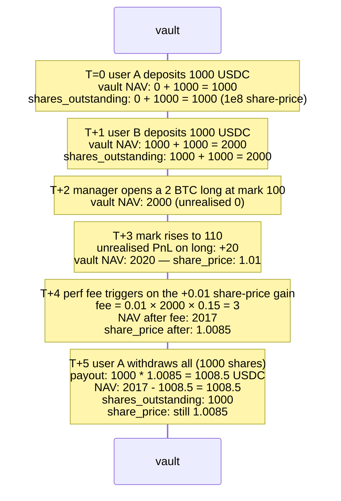

# الخزائن

:::info
**مُفعَّل على Devnet.** دورة حياة الخزينة الكاملة — الإنشاء، والإيداع، والسحب، والتحويل، والتوزيع، والتعديل — مُنفَّذة ومُختبَرة على Devnet. لا تزال اختبارات الإجماع الشاملة قيد الإضافة.
:::

## ملخص سريع

ثمة عائلتان من الخزائن: **MFlux Vault** التي يديرها البروتوكول (وتمثّل صندوق التأمين والاحتياطي)، و**الخزائن الخاصة بالمستخدمين** (استراتيجيات ينشرها المجتمع ويمكنك الإيداع فيها). تشترك الاثنتان في آلية واحدة لتسعير الحصص: الإيداع يُصدر حصصاً بسعر `share_price` الحالي، والسحب يُتلف حصصاً بسعر `share_price` الحالي.

## MFlux Vault

هو صندوق البروتوكول الخاص. يؤدّي ثلاثة أدوار:

1. **الطرف المقابل الاحتياطي**: عندما تُسلَّم مركزٌ مُصفَّى من المستوى T3 إلى البروتوكول، تستوعب MFlux Vault هذا المركز وأيَّ خسارة متبقية.
2. **صنع السوق (مخطَّط)**: يمكن توظيف رأس مال MFlux الخامل في استراتيجيات صنع السوق على أسواق مختارة.
3. **التأمين**: تحتفظ باحتياطيات لتوزيع الخسائر الصغيرة دون تفعيل آلية ADL من المستوى T4.

### الإيداع في MFlux Vault

```json
{
  "type": "VaultDeposit",
  "params": {
    "vault":       "<mflux_vault_addr>",
    "amount":   "1000000000"
  }
}
```

يُصدر `amount / share_price × 10^8` حصةً للمودِع في الكتلة التالية.

### السحب

```json
{
  "type": "VaultWithdraw",
  "params": {
    "vault":       "<mflux_vault_addr>",
    "shares":   "100000000000"
  }
}
```

يُتلف `shares` حصةً؛ ويصرف `shares × share_price / 10^8` USDC في الكتلة التالية.

### فترة الإقفال

تخضع MFlux Vault لفترة إقفال افتراضية مدتها `24 h` من تاريخ الإيداع حتى أول سحب مؤهَّل. الإقفال يسري على كل حصة بشكل مستقل؛ أما السحوبات على الحصص الأقدم من 24 ساعة فهي غير مقيَّدة.

يمنع هذا النهجُ دخولَ رأس المال قُبيل حدث T3 معروف ثم الخروج فور توزيع الخسارة (ما يُعرَف بـ"مشكلة المجاني").

### الأداء والرسوم

تفرض MFlux Vault:
- **رسوم الإدارة**: 0 bps (لا يوجد مدير — يديرها البروتوكول).
- **رسوم الأداء**: 0 bps.
- **رسوم السحب**: 0 bps.

العوائد صافية من خسائر احتياطي T3 مضافاً إليها أرباح صانع السوق من المستويين T1/T2. يمكن الاطلاع على رسم بياني تاريخي لسعر الحصة عبر استعلام `vault_state` المباشر (انظر [`/info`](../api/rest/info.md#vault_state)).

## خزائن المستخدمين

يستطيع أيُّ شخص نشر خزينة تجمع USDC وتُشغِّل استراتيجيات تحت صلاحية توقيع مدير معيَّن.

### دورة الحياة



عنوان الخزينة حساب من الدرجة الأولى في آلة الحالة — له مراكزه وأرصدته وأوامره المستقلة. يوقِّع المدير الصفقات **بالنيابة عن الخزينة** (عنوان الخزينة هو `sender`، ومفتاح المدير هو الموقِّع؛ وتمرّ عملية القبول عبر آلية الموافقة على الوكلاء ذاتها المعمول بها للمحافظ العادية).

### النشر

```json
{
  "type": "VaultDeploy",
  "params": {
    "name":                 "Yield Arb Strategy",
    "description":          "Funding-rate arbitrage",
    "manager":              "0x<mgr>",
    "performance_fee_bps":  1500,
    "management_fee_bps":   100,
    "lock_period_ms":       86400000,
    "high_water_mark":      true
  }
}
```

| الحقل | النطاق | ملاحظات |
|-------|-------|-------|
| `performance_fee_bps` | `[0, 3000]` | رسوم على العوائد الإيجابية التي تتخطى الحد الأعلى السابق |
| `management_fee_bps` | `[0, 500]` سنوياً | تُحصَّل بصرف النظر عن العوائد |
| `lock_period_ms` | `[0, 30 days]` | إقفال لكل إيداع على حدة |
| `high_water_mark` | bool | إن كان true، تُحسَب رسوم الأداء على المستويات القياسية الجديدة فقط |

### التسعير

```
share_price(t) = vault_account_value(t) / total_shares(t) × 10^8
```

يشمل `vault_account_value` الأرباح والخسائر غير المحققة على المراكز المفتوحة.

يتحدَّث التسعير مع كل عملية إيداع (commit). الإيداعات تُصدر حصصاً بسعر ما **بعد الإيداع** (لا تحصل على سعر الكتلة السابقة)؛ والسحوبات تُتلف الحصص بسعر ما بعد الإيداع.

### آلية الرسوم

تتراكم رسوم الأداء على العنوان المحدَّد من قِبل المدير عند كل ارتفاع لسعر الحصة فوق الحد الأعلى السابق:

```
on every commit:
    if share_price > high_water_mark:
        gain     = (share_price - high_water_mark) * shares_outstanding
        perf_fee = gain * performance_fee_bps / 1e4
        accrue perf_fee to manager (paid as vault → manager USDC)
        high_water_mark = share_price
```

تُدفع رسوم الإدارة خطياً لكل كتلة:

```
mgmt_per_block = management_fee_bps / 1e4 / (blocks_per_year)
```

تُخصم كلتا الرسومين من صافي أصول الخزينة (NAV) قبل احتساب سعر الحصة — أي أن سعر الحصة يعكس الرسوم المدفوعة بالفعل.

### المخاطر

قد تتكبّد خزائن المستخدمين خسائر. إن كان صافي أصول الخزينة (NAV) ≥ الالتزامات + وحدة أساسية واحدة، تُشرَّف طلبات السحب بسعر الحصة السائد. وإن انخفض عن ذلك، تُوقَف الخزينة **مؤقتاً** وتُقيَّد طلبات السحب حتى يتعافى NAV (وقد يكون ذلك عبر قيام المدير بإغلاق المراكز الخاسرة).

تتبع الخزينة التي تصل إلى المستوى T3 (مستوى التصفية الخاص بها) سلَّم [التصفية المتدرجة](./tiered-liquidation.md). يستردّ ADL من المستوى T4 على خزينة ما مبالغ المودِعين عبر تخفيض سعر الحصة.

عنوان الخزينة يبقى على السلسلة إلى الأبد؛ حتى الخزينة الفارغة تظل موجودة (التخزين المدفوع بالغاز لا يمكن استرداده في V1).

### الاستعلام

```bash
curl -X POST https://devnet-gateway.mtf.exchange/info \
  -d '{"type":"vault_state","vault":"0x<vault>"}'
```

```json
{
  "type": "vault_state",
  "data": {
    "vault":              "0x<addr>",
    "name":               "Yield Arb Strategy",
    "manager":            "0x<mgr>",
    "tvl":             "10000000000",
    "share_price":     "11500000",
    "depositor_count":    142,
    "high_water_mark": "11500000",
    "performance_fee_bps":1500,
    "management_fee_bps": 100,
    "lock_period_ms":     86400000,
    "your_shares":     "5000000000",
    "your_position_value": "575000",
    "your_withdrawable_at_ts": 1735690000000
  }
}
```

## صندوق التأمين

جزء من MFlux Vault يُشكِّل **صندوق التأمين** — احتياطي مخصَّص يُسحَب منه أثناء أحداث احتياطي T3. انظر [التصفية المتدرجة](./tiered-liquidation.md#t3-backstop--netting-at-mark).

عندما ينخفض صندوق التأمين، تُعيد MFlux Vault تلقائياً تمويله من الصندوق الأشمل (نسبة يُحدِّدها الحوكمة، والافتراضي هو 10% من NAV الخاصة بـ MFlux محجوزة كتأمين).

## الحالات الحدّية

<details>
<summary>عرض الحالات الحدّية</summary>

- **تغيير المدير.** يمكن للمُنشئ (أو لتوقيع متعدد في حال نُشرت الخزينة بتوقيع متعدد) استبدال مدير الخزينة. يرث المدير الجديد كل صلاحيات التوقيع.
- **صمت المدير.** تظل المراكز القائمة كما هي دون تداول تلقائي. يستطيع المودِعون السحب بسعر الحصة الحالي (الذي يعكس القيمة السوقية لتلك المراكز). أي تصفية قسرية للمراكز بسبب تحركات السعر تؤثر على NAV.
- **الإيداع أثناء التصفية.** تقبل الخزينة في المستوى T0/T1 الإيداعاتِ (وهذا مفيد — فقد ينقذ رأس المال الجديد الوضع)، إلا إذا ضبط المدير `accept_deposits` على `false`.
- **حسابات الإقفال.** إقفال الـ 24 ساعة يسري على كل إيداع على حدة. إيداعان بفارق 6 ساعات بينهما يُفكَّان في وقتين مختلفين؛ تتبَّع كل إيداع منفرداً إن كنت تدير تدفقات الأموال الواردة.
- **الحد الأعلى وعمليات السحب.** سحب بعض الحصص لا يعيد تعيين الحد الأعلى للسعر (HWM)؛ يظل المدير يستحق رسوم الأداء على المكاسب التالية التي تتخطى HWM على الحصص **المتبقية**.

</details>

## التسلسل — الإيداع، تداولات المدير، السحب



## انظر أيضاً

- [التصفية المتدرجة](./tiered-liquidation.md) — احتياطي T3، صندوق التأمين
- [`POST /info vault_state`](../api/rest/info.md#vault_state)
- [`userEvents` WS](../api/ws/subscriptions.md#userevents) — أحداث الإيداع والسحب والرسوم تمر عبر هذه القناة
- [التوقيع](./staking.md) — مستقل عن الخزائن

## الأسئلة الشائعة

<details>
<summary>عرض الأسئلة الشائعة</summary>

**س: هل إيداعات MFlux Vault مؤمَّنة؟**
ج: لا. تكتسب عوائدها من نشاط احتياطي المستويين T1/T2 وتمتص خسائر T3. تكون العوائد الصافية إيجابية في الأحوال الطبيعية، وقد تكون سلبية في أوقات الضغط الشديد.

**س: هل يمكن للخزينة أن تحتفظ بأصول غير USDC؟**
ج: خزائن المستخدمين في V1 مقوَّمة بـ USDC حصراً. خزائن الأصول الفورية مخطَّطة للإصدار V2.

**س: هل حصص الخزينة قابلة للتحويل؟**
ج: لا — الحصص في V1 غير قابلة للتحويل. يجب على المودِع السحب ثم على المستلِم الإيداع من جديد. قد يُضيف V2 رموز حصص قابلة للتحويل.

**س: هل يستطيع المدير سحب رأس مال الخزينة إلى عنوانه الخاص؟**
ج: لا. للمدير صلاحية **التداول** فحسب، لا صلاحية السحب. التحويل إلى غير المودِعين يستلزم حوكمة صريحة على مستوى الخزينة (غير متاحة في V1).

</details>
