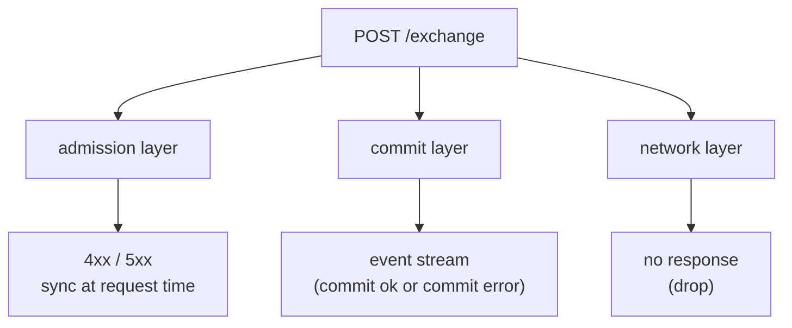
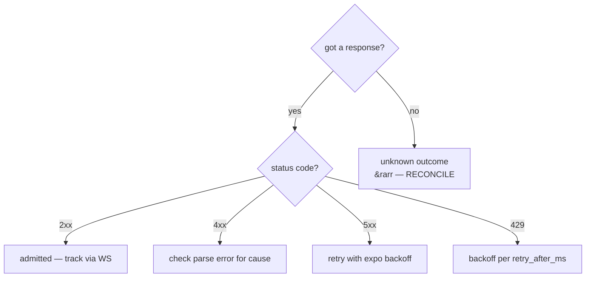
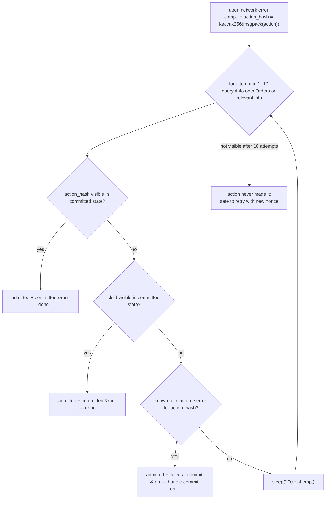

# معالجة الأخطاء

:::tip
**مستقر.**
:::

شجرة قرار لعملاء الإنتاج. يمكن الاطلاع على الفهرس الكامل لرسائل الأخطاء في [الأخطاء](../api/errors.md)؛ تشرح هذه الصفحة ما يجب **فعله** حيال كل فئة.

## طبقات الفشل الثلاث



| الطبقة | وقت الإطلاق | طريقة الإظهار |
|--------|------------|---------------|
| القبول | عند طلب `/exchange` | حالة HTTP + الجسم |
| الإيداع | عند إيداع الكتلة، ما بعد القبول | دفع WS عبر `userEvents` / `orderEvents`، أو ظاهر في `userFills` / `openOrders` |
| الشبكة | في أي مكان | خطأ TCP، انتهاء مهلة، استجابة جزئية |

لكل طبقة دلالاتها المختلفة. الخلط بينها هو أكثر أخطاء الإنتاج شيوعاً.

## شجرة القرار



## الطبقة الأولى — أخطاء القبول

تم تحليل الطلب، لكن رُفض عند القبول. الحالة `400` أو `401` أو `404` أو `405` أو `422`.

| الفئة | أمثلة | قاعدة إعادة المحاولة |
|-------|-------|----------------------|
| **خطأ في العميل** | `400 invalid_msgpack`، `400 unknown_action_variant`، `400 missing_field` | لا تُعِد المحاولة — أصلح الكود |
| **خطأ في التوقيع** | `401 signer_not_sender`، `401 unknown_chainId` | لا تُعِد المحاولة — تحقق من chainId / المفتاح / حالة الوكيل |
| **خطأ في الـ Nonce** | `400 nonce_must_increase` | ارفع الـ Nonce؛ أعِد المحاولة |
| **منطقي** | `422 price_not_tick_aligned`، `422 reduce_only_would_grow` | احسب القيمة الصحيحة؛ أعِد المحاولة |
| **الحالة** | `422 liquidation_tier_blocks_action`، `422 insufficient_balance` | أضف رصيداً / انتظر الانتقال إلى مستوى آخر؛ أعِد المحاولة |
| **حالة المصادقة** | `401 agent_not_yet_effective` | انتظر كتلة واحدة؛ أعِد المحاولة |
| **غير موجود** | `404 order_not_found`، `404 account_not_found` | لا تُعِد المحاولة؛ تحقق من المورد |

```typescript
async function handleAdmissionResponse(r: Response) {
  if (r.status === 202) return { admitted: true };

  const body = await r.json();
  switch (r.status) {
    case 400:
      // client bug — log loudly, do not retry
      throw new ClientBugError(body.error);

    case 401:
      // signing — depends on the cause
      if (body.error === 'agent not yet effective') {
        // wait + retry
        await sleep(200);
        return { admitted: false, retry: true };
      }
      throw new AuthError(body.error);

    case 422:
      // logical — caller can correct and retry
      throw new LogicalError(body.error);

    case 429:
      await sleep(body.retry_after_ms);
      return { admitted: false, retry: true };

    case 503:
      await sleep(body.retry_after_ms);
      return { admitted: false, retry: true };

    default:
      throw new UnknownError(`${r.status}: ${body.error}`);
  }
}
```

## الطبقة الثانية — أخطاء الإيداع

تم قبول الإجراء (`202`) لكنه فشل عند الإيداع. لن تعلم بذلك إلا عبر تدفق الأحداث.

| الخطأ | السبب | إعادة المحاولة؟ |
|-------|-------|----------------|
| `reduce_only_violation_post_admit` | تغيّرت المركز بين القبول والإرسال | نعم إن كانت النية لا تزال سارية |
| `stp_rejected` | قضاء منع التداول الذاتي على الأمر | لا — طابق أمر المُرسِل الآخر أولاً |
| `mark_price_band_violation` | سعر الأمر بعيد جداً عن سعر المرجع عند الإرسال | لا — أعِد تقييم السعر وأعِد تقديم الأمر |
| `evicted_under_cap_pressure` | تم قبوله لكن طُرد من الـ mempool قبل الكتلة | نعم (مع تأخير تدريجي) |
| `liquidation_pre_empted` | انتقل الحساب إلى T1+ بين القبول والإرسال | لا — أصلح الهامش أولاً |

اشترك في [قناة WS لـ `userEvents`](../api/ws/subscriptions.md#userevents) (تمر أحداث دورة حياة الأوامر عبر هذه القناة) وافصل بحسب نوع الحدث:

```typescript
ws.subscribe('orderEvents', { user: address }, (event) => {
  switch (event.data.kind) {
    case 'resting':       /* order is on the book; track oid */            break;
    case 'partialFill':   /* size partially filled; cloid still on book */ break;
    case 'filled':        /* fully filled; remove from open-order set */   break;
    case 'cancelled':     /* terminal */                                   break;
    case 'error':         /* commit-time error; handle per table above */
      handleCommitError(event.data);
      break;
  }
});
```

## الطبقة الثالثة — أخطاء الشبكة

الفئة الأكثر غموضاً. هل استقبل الخادم الطلب؟ هل تم إيداع الإجراء؟

| العَرَض | الإجراء |
|--------|---------|
| TCP RST قبل الاستجابة | التسوية: استعلم عن الحالة لتحديد النتيجة |
| انتهاء مهلة الاستجابة (أنت تضبط المهلة) | الأمر ذاته — التسوية |
| استجابة جزئية / مقطوعة | الأمر ذاته — التسوية |
| رُفض الاتصال | الجانب الخادم غير متاح؛ أعِد المحاولة مع تراجع أسي |
| فشل DNS | مشكلة شبكة / DNS؛ أعِد المحاولة مع تراجع أسي |

### نمط التسوية



نمط cloid-على-الأوامر (انظر [الأمان من التكرار](./idempotency.md)) يجعل هذا رخيصاً: استعلم عن الأوامر المفتوحة، وتحقق مما إذا كان cloid الخاص بك موجوداً.

بالنسبة للإجراءات غير المرتبطة بأوامر، طابق على `action_hash` (محدد بصورة حتمية من ترميز msgpack المحلي). يتضمن تدفق WS لـ `userEvents` حقل `action_hash` في كل حدث.

## وصفات الإنتاج

### تقديم الأمر مع إعادة المحاولة

```typescript
async function placeOrderSafely(client: Client, order: Order, maxAttempts = 3) {
  const cloid = '0x' + randomBytes(16).toString('hex');
  let lastNonce = Date.now();

  for (let attempt = 1; attempt <= maxAttempts; attempt++) {
    try {
      const res = await client.exchange.order({ ...order, cloid }, { nonce: lastNonce });
      return res;
    } catch (e) {
      if (e instanceof NetworkError) {
        // reconcile via cloid
        const placed = await client.info.findOpenOrderByCloid(client.address, cloid);
        if (placed) return placed;

        // bump nonce and retry
        lastNonce = Date.now();
        continue;
      }
      if (e instanceof RateLimitError) {
        await sleep(e.retryAfterMs);
        lastNonce = Date.now();
        continue;
      }
      throw e;  // client / signing / logical bug — propagate
    }
  }
  throw new Error('order failed after retries');
}
```

### إلغاء الأمر مع ضمان الأمان من التكرار

```typescript
async function cancelSafely(client: Client, asset: number, oid: number) {
  try {
    return await client.exchange.cancel({ asset, oid });
  } catch (e) {
    if (e.body?.error === 'order not found') return { alreadyDone: true };
    if (e instanceof NetworkError) {
      // re-query the order
      const orders = await client.info.openOrders(client.address);
      if (!orders.find(o => o.oid === oid)) return { alreadyDone: true };
      // it's still there — actually retry
      return cancelSafely(client, asset, oid);
    }
    throw e;
  }
}
```

### تسوية إيداع WS

```typescript
const pendingByHash = new Map<string, PendingAction>();

ws.subscribe('userEvents', { user: address }, (event) => {
  const hash = event.data.action_hash;
  const pending = pendingByHash.get(hash);
  if (!pending) return;

  if (event.data.kind === 'error') pending.reject(new CommitError(event.data));
  else                              pending.resolve(event.data);
  pendingByHash.delete(hash);
});

async function submit(action: Action) {
  const hash = keccak256(msgpack(action));
  const p = new Promise((resolve, reject) => pendingByHash.set(hash, { resolve, reject }));
  await client.exchange.submit(action);
  return Promise.race([p, timeout(5000)]);
}
```

## الحالات الحافة

<details>
<summary>عرض الحالات الحافة</summary>

- **البوابة ترجع 5xx لكن الإجراء تم إيداعه فعلياً.** قد يحدث إذا ضاعت رسالة ردّ البوابة ما بعد القبول. عامله كسقوط شبكي: سوِّ عبر cloid/action_hash.
- **تدفق WS متأخر عن الحالة الفعلية.** ربما حُذفت الأحداث من مخزن الاستئناف أثناء إعادة الاتصال. أعِد الاستعلام من `/info` عند الاستئناف لتثبيت نقطة البداية؛ ثم انتقل إلى WS للذيل الحي.
- **إرسال نفس الـ Nonce مرتين — ينجح أحدهما.** يفرض الخادم أحادية الاتجاه في الـ Nonce؛ المحاولة الثانية ترى `nonce_too_small` مما يدلك على أن الأولى حية. استخدم هذه الإشارة.
- **الأخطاء المنطقية المتأخرة.** أمر `Trigger` يُقبل اليوم لكنه لا يُنفَّذ أبداً لأن شرط الإطلاق لم يتحقق. لا يوجد خطأ؛ مجرد أمر قائم معلق. قم بمطابقة مجموعة أوامرك المفتوحة دورياً مقابل المجموعة المتوقعة في البوت.

</details>

## انظر أيضاً

- [الأخطاء](../api/errors.md) — الفهرس الكامل
- [الأمان من التكرار](./idempotency.md) — آليات Nonce و cloid
- [اشتراكات WS](../api/ws/subscriptions.md) — أحداث وقت الإيداع
- [حدود المعدل](../api/rate-limits.md) — ضبط إيقاع إعادة المحاولات

## الأسئلة الشائعة

<details>
<summary>عرض الأسئلة الشائعة</summary>

**س: هل أعامل أخطاء وقت الإيداع كاستثناءات أم كبيانات؟**
ج: كبيانات. إنها نتائج عادية للأوامر — `cancelled` بسبب STP، أو `error` بسبب تقليص ما بعد القبول. سجّلها وعالجها وفق المنطق التجاري؛ لا تتعطل بسببها.

**س: هل ثمة سبب وجيه لتجاهل خطأ قبول؟**
ج: في التدفقات الآمنة من التكرار البحتة (إلغاء أمر غير موجود)، لا بأس بابتلاع `404`. في كل حالة أخرى، سجّل بمستوى INFO أو أعلى وأعِد المحاولة أو أبلغ المشغّل.

**س: كيف أضع سقفاً لإعادة المحاولات؟**
ج: ميزانية زمنية بالساعة لكل عملية منطقية. لتقديم الأوامر، 5 ثوانٍ كافية بسخاء؛ للإلغاءات، ثانيتان. بعد ذلك، أبلغ المشغّل أو مراقب المخاطر لديك.

</details>
