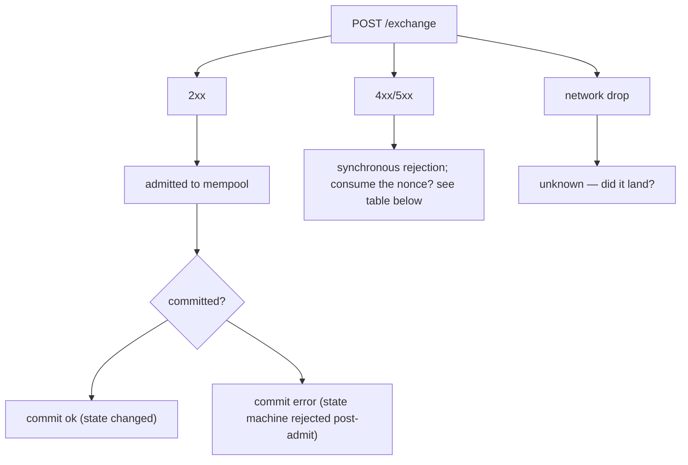
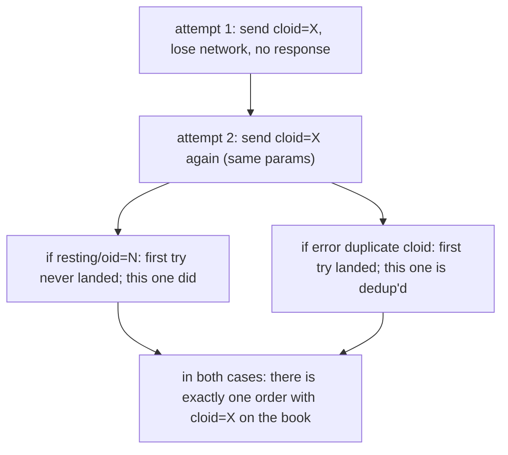

# الأمانة العملياتية (Idempotency)

:::tip
**مستقر.**
:::

كيفية إعادة المحاولة بأمان دون إهدار القيم العشوائية (nonces) أو تكرار الأوامر.

## ملخص سريع

- لكل إجراء قيمة `nonce`. إعادة استخدامها تُعيد الخطأ `400 nonce_must_increase`.
- عيّن `cloid` فريدًا لكل `Order` / `ModifyOrder`؛ يرفض الخادم `cloid` مكرر على نفس الحساب، مما يجعل إعادة المحاولة آمنة.
- أما الإجراءات غير المتعلقة بالأوامر، فإن **آلة الحالة** تضمن الأمانة العملياتية بطبيعتها (إلغاء أمر غير موجود لا يُسبب ضررًا؛ والتحويل محمي بالتحقق من الرصيد).
- يُقسَّم نموذج أخطاء الشبكة إلى ثلاث فئات — رفض القبول، وخطأ وقت الإيداع، وانقطاع الشبكة — لكل منها قاعدة إعادة محاولة مختلفة.

## فئات الأخطاء الثلاث



## استهلاك القيمة العشوائية (Nonce)

| النتيجة | هل استُهلكت الـ nonce؟ | هل إعادة المحاولة آمنة؟ |
|---------|:---------------:|:--------------:|
| `202 admitted` | نعم | لا — تأثير مزدوج |
| `400 nonce_must_increase` | لا (تجاوزناها بالفعل) | لا — أرسل بقيمة nonce أعلى |
| `400 invalid_msgpack` / أخطاء التحليل الأخرى | لا | نعم — صحّح وأعد الإرسال بنفس الـ nonce |
| `401 signer_*` | لا | لا حتى يُحلّ مشكل التوقيع؛ الـ nonce لم تُستهلك |
| `422 reduce_only_violation` وغيرها من الأخطاء المنطقية عند القبول | لا | نعم حالما تُحلّ المشكلة المنطقية |
| `429 rate_limit` | لا | نعم بعد انتهاء `retry_after_ms` |
| `503 mempool_full` | لا | نعم بعد انتهاء `retry_after_ms` |
| انقطاع الشبكة (لا استجابة) | غير معروف | تحقق — انظر [التحقق بعد انقطاع الشبكة](#reconcile-after-network-drop) أدناه |

القاعدة: **إذا وصل رد من الخادم → فقد اتُّخذ قرار الـ nonce**. انقطاع الشبكة هو الحالة الغامضة الوحيدة.

## الاستراتيجية: cloid

في ما يخص تقديم الأوامر، يُعدّ معرّف أمر العميل (client order id) أقوى آلية لمنع التكرار.

```typescript
const cloid = crypto.randomBytes(16);  // 16 bytes

await client.order({
  asset: 0, side: 'Buy', priceE8: '...', sizeE8: '...',
  tif: 'Gtc', cloid: '0x' + cloid.toString('hex'),
});
```

يُعيد الخادم:

| استجابة الخادم | المعنى |
|-----------------|---------------|
| `{"resting":{"oid":N,"cloid":"0x..."}}` | تم تقديم الأمر وتأكيد عدم التكرار |
| `{"error":"duplicate cloid"}` | طلب سابق بنفس الـ cloid تم قبوله؛ **الأمر موجود بالفعل في دفتر الأوامر**. ابحث عنه بالـ cloid. |
| `{"error":"<other>"}` | فشل هذا الإدخال؛ يمكنك إعادة المحاولة بـ cloid جديد أو بنفس الـ cloid |

قاعدة إعادة محاولة الأوامر: **نفس الـ cloid + نفس المعاملات** تضمن الأمانة العملياتية من البداية إلى النهاية. إذا نجحت المحاولة الأولى، فستُعيد الثانية `duplicate cloid` وتعلم أن الأمر الأصلي موجود.



تنطبق نفس المنطق على `ModifyOrder` — عيّن cloid جديدًا للتعديل لتجنب تكراره.

## الاستراتيجية: الأمانة على مستوى آلة الحالة

معظم الإجراءات غير المتعلقة بالأوامر تتمتع بالأمانة العملياتية على مستوى آلة الحالة:

| الإجراء | أمانة عملياتية؟ | السبب |
|--------|:-----------:|-----|
| `Cancel` | نعم | إلغاء أمر غير موجود أو مُلغى مسبقًا يُعيد `{"error":"order not found"}` — بلا أضرار |
| `CancelByCloid` | نعم | نفس السبب |
| `UpdateLeverage` | نعم | تعيين الرافعة المالية على القيمة الحالية لا يُنتج أثرًا |
| `UpdateMarginMode` | نعم | نفس السبب |
| `UserPortfolioMargin` | نعم | نفس السبب |
| `ApproveAgent` | نعم | بيانات الموافقة ذاتها تُحل محل السجل الحالي |
| `UsdcTransfer` | لا | تُحوّل مبلغًا جديدًا في كل مرة |
| `WithdrawUsdc` | لا | نفس السبب |
| `Delegate` / `Undelegate` | لا | تُضاف إلى قائمة الإجراءات في كل استدعاء |

للإجراءات التي لا تتمتع بالأمانة العملياتية، استخدم إحدى الطريقتين:
- **الـ nonce كمفتاح لمنع التكرار**: تتبّع القيم التي أرسلتها، ولا ترسل نفس الـ nonce مرتين. يُطبّق الخادم ذلك بصرف النظر.
- **جدول خارجي لمنع التكرار**: احتفظ بخريطة `{request_id → nonce}`؛ إذا وجدت في إعادة المحاولة nonce موجودة لهذا الـ request_id، فأنت أرسلت بالفعل.

## التحقق بعد انقطاع الشبكة {#reconcile-after-network-drop}

عند ضياع الاستجابة (إغلاق TCP، انتهاء المهلة، إلخ) لن تعرف إذا كان الإجراء قد اكتمل. تحقق على النحو التالي:

### للأوامر

اسأل عن الأمر بالـ cloid:

```bash
curl -X POST $BASE/info \
  -d '{"type":"openOrders","user":"0x..."}' | jq '.[] | select(.cloid == "0x<cloid>")'
```

إذا وُجد → تم قبوله؛ تعامل معه على أنه ناجح.
إذا غاب → تحقق من `userFills` بحثًا عن صفقة مرتبطة بذلك الـ cloid.
إذا لا يزال غائبًا → فشل القبول (أو طُرد من الـ mempool). أعد الإرسال بنفس الـ cloid.

### للتحويلات / السحوبات

استعلم عن `userFills` للحساب (الذي يشمل التمويل والتحويلات) أو `block_info` حول وقت الانقطاع. قارن بالـ action_hash الذي حسبته محليًا — لكل إجراء هاش حتمي بصرف النظر عن نتيجة القبول.

```typescript
const actionHash = keccak256(msgpack(action));
// search for events with this action_hash in WS history or info queries
```

إذا تعذّر تحديد النتيجة:
- **لإجراء يتمتع بالأمانة العملياتية**: أعد المحاولة بأمان (استخدم nonce جديدة، إذ قد تكون القديمة مستهلكة).
- **لإجراء لا يتمتع بالأمانة العملياتية**: توقّف؛ استعلم عن حالة الحساب لمعرفة ما إذا كان التأثير الجانبي قد حدث؛ استأنف فقط بعد التأكد.

## تسلسل — إعادة المحاولة بالـ cloid بعد انتهاء المهلة

```mermaid
sequenceDiagram
    participant C as Client
    participant S as Server
    C->>S: T=0 attempt 1: POST /exchange Order { cloid: X }
    Note over C,S: T=2s (no response — network drop)
    C->>S: T=2s attempt 2: POST /exchange Order { cloid: X } (same params, NEW nonce)
    S-->>C: T=2.1s response: error nonce_too_small → original was admitted! the new nonce is needed but the order itself is already in place.
    S-->>C: OR response: resting/oid=N → original never landed; this one did
    S-->>C: OR response: error duplicate cloid → original landed too; we're already dedup'd
    C->>S: T=2.2s query openOrders by cloid: confirm presence
```

يجعل الـ cloid مع فحوصات الخادم إعادة المحاولة آمنة حتى عند عدم استقرار الشبكة.

## استكشاف أخطاء الـ Nonce

| العرَض | السبب | الحل |
|---------|-------|-----|
| `nonce_must_increase` في كل طلب | انحراف الساعة المحلية (استخدام `Date.now()`) | زامن الساعة؛ أو استخدم عدادًا تصاعديًا (monotonic counter) |
| تصادم سكريبتين على نفس الـ nonce | مشاركة نفس الحساب | استخدم خدمة مشتركة لإدارة الـ nonce، أو سكريبت واحد لكل حساب |
| `nonce_too_small` بعد إعادة الاتصال | إعادة تعيين عداد الـ nonce المحلي إلى قيمة ما قبل الانقطاع | احتفظ بآخر nonce مُرسَلة بين عمليات التشغيل |

## انظر أيضًا

- [`POST /exchange`](../api/rest/exchange.md) — الغلاف الكامل بما فيه `nonce`
- [الأخطاء](../api/errors.md) — كل سلسلة خطأ مع طريقة المعالجة
- [معالجة الأخطاء](./error-handling.md) — شجرة قرار القبول مقابل الإيداع مقابل الشبكة
- [حدود المعدل](../api/rate-limits.md) — نظّم إعادة محاولاتك

## الأسئلة الشائعة

<details>
<summary>عرض الأسئلة الشائعة</summary>

**س: هل أستخدم `Date.now()` أم عدادًا؟**
ج: `Date.now()` مناسب لعملاء ذوي نسخة واحدة. أما العملاء متعددو النسخ على حساب واحد، فاستخدم عدادًا تصاعديًا مشتركًا (مثل Redis `INCR`) حتى لا تتصادم نسختان.

**س: ماذا لو أردت إعادة تشغيل إجراء عمدًا (تدفق يتمتع بالأمانة العملياتية)؟**
ج: استخدم نفس `cloid` (للأوامر) ونفس `nonce` جديدة. يُطبّق الخادم منع التكرار عبر الـ cloid؛ والـ nonce مهمتها فقط الحفاظ على سلامة الإرسال.

**س: هل يمكن إعادة استخدام الـ cloids بعد إلغاء الأمر الأصلي أو تنفيذه؟**
ج: لا. الـ cloids فريدة عالميًا لكل حساب إلى الأبد. استخدم واحدًا جديدًا لكل أمر.

**س: هل يوفر تغذية WS تأكيدًا في وقت الإيداع يمكن استخدامه للتحقق؟**
ج: نعم. اشترك في `userEvents` وقارن بـ `action_hash` أو `cloid`. تغذية WS هي الطريقة الموصى بها لتأكيد حالة الإيداع أثناء إعادة المحاولة.

</details>
