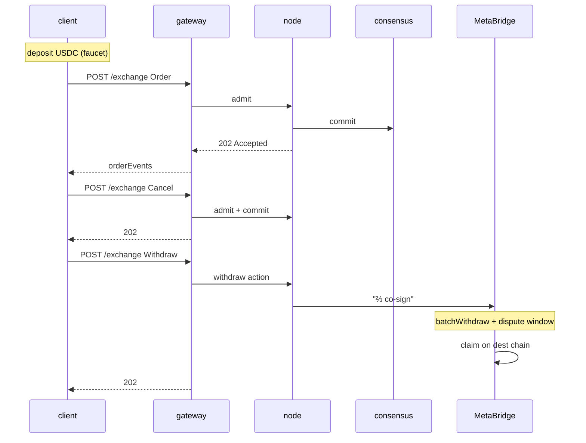

# البدء السريع — جولة كاملة في 5 دقائق

:::info
**الحالة.** سطح اتصال **مستقر**. نقاط نهاية Devnet، بدون ضمان على الشبكة الرئيسية.
:::

إيداع، وضع أمر، إلغاء، سحب. بنهاية هذه الصفحة، ستكون جلسة TypeScript / Python / curl الخاصة بك قد أكملت رحلة كاملة ذهاباً وإياباً مقابل devnet.

## المتطلبات الأساسية

- مفتاح خاص EVM (أي 32 بايت بترميز hex؛ لـ devnet، أنشئ مفتاحاً جديداً — لا تعيد استخدام مفتاح الشبكة الرئيسية)
- USDC على سلسلة مصدر MetaBridge (Base؛ يجري طرح Solana وArbitrum تدريجياً) — يتيح devnet بديل الصنبور عوضاً عن ذلك
- `curl` أو أي عميل HTTP

## نقاط النهاية

البوابة هي المدخل العام الوحيد. المسار MTF-native هو المسار الافتراضي؛
يقع المسار المتوافق مع HL تحت `/hl/*`.

| الخدمة | عنوان URL (devnet) |
|---------|--------------|
| مدخل البوابة الرئيسي | `https://devnet-gateway.mtf.exchange` |
| MTF-native (افتراضي) | `POST /info` · `POST /exchange` · `GET /ws` |
| متوافق مع HL | `POST /hl/info` · `POST /hl/exchange` · `GET /hl/ws` |
| متوافق مع CCXT | `/ccxt/*` |
| EVM JSON-RPC | `POST /evm` |
| الصنبور (devnet) | `POST /faucet` |
| المستعرض | `https://devnet.mtf.exchange/explorer` |

> الصنبور **ليس** خدمة منفصلة — بل هو مسار `POST /faucet` على مدخل البوابة الرئيسي. هل تشغّل العقدة بنفسك؟ السطح الأصلي ذاته (`/info` · `/exchange` · `/ws` · `/faucet`) يُخدَّم مباشرةً على `http://localhost:8080`. انظر [`POST /faucet`](../api/rest/faucet.md).

انظر [الشبكات](../networks.md) للاطلاع على القائمة الكاملة بما يشمل testnet و(ما بعد الإطلاق) الشبكة الرئيسية.

## الخطوة 1 — احصل على USDC في devnet

```bash
curl -X POST https://devnet-gateway.mtf.exchange/faucet \
  -H 'content-type: application/json' \
  -d '{"address":"0x<YOUR_ADDRESS>"}'
# -> {"address":"0x…","usdc":3000,"mtf":10,"status":"queued"}
```

يمنح طلب واحد **3000 USDC** كضمان مشترك **و10 رموز MTF** فورية —
**مرة واحدة فقط لكل عنوان** (يعيد الطلب الثاني `429 address already funded`)،
مع تحديد معدل 1 / دقيقة / IP. الخيار الاختياري `amount` لا يُقيَّد إلا **تنازلياً** على منحة USDC (≤ 3000)؛ أما MTF فثابتة. المنحة في حالة `"queued"` — وتصل بعد نحو كتلة واحدة، لذا انتظر لحظة قبل التحقق من الرصيد:

تستخدم طلبات curl الخام أدناه شكل **HL-compat** تحت `/hl/*` على البوابة
(أنواع camelCase مثل `clearinghouseState` / `openOrders`، وأظرفة موقّعة بـ msgpack) — مفيد إذا كان لديك عميل HL بالفعل. أمثلة `@metaflux/sdk` تتحدث MTF-native على المسار الافتراضي للبوابة (`/info` · `/exchange`). اختر مساراً واحداً؛ كلاهما يمر عبر نفس المدخل الرئيسي، ولكن بمسارات مختلفة.

```bash
curl -X POST https://devnet-gateway.mtf.exchange/hl/info \
  -H 'content-type: application/json' \
  -d '{"type":"clearinghouseState","user":"0x<YOUR_ADDRESS>"}'
```

ينبغي أن ترى `marginSummary.accountValue: "3000.0"`.

## الخطوة 2 — ضع أمر بسعر محدد

تفاصيل تدفق التوقيع الكامل موجودة في [التوقيع](./signing.md). في هذا البدء السريع استخدم SDK الرسمي لـ TypeScript (`@metaflux/sdk` — يُطلق قبل الشبكة الرئيسية؛ انظر [TypeScript SDK](./typescript-sdk.md)).

```typescript
import { MetaFluxClient } from '@metaflux/sdk';

const client = new MetaFluxClient({
  privateKey: process.env.PRIVATE_KEY!,
  baseUrl:    'https://devnet-gateway.mtf.exchange', // MTF-native is the gateway default path
  chainId:    31337,
});

const meta = await client.info.meta();
const btcId = meta.universe.findIndex(m => m.name === 'BTC');

const result = await client.exchange.order({
  asset:    btcId,
  isBuy:    true,
  price:    '50000',
  size:     '0.1',
  tif:      'Gtc',
  reduceOnly: false,
});

console.log('order id:', result.oid);
```

طلب curl الخام (شكل HL-compat — عليك بناء التوقيع بنفسك؛ انظر [التوقيع](./signing.md)):

```bash
curl -X POST https://devnet-gateway.mtf.exchange/hl/exchange \
  -H 'content-type: application/json' \
  -d @order.json
```

حيث `order.json` هو ظرف شكل HL الذي أعددته.

### مثال على التداول الفوري

[التداول الفوري](../products/spot.md) هو CLOB بالرمز مقابل الرمز، منفصل عن العقود الدائمة — بدون رافعة مالية، بدون مراكز. ضع أمراً فورياً باستخدام الإجراء الأصلي [`spot_order`](../api/rest/exchange.md#spot_order): يأخذ **معرف زوج فوري** (وليس `market` عقود دائمة)، و`side`، و`limit_px`، و`size`، و`tif`. أمر `gtc`/`alo` المعلّق يُغلق ضمان الرصيد المحجوز؛ `ioc` لا يظل معلقاً أبداً.

```jsonc
// the `action` you sign and POST to /exchange (sender-authorized, no `owner`)
{
  "type": "spot_order",
  "order": {
    "pair":     200,           // spot pair id from /info, not a perp market id
    "side":     "bid",         // bid = buy base (pays quote); ask = sell base
    "size":     100000000,
    "limit_px": 200000000,     // a limit is required — market spot is not yet supported
    "tif":      "gtc",
    "stp_mode": "cancel_oldest"
  }
}
```

تحمل الاستجابة المتزامنة الـ `oid` المخصص مع إدخال `resting` أو `filled` (نفس اتحاد الحالة كأمر عقود دائمة). اقرأ أرصدتك الفورية والأوامر الفورية المفتوحة عبر [`POST /info`](../api/rest/info.md)؛ وألغِ بـ [`spot_cancel`](../api/rest/exchange.md#spot_cancel) الذي يُعيد الضمان المحجوز.

## الخطوة 3 — تحقق من وجود الأمر في دفتر الطلبات

```bash
curl -X POST https://devnet-gateway.mtf.exchange/hl/info \
  -H 'content-type: application/json' \
  -d '{"type":"openOrders","user":"0x<YOUR_ADDRESS>"}'
```

ينبغي أن ترى أمرك مع الـ `oid` من الخطوة 2.

أو اشترك في التحديثات المباشرة (مُفضَّل لأي استخدام غير بسيط):

```typescript
const ws = client.ws();
ws.subscribe('userEvents', { user: client.address }, (event) => {
  console.log('event:', event);
});
```

## الخطوة 4 — الإلغاء

```typescript
await client.exchange.cancel({ asset: btcId, oid: result.oid });
```

```bash
# raw curl
curl -X POST https://devnet-gateway.mtf.exchange/hl/exchange \
  -d @cancel.json
```

## الخطوة 5 — السحب

```typescript
await client.exchange.withdrawUsdc({
  amount:           '100',
  destinationChain: 'Arbitrum',
  destinationAddr:  '0x<DESTINATION>',
});
```

يُضيف هذا عملية سحب MetaBridge في قائمة الانتظار. بعد أن يُشارك في توقيعها مجموعة المدققين في MetaFlux بنصاب يبلغ ⅔ من الحصة الموزونة، وانقضاء فترة النزاع (بضع دقائق)، يمكنك `claim` على سلسلة الوجهة (انظر [الجسر](../bridge/)).

## ماذا حدث للتو



## الخطوات التالية

- [التوقيع](./signing.md) — ما يوجد داخل عملية التوقيع في SDK
- [محافظ الوكلاء عملياً](./agent-wallets-howto.md) — نمط المفتاح الساخن في بيئة الإنتاج
- [أنواع الأوامر](../concepts/order-types.md) — ما وراء الأوامر بسعر محدد البسيطة
- [معالجة الأخطاء](./error-handling.md) — القبول مقابل التأكيد مقابل الشبكة
- [اشتراكات WS](../api/ws/subscriptions.md) — التدفق المباشر للبيانات الحية
- [الانتقال من HL](./migrating-from-hl.md) — لديك بوت HL بالفعل؟ ابدأ بهذه الصفحة

## استكشاف الأخطاء وإصلاحها

<details>
<summary>عرض استكشاف الأخطاء وإصلاحها</summary>

| العَرَض | السبب المحتمل | الحل |
|---------|--------------|-----|
| `401 signer is not the sender` | `chainId` خاطئ | استخدم `31337` لـ devnet |
| `400 invalid msgpack` | المُرمِّز يُعيد ترتيب مفاتيح الخريطة | استخدم مكتبة msgpack متوافقة مع المعايير |
| `404 unknown user` على info | العنوان ليس له حالة على السلسلة بعد | أودع أولاً (الصنبور) |
| `429 rate limit` | طلبات كثيرة جداً | انظر [حدود المعدل](../api/rate-limits.md)؛ أبطئ الطلبات |
| السحب متوقف في الوجهة | سحب MetaBridge معلق (فترة النزاع) | انتظر توقيع ⅔ وفترة النزاع؛ ثم نفّذ `claim` على سلسلة الوجهة (انظر [الجسر](../bridge/)) |

</details>

## انظر أيضاً

- [الشبكات](../networks.md) — نقاط نهاية devnet / testnet / mainnet ومعرفات chainIds
- [التوقيع](./signing.md) — مواصفات الظرف الكاملة
- [`POST /exchange`](../api/rest/exchange.md)
- [`POST /info`](../api/rest/info.md)
- [WS](../api/ws/index.md)
