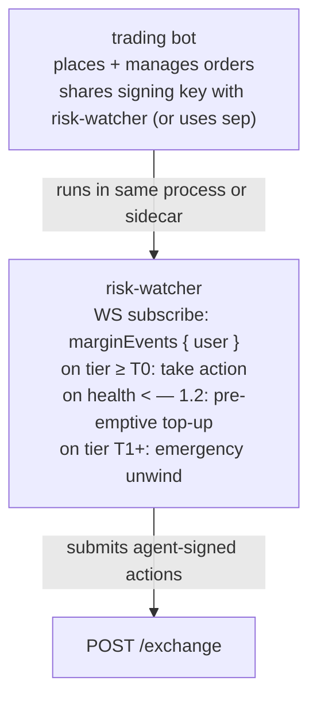
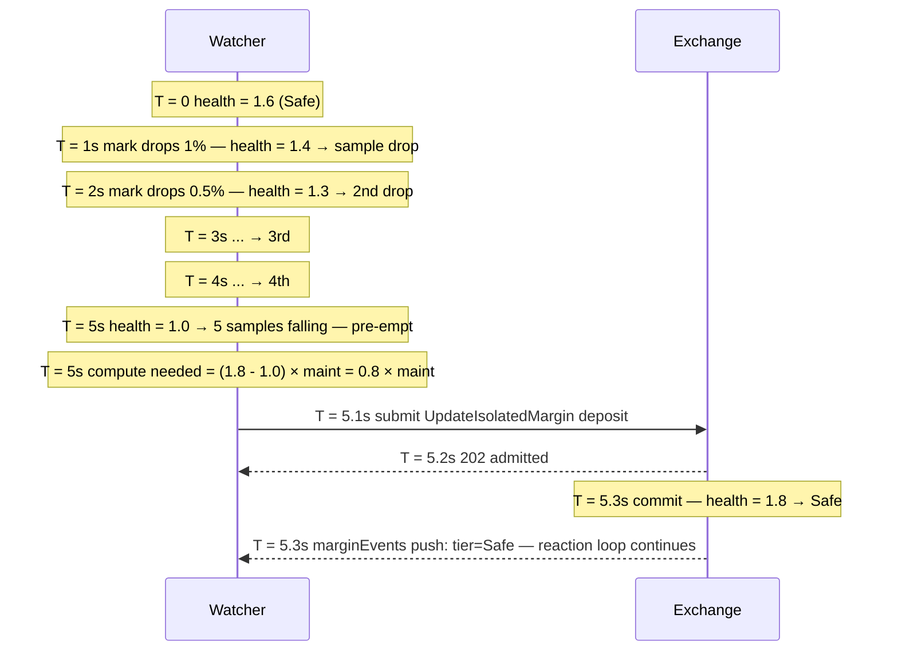

# نمط مراقب المخاطر

:::tip
**مستقر.**
:::

مراقب المخاطر هو عملية آلية تراقب صحة حسابك وتتدخل — بإيداع هامش، أو تقليص المركز، أو التداول بشكل دفاعي — قبل أن تُطلق [آلية التصفية المتدرجة](../concepts/tiered-liquidation.md) الخاصة بالبروتوكول عليك.

ينبغي لروبوتات التداول الإنتاجية التي تحتفظ بمراكز طوال الليل أن تُشغّل واحدًا. تمنحك بطاقة T0 الصفراء الخاصة بالبروتوكول بلوكًا واحدًا (~100ms)؛ يستثمر مراقب المخاطر ذلك البلوك استثمارًا فعّالًا.

## ملخص سريع

اشترك في `marginEvents`، استجب لتحولات المستويات، وأضف رصيدًا عبر `UpdateIsolatedMargin` (معزول) أو `Deposit` (متقاطع) قبل أن يصبح `maint_margin` مُقيِّدًا.

## البنية المعمارية



مراقب المخاطر هو عملية منطقية منفصلة حتى حين يكون مستضافًا في المكان ذاته — فقراراته مستقلة عن قرارات استراتيجية التداول. خطأ شائع هو الخلط بين "هل يجب أن أغلق هذا المركز؟" و"هل يجب أن أُنفّذ هذه الصفقة؟"؛ يجيب مراقب المخاطر على السؤال الأول فحسب.

## المدخلات

- `marginEvents` عبر WS: بث مباشر لـ `account_value` و`maint_margin` و`health` و`tier`.
- `mark` عبر WS (لكل أصل مُحتفظ به): للتقدير الاستشرافي.
- `fundingTicks` عبر WS: لاستباق رسوم التمويل الساعية.

## قواعد الاستجابة

| المحفّز | الإجراء | المبرر |
|---------|--------|-----------|
| `health < 1.5` ومتراجع على مدى 5 عينات متتالية | إيداع استباقي لرفع الصحة إلى 1.8 | حاجز أمان قبل T0 |
| `tier transition to T0` | إيداع فوري أو إغلاق جزئي | بلوك واحد للتصرف قبل T1 |
| `tier transition to T1` | طارئ: إغلاق كامل للمركز الأعلى خسارةً | تفادي الإغلاق الجزئي بسعر أسوأ |
| دفعة التمويل في الدقيقة القادمة > `0.5 × free_collateral` | إيداع مسبق | يمكن لرسوم التمويل أن تُدخلك في T0 |
| تحرك السعر > 3× الانحراف المعياري للساعة الأخيرة خلال 30 ثانية | التقاط لقطة للمراكز وتنبيه المشغّل | احتمال تحول في النظام |

اضبط العتبات وفق استراتيجيتك. صانعو السوق العدوانيون: حواجز أضيق (أرضية صحة 1.3). الدفاتر المتحفظة: حواجز أوسع (أرضية صحة 1.8).

## مسودة تنفيذ (TypeScript)

```typescript
import { MetaFluxClient } from '@metaflux/sdk';

const trader = new MetaFluxClient({ /* trading agent */ });
const watcher = new MetaFluxClient({ /* dedicated watcher agent */ });

const TARGET_HEALTH = 1.8;
const T0_DEPOSIT_USDC = 1000;  // tune to position size

let recentSamples: number[] = [];

watcher.ws().subscribe('marginEvents', { user: trader.address }, async (event) => {
  const { health, tier, account_value, maint_margin } = event.data;

  recentSamples.push(health);
  if (recentSamples.length > 5) recentSamples.shift();

  // Tier-based reactions
  if (tier === 'T1') {
    console.log('[ALERT] T1 — emergency unwind');
    await emergencyUnwind(trader);
    return;
  }
  if (tier === 'T0') {
    console.log('[WARN] T0 — top up');
    await deposit(watcher, T0_DEPOSIT_USDC);
    return;
  }

  // Pre-emptive
  const allFalling = recentSamples.length === 5
    && recentSamples.every((h, i) => i === 0 || h < recentSamples[i-1]);
  if (allFalling && health < 1.5) {
    console.log('[INFO] pre-emptive top-up');
    const needed = Math.ceil((TARGET_HEALTH * maint_margin - account_value) / 1e6);
    await deposit(watcher, needed);
  }
});

async function deposit(c: MetaFluxClient, usdc: number) {
  // For Cross: assume USDC already in the master's free balance
  // For Isolated: use UpdateIsolatedMargin to add to the bucket
  await c.exchange.updateIsolatedMargin({
    asset: 0,
    isIsolated: true,
    isolatedAmount: (usdc * 1e6).toString(),
  });
}

async function emergencyUnwind(c: MetaFluxClient) {
  const state = await c.info.clearinghouseState();
  for (const pos of state.assetPositions) {
    // close the largest-loss position first
    await c.exchange.order({
      asset: pos.coin,
      isBuy: pos.szi < 0,    // opposite side closes
      price: '0',            // market (extreme price)
      size:  Math.abs(pos.szi).toString(),
      tif:   'Ioc',
      reduceOnly: true,
    });
  }
}
```

## الخيارات الرئيسية

- **وكيل منفصل للمراقب.** يتولى وكيل المتداول التداول؛ ويتولى وكيل المراقب إدارة الهامش. لا تُتيح أي اختراق لمضيف التداول التلاعب في الهامش.
- **صلاحيات المراقب.** يستطيع الوكلاء إرسال `UpdateIsolatedMargin` وإنشاء الأوامر / إلغاؤها. لا يستطيع الوكلاء السحب، لذا لا يمكن للمراقب نقل الأموال خارج الحساب — بل فقط بين الحسابات الفرعية. وهذا هو السلوك المطلوب.
- **مساحة nonce الخاصة بالمراقب.** يشترك المراقب والمتداول في مساحة nonce الخاصة بالحساب الرئيسي (وفق [محافظ الوكلاء](../concepts/agent-wallets.md)). استخدم `Date.now()` على كليهما — احتمال التصادم أقل من ميلي ثانية.

## حسابات الإيداع المسبق

لرفع الصحة من H₀ إلى الهدف H₁:

```
needed_deposit = (H₁ - H₀) × maint_margin
```

مثال: maint = 10 USDC، الصحة الحالية 1.0، الهدف 1.5.
المطلوب = (1.5 - 1.0) × 10 = 5 USDC.

ضع حدًا أقصى لإيداع المراقب لكل بلوك تفاديًا للإنفاق الزائد في ظل نظام عابر. الإعداد الافتراضي العدواني: 1× من القيمة الاسمية للمركز محجوزة للإيداعات التكميلية؛ وعند استنفادها، يُصعَّد الأمر إلى المشغّل.

## التسلسل الزمني — الإيداع الاستباقي



## أوضاع الفشل

- **تسابق المراقب والمتداول.** يُرسل المتداول مركزًا جديدًا؛ يستجيب المراقب للمركز الجاري تنفيذه. الحل: لا تستجب إلا بعد التأكيد (تُطلق أحداث الهامش عند التأكيد، لذا هذه الحالة محلولة مسبقًا).
- **انتهاء صلاحية وكيل المراقب.** في أوقات الضغط، لا يستطيع المراقب التصرف. الحل: دورة تحديث دورية صارمة، ومراقبة انتهاء صلاحية الوكيل، مع التأكد من أن المتبقي لا يقل عن 24 ساعة قبل الانتهاء.
- **امتلاء مجمع المعاملات أثناء الضغط.** يتلقى إيداع المراقب خطأ 503. تراجع بجيتر أسي (exponential jitter)؛ وأرسل بحد أقصى كل 100ms.
- **نجاح الإيداع لكن يبقى الأوراكل في حالة سيئة.** يرفع الإيداع `account_value`؛ إن كان `maint` قد ارتفع أيضًا (تحرك السعر ضدك)، قد لا تتحسن الصحة بما يكفي. الحل: أعد التقييم بعد التأكيد؛ أودع مرة أخرى أو أغلق المركز.

## متى لا تُنشئ مراقب مخاطر

- المراكز قصيرة الأجل جدًا (تُفتح وتُغلق في بلوك واحد) — لا أهمية للصحة هنا.
- تداول السبوت الخالص بدون هامش — لا تسري آلية التصفية المتدرجة.
- روبوتات معزولة بمركز واحد حيث قبلت صراحةً بحد الخسارة المحدد للحسابة الفرعية — أتمتة الإيداعات التكميلية تُفسد مبدأ العزل.

## انظر أيضًا

- [التصفية المتدرجة](../concepts/tiered-liquidation.md) — الآلية التي تدافع ضدها
- [`userEvents` WS](../api/ws/subscriptions.md#userevents) — تحولات الهامش والمستويات تمر عبر هذه القناة
- [`update_isolated_margin`](../api/rest/exchange.md#update_isolated_margin)
- [محافظ الوكلاء](../concepts/agent-wallets.md) — يحتاج المراقب إلى وكيل معتمد خاص به
- [معالجة الأخطاء](./error-handling.md) — لمنطق إعادة إرسال طلبات الإيداع
