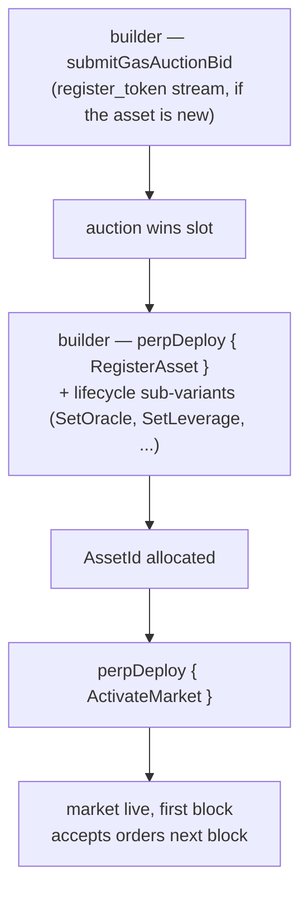

# MIP-3 — نشر سوق عقود دائمة بلا إذن مسبق

:::info
**مُطبَّق.**
:::

يستطيع أي مطوّر نشر سوق عقود دائمة (Perpetual) جديد على MetaFlux عبر مزاد غاز على السلسلة، دون أي بوابة من فريق البروتوكول أو لجنة مراجعة أو قائمة سماح. سعر المزاد مضافًا إليه حدٌّ أدنى من الإيداع هما العائقان الوحيدان. (نشر سوق **spot** بلا إذن مسبق هو الاقتراح الشقيق، [MIP-1](./mip-1.md).)

## لماذا يوجد هذا؟

هذا محور تمييز جوهري. تنتقي البورصات المركزية قوائمها بعناية؛ أما MetaFlux فتجعل عملية الإدراج نفسها جزءًا من البروتوكول. المطوّرون الراغبون في سوق لأصل متخصص لا يحتاجون إذنًا — يحتاجون إلى الفوز في مزاد وتزويد معاملات البذر الأولية.

هذا هو تكيُّف MetaFlux مع تصميم النشر بلا إذن مسبق الذي ارتاده أبرز منصات العقود الدائمة على السلسلة، مع المحافظة على التكافؤات والتعديلات التالية:

- ثلاثة تدفقات مزاد غاز مستقلة (`perp_deploy_gas_auction`، `spot_pair_deploy_gas_auction`، `register_token_gas_auction`) — نفس البنية المعتمدة. نشر العقود الدائمة يخص MIP-3؛ أما تدفقات Spot فتعود إلى [MIP-1](./mip-1.md).
- معاملات المزاد (الانحلال، ونافذة الاسترداد، وفاصل الفتحة الزمنية) قابلة للضبط عبر الحوكمة
- نسبة الصيانة الأولية، والرافعة المالية القصوى، وسقف التمويل — تُقدَّم مع عرض النشر، وتحدها نطاقات يضبطها الحوكمة

## تدفق النشر



نشر العقود الدائمة يتم عبر الإجراء `perpDeploy`، الذي يُوزَّع من خلال متغيرات فرعية من النوع `PerpDeployKind` تغطي دورة حياة السوق الكاملة (8 متغيرات فرعية):

1. **`RegisterAsset`** — تسجيل أصل عقود دائمة جديد؛ يخصص `AssetId`. (يستلزم تسجيل رمز التوكن أولًا عبر تدفق `register_token_gas_auction` إن لم يكن مسجلًا بعد.)
2. **`SetOracle`** — ربط مجموعة فرعية من مصادر الأوراكل للأصل أو تدويرها.
3. **`SetLeverage`** — تحديد سقف الرافعة المالية القصوى.
4. **`SetFeeTier`** — تحديد شريحة رسوم صانع/آخذ السوق (بالنقاط الأساسية، محدودة بحدود كل سوق).
5. **`SetMakerRebate`** — تحديد خصم صانع السوق (بالنقاط الأساسية، ≤ 2).
6. **`SetMinSize`** — تحديد الحجم الأدنى للأوامر في السوق.
7. **`ActivateMarket`** — تفعيل السوق (السماح بالتداول؛ يستلزم اكتمال الإعداد).
8. **`DeactivateMarket`** — إغلاق السوق أمام الأوامر الجديدة (تبقى المراكز القائمة دون تغيير).

الفوز بفتحة نشر يمر عبر مزاد الغاز: يستدعي المطوّر **`submitGasAuctionBid { auction_kind, bid_amount, ... }`** على التدفق المعني. يحمل كل عرض:
- مبلغًا بـ USDC محتجزًا في الضمان عند التقديم، يُعاد عند الخسارة (مطروحًا منه رسم صغير).
- مواصفات السوق — الرافعة المالية الأولية، ونسبة هامش الصيانة، ومعاملات التمويل، وإعداد مصدر الأوراكل.

تُحسم المزادات عند حدود الكتل — الفائز بكل فتحة هو أعلى مزايد، والمبلغ المدفوع يُحرَق (لا يُدفع لأحد)، وتصبح معاملات المواصفات معاملات السوق المنشور.

## الضمان والاسترداد

تُحتجز العروض في ضمان طوال فترة المزاد. عند الخسارة، يُعاد العرض إلى حساب المطوّر مطروحًا منه رسم مزاد صغير. عند الفوز، يُحرَق المبلغ الفائز عند إغلاق الفتحة (لا يُدفع لأحد).

يمكن الاطلاع على العروض النشطة عبر:

```json
POST /info { "type": "mip3_active_bids" }
```

## حدود المعاملات

تضبط الحوكمة النطاقات التي يجب أن تقع ضمنها معاملات مواصفات العرض:

- الرافعة المالية الأولية في النطاق `[1, max_leverage]` (القيمة الافتراضية `max_leverage = 50`)
- نسبة هامش الصيانة ≥ `min_maintenance_ratio` (الافتراضي 1%)
- سقف التمويل ≤ `max_funding_per_hour` (الافتراضي 0.5%)
- مصدر الأوراكل من القائمة المعتمدة

تُرفض العروض ذات المعاملات الخارجة عن الحدود عند التقديم.

## معاملات المزاد

لكل تدفق (عقود دائمة / spot / تسجيل توكن)، يشتمل المزاد على:

- **فاصل الفتحة الزمنية** — مدة تسوية كل مزاد جديد (حوكمة، الافتراضي ساعة واحدة)
- **الانحلال** — كيفية انخفاض الحد الأدنى للعرض إذا لم تُطالَب بفتحة (حوكمة، الافتراضي خطي على 24 ساعة)
- **نافذة الاسترداد** — المدة التي يمكن فيها للمزايدين الخاسرين المطالبة باسترداد أموالهم بعد إغلاق الفتحة (حوكمة، الافتراضي 7 أيام)

الثلاثة جميعها قابلة للتعديل عبر الحوكمة من خلال إجراء `SetGlobal` (متغيرات الحوكمة العالمية للمطوّرين في MIP-3: `SetGasAuctionDuration`، `SetMinDeployStake`، `SetGasAuctionMinBid`، `SetDeployerFeeCap`، `SetPerMarketLimits`، `SetEnableMip3`).

## بعد النشر

يعيش السوق الجديد في سجل الأصول الرسمي اعتبارًا من الكتلة التالية. توفير السيولة مسؤولية المطوّر؛ البروتوكول لا يوفر أوامر بذر أولية.

يعتمد المطوّرون عادةً على تعميق السيولة عبر الجمع بين نشر MIP-3 ومصدر سيولة على نفس السوق — [MIP-2 Metaliquidity](./mip-2.md)، أو صانع سوق خارجي يستقطبه خصم رسوم المطوّر، أو خزينة يُنشئها المستخدمون.

## MIP-4

انظر [MIP-4 — مجمِّع/مستوعِب سيولة العقود الدائمة](mip-4.md) للاطلاع على المجمِّع الذي تشغّله MetaFlux ويكمّل النشر بلا إذن مسبق.

## انظر أيضًا

- [MIP-1 — معيار توكن Spot + نشر السوق](./mip-1.md) — الشقيق في السوق الفوري للنشر بلا إذن مسبق
- [التصفية متعددة المراحل](../concepts/tiered-liquidation.md) — تنطبق على أسواق MIP-3 المنشورة تمامًا كما على الأسواق المدرجة بواسطة البروتوكول
- [هامش المحفظة](../concepts/portfolio-margin.md) — تنضم أسواق MIP-3 إلى PM عبر إدراجها في سيناريو القياسي المعتمد
