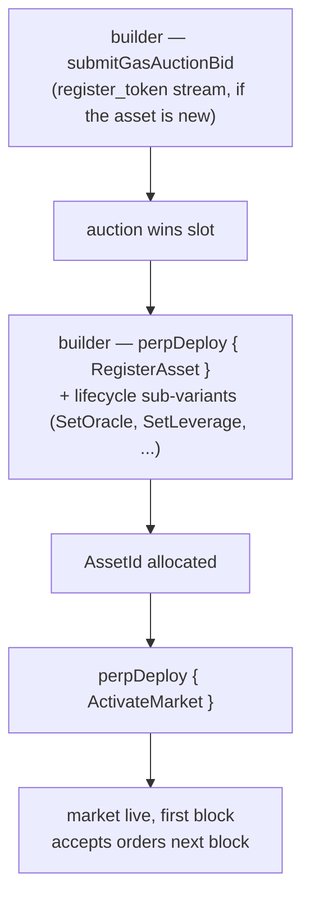

# MIP-3 — نشر سوق العقود الدائمة بلا إذن مسبق

:::info
**مُطبَّق.**
:::

يستطيع أي مطوّر نشر سوق عقود دائمة جديد على MetaFlux عبر دفع رسوم من خلال مزاد غاز على السلسلة. لا توجد بوابة من فريق البروتوكول، ولا لجنة مراجعة، ولا قائمة مسموح بها. سعر المزاد مضافًا إليه حدٌّ أدنى للإيداع هما العائق الوحيد. (نشر سوق **الفوري** بلا إذن مسبق هو المقترح الشقيق، [MIP-1](./mip-1.md).)

## لماذا يوجد هذا

قدرة جوهرية من قدرات البروتوكول. تعمل البورصات المركزية على انتقاء التدرجات؛ أما MetaFlux فتجعل عملية الإدراج ذاتها جزءًا من البروتوكول. لا يحتاج المطوّرون الراغبون في فتح سوق لأصل متخصص إلى إذن — بل يحتاجون إلى الفوز بمزاد وتزويد المعاملات الأولية.

يُمثّل هذا تكيّف MetaFlux مع تصميم النشر اللامركزي للأسواق الذي ريادته أبرز منصات العقود الدائمة على السلسلة، مع الحفاظ على المكافئات والتعديلات التالية:

- ثلاثة تدفقات مستقلة لمزاد الغاز (`perp_deploy_gas_auction` و`spot_pair_deploy_gas_auction` و`register_token_gas_auction`) — بنية مطابقة لـ HL. النشر الدائم هو MIP-3؛ وتدفقات الفوري مرتبطة بـ [MIP-1](./mip-1.md).
- معاملات المزاد (الاضمحلال، نافذة الاسترداد، فترة الفتحة) قابلة للضبط عبر الحوكمة
- نسبة الصيانة الأولية، والرفع الأقصى، وسقف التمويل — تُقدَّم مع عرض النشر، مقيَّدة بنطاقات تحددها الحوكمة

## مسار النشر



نشر العقود الدائمة هو إجراء `perpDeploy`، يُرسَل عبر متغيّر فرعي `PerpDeployKind` يغطي دورة حياة السوق الكاملة (8 متغيّرات فرعية):

1. **`RegisterAsset`** — تسجيل أصل دائم جديد؛ يخصص `AssetId`. (يتطلب تسجيل رمز التوكن أولًا عبر تدفق `register_token_gas_auction`، إن لم يكن مسجَّلًا بعد.)
2. **`SetOracle`** — ربط مجموعة مصادر الأوراكل للأصل أو تدويرها.
3. **`SetLeverage`** — ضبط سقف الرفع الأقصى.
4. **`SetFeeTier`** — ضبط مستوى رسوم صانع/آخذ السوق (بالنقاط الأساسية، مقيَّدة بحدود لكل سوق).
5. **`SetMakerRebate`** — ضبط خصم صانع السوق (بالنقاط الأساسية، ≤ 2).
6. **`SetMinSize`** — ضبط الحد الأدنى لحجم الأوامر في السوق.
7. **`ActivateMarket`** — تفعيل السوق (السماح بالتداول؛ يستلزم إعدادًا كاملًا).
8. **`DeactivateMarket`** — إغلاق السوق أمام الأوامر الجديدة (المراكز القائمة تبقى).

الفوز بفتحة نشر يمر عبر مزاد الغاز: يستدعي المطوّر **`submitGasAuctionBid { auction_kind, bid_amount, ... }`** على التدفق المعني. يحمل كل عرض:
- مبلغًا بـ USDC يُودَع عند التقديم ويُردّ في حالة الخسارة (مطروحًا منه رسم بسيط).
- مواصفات السوق — الرفع الأولي، ونسبة هامش الصيانة، ومعاملات التمويل، وإعدادات مصدر الأوراكل.

تُحسم المزادات عند حدود الكتل — الأعلى سعرًا في كل فتحة يفوز، والمبلغ المدفوع يُحرق (لا يذهب لأحد)، وتصبح معاملات المواصفات هي معاملات السوق المنشور.

## الضمان واسترداد العروض

تُحتجز العروض في ضمان طوال فترة تشغيل المزاد. عند الخسارة، يُعاد العرض إلى حساب المطوّر مطروحًا منه رسم مزاد بسيط. عند الفوز، يُحرق المبلغ الفائز عند إغلاق الفتحة (لا يذهب لأحد).

العروض النشطة متاحة عبر:

```json
POST /info { "type": "mip3_active_bids" }
```

## حدود المعاملات

تضع الحوكمة النطاقات التي يجب أن تقع ضمنها معاملات مواصفات العرض:

- الرفع الأولي في `[1, max_leverage]` (القيمة الافتراضية `max_leverage = 50`)
- نسبة هامش الصيانة ≥ `min_maintenance_ratio` (الافتراضي 1%)
- سقف التمويل ≤ `max_funding_per_hour` (الافتراضي 0.5%)
- مصدر الأوراكل من القائمة المعتمدة

تُرفض العروض ذات المعاملات الخارجة عن النطاق عند التقديم.

## معاملات المزاد

لكل تدفق (دائم / فوري / تسجيل توكن)، يمتلك المزاد:

- **فترة الفتحة** — المدة بين تسوية كل مزاد جديد (الحوكمة، الافتراضي ساعة واحدة)
- **الاضمحلال** — كيفية انخفاض الحد الأدنى للعرض إذا لم تُطالَب بفتحة (الحوكمة، الافتراضي خطي على مدى 24 ساعة)
- **نافذة الاسترداد** — المدة بعد إغلاق الفتحة التي يمكن فيها لمقدمي العروض الخاسرين المطالبة بالاسترداد (الحوكمة، الافتراضي 7 أيام)

كلها قابلة للتعديل عبر الحوكمة من خلال إجراء `SetGlobal` (متغيرات حوكمة منشئي MIP-3 العالمية: `SetGasAuctionDuration` و`SetMinDeployStake` و`SetGasAuctionMinBid` و`SetDeployerFeeCap` و`SetPerMarketLimits` و`SetEnableMip3`).

## بعد النشر

يعيش السوق الجديد في سجل الأصول الرسمي اعتبارًا من الكتلة التالية. توفير السيولة مسؤولية المطوّر؛ البروتوكول لا يقدم أي أوامر أولية.

يُوجِّه المطوّرون عادةً عمق السيولة بدمج نشر MIP-3 مع مصدر سيولة على نفس السوق — [MIP-2 Metaliquidity](./mip-2.md)، أو صانع سوق خارجي مستقطَب بخصومات رسوم المطوّر، أو خزينة أنشأها مستخدم.

## MIP-4

راجع [MIP-4 — مجمّع سيولة العقود الدائمة / الاستيعاب الداخلي](mip-4.md) للاطلاع على المجمّع الذي تُشغّله MetaFlux ويُكمّل النشر اللامركزي.

## انظر أيضًا

- [MIP-1 — معيار توكن الفوري + نشر السوق](./mip-1.md) — الشقيق الفوري للنشر اللامركزي
- [التصفية المتدرجة](../concepts/tiered-liquidation.md) — تنطبق على أسواق MIP-3 المنشورة تمامًا كما تنطبق على الأسواق المدرجة في البروتوكول
- [هامش المحفظة](../concepts/portfolio-margin.md) — أسواق MIP-3 تنضم إلى PM عبر تضمين السيناريو المعياري
