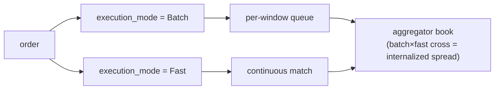

# MIP-4 — مجمِّع السيولة / المُدمِج لعقود الفروقات الدائمة

:::info
**مخطَّط له.** مستهدَف للإصدار V2؛ خارج نطاق الشبكة الرئيسية v1.
:::

MIP-4 هو **مجمِّع سيولة / مُدمِج لعقود الفروقات الدائمة** تديره MetaFlux — وسيط جملة يستوعب تدفق الأوامر الواردة في دفتر أوامره الخاص ويحتجز هامش الإدماج. يُستعار هذا النموذج مباشرةً من هيكل سوق الأسهم، حيث يُعدّ وسيط الجملة الوحيد الذي يتولى حصةً كبيرة من تدفق التجزئة الخط الأكثر ربحيةً في المنظومة. يستعيد MIP-4 هذا النمط في عقود الفروقات الدائمة على السلسلة.

## لماذا يوجد هذا المقترح؟

يمثّل هذا المقترح محوراً تمييزياً قائماً على القدرات: بدلاً من المنافسة في اتساع قائمة الأصول المُدرجة (وهو ما يتولاه [MIP-3](./mip-3.md))، ينافس MIP-4 على جودة التنفيذ لتدفق التجزئة. من خلال إدماج التدفق في دفتر أوامره الراسي الخاص، يستطيع المجمِّع استرداد الهامش الذي كان سيُدفع كرسوم صانع سوق — وإعادة جزء منه للمستخدم في صورة تحسين سعري. هذا هو نفس الطرح الذي يقدمه وسيط الجملة للتجزئة: "أفضل سعر، وغالباً أفضل من رأس الدفتر."

يتلاءم هذا بطبيعته مع واجهة تجزئة بأسلوب Robinhood مبنية فوق SDKs العملاء القائمة — وهي مسألة منتج/واجهة أمامية، لا بروتوكول.

## ما هو هذا المقترح؟

طبقة بروتوكول ووضع سوق جديد يقوم على:

1. **تشغيل دفتر أوامر خاص به لكل أصل** — `BTC-AGG` و`ETH-AGG` و`SOL-AGG` وغيرها — إلى جانب أسواق MIP-3 المقابلة (`BTC` و`ETH` و`SOL`). يختلف دفتر المجمِّع عن CLOB القانوني، ويمتلك هيكل سعر وعمق خاصاً به.
2. **التنفيذ على مستويين**، يُختار لكل أمر عبر حقل `execution_mode`:
   - **دُفعات** (رسوم منخفضة، ~1–2 bps للآخذ) — تتجمع الأوامر في قائمة انتظار لكل نافذة زمنية وتُصفَّى بسعر موحّد كل `batch_window_ms` (الافتراضي 200–300 مللي ثانية). تصفية بسعر موحّد بأسلوب FBA ضمن دفتر المجمِّع الخاص. التسمية في الواجهة: "أفضل سعر".
   - **سريع** (رسوم أعلى، ~5–8 bps للآخذ) — تُطابَق الأوامر باستمرار مقابل دفتر المجمِّع الراسي عند رأس الدفتر. التسمية في الواجهة: "فوري".
3. **التقاط هامش الإدماج** — عندما يتقاطع تدفق الدفعات مع تدفق السريع (أو عندما يتقاطع أمران من الدفعات)، يجلس المجمِّع في المنتصف ويحتجز الهامش. هذا هو المحرك الحقيقي للإيرادات.

يُعدّ حقل `execution_mode` إلزامياً لأسواق المجمِّع؛ أما في أسواق Continuous/FBA القانونية فيُتجاهل.

## مستويا التنفيذ — الدفعات مقابل السريع

كلا المستويين يُنفِّذان مقابل دفتر **المجمِّع الخاص**؛ يختار المستخدم المستوى لكل أمر عبر حقل `execution_mode`. الإدماج هو ما يحدث *داخل* دفتر المجمِّع عند تقاطع المستويين.

- **الدفعات** — تتجمع الأوامر في قائمة انتظار لكل نافذة زمنية وتُصفَّى بسعر موحّد واحد كل `batch_window_ms` (الافتراضي 200–300 مللي ثانية)، بأسلوب FBA.
- **السريع** — تُطابَق الأوامر باستمرار مقابل دفتر المجمِّع الراسي عند رأس الدفتر.
- **الإدماج** — عندما يتقاطع تدفق الدفعات مع تدفق السريع (أو عندما يتقاطع أمران من الدفعات)، يجلس المجمِّع في المنتصف ويحتجز الهامش. هذا هو المحرك الرئيسي للإيرادات.

### توجيه المتبقيات (مراحل لاحقة)

عندما يكون دفتر المجمِّع الخاص رقيقاً جداً لاستيعاب أمر ما، يُوجَّه **المتبقي** إلى الخارج — أولاً إلى CLOB القانوني على السلسلة (أسواق MIP-3)، ثم في مرحلة لاحقة إلى منصات خارجية بعد نضوج MetaBridge. التحويل الاحتياطي للمنصات الخارجية هو ترقية **V3+**؛ هدف التوجيه في V2 هو CLOB على السلسلة فقط. يُتيح الهيكل مجالاً لذلك، لكن V2 لا يُشحن به.

## تشغيل MetaFlux، لا نشر المطورين

على خلاف [MIP-3](./mip-3.md) — حيث يمكن لأي مطور نشر سوق بحرية تامة عبر مزاد الغاز — يُشغَّل المجمِّع من قِبَل **MetaFlux نفسها**. يحق فقط لمجموعة حوكمة متعددة التوقيعات نشر نماذج المجمِّع، وثمة نموذج قانوني واحد لكل أصل.

هذا خيار تصميمي متعمَّد ومقفَل:

- **تجنُّب الانتقاء السلبي** الناتج عن تشتيت التدفق ذاته بين مجمِّعات متنافسة متعددة.
- **تجنُّب الغموض التنظيمي** المتعلق بصنع السوق دون قيود.
- **الحفاظ على تدفق الإيرادات نحو البروتوكول** — تُحوَّل إيرادات الإدماج إلى نفس شلال توزيع الرسوم كسائر الإيرادات (أدناه)، لا إلى جيب مشغّل طرف ثالث.

## العلاقة بـ MIP-3 — تكامل لا تنافس

يخدم MIP-3 وMIP-4 جانبين مختلفين من التدفق:

- **أسواق MIP-3** تحمل **تدفق المحترفين** وتبقى منصة **اكتشاف الأسعار**. هذه هي أسواق العقود الدائمة/الفورية القانونية المنشورة دون قيود.
- **مجمِّع MIP-4** يحمل **تدفق التجزئة** عبر دفتر منتقى ومُدمَج.

لا يُلغي المجمِّع MIP-3: يواصل المتداولون المحترفون تداولهم في دفاتر MIP-3 (وهو المكان الذي يقطن فيه السعر المرجعي)، بل يُغطّي المجمِّع مخزونه عائداً إلى تلك الدفاتر. ثنائي الجانب بحكم التصميم. أسواق المجمِّع منضوية تحت مساحة أسماء (`-AGG`) تحديداً لضمان عدم تصادمهما أبداً.

## اقتصاديات الرسوم

تُغذِّي إيرادات الإدماج **نفس شلال توزيع الرسوم في MIP-3** — لا توجد اقتصاديات منفصلة لـ MIP-4. وفق [نموذج الرسوم](../concepts/fees.md)، تتدفق إيرادات المجمِّع كالتالي:

- **80%** — إعادة الشراء والحرق (يُخفّض العرض الفعلي)
- **10%** — المحققون
- **10%** — المؤسسة / الخزينة

على جانب التجزئة، رسوم كود المطور (بحد أقصى 8 bps) هي المقعد الاقتصادي الطبيعي لواجهة التجزئة لتحصيل رسومها — نفس المكان الذي يُنقِّد فيه وسيط التجزئة تدفق أوامره.

## النتائج ← MIP-6، مؤجَّل إلى V3

كان الرقم "MIP-4" يرسم سابقاً ملامح **النتائج / أسواق التوقعات**. أُعيد ترقيم هذه الآلية إلى [MIP-6](./mip-6.md) وأُجِّلت إلى **V3**. يعني MIP-4 الآن المجمِّع وحده لا غير؛ لا تُعِد استخدام MIP-4 للنتائج.

## انظر أيضاً

- [MIP-3 — نشر سوق عقود دائمة دون قيود](./mip-3.md) — الجانب التكاملي لتدفق المحترفين / اكتشاف الأسعار
- [MIP-6 — النتائج / أسواق التوقعات](./mip-6.md) — مقترح النتائج المُعاد ترقيمه، مؤجَّل إلى V3
- [الرسوم](../concepts/fees.md) — شلال الرسوم المشترك الذي تتدفق إليه إيرادات الإدماج
- [FBA](../concepts/fba.md) — ميكانيكيات التصفية الدفعية التي يبني عليها مستوى الدفعات
