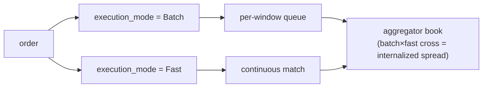

# MIP-4 — مُجمِّع سيولة العقود الدائمة / المُدخِّل الداخلي

:::info
**مُخطَّط له.** مستهدَف للإصدار V2؛ خارج نطاق الشبكة الرئيسية v1.
:::

MIP-4 هو **مُجمِّع سيولة للعقود الدائمة / مُدخِّل داخلي** تشغِّله MetaFlux — وسيط جملة يمتص تدفق الأوامر الواردة مقابل دفتره الخاص ويجني فارق الإدخال الداخلي. النموذج مستعار مباشرةً من هيكل سوق الأسهم، حيث يدير وسيط الجملة الوحيد الذي يعالج حصةً كبيرة من تدفق التجزئة أكثر خطوط العمل ربحيةً. يجلب MIP-4 هذا النمط إلى عقود العقود الدائمة على السلسلة.

## لماذا يوجد هذا

نهج مدفوع بالقدرات: بدلاً من المنافسة على اتساع الإدراج (ذلك شأن [MIP-3](./mip-3.md))، يتنافس MIP-4 على جودة التنفيذ لتدفق التجزئة. من خلال إدخال التدفق داخلياً مقابل دفتره الراسخ، يستطيع المُجمِّع استعادة الفارق الذي كان سيُدفع رسوم صانع سوق — وإعادة جزء منه إلى المستخدم كتحسين في السعر. هذا هو نفس الطرح الذي يقدمه وسيط الجملة لتجزئة الأوراق المالية: "أفضل سعر، وكثيراً ما يتفوق على أعلى دفتر الأوامر".

يتوافق بشكل طبيعي مع واجهة مستخدم للتجزئة بأسلوب Robinhood مبنية فوق حزم SDK الموجودة للعملاء — منتج/واجهة أمامية، لا بروتوكول.

## ما هو

طبقة بروتوكول ووضع سوق جديد يُنجز ما يلي:

1. **يشغِّل دفتر أوامر خاصاً بكل أصل** — `BTC-AGG` و`ETH-AGG` و`SOL-AGG` وغيرها — إلى جانب أسواق MIP-3 المقابلة (`BTC` و`ETH` و`SOL`). دفتر المُجمِّع مستقل عن CLOB الأساسي، بهيكل سعر وعمق خاص به.
2. **يُنفِّذ على مستويين**، يُختار أحدهما لكل أمر عبر حقل `execution_mode`:
   - **Batch** (رسوم منخفضة، ~1–2 نقطة أساس للمتلقي) — تتجمع الأوامر في قائمة انتظار لكل نافذة زمنية وتُصفَّى بسعر موحد كل `batch_window_ms` (الافتراضي 200–300 مللي ثانية). تصفية بسعر موحد بأسلوب FBA داخل دفتر المُجمِّع. تسمية الواجهة: "أفضل سعر".
   - **Fast** (رسوم أعلى، ~5–8 نقاط أساس للمتلقي) — تُطابَق الأوامر باستمرار مقابل دفتر المُجمِّع الراسخ عند أعلى الدفتر. تسمية الواجهة: "فوري".
3. **يلتقط فارق الإدخال الداخلي** — حين يتقاطع تدفق Batch مع تدفق Fast (أو يتقاطع أمران من نوع Batch)، يجلس المُجمِّع في الوسط ويلتقط الفارق. هذا هو المحرك الحقيقي للإيرادات.

حقل `execution_mode` مطلوب لأسواق المُجمِّع؛ أما أسواق Continuous/FBA الأساسية فيُتجاهل فيها.

## مستويا التنفيذ — Batch مقابل Fast

يُنفِّذ كلا المستويين مقابل دفتر المُجمِّع **الخاص**؛ يختار المستخدم المستوى لكل أمر عبر حقل `execution_mode`. الإدخال الداخلي هو ما يحدث *داخل* دفتر المُجمِّع حين يتقاطع المستويان.

- **Batch** — تتجمع الأوامر في قائمة انتظار لكل نافذة زمنية وتُصفَّى بسعر موحد كل `batch_window_ms` (الافتراضي 200–300 مللي ثانية) بأسلوب FBA.
- **Fast** — تُطابَق الأوامر باستمرار مقابل دفتر المُجمِّع الراسخ عند أعلى الدفتر.
- **الإدخال الداخلي** — حين يتقاطع تدفق Batch مع تدفق Fast (أو يتقاطع أمران من نوع Batch)، يجلس المُجمِّع في الوسط ويلتقط الفارق. هذا هو المحرك الرئيسي للإيرادات.

### التوجيه الفائض (مراحل لاحقة)

حين يكون دفتر المُجمِّع الخاص رقيقاً جداً لاستيعاب أمر ما، يُوجَّه **الفائض** إلى الخارج — أولاً إلى CLOB الأساسي على السلسلة (أسواق MIP-3)، وفي مرحلة لاحقة إلى أماكن خارجية حين تنضج MetaBridge. التراجع إلى الأماكن الخارجية ترقية من نوع **V3+**؛ أما V2 فيستهدف التوجيه إلى CLOB على السلسلة فحسب. يترك الهيكل مجالاً لذلك لكن V2 لا يُشحنه.

## تُشغِّله MetaFlux، لا يُنشئه البنّاؤون

على خلاف [MIP-3](./mip-3.md) — حيث يستطيع أي بنّاء نشر سوق بلا إذن عبر مزاد رسوم الغاز — يُشغِّل المُجمِّع **MetaFlux نفسها**. فقط المفتاح المتعدد للحوكمة يمكنه نشر نسخ المُجمِّع، وثمة نسخة أساسية واحدة لكل أصل.

هذا خيار تصميمي متعمد ومثبَّت:

- **يتفادى الانتقاء العكسي** الناتج عن تشتيت تدفق متعدد المُجمِّعات المتنافسة على التدفق ذاته.
- **يتفادى الغموض التنظيمي** حول صنع السوق بلا إذن.
- **يُبقي الإيرادات تتدفق إلى البروتوكول** — تهبط إيرادات الإدخال الداخلي في الشلال ذاته للرسوم كما كل شيء آخر (أدناه)، لا في جيب مشغِّل طرف ثالث.

## العلاقة بـ MIP-3 — تكاملية لا تنافسية

يخدم MIP-3 و MIP-4 جانبين مختلفين من التدفق:

- **أسواق MIP-3** تحمل **تدفق المحترفين** وتظل مكان **اكتشاف السعر**. هذه هي أسواق العقود الدائمة/الفورية الأساسية المُنشأة بلا إذن.
- **مُجمِّع MIP-4** يحمل **تدفق التجزئة** عبر دفتر مُنتقى ومُدخَل داخلياً.

لا يُلغي المُجمِّع MIP-3: يستمر المتداولون المحترفون في تداول دفاتر MIP-3 (حيث يقع السعر المرجعي)، بل إن المُجمِّع يُغطّي مخزونه في تلك الدفاتر أيضاً. ثنائي الجانب بالتصميم. أسواق المُجمِّع تحمل لاحقة `-AGG` تحديداً حتى لا يتصادم الاثنان أبداً.

## اقتصاديات الرسوم

تُغذِّي إيرادات الإدخال الداخلي **شلال توزيع الرسوم ذاته المعمول به في MIP-3** — لا توجد اقتصاديات مستقلة لـ MIP-4. وفق [نموذج الرسوم](../concepts/fees.md)، تتدفق إيرادات المُجمِّع:

- **80%** — إعادة شراء وحرق (يُقلل العرض الفعلي)
- **10%** — المدققون
- **10%** — المؤسسة / الخزينة

على جانب التجزئة، رسوم كود البنّاء (محدودة بـ 8 نقاط أساس) هي المقعد الاقتصادي الطبيعي لواجهة التجزئة للتحصيل — المكان ذاته الذي يُنقِّد فيه وسيط التجزئة تدفق أوامره.

## النتائج ← MIP-6، مؤجَّل إلى V3

الرقم "MIP-4" كان يُخطِّط سابقاً لـ **نتائج / أسواق التنبؤ**. هذه الآلية **أُعيد ترقيمها إلى [MIP-6](./mip-6.md)** وأُجِّلت إلى **V3**. يعني MIP-4 الآن المُجمِّع فحسب لا غير؛ لا تُعِد استخدام MIP-4 للنتائج.

## انظر أيضاً

- [MIP-3 — نشر سوق عقود دائمة بلا إذن](./mip-3.md) — الجانب التكاملي لتدفق المحترفين / اكتشاف السعر
- [MIP-6 — النتائج / أسواق التنبؤ](./mip-6.md) — مقترح النتائج المُعاد ترقيمه، مؤجَّل إلى V3
- [الرسوم](../concepts/fees.md) — شلال الرسوم المشترك الذي تُغذِّيه إيرادات الإدخال الداخلي
- [FBA](../concepts/fba.md) — آليات التصفية الدُّفعية التي يبني عليها مستوى Batch
