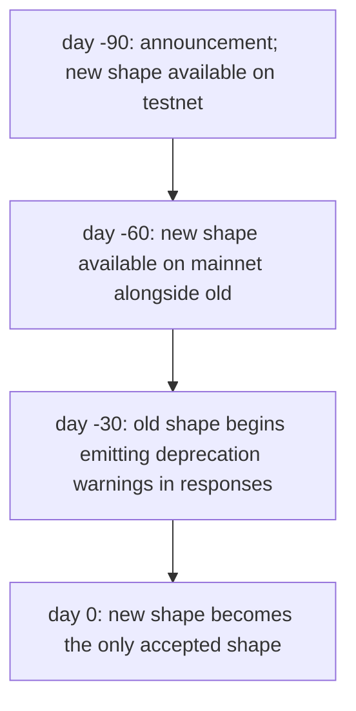
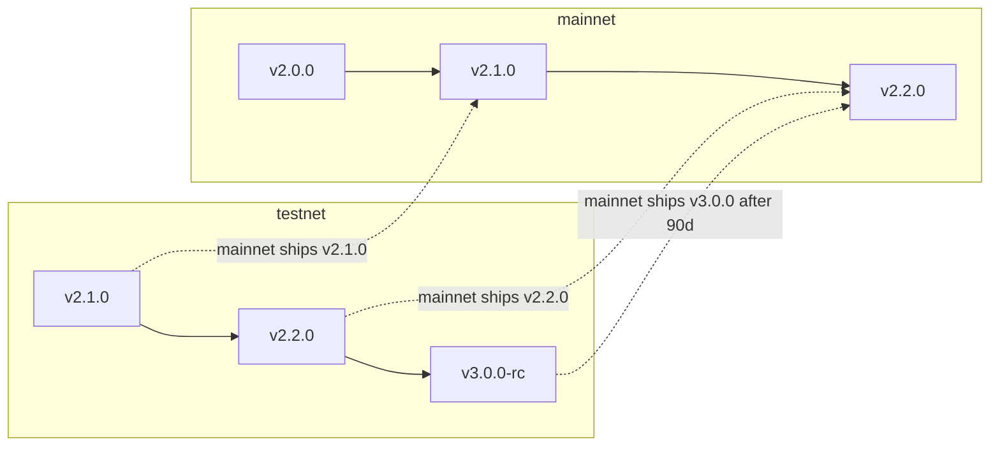

# الإصدارات وإيقاف الدعم

:::info
**الحالة.** سياسة **مستقرة**. انتقالات الإصدارات المحددة موضّحة في سجل التغييرات.
:::

## ملخص سريع

- رقم إصدار البروتوكول عبارة عن ثلاثة أرقام تتبع نمط semver‏ (`MAJOR.MINOR.PATCH`).
- تنعكس التغييرات غير المتوافقة في `MAJOR`؛ والإضافات المتوافقة في `MINOR`؛ وإصلاحات الأخطاء في `PATCH`.
- تستوجب التغييرات غير المتوافقة على الشبكة الرئيسية فترة إيقاف دعم مدتها 90 يومًا، تُقبَل خلالها كلتا الصيغتين القديمة والجديدة.
- تعمل شبكة الاختبار متقدمةً على الشبكة الرئيسية لاكتشاف مشكلات الترحيل قبل الإنتاج.

## مكونات الإصدار

تُكشَف قيمة `protocol_version` للبروتوكول عبر `/info node_info`:

```json
{
  "type": "node_info",
  "data": { "protocol_version": "1.2.0", ... }
}
```

| المكوّن | المعنى | أمثلة |
|---------|--------|--------|
| MAJOR | تغيير غير متوافق في صيغة الإرسال | إعادة تسمية حقول `Order`؛ حذف متغير إجراء؛ تغيير نطاق التوقيع؛ تغيير هيكل عنوان RPC |
| MINOR | إضافة متوافقة لا تُحدث كسرًا | متغير إجراء جديد؛ نوع معلومات جديد؛ قناة WS جديدة؛ نص خطأ جديد |
| PATCH | إصلاح سلوكي فقط | إصلاحات أخطاء تُبقي صيغة الإرسال كما هي؛ تحسينات أداء |

## ما المقصود بـ "صيغة الإرسال"؟

صيغة الإرسال هي كل ما يرتبط به العميل في منطق التسلسل والتوقيع. وتشمل تحديدًا:

| هل تُعدّ صيغة إرسال؟ | أمثلة |
|----------------------|--------|
| نعم | سلاسل `type` للإجراءات، وأسماء الحقول، وأنواع الحقول، وقيم enum، وهيكل الاستجابة، ورموز الحالة، ونصوص الأخطاء، ونطاق EIP-712 |
| نعم | اصطلاحات القياس العددي (الأعداد الصحيحة ذات الفاصلة الثابتة، والوحدات الأساسية لـ USDC) |
| نعم | أسماء قنوات WS، وهياكل الحمولة، وتنسيق الإطار |
| لا | التخزين الداخلي للخادم؛ وتنفيذ الإجماع؛ وأوزان مصادر السعر التمثيلي/أوراكل (تُحكمها الحوكمة ولا تخضع لإصدار البروتوكول)؛ وعتبات مستويات الرسوم (الحوكمة) |

المعاملات القابلة للتغيير بالحوكمة (مستويات الرسوم، وأوزان تركيب السعر التمثيلي، والصدمات السيناريو، وعتبات التصفية) **ليست** جزءًا من الالتزام بصيغة الإرسال. **هيكلها** ملتزَم به؛ أما قيمها فيمكن أن تتغير في أي وقت.

## ضمان الشبكة الرئيسية

| فئة التغيير | الإشعار | فترة السماح |
|-------------|---------|-------------|
| MAJOR (غير متوافق) | 90 يومًا قبل التفعيل | تُقبَل الصيغتان القديمة والجديدة لمدة ≥ 90 يومًا |
| MINOR (إضافي) | 0 أيام؛ يُعلَن في سجل التغييرات | غير مطبّق |
| PATCH (إصلاح) | 0 أيام | غير مطبّق |

يُطرح تغيير MAJOR على مراحل كالتالي:



تتزامن فترة الـ 90 يومًا مع دورات إدارة التغيير المؤسسية. يتوفر لمشغّلي البوتات متسعٌ كافٍ من الوقت للترحيل؛ ويمكن للعملاء تشغيل شفرة ثنائية الصيغة خلال فترة التداخل.

## تحذيرات إيقاف الدعم

خلال فترة التداخل، تتضمن الاستجابات الموجّهة للصيغة القديمة تحذيرًا غير قاطع:

```json
{
  "accepted": true,
  "mempool_depth": 3,
  "_deprecation": {
    "field":      "params.price",
    "deprecated_at_version": "2.0.0",
    "removal_at_version":    "3.0.0",
    "migration": "use px (string, fixed-point 10^8)"
  }
}
```

الحقل `_deprecation` اختياري دائمًا في المحلّل اللغوي الخاص بك — فالعملاء على الصيغة الجديدة لا يرونه أبدًا.

## سجل التغييرات

يُنشر سجل تغييرات البروتوكول على `https://mtf.exchange/changelog`‏ (رابط مؤقت قبل الإطلاق) ويُعكس في هذا المستودع على `CHANGELOG.md`. يحتوي كل إدخال على:

- رقم الإصدار الثلاثي
- تاريخ التفعيل
- الفئة (MAJOR / MINOR / PATCH)
- وصف التغيير مع ملاحظات الترحيل للتغييرات من نوع MAJOR / MINOR

للاشتراك في التحديثات:
- RSS على `https://mtf.exchange/changelog.rss`
- إصدارات GitHub في هذا المستودع
- إشعارات WS على قناة `_meta` المخطط لها (قيد التطوير)

## شبكة الاختبار متقدمة على الشبكة الرئيسية

تعمل شبكة الاختبار عادةً متقدمةً بإصدار MINOR إلى إصدارين على الشبكة الرئيسية. تُكشَف الاكتشافات المتعلقة بالترحيل من شبكة الاختبار قبل موعد طرح الشبكة الرئيسية. يحصل مشغّلو البوتات المدمجون مع شبكة الاختبار على إنذار مبكر بالتغييرات غير المتوافقة.



## ما الذي يمكن للحوكمة تغييره دون إصدار جديد؟

طبقة البروتوكول تخضع لإصدار صيغة الإرسال. بينما تستطيع الحوكمة تعديل:

- المعاملات الخاصة بكل سوق (حجم التدرج، وسقف الرافعة المالية، ونسبة الصيانة، وتركيب السعر التمثيلي، وسقف التمويل)
- عتبات مستويات الرسوم وأسعارها
- مقادير صدمات سيناريو PM ومصفوفة الارتباط
- عتبات مستويات التصفية وفترات التهدئة (ضمن حدود — تستلزم التغييرات الجوهرية MAJOR)
- ميزانيات حدود المعدل
- نسب تجديد صندوق التأمين

لا تُحدث هذه التغييرات زيادةً في رقم إصدار البروتوكول. لكنها تُصدر أحداثًا على قناة `_governance`‏ WS المخطط لها وتُمكن الاستعلام عن قيمها الحالية عبر `/info`.

على العملاء الذين يجرون حسابات بناءً على قيم المعاملات الحالية (كحساب هامش PM على جانب العميل) قراءة المعاملات بصورة مباشرة في الوقت الفعلي؛ ويُحظر تضمين قيمها بشكل ثابت في الشفرة.

## إصدار حزم تطوير البرامج للعملاء

تتبع حزم SDK‏ (`@metaflux/sdk`، و`metaflux-client` لـ Rust، و`metaflux-client` لـ Python) نظام semver بصورة مستقلة عن البروتوكول:

- `0.x.y` — ما قبل الشبكة الرئيسية؛ تُسمح التغييرات غير المتوافقة عند كل زيادة في MINOR
- `1.x.y` — ما بعد الشبكة الرئيسية؛ يُطبَّق semver بصرامة على واجهة API

تستهدف واجهة API‏ `1.x` الخاصة بحزمة SDK إصدار MAJOR محددًا من البروتوكول. عند زيادة MAJOR في البروتوكول، تزداد MAJOR في حزمة SDK؛ إذ تدعم SDK 1.x إصدار البروتوكول 2.x، وتدعم SDK 2.x إصدار البروتوكول 3.x، مع دعم متداخل خلال فترة الـ 90 يومًا.

## تحفظات ما قبل الشبكة الرئيسية

حتى إطلاق الشبكة الرئيسية:
- قد تُعدّل Devnet صيغة الإرسال بإشعار مدته 24 ساعة.
- تُشغّل شبكة الاختبار أحدث إصدار MINOR/MAJOR من البروتوكول متقدمًا على الإصدار المخطط للشبكة الرئيسية؛ ومن المتوقع حدوث أعطال في شبكة الاختبار.
- تعكس لافتات الحالة في كل وثيقة ما هو مستقر مقابل ما هو في مرحلة المعاينة مقابل ما هو مخطط.

## انظر أيضًا

- [الشبكات](./networks.md) — نقاط النهاية لكل شبكة ومعرّفات السلاسل
- [الأمان](./security.md) — نموذج الأمان وسياسة الإفصاح
