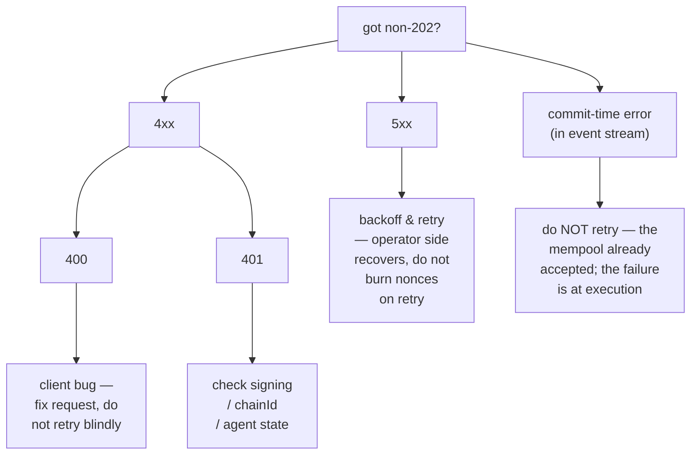

# Catálogo de errores

:::info
**Estado.** **Estable** para los códigos listados. Pueden añadirse nuevas cadenas de error; las existentes son estables.
:::

Una enumeración completa de códigos de estado HTTP, convenciones de cadenas de error, causas raíz y medidas de corrección. Ante cualquier duda sobre cómo manejar una respuesta que no sea `202`, consulte aquí primero.

## Resumen rápido

- **2xx** — éxito. Tenga en cuenta que los endpoints con compatibilidad HL devuelven `200 OK` incluso para errores a nivel de aplicación y los señalan en el cuerpo (`{"status":"err"}`). Los endpoints nativos de MTF utilizan códigos de estado apropiados.
- **400** — error del cliente: solicitud mal formada, forma de firma incorrecta, variante de acción desconocida. No reintente sin corregir el problema.
- **401** — la firma falló la autenticación. Recupere la dirección localmente y verifíquela.
- **404** — el recurso no existe. Es frecuente en `/info` cuando la cuenta, el mercado o el vault consultado nunca han sido vistos.
- **405** — método HTTP incorrecto (la mayoría de los endpoints son POST).
- **422** — solicitud bien formada pero lógicamente inválida (p. ej., tamaño cero, apalancamiento por encima del límite). No reintente; corrija y vuelva a enviar.
- **429** — límite de tasa alcanzado. Espere y reintente según `retry_after_ms`.
- **5xx** — error del servidor. Reintente con retroceso exponencial; los fallos persistentes indican un incidente del lado del operador.

## Estructura del cuerpo

Todas las respuestas no-2xx en los endpoints nativos de MTF utilizan:

```json
{
  "error":          "<short_string>",
  "detail":         "<optional human-readable elaboration>",
  "retry_after_ms": 1200
}
```

`detail` y `retry_after_ms` están presentes solo cuando aplica. El campo `error` es el identificador estable — mantenga su manejador de errores vinculado a él.

Los endpoints con compatibilidad HL (`/info`, `/exchange` en el gateway) en cambio encapsulan todo en:

```json
{ "status": "ok"|"err", "response": ... }
```

con `status: "err"` llevando una cadena en `response` para errores a nivel de aplicación con HTTP 200. Los errores de nivel de transporte (JSON mal formado, método incorrecto) siguen apareciendo como 4xx.

## Catálogo

### 400 — solicitud incorrecta

| `error` | Se produce cuando | Corrección |
|---------|-------------------|------------|
| `sender: expected 40 hex chars, got N` | Longitud incorrecta del campo `sender` | Elimine el prefijo `0x`; verifique la dirección de 20 bytes |
| `signature: expected 130 hex chars, got N` | Firma sin byte `v` | Añada el byte de recuperación |
| `invalid hex` | Caracteres no hexadecimales en `sender` / `signature` | Sanee la entrada |
| `unknown action variant: <X>` | `action.type` mal escrito o no soportado | Consulte el [catálogo de acciones](./rest/exchange.md#action-catalog) |
| `missing field: params.<X>` | Campo obligatorio omitido en una variante | Consulte la tabla de la variante |
| `invalid msgpack` | Error de serialización de acción / msgpack fuera de especificación | Use una biblioteca msgpack con opciones predeterminadas |
| `nonce must increase` | `nonce` reutilizado o fuera de orden | Use un contador monótono (p. ej., `Date.now()`) |
| `duplicate cloid` | `Order`/`ModifyOrder` reutilizó un identificador de orden del cliente | Use un `cloid` nuevo |
| `empty batch` | `orders[]` o `cancels[]` vacíos | Envíe al menos una entrada |
| `invalid numeric` | El campo de punto fijo no se puede interpretar como `u128` | Envíe como cadena JSON, base 10, sin `+` inicial ni espacios en blanco |
| `unknown info type: <X>` | `type` de `/info` no reconocido | Consulte la [referencia de info](./rest/info.md) |
| `chain_id mismatch` | El campo chainId de un wrapper multi-firma no coincide con la red | Haga coincidir el `chainId` de la red |

### 401 — no autorizado (firma fallida)

| `error` | Se produce cuando | Corrección |
|---------|-------------------|------------|
| `signer is not the sender and not an approved agent` | La dirección recuperada ≠ sender Y no está en el conjunto de agentes | Verifique la clave privada y la dirección; compruebe que `ApproveAgent` esté confirmado |
| `agent expired` | La dirección recuperada es un agente del sender, pero `expires_at_ms` ha pasado | Vuelva a aprobar o rote el agente |
| `agent not yet effective` | `ApproveAgent` aún está en propagación (≤1 bloque) | Espere un bloque y reintente |
| `unknown chainId` | `chainId` incorrecto en el dominio de firma → dirección recuperada fantasma | Haga coincidir el [chainId de la red](../networks.md) |
| `signature parse failed` | Bytes de firma mal formados | Verifique la codificación `r ‖ s ‖ v` (65 bytes) |
| `multisig threshold not met` | La acción interna tiene < `threshold` firmas válidas | Recopile más firmas |
| `multisig duplicate signer` | La misma dirección firma dos veces en un wrapper multi-firma | Cada firmante debe ser distinto |

### 404 — no encontrado

| `error` | Se produce cuando |
|---------|-------------------|
| `account not found` | `/info` consultado con una dirección que no tiene estado en cadena |
| `market not found` | `market_id` / `coin` no está en el registro |
| `vault not found` | `vault_id` no existe |
| `order not found` | `Cancel` sobre un oid que ya fue cancelado / ejecutado / nunca existió |

Para consultas de `/info`, MTF nativo devuelve `404`; la compatibilidad HL devuelve `200` con `{"status":"err","response":"<msg>"}` (convención de HL).

### 405 — método no permitido

| `error` | Se produce cuando |
|---------|-------------------|
| (sin cuerpo) | Se usó `GET` en un endpoint `POST` (o viceversa) |

### 422 — entidad no procesable

La solicitud estaba bien formada y la firma era válida, pero la acción en sí es lógicamente inválida.

| `error` | Se produce cuando | Corrección |
|---------|-------------------|------------|
| `price not tick-aligned` | `px` no es múltiplo del tamaño de tick del mercado | Redondee al tick válido más cercano |
| `size below market minimum` | `size` < mínimo del mercado | Aumente el tamaño o utilice un mercado diferente |
| `reduce_only would grow position` | Solo-reducción activa, pero la orden abriría o ampliaría la posición | Elimine `reduce_only` o compruebe la posición actual |
| `leverage above asset cap` | Apalancamiento solicitado > `max_leverage` para el activo | Use `≤ max_leverage` (véase info de `meta`) |
| `pm_min_equity_not_met` | `UserPortfolioMargin{enabled:true}` pero cuenta por debajo del umbral | Aumente el patrimonio o permanezca en el modo clásico |
| `liquidation tier blocks action` | Cuenta en T1+; operaciones adicionales bloqueadas | Añada margen, salga primero del nivel |
| `insufficient balance` | El retiro / transferencia supera el saldo libre | Compruebe `clearinghouseState` primero |
| `out of bounds: <param>` | Límite de gobernanza violado (p. ej., tasa de financiación en `PerpDeployGasAuctionBid`) | Use un valor dentro del límite publicado |

### 429 — límite de tasa alcanzado

```json
{ "error": "rate limit exceeded", "scope": "per_ip"|"per_account", "retry_after_ms": 1200 }
```

| `scope` | Significado |
|---------|-------------|
| `per_ip` | Presupuesto de peso por IP agotado en el gateway |
| `per_account` | QPS por cuenta agotado en el gateway |
| `mempool_per_account` | Demasiadas acciones pendientes en el mempool desde una cuenta |

Consulte [límites de tasa](./rate-limits.md) para presupuestos y manejo de ráfagas.

### 503 — servicio no disponible

| `error` | Causa | Corrección |
|---------|-------|------------|
| `mempool at capacity` | Congestión de red; solicitud rechazada al final de la cola | Retroceso exponencial (`retry_after_ms` comienza en 200) |
| `gateway not ready` | El gateway está iniciándose / fallando las verificaciones de salud | Reintente con retroceso; consulte el [estado](../networks.md#status) |
| `node downstream unreachable` | El gateway perdió la conexión con el nodo | Problema del operador; retroceda y monitoree el estado |

### Errores en tiempo de confirmación (no HTTP, en el flujo de eventos)

Algunos fallos ocurren después de `202 Accepted` porque solo son detectables en el contexto de ejecución del bloque. Aparecen en el canal WS `orderEvents` / `userEvents` como `{"error":"<reason>", "action_hash":"0x..."}`.

| `error` | Causa |
|---------|-------|
| `reduce_only_violation_post_admit` | La posición cambió entre la admisión y el despacho (otros llenados la cerraron) |
| `stp_rejected` | La prevención de autooperación eliminó la orden en el despacho |
| `mark_price_band_violation` | El precio de la orden está fuera de la banda de desviación permitida del mercado al hacer coincidir |
| `evicted_under_cap_pressure` | Admitida pero expulsada del mempool antes de la propuesta de bloque |
| `liquidation_pre_empted` | La cuenta pasó a T1+ entre la admisión y el despacho |

## Árbol de decisión



## Véase también

- [`POST /exchange`](./rest/exchange.md) — ruta de escritura
- [`POST /info`](./rest/info.md) — ruta de lectura
- [Límites de tasa](./rate-limits.md)
- [Idempotencia](../integration/idempotency.md) — cómo reintentar de forma segura
- [Guía de manejo de errores](../integration/error-handling.md) — patrones para clientes en producción
