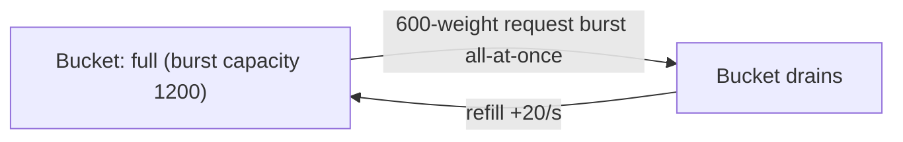
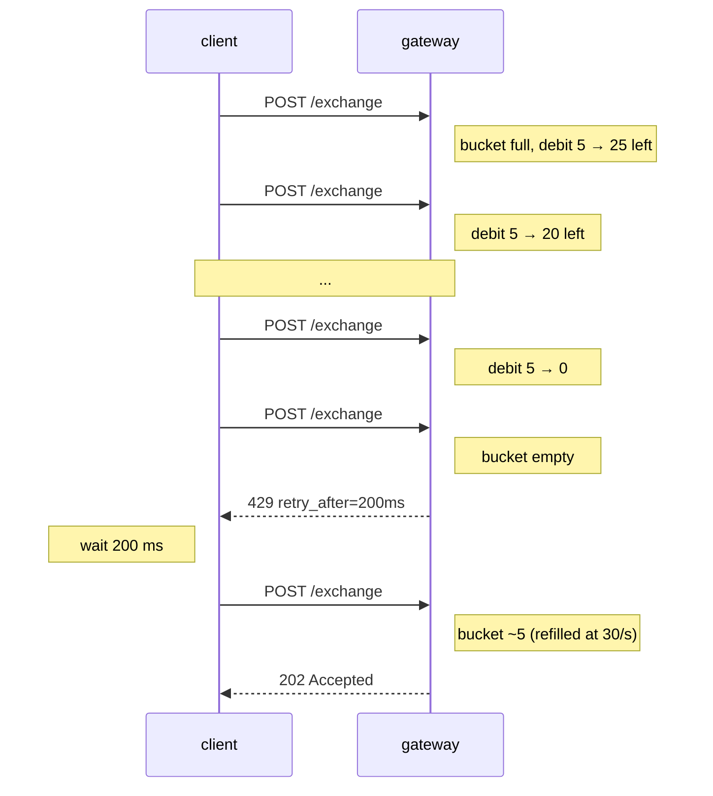

# Límites de tasa

:::info
**Vista previa.** El gateway aplica los límites que se indican a continuación; el nodo base acepta tráfico ilimitado de peers mTLS autenticados (destinado exclusivamente a infraestructura de confianza — no exponga `8080` a internet abierto en producción).
:::

## Resumen rápido

- Dos presupuestos: **peso por IP** (tráfico anónimo) y **QPS por cuenta** (tráfico firmado).
- Las cargas de trabajo con ráfagas consumen un token bucket; el tráfico sostenido queda regulado por la tasa de recarga.
- `429` siempre incluye `retry_after_ms`. Respételo.
- Las consultas a `/info` son económicas (peso 1); las suscripciones WS son aún más baratas (1 de peso al suscribirse, 0 por mensaje). `/exchange` tiene peso 5 por solicitud.
- El mempool tiene un límite independiente de acciones pendientes por cuenta.

## Presupuestos

| Presupuesto | Límite (por defecto) | Recarga | Ráfaga |
|-------------|----------------------|---------|--------|
| Peso por IP | 1200 peso / minuto | 20 peso / segundo | 1200 (bucket completo) |
| QPS por cuenta | 30 req / segundo | 30 / s | 60 |
| Acciones en mempool por cuenta | 50 pendientes | se vacía conforme se confirman las acciones | — |
| Suscripciones WS por conexión | 256 | — | — |

Todos los límites están controlados por gobernanza. Una instantánea del presupuesto por cuenta está disponible
mediante la lectura nativa [`user_rate_limit`](./rest/info.md) en la ruta predeterminada del gateway
(el gateway también expone los mismos datos como `userRateLimit` compatible con HL bajo
`/hl`):

```bash
curl -X POST https://devnet-gateway.mtf.exchange/info \
  -H 'content-type: application/json' \
  -d '{"type":"user_rate_limit","address":"0x<addr>"}'
```

> **Lectura planificada.** Una ruta dedicada `GET /limits` que publique la configuración *estática*
> de por IP / por cuenta que se describe a continuación **aún no está implementada** — los valores son
> los predeterminados configurados, que todavía no se sirven desde un endpoint. Trate el JSON siguiente
> como valores de referencia por defecto:

```json
{
  "per_ip": {
    "weight_per_minute": 1200,
    "burst":             1200,
    "refill_per_second": 20
  },
  "per_account": {
    "qps":          30,
    "burst":        60,
    "refill":       30
  },
  "mempool_per_account": 50,
  "ws_subs_per_conn":    256
}
```

## Peso por endpoint

| Endpoint | Peso |
|----------|------|
| `POST /info` (la mayoría de tipos) | 1 |
| `POST /info` `l2Book`, `metaAndAssetCtxs` | 2 |
| `POST /info` `userFills`, `historicalOrders` (paginado) | 2 |
| `POST /exchange` | 5 |
| `GET /ccxt/markets`, `GET /ccxt/ticker` | 1 |
| `GET /ccxt/orderbook`, `GET /ccxt/ohlcv` | 2 |
| `GET /ccxt/balance`, `/positions`, `/myTrades` | 2 |
| `POST /ccxt/orders`, `DELETE /ccxt/orders/{id}` | 5 |
| WS `subscribe` | 1 |
| Mensaje publicado WS | 0 |
| WS `unsubscribe` | 0 |

Un cliente que realiza una orden por segundo y consulta `clearinghouseState` una vez por segundo consume `5 + 1 = 6 peso/s = 360 peso/min` — muy por debajo del presupuesto.

## QPS por cuenta

Una vez que una solicitud está firmada, el gateway autentica al `sender` y lo cuenta contra el presupuesto por cuenta en lugar de (o además de) el presupuesto por IP.

| Estado del remitente | Contabilizado contra |
|----------------------|----------------------|
| Anónimo (sin firma, p.ej. `GET /ccxt/markets`) | por IP |
| Firmado por cuenta maestra | por IP + por cuenta |
| Firmado por agente | por IP + por cuenta-de-la-maestra |

Las solicitudes firmadas se contabilizan dos veces: contra por-IP y por-cuenta; los clientes que envían tráfico intenso desde una única IP en nombre de una cuenta alcanzarán el presupuesto que sea más restrictivo.

## Límite del mempool

Independiente de los límites de tasa. La máquina de estados rechaza admitir más de 50 acciones pendientes (no confirmadas aún) por `sender`. Esto evita que una cuenta monopolice el espacio del mempool.

Si envía una 51.ª acción mientras hay 50 pendientes:

```json
{ "error": "mempool_per_account_full", "retry_after_ms": 100 }
```

En la práctica, esto solo lo encuentran clientes con comportamiento incorrecto — un tiempo de bloque saludable de ~100 ms vacía 30 QPS con facilidad. Si llega a este límite, es correcto en cuanto a tasa por cuenta, pero está enviando más rápido de lo que los bloques confirman.

## Comportamiento de ráfaga

Los buckets se llenan hasta `burst` y se recargan a `refill` por segundo. Una ráfaga de `N ≤ burst` solicitudes se atiende de inmediato; las solicitudes posteriores quedan limitadas a la tasa de recarga.



Una respuesta `429` con `retry_after_ms` le indica exactamente cuándo el bucket tendrá suficiente para una solicitud más de peso 1. Para trabajos por lotes, es preferible regular el ritmo en el cliente; para cargas interactivas, el retroceso exponencial con la pista es adecuado.

## Estrategias

### Bot de flujo de órdenes

- Aplique un límite de tasa preventivo en el cliente de ~25 QPS para mantener margen de seguridad.
- Use el agrupamiento de `Order`: una solicitud con 10 órdenes cuesta 5 de peso (igual que una sola orden); el QPS por cuenta cuenta solicitudes, no legs.
- Use `BatchModify` en lugar de N llamadas separadas a `ModifyOrder`.
- Mantenga los datos de mercado en el feed WS, no mediante polling a `/info`.

### Consumidor de datos de mercado

- Suscríbase a los canales WS (`l2Book`, `trades`, `userEvents`); no haga polling.
- El peso de `subscribe` es 1; los mensajes en flujo cuestan 0.
- Reconéctese con `resume_token` en lugar de volver a suscribirse a todos los canales desde cero (las suscripciones consumen peso de nuevo en la nueva conexión).

### Liquidador de alta frecuencia

- Ejecute desde su propio nodo alojado (autenticado con mTLS, `localhost:8080`), evitando los límites del gateway público.
- Tenga en cuenta que esto requiere ejecutar infraestructura con un validador.
- El acceso al gateway público es suficiente para cargas de trabajo de decenas de órdenes por segundo; no para HFT.

## Secuencia — ser limitado y recuperarse



## Canales de exención

| Canal | Notas |
|-------|-------|
| Peer mTLS de un validador | Omite los límites de tasa del gateway (está en la ruta de confianza) |
| IP / cuenta en lista blanca (por parte del operador) | Los operadores pueden publicar presupuestos elevados para creadores de mercado designados |
| Endpoints especiales (`/limits`, `/health`) | Sin límite de tasa |

Los valores predeterminados públicos asumen que ninguna exención aplica.

## Véase también

- [Errores](./errors.md)
- [Suscripciones WS](./ws/subscriptions.md)
- [Idempotencia](../integration/idempotency.md) — cómo reintentar dentro del presupuesto de límite de tasa

## Preguntas frecuentes

<details>
<summary>Mostrar preguntas frecuentes</summary>

**P: ¿Los límites son por par de claves o por dirección?**
R: Por `sender` (dirección). Todos los agentes de la misma cuenta maestra comparten el presupuesto, porque la admisión cuenta a la maestra.

**P: ¿Puedo agrupar una orden en 10 mercados para ahorrar peso?**
R: Sí. `Order { orders: [<10 legs>] }` cuesta 5 de peso, no 50.

**P: ¿Las consultas a `/info` y las suscripciones WS comparten presupuesto?**
R: Sí — el mismo bucket por IP / por cuenta. Las suscripciones WS cuestan 1 cada una, luego 0 por mensaje; para feeds de datos de alta frecuencia, WS es siempre más barato que el polling.

**P: ¿Qué ocurre en devnet?**
R: Devnet tiene presupuestos más altos y sin límite de mempool. No ajuste su cliente contra devnet; recalcule el presupuesto contra `/limits` en la red donde vaya a desplegarlo.

</details>
