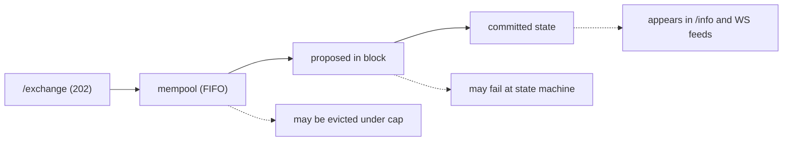
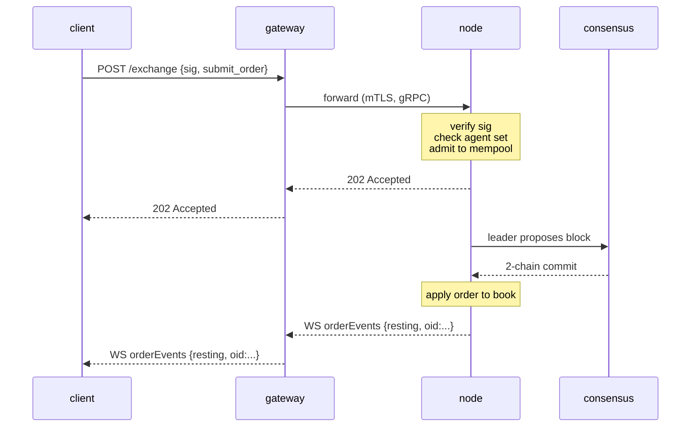

# `POST /exchange` — enviar una acción firmada

:::info
**Estado.** **estable** para las variantes de acción listadas. La forma del endpoint está comprometida para V1.
:::

## TL;DR {#tldr}

Toda acción **de usuario** que muta estado — colocar orden, cancelar, depósito en vault, aprobación de agente, staking, etc. — es un único sobre JSON firmado con EIP-712 enviado a `POST /exchange`. La variante de acción se selecciona mediante el campo `type`. Una **orden** devuelve `200 OK` con el `oid` asignado de forma síncrona (el manejador espera la confirmación); cualquier **otra** acción devuelve `202 Accepted` al ser admitida, y la confirmación de commit llega a través del [feed WS](../ws/subscriptions.md) o mediante sondeo.

:::warning
**Solo acciones de usuario.** `/exchange` es la ruta de escritura pública para **usuarios**. Las escrituras privilegiadas / de sistema — envío de precios de oráculo, créditos de faucet, `SystemUserModify`, `SystemSpotSend`, votos de validador — **nunca** pasan por `/exchange`. Se inyectan mediante colas locales del nodo controladas por autoridad de validador (véase la [tabla de acciones no puenteadas](#non-bridged-actions) y el [faucet](./faucet.md#why-this-is-not-on-exchange)). Enviar la etiqueta nativa de una acción de sistema devuelve `400 unsupported action`.
:::

## URL {#url}

```
POST  https://api.<net>.mtf.exchange/exchange
```

| Ruta | Forma wire |
|------|-----------|
| `POST /exchange` (gateway) | **nativa MTF** (este documento) |

El gateway sirve la `/exchange` nativa MTF. Si ejecutas el nodo tú mismo, el mismo `/exchange` nativo se sirve directamente en `http://localhost:8080`.

## Sobre de solicitud {#request-envelope}

```json
{
  "signature": "0xabcd...1b",
  "nonce":     1735689600001,
  "action": {
    "type": "submit_order",
    "order": { /* una de las variantes a continuación */ }
  }
}
```

| Campo | Tipo | Requerido | Descripción |
|-------|------|----------|-------------|
| `signature` | cadena hex, 65 bytes (130 caracteres hex; `0x` opcional) | sí | ECDSA secp256k1 sobre el [resumen typed-data EIP-712](#signing) de los campos estructurados de la acción + `nonce`. `r ‖ s ‖ v`. Se aceptan tanto el `v ∈ {27, 28}` tradicional como el `v ∈ {0, 1}` de EIP-2098. |
| `nonce` | uint64 | sí | Estrictamente monótono por actor. Convencionalmente `Date.now()`. Incluido en el resumen firmado. Véase [idempotencia](../../integration/idempotency.md). |
| `action` | objeto | sí | Una variante etiquetada: `{ "type": "<snake_case_tag>", ... }`. Véase el [catálogo de acciones](#action-catalog) a continuación. |

:::info
**Sin `sender` en el nivel superior.** El sobre no lleva campo `sender`. La cuenta cuyo estado se muta se determina por acción:
- **Acciones que declaran propietario** (`submit_order`, `cancel_order`) llevan el propietario *dentro* del cuerpo de la acción — `action.order.owner` / `action.cancel.owner`. El servidor recupera el firmante de la firma y exige que sea igual a ese `owner` **o** a un [agente](../../concepts/agent-wallets.md) aprobado por él.
- **Acciones autorizadas por el remitente** (gobernanza, margen, líder de vault, staking, …) **no** llevan ningún campo de propietario: el firmante recuperado *es* el actor, y la autorización a nivel de acción (membresía de validador, líder de vault, etc.) se verifica en el despacho.
:::

El servidor reconstruye el struct tipado EIP-712 a partir de `action.type` + `action.params` y recupera el firmante sobre **esos valores de campo** — por lo que el `action.params` que envíes debe llevar los **mismos valores** (y las mismas cadenas decimales canónicas) que pusiste en el mensaje tipado que firmaste. Una discrepancia recupera un firmante diferente y la solicitud es rechazada con `401`. Véase [firma de typed-data](../../integration/typed-data-signing.md).

## Firma {#signing}

La firma es una recuperación ECDSA secp256k1 sobre un resumen EIP-712 estándar. Cada acción se firma como **typed data EIP-712 estructurado** (`eth_signTypedData_v4`) con un tipo primario por acción `MetaFluxTransaction:<Action>`, de modo que un monedero muestra cada campo por nombre. El servidor reconstruye el struct tipado a partir de `action.type` + `action.params`, recalcula el resumen y recupera el firmante:

```
struct_hash = keccak256( typeHash(MetaFluxTransaction:<Action>) ‖ encodeData(fields) )
signed_hash = keccak256( 0x1901 ‖ domain_separator ‖ struct_hash )
```

donde el separador de dominio es:

```
domain_separator = keccak256(
  keccak256("EIP712Domain(string name,string version,uint256 chainId,address verifyingContract)") ‖
  keccak256("MetaFlux") ‖
  keccak256("1") ‖
  chainId_as_uint256_be ‖
  address_zero_padded_to_32
)
```

Las cadenas de tipo por acción, las reglas atómicas de `encodeData` y ejemplos resueltos se encuentran en [firma de typed-data](../../integration/typed-data-signing.md) — el esquema de firma único. Una prueba de respuesta conocida entre implementaciones fija el resumen de cada acción.

:::info
**`sig_scheme` es vestigial.** Las versiones anteriores incluían un selector `sig_scheme` en el sobre; ya no es necesario y el servidor lo ignora (la recuperación por typed-data se ejecuta incondicionalmente). **Omítelo.** Si está presente, el único valor aceptado es `"typed"`.
:::

### IDs de cadena {#chain-ids}

| Red | `chainId` |
|---------|-----------|
| Devnet (por defecto) | `31337` |
| Testnet | `114514` |
| Mainnet | `8964` |

El `chainId` del dominio de firma **debe coincidir con el `chain_id` de consenso del nodo** — consúltalo mediante [`/info` `node_info`](./info.md#node_info) (`data.chain_id`) y usa ese valor exacto. Firmar con un `chainId` incorrecto devuelve `401` porque la dirección recuperada difiere del `owner` de la acción (o, en acciones autorizadas por el remitente, recupera una dirección fantasma que no supera ninguna verificación de autorización). Véase [redes](../../networks.md) para los endpoints.

## Convenciones numéricas {#numeric-conventions}

| Tipo | Forma wire | Por qué |
|------|----------|-----|
| `uint64` ≤ 2^53 | número JSON | Seguro en IEEE-754 |
| `uint64` > 2^53, `u128`, enteros escalados | cadena JSON | Los números JSON nativos pierden precisión silenciosamente más allá de 2^53 |
| Dirección | cadena hex `"0x..."` | 20 bytes, 40 caracteres hex (con o sin `0x`) |
| Booleanos | `true` / `false` | JSON literal |
| Campos opcionales | `null` u omitir | Ambos aceptados; `null` es canónico |

**Campos de punto fijo.** Los campos de precio y tamaño son enteros de punto fijo con 8 decimales; los importes en USDC son unidades base con 6 decimales. El valor lleva la escala, no el nombre del campo — por ejemplo, `px = "10050000000"` significa `100.50`. Envíalo siempre como cadena; el servidor lo parsea a `u128`.

## Semántica del firmante {#signed-by-semantics}

La mayoría de las acciones pueden ser firmadas por **la cuenta maestra o** por un [agente](../../concepts/agent-wallets.md) activo. Un subconjunto es **exclusivo del maestro** — a los agentes se les niega explícitamente la autoridad de retiro y los privilegios de gestión de cuenta.

| Clase de capacidad | ¿Puede firmar el maestro? | ¿Puede firmar el agente? |
|------------------|:----------------:|:---------------:|
| Colocar / cancelar / modificar órdenes | sí | sí |
| Actualizar apalancamiento / modo de margen | sí | sí |
| Depósito / retiro en vault | sí | sí |
| Crear subcuenta | sí | no |
| Transferencia de subcuenta | sí | no |
| Aprobación / revocación de agente | sí | no |
| Retiro externo (USDC, spot) | sí | no |
| Convertir a multi-firma | sí | no |
| Envoltorio multi-firma | (especial — véase [multi-firma](../../concepts/multi-sig.md)) | no |

La entrada de cada acción en el [catálogo](#action-catalog) indica explícitamente su regla de firmante.

---

## Catálogo de acciones {#action-catalog}

Cada variante es un objeto etiquetado `{ "type": "<snake_case_tag>", <cuerpo plano> }`. Las claves del cuerpo están **en el plano bajo el objeto de acción** (no hay `type` en PascalCase ni un envoltorio `params` universal) — p. ej., `submit_order` lleva un objeto `order`, `cancel_order` lleva un objeto `cancel`, y las acciones autorizadas por el remitente llevan un objeto `params`. Haz clic para ver la tabla de campos detallada. Las tablas de resumen a continuación agrupan todas las acciones por categoría; las **definiciones completas a nivel de campo que siguen están divididas por tipo de operación** — [Acciones de orden perpetuo](#perpetual-order-actions), [Acciones de trading spot](#spot-trading-actions), [Acciones de margen spot y Earn](#spot-margin--earn-actions), [Acciones de margen y riesgo en perpetuos](#perpetual-margin--risk-actions) y [Cuenta, staking, vaults y bridge](#account-staking-vaults--bridge-actions).

:::warning
**`px` / `size` son `u64` de punto fijo sin signo en el wire nativo**, enviados como números JSON (el nodo los decodifica como `u64`, luego los amplía internamente). Las direcciones son hex con `0x` (40 caracteres); `cloid` es `0x` + 32 caracteres hex (16 bytes).
:::

### Colocación y ciclo de vida de órdenes {#order-placement--lifecycle}

| `type` | Propósito | Firmante | Idempotente |
|--------|---------|-----------|-----------|
| [`submit_order`](#submit_order) | Colocar una orden | propietario / agente | por `cloid` |
| [`batch_order`](#batch_order) | N órdenes / una firma | propietario / agente | por `cloid` de cada tramo |
| [`cancel_order`](#cancel_order) | Cancelar por `oid` | propietario / agente | sí |
| [`batch_cancel`](#batch_cancel) | N cancelaciones / una firma | propietario / agente | sí |
| [`cancel_by_cloid`](#cancel_by_cloid) | Cancelar por id de orden del cliente | remitente / agente | sí |
| [`cancel_all_orders`](#cancel_all_orders) | Cancelar todo (filtro de activo opcional) | remitente / agente | sí |
| [`modify`](#modify) | Modificar precio / tamaño de una orden en reposo | remitente / agente | sí |
| [`batch_modify`](#batch_modify) | N modificaciones / una firma | remitente / agente | por entrada |
| [`schedule_cancel`](#schedule_cancel) | Cancelación futura de todas las órdenes en un bloque | remitente / agente | sí |
| [`twap_order`](#twap_order) | Programar una orden fraccionada (TWAP) | remitente / agente | por `twap_id` |
| [`twap_cancel`](#twap_cancel) | Cancelar un TWAP padre en curso | remitente / agente | sí |

### Trading spot {#spot-trading}

Spot es un CLOB de token contra token (sin apalancamiento, sin posiciones) — libros y saldos separados de los perpetuos. Una orden spot en reposo bloquea los fondos que debería en caso de ejecución en un **saldo reservado**: una `bid` reserva la **cotización** (su nocional al precio límite), una `ask` reserva la **base** que ofrece. El tamaño de la orden queda **limitado al momento de admisión** a lo que tu saldo financia, y las comisiones se toman del tramo que recibe cada parte. Ambas acciones son **autorizadas por el remitente** (el firmante es el trader; no hay `owner`). Véase [trading spot](../../products/spot.md) para el modelo conceptual completo.

| `type` | Propósito | Firmante | Idempotente |
|--------|---------|-----------|-----------|
| [`spot_order`](#spot_order) | Colocar una orden spot | remitente / agente | por `cloid` |
| [`spot_cancel`](#spot_cancel) | Cancelar una orden spot en reposo por `oid` | remitente / agente | sí |

### Margen spot y Earn {#spot-margin--earn}

:::info
**Disponible en devnet (vista previa).** El spot con apalancamiento ([margen spot](../../products/spot-margin.md)) y su lado de oferta de préstamos ([Earn](../../concepts/earn.md)) funcionan de extremo a extremo en **devnet hoy**: deposita colateral, toma prestado del pool Earn, compra la base al contado con apalancamiento (IOC) y cierra para reembolsar. Trátalo como una **vista previa** — la liquidación forzada no está conectada todavía (un cierre forzado no realiza PnL ni decrementa el interés abierto), y las ratios de mantenimiento por par son parámetros de gobernanza que aún están siendo calibrados. No asumas seguridad en producción a escala.
:::

Una posición de spot con apalancamiento está **aislada por `(cuenta, par)`**: el colateral en cotización depositado es un amortiguador de pérdidas puro, la compra está financiada al 100% por un préstamo de cotización tomado del pool Earn del par, y la base comprada se mantiene **segregada** en la cuenta de margen (nunca en tus saldos disponibles). Earn es el otro lado — los proveedores depositan la cotización prestable a cambio de participaciones en el pool, y el interés de préstamo que pagan los traders de margen spot aumenta el valor de cada participación. Las seis acciones son **autorizadas por el remitente** (el firmante es el actor; no hay `owner`). `amount` / `shares` / `borrow` son decimales enviados como cadenas JSON; `size` / `limit_px` son `u64` en los planos `1e8` / lotes crudos como en [`spot_order`](#spot_order). Cada una devuelve el sobre de admisión [`202 Accepted`](#202-accepted--non-order-admission) (no un `oid` síncrono); observa el resultado confirmado mediante [`/info` `spot_margin_state`](./info/spot.md#spot_margin_state) y [`earn_state`](./info/spot.md#earn_state).

| `type` | Propósito | Firmante | Idempotente |
|--------|---------|-----------|-----------|
| [`spot_margin_deposit`](#spot_margin_deposit) | Depositar colateral en cotización para un par | remitente / agente | no |
| [`spot_margin_withdraw`](#spot_margin_withdraw) | Retirar colateral libre | remitente / agente | no |
| [`spot_margin_open`](#spot_margin_open) | Pedir prestado + comprar base con apalancamiento (IOC) | remitente / agente | no |
| [`spot_margin_close`](#spot_margin_close) | Vender la base en cartera, reembolsar el préstamo | remitente / agente | no |
| [`earn_deposit`](#earn_deposit) | Suministrar cotización al pool de préstamos a cambio de participaciones | remitente / agente | no |
| [`earn_withdraw`](#earn_withdraw) | Canjear participaciones del pool (acotado por liquidez ociosa) | remitente / agente | no |

### Margen y riesgo {#margin--risk}

| `type` | Propósito | Firmante |
|--------|---------|-----------|
| [`update_leverage`](#update_leverage) | Cambiar el apalancamiento / alternar aislamiento en un activo | remitente / agente |
| [`update_isolated_margin`](#update_isolated_margin) | Delta de margen aislado firmado | remitente / agente |
| [`top_up_isolated_only_margin`](#top_up_isolated_only_margin) | Recarga de margen en modo aislado estricto | remitente / agente |
| [`user_portfolio_margin`](#user_portfolio_margin) | Inscribir / dar de baja en PM | remitente / agente |

### Gestión de cuenta {#account-management}

| `type` | Propósito | Firmante |
|--------|---------|-----------|
| [`approve_agent`](#approve_agent) | Aprobar un agente | remitente / agente |
| [`set_display_name`](#set_display_name) | Establecer el nombre de cuenta | remitente / agente |
| [`set_referrer`](#set_referrer) | Vincular a una dirección de referido | remitente / agente |
| [`approve_builder_fee`](#approve_builder_fee) | Aprobar un tope de comisión de builder | remitente / agente |
| [`create_sub_account`](#create_sub_account) | Abrir una subcuenta bajo el remitente | remitente / agente |
| [`sub_account_transfer`](#sub_account_transfer) | Mover colateral cruzado de perpetuos entre cuenta principal y subcuenta | remitente / agente |
| [`sub_account_spot_transfer`](#sub_account_spot_transfer) | Mover un saldo de token spot entre cuenta principal y subcuenta | remitente / agente |
| [`convert_to_multi_sig_user`](#convert_to_multi_sig_user) | Elevar la cuenta a multi-firma | remitente / agente |
| [`set_position_mode`](#set_position_mode) | Alternar modo de posición unidireccional / cobertura | remitente / agente |

### Staking y abstracción {#staking--abstraction}

| `type` | Propósito | Firmante |
|--------|---------|-----------|
| [`c_deposit`](#c_deposit) | Mover MTF spot al saldo de staking libre | remitente / agente |
| [`c_withdraw`](#c_withdraw) | Devolver el saldo de staking libre a MTF spot | remitente / agente |
| [`token_delegate`](#token_delegate) | Delegar / retirar delegación de stake | remitente / agente |
| [`claim_rewards`](#claim_rewards) | Reclamar recompensas de staking | remitente / agente |
| [`link_staking_user`](#link_staking_user) | Asignar un alias a un objetivo de staking | remitente / agente |
| [`user_dex_abstraction`](#user_dex_abstraction) | Activar / desactivar el indicador de abstracción DEX del usuario | remitente / agente |
| [`user_set_abstraction`](#user_set_abstraction) | Configuración de abstracción de alcance propio | remitente / agente |
| [`agent_set_abstraction`](#agent_set_abstraction) | Configuración de abstracción de alcance de agente | remitente / agente |
| [`priority_bid`](#priority_bid) | Pagar una comisión de prioridad para colocación al frente del bloque | remitente / agente |

### Órdenes cifradas {#encrypted-orders}

| `type` | Propósito | Firmante |
|--------|---------|-----------|
| [`submit_encrypted_order`](#submit_encrypted_order) | Texto cifrado de orden con cifrado de umbral | remitente / agente |

### Vaults {#vaults}

| `type` | Propósito | Firmante |
|--------|---------|-----------|
| [`create_vault`](#create_vault) | El líder crea un vault | remitente / agente |
| [`vault_transfer`](#vault_transfer) | Transferencia de semilla del líder | remitente / agente |
| [`vault_modify`](#vault_modify) | Actualización de configuración del vault exclusiva del líder | remitente / agente |
| [`vault_withdraw`](#vault_withdraw) | Redención de participaciones del seguidor | remitente / agente |

### Retiros mediante bridge {#bridge-withdrawals}

Los retiros externos salen de la cadena a través de [MetaBridge](../../bridge/index.md). La acción está **autorizada por el remitente**: el firmante recuperado es la cuenta debitada, por lo que la autoridad de retiro es efectivamente **exclusiva del maestro** — una firma de agente actuaría sobre la propia cuenta del agente (separada), nunca sobre la del maestro.

| `type` | Propósito | Firmante |
|--------|---------|-----------|
| [`core_evm_transfer`](#core_evm_transfer) | Mover USDC del libro mayor Core a MetaFluxEVM | remitente (maestro) |
| [`mb_withdraw`](#mb_withdraw) | Retirar USDC con colateral cruzado a una cadena externa | remitente (maestro) |

### No disponibles en la ruta pública `/exchange` {#not-on-the-public-exchange-path}

Estos nombres de acción aparecen en borradores anteriores, pero **no están puenteados en el manejador nativo MTF de `/exchange`**. Son escrituras privilegiadas / de sistema que nunca deben transitar por la ruta pública de usuario, o stubs de esquema reconocidos pero sin mapeo. Publicarlos devuelve `400 unsupported action`. Véase [la tabla a continuación](#non-bridged-actions) para la disposición de cada uno.

| Nombre del borrador | Etiqueta nativa (si se reconoce) | Por qué no está puenteado |
|-----------|----------------------------|-----------------|
| `ScaleOrder` | — | No hay acción nativa; construye una escalera en el cliente como `batch_order` |
| `UpdateMarginMode` | — | No hay acción nativa; el aislamiento es el indicador `is_isolated` en `update_leverage` |
| `MultiSig` | — | El envoltorio multi-firma de recopilación y ejecución no está puenteado (vista previa / sin ejecución — la cuenta se *registra* mediante `convert_to_multi_sig_user`) |
| `RegisterReferrer` | — | No puenteado (el referido se vincula por dirección mediante `set_referrer`) |
| `UsdcTransfer` / `SpotTransfer` | — | Los flujos de transferencia entre usuarios no están puenteados |
| `WithdrawUsdc` | — | Nombre del borrador; el retiro externo es [`mb_withdraw`](#mb_withdraw) |
| `BorrowLend` | — | No puenteado |
| `RfqQuote` / `RfqAccept` | `rfq_request` / `rfq_accept` | Stub reconocido pero sin mapeo → `unsupported action` |
| `FbaOrder` | `fba_submit` | Stub reconocido pero sin mapeo → `unsupported action` |
| (distribución de vault) | `vault_distribute` | Manejador parcial/stub; no puenteado en `/exchange` |
| (ciclo de vida PM) | `pm_enroll` / `pm_unenroll` | Se mapean a [`user_portfolio_margin`](#user_portfolio_margin) (inscribir / dar de baja). `pm_rebalance` ha sido **eliminada** — rechazada como acción desconocida |
| (entre cadenas) | `cross_chain_send` | Stub reconocido pero sin mapeo → `unsupported action` |
| (envío cifrado alt) | `encrypted_order_submit` | Stub; usa [`submit_encrypted_order`](#submit_encrypted_order) en su lugar |

---

## Acciones de orden perpetuo {#perpetual-order-actions}

Colocación de órdenes y ciclo de vida en mercados de **contratos perpetuos** (id de `market` de un perpetuo). Utilizan el CLOB compartido; las acciones de trading [spot](#spot-trading-actions) y de [margen spot](#spot-margin--earn-actions) están en secciones separadas a continuación. Los controles de apalancamiento y margen en perpetuos están en [Acciones de margen y riesgo en perpetuos](#perpetual-margin--risk-actions).

### Colocar una única orden {#submit_order}

Colocar una única orden. El cuerpo de la orden se incluye en `action.order`; `owner` es la cuenta declarada (el servidor exige que el firmante recuperado sea igual a ella o sea un agente aprobado). Para colocar muchas órdenes bajo una sola firma, usa [`batch_order`](#batch_order).

```json
{
  "type": "submit_order",
  "order": {
    "owner":       "0x00000000000000000000000000000000000000aa",
    "market":       7,
    "side":         "bid",
    "kind":         "limit",
    "size":         100000000,
    "limit_px":     10050000000,
    "tif":          "gtc",
    "stp_mode":     "cancel_oldest",
    "reduce_only":  false,
    "cloid":        "0xabababababababababababababababab",
    "builder":      { "fee": 5, "user": "0x00000000000000000000000000000000000000ff" },
    "position_side": "long"
  }
}
```

| Campo | Tipo | Rango / valores | Descripción |
|-------|------|----------------|-------------|
| `owner` | dirección hex | 40 caracteres hex | Cuenta declarada; debe ser igual al firmante recuperado o a un agente aprobado por él. Solo en wire — se descarta al bajar |
| `market` | uint32 | `[0, market_count)` | Id de activo/mercado (mapeado directamente a `AssetId`) |
| `side` | enum | `"bid"` / `"ask"` | — |
| `kind` | enum | `"limit"` / `"market"` / `"stop_loss"` / `"take_profit"` | `limit` / `market` colocan una orden en vivo. `stop_loss` / `take_profit` se aceptan **solo cuando también hay un bloque `trigger`** — ese par aparca una única pata reduce-only de TP/SL (véase [órdenes trigger](#trigger-orders-stop_loss--take_profit)); un `stop_loss` / `take_profit` *sin* bloque `trigger` es rechazado (`unsupported order kind`) |
| `trigger` | objeto \| null | — | [Bloque trigger](#trigger-orders-stop_loss--take_profit) opcional. Su presencia — en **cualquier** `kind` — convierte este `submit_order` en una pata reduce-only aparcada de TP/SL en lugar de una orden en vivo: `{ "trigger_px": <u64>, "is_market": <bool>, "tpsl": "tp" \| "sl" }` |
| `size` | uint64 | `> 0` | Unidades de tick de punto fijo (ampliado a `u128`) |
| `limit_px` | uint64 | `> 0` | Unidades de tick de punto fijo (ampliado a `i128`) |
| `tif` | enum | `"gtc"`, `"ioc"`, `"alo"` | `"aon"` es rechazado (`unsupported time-in-force` — sin equivalente en el núcleo) |
| `stp_mode` | enum | `"cancel_oldest"`, `"cancel_newest"`, `"cancel_both"` | `"reject"` es rechazado (`unsupported stp_mode` — sin equivalente en el núcleo) |
| `reduce_only` | bool | — | Si es verdadero, se rechaza al confirmar si incrementaría la posición |
| `cloid` | cadena hex \| null | `0x` + 32 caracteres hex (16 bytes) | Id de orden del cliente opcional; permite `cancel_by_cloid` y deduplicación |
| `builder` | objeto \| null | — | Deducción de comisión de builder opcional: `{ "fee": <bps u16>, "user": <dirección 0x-hex> }` |
| `position_side` | enum \| null | `"long"` / `"short"` | **Solo en [modo cobertura](../../concepts/hedge-mode.md).** Pata objetivo para la orden. **Omitir en una cuenta unidireccional** (por defecto) y **enviar en una cuenta de cobertura** — una cuenta unidireccional que lo envía, o una cuenta de cobertura que lo omite, es rechazada. `reduce_only` se evalúa únicamente sobre la pata nombrada. Véase [modo cobertura](#position_side-hedge-mode) a continuación |

**Idempotencia**: un `cloid` duplicado en la misma cuenta es rechazado en la admisión con `error: "duplicate cloid"`. Usa `cloid` como clave de deduplicación en el lado del cliente.

**Errores comunes**: `px` no alineado con el tick, `size` por debajo del mínimo del mercado, `reduce_only` incrementaría la posición, rechazado por STP, cuenta en nivel de liquidación T1+.

**Entradas de estado en la respuesta** (por orden, en orden — véase la unión completa en [Respuesta → 200 OK](#200-ok--order-path-synchronous-oid)):

```json
{"resting": {"oid": 12345, "cloid": "0x..."}}                       // publicado en el libro
{"filled":  {"oid": 12345, "total_sz": "100000000", "avg_px": "10050000000"}}
{"error":   "<reason>"}                                             // esta entrada fue rechazada en commit/admisión
{"pending": {"action_hash": "0x...", "nonce": 1735689600001}}       // admitido, sin commit en la ventana de espera
```

#### `position_side` (modo cobertura) {#position_side-hedge-mode}

El campo opcional `position_side` en el cuerpo de la orden selecciona a qué pata se aplica una orden cuando la cuenta está en [modo cobertura](../../concepts/hedge-mode.md).

- **Cuenta unidireccional (por defecto):** **omite** `position_side`. Enviarlo en una cuenta unidireccional es rechazado.
- **Cuenta de cobertura:** `position_side` es **obligatorio** en cada orden (`"long"` o `"short"`). Omitirlo en una cuenta de cobertura es rechazado.

La pata se elige explícitamente — **nunca se infiere** a partir de `side` — por lo que una `bid` destinada a *reducir un corto* nunca puede accidentalmente abrir o ampliar un largo. Cuando se activa `reduce_only`, se evalúa **únicamente sobre la pata nombrada**: una orden `reduce_only` sobre `short` nunca puede tocar la pata `long`, y viceversa. No hay inversión implícita — cerrar la pata larga nunca abre un corto.

| `side` | `position_side` | `reduce_only` | Efecto (cuenta de cobertura) |
|--------|-----------------|---------------|------------------------|
| `bid` | `long` | false | Abrir / ampliar la pata larga |
| `ask` | `long` | true | Reducir / cerrar la pata larga |
| `ask` | `short` | false | Abrir / ampliar la pata corta |
| `bid` | `short` | true | Reducir / cerrar la pata corta |

Cambia una cuenta al modo cobertura (estando plano) con [`set_position_mode`](#set_position_mode).

#### Órdenes trigger (`stop_loss` / `take_profit`) {#trigger-orders-stop_loss--take_profit}

Un trigger protector de una sola pata (stop-loss o take-profit) se expresa como un `submit_order` cuyo cuerpo `order` lleva un bloque `trigger`. La **presencia** del bloque — no el `kind` — es lo que lo enruta: la orden queda **aparcada** en el registro canónico de triggers en lugar de ir al libro, y se dispara más tarde como un **IOC reduce-only** cuando el precio mark cruza `trigger_px`.

```json
{
  "type": "submit_order",
  "order": {
    "owner":       "0x00000000000000000000000000000000000000aa",
    "market":       7,
    "side":         "ask",
    "kind":         "take_profit",
    "size":         50000000,
    "limit_px":     0,
    "tif":          "ioc",
    "stp_mode":     "cancel_oldest",
    "reduce_only":  false,
    "trigger":     { "trigger_px": 4200000000000, "is_market": true, "tpsl": "tp" }
  }
}
```

| Campo | Tipo | Rango / valores | Descripción |
|-------|------|----------------|-------------|
| `trigger.trigger_px` | uint64 | `> 0` | Precio de disparo en unidades de tick de punto fijo (ampliado a `i128`). La pata aparcada **se aparca a este precio** — se reutiliza como el precio de la pata disparada (el `limit_px` propio de la orden se ignora para un trigger) |
| `trigger.is_market` | bool | — | Etiqueta informativa (`true` = la pata disparada es de mercado/IOC). La ruta de aparcamiento siempre dispara reduce-only IOC independientemente; se lleva por fidelidad de lectura, no por control |
| `trigger.tpsl` | enum | `"tp"` / `"sl"` | Etiqueta informativa de take-profit / stop-loss. El ejecutor infiere la dirección de disparo a partir del `side` de la pata frente al precio mark; se expone en `/info`, no es control |

Semántica:

- **Reduce-only es forzado.** Una pata trigger siempre cierra — nunca puede abrir o ampliar una posición — independientemente del valor `reduce_only` en el wire de la orden.
- **El `side` de la pata elige qué se protege.** Un trigger `ask` cierra un largo; un trigger `bid` cierra un corto. En una [cuenta de cobertura](#position_side-hedge-mode), incluye `position_side` para nombrar la pata, igual que para una orden en vivo.
- **`trigger_px` es el precio de aparcamiento**, no el `limit_px` de la orden — envía `limit_px` como quieras (`0` es válido); el precio del bloque trigger es el que se usa.
- **OCO.** Las patas trigger agrupadas colapsan al dispararse (una pata disparada se retira; su hermana es cancelada).

La admisión devuelve la misma unión de estado por orden que un `submit_order` en vivo. Un trigger que se aparca reporta a través de la ruta de orden; el disparo eventual es un efecto confirmado observable en el [feed WS](../ws/subscriptions.md) / `/info`. Los cestos de entrada más protección de múltiples patas usan [`batch_order`](#batch_order) con `grouping: "normalTpsl"` / `"positionTpsl"`.

---

### Colocar varias órdenes en una sola firma {#batch_order}

N órdenes agrupadas en UN solo sobre firmado / un solo nonce. Cada entrada es un cuerpo de orden
[`submit_order`](#submit_order) completo (mismos campos, incluyendo
`owner` / `cloid` / `builder` por orden).

```json
{
  "type": "batch_order",
  "params": {
    "orders": [
      { "owner": "0x...aa", "market": 1, "side": "bid", "kind": "limit",
        "size": 1000, "limit_px": 5000, "tif": "gtc",
        "stp_mode": "cancel_oldest", "reduce_only": false },
      { "owner": "0x...aa", "market": 2, "side": "ask", "kind": "limit",
        "size": 2000, "limit_px": 6000, "tif": "gtc",
        "stp_mode": "cancel_oldest", "reduce_only": false }
    ],
    "grouping": "na"
  }
}
```

| Campo | Tipo | Valores | Descripción |
|-------|------|--------|-------------|
| `orders[*]` | order | — | Cada entrada tiene la estructura completa de orden de `submit_order` |
| `grouping` | enum | `"na"`, `"normalTpsl"`, `"positionTpsl"` | Agrupación de familia de órdenes; por defecto `"na"` si se omite |

Devuelve un array de estados por tramo (misma unión que `submit_order`).

---

### Cancelar una única orden por ID {#cancel_order}

Cancela una sola orden por `oid`. El cuerpo de cancelación va en `action.cancel`; `owner`
es la cuenta declarada (el firmante recuperado debe coincidir con ella o ser un agente autorizado).
Para múltiples cancelaciones bajo una sola firma, use [`batch_cancel`](#batch_cancel).

```json
{
  "type": "cancel_order",
  "cancel": {
    "owner":  "0x00000000000000000000000000000000000000aa",
    "market": 3,
    "oid":    12345
  }
}
```

| Campo | Tipo | Descripción |
|-------|------|-------------|
| `owner` | hex address | Cuenta declarada; solo en el wire |
| `market` | uint32 | Id de activo/mercado |
| `oid` | uint64 | Id de orden del servidor (devuelto en la respuesta de `submit_order`). **Obligatorio** — una cancelación con solo `cloid` es rechazada (`cancel requires an oid`); use [`cancel_by_cloid`](#cancel_by_cloid) en su lugar |
| `cloid` | hex string \| null | Se acepta en el wire pero **no** se usa para cancelar aquí |

**Idempotente**: la cancelación de una orden ya cancelada o ya ejecutada devuelve `{"error":"order not found"}` y no tiene efectos adversos.

---

### Cancelar varias órdenes en una sola firma {#batch_cancel}

N cancelaciones agrupadas en un solo sobre firmado. Cada entrada es un cuerpo de cancelación
[`cancel_order`](#cancel_order) (se requiere un `oid` por entrada;
las entradas solo con cloid son rechazadas).

```json
{
  "type": "batch_cancel",
  "params": {
    "cancels": [
      { "owner": "0x...aa", "market": 1, "oid": 10 },
      { "owner": "0x...aa", "market": 2, "oid": 11 }
    ]
  }
}
```

Misma estructura de respuesta por entrada que `cancel_order`.

---

### Cancelar una orden por ID de cliente {#cancel_by_cloid}

Cancela por id de orden del cliente. Útil cuando el emisor aún no ha recibido el
`oid` del lado del servidor (carrera entre la respuesta de `submit_order` y una decisión de cancelación).
Esta es una acción **autorizada por el remitente** (sin campo `owner` — el firmante recuperado es
el actor).

```json
{
  "type": "cancel_by_cloid",
  "params": {
    "asset": 7,
    "cloid": "0xabababababababababababababababab"
  }
}
```

| Campo | Tipo | Descripción |
|-------|------|-------------|
| `asset` | uint32 | Id de activo/mercado |
| `cloid` | hex string | `0x` + 32 caracteres hex (16 bytes) |

Misma estructura de respuesta que `cancel_order`.

---

### Cancelar todas las órdenes pendientes {#cancel_all_orders}

Cancela todas las órdenes pendientes del remitente, opcionalmente filtradas a un solo activo.

```json
{
  "type": "cancel_all_orders",
  "params": { "asset": 3 }
}
```

| Campo | Tipo | Descripción |
|-------|------|-------------|
| `asset` | uint32 \| null | `null` / omitido = todos los activos; `Some(a)` = solo el activo `a` |

Devuelve el conteo de órdenes canceladas.

---

### Modificar el precio o tamaño de una orden pendiente {#modify}

Modifica el precio y/o el tamaño de una orden pendiente en su lugar. Al menos uno de `new_px` /
`new_size` debe estar presente. La orden objetivo se identifica **por `oid`** o **por
`cloid`** (el id de orden del cliente con el que se colocó la orden) — envíe uno u otro.

```json
{
  "type": "modify",
  "params": {
    "market":   3,
    "oid":      12345,
    "new_px":   10049000000,
    "new_size": 100000000
  }
}
```

Dirección por `cloid` en lugar de `oid` (omita `oid` o déjelo en `0`):

```json
{
  "type": "modify",
  "params": {
    "market":       3,
    "cloid":        "0xabababababababababababababababab",
    "new_px":       10049000000,
    "always_place": true
  }
}
```

| Campo | Tipo | Descripción |
|-------|------|-------------|
| `market` | uint32 | Id de activo/mercado |
| `oid` | uint64 | Id de la orden objetivo. Por defecto `0` (= dirección por `cloid`) cuando se omite |
| `cloid` | hex string \| null | `0x` + 32 caracteres hex (16 bytes). Cuando se establece, el objetivo se resuelve por id de orden del cliente (el mismo resolutor que usa [`cancel_by_cloid`](#cancel_by_cloid)) en lugar de `oid`. Un `cloid` mal formado es rechazado en la admisión |
| `new_px` | uint64 \| null | Nuevo precio en unidades de tick de punto fijo (`null` / omitido = sin cambios) |
| `new_size` | uint64 \| null | Nuevo tamaño en unidades de tick de punto fijo (`null` / omitido = sin cambios) |
| `always_place` | bool | Cuando es `true`, un objetivo que ya no está pendiente es un no-op de mejor esfuerzo en lugar de un rechazo. Por defecto `false` |

Devuelve un estado de modificación individual.

---

### Modificar varias órdenes en una sola firma {#batch_modify}

Aplica N modificaciones (`modify`) bajo una sola firma. Cada entrada tiene la misma estructura que
`modify.params`.

```json
{
  "type": "batch_modify",
  "params": {
    "modifications": [
      { "market": 1, "oid": 5, "new_px": 100, "new_size": null },
      { "market": 2, "oid": 6, "new_px": null, "new_size": 7 }
    ]
  }
}
```

| Campo | Tipo | Descripción |
|-------|------|-------------|
| `modifications[*]` | modify | Cada entrada tiene la estructura completa de parámetros de [`modify`](#modify) (`market`, `oid`, `new_px` / `new_size` opcionales) |

**Respuesta.** Acción no-order →
[sobre de admisión `202 Accepted`](#202-accepted--non-order-admission):

```json
{ "accepted": true, "mempool_depth": 3, "nonce": 1735689600001, "action_hash": "0x..." }
```

**Al confirmarse**, las entradas se aplican **en el orden de entrada** y **no son
todo-o-nada**: cada modificación se aplica de forma independiente o falla con un motivo
(el resultado de la confirmación lleva un estado por entrada, en orden de entrada, más el
conteo de aplicadas). La respuesta HTTP no contiene estados por entrada — haga seguimiento de la
confirmación mediante el `action_hash` devuelto. Un array `modifications` vacío es
rechazado (`empty batch`); más de **1000** entradas es rechazado (limitado por cuota);
una entrada con `new_px` y `new_size` ambos nulos genera error (`nothing to modify`).

---

### Programar una cancelación total futura {#schedule_cancel}

Programa una cancelación total en un bloque futuro: en `cancel_at_block`, todas las órdenes abiertas
del remitente son canceladas (un interruptor de hombre muerto).

```json
{
  "type": "schedule_cancel",
  "params": { "cancel_at_block": 999 }
}
```

| Campo | Tipo | Descripción |
|-------|------|-------------|
| `cancel_at_block` | uint64 | Altura de bloque en la que se cancelan las órdenes abiertas del remitente |

---

### Programar una orden TWAP fraccionada {#twap_order}

Programa una orden segmentada (ponderada en el tiempo). La orden principal se divide en `slice_count`
órdenes hijas separadas `delay_ms` entre sí.

```json
{
  "type": "twap_order",
  "params": {
    "market":      4,
    "side":        "ask",
    "total_size":  1000000000,
    "slice_count": 10,
    "delay_ms":    500,
    "reduce_only": true
  }
}
```

| Campo | Tipo | Descripción |
|-------|------|-------------|
| `market` | uint32 | Id de activo/mercado |
| `side` | enum | `"bid"` / `"ask"` |
| `total_size` | uint64 | Tamaño total en unidades de tick de punto fijo (ampliado a `u128`) |
| `slice_count` | uint32 | Número de segmentos hijos (`> 0`) |
| `delay_ms` | uint64 | Intervalo entre segmentos en ms |
| `reduce_only` | bool | — |

**Respuesta.** Acción no-order →
[sobre de admisión `202 Accepted`](#202-accepted--non-order-admission):

```json
{ "accepted": true, "mempool_depth": 1, "nonce": 1735689600001, "action_hash": "0x..." }
```

El `twap_id` (uint64) de la orden principal se asigna **al confirmar** a partir de un contador
determinista por cadena y se incluye en el resultado de la confirmación — **no** está en la respuesta HTTP.
Haga seguimiento de la confirmación mediante el `action_hash` devuelto. Un `total_size` o un `slice_count`
iguales a cero generan error en la confirmación. Los eventos de segmento se emiten por el
[canal WS `user_events`](../ws/subscriptions.md) (un stream dedicado `twap*` está en hoja de ruta).

---

### Cancelar una orden TWAP en ejecución {#twap_cancel}

Cancela una orden TWAP principal en ejecución. Los segmentos ya ejecutados permanecen ejecutados; los futuros se detienen.

```json
{
  "type": "twap_cancel",
  "params": { "twap_id": 17 }
}
```

| Campo | Tipo | Descripción |
|-------|------|-------------|
| `twap_id` | uint64 | El id de la orden TWAP principal devuelto por `twap_order` |

---

## Acciones de trading spot {#spot-trading-actions}

Acciones [spot](../../products/spot.md) de token por token — sin apalancamiento, sin posiciones,
con libros y saldos completamente separados de los contratos perpetuos.

### Colocar una única orden spot {#spot_order}

Coloca una sola orden en un mercado **spot**. Las operaciones spot son un intercambio de token por token
sin apalancamiento y sin posiciones; los libros y saldos son completamente independientes
de los contratos perpetuos. El cuerpo de la orden va en `action.order`. Las órdenes spot están
**autorizadas por el remitente** — el firmante recuperado es el trader, por lo que **no
hay campo `owner`**. `pair` es el **id de par spot** (`SpotPairSpec.pair_id`), que
es distinto de un id de `market` perp y de un id de token.

```json
{
  "type": "spot_order",
  "order": {
    "pair":      200,
    "side":      "bid",
    "size":      100000000,
    "limit_px":  200000000,
    "tif":       "gtc",
    "stp_mode":  "cancel_oldest",
    "cloid":     "0xabababababababababababababababab"
  }
}
```

| Campo | Tipo | Rango / valores | Descripción |
|-------|------|----------------|-------------|
| `pair` | uint32 | un par spot activo | Id de par spot (`SpotPairSpec.pair_id`) — **no** es un id de token |
| `side` | enum | `"bid"` / `"ask"` | `bid` compra base (paga en cotización); `ask` vende base (recibe cotización) |
| `size` | uint64 | `> 0` | Tamaño del activo base en lotes brutos (`10^sz_decimals` por unidad entera); ampliado a `u128` |
| `limit_px` | uint64 | `> 0` | Precio límite en el plano `1e8`. Las órdenes de mercado (`0`) **aún no están soportadas** — envíe siempre un límite |
| `tif` | enum | `"gtc"`, `"ioc"`, `"alo"` | Los residuos `gtc` / `alo` **descansan** (respaldados por depósito en garantía); `ioc` nunca descansa. `"aon"` es rechazado |
| `stp_mode` | enum | `"cancel_oldest"`, `"cancel_newest"`, `"cancel_both"` | Prevención de autocruce. `"reject"` es rechazado (sin equivalente en el núcleo) |
| `cloid` | hex string \| null | `0x` + 32 caracteres hex (16 bytes) | Id de orden del cliente opcional |

**Depósito en garantía.** Una orden spot pendiente (un residuo `gtc` / `alo`) bloquea los fondos que
debería en el llenado en un saldo reservado: un `bid` reserva **cotización** (su
valor nocional al precio límite), un `ask` reserva la **base** que ofrece. Los fondos
reservados no son gastables; se pagan a la contraparte al ejecutarse, o se reembolsan
al cancelarse, por prevención de autocruce o por desactivación del mercado. Los saldos por token
se conservan de forma exacta.

**Capacidad de pago.** El tamaño de la orden se limita en la admisión a lo que puede financiar
(una compra por `quote_balance ÷ limit_px`; una venta por la base que posee). Una orden
completamente inasequible es un no-op aceptado (sin ejecución, nada queda pendiente).

**Comisiones y liquidación.** Una ejecución intercambia base por cotización al precio pendiente
del **creador de mercado**. La comisión del tomador se descuenta del tramo que recibe el tomador; la comisión del creador de mercado del
tramo que recibe el creador de mercado. Las comisiones se acumulan en la cuenta de comisiones spot.

**Límites.** Cada cuenta puede tener hasta **1000** órdenes pendientes por par spot; una nueva
orden pendiente que supere ese límite es rechazada (`spot resting-order cap reached` — cancele
algunas primero). Las cuentas reconocidas como creadores de mercado están exentas. Cuando el spot está detenido por
gobernanza, las nuevas órdenes son rechazadas (`spot trading disabled`) — pero aún puede
[`spot_cancel`](#spot_cancel) y recuperar el depósito en garantía.

**Respuesta.** Al igual que [`submit_order`](#submit_order) para contratos perpetuos, una `spot_order`
devuelve un estado de orden **sincrónico** por orden una vez que la orden se confirma — el `oid`
real asignado con una entrada `resting` o `filled` (o `error`), o `pending` si
no se confirma ninguna confirmación dentro de la ventana de espera de la orden. La unión de estados es la misma que
[`submit_order`](#200-ok--order-path-synchronous-oid). Los saldos spot / órdenes abiertas
también se pueden consultar mediante [`/info`](./info.md); las ejecuciones spot aún no se envían
a los feeds WebSocket de operaciones / velas.

---

### Cancelar una orden spot pendiente {#spot_cancel}

Cancela una de **sus** órdenes spot pendientes por `oid` en un par, reembolsando el
depósito en garantía que bloqueó. Autorizada por el remitente; **solo el propietario de la orden puede cancelarla** —
un tercero (o propietario incorrecto) es rechazado (`not the order owner`). Un `oid` desconocido o
no pendiente es un error tipado (`order not found`). Las cancelaciones **no** están bloqueadas
por la pausa del spot, por lo que siempre puede salir de una orden pendiente y recuperar el depósito en garantía.

```json
{
  "type": "spot_cancel",
  "cancel": { "pair": 200, "oid": 12345 }
}
```

| Campo | Tipo | Rango / valores | Descripción |
|-------|------|----------------|-------------|
| `pair` | uint32 | un par spot activo | Id de par spot en el que descansa la orden |
| `oid` | uint64 | un `oid` spot pendiente | Id de orden del servidor a cancelar (la cancelación por `cloid` aún no está implementada para spot) |

---

## Acciones de margen spot y Earn {#spot-margin--earn-actions}

[Margen spot](../../products/spot-margin.md) apalancado y el lado de
suministro de préstamos de [Earn](../../concepts/earn.md). **Disponible en Devnet
(vista previa).** Todas las acciones aquí están autorizadas por el remitente y devuelven
el sobre de admisión [`202 Accepted`](#202-accepted--non-order-admission).

### Aportar garantía para margen spot {#spot_margin_deposit}

:::info
**Disponible en Devnet (vista previa).** Consulta el resumen de [Margen spot y Earn](#spot-margin--earn) para conocer las advertencias de esta vista previa.
:::

Deposita garantía en forma de activo de cotización (USDC) en tu cuenta de margen `(cuenta, par)`, debitada de tu saldo spot disponible. La garantía es un **amortiguador de pérdidas** puro — no financia la compra (eso lo hace el préstamo de [`spot_margin_open`](#spot_margin_open)). Autorizada por el remitente; el cuerpo se incluye en `action.params`. `pair` es el **id del par spot**. La cuenta se crea en el primer depósito y se acumula en depósitos posteriores.

```json
{
  "type": "spot_margin_deposit",
  "params": { "pair": 200, "amount": "100" }
}
```

| Campo | Tipo | Rango / valores | Descripción |
|-------|------|----------------|-------------|
| `pair` | uint32 | un par spot activo con margen habilitado | Id del par spot (`SpotPairSpec.pair_id`) — **no** es un id de token |
| `amount` | cadena decimal | `> 0` | Garantía de cotización a depositar (unidades enteras), como cadena JSON |

**Restricciones.** El margen debe estar **habilitado para el par** — el par necesita parámetros de riesgo por par presentes, que son una configuración de gobernanza que aún se está calibrando. Un depósito en un par sin dichos parámetros se rechaza (`spot margin not enabled for pair`). Un par desconocido, un `amount` no positivo o un importe superior a tu saldo de cotización disponible se rechazan en la admisión.

**Respuesta.** Devuelve el sobre de admisión [`202 Accepted`](#202-accepted--non-order-admission) (no un `oid` síncrono). Confirma la garantía acreditada mediante [`/info` `spot_margin_state`](./info/spot.md#spot_margin_state). Consulta [margen spot](../../products/spot-margin.md).

---

### Retirar garantía libre de margen spot {#spot_margin_withdraw}

:::info
**Disponible en Devnet (vista previa).** Consulta el resumen de [Margen spot y Earn](#spot-margin--earn) para conocer las advertencias de esta vista previa.
:::

Mueve la garantía libre de tu cuenta de margen `(cuenta, par)` de vuelta a tu saldo de cotización disponible. **Sin posición abierta**, la garantía completa es retirable (la cuenta vaciada se elimina). **Con una posición abierta**, el retiro está restringido al requisito de margen inicial frente a la base mantenida valorada al último precio de operación spot del par — si no existe ningún precio de referencia, el retiro se rechaza (una regla conservadora determinista). Autorizada por el remitente; cuerpo en `action.params`.

```json
{
  "type": "spot_margin_withdraw",
  "params": { "pair": 200, "amount": "50" }
}
```

| Campo | Tipo | Rango / valores | Descripción |
|-------|------|----------------|-------------|
| `pair` | uint32 | un par spot activo | Id del par spot al que está vinculada la cuenta de margen |
| `amount` | cadena decimal | `> 0`, `≤` garantía depositada | Garantía de cotización a retirar (unidades enteras), como cadena JSON |

**Restricciones.** Se rechaza si no existe cuenta de margen para el par, si `amount` supera la garantía depositada, o (con una posición abierta) si la garantía restante quedaría por debajo del requisito de margen inicial, o si no hay precio de referencia para valorar la base mantenida.

**Respuesta.** Devuelve el sobre de admisión [`202 Accepted`](#202-accepted--non-order-admission). Confirma mediante [`/info` `spot_margin_state`](./info/spot.md#spot_margin_state).

---

### Abrir una posición spot apalancada {#spot_margin_open}

:::info
**Disponible en Devnet (vista previa).** Consulta el resumen de [Margen spot y Earn](#spot-margin--earn) para conocer las advertencias de esta vista previa. El apalancamiento funciona de extremo a extremo en Devnet; **la liquidación forzosa aún no está implementada**.
:::

Abre una posición larga apalancada: toma prestado `borrow` en cotización del pool Earn del par y **compra IOC** `size` de base a un precio máximo de `limit_px`. La compra se financia al 100% con el préstamo; tu garantía depositada es el amortiguador de pérdidas (apalancamiento ≈ nocional / garantía). La base comprada se mantiene **segregada** en la cuenta de margen — no se acredita a tus saldos disponibles. Cualquier **préstamo no utilizado se reembolsa instantáneamente** tras la liquidación de la IOC, de modo que el préstamo pendiente equivale solo a lo que la compra efectivamente gastó. Una IOC sin ejecución es una operación aceptada sin efecto (reembolso total, sin préstamo, cuenta abierta). La v1 permite **una posición abierta por `(cuenta, par)`** — sin añadir más. Autorizada por el remitente; cuerpo en `action.params`.

```json
{
  "type": "spot_margin_open",
  "params": { "pair": 200, "size": 200, "limit_px": 200000000, "borrow": "400" }
}
```

| Campo | Tipo | Rango / valores | Descripción |
|-------|------|----------------|-------------|
| `pair` | uint32 | un par spot activo con margen habilitado | Id del par spot (`SpotPairSpec.pair_id`) |
| `size` | uint64 | `> 0` | Tamaño de compra en lotes base brutos (`10^sz_decimals` por unidad entera); ampliado a `u128` |
| `limit_px` | uint64 | `> 0` | Precio límite en el plano `1e8` |
| `borrow` | cadena decimal | `> 0` | Principal de cotización a tomar del pool Earn (unidades enteras), como cadena JSON |

**Restricción de margen inicial.** La apertura se valida de antemano sobre el **coste en el peor caso** (`limit_px × size`): se rechaza a menos que `garantía ≥ init_ratio × coste_peor_caso`, donde `init_ratio` es el parámetro de margen inicial calibrado del par. Dado que la restricción usa el peor caso, una apertura aprobada nunca necesita deshacerse — el gasto realizado solo puede ser menor (precios de maker `≤ limit_px`, tamaño ajustado).

**Restricciones.** Se rechaza si el margen no está habilitado para el par, si no existe cuenta de margen (deposita garantía primero), si ya hay una posición abierta en el par, si la liquidez inactiva del pool Earn es inferior a `borrow`, si el trading spot está suspendido, o si `size` es cero o `borrow` no es positivo.

**Respuesta.** Devuelve el sobre de admisión [`202 Accepted`](#202-accepted--non-order-admission) (no un `oid` síncrono — la ejecución de la IOC interna es un efecto confirmado). Observa el `borrowed` / `base_held` resultante mediante [`/info` `spot_margin_state`](./info/spot.md#spot_margin_state); el `total_borrowed` del pool Earn cambia en [`earn_state`](./info/spot.md#earn_state). Consulta [margen spot](../../products/spot-margin.md).

---

### Cerrar una posición spot apalancada {#spot_margin_close}

:::info
**Disponible en Devnet (vista previa).** Consulta el resumen de [Margen spot y Earn](#spot-margin--earn) para conocer las advertencias de esta vista previa.
:::

Cierra la posición: **vende IOC** la base mantenida a no menos de `limit_px`, reembolsa la deuda acumulada (principal + intereses) al pool Earn y te devuelve el remanente. En un **cierre total**, la garantía se suma al presupuesto de reembolso, cualquier sobrante queda contigo y la cuenta se elimina. Un **cierre parcial deja la cuenta abierta**: la base no vendida vuelve a la posición segregada, solo los ingresos realizados reembolsan (la garantía no se toca) y el principal pendiente disminuye proporcionalmente. La v1 tiene intención de cierre total únicamente (sin argumento `size` — se ofrece toda la posición mantenida). Autorizada por el remitente; cuerpo en `action.params`.

```json
{
  "type": "spot_margin_close",
  "params": { "pair": 200, "limit_px": 200000000 }
}
```

| Campo | Tipo | Rango / valores | Descripción |
|-------|------|----------------|-------------|
| `pair` | uint32 | un par spot activo | Id del par spot de la posición |
| `limit_px` | uint64 | `> 0` | Precio mínimo para la venta de cierre, en el plano `1e8` |

**Liquidación.** Los intereses se acumulan `O(1)` a partir del índice de préstamos del pool desde la apertura. En un cierre donde los ingresos más la garantía no cubren la deuda, el principal completo sigue saliendo del libro de préstamos del pool y **el déficit se socializa entre los proveedores** (el total suministrado del pool se reduce, con un mínimo de cero). La liquidación forzosa/por liquidador **aún no está implementada** en esta vista previa — el cierre es una acción voluntaria del usuario.

**Restricciones.** Se rechaza si no existe cuenta de margen, si no hay posición abierta (nada mantenido) o si la posición tiene deuda pero el pool Earn del par no existe.

**Respuesta.** Devuelve el sobre de admisión [`202 Accepted`](#202-accepted--non-order-admission). Confirma el cierre total o parcial y el importe reembolsado mediante [`/info` `spot_margin_state`](./info/spot.md#spot_margin_state) (una cuenta eliminada ya no aparece); los efectos del lado proveedor se muestran en [`earn_state`](./info/spot.md#earn_state).

---

### Suministrar cotización al pool Earn {#earn_deposit}

:::info
**Disponible en Devnet (vista previa).** Consulta el resumen de [Margen spot y Earn](#spot-margin--earn) para conocer las advertencias de esta vista previa.
:::

Suministra cotización a un pool de préstamos y recibe **participaciones del pool** valoradas a partir del valor neto de activos del pool. El primer proveedor en un pool acuña participaciones **1:1**; los depósitos posteriores se valoran según el NAV, por lo que una vez que los intereses del prestatario han elevado el pool, un depósito del mismo tamaño acuña proporcionalmente **menos** participaciones. El pool **se crea automáticamente en el primer depósito** para cualquier activo que sea la cotización de un par spot registrado. Autorizada por el remitente; cuerpo en `action.params`. `asset` es el **id del activo de cotización prestable** (la clave del pool), no un id de par.

```json
{
  "type": "earn_deposit",
  "params": { "asset": 100, "amount": "5000" }
}
```

| Campo | Tipo | Rango / valores | Descripción |
|-------|------|----------------|-------------|
| `asset` | uint32 | el activo de cotización de un par spot registrado (o un pool existente) | Id del activo prestable — la clave del pool |
| `amount` | cadena decimal | `> 0` | Cotización a suministrar (unidades enteras), como cadena JSON |

**Restricciones.** Se rechaza si `amount` no es positivo, si el saldo disponible es inferior a `amount`, o si `asset` no es prestable (no es la cotización de ningún par y no tiene pool existente). Un depósito tan pequeño que acuñaría cero participaciones se rechaza.

**Respuesta.** Devuelve el sobre de admisión [`202 Accepted`](#202-accepted--non-order-admission). Confirma las participaciones acuñadas y tu posición mediante [`/info` `earn_state`](./info/spot.md#earn_state) (pasa `user` para incluir tu `user_shares` / `user_value`). Consulta [Earn](../../concepts/earn.md).

---

### Canjear participaciones del pool Earn {#earn_withdraw}

:::info
**Disponible en Devnet (vista previa).** Consulta el resumen de [Margen spot y Earn](#spot-margin--earn) para conocer las advertencias de esta vista previa.
:::

Canjea participaciones del pool a cotización, pagada a tu saldo disponible. El pago está **limitado a la liquidez inactiva del pool** (`total_supplied − total_borrowed`): un canje superior a la liquidez inactiva paga exactamente la liquidez inactiva y quema proporcionalmente menos participaciones, de modo que un proveedor siempre puede salir hasta lo que no está prestado sin afectar nunca el libro de préstamos. **No hay paso de reclamación** — el rendimiento se capitaliza en el valor de las participaciones a medida que los intereses del prestatario elevan el NAV, y se realiza en el retiro. Autorizada por el remitente; cuerpo en `action.params`.

```json
{
  "type": "earn_withdraw",
  "params": { "asset": 100, "shares": "1234.5" }
}
```

| Campo | Tipo | Rango / valores | Descripción |
|-------|------|----------------|-------------|
| `asset` | uint32 | un pool en el que tienes participaciones | Id del activo prestable — la clave del pool |
| `shares` | cadena decimal | `> 0`, `≤` participaciones que posees | Participaciones del pool a canjear, como cadena JSON |

**Restricciones.** Se rechaza si el pool no existe, si `shares` no es positivo, si `shares` supera lo que posees, si el pool es insolvente (NAV cero con participaciones pendientes) o si el pool tiene **cero liquidez inactiva** (todo está actualmente prestado — espera a que los prestatarios reembolsen). Un canje que se cuantifica a cero se rechaza.

**Respuesta.** Devuelve el sobre de admisión [`202 Accepted`](#202-accepted--non-order-admission); la cantidad de participaciones quemadas puede ser **inferior a la solicitada** cuando el pago fue limitado por la liquidez inactiva. Confirma la posición restante y los totales del pool mediante [`/info` `earn_state`](./info/spot.md#earn_state). Consulta [Earn](../../concepts/earn.md).

---

## Acciones de margen perpetuo y gestión de riesgo {#perpetual-margin--risk-actions}

Controles de apalancamiento, margen aislado y margen de cartera para posiciones
**perpetuas**. Consulta [modos de margen](../../concepts/margin-modes.md) y
[margen de cartera](../../concepts/portfolio-margin.md) para conocer los modelos.

### Establecer apalancamiento y modo de margen {#update_leverage}

Establece el apalancamiento por activo y, opcionalmente, cambia el activo al modo aislado.

```json
{
  "type": "update_leverage",
  "params": { "asset": 2, "leverage": 25, "is_isolated": true }
}
```

| Campo | Tipo | Rango | Descripción |
|-------|------|-------|-------------|
| `asset` | uint32 | — | Activo objetivo |
| `leverage` | uint32 | `[1, 100]` y ≤ límite dinámico por activo | Nuevo apalancamiento |
| `is_isolated` | bool | — | `true` también cambia el activo al modo aislado |

No existe una acción separada para el modo de margen: el aislamiento se gestiona con el indicador `is_isolated` aquí.

---

### Ajustar el margen aislado mediante un delta {#update_isolated_margin}

Aplica un delta de margen con signo a una posición aislada (`+` añade, `−` retira).

```json
{
  "type": "update_isolated_margin",
  "params": { "asset": 1, "delta": "-12.5" }
}
```

| Campo | Tipo | Descripción |
|-------|------|-------------|
| `asset` | uint32 | Activo objetivo |
| `delta` | decimal (cadena o número) | Delta de margen con signo; distinto de cero |

---

### Añadir margen a una posición estrictamente aislada {#top_up_isolated_only_margin}

Añade margen a una posición de margen estrictamente aislado. Solo en dirección de recarga (importe positivo).

```json
{
  "type": "top_up_isolated_only_margin",
  "params": { "asset": 5, "amount": "3.0" }
}
```

| Campo | Tipo | Descripción |
|-------|------|-------------|
| `asset` | uint32 | Activo objetivo |
| `amount` | decimal (cadena o número) | Importe positivo a añadir |

---

### Inscribir o dar de baja el margen de cartera {#user_portfolio_margin}

Inscribe o cancela la inscripción de la cuenta en margen de cartera.

```json
{
  "type": "user_portfolio_margin",
  "params": { "enroll": true }
}
```

| Campo | Tipo | Descripción |
|-------|------|-------------|
| `enroll` | bool | `true` = inscribir, `false` = cancelar inscripción |

Requiere que el patrimonio de la cuenta sea ≥ `pm_min_equity` (parámetro de gobernanza). Consulta [margen de cartera](../../concepts/portfolio-margin.md).

---

## Acciones de cuenta, staking, vaults y puente {#account-staking-vaults--bridge-actions}

Acciones transversales no específicas de un producto de trading — carteras de agentes,
nombre para mostrar, referido, multi-firma, subcuentas, modo de posición, staking y
abstracción, órdenes cifradas, vaults / Metaliquidity, y retiros por puente.

### Aprobar una cartera de agente {#approve_agent}

Aprueba una cartera de agente para firmar en nombre de la cuenta. Consulta [carteras de agente](../../concepts/agent-wallets.md) para el ciclo de vida.

```json
{
  "type": "approve_agent",
  "params": {
    "agent":         "0x00000000000000000000000000000000000000aa",
    "name":          "trading-bot-1",
    "expires_at_ms": 1735689600000
  }
}
```

| Campo | Tipo | Descripción |
|-------|------|-------------|
| `agent` | dirección hex | Dirección de 20 bytes de la clave de firma del agente |
| `name` | string \| null | Etiqueta de registro opcional |
| `expires_at_ms` | uint64 \| null | Vencimiento en Unix-ms; `null` = sin vencimiento |

**Respuesta.** Acción no relacionada con órdenes →
[sobre de admisión `202 Accepted`](#202-accepted--non-order-admission):

```json
{ "accepted": true, "mempool_depth": 1, "nonce": 1735689600001, "action_hash": "0x..." }
```

No hay confirmación de aprobación síncrona en el cuerpo HTTP — realiza el seguimiento del
commit mediante el `action_hash` devuelto.

**Errores comunes** (al hacer commit): `cannot approve self` (la dirección del agente coincide con
la del remitente), `zero address`. Volver a aprobar un agente ya aprobado
**sobreescribe** su entrada (`name` + `expires_at_ms`) en lugar de devolver un error.

Tiene efecto **un bloque después del commit**. Enviar una acción firmada por el agente antes de eso devuelve `401`.

---

### Establecer el nombre para mostrar de la cuenta {#set_display_name}

Establece el identificador legible por personas de la cuenta.

```json
{
  "type": "set_display_name",
  "params": { "display_name": "alice.mtf" }
}
```

| Campo | Tipo | Descripción |
|-------|------|-------------|
| `display_name` | string | El identificador (p. ej., `alice.mtf`) |

---

### Vincular la cuenta a un referido {#set_referrer}

Vincula la cuenta a una **dirección** de referido (no un código).

```json
{
  "type": "set_referrer",
  "params": { "referrer": "0x00000000000000000000000000000000000000bb" }
}
```

| Campo | Tipo | Descripción |
|-------|------|-------------|
| `referrer` | dirección hex | Dirección del referido de 20 bytes |

Configurable **una sola vez** por cuenta; los intentos posteriores devuelven `{"error":"referrer already set"}`.

---

### Aprobar un límite de comisión de builder {#approve_builder_fee}

Aprueba una dirección de builder hasta un límite de comisión (bps). `0` revoca; el manejador base limita a 8 bps.

```json
{
  "type": "approve_builder_fee",
  "params": {
    "builder": "0x00000000000000000000000000000000000000aa",
    "max_bps": 7
  }
}
```

| Campo | Tipo | Descripción |
|-------|------|-------------|
| `builder` | dirección hex | Dirección del builder de 20 bytes |
| `max_bps` | uint16 | Comisión máxima aprobada en bps (`0` revoca; límite máximo de 8) |

---

### Convertir la cuenta a multi-firma {#convert_to_multi_sig_user}

Convierte la cuenta a un registro multi-firma. **Irreversible**.

```json
{
  "type": "convert_to_multi_sig_user",
  "params": {
    "signers": [
      "0x00000000000000000000000000000000000000aa",
      "0x00000000000000000000000000000000000000bb"
    ],
    "threshold": 2
  }
}
```

| Campo | Tipo | Descripción |
|-------|------|-------------|
| `signers` | array de direcciones hex | El conjunto de firmantes multi-firma |
| `threshold` | uint32 | Umbral M-de-N (`1 ≤ threshold ≤ signers.len()`; validado por el manejador base) |

:::warning
**La conversión funciona; el wrapper de recopilar y ejecutar está en vista previa.**
`convert_to_multi_sig_user` **registra** el roster (umbral + conjunto de firmantes) en
la cuenta y tiene efecto inmediato. El envoltorio `multi_sig` complementario que
**recopilaría firmas y ejecutaría una acción interna envuelta** **no está
ejecutando aún**: valida el roster, el umbral y que cada firmante nombrado
está en el conjunto configurado, pero **no** verifica las firmas de los miembros y
**no** ejecuta la acción interna. Tampoco está **disponible en el path público
`/exchange`** (consulta la [tabla de acciones no puenteadas](#non-bridged-actions)). Trata
la multi-firma como **solo registro / vista previa** por ahora — no dependas de ella para proteger
cambios de estado en producción.
:::

Consulta [multi-firma](../../concepts/multi-sig.md).

---

### Crear una subcuenta {#create_sub_account}

Abre una subcuenta cuyo propietario es el remitente (el firmante recuperado se convierte en el único
maestro). La subcuenta recibe una dirección derivada en cadena que mantiene sus propios
saldos. **Autorizado por el remitente** — sin campo `owner`.

```json
{
  "type": "create_sub_account",
  "params": {
    "name":             "trading-bot-1",
    "explicit_index":   null,
    "shared_stp_group": true
  }
}
```

| Campo | Tipo | Descripción |
|-------|------|-------------|
| `name` | string | Etiqueta legible para la subcuenta (no vacía) |
| `explicit_index` | uint32 \| null | Índice de subcuenta explícito opcional; `null` = usar el siguiente índice libre. Un índice explícito ya en uso es rechazado al confirmar (`index in use`) |
| `shared_stp_group` | bool | Si la subcuenta comparte el grupo de prevención de autoejecución del padre |

**Respuesta.** Acción que no es una orden →
[`202 Accepted` envelope de admisión](#202-accepted--non-order-admission). El
`sub_id` asignado y la dirección derivada de la subcuenta se incluyen en el **resultado
de confirmación**, no en el cuerpo HTTP — haga seguimiento de la confirmación mediante el `action_hash` devuelto.

**Errores comunes** (al confirmar): `empty name`, `index in use`.

---

### Transferir colateral entre la cuenta maestra y la subcuenta {#sub_account_transfer}

Mueve colateral USDC de margen cruzado de perpetuos entre la cuenta maestra y una de sus
subcuentas. **Autorizado por el remitente** — sin campo `owner`; el firmante es el maestro.

```json
{
  "type": "sub_account_transfer",
  "params": {
    "sub_index": 0,
    "deposit":   true,
    "amount":    "150.5"
  }
}
```

| Campo | Tipo | Descripción |
|-------|------|-------------|
| `sub_index` | uint32 | Índice de la subcuenta del remitente (asignado en el momento de la creación) |
| `deposit` | bool | `true` = maestro → sub; `false` = sub → maestro |
| `amount` | decimal string | USDC de margen cruzado a mover (`> 0`), como cadena JSON |

El origen debe tener al menos `amount` de colateral cruzado libre; el débito y el crédito
son iguales, por lo que el total de padre más subcuentas se conserva.

**Respuesta.** Acción que no es una orden →
[`202 Accepted` envelope de admisión](#202-accepted--non-order-admission).

**Errores comunes** (al confirmar): `amount must be positive`, `sub account not
found` (`sub_index` desconocido o no perteneciente al remitente), `insufficient cross collateral`.

---

### Transferir tokens spot entre la cuenta maestra y la subcuenta {#sub_account_spot_transfer}

Mueve un saldo de **token spot** entre la cuenta maestra y una de sus
subcuentas. **Autorizado por el remitente** — sin campo `owner`.

```json
{
  "type": "sub_account_spot_transfer",
  "params": {
    "sub_index": 0,
    "token":     101,
    "deposit":   false,
    "amount":    "42"
  }
}
```

| Campo | Tipo | Descripción |
|-------|------|-------------|
| `sub_index` | uint32 | Índice de la subcuenta del remitente |
| `token` | uint32 | Id del token spot a mover |
| `deposit` | bool | `true` = maestro → sub; `false` = sub → maestro |
| `amount` | decimal string | Cantidad de tokens a mover (`> 0`), como cadena JSON |

El origen debe tener al menos `amount` del token; el total de padre más subcuenta por token
se conserva.

**Respuesta.** Acción que no es una orden →
[`202 Accepted` envelope de admisión](#202-accepted--non-order-admission).

**Errores comunes** (al confirmar): `amount must be positive`, `sub account not
found`, `insufficient spot balance`.

---

### Alternar entre modo unidireccional y modo cobertura {#set_position_mode}

Alterna la cuenta del remitente entre el modo unidireccional (una única posición neta por mercado) y el
[modo cobertura](../../concepts/hedge-mode.md) (una posición larga y una corta separadas por
mercado). Esta es una acción **autorizada por el remitente** — sin campo `owner`; el firmante recuperado
es el actor.

```json
{
  "type": "set_position_mode",
  "params": { "hedge": true }
}
```

| Campo | Tipo | Valores | Descripción |
|-------|------|--------|-------------|
| `hedge` | bool | `true` / `false` | `true` = cobertura (bidireccional), `false` = unidireccional (por defecto) |

**Condición previa — plano en todos los mercados.** El cambio solo es válido cuando el remitente
no mantiene **ninguna posición abierta en ningún mercado** (todas las posiciones planas). Si alguna posición está
abierta, la acción es rechazada como **no-op limpio** (el estado queda byte a byte idéntico):
esto evita que una posición neta existente sea reinterpretada silenciosamente como una posición
aislada. Establecer el modo al valor que ya tiene, estando plano, es un no-op exitoso.

**Errores comunes**: `precondition failed: cannot change position mode with an
open position` (la cuenta no está plana).

:::info
Una vez que una cuenta está en modo cobertura, **cada orden debe incluir un
`position_side` explícito** (`"long"` / `"short"`) — véase
[`position_side` en `submit_order`](#position_side-hedge-mode). El margen y la
liquidación por posición y el reporte dual de posiciones todavía se están desplegando; véase
[modo cobertura](../../concepts/hedge-mode.md) para la disponibilidad actual.
:::

---

### Mover MTF al saldo libre de staking {#c_deposit}

Mueve MTF entero del **saldo spot de MTF** del remitente a su **saldo libre de staking**
(el fondo no delegado del que se nutre [`token_delegate`](#token_delegate)). Movimiento de valor puro
entre dos libros contables — sin acuñación, sin quema — y **no**
afecta delegaciones, poder de voto ni el conjunto de validadores. **Autorizado por el remitente**
— sin campo `owner`.

```json
{
  "type": "c_deposit",
  "params": { "amount": "1000" }
}
```

| Campo | Tipo | Descripción |
|-------|------|-------------|
| `amount` | decimal string | MTF a mover de spot → saldo libre de staking (`> 0`), como cadena JSON |

**Respuesta.** Acción que no es una orden →
[`202 Accepted` envelope de admisión](#202-accepted--non-order-admission). Confirme
los saldos resultantes mediante [`/info`](./info.md).

**Errores comunes** (al confirmar): `amount must be positive`, `insufficient spot MTF
balance`, activo spot de MTF no configurado en esta cadena.

---

### Retirar MTF del saldo de staking {#c_withdraw}

El reverso exacto de [`c_deposit`](#c_deposit): mueve MTF entero del
**saldo libre de staking** del remitente de vuelta a su **saldo spot de MTF**. No se aplica ningún período de desbloqueo
— este es el saldo *libre* (no delegado); el stake **delegado** tiene su
propio período de desvinculación a través de [`token_delegate`](#token_delegate), al que esto
no afecta. **Autorizado por el remitente** — sin campo `owner`.

```json
{
  "type": "c_withdraw",
  "params": { "amount": "250.25" }
}
```

| Campo | Tipo | Descripción |
|-------|------|-------------|
| `amount` | decimal string | MTF a mover de saldo libre de staking → spot (`> 0`), como cadena JSON |

**Respuesta.** Acción que no es una orden →
[`202 Accepted` envelope de admisión](#202-accepted--non-order-admission).

**Errores comunes** (al confirmar): `amount must be positive`, `insufficient staking
balance`, activo spot de MTF no configurado en esta cadena.

---

### Delegar o retirar la delegación de stake {#token_delegate}

Delega o retira la delegación de stake a un validador. El lado de la delegación se nutre del
**saldo libre de staking** (financiado por [`c_deposit`](#c_deposit)); la retirada de delegación
entra en un período de desvinculación sujeto a penalización antes de que el stake regrese a ese saldo.

```json
{
  "type": "token_delegate",
  "params": {
    "validator":     "0x00000000000000000000000000000000000000aa",
    "amount":        "100.5",
    "is_undelegate": false
  }
}
```

| Campo | Tipo | Descripción |
|-------|------|-------------|
| `validator` | hex address | Dirección del validador de 20 bytes |
| `amount` | decimal (string or number) | Cantidad de stake |
| `is_undelegate` | bool | `true` = retirar stake / encolar desvinculación; `false` = delegar |

---

### Reclamar recompensas de staking {#claim_rewards}

Reclama las recompensas de staking, opcionalmente limitado a un validador.

```json
{
  "type": "claim_rewards",
  "params": { "validator": "0x00000000000000000000000000000000000000bb" }
}
```

| Campo | Tipo | Descripción |
|-------|------|-------------|
| `validator` | hex address \| null | `null` / omitido = reclamar en todas las delegaciones |

---

### Asignar un alias a una dirección objetivo de staking {#link_staking_user}

Crea un alias de una dirección objetivo de staking al remitente.

```json
{
  "type": "link_staking_user",
  "params": { "target": "0x00000000000000000000000000000000000000aa" }
}
```

| Campo | Tipo | Descripción |
|-------|------|-------------|
| `target` | hex address | Dirección objetivo de staking de 20 bytes |

---

### Activar o desactivar la abstracción DEX de la cuenta {#user_dex_abstraction}

Activa o desactiva el indicador global de abstracción DEX para el remitente.

```json
{
  "type": "user_dex_abstraction",
  "params": { "enabled": true }
}
```

| Campo | Tipo | Descripción |
|-------|------|-------------|
| `enabled` | bool | `true` = activar, `false` = desactivar |

---

### Configurar la abstracción de alcance propio {#user_set_abstraction}

Configuración de abstracción de alcance propio. `kind` es una etiqueta de despacho opaca; `value` es el ajuste.

```json
{
  "type": "user_set_abstraction",
  "params": { "kind": 3, "value": "42" }
}
```

| Campo | Tipo | Descripción |
|-------|------|-------------|
| `kind` | uint8 | Etiqueta de subtipo (0–255) |
| `value` | decimal (string or number) | Valor del ajuste (interpretación según `kind`) |

---

### Configurar la abstracción de otro usuario {#agent_set_abstraction}

Configuración de abstracción de alcance de agente: un agente firma para actualizar la configuración de otro usuario.
El manejador central verifica la aprobación del agente contra `user` en el despacho.

```json
{
  "type": "agent_set_abstraction",
  "params": {
    "user":  "0x00000000000000000000000000000000000000bb",
    "kind":  1,
    "value": "9.9"
  }
}
```

| Campo | Tipo | Descripción |
|-------|------|-------------|
| `user` | hex address | El usuario cuya configuración está actualizando el agente |
| `kind` | uint8 | Etiqueta de subtipo |
| `value` | decimal (string or number) | Valor del ajuste |

---

### Pagar por colocación prioritaria en el bloque {#priority_bid}

Paga una tarifa de prioridad (bps) para impulsar el flujo del remitente hacia el frente del próximo bloque.

```json
{
  "type": "priority_bid",
  "params": { "asset": 8, "bid_bps": 6 }
}
```

| Campo | Tipo | Descripción |
|-------|------|-------------|
| `asset` | uint32 | Activo al que está vinculada esta puja |
| `bid_bps` | uint16 | Puja en bps (limitada a 8 por el manejador central) |

---

### Enviar una orden cifrada por umbral {#submit_encrypted_order}

**Estado: disponible en devnet (vista previa).** La acción es aceptada y se aplica la
mecánica del pool pendiente que se describe a continuación, pero el pipeline de órdenes cifradas con umbral
todavía es una superficie en vista previa — se esperan cambios antes de que alcance calidad de producción.

Publica un texto cifrado de orden con cifrado de umbral en el pool pendiente. El texto en claro
permanece oculto hasta `target_block` y un umbral de fragmentos de descifrado.

```json
{
  "type": "submit_encrypted_order",
  "params": {
    "ciphertext":         [1, 2, 3],
    "commitment":         [0, 0, /* … 32 bytes … */ 0],
    "threshold":          2,
    "target_block":       100,
    "reveal_deadline_ms": 5000
  }
}
```

| Campo | Tipo | Descripción |
|-------|------|-------------|
| `ciphertext` | byte array | Bytes en formato de red de la orden cifrada (con límite de tamaño) |
| `commitment` | 32-byte array | Compromiso `keccak(plaintext‖salt)` |
| `threshold` | uint8 | Fragmentos necesarios para revelar (`≥ 1`) |
| `target_block` | uint64 | Bloque en o después del cual puede proceder el descifrado |
| `reveal_deadline_ms` | uint64 | Tiempo de consenso (ms) después del cual la revelación está prohibida |

**Respuesta.** Acción que no es una orden →
[`202 Accepted` envelope de admisión](#202-accepted--non-order-admission). La
profundidad del pool pendiente tras el envío se incluye en el **resultado de confirmación**, no en el
cuerpo HTTP. Un texto cifrado vacío o demasiado grande, un `threshold` de cero, o un pool
pendiente lleno generan error al confirmar.

---

### Crear un vault {#create_vault}

El líder crea una bóveda.

```json
{
  "type": "create_vault",
  "params": {
    "name":             "mlp",
    "lock_period_secs": 604800,
    "parent":           null,
    "kind":             "Metaliquidity"
  }
}
```

| Campo | Tipo | Valores | Descripción |
|-------|------|--------|-------------|
| `name` | string | — | Nombre para mostrar |
| `lock_period_secs` | uint64 | — | Período de bloqueo (actualmente fijado por el protocolo; se mantiene por estabilidad de API) |
| `parent` | uint64 \| null | — | Debe ser `null` (las bóvedas de usuario no tienen padre) |
| `kind` | enum | `"User"` (por defecto), `"Metaliquidity"` | `Metaliquidity` requiere que el líder esté en la lista blanca de MLP |

Devuelve el nuevo `vault_id` y la `vault_address` derivada.

---

### Transferir fondos entre el líder y el vault {#vault_transfer}

Transferencia de fondos semilla del líder entre la cuenta principal del líder y la subcuenta del vault.

```json
{
  "type": "vault_transfer",
  "params": { "vault_id": 4, "deposit": true, "amount": "500" }
}
```

| Campo | Tipo | Descripción |
|-------|------|-------------|
| `vault_id` | uint64 | ID del vault de destino |
| `deposit` | bool | `true` = líder → vault; `false` = vault → líder |
| `amount` | decimal (string o número) | Importe en USD |

---

### Actualizar la configuración del vault {#vault_modify}

Actualización de configuración del vault exclusiva para el líder. Cada campo `new_*` es opcional (`null` =
sin cambios).

```json
{
  "type": "vault_modify",
  "params": {
    "vault_id":               4,
    "new_name":               "v2",
    "new_lock_period_secs":   null,
    "new_management_fee_bps":  100,
    "new_paused":              true
  }
}
```

| Campo | Tipo | Descripción |
|-------|------|-------------|
| `vault_id` | uint64 | ID del vault de destino |
| `new_name` | string \| null | Nuevo nombre de visualización |
| `new_lock_period_secs` | uint64 \| null | **Siempre rechazado si es `Some` y diferente** (protección anti-rug: el período de bloqueo no puede reducirse) |
| `new_management_fee_bps` | uint16 \| null | Nueva comisión de gestión en bps (máximo 2000 = 20%) |
| `new_paused` | bool \| null | Nuevo estado de pausa |

---

### Canjear participaciones del vault {#vault_withdraw}

Redención de participaciones por parte de los seguidores.

```json
{
  "type": "vault_withdraw",
  "params": { "vault_id": 4, "shares": "250" }
}
```

| Campo | Tipo | Descripción |
|-------|------|-------------|
| `vault_id` | uint64 | ID del vault |
| `shares` | decimal (string o número) | Cantidad de participaciones a redimir (número entero de participaciones = `shares.trunc()`) |

Devuelve los centavos de USD pagados y las participaciones quemadas.

---

### Transferir USDC de Core a EVM {#core_evm_transfer}

Mueve USDC del **ledger de compensación Core** al lado **MetaFluxEVM**: debita el colateral cruzado de USDC del remitente en Core y acuña el USDC EVM de 6 decimales con conversión de escala en `destination` en el siguiente bloque EVM. El equivalente MTF de una transferencia de activos Core → EVM. **Autorizado por el remitente** — sin campo `owner`; el firmante recuperado es la cuenta debitada. Una firma de agente actúa, por tanto, sobre la **propia cuenta del agente**, nunca sobre la del maestro, por lo que esto es efectivamente exclusivo del maestro (coherente con la [tabla de firmantes](#signed-by-semantics)).

Su tipo primario EIP-712 de [datos tipados](#signing) es
`MetaFluxTransaction:CoreEvmTransfer`.

```json
{
  "type": "core_evm_transfer",
  "params": {
    "amount":      "250.5",
    "to_evm":      true,
    "destination": "0xabababababababababababababababababababab"
  }
}
```

| Campo | Tipo | Rango / valores | Descripción |
|-------|------|----------------|-------------|
| `amount` | string decimal | `> 0` | Importe en el plano de **USDC entero** (la unidad de colateral cruzado de Core), como string JSON. Se lleva literalmente al digest firmado y luego se analiza. El lado EVM recibe `amount × 1e6` unidades base FiatToken (escala de 6 decimales) |
| `to_evm` | bool | solo `true` | Dirección. `true` = **Core → EVM** (la única dirección compatible en este camino). `false` (**EVM → Core**) es **rechazado** — ver más abajo |
| `destination` | dirección hex | 40 caracteres hex (`0x` opcional) | Destinatario en el lado EVM (20 bytes). La propia dirección EVM del remitente para un autobridge; cualquier cuenta EVM en caso contrario (el crédito EVM es una acuñación en esta dirección, sin comprobación de propietario) |

**Dirección (solo Core → EVM).** Solo se acepta `to_evm: true` aquí. Un movimiento **EVM → Core** (`to_evm: false`) es **rechazado al confirmar** (`EVM->Core transfer must originate as an EVM burn tx, not /exchange`): el débito de USDC en el lado EVM es una **quema** FiatToken que solo puede realizar el ejecutor EVM del nodo, y acreditar Core sin una quema confirmada crearía valor de la nada. Para mover USDC de EVM → Core, envía una transacción EVM que queme el USDC EVM al sumidero de retiro del sistema; el nodo replica la quema en el ledger Core.

**Escala.** El USDC de Core es el plano decimal de colateral cruzado en USDC entero; el USDC EVM es un entero FiatToken de 6 decimales. La conversión es `evm_units = whole_usdc × 1e6`. El importe en USDC entero se debita de Core en el momento en que la acción se confirma, por lo que el crédito EVM encolado siempre está completamente respaldado (suma cero).

**Comprobación de fondos.** El movimiento está condicionado al **colateral libre** (patrimonio menos margen retenido por posiciones abiertas), no al patrimonio bruto — el colateral que respalda posiciones abiertas no es transferible, lo que refleja la puerta de colateral retirable de [`mb_withdraw`](#mb_withdraw). Una transferencia sin fondos suficientes produce un error al confirmar (`insufficient free collateral for core->evm transfer`).

**Qué hace la confirmación.** El débito y el encolado de la acuñación EVM son atómicos al confirmar: `amount` sale del saldo de colateral cruzado Core del remitente, y se encola una entrada de transferencia L1 → EVM para que el nodo acuñe el USDC EVM de 6 decimales con escala convertida en `destination` en el siguiente bloque EVM. Como Core se debita al confirmar, el crédito encolado está completamente respaldado.

**Respuesta.** Acción que no es una orden →
[envoltorio de admisión `202 Accepted`](#202-accepted--non-order-admission):

```json
{ "accepted": true, "mempool_depth": 1, "nonce": 1735689600001, "action_hash": "0x..." }
```

La acuñación en el lado EVM es asíncrona: el débito en Core es inmediato al confirmar, y el crédito EVM se registra en el siguiente bloque EVM.

**Errores comunes** (al confirmar): `amount must be positive`, `zero destination`,
`evm disabled` (el lado EVM no está habilitado en esta cadena), `EVM->Core transfer
must originate as an EVM burn tx, not /exchange`, `insufficient free collateral
for core->evm transfer`.

**Advertencias.**
- `destination` es el destinatario en el **lado EVM** y **no** se verifica la propiedad — el crédito EVM es una acuñación en esa dirección. Verifícala detenidamente; una transferencia a una dirección incorrecta pero bien formada es irrecuperable.
- Establece `to_evm: true`. La dirección inversa no es una acción de `/exchange` — usa una transacción de quema EVM (ver arriba).

---

### Retirar USDC a una cadena externa {#mb_withdraw}

Retiro externo a través de [MetaBridge](../../bridge/index.md): debita el colateral cruzado de USDC del remitente y encola un mensaje de puente **Outbound** para la cofirma de validadores (⅔ del stake activo), tras lo cual los fondos se liberan en `dst_addr` en la cadena de destino. **Autorizado por el remitente** — sin campo `owner`; el firmante recuperado es la cuenta debitada. Una firma de agente actúa, por tanto, sobre la **propia cuenta del agente**, nunca sobre la del maestro, por lo que la autoridad de retiro es efectivamente exclusiva del maestro (coherente con la [tabla de firmantes](#signed-by-semantics)).

```json
{
  "type": "mb_withdraw",
  "params": {
    "chain":    "Base",
    "asset":    0,
    "amount":   1000000,
    "dst_addr": "0xabababababababababababababababababababab"
  }
}
```

| Campo | Tipo | Rango / valores | Descripción |
|-------|------|----------------|-------------|
| `chain` | enum | `"Base"`, `"Arbitrum"`, `"Solana"` | Cadena de destino. Debe tener un contrato MetaBridge registrado y no estar en pausa, o la acción produce error al confirmar |
| `asset` | uint32 | `0` | ID de activo MetaFlux. Solo `0` (colateral cruzado USDC) es transferible por puente hoy; cualquier otro ID produce error al confirmar (`only USDC cross-collateral is bridgeable`) |
| `amount` | uint64 | `> 0` | Importe en unidades base USDC de 6 decimales (`1000000` = 1 USDC); ampliado a `u128` internamente |
| `dst_addr` | string hex | 40 o 64 caracteres hex (`0x` opcional) | Destino: una dirección EVM de 20 bytes para Base / Arbitrum (rellena internamente a 32 bytes por la izquierda), o un destinatario completo de 32 bytes para Solana. Cualquier otra longitud es rechazada en la admisión (`400`) |

**Comprobación de fondos.** El retiro está condicionado al **colateral libre** (patrimonio menos margen retenido por posiciones abiertas), no al patrimonio bruto — el colateral que respalda posiciones abiertas no es retirable, lo que refleja la puerta de verificación previa a la operación. Un retiro sin fondos suficientes produce un error al confirmar (`insufficient free collateral for withdrawal`).

**Qué hace la confirmación.** El débito y el encolado son atómicos al confirmar: el importe sale del saldo de colateral cruzado, se registra una entrada de retiro pendiente (el resultado de la confirmación incluye su `withdrawal_id`, un contador por cuenta), y se encola un mensaje MetaBridge Outbound para la cofirma de los validadores. Una vez que ⅔ del stake activo ha cofirmado, un relayer envía la liberación en la cadena de destino — consulta [la página del puente](../../bridge/index.md) para ver el proceso de liberación y su ventana de disputa.

**Respuesta.** Acción que no es una orden →
[envoltorio de admisión `202 Accepted`](#202-accepted--non-order-admission):

```json
{ "accepted": true, "mempool_depth": 2, "nonce": 1735689600001, "action_hash": "0x..." }
```

La respuesta HTTP **no** incluye el `withdrawal_id`; rastrea la confirmación mediante el `action_hash` devuelto. La liberación en la cadena de destino es asíncrona (entre cadenas): el débito en L1 es inmediato al confirmar, y el pago sigue tras la cofirma, el envío del relayer y la ventana de disputa en cadena.

**Errores comunes** (al confirmar): `amount must be positive`, `chain paused
(per-chain or global)`, `chain not deployed (no registered MetaBridge
contract)`, `only USDC cross-collateral is bridgeable`, `insufficient free
collateral for withdrawal`.

**Advertencias.**
- `dst_addr` se valida **solo por longitud** — no hay suma de comprobación ni verificación de propiedad. Los fondos liberados en una dirección incorrecta pero bien formada son irrecuperables; verifica el destino detenidamente, especialmente la forma Solana de 32 bytes.
- Envía la forma EVM (40 caracteres hex) para Base / Arbitrum y la forma de 32 bytes (64 caracteres hex) para Solana. El servidor no puede distinguir un relleno EVM de 64 caracteres mal escrito de una clave Solana real.
- Un envío duplicado es un **segundo retiro**, no un reintento — la idempotencia es por nonce, y cada `mb_withdraw` confirmado debita nuevamente.

---

### Acciones no transferidas por puente {#non-bridged-actions}

Los siguientes nombres de acción en borrador **no** están conectados al manejador `/exchange` nativo de MTF. Publicarlos devuelve `400 unsupported action` (stubs reconocidos pero no mapeados) o `400 action: unknown type` (sin etiqueta nativa en absoluto). Se documentan aquí únicamente para redirigir a los integradores al camino compatible.

| Nombre en borrador | Etiqueta nativa | Disposición | Usar en su lugar |
|-----------|-----------|-------------|-------------|
| `Order` (múltiple) / `Cancel` (múltiple) | — | Las versiones individual y por lotes son etiquetas distintas | [`submit_order`](#submit_order) + [`batch_order`](#batch_order); [`cancel_order`](#cancel_order) + [`batch_cancel`](#batch_cancel) |
| `ScaleOrder` | — | Sin acción nativa | Crear escalera en el cliente con [`batch_order`](#batch_order) |
| `UpdateMarginMode` | — | Sin acción nativa | Indicador `is_isolated` en [`update_leverage`](#update_leverage) |
| `MultiSig` | — | Contenedor de recolección y ejecución no transferido por puente (vista previa / sin ejecutar) | [`convert_to_multi_sig_user`](#convert_to_multi_sig_user) *registra* el roster |
| `RegisterReferrer` | — | No transferido por puente | [`set_referrer`](#set_referrer) vincula por dirección |
| `UsdcTransfer` / `SpotTransfer` | — | Flujos de transferencia entre usuarios no transferidos por puente | — |
| `WithdrawUsdc` | — | Nombre en borrador; no es una etiqueta nativa | [`mb_withdraw`](#mb_withdraw) retira colateral cruzado USDC externamente |
| `BorrowLend` | — | No transferido por puente | — |
| `RfqQuote` / `RfqAccept` | `rfq_request` / `rfq_accept` | Stub reconocido pero no mapeado → `unsupported action` | — |
| `FbaOrder` | `fba_submit` | Stub reconocido pero no mapeado → `unsupported action` | — |
| (distribución de vault) | `vault_distribute` | Manejador parcial/stub; no transferido por puente en `/exchange` | — |
| (ciclo de vida PM) | `pm_enroll` / `pm_unenroll` | Se mapean a la acción canónica de inscripción/baja; `pm_rebalance` **eliminada** → rechazada como acción desconocida | [`user_portfolio_margin`](#user_portfolio_margin) |
| (entre cadenas) | `cross_chain_send` | Stub reconocido pero no mapeado → `unsupported action` | — |
| (envío encriptado alternativo) | `encrypted_order_submit` | Stub | [`submit_encrypted_order`](#submit_encrypted_order) |

---

## Respuesta {#response}

La forma de la respuesta depende de la clase de acción:

- **Acciones de tipo orden** (`submit_order`) → `200 OK` con un array `statuses` (el
  manejador **espera** la confirmación y el despacho, y devuelve el `oid` asignado real).
- **Todas las demás acciones** → `202 Accepted` con el envoltorio de admisión.
- **Cualquier rechazo en el momento de admisión** → el envoltorio de rechazo (`accepted:false`),
  con el estado HTTP documentado.

### `200 OK` — ruta de orden (oid síncrono) {#200-ok--order-path-synchronous-oid}

`submit_order` bloquea hasta la ventana de espera de orden del nodo (por defecto ~5 s; Devnet
confirma en ~250 ms), por lo que la respuesta incluye el `oid` real + estado en libro/ejecutado.
En caso de tiempo de espera agotado, devuelve una entrada `pending` — **nunca un oid fabricado**.

```json
{ "statuses": [ { "resting": { "oid": 12345, "cloid": "0x..." } } ] }
```

Unión de estados por orden (una entrada, en orden):

```json
{ "resting": { "oid": 12345, "cloid": "0x..." } }                       // publicada en el libro (cloid solo se devuelve aquí, y únicamente si se envió)
{ "filled":  { "oid": 12345, "total_sz": "100000000", "avg_px": "10050000000" } }  // ejecutada
{ "error":   "<reason>" }                                               // esta entrada fue rechazada en confirmación/admisión
{ "pending": { "action_hash": "0x<keccak>", "nonce": 1735689600001 } }  // admitida pero sin confirmación dentro de la ventana de espera
```

Una entrada `pending` significa que la acción fue admitida y puede confirmarse más tarde —
rastréala a través del [feed WS](../ws/subscriptions.md) o consultando `/info` con el
`action_hash` devuelto.

### `202 Accepted` — admisión de acciones que no son órdenes {#202-accepted--non-order-admission}

Cada acción que no es una orden (cancelación, margen, vault, staking, gobernanza, …) devuelve
el envoltorio de admisión:

```json
{
  "accepted":      true,
  "mempool_depth": 3,
  "nonce":         1735689600001,
  "action_hash":   "0x<keccak256_of_action_json>"
}
```

`mempool_depth` es informativo en el momento de la admisión. `action_hash` es el identificador determinístico (`0x` + keccak256 de los bytes exactos del JSON de `action` firmado) que puedes cotejar con los eventos de confirmación.

### Envoltorio de rechazo {#rejection-envelope}

Cada rechazo en el momento de admisión (4xx) incluye el mismo cuerpo plano — `accepted:false`,
el motivo del `error` y el `mempool_depth` en ese momento:

```json
{ "accepted": false, "error": "signature: expected 130 hex chars, got 4", "mempool_depth": 0 }
```

### `400 Bad Request` — solicitud mal formada {#400-bad-request--malformed}

| Valor de `error` | Causa | Solución |
|---------------|-------|-------------|
| `signature: expected 130 hex chars, got N` | Longitud de firma incorrecta / se olvidó el byte de recuperación (`v`) | Envía 65 bytes `r‖s‖v` |
| `owner: expected 40 hex chars, got N` | Longitud incorrecta del campo `owner` en la acción | Omite `0x`, cuenta los caracteres hex |
| `action: <parse error>` | `action` no es JSON válido / `type` desconocido (el análisis ocurre **después** de la recuperación de firma — una firma incorrecta produce 401 primero) | Consulta el catálogo anterior; envía JSON válido |
| `unsupported action: <Variant>` | Variante de acción reconocida pero no transferida por puente en `/exchange` | Consulta la [tabla de acciones no transferidas](#non-bridged-actions) |
| `unsupported time-in-force` / `unsupported stp_mode` | La orden incluía `aon` (sin all-or-none en core) / `reject` (sin equivalente STP en core) | Usa un valor compatible |
| `unsupported order kind` | `stop_loss` / `take_profit` **sin** un bloque `trigger` | Añade un bloque [`trigger`](#trigger-orders-stop_loss--take_profit), o usa `limit` / `market` |
| `action carries no owner` | Una acción sin propietario que no está autorizada por el remitente | Usa una acción compatible |
| `duplicate cloid` | `submit_order` reutilizó un ID de orden de cliente en la misma cuenta | Usa un `cloid` nuevo |

### `401 Unauthorized` — firma / autorización fallida {#401-unauthorized--signature--authorization-failed}

| Valor de `error` | Causa |
|---------------|-------|
| `recover: <detail>` | No se pudo recuperar la firma (bytes mal formados, ID de recuperación `v` incorrecto, `chainId` erróneo → dirección fantasma) |
| `signer is neither the owner nor an approved agent` | La dirección recuperada ≠ el `owner` de la acción Y no es un agente aprobado activo del mismo |

:::info
**La recuperación se ejecuta primero.** El manejador recupera el firmante sobre los bytes raw de `action`
**antes** de analizar la acción tipada. Por lo tanto, una solicitud con tanto una firma incorrecta
como un tipo de acción desconocido devuelve el error `401 recover:`, no un `400`.
La protección contra repetición (unicidad de nonce) se aplica en el **estado confirmado** (una ventana deslizante de 64 posiciones por cuenta), no en la admisión — un nonce reutilizado es admitido en el borde HTTP y descartado al confirmar, por lo que no hay rechazo síncrono de `nonce` aquí.
:::

### `429 Too Many Requests` — límite de tasa alcanzado {#429-too-many-requests--rate-limited}

```json
{ "error": "rate limit exceeded", "retry_after_ms": 1200 }
```

Consulte [límites de tasa](../rate-limits.md).

### `503 Service Unavailable` — mempool lleno {#503-service-unavailable--mempool-full}

```json
{ "error": "mempool at capacity", "retry_after_ms": 200 }
```

Aplique retroceso exponencial y reintente. Un 503 sostenido indica congestión de red; el keep-alive bidireccional de WS lo reflejará.

---

## Admisión ≠ confirmación {#admission--commit}

`202` significa aceptado en el mempool. Esto **no** implica:

- Incluido en un bloque (las acciones admitidas pueden ser expulsadas por presión de capacidad antes de que el siguiente líder proponga).
- Éxito en la máquina de estados (p. ej., una orden con violación de solo-reducción supera la admisión pero falla al confirmarse).



Siga el estado de confirmación mediante el [feed WS](../ws/subscriptions.md) (`orderEvents` / `userEvents`) o consulte `/info` para `openOrders` / `userFills`. El `action_hash` devuelto en la admisión aparece sin cambios en los eventos de confirmación.

## Diagrama de secuencia — colocar una orden y verla en el libro {#sequence-diagram--place-an-order-and-see-it-on-the-book}



## Casos límite {#edge-cases}

<details>
<summary>Mostrar casos límite</summary>

- **Carrera entre `ApproveAgent` y la primera orden firmada por el agente.** Envíe `ApproveAgent`, espere el evento `orderEvents`/confirmación y luego inicie el tráfico del agente. O bien, acepte que las primeras 1–2 solicitudes devolverán `401` y reintente con retroceso lineal durante ≤2 bloques (~200 ms).
- **Cancelación llega después de que se confirma el llenado.** Devuelve `"order not found"`. Inofensivo. Observe los llenados primero si la precisión es importante.
- **La orden se admite pero falla al confirmarse** (p. ej., violación de solo-reducción detectada tras la admisión por llenados intermedios). El evento de confirmación incluye `{"error":"<reason>"}`; la orden no aparece en el libro.
- **Desbordamiento numérico en campos de punto fijo.** Se acepta cualquier valor que quepa en `u128`. El servidor rechaza con `400 invalid numeric` si la cadena codificada supera `2^128 - 1`.
- **`batch_order.orders` / `batch_cancel.cancels` vacíos.** Rechazados en la admisión con `400 empty batch`.
- **Atomicidad entre bloques.** Un `batch_order` con múltiples tramos es **atómico por bloque** — todos los tramos ven el mismo estado al inicio del bloque. NO son atómicos entre bloques (una segunda acción de orden en un bloque posterior ve el resultado de la primera).

</details>

## Véase también {#see-also}

- [`POST /info`](./info.md) — ruta de lectura (nativo MTF)
- [Billeteras de agente](../../concepts/agent-wallets.md)
- [Guía de firma](../../integration/signing.md)
- [Firma de datos tipados](../../integration/typed-data-signing.md) — el esquema de firma EIP-712
- [Tipos de orden](../../concepts/order-types.md)
- [Idempotencia](../../integration/idempotency.md)
- [Errores](../errors.md)
- [Límites de tasa](../rate-limits.md)

## Preguntas frecuentes {#faq}

<details>
<summary>Mostrar preguntas frecuentes</summary>

**P: ¿Cómo se firman las acciones?**
R: Como datos tipados estructurados EIP-712 (`eth_signTypedData_v4`), un tipo primario por acción (`MetaFluxTransaction:<Action>`), de modo que las billeteras (MetaMask, Rabby, Ledger) muestran cada campo por nombre en lugar de un blob opaco. El servidor reconstruye la estructura tipada a partir de `action.type` + `action.params`, recalcula el resumen y recupera el firmante — por lo tanto, `action.params` debe contener los mismos valores de campo (y las mismas cadenas decimales canónicas) que firmó. Una prueba de respuesta conocida entre implementaciones fija el resumen de cada acción. Especificación completa: [firma de datos tipados](../../integration/typed-data-signing.md).

**P: ¿Puedo agrupar acciones no relacionadas en una sola solicitud?**
R: No. Cada solicitud es una `action`. Para agrupación de múltiples órdenes use `batch_order` (un array `orders: []` bajo una sola firma); para múltiples cancelaciones use `batch_cancel` (un array `cancels: []`), y así sucesivamente.

**P: ¿Cuál es la solicitud mínima posible?**
R: Una cancelación de un único oid: ~250 bytes incluyendo la firma de 65 bytes y el remitente de 40 caracteres. La mayoría de las órdenes tienen entre 350 y 500 bytes.

**P: ¿Cómo manejo un `429`?**
R: Retroceso lineal con `retry_after_ms`. Los bots de flujo de órdenes deben limitar preventivamente la tasa en el lado del cliente para mantenerse por debajo de `per_account_qps` — consulte [límites de tasa](../rate-limits.md).

**P: ¿El `nonce` necesita ser una marca de tiempo?**
R: No. Debe ser estrictamente creciente por `sender`. La convención es `Date.now()` porque es monótono y legible en los registros, pero cualquier uint64 monótono funciona.

</details>
